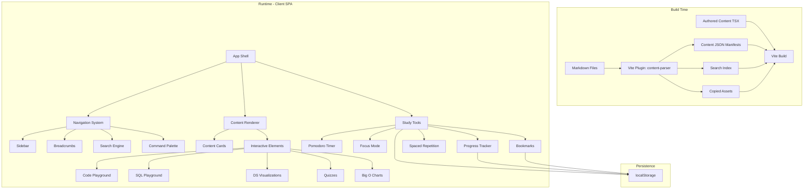
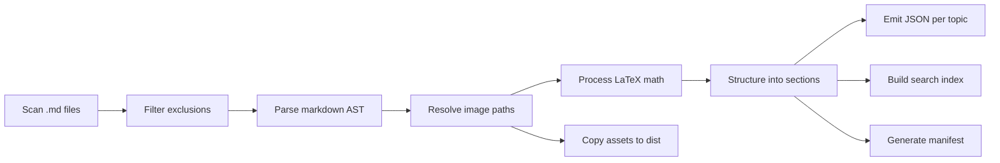
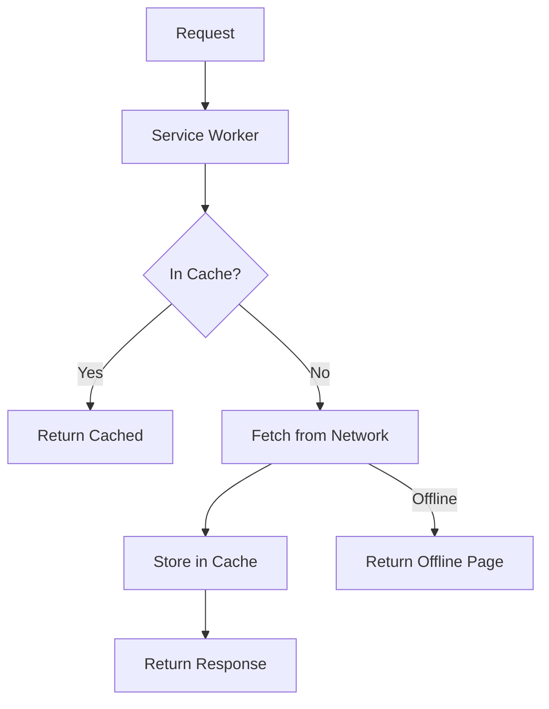

# Design Document

## Overview

This design describes the architecture for an interactive CS reference guide — a React + Vite single-page application that transforms a repository of markdown notes into a structured, ADHD-friendly study tool. The app parses existing markdown content (DSA, Git, Grokking Algorithms, Cracking the Coding Interview, Designing Data-Intensive Applications, and Infosys Lex training materials) and combines it with built-in authored content covering OS, Networking, SQL, Design Patterns, System Design, Docker/K8s, Testing, Behavioral Interview Prep, and Coding Patterns.

The application prioritizes focus management, chunked content delivery, and interactive engagement over passive reading. It runs entirely client-side, stores all user state in localStorage, and deploys as a static bundle.

### Key Design Decisions

1. **Build-time content processing**: Markdown is parsed at build time via a Vite plugin, producing JSON content manifests. This avoids runtime parsing overhead and enables full offline support.
2. **Client-side search with pre-built index**: A search index is generated at build time using FlexSearch, enabling sub-200ms full-text search without a server.
3. **Component-based content rendering**: Parsed markdown maps to React components, allowing interactive elements (playgrounds, quizzes, visualizations) to be injected inline.
4. **localStorage for all persistence**: Progress, bookmarks, spaced repetition schedules, and timer state persist in localStorage with graceful degradation.
5. **Code-splitting by topic**: Each topic loads on demand via React.lazy, keeping initial bundle size small for the 3-second load target.

## Architecture



### High-Level Data Flow

1. **Build time**: The Vite plugin recursively scans the repository, parses `.md` files into structured JSON (headings, sections, code blocks, images), generates a FlexSearch index, and copies referenced assets.
2. **Initial load**: The app shell renders with the sidebar navigation tree (from the content manifest), loads the last-viewed topic from localStorage, and registers the service worker for offline caching.
3. **Navigation**: User navigates via sidebar, search, command palette, or breadcrumbs. The selected topic's content JSON is lazy-loaded and rendered as chunked cards.
4. **Interaction**: Users engage with quizzes, playgrounds, and visualizations embedded within content cards. Progress is tracked via scroll observation.
5. **Study tools**: Pomodoro timer, focus mode, and daily goals operate as global overlays/headers, persisting state to localStorage on every tick/change.

## Components and Interfaces

### Core Application Components

```typescript
// App Shell - root layout
interface AppShellProps {
  children: React.ReactNode;
}

// Navigation System
interface NavigationState {
  categories: Category[];
  currentPath: string[];
  expandedCategories: Set<string>;
  visitedTopics: Set<string>;
}

interface Category {
  id: string;
  name: string;
  icon: string;
  topics: Topic[];
}

interface Topic {
  id: string;
  slug: string;
  title: string;
  category: string;
  sections: ContentSection[];
  source: 'parsed' | 'authored';
  wordCount: number;
}
```

### Content System

```typescript
// Content Parser Output (build-time)
interface ParsedContent {
  id: string;
  slug: string;
  title: string;
  category: string;
  sections: ContentSection[];
  images: ImageRef[];
  codeBlocks: CodeBlock[];
  mathExpressions: MathExpression[];
  metadata: ContentMetadata;
}

interface ContentSection {
  id: string;
  heading: string;
  level: 1 | 2 | 3 | 4 | 5 | 6;
  content: ContentNode[];
  wordCount: number;
  subsections: ContentSection[];
}

type ContentNode =
  | { type: 'paragraph'; text: string }
  | { type: 'code'; language: string; code: string; runnable: boolean }
  | { type: 'image'; src: string; alt: string; originalPath: string }
  | { type: 'math'; expression: string; display: 'inline' | 'block' }
  | { type: 'list'; ordered: boolean; items: string[] }
  | { type: 'table'; headers: string[]; rows: string[][] }
  | { type: 'blockquote'; text: string }
  | { type: 'interactive'; interactiveType: InteractiveType; config: unknown }
  | { type: 'unparseable'; raw: string };

type InteractiveType = 'quiz' | 'playground' | 'visualization' | 'sql-playground' | 'bigo-chart';
```

### Search Engine

```typescript
interface SearchEngine {
  search(query: string): SearchResult[];
  index: FlexSearchIndex;
}

interface SearchResult {
  topicId: string;
  sectionId: string;
  title: string;
  snippet: string;
  matchedTerms: string[];
  score: number;
}

interface FlexSearchIndex {
  add(id: string, content: string): void;
  search(query: string, options?: { limit: number }): string[];
}
```

### Study Tools

```typescript
// Pomodoro Timer
interface PomodoroState {
  mode: 'work' | 'break' | 'idle';
  workDuration: number;      // minutes (5-90)
  breakDuration: number;     // minutes (1-30)
  remainingSeconds: number;
  isRunning: boolean;
  completedPomodoros: number;
}

// Focus Timer / Study Session
interface StudySession {
  startTime: number;
  elapsedSeconds: number;
  isActive: boolean;
  lastTopicId: string;
  lastSectionId: string;
}

// Progress Tracker
interface ProgressState {
  completedSections: Record<string, Set<string>>; // topicId -> sectionIds
  topicProgress: Record<string, number>;           // topicId -> percentage
  overallProgress: number;
  dailyGoal: DailyGoal;
  weeklyStats: WeeklyStats;
}

interface DailyGoal {
  targetMinutes: number;     // 5-480
  elapsedMinutes: number;
  date: string;              // ISO date string
}

// Spaced Repetition
interface SpacedRepetitionState {
  schedules: Record<string, RepetitionSchedule>; // topicId -> schedule
}

interface RepetitionSchedule {
  topicId: string;
  completedDate: string;
  currentInterval: number;   // index into [1, 3, 7, 14, 30]
  nextReviewDate: string;
  reviewCount: number;
}

// Bookmarks
interface BookmarkState {
  bookmarks: Bookmark[];
}

interface Bookmark {
  id: string;
  topicId: string;
  sectionId: string;
  title: string;
  createdAt: string;
}
```

### Command Palette

```typescript
interface CommandPaletteItem {
  id: string;
  label: string;
  type: 'topic' | 'bookmark' | 'action';
  action: () => void;
  keywords: string[];
}

interface CommandPaletteState {
  isOpen: boolean;
  query: string;
  results: CommandPaletteItem[];
  selectedIndex: number;
}
```

### Interactive Elements

```typescript
// Code Playground
interface PlaygroundProps {
  initialCode: string;
  language: 'javascript' | 'pseudocode';
  timeoutMs: number; // default 5000
}

interface PlaygroundState {
  code: string;
  output: string;
  error: string | null;
  isRunning: boolean;
}

// SQL Playground
interface SQLPlaygroundProps {
  schema: SQLSchema;
  sampleData: Record<string, unknown[]>;
  initialQuery?: string;
}

// Quiz
interface Quiz {
  id: string;
  topicId: string;
  sectionId: string;
  questions: QuizQuestion[];
}

interface QuizQuestion {
  id: string;
  type: 'multiple-choice' | 'fill-in-the-blank';
  prompt: string;
  options?: string[];        // 4 options for multiple-choice
  correctAnswer: string;
  explanation: string;       // max 150 chars for correct, step-by-step for incorrect
}

// Data Structure Visualization
interface VisualizationProps {
  type: 'bst' | 'bfs' | 'dfs' | 'linked-list' | 'heap' | 'graph';
  initialData: unknown;
  stepDurationMs: number;    // 500-2000
}

interface VisualizationControls {
  play: () => void;
  pause: () => void;
  stepForward: () => void;
  reset: () => void;
}
```

## Data Models

### Content Manifest (Generated at Build Time)

```json
{
  "categories": [
    {
      "id": "data-structures",
      "name": "Data Structures",
      "topics": [
        {
          "id": "array",
          "slug": "data-structures/array",
          "title": "Array",
          "source": "parsed",
          "sectionCount": 5,
          "wordCount": 1200,
          "contentPath": "/content/data-structures/array.json"
        }
      ]
    }
  ],
  "totalTopics": 150,
  "totalSections": 800,
  "buildTimestamp": "2025-01-15T10:00:00Z"
}
```

### localStorage Schema

All user data is stored under namespaced keys in localStorage:

| Key | Type | Description |
|-----|------|-------------|
| `csguide:progress` | `ProgressState` | Section completion, topic percentages |
| `csguide:bookmarks` | `BookmarkState` | Saved bookmarks |
| `csguide:pomodoro` | `PomodoroState` | Timer configuration and state |
| `csguide:session` | `StudySession` | Active study session data |
| `csguide:spaced-rep` | `SpacedRepetitionState` | Review schedules |
| `csguide:daily-goal` | `DailyGoal` | Daily study target and progress |
| `csguide:weekly-stats` | `WeeklyStats` | 7-day rolling study data |
| `csguide:last-viewed` | `{ topicId, sectionId, timestamp }` | Resume prompt data |
| `csguide:nav-state` | `{ expandedCategories }` | Sidebar expansion state |

### Content Category Mapping

The parser maps repository directories to categories:

| Directory/Source | Category | Type |
|-----------------|----------|------|
| `Data Structures and Algorithms/` | Data Structures, Algorithms | parsed |
| `Git/` | Git | parsed |
| `Grokking Algorithms/` | Algorithms | parsed |
| `Cracking the Coding Interview` | Interview Prep | parsed |
| `Designing Data-Intensive Applications` | System Design | parsed |
| `Infosys/Java*` | Java | parsed |
| `Infosys/Spring*` | Spring Framework | parsed |
| `Infosys/Apache Maven`, `Infosys/Gradle` | Build Tools | parsed |
| `Infosys/MongoDB` | Databases | parsed |
| `Infosys/Introduction to Apache Kafka` | Messaging | parsed |
| `Infosys/Introduction to Agentic AI` | AI | parsed |
| Built-in authored | OS, Networking, SQL, Design Patterns, System Design, Docker/K8s, Testing, Behavioral, Coding Patterns | authored |

### Vite Plugin: Content Parser Pipeline



**Exclusion rules** (per Requirement 7.6):
- Files with `.tex` extension
- Files with `.css` extension
- Files within `public/` directory
- Files within hidden directories (`.kiro/`, etc.)

### Service Worker Caching Strategy



Strategy: **Cache-first** for content JSON and assets, **network-first** for the app shell during development.


## Correctness Properties

*A property is a characteristic or behavior that should hold true across all valid executions of a system — essentially, a formal statement about what the system should do. Properties serve as the bridge between human-readable specifications and machine-verifiable correctness guarantees.*

### Property 1: Parser structural preservation

*For any* valid markdown file containing headings, paragraphs, code blocks, images, and LaTeX math expressions, parsing the file SHALL produce a structured output where: H1 maps to Topic, H2 maps to ContentSection, H3+ maps to subsections; every code block produces a `code` node with the correct language; every image reference produces an `image` node; and every LaTeX delimiter produces a `math` node with the correct display mode.

**Validates: Requirements 7.1, 7.2, 7.3, 7.4**

### Property 2: Image path resolution

*For any* markdown file at path P containing a relative image reference R, the resolved path SHALL equal the directory of P joined with R, normalized to remove `../` traversals correctly.

**Validates: Requirements 7.5**

### Property 3: File exclusion filter

*For any* file path, the exclusion filter SHALL return true (exclude) if and only if the path ends with `.tex`, ends with `.css`, is within the `public/` directory, or is within a directory whose name starts with a dot.

**Validates: Requirements 7.6**

### Property 4: Breadcrumb generation

*For any* valid topic path (category → topic → section), the generated breadcrumb array SHALL have length equal to the path depth, with each breadcrumb label matching the corresponding path segment's display name, and the last breadcrumb SHALL not be a link.

**Validates: Requirements 2.2**

### Property 5: Search result limit and relevance

*For any* non-empty search query against an indexed content set, the search engine SHALL return at most 10 results, and every returned result SHALL contain at least one term from the query (or a stemmed variant) in its indexed content.

**Validates: Requirements 2.3, 2.4**

### Property 6: Content collapse decision

*For any* content section, the collapse function SHALL return `collapsed=true` if and only if the section's word count exceeds 300 OR the section's paragraph count exceeds 3 (whichever threshold is reached first), and the visible portion SHALL contain at most 300 words.

**Validates: Requirements 3.1, 3.4**

### Property 7: Progress percentage calculation

*For any* topic with N total sections and M completed sections (where 0 ≤ M ≤ N and N > 0), the progress percentage SHALL equal floor(M / N * 100), and the overall progress SHALL equal floor(total completed sections / total sections * 100).

**Validates: Requirements 3.6, 6.2**

### Property 8: Answer verification correctness

*For any* quiz question with a defined correct answer, submitting the correct answer SHALL return `{ correct: true }` and submitting any other answer SHALL return `{ correct: false, correctAnswer: <expected> }`.

**Validates: Requirements 4.4, 4.5**

### Property 9: Pomodoro timer state machine

*For any* valid Pomodoro configuration (work: 5-90 min, break: 1-30 min), the timer state machine SHALL transition from `work → break` when the work timer reaches 0, from `break → work` when the break timer reaches 0, and from any state to `idle` when stopped. Starting from idle SHALL always enter `work` state with remainingSeconds equal to workDuration × 60.

**Validates: Requirements 5.1, 5.2, 5.3**

### Property 10: Daily goal reset

*For any* daily goal state with a stored date D, if the current local date is different from D, the elapsed minutes SHALL reset to 0 while the target minutes SHALL remain unchanged.

**Validates: Requirements 5.6**

### Property 11: State persistence round-trip

*For any* valid application state (progress, bookmarks, session, spaced repetition schedules), serializing to localStorage and then deserializing SHALL produce a state equivalent to the original.

**Validates: Requirements 5.8, 6.5, 9.6**

### Property 12: Scroll completion threshold

*For any* content section and scroll percentage value, the section SHALL be marked as complete if and only if the scroll percentage is ≥ 90%.

**Validates: Requirements 6.1**

### Property 13: Bookmark toggle idempotence

*For any* content section, bookmarking it SHALL add it to the bookmarks list (increasing length by 1), and bookmarking it again SHALL remove it (decreasing length by 1), such that toggling twice returns the bookmarks list to its original state.

**Validates: Requirements 6.3, 6.4**

### Property 14: Resume prompt timing

*For any* last session timestamp T and current timestamp C, the "Continue where you left off" prompt SHALL be shown if and only if (C - T) > 60 seconds.

**Validates: Requirements 6.7**

### Property 15: Weekly stats aggregation

*For any* set of daily study records over the past 7 days, the weekly summary SHALL report total minutes equal to the sum of all daily elapsed minutes, and topics covered equal to the count of distinct topic IDs studied across all 7 days.

**Validates: Requirements 6.8**

### Property 16: Spaced repetition interval advancement

*For any* topic with a current interval index I in the sequence [1, 3, 7, 14, 30], completing a review SHALL advance to index I+1 (capped at the last index), and the next review date SHALL equal today + intervals[I+1] days. Resetting ("Still struggling") SHALL always set the index to 0 regardless of current position. After completing the final interval (30 days), the next review SHALL be scheduled for 30 days later.

**Validates: Requirements 9.1, 9.3, 9.4, 9.5**

### Property 17: Spaced repetition due list

*For any* set of topic schedules and a current date, the "Due for Review" list SHALL contain only topics where nextReviewDate ≤ currentDate, SHALL be sorted by (currentDate - nextReviewDate) descending (most overdue first), and SHALL contain at most 20 items.

**Validates: Requirements 9.2**

### Property 18: Command palette population

*For any* set of topics T, bookmarks B, and actions A, the command palette items list SHALL have length |T| + |B| + |A|, with each item labeled with its correct type ('topic', 'bookmark', or 'action').

**Validates: Requirements 10.2**

### Property 19: Fuzzy matching with result limit

*For any* query string and list of command palette items, the fuzzy filter SHALL return at most 10 results, and every returned item SHALL have a fuzzy match score > 0 against the query.

**Validates: Requirements 10.3**

### Property 20: Keyboard navigation bounds

*For any* list of N items (N > 0) and any sequence of Up/Down arrow key presses, the selected index SHALL always remain in the range [0, N-1].

**Validates: Requirements 10.6**

### Property 21: Content view word/sentence constraints

*For any* cheat sheet content, the word count SHALL not exceed 500. *For any* ELI5 summary, the sentence count SHALL not exceed 3.

**Validates: Requirements 20.1, 20.2**

## Error Handling

### Content Parser Errors

| Error Scenario | Handling Strategy |
|---------------|-------------------|
| Unparseable markdown syntax | Render parseable portions, insert `<UnparseableIndicator>` component at failure location (Req 7.7) |
| Missing image file | Render placeholder with alt text and broken-image icon |
| Invalid LaTeX expression | Render raw LaTeX string in a monospace `<code>` block |
| Empty markdown file | Skip file, log warning during build |
| Circular relative paths | Normalize path, log warning if resolution fails |

### Runtime Errors

| Error Scenario | Handling Strategy |
|---------------|-------------------|
| Code playground timeout (>5s) | Kill execution via Web Worker termination, display "Execution timed out after 5 seconds" (Req 4.2) |
| Code playground runtime error | Catch error, display error message with stack trace in output panel |
| localStorage full | Display persistent warning banner, fall back to in-memory state (Req 6.6) |
| localStorage unavailable | Same as above — detect via try/catch on setItem |
| Search index corruption | Rebuild index from content manifest on next load |
| Service worker registration failure | App functions normally without offline support, log warning |
| SQL playground query error | Display SQL error message in results panel |

### State Recovery

- **Corrupted localStorage data**: Wrap all reads in try/catch with JSON.parse. If parsing fails, reset that key to default state and show a one-time notification.
- **Version migration**: Store a schema version number in `csguide:version`. On load, if version is outdated, run migration functions to transform old state shapes.
- **Tab visibility**: Use `document.visibilityState` to pause timers when tab is hidden, preventing drift in study time tracking.

## Testing Strategy

### Property-Based Testing

**Library**: [fast-check](https://github.com/dubzzz/fast-check) (TypeScript/JavaScript PBT library)

**Configuration**: Minimum 100 iterations per property test.

**Tag format**: Each test tagged with `Feature: cs-reference-guide, Property {N}: {title}`

Property-based tests target the pure logic layer:
- Content parser (structural preservation, path resolution, exclusion filter)
- Search engine (result limits, relevance)
- Content presentation logic (collapse decisions, word counting)
- Progress calculations (percentages, thresholds)
- Timer state machines (Pomodoro transitions, daily reset)
- Persistence layer (serialization round-trips)
- Spaced repetition scheduling (interval math, due list filtering)
- Command palette (population, fuzzy matching, navigation bounds)
- Content constraints (word/sentence limits)

### Unit Tests (Example-Based)

Unit tests cover specific scenarios and integration points:
- Navigation sidebar renders correct category structure
- Breadcrumb renders for known topic paths
- Code copy button copies to clipboard
- Quiz UI displays feedback within timing requirements
- Command palette opens/closes on keyboard shortcuts
- View toggle switches between Full/Cheat Sheet/ELI5
- Authored content sections exist for all required topics (Reqs 11-19)

### Integration Tests

- Full build pipeline: markdown files → JSON manifests → working app
- Offline mode: service worker caches all content after initial load
- SQL playground: queries execute against sample dataset
- Code playground: Web Worker execution with timeout
- Keyboard accessibility: Tab navigation through all interactive elements

### Visual/Snapshot Tests

- Responsive layout at 320px, 768px, 1024px, 1440px, 2560px
- Focus mode opacity changes
- Progress indicators render correctly at 0%, 50%, 100%
- Design token application from guide-system.css

### Performance Tests

- Initial load time < 3 seconds on simulated 10 Mbps / 20ms latency
- Search results appear within 200ms of keystroke
- Command palette filters within 100ms
- Lazy-loaded topic chunks < 50KB each
