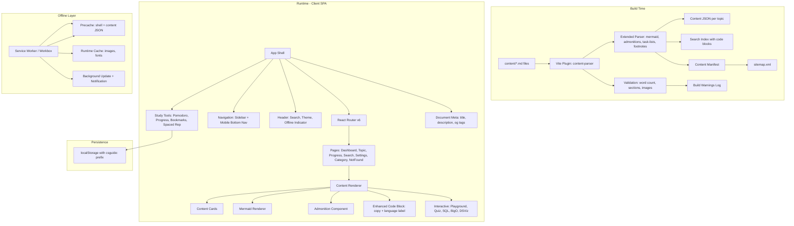
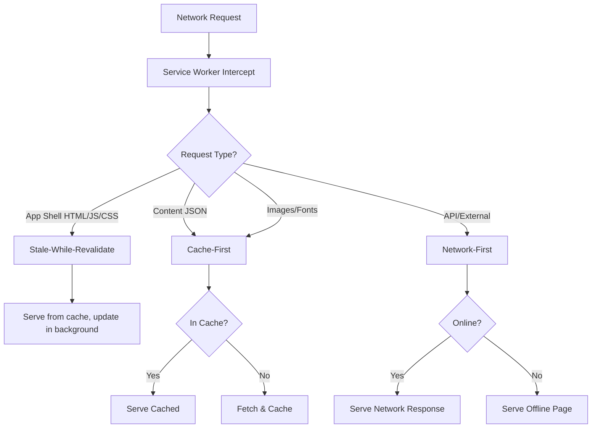
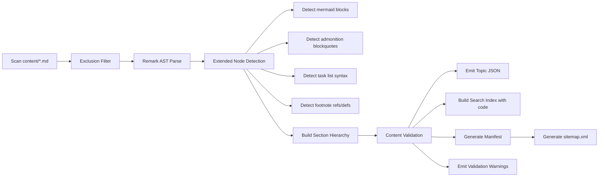

# Design Document

## Overview

This design describes the architectural changes needed to overhaul the CS Reference Guide from a workspace-root-scanning content pipeline into a self-contained, mobile-responsive, offline-capable Progressive Web App. The overhaul extends the existing React + Vite SPA architecture rather than replacing it, adding new content node types (Mermaid, admonitions, task lists, footnotes), new pages/routes, enhanced search, PWA support via service workers, mobile responsiveness, and deployment readiness.

### Key Design Decisions

1. **Content root migration**: The Vite plugin's `contentRoot` changes from the workspace root (`..`) to `cs-reference-guide/content/`, making the app self-contained. CATEGORY_MAPPINGS are rewritten to match the new `content/{category}/` directory structure.
2. **Extended markdown parsing**: The existing remark-based parser gains new node types (mermaid, admonition, task-list, footnote) without changing the core section-building algorithm.
3. **Mermaid client-side rendering**: Mermaid diagrams are parsed at build time into `mermaid` content nodes and rendered client-side using the `mermaid` library with a 5-second timeout and error fallback.
4. **Service worker with Workbox**: PWA offline support uses Workbox for precaching the app shell and content JSON, with a cache-first strategy for content and stale-while-revalidate for the shell.
5. **Mobile-first responsive overhaul**: CSS breakpoints at 768px control sidebar visibility, bottom nav bar, and content card width. Touch targets minimum 44×44px.
6. **New routes added incrementally**: `/progress`, `/search`, `/settings`, `/category/:categorySlug` are lazy-loaded within the existing `AppShell` layout.
7. **Build-time validation pipeline**: Word count, section presence, and image reference validation run during the content build step, producing warnings without failing the build.
8. **Sitemap and meta tags**: Generated at build time from the content manifest for SEO and deployment readiness.

## Architecture



### Data Flow Changes from Original Design

1. **Content root**: Pipeline now scans exclusively from `cs-reference-guide/content/` (not workspace root).
2. **Extended parsing**: Mermaid blocks, admonitions, task lists, and footnotes produce new ContentNode types.
3. **Validation step**: After parsing, the pipeline validates word counts, required sections, and image references, emitting warnings.
4. **Search indexing**: Code block content is concatenated with prose for full-text indexing.
5. **Sitemap generation**: A `sitemap.xml` is generated alongside the manifest.
6. **Service worker**: Registered on first load, precaches all content JSON and shell assets.
7. **Meta tags**: Updated dynamically per route using a `useDocumentMeta` hook.

## Components and Interfaces

### Extended Content Node Types

The existing `ContentNode` union type is extended with new variants:

```typescript
export type ContentNode =
  | { type: 'paragraph'; text: string }
  | { type: 'code'; language: string; code: string; runnable: boolean }
  | { type: 'image'; src: string; alt: string; originalPath: string }
  | { type: 'math'; expression: string; display: 'inline' | 'block' }
  | { type: 'list'; ordered: boolean; items: string[] }
  | { type: 'table'; headers: string[]; rows: string[][] }
  | { type: 'blockquote'; text: string }
  | { type: 'interactive'; interactiveType: InteractiveType; config: unknown }
  | { type: 'mermaid'; source: string }
  | { type: 'admonition'; admonitionType: 'note' | 'warning' | 'tip'; content: string }
  | { type: 'task-list'; items: TaskListItem[] }
  | { type: 'footnote-ref'; identifier: string; index: number }
  | { type: 'footnote-def'; identifier: string; content: string }
  | { type: 'unparseable'; raw: string };

export interface TaskListItem {
  checked: boolean;
  text: string;
}
```


### Updated Category Mappings

The `CATEGORY_MAPPINGS` array is replaced to match the new `content/` directory structure:

```typescript
const CATEGORY_MAPPINGS: CategoryMapping[] = [
  { pattern: 'content/backend', category: 'Backend' },
  { pattern: 'content/frontend', category: 'Frontend' },
  { pattern: 'content/infrastructure', category: 'Infrastructure' },
  { pattern: 'content/data-structures-and-algorithms', category: 'Data Structures & Algorithms' },
  { pattern: 'content/system-design', category: 'System Design' },
  { pattern: 'content/interview-prep', category: 'Interview Prep' },
  { pattern: 'content/git', category: 'Git' },
];
```

### New Page Components

```typescript
// Progress Dashboard Page
interface ProgressPageProps {}
// Renders per-category completion bars, overall stats, streak data

// Search Results Page
interface SearchPageProps {}
// Reads ?q= param, displays section-level results with category filter

// Settings Page
interface SettingsPageProps {}
// Theme toggle, daily goal slider, notification toggle

// Category Overview Page
interface CategoryPageProps {}
// Lists all topics in a category with completion status
```

### Updated Route Configuration

```typescript
// App.tsx routes (all lazy-loaded within AppShell)
const Dashboard = lazy(() => import('./pages/Dashboard'));
const TopicPage = lazy(() => import('./pages/TopicPage'));
const ProgressPage = lazy(() => import('./pages/ProgressPage'));
const SearchPage = lazy(() => import('./pages/SearchPage'));
const SettingsPage = lazy(() => import('./pages/SettingsPage'));
const CategoryPage = lazy(() => import('./pages/CategoryPage'));
const CheatSheets = lazy(() => import('./pages/CheatSheets'));
const NotFound = lazy(() => import('./pages/NotFound'));

// Route definitions
<Route element={<AppShell />}>
  <Route index element={<Dashboard />} />
  <Route path="/topic/:categorySlug/:topicSlug" element={<TopicPage />} />
  <Route path="/progress" element={<ProgressPage />} />
  <Route path="/search" element={<SearchPage />} />
  <Route path="/settings" element={<SettingsPage />} />
  <Route path="/category/:categorySlug" element={<CategoryPage />} />
  <Route path="/cheat-sheets" element={<CheatSheets />} />
  <Route path="*" element={<NotFound />} />
</Route>
```

### Mermaid Renderer Component

```typescript
interface MermaidRendererProps {
  source: string;
  timeoutMs?: number; // default 5000
}

interface MermaidRendererState {
  status: 'loading' | 'rendered' | 'error' | 'timeout';
  svg: string | null;
  errorMessage: string | null;
}
```

The component:
1. Calls `mermaid.render()` with the source text
2. Sets a 5-second timeout via `AbortController` or `setTimeout`
3. On success: injects SVG via `dangerouslySetInnerHTML`
4. On error: displays raw source in a `<pre>` block with an error label
5. On timeout: displays raw source with a "Rendering timed out" label

### Admonition Component

```typescript
interface AdmonitionProps {
  type: 'note' | 'warning' | 'tip';
  content: string;
}
```

Renders with:
- Type-specific icon (ℹ️ note, ⚠️ warning, 💡 tip)
- Type-specific background color and left border
- Content rendered as markdown-like text

### Enhanced Code Block Component

```typescript
interface EnhancedCodeBlockProps {
  language: string;
  code: string;
  runnable: boolean;
}

interface CopyButtonState {
  status: 'idle' | 'copied' | 'error';
}
```

Features:
- Language label in header (hidden when language is empty)
- Copy button that writes to `navigator.clipboard.writeText()`
- "Copied" confirmation state for 2 seconds
- Error state on clipboard failure for 1 second

### Mobile Navigation Components

```typescript
// Hamburger menu trigger for sidebar on mobile
interface MobileMenuProps {
  isOpen: boolean;
  onToggle: () => void;
}

// Bottom navigation bar (mobile only, < 768px)
interface BottomNavProps {
  items: BottomNavItem[];
}

interface BottomNavItem {
  icon: string;
  label: string;
  path: string;
  isActive: boolean;
}
```

### Service Worker Registration

```typescript
// src/utils/service-worker.ts
interface SWRegistrationResult {
  registered: boolean;
  error?: string;
}

interface SWUpdateEvent {
  type: 'update-available' | 'cache-complete' | 'cache-failed';
  message: string;
}
```

### Document Meta Hook

```typescript
// src/hooks/useDocumentMeta.ts
interface DocumentMeta {
  title: string;        // max 60 chars
  description: string;  // max 160 chars
  ogImage?: string;
}

function useDocumentMeta(meta: DocumentMeta): void;
```

### Content Validation Types

```typescript
// src/plugins/content-validator.ts
interface ValidationResult {
  filePath: string;
  warnings: ValidationWarning[];
}

interface ValidationWarning {
  type: 'low-word-count' | 'stub-content' | 'missing-section' | 'broken-image' | 'external-image' | 'orphaned-image' | 'section-too-short';
  message: string;
  details?: Record<string, unknown>;
}

interface ValidationConfig {
  minWordCount: number;          // 1500
  stubThreshold: number;         // 200
  minSectionWords: number;       // 100
  requiredSections: string[];    // ["When to Use", "Common Pitfalls", "Interview Questions", "Real-World Use Cases", "Production Tips"]
}
```

### Search Enhancement Types

```typescript
// Extended search result with section-level granularity
interface EnhancedSearchResult {
  topicId: string;
  topicTitle: string;
  sectionId: string;
  sectionTitle: string;
  category: string;
  snippet: string;       // max 120 chars, centered on match
  matchedTerms: string[];
  score: number;
}

// Category filter for search
interface SearchFilter {
  category: string | null; // null = all categories
}
```

### Analytics Event System

```typescript
// src/utils/analytics.ts
type AnalyticsEvent =
  | { type: 'page_view'; path: string }
  | { type: 'search_query'; query: string }
  | { type: 'topic_complete'; topicId: string };

type AnalyticsSubscriber = (event: AnalyticsEvent) => void;

interface AnalyticsHooks {
  subscribe(handler: AnalyticsSubscriber): () => void;
  trackPageView(path: string): void;
  trackSearch(query: string): void;
  trackTopicComplete(topicId: string): void;
}
```

### Sitemap Generator

```typescript
// src/plugins/sitemap-generator.ts
interface SitemapEntry {
  loc: string;
  lastmod?: string;
  changefreq?: 'daily' | 'weekly' | 'monthly';
  priority?: number;
}

function generateSitemap(manifest: ContentManifest, baseUrl: string): string;
```


## Data Models

### Updated Content Manifest

The manifest schema remains the same but now reflects the new category structure:

```json
{
  "categories": [
    {
      "id": "backend",
      "name": "Backend",
      "topics": [
        {
          "id": "docker-containerization",
          "slug": "backend/docker-containerization",
          "title": "Docker & Containerization",
          "source": "parsed",
          "sectionCount": 7,
          "wordCount": 2500,
          "contentPath": "/content/backend/docker-containerization.json"
        }
      ]
    },
    {
      "id": "frontend",
      "name": "Frontend",
      "topics": [...]
    },
    {
      "id": "infrastructure",
      "name": "Infrastructure",
      "topics": [...]
    },
    {
      "id": "data-structures--algorithms",
      "name": "Data Structures & Algorithms",
      "topics": [...]
    },
    {
      "id": "system-design",
      "name": "System Design",
      "topics": [...]
    },
    {
      "id": "interview-prep",
      "name": "Interview Prep",
      "topics": [...]
    },
    {
      "id": "git",
      "name": "Git",
      "topics": [...]
    }
  ],
  "totalTopics": 50,
  "totalSections": 300,
  "buildTimestamp": "2025-01-15T10:00:00Z"
}
```

### PWA Manifest (manifest.json)

```json
{
  "name": "CS Reference Guide",
  "short_name": "CS Guide",
  "description": "Interactive Computer Science reference for senior-level interview preparation",
  "start_url": "/",
  "display": "standalone",
  "background_color": "#1a1a2e",
  "theme_color": "#6366f1",
  "icons": [
    { "src": "/icons/icon-192.png", "sizes": "192x192", "type": "image/png" },
    { "src": "/icons/icon-512.png", "sizes": "512x512", "type": "image/png" }
  ]
}
```

### Service Worker Caching Strategy



**Precache list** (installed on SW activation):
- `index.html` (app shell)
- All JS/CSS chunks from the build
- `content-manifest.json`
- All `content/{category}/{topic}.json` files
- `search-index.json`

**Runtime caching**:
- Images: Cache-first with 30-day expiration
- Fonts: Cache-first with 365-day expiration

### Updated Vite Plugin Configuration

```typescript
// vite.config.ts changes
contentParserPlugin({
  contentRoot: path.resolve(__dirname, 'content'),  // Changed from '..'
})
```

### Content Directory Structure

```
cs-reference-guide/content/
├── backend/
│   ├── java.md
│   ├── spring-framework.md
│   ├── mongodb.md
│   ├── apache-kafka.md
│   ├── apache-maven.md
│   ├── gradle.md
│   ├── rabbitmq.md
│   ├── resilience4j.md
│   ├── mapstruct.md
│   ├── sql-performance-tuning.md
│   ├── security.md
│   └── incident-response.md
├── frontend/
│   ├── react.md
│   ├── typescript.md
│   ├── angular.md
│   ├── nextjs.md
│   ├── html-css.md
│   └── javascript.md
├── infrastructure/
│   ├── docker-containerization.md
│   ├── kubernetes-eks.md
│   ├── aws-services.md
│   ├── ci-cd-pipelines.md
│   ├── linux-administration.md
│   └── observability.md
├── data-structures-and-algorithms/
│   ├── array.md
│   ├── big-o-notation.md
│   ├── graph.md
│   ├── heap.md
│   ├── list.md
│   ├── map.md
│   ├── queue.md
│   ├── ring-buffer.md
│   ├── sets.md
│   ├── tree.md
│   └── trie.md
├── system-design/
│   ├── system-design.md
│   ├── design-patterns.md
│   ├── operating-systems.md
│   └── networking.md
├── interview-prep/
│   ├── cracking-the-coding-interview.md
│   ├── grokking-algorithms.md
│   └── behavioral-prep.md
└── git/
    ├── git-commands.md
    ├── git-branching.md
    ├── gitignore.md
    ├── local-vs-remote.md
    ├── merge-conflicts.md
    ├── pull-requests.md
    └── what-is-git.md
```

### localStorage Schema (Unchanged + New Keys)

Existing keys remain unchanged. New additions:

| Key | Type | Description |
|-----|------|-------------|
| `csguide:view-preference` | `'full' \| 'cheat-sheet' \| 'eli5'` | Content view mode preference |
| `csguide:settings` | `{ theme, dailyGoalTopics, notifications }` | User settings |
| `csguide:recent-topics` | `Array<{ topicId, timestamp }>` | Recently studied topics (max 5) |
| `csguide:sw-version` | `string` | Service worker cache version |

### Extended Parser Pipeline




## Correctness Properties

*A property is a characteristic or behavior that should hold true across all valid executions of a system — essentially, a formal statement about what the system should do. Properties serve as the bridge between human-readable specifications and machine-verifiable correctness guarantees.*

### Property 1: Prose word count excludes non-prose elements

*For any* markdown string containing a mix of prose paragraphs, fenced code blocks, headings, and front-matter, the word count function SHALL return a count that includes only words from paragraph text, list items, blockquotes, and table cells — never counting words inside code blocks, heading text, or front-matter delimiters.

**Validates: Requirements 1.1, 1.6, 1.7, 1.8**

### Property 2: Extended markdown node classification

*For any* markdown string containing fenced code blocks with language `mermaid`, blockquotes starting with `[!NOTE]`, `[!WARNING]`, or `[!TIP]`, task list syntax (`- [ ]` / `- [x]`), and footnote references/definitions, the parser SHALL produce content nodes where: mermaid blocks become `mermaid` nodes (not `code` nodes), recognized admonition blockquotes become `admonition` nodes (not `blockquote` nodes), task lists become `task-list` nodes preserving checked state, footnote references become `footnote-ref` nodes, and footnote definitions become `footnote-def` nodes. Unrecognized admonition types SHALL produce standard `blockquote` nodes.

**Validates: Requirements 14.1, 15.1, 15.3, 15.4, 15.5**

### Property 3: Image reference validation

*For any* parsed topic containing image nodes, the image validator SHALL flag a node as broken if and only if the resolved path does not correspond to an existing file within `cs-reference-guide/content/`, and SHALL flag a node as external if and only if its `src` starts with `http://` or `https://`.

**Validates: Requirements 2.1, 2.4, 2.5**

### Property 4: Orphaned image detection

*For any* set of `.png` files within `cs-reference-guide/content/` and any set of image references across all Topic_Files, the orphan detector SHALL return exactly the set of image files whose filename does not appear in any image reference — i.e., the set difference of all image files minus referenced image files.

**Validates: Requirements 2.3, 7.2**

### Property 5: Category resolution completeness

*For any* file path matching the pattern `content/{category-dir}/{filename}.md` where `{category-dir}` is one of `backend`, `frontend`, `infrastructure`, `data-structures-and-algorithms`, `system-design`, `interview-prep`, or `git`, the `resolveCategory` function SHALL return a non-null category string. For any file path not matching any mapped directory pattern, it SHALL return null.

**Validates: Requirements 6.9, 8.1, 8.3**

### Property 6: Search index includes code block content

*For any* parsed topic containing code block nodes, the search document builder SHALL produce a searchable text string that contains the full `code` field content of every code block in that topic, concatenated with the prose text from paragraphs, lists, and blockquotes.

**Validates: Requirements 17.1**

### Property 7: Search category filter correctness

*For any* set of search results and a selected category filter, applying the filter SHALL return only results whose `category` field exactly matches the selected category. When no filter is selected (null), all results SHALL be returned unchanged.

**Validates: Requirements 17.2, 17.3**

### Property 8: Search snippet generation constraints

*For any* section text and a matching search term, the generated snippet SHALL have length ≤ 120 characters, SHALL contain the matched term (or a prefix thereof if the term appears near the text boundary), and SHALL be centered around the first occurrence of the term within the section text.

**Validates: Requirements 17.4**

### Property 9: Sitemap generation from manifest

*For any* content manifest with N topics across M categories, the generated sitemap XML SHALL contain exactly N `<url>` elements, each with a `<loc>` child whose text value is a valid absolute URL path matching the topic's route pattern `/topic/{categorySlug}/{topicSlug}`. The XML SHALL be well-formed with a root `<urlset>` element.

**Validates: Requirements 21.3**

### Property 10: Document meta tag truncation

*For any* topic title string T and section summary string S, the `useDocumentMeta` hook SHALL set `document.title` to T truncated to at most 60 characters and `meta[name="description"]` to S truncated to at most 160 characters. Truncation SHALL preserve whole words where possible and append an ellipsis when truncated.

**Validates: Requirements 21.1, 21.2**

### Property 11: Reading time calculation

*For any* topic with total word count W (where W ≥ 0), the reading time SHALL equal `Math.ceil(W / 200)` minutes, with a minimum of 1 minute for any non-empty topic.

**Validates: Requirements 20.5**

### Property 12: Keyboard shortcut dispatch guard

*For any* keyboard event, the shortcut handler SHALL dispatch the associated action if and only if no `<input>`, `<textarea>`, or `[contenteditable]` element currently has focus. When an input element has focus, all shortcut keys SHALL be ignored and the event SHALL propagate normally to the focused element.

**Validates: Requirements 20.3**

## Error Handling

### Content Pipeline Errors (Build Time)

| Error Scenario | Handling Strategy |
|---------------|-------------------|
| Word count below 1500 | Log warning with file path and actual count; continue build |
| Word count below 200 (stub) | Log warning identifying file as incomplete; continue build |
| Missing required section | Log warning listing missing section names; continue build |
| Section below 100 words | Log notice with section name and word count; continue build |
| Broken image reference | Log warning with file path and unresolved image path; continue build |
| External image URL | Log warning with file path and URL; continue build |
| Orphaned image file | Log list of orphaned file paths at end of build; continue build |
| Unmapped directory | Log warning with file path; exclude from manifest; continue build |
| Invalid mermaid syntax | Parse as `mermaid` node anyway (error handled at render time) |
| Empty markdown file | Skip file, log warning |
| Unparseable markdown | Render parseable portions, emit `unparseable` node for failures |

### Runtime Errors

| Error Scenario | Handling Strategy |
|---------------|-------------------|
| Mermaid render timeout (>5s) | Abort render, display raw source with "Rendering timed out" label |
| Mermaid syntax error | Display raw source with "Syntax error" label |
| Clipboard write failure | Show error state on copy button for 1 second |
| Service worker registration failure | App functions without offline support; log warning |
| Service worker precache failure | Display notification that offline access is unavailable; retry on next load |
| Route component render error | Error boundary displays message + reload button |
| Content manifest fetch failure | Dashboard shows zero values; no error displayed to user |
| localStorage full | Display warning banner; fall back to in-memory state |
| Invalid category slug in URL | Render NotFound page |
| Empty search query | Display prompt to enter search term |

### Offline Error Handling

| Error Scenario | Handling Strategy |
|---------------|-------------------|
| Network loss detected | Display "Offline" indicator in header within 3 seconds |
| Network restored | Hide indicator; SW checks for content updates within 30 seconds |
| Content update available | Display non-blocking notification with refresh action |
| Cached content missing | Serve offline fallback page for uncached routes |

## Testing Strategy

### Property-Based Testing

**Library**: [fast-check](https://github.com/dubzzz/fast-check) (already in devDependencies)

**Configuration**: Minimum 100 iterations per property test.

**Tag format**: `Feature: cs-reference-overhaul, Property {N}: {title}`

Property-based tests target the pure logic layer:

| Property | Target Module | Key Generators |
|----------|--------------|----------------|
| 1: Word count | `markdown-parser.ts` / `content-validator.ts` | Random markdown with mixed prose, code blocks, headings |
| 2: Node classification | `markdown-parser.ts` | Random markdown with mermaid blocks, admonitions, task lists, footnotes |
| 3: Image validation | `content-validator.ts` | Random file paths + image references (valid/broken/external) |
| 4: Orphan detection | `content-validator.ts` | Random sets of image files and reference sets |
| 5: Category resolution | `vite-content-plugin.ts` | Random file paths under mapped/unmapped directories |
| 6: Search index code | `search-indexer.ts` | Random ParsedContent with code blocks |
| 7: Category filter | `search.ts` | Random search results with category assignments |
| 8: Snippet generation | `search.ts` | Random text strings with embedded search terms |
| 9: Sitemap generation | `sitemap-generator.ts` | Random ContentManifest objects |
| 10: Meta truncation | `useDocumentMeta.ts` | Random strings of varying lengths |
| 11: Reading time | `utils/reading-time.ts` | Random positive integers |
| 12: Keyboard dispatch | `utils/keyboard-shortcuts.ts` | Random KeyboardEvents + focus states |

### Unit Tests (Example-Based)

Unit tests cover specific scenarios and integration points:

- Dashboard renders all required widgets (progress, weekly stats, pomodoro, bookmarks, recently studied)
- Each interactive component type renders correctly from content nodes
- View toggle persists preference and applies correct truncation
- New routes render correct page components
- Mermaid component handles valid/invalid/timeout cases
- Admonition component renders with correct styling per type
- Code block copy button lifecycle (idle → copied → idle)
- Mobile hamburger menu opens/closes sidebar overlay
- Bottom nav renders correct items on mobile viewport
- Error boundary catches and displays render errors
- Settings page persists preferences to localStorage
- Category page shows NotFound for invalid slugs
- Offline indicator appears/disappears with network state changes

### Integration Tests

- Full build pipeline: `content/*.md` → JSON manifests → working app with new node types
- Service worker: precaches all content after initial load
- Search with code indexing: code block content is searchable
- Category filter: restricts results to selected category
- Route navigation: all new routes load correctly within AppShell
- Sitemap: generated XML is valid and contains all topic URLs
- PWA installability: manifest.json satisfies browser criteria

### Visual/Responsive Tests

- Mobile layout at 320px, 375px, 414px (common phone widths)
- Tablet layout at 768px breakpoint boundary
- Desktop layout at 1024px, 1440px
- Sidebar overlay on mobile (full-height, left-anchored)
- Bottom nav bar visibility toggle at 768px
- Code block horizontal scroll on narrow viewports
- Touch target sizes ≥ 44×44px with ≥ 8px spacing
- Admonition styling per type (note/warning/tip)
- Skeleton loading states

### Performance Tests

- Initial load < 3 seconds on simulated 10 Mbps / 20ms latency
- Search results < 200ms after keystroke
- Route transitions: 150-300ms fade animation
- Topic chunk size < 50KB each
- Mermaid render < 5 seconds per diagram
- Service worker precache completes within 30 seconds of first load
