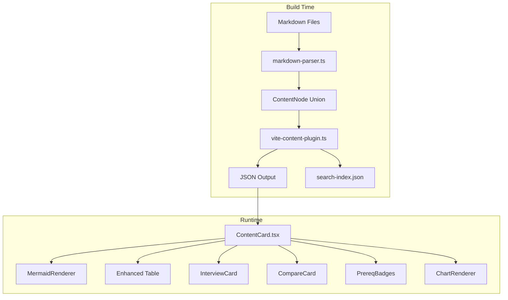

# Design Document: Enhanced Content Visuals

## Overview

This feature enhances the CS Reference Guide's content rendering pipeline and React component layer to support richer visual elements: responsive Mermaid diagrams with error handling, enhanced table styling, collapsible interview Q&A sections, comparison cards, prerequisite link badges, and data visualizations via Recharts.

The design extends two primary layers:
1. **Build-time parser** (`markdown-parser.ts`) — adds four new `ContentNode` discriminated union variants (`interview`, `compare`, `prereq`, `chart`) and enhances the existing `blockquote` detection logic
2. **Runtime renderer** (`ContentCard.tsx` and new sub-components) — renders the new node types and enhances existing table/Mermaid rendering

All changes are additive. Existing content files require zero modifications — the parser auto-detects patterns already present in the 182 subtopic files.

## Architecture



### Design Decisions

1. **Parser-level detection over runtime detection**: New syntax patterns (COMPARE, PREREQ, interview Q/A) are detected at build time in the markdown parser rather than at runtime. This keeps the renderer simple (just a switch on node type) and ensures search indexing captures all text content.

2. **Extend existing admonition detection**: The parser already detects `[!NOTE]`, `[!WARNING]`, `[!TIP]` in blockquotes. COMPARE and PREREQ use the same `[!TYPE]` pattern, extending the existing detection branch rather than adding a parallel mechanism.

3. **Interview detection via section context**: Interview Q/A parsing is triggered by the `## Interview Questions` heading context. The parser tracks the current H2 section heading and applies Q/A pattern matching only within that context, avoiding false positives in other sections.

4. **Theme-reactive Mermaid**: The MermaidRenderer subscribes to the app's theme context and re-initializes mermaid with the appropriate theme on change, then re-renders the diagram.

5. **Recharts for charts**: The project already depends on Recharts (used by BigOChart). Chart nodes reuse this dependency with lazy loading for code splitting.

## Components and Interfaces

### New ContentNode Variants

```typescript
// Added to the ContentNode discriminated union in src/types/content.ts

| { type: 'interview'; question: string; answer: string }
| { type: 'compare'; title: string; options: CompareOption[] }
| { type: 'prereq'; links: PrereqLink[] }
| { type: 'chart'; chartType: 'line' | 'bar' | 'area'; data: Record<string, unknown>[]; xKey: string; yKeys: string[]; title?: string }
```

### Supporting Interfaces

```typescript
// src/types/content.ts

export interface CompareOption {
  name: string;
  body: string;       // Markdown body rendered as text
  pros?: string[];    // Items from "Pros:" list
  cons?: string[];    // Items from "Cons:" list
}

export interface PrereqLink {
  text: string;       // Display text
  path: string;       // Relative markdown path (e.g., "./arrays.md")
}
```

### New React Components

| Component | Location | Responsibility |
|-----------|----------|----------------|
| `InterviewCard` | `src/components/content/InterviewCard.tsx` | Renders Q/A with collapsible answer toggle |
| `CompareCard` | `src/components/content/CompareCard.tsx` | Side-by-side comparison layout |
| `PrereqBadges` | `src/components/content/PrereqBadges.tsx` | Pill-shaped prerequisite link badges |
| `ChartRenderer` | `src/components/content/ChartRenderer.tsx` | Recharts wrapper with error handling |

### Enhanced Existing Components

| Component | Enhancement |
|-----------|-------------|
| `MermaidRenderer` | Add theme reactivity, responsive SVG scaling, scrollable overflow container |
| `ContentCard` (table case) | Add alternating rows, sticky header, bold first column, scroll container |

### MermaidRenderer Enhancements

```typescript
// Updated MermaidRenderer props (same file)
export interface MermaidRendererProps {
  source: string;
  timeoutMs?: number;  // existing, default 5000
}

// Internal changes:
// 1. Subscribe to theme context, re-render on theme change
// 2. After render, apply max-width: 100% + overflow-x: auto wrapper
// 3. SVG gets width="100%" preserveAspectRatio for responsive scaling
```

### InterviewCard Component

```typescript
interface InterviewCardProps {
  question: string;
  answer: string;
}

// Renders:
// - Question text always visible
// - "Show Answer" button (44x44px min touch target)
// - Answer revealed/hidden with 300ms CSS transition (max-height)
// - Resets to collapsed on route change (via useLocation key)
```

### CompareCard Component

```typescript
interface CompareCardProps {
  title: string;
  options: CompareOption[];
}

// Renders:
// - Title header
// - Grid layout: columns on ≥768px, stacked on mobile
// - Each option in a bordered card with header
// - Pros in green accent, cons in red accent
```

### PrereqBadges Component

```typescript
interface PrereqBadgesProps {
  links: PrereqLink[];
}

// Renders:
// - Horizontal flex row of pill badges
// - Each badge: icon + text, clickable via react-router Link
// - Path resolution: ./path.md → /topic/:category/:topic/:subtopic route
// - WCAG AA contrast in both themes
```

### ChartRenderer Component

```typescript
interface ChartRendererProps {
  chartType: 'line' | 'bar' | 'area';
  data: Record<string, unknown>[];
  xKey: string;
  yKeys: string[];
  title?: string;
}

// Renders:
// - ResponsiveContainer with 16:9 aspect ratio
// - Line/Bar/Area chart based on type
// - Legend shown only when yKeys.length > 1
// - Labeled axes from xKey and yKeys
// - Theme-aware colors from CSS custom properties
// - Error states: invalid JSON, missing fields, empty data
```

### Parser Changes (markdown-parser.ts)

The `astNodeToContentNode` function's `blockquote` case is extended:

```typescript
case 'blockquote': {
  const text = /* existing extraction */;
  
  // Existing admonition detection
  const admonitionMatch = text.match(/^\[!(NOTE|WARNING|TIP|COMPARE|PREREQ|[A-Z]+)\]\s*/);
  if (admonitionMatch) {
    const rawType = admonitionMatch[1].toLowerCase();
    
    if (rawType === 'compare') {
      return parseCompareBlock(node);  // New
    }
    if (rawType === 'prereq') {
      return parsePrereqBlock(node);   // New
    }
    // Existing NOTE/WARNING/TIP handling...
    // Unrecognized types fall through to standard blockquote
  }
  
  return { type: 'blockquote', text };
}
```

For interview detection, the `buildSections` function tracks the current H2 heading. When inside an `## Interview Questions` section, paragraph nodes matching the `**Q:` pattern trigger interview node creation:

```typescript
// In buildSections, when current H2 heading === "Interview Questions":
// Scan content nodes for **Q: pattern and pair with subsequent A: paragraphs
// Emit { type: 'interview', question, answer } nodes instead of raw paragraphs
```

For chart detection, the `code` case is extended:

```typescript
case 'code': {
  if (language.toLowerCase() === 'mermaid') { /* existing */ }
  if (language.toLowerCase() === 'chart') {
    return parseChartBlock(node.value);  // New
  }
  // ... existing code block handling
}
```

### Search Indexer Changes (search-indexer.ts)

The `extractTextFromNode` function adds cases for new node types:

```typescript
case 'interview':
  return `${node.question} ${node.answer}`;
case 'compare':
  return `${node.title} ${node.options.map(o => `${o.name} ${o.body} ${(o.pros || []).join(' ')} ${(o.cons || []).join(' ')}`).join(' ')}`;
case 'prereq':
  return node.links.map(l => l.text).join(' ');
case 'chart':
  return node.title || '';
```

## Data Models

### ContentNode Union (Extended)

The existing discriminated union in `src/types/content.ts` gains four new variants:

```typescript
export type ContentNode =
  // ... existing 14 variants unchanged ...
  | { type: 'interview'; question: string; answer: string }
  | { type: 'compare'; title: string; options: CompareOption[] }
  | { type: 'prereq'; links: PrereqLink[] }
  | { type: 'chart'; chartType: 'line' | 'bar' | 'area'; data: Record<string, unknown>[]; xKey: string; yKeys: string[]; title?: string };
```

### CompareOption

```typescript
export interface CompareOption {
  name: string;
  body: string;
  pros?: string[];
  cons?: string[];
}
```

### PrereqLink

```typescript
export interface PrereqLink {
  text: string;
  path: string;
}
```

### Chart JSON Configuration (authored in markdown)

```json
{
  "type": "line",
  "data": [
    { "n": 10, "O(n)": 10, "O(n²)": 100 },
    { "n": 100, "O(n)": 100, "O(n²)": 10000 }
  ],
  "xKey": "n",
  "yKeys": ["O(n)", "O(n²)"],
  "title": "Algorithm Complexity Comparison"
}
```

### Markdown Syntax Patterns

**Interview Q/A** (auto-detected under `## Interview Questions`):
```markdown
## Interview Questions

**Q: What is X?**

A: X is a thing that does Y.

**Q2: How does Z work?**

A: Z works by doing W.
```

**Comparison Card**:
```markdown
> [!COMPARE]
> REST vs GraphQL
>
> ### REST
> Resource-oriented with fixed endpoints.
> Pros:
> - Simple caching
> - Well-understood
> Cons:
> - Over-fetching
> - Multiple round trips
>
> ### GraphQL
> Query-oriented with single endpoint.
> Pros:
> - Precise data fetching
> - Single request
> Cons:
> - Complex caching
> - N+1 query risk
```

**Prerequisite Badges**:
```markdown
> [!PREREQ]
> [Binary Trees](./binary-trees.md)
> [Big O Notation](../../fundamental-data-structures/big-o-notation.md)
```

**Chart**:
````markdown
```chart
{
  "type": "line",
  "data": [{"n": 10, "time": 1}, {"n": 100, "time": 10}],
  "xKey": "n",
  "yKeys": ["time"]
}
```
````


## Correctness Properties

*A property is a characteristic or behavior that should hold true across all valid executions of a system — essentially, a formal statement about what the system should do. Properties serve as the bridge between human-readable specifications and machine-verifiable correctness guarantees.*

### Property 1: Interview Q/A Parsing

*For any* markdown content containing an `## Interview Questions` heading followed by lines matching the `**Q:` pattern with subsequent `A:` paragraphs, the parser SHALL produce `interview` nodes with the question and answer text correctly separated; and *for any* lines under `## Interview Questions` that do not match the `**Q:` pattern, the parser SHALL produce standard `paragraph` nodes.

**Validates: Requirements 6.1, 6.2**

### Property 2: Comparison Block Parsing with Option Count Validation

*For any* blockquote starting with `> [!COMPARE]` followed by a title and `### Option` blocks, the parser SHALL produce a `compare` node if and only if the block contains between 2 and 4 options (inclusive). Blocks with fewer than 2 or more than 4 options SHALL produce a standard `blockquote` node. Each produced compare node SHALL contain the correct title string and an options array with matching names and body content.

**Validates: Requirements 7.1, 7.4**

### Property 3: Prerequisite Block Parsing with Link Validation

*For any* blockquote starting with `> [!PREREQ]` followed by content lines, the parser SHALL produce a `prereq` node if and only if the content contains at least one parseable markdown link. The prereq node SHALL contain an ordered array of link objects (max 5) with correct display text and path. If no parseable links are present, the parser SHALL produce a standard `blockquote` node.

**Validates: Requirements 8.1, 8.2**

### Property 4: Chart Block Parsing with JSON Validation

*For any* fenced code block with language `chart`, the parser SHALL produce a `chart` node if and only if the content is valid JSON containing all required fields (`type` as one of "line"/"bar"/"area", `data` as an array, and `xKey` as a string). For invalid JSON or missing required fields, the parser SHALL produce a fallback node (code block or error indicator) rather than a chart node, and SHALL not throw an exception.

**Validates: Requirements 9.1, 9.4, 9.5**

### Property 5: Table Sticky Header Conditional

*For any* table content node, the renderer SHALL apply the scrollable container with sticky header class if and only if the table has more than 5 data rows. Tables with 5 or fewer rows SHALL NOT receive the scrollable container treatment.

**Validates: Requirements 5.4**

### Property 6: Search Index Text Extraction for New Node Types

*For any* content node of type `interview`, `compare`, `prereq`, or `chart`, the search indexer's `extractTextFromNode` function SHALL return a non-empty string containing all user-visible text content from that node (question text, answer text, option names, option bodies, pros/cons items, link display text, and chart title respectively).

**Validates: Requirements 10.3**

### Property 7: Unrecognized Admonition Type Fallback

*For any* blockquote matching the `[!TYPE]` admonition pattern where TYPE is not one of the recognized identifiers (NOTE, WARNING, TIP, COMPARE, PREREQ), the parser SHALL produce a standard `blockquote` node without errors or warnings.

**Validates: Requirements 10.4**

### Property 8: Backward Compatibility — Existing Syntax Unchanged

*For any* markdown content that uses only existing syntax patterns (paragraphs, code blocks, lists, tables, blockquotes with NOTE/WARNING/TIP, mermaid, math, images, task lists), the parser SHALL produce output identical to the pre-enhancement parser — no new node types SHALL appear and no existing node field values SHALL change.

**Validates: Requirements 10.2, 10.6**

## Error Handling

### Mermaid Rendering Errors

| Error Condition | Handling |
|----------------|----------|
| Syntax error in diagram source | Display error message + raw source in `<pre>` block |
| Render timeout (>5000ms) | Abort render, display "Rendering timed out" + raw source |
| Theme change during render | Cancel in-flight render, restart with new theme |

The existing MermaidRenderer already handles errors and timeouts. Enhancements add theme reactivity and responsive scaling without changing the error model.

### Chart Rendering Errors

| Error Condition | Handling |
|----------------|----------|
| Invalid JSON in chart block | Parser emits a `code` node with language "chart" (passthrough); renderer shows inline error with parse failure location |
| Valid JSON but missing required fields | Renderer shows inline error listing missing field names |
| Empty data array | Renderer shows chart container with "No data available" message |
| Unknown chart type | Renderer shows inline error "Unsupported chart type: X" |

Chart errors are non-fatal — they render an informative error message in place of the chart without affecting surrounding content.

### Parser Fallback Strategy

The parser follows a "graceful degradation" principle:
1. If a `[!COMPARE]` block has invalid option count → standard blockquote
2. If a `[!PREREQ]` block has no links → standard blockquote
3. If an unrecognized `[!TYPE]` is encountered → standard blockquote
4. If interview section text doesn't match Q/A pattern → standard paragraph
5. If chart JSON is unparseable → standard code block with language "chart"

No new syntax pattern can cause the parser to throw or produce an `unparseable` node for content that previously parsed successfully.

### Component Error Boundaries

- `ChartRenderer` is lazy-loaded and wrapped in `Suspense` with a loading fallback
- `ChartRenderer` catches Recharts rendering errors internally and displays an error state
- `InterviewCard`, `CompareCard`, and `PrereqBadges` are lightweight synchronous components that don't need error boundaries (they render static content)

## Testing Strategy

### Property-Based Tests (fast-check, minimum 100 iterations each)

| Property | Test File | What Varies |
|----------|-----------|-------------|
| Property 1: Interview parsing | `src/plugins/__tests__/markdown-parser.pbt.test.ts` | Question text, answer text, number of Q/A pairs, non-Q: interspersed text |
| Property 2: Compare block parsing | `src/plugins/__tests__/markdown-parser.pbt.test.ts` | Title text, option count (0-6), option names, body content, pros/cons presence |
| Property 3: Prereq block parsing | `src/plugins/__tests__/markdown-parser.pbt.test.ts` | Number of links (0-7), display text, path strings, non-link text |
| Property 4: Chart block parsing | `src/plugins/__tests__/markdown-parser.pbt.test.ts` | Valid/invalid JSON, present/missing fields, data array contents, chart types |
| Property 5: Table sticky header | `src/components/content/__tests__/ContentCard.pbt.test.ts` | Row count (1-20), column count, cell content |
| Property 6: Search index extraction | `src/plugins/__tests__/search-indexer.pbt.test.ts` | Random interview/compare/prereq/chart nodes with varying content |
| Property 7: Unrecognized admonition | `src/plugins/__tests__/markdown-parser.pbt.test.ts` | Random uppercase type identifiers, blockquote content |
| Property 8: Backward compatibility | `src/plugins/__tests__/markdown-parser.pbt.test.ts` | Random markdown using only existing syntax patterns |

**Configuration**: Each property test runs with `{ numRuns: 100 }` minimum.
**Tag format**: `Feature: enhanced-content-visuals, Property N: {title}`

### Unit Tests (example-based)

| Area | Test Cases |
|------|-----------|
| MermaidRenderer error display | Syntax error shows message + source; timeout shows indication + source |
| MermaidRenderer theme reactivity | Theme change triggers re-render with new theme |
| MermaidRenderer responsive SVG | Rendered SVG has width="100%" and overflow wrapper |
| InterviewCard toggle | Default collapsed; click reveals; click again hides; 44px touch target |
| InterviewCard route reset | Expanded answers collapse on navigation |
| CompareCard layout | Side-by-side classes on desktop; stacked on mobile |
| CompareCard pros/cons | Green accent for pros, red accent for cons |
| PrereqBadges rendering | Pill shape, icon + text, correct href |
| PrereqBadges contrast | WCAG AA contrast ratios in both themes |
| ChartRenderer types | Line/Bar/Area each render correct Recharts component |
| ChartRenderer legend | Legend shown for multi-series, hidden for single |
| ChartRenderer empty state | Empty data shows "No data available" |
| Table enhanced styling | Alternating rows, bold first column, hover preserved |

### Integration Tests

| Area | Test Cases |
|------|-----------|
| Mermaid diagram types | Sequence, class, state diagrams render without errors |
| Full pipeline | Parse markdown with all new syntax → JSON output → render components |
| Build backward compatibility | All 182 existing files produce identical JSON output |
| Build performance | Total build time increase < 10% |

### Test Library

- **Property-based testing**: fast-check 3.22.0 (already installed)
- **Unit/integration**: Vitest 2.1.4 + @testing-library/react 16.0.1
- **Run command**: `npx vitest run`
