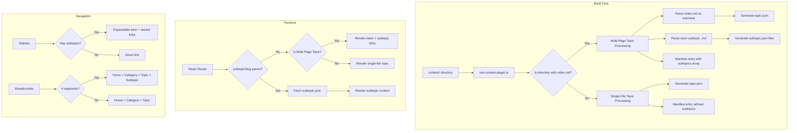
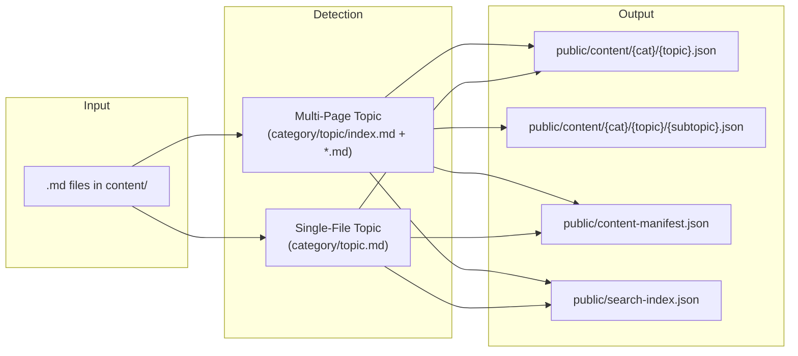

# Design Document: Multi-Page Content Overhaul

## Overview

This design transforms the CS Reference Guide from a flat single-file-per-topic architecture into one that supports multi-page topics — directories containing an `index.md` overview and multiple focused subtopic files. The changes span the entire content pipeline (build-time detection, manifest generation, per-subtopic JSON output), the React frontend (routing, sidebar navigation, breadcrumbs, topic page rendering), and the content layer itself (splitting 16 topics, removing 7 files, adding new topics).

The core design principle is **additive extension**: single-file topics continue to work exactly as before, and multi-page support is layered on top via directory detection, manifest schema extension, and an optional route segment.

## Architecture



### Key Design Decisions

1. **Directory-based detection over frontmatter**: A directory containing `index.md` signals a multi-page topic. This is filesystem-native, requires no parser changes, and is immediately visible to content authors.

2. **Separate JSON per subtopic**: Each subtopic gets its own JSON file at `/content/{category}/{topic}/{subtopic}.json`. This preserves the < 50KB chunk target and enables lazy loading of individual subtopics.

3. **Optional route segment**: The route `/topic/:categorySlug/:topicSlug/:subtopicSlug?` uses an optional fourth segment. When absent, the topic overview is shown; when present, the specific subtopic loads.

4. **Manifest-driven UI**: The sidebar and breadcrumbs read the `subtopics` array from the manifest to determine rendering behavior. No additional API calls are needed for navigation structure.

## Components and Interfaces

### Content Pipeline Changes (`src/plugins/vite-content-plugin.ts`)

The `processContent` function gains a new detection step before file processing:

```typescript
interface MultiPageTopic {
  dirPath: string;
  indexFile: string;
  subtopicFiles: string[];  // alphabetically sorted
  category: string;
  topicSlug: string;
}
```

**Detection algorithm:**
1. For each category directory, list immediate child entries
2. If an entry is a directory containing `index.md`, classify as `MultiPageTopic`
3. If an entry is a `.md` file, classify as single-file topic (existing behavior)
4. If a directory lacks `index.md`, log a warning and skip

**Processing for multi-page topics:**
1. Parse `index.md` → extract title, sections, wordCount
2. For each `.md` file (excluding `index.md`, excluding nested subdirectories), parse as subtopic
3. Generate `{categorySlug}/{topicSlug}.json` from index content
4. Generate `{categorySlug}/{topicSlug}/{subtopicSlug}.json` for each subtopic
5. Build manifest entry with aggregated counts and `subtopics` array

### Manifest Schema Extension

```typescript
interface ManifestSubtopic {
  id: string;
  slug: string;
  title: string;
  wordCount: number;
}

interface ManifestTopic {
  id: string;
  slug: string;
  title: string;
  source: 'parsed';
  sectionCount: number;
  wordCount: number;
  contentPath: string;
  subtopics?: ManifestSubtopic[];  // present only for multi-page topics
}
```

Example manifest entry for a multi-page topic:
```json
{
  "id": "java",
  "slug": "backend/java",
  "title": "Java",
  "source": "parsed",
  "sectionCount": 42,
  "wordCount": 15000,
  "contentPath": "/content/backend/java.json",
  "subtopics": [
    { "id": "java-collections", "slug": "collections", "title": "Collections Framework", "wordCount": 2500 },
    { "id": "java-concurrency", "slug": "concurrency", "title": "Concurrency & Multithreading", "wordCount": 2800 }
  ]
}
```

### Routing (`src/App.tsx`)

Add a new route that captures the optional subtopic segment:

```typescript
<Route path="/topic/:categorySlug/:topicSlug/:subtopicSlug" element={<TopicPage />} />
<Route path="/topic/:categorySlug/:topicSlug" element={<TopicPage />} />
```

The more specific route (with subtopicSlug) is listed first so react-router matches it before the shorter pattern.

### Sidebar Component (`src/components/navigation/Sidebar.tsx`)

**New behavior for multi-page topics:**
- Render a toggle button (chevron) instead of a direct link for the topic title
- On expand, show nested `<ul>` with subtopic links indented under the parent
- Persist expansion state in localStorage under `csguide:nav-state` (extend existing `expandedCategories` to include `expandedTopics`)
- Auto-expand the parent topic when a subtopic route is active
- Apply `aria-current="page"` to the active subtopic link

```typescript
interface NavState {
  expandedCategories: string[];
  expandedTopics: string[];  // NEW: track expanded multi-page topics
}
```

### Breadcrumbs (`src/utils/breadcrumbs.ts`)

Extend `generateBreadcrumbs` to handle 4-segment paths:

```
segments: ["topic", "backend", "java", "concurrency"]
→ [
    { label: "Backend", path: "/category/backend", isLast: false },
    { label: "Java", path: "/topic/backend/java", isLast: false },
    { label: "Concurrency & Multithreading", path: "/topic/backend/java/concurrency", isLast: true }
  ]
```

The topic segment becomes a clickable link (navigates to overview), and the subtopic is the final non-clickable segment.

### TopicPage (`src/pages/TopicPage.tsx`)

**Extended behavior:**
1. Read `subtopicSlug` from `useParams`
2. If `subtopicSlug` is present:
   - Fetch `/content/{categorySlug}/{topicSlug}/{subtopicSlug}.json`
   - Render subtopic content using existing section rendering
   - Show "Back to overview" link
3. If `subtopicSlug` is absent and topic has subtopics (check manifest):
   - Fetch `/content/{categorySlug}/{topicSlug}.json` (index content)
   - Render index overview content
   - Render a list of subtopic links with titles
4. If `subtopicSlug` is absent and topic has no subtopics:
   - Existing single-file behavior (unchanged)
5. Error cases:
   - Subtopic slug not found → inline error with link to parent overview
   - Topic slug not found → not-found error
   - Subtopic slug on a single-file topic → not-found error

## Data Models

### Build-Time Data Flow



### Runtime Data Structures

**Manifest (loaded once on app init):**
```typescript
interface ContentManifest {
  categories: ManifestCategory[];
  totalTopics: number;
  totalSections: number;
  buildTimestamp: string;
}

interface ManifestCategory {
  id: string;
  name: string;
  topics: ManifestTopic[];
}

interface ManifestTopic {
  id: string;
  slug: string;
  title: string;
  source: 'parsed';
  sectionCount: number;
  wordCount: number;
  contentPath: string;
  subtopics?: ManifestSubtopic[];
}

interface ManifestSubtopic {
  id: string;
  slug: string;
  title: string;
  wordCount: number;
}
```

**Topic JSON (fetched per page):**
```typescript
// Same ParsedContent structure for both index and subtopic files
interface TopicData {
  id: string;
  slug: string;
  title: string;
  category: string;
  sections: ContentSection[];
}
```

### Slug Collision Handling

When two subtopic files within the same multi-page topic produce identical slugs:
1. The first occurrence keeps its slug unchanged
2. Subsequent duplicates get a `-2`, `-3`, etc. suffix appended
3. A warning is logged during build

### Category Mappings Extension

New entries added to `CATEGORY_MAPPINGS`:
```typescript
{ pattern: 'security', category: 'Security' },
{ pattern: 'nextjs', category: 'Next.js' },
{ pattern: 'html-css', category: 'HTML & CSS' },
{ pattern: 'ci-cd', category: 'CI/CD' },
{ pattern: 'linux', category: 'Linux' },
```

### localStorage Schema

Sidebar expansion state (key: `csguide:nav-state`):
```json
{
  "expandedCategories": ["backend", "frontend"],
  "expandedTopics": ["backend/java", "frontend/react"]
}
```

## Correctness Properties

*A property is a characteristic or behavior that should hold true across all valid executions of a system — essentially, a formal statement about what the system should do. Properties serve as the bridge between human-readable specifications and machine-verifiable correctness guarantees.*

### Property 1: Topic Classification

*For any* content directory structure where a category directory contains a mix of `.md` files and subdirectories, the content pipeline SHALL classify each entry correctly: a subdirectory containing `index.md` is classified as a Multi_Page_Topic, a `.md` file directly in the category directory is classified as a Single_File_Topic, and a subdirectory lacking `index.md` is skipped (excluded from the manifest).

**Validates: Requirements 1.1, 1.2, 1.5, 6.5**

### Property 2: Index Title Extraction

*For any* Multi_Page_Topic directory whose `index.md` contains a valid H1 heading, the resulting manifest entry's `title` field SHALL equal the text content of that H1 heading.

**Validates: Requirements 1.3**

### Property 3: Subtopic Manifest Structure and Ordering

*For any* Multi_Page_Topic directory containing N `.md` files (excluding `index.md` and files in nested subdirectories), the manifest entry SHALL contain a `subtopics` array of exactly N elements, each with non-empty `id`, `slug`, `title`, and `wordCount` fields, ordered alphabetically by filename for processing and alphabetically by title in the manifest output.

**Validates: Requirements 1.4, 2.1**

### Property 4: Aggregate Counts Invariant

*For any* Multi_Page_Topic with an index file and K subtopics, the topic-level `wordCount` SHALL equal the sum of the index file's word count and all K subtopic word counts, and the topic-level `sectionCount` SHALL equal the sum of the index file's section count and all K subtopic section counts.

**Validates: Requirements 2.3**

### Property 5: Single-File Topic Manifest Invariant

*For any* Single_File_Topic, the manifest entry SHALL NOT contain a `subtopics` field, SHALL have a `contentPath` matching the pattern `/content/{categorySlug}/{topicSlug}.json`, and SHALL include non-empty `id`, `slug`, `title`, `sectionCount`, and `wordCount` fields.

**Validates: Requirements 2.2, 6.1, 6.6, 10.1, 10.4**

### Property 6: Slug Deduplication Uniqueness

*For any* set of subtopic files within a Multi_Page_Topic that produce duplicate slugs, the deduplication process SHALL produce a set of slugs where every slug is unique, with the first occurrence unchanged and subsequent duplicates receiving sequential numeric suffixes starting at `-2`.

**Validates: Requirements 2.6**

### Property 7: Output File Path Correctness

*For any* Multi_Page_Topic with category slug C, topic slug T, and subtopic slugs S₁..Sₙ, the pipeline SHALL produce a JSON file at path `/content/{C}/{T}.json` for the index and a JSON file at path `/content/{C}/{T}/{Sᵢ}.json` for each subtopic Sᵢ.

**Validates: Requirements 2.4, 2.5**

### Property 8: Breadcrumb Generation

*For any* URL path segments of the form `["topic", categorySlug, topicSlug, subtopicSlug]` with a display name mapping, `generateBreadcrumbs` SHALL return exactly 3 breadcrumb items where: the first links to `/category/{categorySlug}`, the second links to `/topic/{categorySlug}/{topicSlug}`, the third has `isLast=true`; and for path segments `["topic", categorySlug, topicSlug]`, it SHALL return exactly 2 items where the last has `isLast=true`. For any non-empty breadcrumb array, the final element always has `isLast=true`.

**Validates: Requirements 5.1, 5.2, 5.5**

### Property 9: Sidebar Expansion State Round-Trip

*For any* set of expanded topic IDs, serializing the expansion state to localStorage and deserializing it back SHALL produce an identical set of expanded topic IDs.

**Validates: Requirements 4.5**

## Error Handling

### Content Pipeline Errors

| Error Condition | Handling Strategy | User Impact |
|----------------|-------------------|-------------|
| Directory without `index.md` | Log warning with directory path, skip directory | Topic excluded from manifest; other topics unaffected |
| Subtopic count exceeds 50 | Log warning, continue processing all subtopics | No functional impact; informational warning for authors |
| Duplicate subtopic slugs | Append `-2`, `-3` suffix, log warning | Subtopics accessible at deduplicated URLs |
| Empty or unreadable `.md` file | Log warning, skip file | Subtopic excluded from manifest |
| Malformed markdown (no H1) | Use filename as fallback title, log warning | Topic appears with filename-derived title |
| File read failure (permissions) | Log error, skip file, continue pipeline | Individual topic missing; build continues |
| JSON write failure | Throw error, fail build | Build fails with clear error message |

### Runtime Fetch Errors

| Error Condition | Handling Strategy | User Impact |
|----------------|-------------------|-------------|
| Subtopic JSON 404 | Display inline error: "Subtopic not found" with link to parent topic overview | User can navigate back to topic overview |
| Topic JSON 404 | Display error: "Topic not found" with link to dashboard | User redirected to working page |
| Subtopic slug on single-file topic | Display not-found error with link to topic (without subtopic segment) | User sees the single-file topic content |
| Network failure during fetch | Display retry-able error with "Try again" button | User can retry without navigation |
| Manifest load failure | Sidebar shows empty state: "No content available yet" | Navigation unavailable; direct URLs still work if content JSON exists |
| Invalid JSON response | Display generic error: "Unable to load topic" | User sees error state with navigation options |

### localStorage Errors

| Error Condition | Handling Strategy | User Impact |
|----------------|-------------------|-------------|
| localStorage unavailable (private browsing) | Catch exception, use in-memory defaults | Expansion state not persisted across sessions |
| Corrupted stored state (invalid JSON) | Catch parse error, reset to defaults | Sidebar collapses to default state |
| Storage quota exceeded | Catch QuotaExceededError, continue with current state | State not updated but app continues working |

### Graceful Degradation Principles

1. **Pipeline errors are non-fatal by default**: A single broken file should not prevent the rest of the content from building. Only JSON write failures (indicating disk/permission issues) halt the build.
2. **Runtime errors are contained**: A failed subtopic fetch does not crash the page. Error boundaries at the route level catch React rendering errors.
3. **Navigation always provides an escape**: Every error state includes a link to a known-working page (parent topic, category, or dashboard).
4. **State corruption is self-healing**: Invalid localStorage data is discarded and replaced with safe defaults on next read.

## Testing Strategy

### Testing Approach

The testing strategy uses a dual approach combining property-based tests (for universal correctness guarantees) and example-based unit/integration tests (for specific scenarios and UI behavior).

### Property-Based Tests (fast-check)

Property-based tests validate the correctness properties defined above. Each property test runs a minimum of 100 iterations with randomly generated inputs.

**Library**: `fast-check` (already in project dependencies)

**Configuration**:
- Minimum 100 iterations per property
- Each test tagged with: `Feature: multi-page-content-overhaul, Property {N}: {title}`
- Seed logged on failure for reproducibility

**Target functions for PBT**:

| Property | Function Under Test | Generator Strategy |
|----------|--------------------|--------------------|
| 1: Topic Classification | `detectTopicType(dirEntries)` | Generate random directory structures with/without index.md |
| 2: Index Title Extraction | `parseMarkdown(indexContent)` | Generate random markdown with H1 headings |
| 3: Subtopic Manifest Structure | `buildSubtopicManifest(files)` | Generate random filename arrays |
| 4: Aggregate Counts | `aggregateCounts(index, subtopics)` | Generate random word/section count tuples |
| 5: Single-File Manifest Invariant | `buildManifestEntry(parsedContent)` | Generate random ParsedContent objects |
| 6: Slug Deduplication | `deduplicateSlugs(slugs)` | Generate string arrays with intentional duplicates |
| 7: Output File Paths | `resolveOutputPaths(category, topic, subtopics)` | Generate random slug strings |
| 8: Breadcrumb Generation | `generateBreadcrumbs(segments, displayNames)` | Generate random path segment arrays and name maps |
| 9: Expansion State Round-Trip | `serialize/deserialize NavState` | Generate random sets of topic ID strings |

### Unit Tests (Vitest)

Example-based unit tests cover specific scenarios, edge cases, and error conditions:

**Content Pipeline**:
- Directory with exactly 50 subtopics produces no warning; 51 produces warning (Req 1.6)
- Mixed category directory: single files and multi-page dirs coexist correctly
- Empty index.md falls back to filename-derived title
- Subtopic files in nested subdirectories are excluded

**Routing**:
- Navigating to `/topic/backend/java/concurrency` renders subtopic content (Req 3.4)
- Navigating to non-existent subtopic shows error with back link (Req 3.5)
- Subtopic route on single-file topic shows not-found (Req 3.6)
- Non-existent topic slug shows not-found regardless of subtopic segment (Req 3.7)

**Sidebar**:
- Multi-page topic renders expandable toggle with nested links (Req 4.1, 4.2)
- Single-file topic renders direct link without toggle (Req 4.3)
- Active subtopic auto-expands parent topic and category (Req 4.4)
- localStorage failure defaults to collapsed state (Req 4.6)

**Breadcrumbs**:
- Topic breadcrumb is clickable link to overview when viewing subtopic (Req 5.3)
- Category breadcrumb links to `/category/:slug` (Req 5.4)
- Home page renders no breadcrumbs (Req 5.6)

### Integration Tests

Integration tests verify end-to-end behavior across components:

- Full pipeline run on a test content directory produces valid manifest and JSON files
- Sidebar + Router integration: clicking subtopic link updates URL and renders content
- Breadcrumbs reflect correct path after navigation
- Removed topics return 404 and render NotFound page (Req 7.2)

### Smoke Tests

Smoke tests verify one-time setup and build integrity:

- `tsc -b && vite build` exits with code 0 (Req 11.1)
- Generated manifest is valid JSON with `totalTopics > 0` (Req 11.2)
- `vitest run` passes with zero failures (Req 11.3)
- `eslint .` produces zero errors on modified files (Req 11.5)
- Removed files no longer exist in repository (Req 7.1)
- New category directories exist with at least one topic file (Req 9.1)
- Git directory contains no subdirectories (Req 10.2)

### Test Organization

```
src/
├── plugins/__tests__/
│   ├── topic-detection.property.test.ts    # Properties 1, 2
│   ├── manifest-generation.property.test.ts # Properties 3, 4, 5
│   ├── slug-deduplication.property.test.ts  # Property 6
│   ├── output-paths.property.test.ts        # Property 7
│   └── content-pipeline.test.ts             # Unit + integration tests
├── utils/__tests__/
│   ├── breadcrumbs.property.test.ts         # Property 8
│   └── breadcrumbs.test.ts                  # Unit tests
├── components/navigation/__tests__/
│   ├── sidebar-state.property.test.ts       # Property 9
│   └── Sidebar.test.tsx                     # Unit tests
└── pages/__tests__/
    └── TopicPage.test.tsx                   # Unit + integration tests
```
