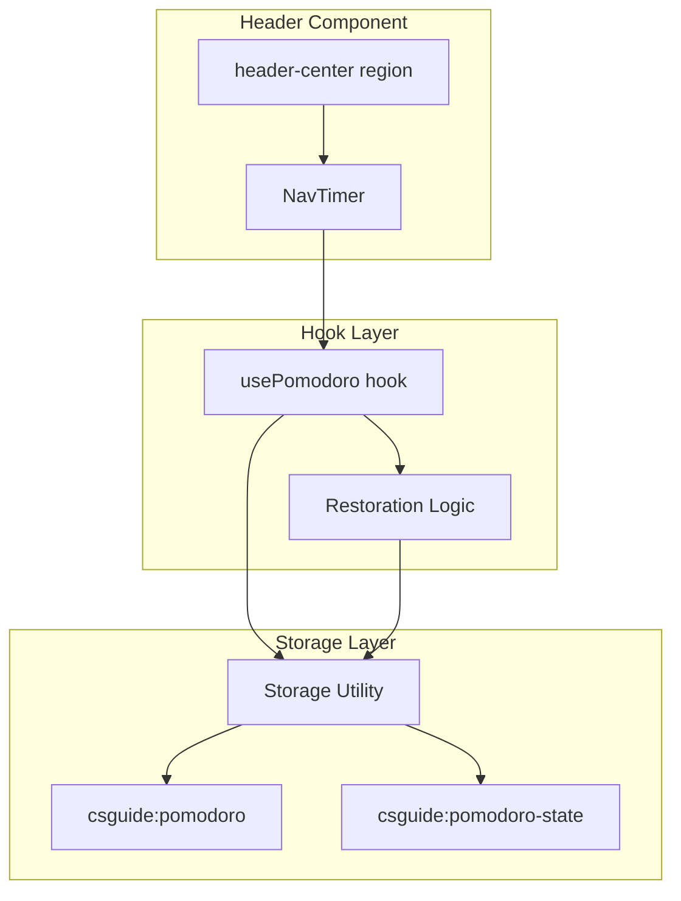

# Design Document

## Overview

This design refactors the existing `usePomodoro` hook to persist running timer state with timestamps and introduces a compact `NavTimer` component rendered in the Header's `header-center` region. The timestamp-based persistence strategy ensures accurate time restoration across page refreshes and client-side navigations.

## Architecture



The architecture follows the existing pattern: a custom hook encapsulates all state logic and persistence, while a presentational component consumes the hook's return value. The Header renders the NavTimer in place of the old study session timer.

## Components and Interfaces

### NavTimer (`src/components/layout/NavTimer.tsx`)

A compact, inline Pomodoro timer component designed for the header bar.

```typescript
interface NavTimerProps {
  // No props — consumes usePomodoro directly
}
```

**Responsibilities:**
- Renders countdown in MM:SS format
- Displays mode label ("Work" / "Break")
- Shows icon-based control buttons (play, pause, stop)
- Provides accessible markup (role="timer", aria-labels, aria-live region)
- Displays compact idle state with start button

**State-to-UI mapping:**

| Hook State | Displayed Controls |
|---|---|
| `mode: 'idle'` | Start button (play icon + "Start") |
| `mode: 'work' \| 'break', isRunning: true` | Pause button, Stop button |
| `mode: 'work' \| 'break', isRunning: false` | Resume button, Stop button |

### Header Modification (`src/components/layout/Header.tsx`)

The `header-center` region replaces the study session elapsed-time display with the NavTimer component. The `useStudySession` import and related rendering logic are removed from Header.

```typescript
// Before
import { useStudySession } from '@/hooks/useStudySession';
// ...
<div className="header-center">
  {session.isActive ? <span className="focus-timer">...</span> : <span className="timer-placeholder" />}
</div>

// After
import { NavTimer } from '@/components/layout/NavTimer';
// ...
<div className="header-center">
  <NavTimer />
</div>
```

### PersistedTimerState

New interface representing the persisted running state shape, stored at `csguide:pomodoro-state`:

```typescript
/** Persisted running timer state for cross-refresh restoration */
export interface PersistedTimerState {
  mode: 'work' | 'break';
  remainingSeconds: number;
  isRunning: boolean;
  lastTickAt: number; // milliseconds since epoch
  completedPomodoros: number;
  workDuration: number; // minutes
  breakDuration: number; // minutes
}
```

### PomodoroConfig (unchanged)

Persisted at `csguide:pomodoro` — only work/break duration preferences:

```typescript
interface PomodoroConfig {
  workDuration: number;
  breakDuration: number;
}
```

### UsePomodoroReturn (extended)

The hook's return type remains the same — no new public API is needed. The persistence and restoration logic is internal to the hook.

```typescript
export interface UsePomodoroReturn {
  state: PomodoroState;
  notification: PomodoroNotification;
  start: () => void;
  pause: () => void;
  stop: () => void;
  setWorkDuration: (minutes: number) => void;
  setBreakDuration: (minutes: number) => void;
  dismissNotification: () => void;
}
```

## Data Models

### Storage Keys

| Key | Resolved Key | Purpose | Lifecycle |
|---|---|---|---|
| `pomodoro` | `csguide:pomodoro` | Work/break duration config | Persists indefinitely |
| `pomodoro-state` | `csguide:pomodoro-state` | Running timer state with timestamp | Created on start/resume, removed on stop |

### State Machine

```mermaid
stateDiagram-v2
    [*] --> Idle
    Idle --> Work: start()
    Work --> Break: remainingSeconds = 0
    Break --> Work: remainingSeconds = 0
    Work --> Paused_Work: pause()
    Break --> Paused_Break: pause()
    Paused_Work --> Work: start() (resume)
    Paused_Break --> Break: start() (resume)
    Work --> Idle: stop()
    Break --> Idle: stop()
    Paused_Work --> Idle: stop()
    Paused_Break --> Idle: stop()

    note right of Idle: csguide:pomodoro-state removed
    note right of Work: csguide:pomodoro-state persisted each tick
```

## Key Algorithms

### Timestamp-Based Restoration

On hook initialization, the restoration algorithm runs:

```typescript
function restoreState(now: number): PomodoroState {
  const persisted = storage.get<PersistedTimerState | null>('pomodoro-state', null);

  if (!persisted || !isValidPersistedState(persisted)) {
    return createIdleState(loadConfig());
  }

  if (!persisted.isRunning) {
    // Paused state — restore as-is, no time deduction
    return {
      mode: persisted.mode,
      workDuration: persisted.workDuration,
      breakDuration: persisted.breakDuration,
      remainingSeconds: persisted.remainingSeconds,
      isRunning: false,
      completedPomodoros: persisted.completedPomodoros,
    };
  }

  // Running state — calculate elapsed time
  const elapsedMs = now - persisted.lastTickAt;
  const elapsedSeconds = Math.floor(elapsedMs / 1000);
  const adjustedRemaining = persisted.remainingSeconds - elapsedSeconds;

  if (adjustedRemaining <= 0) {
    // Timer expired while away — trigger transition
    return handleExpiredRestoration(persisted);
  }

  return {
    mode: persisted.mode,
    workDuration: persisted.workDuration,
    breakDuration: persisted.breakDuration,
    remainingSeconds: adjustedRemaining,
    isRunning: true,
    completedPomodoros: persisted.completedPomodoros,
  };
}
```

### Expired Restoration Transition

When the timer expired while the page was closed:

```typescript
function handleExpiredRestoration(persisted: PersistedTimerState): PomodoroState {
  if (persisted.mode === 'work') {
    // Work ended → transition to break
    return {
      mode: 'break',
      workDuration: persisted.workDuration,
      breakDuration: persisted.breakDuration,
      remainingSeconds: persisted.breakDuration * 60,
      isRunning: true,
      completedPomodoros: persisted.completedPomodoros + 1,
    };
  }
  // Break ended → transition to work
  return {
    mode: 'work',
    workDuration: persisted.workDuration,
    breakDuration: persisted.breakDuration,
    remainingSeconds: persisted.workDuration * 60,
    isRunning: true,
    completedPomodoros: persisted.completedPomodoros,
  };
}
```

### Persistence on Tick

Each second, the hook persists the current state:

```typescript
function persistState(state: PomodoroState, now: number): void {
  if (state.mode === 'idle') {
    storage.remove('pomodoro-state');
    return;
  }

  const persisted: PersistedTimerState = {
    mode: state.mode,
    remainingSeconds: state.remainingSeconds,
    isRunning: state.isRunning,
    lastTickAt: now,
    completedPomodoros: state.completedPomodoros,
    workDuration: state.workDuration,
    breakDuration: state.breakDuration,
  };

  storage.set('pomodoro-state', persisted);
}
```

### Validation of Persisted State

Guards against corrupted localStorage data:

```typescript
function isValidPersistedState(data: unknown): data is PersistedTimerState {
  if (typeof data !== 'object' || data === null) return false;
  const obj = data as Record<string, unknown>;
  return (
    (obj.mode === 'work' || obj.mode === 'break') &&
    typeof obj.remainingSeconds === 'number' &&
    obj.remainingSeconds >= 0 &&
    typeof obj.isRunning === 'boolean' &&
    typeof obj.lastTickAt === 'number' &&
    obj.lastTickAt > 0 &&
    typeof obj.completedPomodoros === 'number' &&
    obj.completedPomodoros >= 0 &&
    typeof obj.workDuration === 'number' &&
    obj.workDuration >= 5 && obj.workDuration <= 90 &&
    typeof obj.breakDuration === 'number' &&
    obj.breakDuration >= 1 && obj.breakDuration <= 30
  );
}
```

## Error Handling

| Scenario | Handling |
|---|---|
| `csguide:pomodoro-state` contains invalid JSON | Storage utility returns `null` default; hook starts in idle |
| `csguide:pomodoro-state` has valid JSON but wrong shape | `isValidPersistedState` returns false; hook starts in idle |
| `lastTickAt` is in the future (clock skew) | Treat elapsed as 0; resume with stored remainingSeconds |
| localStorage unavailable (quota/private browsing) | Storage utility falls back to in-memory Map; timer works for session |
| `remainingSeconds` is negative after restoration | Trigger mode transition via `handleExpiredRestoration` |

## Accessibility

- Countdown element uses `role="timer"` with `aria-label` updated each tick (e.g., "25 minutes 30 seconds remaining")
- All buttons have descriptive `aria-label` attributes ("Start Pomodoro", "Pause timer", "Resume timer", "Stop timer")
- Mode transitions announced via `aria-live="polite"` region
- All interactive elements are native `<button>` elements — inherently focusable and keyboard-operable
- Minimum 44×44px touch targets on all buttons
- Minimum 16px font size on countdown display

## CSS Approach

The NavTimer uses BEM-like class naming consistent with the project:

```css
.nav-timer { /* container in header-center */ }
.nav-timer__countdown { /* MM:SS display */ }
.nav-timer__mode { /* Work/Break label */ }
.nav-timer__btn { /* base button style */ }
.nav-timer__btn--start { }
.nav-timer__btn--pause { }
.nav-timer__btn--resume { }
.nav-timer__btn--stop { }
.nav-timer__idle { /* compact idle state */ }
.nav-timer__live-region { /* sr-only aria-live region */ }
```

All styles added to `src/index.css` following the centralized CSS pattern.

## Testing Strategy

### Unit Tests (Example-Based)
- NavTimer renders correct controls for each state (idle, running, paused)
- Header renders NavTimer in header-center, no study session timer present
- Mode labels display correctly ("Work" / "Break")
- Accessibility attributes present (role, aria-labels, aria-live)
- Stop removes `pomodoro-state` key from storage
- Start/resume persists state to storage
- Notification emitted on mode transitions

### Property-Based Tests (fast-check, 100+ iterations)
- Time formatting round-trip (Property 1)
- Persisted state shape validation (Property 2)
- Restoration elapsed-time calculation (Property 3)
- Corrupted state fallback (Property 4)
- Mode transition correctness (Property 5)
- Storage key isolation (Property 6)

### Integration Tests
- Timer continues across React Router navigations
- Timer restores correctly after full page refresh simulation

## Correctness Properties

*A property is a characteristic or behavior that should hold true across all valid executions of a system — essentially, a formal statement about what the system should do. Properties serve as the bridge between human-readable specifications and machine-verifiable correctness guarantees.*

### Property 1: Time formatting round-trip

*For any* non-negative integer `totalSeconds` in the range [0, 5999], formatting it as MM:SS and then parsing back (minutes × 60 + seconds) SHALL produce the original `totalSeconds` value.

**Validates: Requirements 2.1**

### Property 2: Persisted state shape completeness

*For any* valid PomodoroState where `mode` is 'work' or 'break' (i.e., not idle), persisting the state SHALL produce a JSON object containing all required fields (`mode`, `remainingSeconds`, `isRunning`, `lastTickAt`, `completedPomodoros`, `workDuration`, `breakDuration`) with correct types and valid ranges.

**Validates: Requirements 4.1, 3.1**

### Property 3: Restoration elapsed-time correctness

*For any* valid persisted state with `isRunning: true` and any `lastTickAt` value in the past, restoring the state at time `now` SHALL produce `remainingSeconds` equal to `max(0, persisted.remainingSeconds - floor((now - lastTickAt) / 1000))`, and if the result is ≤ 0, SHALL trigger the appropriate mode transition (work→break or break→work).

**Validates: Requirements 3.3, 3.4**

### Property 4: Corrupted state fallback to idle

*For any* value stored at `csguide:pomodoro-state` that is not a valid `PersistedTimerState` (null, non-object, missing fields, out-of-range values, or invalid JSON), the hook SHALL restore to an idle state with default configuration without throwing an error.

**Validates: Requirements 4.3**

### Property 5: Mode transition correctness

*For any* running timer state, when `remainingSeconds` reaches zero: if `mode` is 'work', the resulting state SHALL have `mode: 'break'`, `remainingSeconds: breakDuration × 60`, and `completedPomodoros` incremented by 1; if `mode` is 'break', the resulting state SHALL have `mode: 'work'` and `remainingSeconds: workDuration × 60`.

**Validates: Requirements 6.1, 6.2**

### Property 6: Storage key isolation on stop

*For any* timer state where both `csguide:pomodoro` (configuration) and `csguide:pomodoro-state` (running state) keys exist in storage, calling `stop()` SHALL remove only the `csguide:pomodoro-state` key while the `csguide:pomodoro` key remains unchanged with its original value.

**Validates: Requirements 9.3**
