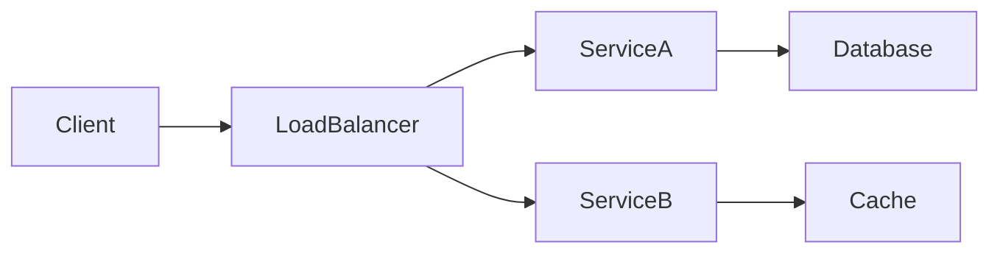

# Content Authoring Guidelines

inclusion: auto

## Purpose

This steering file provides guidelines for authoring and editing markdown Topic_Files inside `cs-reference-guide/content/`. All content must be consistent, thorough, and production-oriented.

## Content Location

All markdown content lives exclusively in `cs-reference-guide/content/` organized by category:

```
cs-reference-guide/content/
├── backend/          (Java, Spring, Databases, Messaging, Build Tools, Security)
├── frontend/         (React, TypeScript, Angular, Next.js, HTML-CSS-JS)
├── infrastructure/   (Docker, Kubernetes, AWS, CI-CD, Linux, Observability)
├── data-structures-and-algorithms/
├── system-design/    (DDIA, Distributed Systems, Design Patterns)
├── interview-prep/   (Cracking the Coding Interview, Grokking, Practice, Behavioral)
└── git/
```

## Mandatory File Structure

Every Topic_File MUST follow this exact section order:

1. **H1 Title** — The topic name
2. **## Quick Reference** — At least 3 bullet points of key facts, syntax, or commands
3. **## When to Use** — Scenarios where this technology/pattern applies
4. **## Code Examples** — At least 2 language-annotated fenced code blocks
5. **## Architecture / Diagrams** (if applicable) — Mermaid diagrams for flows, relationships
6. **## Common Pitfalls** — At least 3 mistakes developers make
7. **## Real-World Use Cases** — Production scenarios with context
8. **## Interview Questions** — At least 3 Q&A pairs with concise model answers
9. **## Production Tips** — At least 2 operational tips (monitoring, failure modes, scaling)
10. **## Related Topics** — Links to at least 2 other Topic_Files

## Quality Standards

- Minimum 1500 words of prose (excluding code blocks, headings, diagrams)
- No section should have fewer than 100 words unless it's purely code/diagram
- Target audience: senior-level software engineer preparing for interviews
- Content should be production-oriented, not tutorial-level
- Use specific numbers, real tool names, and concrete examples

## Formatting Rules

- H1 for topic title, H2 for major sections, H3 for subsections
- Use `**bold**` for key terms on first mention
- Use `` `code` `` for commands, function names, config values
- Use language-annotated fenced code blocks: ```java, ```typescript, ```yaml, etc.
- Use Mermaid diagrams (```mermaid) instead of images
- NO external image URLs
- NO local .png references (use Mermaid or ASCII art)
- Use admonitions for important callouts: `> [!NOTE]`, `> [!WARNING]`, `> [!TIP]`

## Mermaid Diagram Guidelines

Use Mermaid for:
- Architecture diagrams (graph TB/LR)
- Sequence diagrams (sequenceDiagram)
- Class diagrams (classDiagram)
- State machines (stateDiagram-v2)
- Flowcharts (flowchart TD)

Example:
````markdown

````

## Interview Questions Format

```markdown
**Q: What is the difference between X and Y?**

A: X handles [specific behavior] while Y handles [different behavior]. In production, you'd choose X when [condition] because [reason]. The key trade-off is [trade-off].
```

## Related Topics Format

```markdown
## Related Topics

- [Topic Name](../category/filename.md) — Brief reason for relevance
- [Another Topic](../other-category/filename.md) — Connection explanation
```
