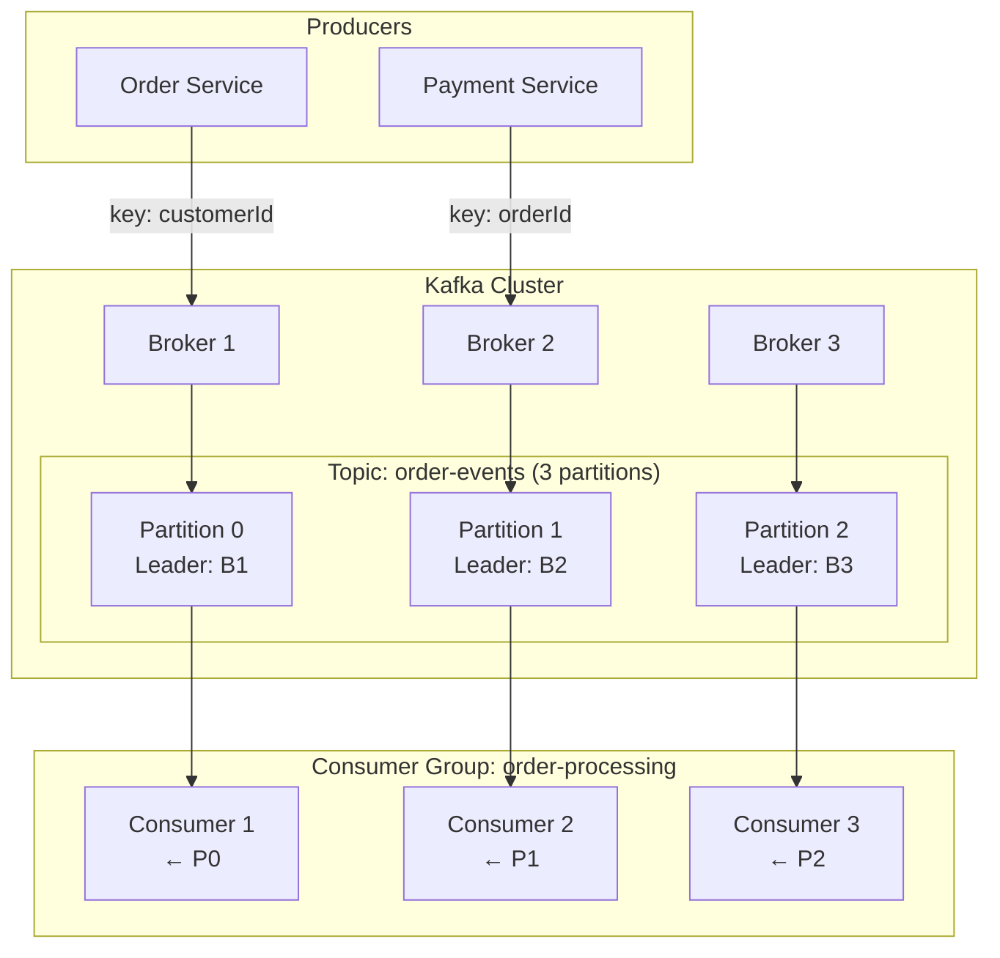
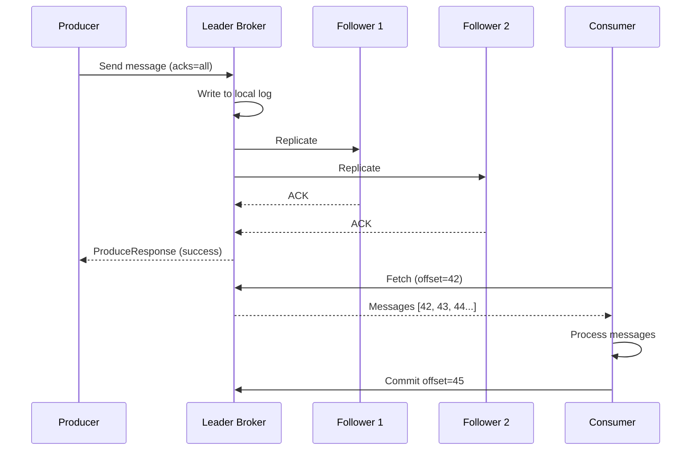

# Apache Kafka

## Quick Reference

- Apache Kafka is a distributed event streaming platform for high-throughput, fault-tolerant messaging
- Core abstractions: Topics (logical streams), Partitions (parallelism units), Offsets (message positions)
- Components: Producers (publish), Consumers (subscribe), Brokers (store), Consumer Groups (parallel consumption)
- APIs: Producer API, Consumer API, Streams API, Connect API
- KRaft mode (Kafka 3.3+) replaces ZooKeeper with built-in Raft-based metadata management
- Retention: time-based (`retention.ms`) or size-based (`retention.bytes`); log compaction for key-based topics
- Guarantees: at-least-once (default), exactly-once semantics (EOS) with idempotent producers and transactions

## When to Use

Kafka is the right choice when you need a durable, high-throughput event backbone connecting multiple producers and consumers in a decoupled architecture. Use Kafka for real-time event streaming between microservices, log aggregation from distributed systems, change data capture (CDC) from databases, clickstream analytics, and IoT sensor data ingestion. Kafka excels when you need message replay (consumers can re-read from any offset), ordering guarantees within partitions, and horizontal scalability by adding partitions and brokers. Choose Kafka over traditional message queues when you need persistent event logs, multiple independent consumers reading the same data, or stream processing with Kafka Streams or ksqlDB.

## Code Examples

### Producer Configuration and Usage

```java
// High-throughput producer configuration
Properties props = new Properties();
props.put(ProducerConfig.BOOTSTRAP_SERVERS_CONFIG, "broker1:9092,broker2:9092");
props.put(ProducerConfig.KEY_SERIALIZER_CLASS_CONFIG, StringSerializer.class.getName());
props.put(ProducerConfig.VALUE_SERIALIZER_CLASS_CONFIG, JsonSerializer.class.getName());
props.put(ProducerConfig.ACKS_CONFIG, "all");           // Wait for all replicas
props.put(ProducerConfig.RETRIES_CONFIG, 3);
props.put(ProducerConfig.ENABLE_IDEMPOTENCE_CONFIG, true); // Exactly-once semantics
props.put(ProducerConfig.BATCH_SIZE_CONFIG, 16384);     // 16KB batch
props.put(ProducerConfig.LINGER_MS_CONFIG, 5);          // Wait 5ms to batch

KafkaProducer<String, OrderEvent> producer = new KafkaProducer<>(props);

// Async send with callback
ProducerRecord<String, OrderEvent> record = new ProducerRecord<>(
    "order-events",           // topic
    order.getCustomerId(),    // key (determines partition)
    new OrderEvent(order)     // value
);

producer.send(record, (metadata, exception) -> {
    if (exception != null) {
        log.error("Failed to send message", exception);
    } else {
        log.info("Sent to partition {} offset {}",
            metadata.partition(), metadata.offset());
    }
});
```

### Consumer Group Processing

```java
// Consumer configuration
Properties props = new Properties();
props.put(ConsumerConfig.BOOTSTRAP_SERVERS_CONFIG, "broker1:9092,broker2:9092");
props.put(ConsumerConfig.GROUP_ID_CONFIG, "order-processing-group");
props.put(ConsumerConfig.KEY_DESERIALIZER_CLASS_CONFIG, StringDeserializer.class.getName());
props.put(ConsumerConfig.VALUE_DESERIALIZER_CLASS_CONFIG, JsonDeserializer.class.getName());
props.put(ConsumerConfig.AUTO_OFFSET_RESET_CONFIG, "earliest");
props.put(ConsumerConfig.ENABLE_AUTO_COMMIT_CONFIG, false); // Manual commit

KafkaConsumer<String, OrderEvent> consumer = new KafkaConsumer<>(props);
consumer.subscribe(List.of("order-events"));

try {
    while (running) {
        ConsumerRecords<String, OrderEvent> records = consumer.poll(Duration.ofMillis(100));
        for (ConsumerRecord<String, OrderEvent> record : records) {
            processOrder(record.value());
            log.info("Processed: partition={}, offset={}, key={}",
                record.partition(), record.offset(), record.key());
        }
        consumer.commitSync(); // Commit after successful processing
    }
} finally {
    consumer.close();
}
```

### Kafka Streams Processing

```java
// Stream processing topology
StreamsBuilder builder = new StreamsBuilder();

KStream<String, OrderEvent> orders = builder.stream("order-events");

// Branch into fulfilled and cancelled streams
Map<String, KStream<String, OrderEvent>> branches = orders
    .split(Named.as("order-"))
    .branch((key, order) -> order.getStatus() == FULFILLED, Branched.as("fulfilled"))
    .branch((key, order) -> order.getStatus() == CANCELLED, Branched.as("cancelled"))
    .defaultBranch(Branched.as("other"));

// Aggregate revenue per customer in a time window
KTable<Windowed<String>, Double> revenueByCustomer = branches.get("order-fulfilled")
    .groupByKey()
    .windowedBy(TimeWindows.ofSizeWithNoGrace(Duration.ofHours(1)))
    .aggregate(
        () -> 0.0,
        (key, order, total) -> total + order.getAmount(),
        Materialized.with(Serdes.String(), Serdes.Double())
    );

revenueByCustomer.toStream()
    .map((windowedKey, revenue) -> KeyValue.pair(windowedKey.key(), revenue))
    .to("customer-hourly-revenue");
```

### CLI Commands

```bash
# Create a topic with replication
kafka-topics.sh --bootstrap-server localhost:9092 \
  --create --topic order-events \
  --partitions 12 --replication-factor 3

# Describe topic configuration
kafka-topics.sh --bootstrap-server localhost:9092 \
  --describe --topic order-events

# Produce test messages
kafka-console-producer.sh --bootstrap-server localhost:9092 \
  --topic order-events \
  --property "key.separator=:" \
  --property "parse.key=true"

# Consume from beginning with group
kafka-console-consumer.sh --bootstrap-server localhost:9092 \
  --topic order-events --from-beginning \
  --group test-consumer --property print.key=true

# Check consumer group lag
kafka-consumer-groups.sh --bootstrap-server localhost:9092 \
  --describe --group order-processing-group
```

## Architecture and Diagrams





## Common Pitfalls

1. **Consumer lag accumulation**: Consumers processing slower than producers causes growing lag. Monitor `records-lag-max` metric and scale consumer instances (up to partition count). Consider increasing `max.poll.records` or optimizing processing logic.

2. **Partition count too low**: Under-partitioned topics limit parallelism since each partition can only be consumed by one consumer in a group. Plan partition count based on target throughput, but note that partitions cannot be reduced after creation.

3. **Large messages**: Messages exceeding `message.max.bytes` (default 1MB) are rejected. For large payloads, store data in object storage (S3) and send only references through Kafka, or increase broker and producer max message size settings.

4. **Rebalancing storms**: Frequent consumer group rebalances cause processing pauses. Tune `session.timeout.ms`, `heartbeat.interval.ms`, and `max.poll.interval.ms`. Use cooperative sticky assignor (`partition.assignment.strategy`) to minimize partition movement.

5. **Offset management errors**: Auto-commit with processing failures leads to message loss. Manual commit before processing leads to duplicates on failure. Use idempotent processing with manual commit after successful processing, or enable exactly-once semantics with transactions.

## Real-World Use Cases

- **Event-driven microservices**: Kafka serves as the central nervous system connecting services through domain events (OrderCreated, PaymentProcessed, InventoryReserved), enabling loose coupling and eventual consistency across bounded contexts. Services can be deployed, scaled, and evolved independently while maintaining data consistency through event sourcing patterns.

- **Real-time fraud detection**: Financial institutions stream transaction events through Kafka, applying windowed aggregations and pattern matching via Kafka Streams to detect anomalous spending patterns within milliseconds of transaction occurrence. The ability to replay events enables model retraining and backtesting against historical transaction data.

- **Change data capture (CDC)**: Debezium connectors capture database changes (inserts, updates, deletes) as Kafka events, enabling real-time data synchronization between systems, cache invalidation, and search index updates without polling. This eliminates dual-write problems and ensures downstream systems eventually converge with the source of truth.

- **Log aggregation and observability**: Applications publish structured logs to Kafka topics, which are then consumed by Elasticsearch for search, Prometheus for metrics extraction, and S3 for long-term archival, all independently and at their own pace. Kafka's retention guarantees that no log data is lost even when downstream consumers experience temporary outages.

- **Stream processing pipelines**: Organizations build real-time ETL pipelines using Kafka Connect for ingestion, Kafka Streams or Apache Flink for transformation, and Kafka Connect sinks for loading into data warehouses, enabling sub-minute data freshness for analytics dashboards that previously relied on nightly batch jobs.

## Interview Questions

**Q: How does Kafka guarantee message ordering?**
A: Kafka guarantees ordering only within a single partition. Messages with the same key are routed to the same partition via consistent hashing, ensuring ordered processing for that key. Cross-partition ordering is not guaranteed. For global ordering, use a single partition (sacrificing parallelism) or implement sequence numbers with consumer-side reordering.

**Q: Explain the difference between at-least-once, at-most-once, and exactly-once delivery.**
A: At-most-once: commit offset before processing (may lose messages on failure). At-least-once: commit after processing (may reprocess on failure, default). Exactly-once: uses idempotent producers (`enable.idempotence=true`) and transactional APIs to atomically write to multiple partitions and commit offsets, ensuring each message is processed exactly once even across failures.

**Q: What happens when a consumer in a group fails?**
A: When a consumer stops sending heartbeats (exceeds `session.timeout.ms`), the group coordinator triggers a rebalance. The failed consumer's partitions are redistributed among remaining consumers in the group. During rebalance, consumption pauses briefly. The new consumer resumes from the last committed offset, potentially reprocessing some messages (at-least-once semantics).

**Q: How does Kafka achieve high throughput?**
A: Kafka achieves high throughput through: sequential disk I/O (append-only logs), zero-copy transfer (sendfile syscall), batching (producers batch messages, brokers write batches), compression (snappy/lz4/zstd), page cache utilization (OS-level caching), and partition-level parallelism allowing horizontal scaling of both producers and consumers.

## Production Tips

- **Partition count planning**: Target 10-30 MB/s per partition. For 300 MB/s throughput, use at least 10-30 partitions. Over-partitioning increases metadata overhead and end-to-end latency, so balance parallelism needs against operational complexity. Remember that partitions can be increased but never decreased, so start conservatively and scale up based on observed throughput requirements.

- **Monitoring essentials**: Track `UnderReplicatedPartitions` (data loss risk), `RequestHandlerAvgIdlePercent` (broker saturation), consumer group lag (processing delays), and `NetworkProcessorAvgIdlePercent` (network thread saturation). Set up PagerDuty alerts for ISR shrinkage and consumer lag exceeding your SLA threshold, as these indicate imminent data loss or processing delays.

- **Retention and compaction**: Use time-based retention for event logs (7-30 days typical) and log compaction for state topics (keeps latest value per key). Set `min.compaction.lag.ms` to ensure consumers have time to read before compaction removes old values. For audit logs, consider infinite retention with tiered storage to S3 for cost-effective long-term archival.

- **Disaster recovery**: Use MirrorMaker 2 for cross-datacenter replication. Configure `min.insync.replicas=2` with `acks=all` to prevent data loss when a broker fails. Test failover procedures regularly with chaos engineering. Document and rehearse the procedure for unclean leader election, which trades data loss for availability when all replicas are down.

- **Consumer tuning**: Set `max.poll.interval.ms` higher than your worst-case processing time to prevent unnecessary rebalances. Use `fetch.min.bytes` and `fetch.max.wait.ms` to batch fetches efficiently. For latency-sensitive consumers, reduce `fetch.max.wait.ms` to 100ms; for throughput-oriented consumers, increase `fetch.min.bytes` to 1MB.

## Related Topics

- [Spring Framework](./spring-framework.md) - Spring Cloud Stream and Spring Kafka provide high-level Kafka integration
- [Java](./java.md) - Kafka clients and Kafka Streams are Java-native libraries
- [MongoDB](./mongodb.md) - MongoDB Kafka Connector enables CDC from MongoDB to Kafka
