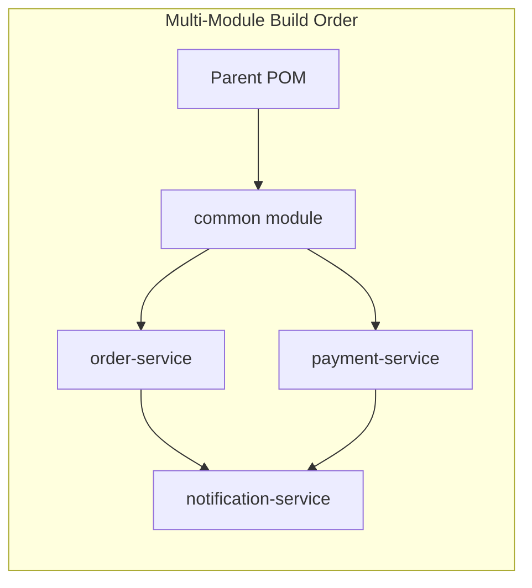

# Apache Maven

## Quick Reference

- Maven is a declarative build automation and project management tool for Java using `pom.xml`
- GAV coordinates: `groupId` (organization), `artifactId` (project name), `version` (release identifier)
- Three built-in lifecycles: Clean (remove artifacts), Default (compile/test/package/deploy), Site (documentation)
- Standard directory: `src/main/java`, `src/main/resources`, `src/test/java`, `target/`
- Dependency scopes: `compile` (default), `provided`, `runtime`, `test`, `system`, `import`
- Repository hierarchy: Local (`~/.m2/repository`) → Remote (Nexus/Artifactory) → Maven Central
- SNAPSHOT versions for development; release versions for production deployments

## When to Use

Maven is the standard build tool for enterprise Java projects where convention over configuration, reproducible builds, and centralized dependency management are priorities. Choose Maven when your team values a well-defined project structure, declarative build configuration, and extensive plugin ecosystem. Maven excels in multi-module projects where parent POMs enforce consistent dependency versions and build configurations across dozens of modules. It integrates seamlessly with CI/CD pipelines, artifact repositories (Nexus, Artifactory), and IDE tooling. Use Maven when you need reliable transitive dependency resolution, standardized build lifecycles, and the ability to share build logic across projects through custom parent POMs and BOMs (Bill of Materials). Maven's strict convention-over-configuration approach means new team members can understand any Maven project immediately because the directory structure, lifecycle phases, and dependency declarations follow universal patterns. The vast majority of Java libraries publish to Maven Central with POM metadata, making Maven the most compatible choice for dependency consumption in the Java ecosystem.

## Code Examples

### POM Configuration

```xml
<?xml version="1.0" encoding="UTF-8"?>
<project xmlns="http://maven.apache.org/POM/4.0.0"
         xmlns:xsi="http://www.w3.org/2001/XMLSchema-instance"
         xsi:schemaLocation="http://maven.apache.org/POM/4.0.0
         http://maven.apache.org/xsd/maven-4.0.0.xsd">
    <modelVersion>4.0.0</modelVersion>

    <parent>
        <groupId>org.springframework.boot</groupId>
        <artifactId>spring-boot-starter-parent</artifactId>
        <version>3.2.0</version>
    </parent>

    <groupId>com.example</groupId>
    <artifactId>order-service</artifactId>
    <version>1.0.0-SNAPSHOT</version>
    <packaging>jar</packaging>

    <properties>
        <java.version>21</java.version>
        <mapstruct.version>1.5.5.Final</mapstruct.version>
        <testcontainers.version>1.19.3</testcontainers.version>
    </properties>

    <dependencies>
        <dependency>
            <groupId>org.springframework.boot</groupId>
            <artifactId>spring-boot-starter-web</artifactId>
        </dependency>
        <dependency>
            <groupId>org.springframework.boot</groupId>
            <artifactId>spring-boot-starter-data-jpa</artifactId>
        </dependency>
        <dependency>
            <groupId>org.mapstruct</groupId>
            <artifactId>mapstruct</artifactId>
            <version>${mapstruct.version}</version>
        </dependency>
        <dependency>
            <groupId>org.springframework.boot</groupId>
            <artifactId>spring-boot-starter-test</artifactId>
            <scope>test</scope>
        </dependency>
    </dependencies>

    <build>
        <plugins>
            <plugin>
                <groupId>org.springframework.boot</groupId>
                <artifactId>spring-boot-maven-plugin</artifactId>
            </plugin>
            <plugin>
                <groupId>org.apache.maven.plugins</groupId>
                <artifactId>maven-compiler-plugin</artifactId>
                <configuration>
                    <annotationProcessorPaths>
                        <path>
                            <groupId>org.mapstruct</groupId>
                            <artifactId>mapstruct-processor</artifactId>
                            <version>${mapstruct.version}</version>
                        </path>
                    </annotationProcessorPaths>
                </configuration>
            </plugin>
        </plugins>
    </build>
</project>
```

### Multi-Module Project Structure

```xml
<!-- Parent POM -->
<project>
    <groupId>com.example</groupId>
    <artifactId>ecommerce-platform</artifactId>
    <version>1.0.0-SNAPSHOT</version>
    <packaging>pom</packaging>

    <modules>
        <module>common</module>
        <module>order-service</module>
        <module>payment-service</module>
        <module>notification-service</module>
    </modules>

    <dependencyManagement>
        <dependencies>
            <dependency>
                <groupId>com.example</groupId>
                <artifactId>common</artifactId>
                <version>${project.version}</version>
            </dependency>
            <dependency>
                <groupId>org.testcontainers</groupId>
                <artifactId>testcontainers-bom</artifactId>
                <version>${testcontainers.version}</version>
                <type>pom</type>
                <scope>import</scope>
            </dependency>
        </dependencies>
    </dependencyManagement>
</project>
```

### Common Maven Commands

```bash
# Clean and build with tests
mvn clean install

# Skip tests for faster builds
mvn clean package -DskipTests

# Run specific test class
mvn test -Dtest=OrderServiceTest

# Display dependency tree (debug conflicts)
mvn dependency:tree

# Check for dependency updates
mvn versions:display-dependency-updates

# Generate project from archetype
mvn archetype:generate \
  -DgroupId=com.example \
  -DartifactId=my-service \
  -DarchetypeArtifactId=maven-archetype-quickstart

# Deploy to remote repository
mvn clean deploy -P release

# Run with specific profile
mvn spring-boot:run -Dspring-boot.run.profiles=dev
```

## Architecture and Diagrams

```mermaid
graph TB
    subgraph "Maven Build Lifecycle (Default)"
        VALIDATE[validate] --> COMPILE[compile]
        COMPILE --> TEST[test]
        TEST --> PACKAGE[package]
        PACKAGE --> VERIFY[verify]
        VERIFY --> INSTALL[install]
        INSTALL --> DEPLOY[deploy]
    end
    
    subgraph "Repository Resolution"
        POM[pom.xml] --> LOCAL[Local Repository<br/>~/.m2/repository]
        LOCAL -->|Cache Miss| REMOTE[Remote Repository<br/>Nexus/Artifactory]
        REMOTE -->|Cache Miss| CENTRAL[Maven Central]
    end
    
    subgraph "Dependency Resolution"
        DIRECT[Direct Dependencies] --> TRANSITIVE[Transitive Dependencies]
        TRANSITIVE --> CONFLICT[Conflict Resolution<br/>Nearest Definition Wins]
        CONFLICT --> CLASSPATH[Final Classpath]
    end
```





## Common Pitfalls

1. **Dependency version conflicts**: Transitive dependencies can pull in incompatible versions. Use `mvn dependency:tree` to identify conflicts, `<dependencyManagement>` in parent POMs to enforce versions, and `<exclusions>` to remove unwanted transitive dependencies. The `maven-enforcer-plugin` with `dependencyConvergence` rule can fail builds when conflicting versions are detected.

2. **SNAPSHOT in production**: SNAPSHOT versions are mutable and can change between builds, making production deployments non-reproducible. Always release with fixed versions for production. Use the Maven Release Plugin to automate version bumping and tagging. Configure the enforcer plugin to reject SNAPSHOT dependencies in release builds.

3. **Missing dependency scope**: Omitting `<scope>test</scope>` for test libraries (JUnit, Mockito) packages them into the production artifact, bloating deployment size and potentially causing classpath conflicts. Similarly, using `compile` scope for servlet APIs that the container provides leads to classloader conflicts at runtime.

4. **Plugin version not pinned**: Not specifying plugin versions means Maven uses the latest available, which can break builds when a new plugin version introduces incompatible changes. Always pin plugin versions in `<pluginManagement>`. Use the `versions-maven-plugin` to check for available updates in a controlled manner.

5. **Reactor build order issues**: In multi-module projects, modules must be listed in dependency order or Maven may fail to resolve inter-module dependencies. Use `mvn validate` to verify the reactor build order before full builds. The `-pl` flag with `-am` (also-make) ensures transitive module dependencies are built correctly when building a subset of modules.

## Real-World Use Cases

- **Enterprise monorepo management**: Large organizations use Maven multi-module projects with parent POMs to enforce consistent Java versions, dependency versions, code style plugins (Checkstyle, SpotBugs), and test coverage thresholds across hundreds of modules. The parent POM serves as a governance mechanism ensuring all teams follow organizational standards without manual review.

- **CI/CD pipeline integration**: Maven's lifecycle phases map directly to CI stages: `mvn verify` for PR checks, `mvn deploy` for artifact publishing, and `mvn site` for documentation generation, with profiles activating environment-specific configurations. The deterministic lifecycle makes it straightforward to parallelize builds and cache dependencies across pipeline runs.

- **Library publishing**: Open-source and internal libraries use Maven for publishing to Maven Central or private Nexus/Artifactory repositories, with the Maven Release Plugin handling version management, SCM tagging, and deployment signing. The standardized POM metadata enables consumers to discover transitive dependencies, source jars, and javadoc automatically.

- **Bill of Materials (BOM)**: Platform teams publish BOM POMs that define compatible dependency versions, allowing application teams to import the BOM and use dependencies without specifying versions, ensuring consistency across the organization. Spring Boot's starter parent and AWS SDK BOM are prominent examples of this pattern in production.

- **Compliance and auditing**: Maven's dependency tree and enforcer plugin enable automated compliance checks, ensuring no banned licenses (GPL in proprietary code), no known vulnerable versions, and no SNAPSHOT dependencies reach production builds, satisfying enterprise governance and security audit requirements.

## Interview Questions

**Q: What is the difference between `<dependencies>` and `<dependencyManagement>`?**
A: `<dependencies>` directly adds dependencies to the current module's classpath. `<dependencyManagement>` only declares version and scope defaults that child modules inherit when they reference the same dependency without specifying a version. It centralizes version control without forcing all children to include the dependency.

**Q: Explain Maven's dependency resolution strategy for version conflicts.**
A: Maven uses "nearest definition wins" — the version declared closest to the project in the dependency tree takes precedence. For equal depth, the first declaration in the POM wins. Use `<dependencyManagement>` to override this behavior and enforce specific versions regardless of tree depth.

**Q: What is the difference between `mvn install` and `mvn deploy`?**
A: `mvn install` packages the artifact and copies it to the local repository (`~/.m2/repository`) for use by other local projects. `mvn deploy` does everything `install` does plus uploads the artifact to a remote repository (Nexus, Artifactory) for sharing with other developers and CI systems.

**Q: How do Maven profiles work and when would you use them?**
A: Profiles are named sets of configuration (dependencies, plugins, properties) activated by conditions: `-P` flag, OS detection, JDK version, property existence, or file presence. Use profiles for environment-specific builds (dev/staging/prod), optional features (integration tests), or platform-specific configurations (Windows vs. Linux native dependencies).

## Production Tips

- **Reproducible builds**: Pin all plugin versions, use `<dependencyManagement>` for all dependencies, and configure the `maven-enforcer-plugin` to fail builds with SNAPSHOT dependencies or unpinned plugin versions in release branches. Enable the `maven-enforcer-plugin`'s `requireReleaseDeps` rule in release profiles to prevent accidental SNAPSHOT leakage into production artifacts.

- **Build speed optimization**: Use `-T 1C` for parallel module builds (1 thread per CPU core), `mvn install -pl module-name -am` to build only changed modules and their dependencies, and configure the Maven Daemon (`mvnd`) for persistent JVM reuse. In CI environments, cache the `~/.m2/repository` directory between builds to avoid re-downloading dependencies on every run.

- **Dependency vulnerability scanning**: Integrate `org.owasp:dependency-check-maven` plugin to scan dependencies against the NVD (National Vulnerability Database) and fail builds when critical CVEs are detected in production dependencies. Configure suppression files for false positives and set `failBuildOnCVSS` threshold to 7.0 for critical-only enforcement during initial adoption.

- **Artifact repository hygiene**: Configure retention policies in Nexus/Artifactory to automatically clean old SNAPSHOT versions. Use `<distributionManagement>` with separate snapshot and release repositories to keep release artifacts immutable. Set up repository health checks to alert when disk usage exceeds thresholds or when artifact uploads fail silently.

- **Release process automation**: Use the `maven-release-plugin` or `jgitflow-maven-plugin` to automate version bumping, SCM tagging, and deployment. Configure `<scm>` connection URLs correctly and test the release process in a staging environment before running against production repositories to avoid partial releases that leave the repository in an inconsistent state.

## Related Topics

- [Java](./java.md) - Maven is the primary build tool for Java projects
- [Spring Framework](./spring-framework.md) - Spring Boot Starter Parent provides Maven configuration for Spring projects
- [Gradle](./gradle.md) - Alternative build tool offering Groovy/Kotlin DSL and incremental builds
- [Security](./security.md) - OWASP dependency-check Maven plugin for vulnerability scanning
