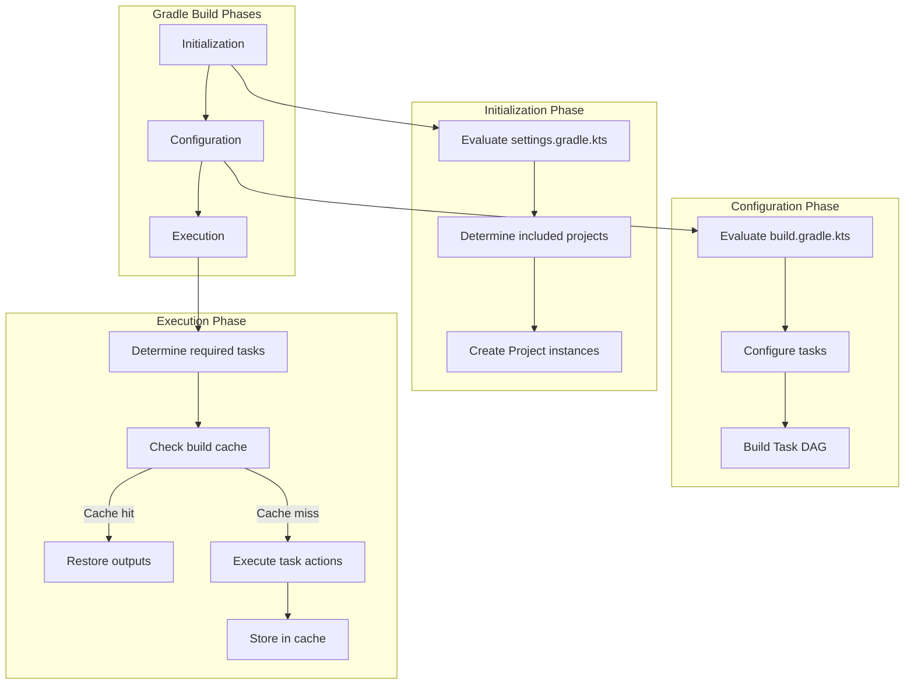
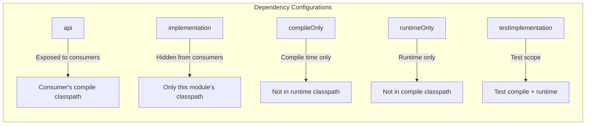
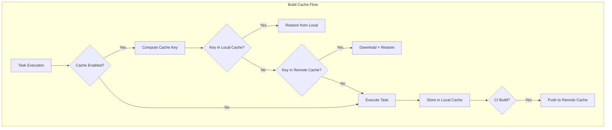

# Gradle

## Quick Reference

- Gradle uses a **Kotlin DSL** (`build.gradle.kts`) or Groovy DSL (`build.gradle`) — Kotlin DSL provides type-safe configuration with IDE autocompletion
- Build execution is based on a **Directed Acyclic Graph (DAG)** of tasks — Gradle determines execution order from task dependencies, not a fixed lifecycle
- **Configurations** replace Maven scopes: `implementation` (compile + runtime, not exposed to consumers), `api` (exposed to consumers), `compileOnly`, `runtimeOnly`, `testImplementation`
- **Incremental compilation** recompiles only changed files and their dependents — 10-100x faster than full recompilation for large projects
- **Build cache** (local and remote) stores task outputs keyed by inputs — identical inputs produce cached outputs, skipping execution entirely
- **Gradle Wrapper** (`gradlew`) pins the Gradle version per project — always commit `gradle/wrapper/` to version control
- **Version catalogs** (`gradle/libs.versions.toml`) centralize dependency versions in a type-safe, IDE-friendly format
- **Convention plugins** (`buildSrc/` or included builds) extract shared build logic into reusable plugins applied across modules
- **Configuration cache** serializes the task graph after configuration phase — subsequent builds skip configuration entirely (seconds saved per build)
- Multi-project builds use `settings.gradle.kts` with `include()` for subprojects and `includeBuild()` for composite builds

## When to Use

Gradle is the optimal choice for large JVM projects where build performance directly impacts developer productivity and CI costs. Choose Gradle when your project has 10+ modules and full builds exceed 5 minutes with Maven — Gradle's incremental compilation, build cache, and parallel execution can reduce build times by 50-80%. Gradle excels when you need custom build logic beyond what Maven plugins offer — its imperative Kotlin/Groovy DSL allows loops, conditionals, and custom tasks without writing a full plugin. Use Gradle for Android development (it is the official build system), for polyglot projects mixing Java, Kotlin, Scala, and Groovy, or when your CI/CD pipeline benefits from remote build caching (Gradle Enterprise/Develocity provides shared caches across all developers and CI agents). Gradle is preferred when your team values build performance optimization — configuration cache, parallel execution, and file system watching (`--continuous`) provide a development experience closer to interpreted languages. Avoid Gradle for small projects where Maven's convention-over-configuration simplicity is sufficient, for teams unfamiliar with Kotlin/Groovy who would struggle with the DSL, or for organizations with heavy Maven tooling investment (Nexus staging rules, Maven-specific CI plugins) that would require migration effort.

## Code Examples

### build.gradle.kts — Kotlin DSL Fundamentals

```kotlin
// build.gradle.kts
plugins {
    java
    id("org.springframework.boot") version "3.2.1"
    id("io.spring.dependency-management") version "1.1.4"
    id("com.google.cloud.tools.jib") version "3.4.0"
    jacoco
}

group = "com.example"
version = "2.1.0-SNAPSHOT"

java {
    toolchain {
        languageVersion = JavaLanguageVersion.of(21)
    }
}

repositories {
    mavenCentral()
    maven {
        url = uri("https://nexus.internal.company.com/repository/maven-releases/")
        credentials {
            username = providers.gradleProperty("nexusUsername").orNull
                ?: System.getenv("NEXUS_USERNAME")
            password = providers.gradleProperty("nexusPassword").orNull
                ?: System.getenv("NEXUS_PASSWORD")
        }
    }
}

dependencies {
    // implementation — compile + runtime, NOT exposed to consumers
    implementation("org.springframework.boot:spring-boot-starter-web")
    implementation("org.springframework.boot:spring-boot-starter-data-jpa")
    implementation("org.springframework.boot:spring-boot-starter-validation")
    implementation("org.springframework.boot:spring-boot-starter-actuator")

    // compileOnly — available at compile time only (like Maven's provided)
    compileOnly("org.projectlombok:lombok")
    annotationProcessor("org.projectlombok:lombok")
    annotationProcessor("org.mapstruct:mapstruct-processor:1.5.5.Final")

    // runtimeOnly — available at runtime only (not needed for compilation)
    runtimeOnly("org.postgresql:postgresql")
    runtimeOnly("io.micrometer:micrometer-registry-prometheus")

    // testImplementation — test compile + runtime
    testImplementation("org.springframework.boot:spring-boot-starter-test")
    testImplementation("org.testcontainers:postgresql")
    testImplementation("org.testcontainers:junit-jupiter")

    // testRuntimeOnly — test runtime only
    testRuntimeOnly("org.junit.platform:junit-platform-launcher")
}

tasks.withType<Test> {
    useJUnitPlatform()
    maxParallelForks = Runtime.getRuntime().availableProcessors() / 2
    
    testLogging {
        events("passed", "skipped", "failed")
        showStandardStreams = true
    }

    // Enable test retry for flaky tests in CI
    if (System.getenv("CI") != null) {
        retry {
            maxRetries = 2
            maxFailures = 5
        }
    }
}

tasks.jacocoTestReport {
    dependsOn(tasks.test)
    reports {
        xml.required = true
        html.required = true
    }
}

tasks.jacocoTestCoverageVerification {
    violationRules {
        rule {
            limit {
                minimum = "0.80".toBigDecimal()
            }
        }
    }
}

// Jib — containerize without Docker daemon
jib {
    from {
        image = "eclipse-temurin:21-jre-alpine"
    }
    to {
        image = "registry.example.com/${project.name}"
        tags = setOf(version.toString(), "latest")
    }
    container {
        jvmFlags = listOf(
            "-XX:+UseG1GC",
            "-XX:MaxRAMPercentage=75.0",
            "-Djava.security.egd=file:/dev/./urandom"
        )
        ports = listOf("8080")
        creationTime = "USE_CURRENT_TIMESTAMP"
    }
}
```

### Version Catalogs (libs.versions.toml)

```toml
# gradle/libs.versions.toml
[versions]
spring-boot = "3.2.1"
spring-dependency-management = "1.1.4"
testcontainers = "1.19.3"
mapstruct = "1.5.5.Final"
lombok = "1.18.30"
jib = "3.4.0"
spotless = "6.23.3"

[libraries]
# Spring Boot starters
spring-boot-starter-web = { module = "org.springframework.boot:spring-boot-starter-web" }
spring-boot-starter-data-jpa = { module = "org.springframework.boot:spring-boot-starter-data-jpa" }
spring-boot-starter-validation = { module = "org.springframework.boot:spring-boot-starter-validation" }
spring-boot-starter-actuator = { module = "org.springframework.boot:spring-boot-starter-actuator" }
spring-boot-starter-test = { module = "org.springframework.boot:spring-boot-starter-test" }

# Database
postgresql = { module = "org.postgresql:postgresql" }

# Mapping
mapstruct = { module = "org.mapstruct:mapstruct", version.ref = "mapstruct" }
mapstruct-processor = { module = "org.mapstruct:mapstruct-processor", version.ref = "mapstruct" }

# Testing
testcontainers-bom = { module = "org.testcontainers:testcontainers-bom", version.ref = "testcontainers" }
testcontainers-postgresql = { module = "org.testcontainers:postgresql" }
testcontainers-junit = { module = "org.testcontainers:junit-jupiter" }

# Code quality
lombok = { module = "org.projectlombok:lombok", version.ref = "lombok" }

[bundles]
spring-web = ["spring-boot-starter-web", "spring-boot-starter-validation", "spring-boot-starter-actuator"]
testing = ["spring-boot-starter-test", "testcontainers-postgresql", "testcontainers-junit"]

[plugins]
spring-boot = { id = "org.springframework.boot", version.ref = "spring-boot" }
spring-dependency-management = { id = "io.spring.dependency-management", version.ref = "spring-dependency-management" }
jib = { id = "com.google.cloud.tools.jib", version.ref = "jib" }
spotless = { id = "com.diffplug.spotless", version.ref = "spotless" }
```

```kotlin
// build.gradle.kts using version catalog
plugins {
    java
    alias(libs.plugins.spring.boot)
    alias(libs.plugins.spring.dependency.management)
    alias(libs.plugins.jib)
}

dependencies {
    implementation(libs.bundles.spring.web)
    implementation(libs.spring.boot.starter.data.jpa)
    implementation(libs.mapstruct)

    compileOnly(libs.lombok)
    annotationProcessor(libs.lombok)
    annotationProcessor(libs.mapstruct.processor)

    runtimeOnly(libs.postgresql)

    testImplementation(libs.bundles.testing)
}
```

### Multi-Project Build with Convention Plugins

```kotlin
// settings.gradle.kts
rootProject.name = "ecommerce-platform"

// Enable version catalogs
dependencyResolutionManagement {
    versionCatalogs {
        create("libs") {
            from(files("gradle/libs.versions.toml"))
        }
    }
}

// Include subprojects
include(
    "common",
    "domain",
    "persistence",
    "service:order-service",
    "service:payment-service",
    "service:inventory-service",
    "gateway"
)

// Composite build for shared build logic
includeBuild("build-logic")
```

```kotlin
// build-logic/src/main/kotlin/com.example.java-conventions.gradle.kts
// Convention plugin applied to all Java subprojects
plugins {
    java
    jacoco
    id("com.diffplug.spotless")
}

java {
    toolchain {
        languageVersion = JavaLanguageVersion.of(21)
    }
}

repositories {
    mavenCentral()
}

dependencies {
    testImplementation(platform("org.junit:junit-bom:5.10.1"))
    testImplementation("org.junit.jupiter:junit-jupiter")
    testImplementation("org.assertj:assertj-core:3.25.1")
    testImplementation("org.mockito:mockito-core:5.8.0")
}

tasks.test {
    useJUnitPlatform()
    maxParallelForks = (Runtime.getRuntime().availableProcessors() / 2).coerceAtLeast(1)
    finalizedBy(tasks.jacocoTestReport)
}

spotless {
    java {
        googleJavaFormat("1.19.1")
        removeUnusedImports()
        trimTrailingWhitespace()
        endWithNewline()
    }
}
```

```kotlin
// build-logic/src/main/kotlin/com.example.spring-service.gradle.kts
// Convention plugin for Spring Boot microservices
plugins {
    id("com.example.java-conventions")
    id("org.springframework.boot")
    id("io.spring.dependency-management")
    id("com.google.cloud.tools.jib")
}

dependencies {
    implementation("org.springframework.boot:spring-boot-starter-actuator")
    implementation("io.micrometer:micrometer-registry-prometheus")
    runtimeOnly("io.opentelemetry.javaagent:opentelemetry-javaagent:1.32.0")
}

// Subproject build.gradle.kts — minimal configuration
// service/order-service/build.gradle.kts
plugins {
    id("com.example.spring-service")
}

dependencies {
    implementation(project(":domain"))
    implementation(project(":persistence"))
    implementation(libs.spring.boot.starter.web)
    implementation(libs.spring.boot.starter.data.jpa)
}
```

### Custom Tasks and Build Cache Configuration

```kotlin
// Custom task with inputs/outputs for caching
abstract class GenerateApiClient : DefaultTask() {
    @get:InputFile
    abstract val openApiSpec: RegularFileProperty

    @get:OutputDirectory
    abstract val outputDir: DirectoryProperty

    @get:Input
    abstract val packageName: Property<String>

    @TaskAction
    fun generate() {
        val spec = openApiSpec.get().asFile
        val output = outputDir.get().asFile
        // OpenAPI Generator logic here
        logger.lifecycle("Generating API client from ${spec.name} to ${output.path}")
    }
}

tasks.register<GenerateApiClient>("generatePaymentClient") {
    openApiSpec = file("specs/payment-api.yaml")
    outputDir = layout.buildDirectory.dir("generated/payment-client")
    packageName = "com.example.payment.client"
}

tasks.named("compileJava") {
    dependsOn("generatePaymentClient")
}

// settings.gradle.kts — build cache configuration
buildCache {
    local {
        directory = File(rootDir, ".gradle/build-cache")
        removeUnusedEntriesAfterDays = 7
    }
    remote<HttpBuildCache> {
        url = uri("https://gradle-cache.internal.company.com/cache/")
        isPush = System.getenv("CI") != null // Only CI pushes to remote cache
        credentials {
            username = System.getenv("CACHE_USERNAME") ?: ""
            password = System.getenv("CACHE_PASSWORD") ?: ""
        }
    }
}
```

### Performance Optimization Configuration

```kotlin
// gradle.properties — performance tuning
// org.gradle.parallel=true              # Build modules in parallel
// org.gradle.caching=true               # Enable build cache
// org.gradle.configuration-cache=true   # Cache configuration phase
// org.gradle.daemon=true                # Keep daemon running between builds
// org.gradle.jvmargs=-Xmx4g -XX:+UseG1GC -XX:+HeapDumpOnOutOfMemoryError
// org.gradle.workers.max=8              # Max parallel workers

// Programmatic performance configuration
tasks.withType<JavaCompile>().configureEach {
    options.isFork = true
    options.forkOptions.memoryMaximumSize = "2g"
    options.isIncremental = true
}

// Dependency locking for reproducible builds
dependencyLocking {
    lockAllConfigurations()
}

// Resolve all dependencies and write lock file
// ./gradlew dependencies --write-locks
```

```bash
# Gradle Wrapper setup
gradle wrapper --gradle-version 8.5

# Common commands
./gradlew build                          # Full build (compile + test + assemble)
./gradlew test                           # Run tests only
./gradlew :service:order-service:test    # Test specific subproject
./gradlew build --parallel               # Parallel module builds
./gradlew build --build-cache            # Use build cache
./gradlew build --configuration-cache    # Cache configuration phase
./gradlew dependencies                   # Show dependency tree
./gradlew dependencyInsight --dependency guava  # Trace specific dependency
./gradlew build --scan                   # Generate build scan (performance analysis)
./gradlew clean build -x test            # Build without tests
./gradlew tasks --all                    # List all available tasks
```

## Architecture / Diagrams







## Common Pitfalls

**1. Using `compile` and `runtime` configurations (deprecated).** Legacy Gradle configurations (`compile`, `runtime`, `testCompile`) leak dependencies to consumers and prevent build optimization. Always use `implementation` (hidden from consumers), `api` (exposed to consumers), `compileOnly`, and `runtimeOnly`. The `java-library` plugin provides the `api` configuration for libraries that expose types in their public API.

**2. Expensive operations in the configuration phase.** Code in `build.gradle.kts` outside of task actions runs during configuration — even for tasks that will not execute. Reading files, making network calls, or running processes during configuration slows every build invocation. Move expensive operations into task actions, use `providers` for lazy evaluation, and enable the configuration cache to skip configuration entirely on subsequent builds.

**3. Not declaring task inputs and outputs.** Gradle's incremental build and caching rely on knowing what a task reads (inputs) and produces (outputs). Custom tasks without declared inputs/outputs always execute, defeating caching. Annotate task properties with `@InputFile`, `@InputDirectory`, `@OutputFile`, `@OutputDirectory`, and `@Input` for the build cache to function correctly.

**4. Misunderstanding `implementation` vs `api` in libraries.** Using `api` for all dependencies in a library module exposes everything to consumers, creating tight coupling and slow compilation (changes to any `api` dependency trigger recompilation of all consumers). Use `implementation` by default — only use `api` when the dependency's types appear in your library's public API (method signatures, return types, superclasses).

**5. Ignoring dependency resolution conflicts.** Gradle uses "highest version wins" by default, which can silently upgrade a dependency to an incompatible version. Use `failOnVersionConflict()` in the resolution strategy to detect conflicts, `force()` to pin specific versions, or `strictly()` constraints to prevent upgrades. Version catalogs with explicit versions make conflicts visible.

**6. Not leveraging the build cache in CI.** Without a remote build cache, every CI build starts from scratch. A remote cache (Gradle Enterprise/Develocity, or a custom HTTP cache) allows CI agents to reuse outputs from previous builds and from other agents building the same code. This can reduce CI build times by 60-80% for incremental changes. Configure CI to push to the cache and developers to pull only.

**7. Composite builds without proper isolation.** Using `includeBuild()` for local development of dependencies is powerful but can mask version conflicts. The included build's output replaces the published artifact, so you may not notice that the published version has different behavior. Always test with published artifacts before releasing, and use substitution rules explicitly rather than blanket includes.

## Real-World Use Cases

**Android application with 200+ modules.** A large Android application uses Gradle with aggressive modularization — feature modules, library modules, and test modules totaling 200+ subprojects. Convention plugins in `buildSrc` ensure consistent configuration. The build uses Gradle's configuration cache (saving 15 seconds per build), parallel execution across modules, and a remote build cache shared between 50 developers and CI agents. Full clean builds take 8 minutes; incremental builds with cache hits complete in 45 seconds. Build scans identify bottlenecks — a single slow annotation processor was adding 30 seconds to every module.

**Microservices monorepo with shared libraries.** A fintech company maintains 12 Spring Boot microservices in a single Gradle multi-project build. Shared libraries (`common`, `security`, `observability`) are subprojects consumed via `project(":common")`. Version catalogs ensure all services use identical dependency versions. Convention plugins apply Spring Boot configuration, Docker image building (Jib), and OpenTelemetry instrumentation uniformly. Composite builds (`includeBuild("../shared-proto")`) allow local development against the protobuf definitions repository without publishing snapshots.

**CI/CD pipeline with remote build cache.** A platform team deploys Gradle Enterprise (Develocity) as a remote build cache and build scan server. CI agents push task outputs to the cache; developer machines pull from it. When a developer pulls `main` and runs `./gradlew build`, 90% of tasks are cache hits from the CI build that already ran on the same commit. Build times drop from 12 minutes to 90 seconds. Build scans provide visibility into cache miss reasons, helping the team optimize task declarations for better cache hit rates.

**Kotlin multiplatform library publishing.** A team publishes a Kotlin Multiplatform library targeting JVM, JS, and Native. Gradle's Kotlin Multiplatform plugin manages compilation for each target, with shared source sets for common code. The build produces platform-specific artifacts published to Maven Central with Gradle's `maven-publish` plugin. Signing, Javadoc generation, and source JAR creation are configured in a convention plugin. The version catalog manages Kotlin compiler versions, coroutines, and serialization library versions across all targets.

## Interview Questions

**Q: Explain the difference between Gradle's `implementation` and `api` configurations.**

A: `implementation` declares a dependency that is used internally by the module but not exposed to consumers. If module A uses `implementation("com.google.guava:guava")`, modules depending on A cannot see Guava on their compile classpath. `api` declares a dependency that is part of the module's public API — if A's public method returns a Guava `ImmutableList`, consumers need Guava on their compile classpath, so A must use `api`. The distinction matters for compilation performance: changing an `implementation` dependency only recompiles the declaring module, while changing an `api` dependency triggers recompilation of all consumers. Rule of thumb: use `implementation` by default, switch to `api` only when the dependency's types appear in your public API signatures.

**Q: How does Gradle's build cache work, and what determines cache key computation?**

A: Gradle's build cache stores task outputs keyed by a hash of the task's inputs. The cache key is computed from: the task implementation class (bytecode hash), the task's input properties (file contents, string values, etc.), and the task's classpath. When a task executes, Gradle checks the local cache first, then the remote cache. If a matching key exists, outputs are restored without execution. Cache correctness depends on complete input/output declarations — if a task reads a file not declared as an input, the cache may serve stale results. The local cache lives on disk (`~/.gradle/caches/build-cache-1/`); the remote cache is an HTTP server (Gradle Enterprise, custom, or cloud storage). CI agents push to remote; developers pull. This means a developer building code that CI already built gets instant cache hits.

**Q: What is the Gradle configuration cache, and how does it differ from the build cache?**

A: The build cache caches task outputs (compiled classes, test results, JARs). The configuration cache caches the result of the configuration phase — the task graph itself. Without configuration cache, Gradle evaluates all `build.gradle.kts` files on every invocation to build the task graph (typically 2-10 seconds for large projects). With configuration cache enabled, Gradle serializes the configured task graph after the first run and deserializes it on subsequent runs, skipping configuration entirely. The cache is invalidated when build scripts, `gradle.properties`, or environment variables change. Restrictions: configuration-phase code cannot use certain APIs (like `Project` references in task actions), requiring code changes to be compatible. The combination of both caches means: configuration cache skips graph building, build cache skips task execution — resulting in near-instant builds for unchanged code.

**Q: How do you handle dependency version conflicts in Gradle?**

A: Gradle resolves conflicts using "highest version wins" by default — if two dependencies transitively pull different versions of the same library, Gradle selects the highest. To control this: use `failOnVersionConflict()` in `resolutionStrategy` to make conflicts build failures, use `force("group:artifact:version")` to pin a specific version, use `strictly("version")` in dependency declarations to prevent upgrades beyond that version, or use `exclude(group = "...", module = "...")` to remove unwanted transitive dependencies. For visibility, run `./gradlew dependencyInsight --dependency <name>` to trace why a specific version was selected. Version catalogs with explicit versions and `enforcedPlatform()` (BOM with forced versions) provide the most maintainable approach for large projects.

**Q: Compare Gradle's task-based model with Maven's lifecycle-based model.**

A: Maven defines fixed lifecycle phases (compile → test → package → verify → install → deploy) that always execute in order — running `mvn package` always runs compile and test first. Gradle uses a task DAG where tasks declare dependencies on other tasks, and only requested tasks and their dependencies execute. This means `./gradlew jar` runs compilation but not tests (unless `jar` depends on `test`). Gradle's model is more flexible: you can define arbitrary tasks, create complex dependency graphs, and skip unnecessary work. Maven's model is more predictable: every developer knows what `mvn verify` does. Gradle's approach enables better performance (skip unneeded tasks) and customization (insert tasks anywhere in the graph), while Maven's approach provides stronger conventions and simpler mental models.

## Production Tips

**Enable build scans for every CI build.** Gradle build scans (`--scan` or Gradle Enterprise) provide detailed performance analysis: which tasks took longest, cache hit rates, dependency resolution times, and configuration phase duration. Publish scans for every CI build and review them weekly to identify optimization opportunities. A single misconfigured task that disables caching can add minutes to every build across the entire team. Build scans make these issues visible with actionable data.

**Use the configuration cache in CI and local development.** Enable `org.gradle.configuration-cache=true` in `gradle.properties`. For large projects (50+ modules), the configuration phase can take 5-15 seconds — the configuration cache eliminates this entirely on subsequent builds. Fix compatibility issues incrementally: Gradle reports which code is incompatible, and most fixes involve replacing `project.` references with `providers.` in task configurations. The investment pays off immediately for teams running builds dozens of times per day.

**Implement dependency locking for reproducible builds.** Enable `dependencyLocking { lockAllConfigurations() }` and commit lock files to version control. Without locking, dynamic versions (`1.+`, `latest.release`) and version ranges resolve differently over time, making builds non-reproducible. Lock files pin exact resolved versions while still allowing controlled updates via `./gradlew dependencies --write-locks`. This ensures that a build from the same commit always produces the same artifact, which is critical for debugging production issues.

**Optimize CI with remote build cache and test distribution.** Configure a remote build cache (Gradle Enterprise or custom HTTP cache) so CI agents share cached outputs. For test-heavy builds, use Gradle Enterprise's test distribution feature to split test execution across multiple agents — a 30-minute test suite runs in 5 minutes across 6 agents. Combine with predictive test selection (run only tests affected by code changes) to further reduce CI feedback time. Monitor cache hit rates — anything below 70% indicates misconfigured task inputs that should be investigated.

## Related Topics

- [Maven](./maven.md) — Alternative JVM build tool with convention-over-configuration approach
- [CI/CD Pipelines](../../infrastructure/ci-cd/ci-cd-pipelines.md) — Pipeline integration patterns for Gradle builds with caching
- [Spring Boot](../spring-framework/spring-boot.md) — Spring Boot Gradle plugin for application packaging and containerization
- [Docker](../../infrastructure/docker/index.md) — Jib plugin for building Docker images without a Docker daemon
