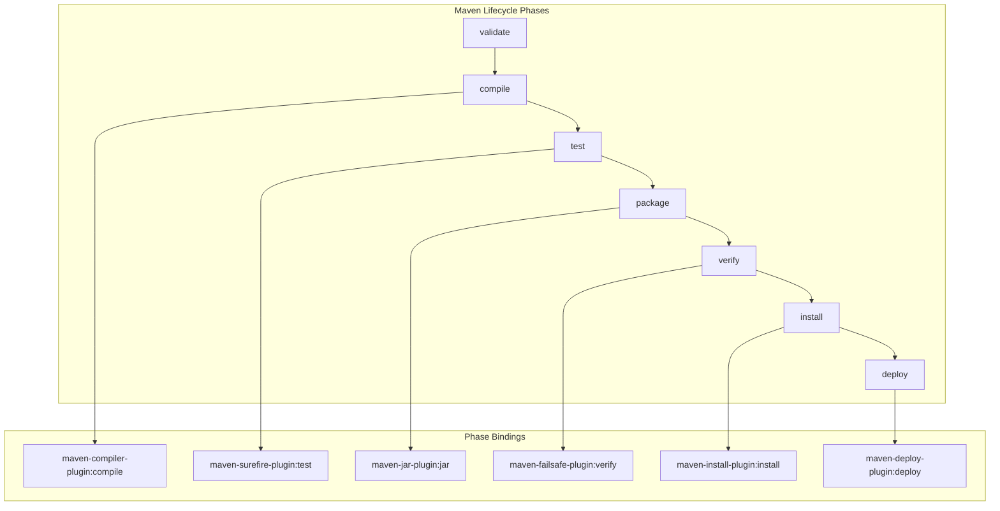
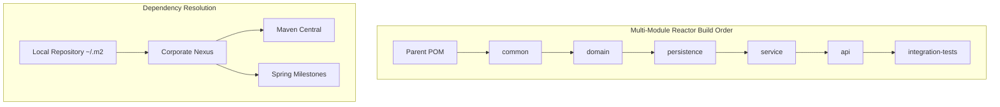
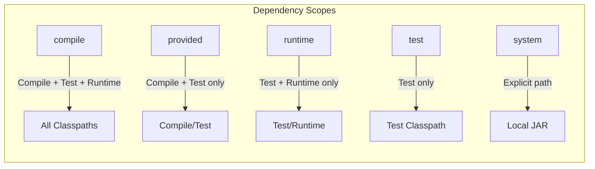

# Maven

## Quick Reference

- Maven uses a **Project Object Model (POM)** — an XML file (`pom.xml`) that declares project metadata, dependencies, plugins, and build configuration
- Default lifecycle phases execute in order: `validate` → `compile` → `test` → `package` → `verify` → `install` → `deploy`
- **Dependency scopes**: `compile` (default, available everywhere), `provided` (compile-time only, container supplies at runtime), `runtime` (not needed for compilation), `test` (test classpath only), `system` (explicit JAR path, avoid)
- `<dependencyManagement>` declares version constraints without adding dependencies — child modules inherit versions without specifying them
- **BOM (Bill of Materials)** imports centralize version management: `<scope>import</scope>` in `<dependencyManagement>` pulls in a curated set of compatible versions
- Multi-module projects use a parent POM with `<modules>` — the reactor determines build order from inter-module dependencies
- Maven Wrapper (`mvnw`) ensures consistent Maven versions across environments — commit `.mvn/wrapper/` to version control
- **Profiles** activate conditional configuration based on environment, JDK version, or explicit flags (`-P production`)
- Repository managers (Nexus, Artifactory) proxy public repositories, host internal artifacts, and enforce security policies
- `mvn dependency:tree` reveals the full transitive dependency graph — essential for diagnosing version conflicts and exclusions

## When to Use

Maven is the standard build tool for enterprise Java projects, particularly in organizations with established conventions and large codebases. Choose Maven when your team values convention over configuration — Maven's opinionated project structure (`src/main/java`, `src/test/java`) eliminates bikeshedding about directory layouts. Maven excels in multi-module projects where consistent dependency management across 20+ modules is critical, where BOM imports ensure all Spring Boot or Jakarta EE dependencies use compatible versions. Use Maven when your CI/CD pipeline benefits from reproducible builds (Maven's deterministic dependency resolution with `<dependencyManagement>` prevents version drift), when your organization uses Nexus or Artifactory for artifact management, or when your team includes developers who prefer declarative XML configuration over imperative build scripts. Maven is less suitable for projects requiring highly customized build logic (complex code generation, non-standard packaging), for polyglot projects mixing JVM and non-JVM languages, or for teams that prioritize build speed over convention (Gradle's incremental compilation and build cache are significantly faster for large projects).

## Code Examples

### POM Structure and Dependency Management

```xml
<?xml version="1.0" encoding="UTF-8"?>
<project xmlns="http://maven.apache.org/POM/4.0.0"
         xmlns:xsi="http://www.w3.org/2001/XMLSchema-instance"
         xsi:schemaLocation="http://maven.apache.org/POM/4.0.0
         http://maven.apache.org/xsd/maven-4.0.0.xsd">
    <modelVersion>4.0.0</modelVersion>

    <groupId>com.example</groupId>
    <artifactId>payment-service</artifactId>
    <version>2.1.0-SNAPSHOT</version>
    <packaging>jar</packaging>

    <properties>
        <java.version>21</java.version>
        <maven.compiler.source>${java.version}</maven.compiler.source>
        <maven.compiler.target>${java.version}</maven.compiler.target>
        <project.build.sourceEncoding>UTF-8</project.build.sourceEncoding>
        <spring-boot.version>3.2.1</spring-boot.version>
        <testcontainers.version>1.19.3</testcontainers.version>
        <mapstruct.version>1.5.5.Final</mapstruct.version>
    </properties>

    <!-- BOM imports for version management -->
    <dependencyManagement>
        <dependencies>
            <dependency>
                <groupId>org.springframework.boot</groupId>
                <artifactId>spring-boot-dependencies</artifactId>
                <version>${spring-boot.version}</version>
                <type>pom</type>
                <scope>import</scope>
            </dependency>
            <dependency>
                <groupId>org.testcontainers</groupId>
                <artifactId>testcontainers-bom</artifactId>
                <version>${testcontainers.version}</version>
                <type>pom</type>
                <scope>import</scope>
            </dependency>
        </dependencies>
    </dependencyManagement>

    <dependencies>
        <!-- Compile scope (default) — available on all classpaths -->
        <dependency>
            <groupId>org.springframework.boot</groupId>
            <artifactId>spring-boot-starter-web</artifactId>
        </dependency>
        <dependency>
            <groupId>org.springframework.boot</groupId>
            <artifactId>spring-boot-starter-data-jpa</artifactId>
        </dependency>
        <dependency>
            <groupId>org.springframework.boot</groupId>
            <artifactId>spring-boot-starter-validation</artifactId>
        </dependency>

        <!-- Provided scope — container supplies at runtime -->
        <dependency>
            <groupId>org.projectlombok</groupId>
            <artifactId>lombok</artifactId>
            <scope>provided</scope>
        </dependency>

        <!-- Runtime scope — not needed for compilation -->
        <dependency>
            <groupId>org.postgresql</groupId>
            <artifactId>postgresql</artifactId>
            <scope>runtime</scope>
        </dependency>
        <dependency>
            <groupId>io.micrometer</groupId>
            <artifactId>micrometer-registry-prometheus</artifactId>
            <scope>runtime</scope>
        </dependency>

        <!-- Test scope — test classpath only -->
        <dependency>
            <groupId>org.springframework.boot</groupId>
            <artifactId>spring-boot-starter-test</artifactId>
            <scope>test</scope>
        </dependency>
        <dependency>
            <groupId>org.testcontainers</groupId>
            <artifactId>postgresql</artifactId>
            <scope>test</scope>
        </dependency>

        <!-- Dependency with exclusion to resolve conflicts -->
        <dependency>
            <groupId>com.example</groupId>
            <artifactId>shared-library</artifactId>
            <version>1.4.0</version>
            <exclusions>
                <exclusion>
                    <groupId>org.slf4j</groupId>
                    <artifactId>slf4j-log4j12</artifactId>
                </exclusion>
            </exclusions>
        </dependency>
    </dependencies>
</project>
```

### Multi-Module Project Structure

```xml
<!-- parent/pom.xml — aggregator and parent POM -->
<project>
    <modelVersion>4.0.0</modelVersion>
    <groupId>com.example</groupId>
    <artifactId>ecommerce-platform</artifactId>
    <version>3.0.0-SNAPSHOT</version>
    <packaging>pom</packaging>

    <!-- Reactor modules — build order determined by dependencies -->
    <modules>
        <module>common</module>
        <module>domain</module>
        <module>persistence</module>
        <module>service</module>
        <module>api</module>
        <module>integration-tests</module>
    </modules>

    <properties>
        <java.version>21</java.version>
        <spring-boot.version>3.2.1</spring-boot.version>
    </properties>

    <!-- Centralized version management for all modules -->
    <dependencyManagement>
        <dependencies>
            <dependency>
                <groupId>org.springframework.boot</groupId>
                <artifactId>spring-boot-dependencies</artifactId>
                <version>${spring-boot.version}</version>
                <type>pom</type>
                <scope>import</scope>
            </dependency>
            <!-- Internal module versions -->
            <dependency>
                <groupId>com.example</groupId>
                <artifactId>ecommerce-common</artifactId>
                <version>${project.version}</version>
            </dependency>
            <dependency>
                <groupId>com.example</groupId>
                <artifactId>ecommerce-domain</artifactId>
                <version>${project.version}</version>
            </dependency>
        </dependencies>
    </dependencyManagement>

    <build>
        <pluginManagement>
            <plugins>
                <plugin>
                    <groupId>org.apache.maven.plugins</groupId>
                    <artifactId>maven-compiler-plugin</artifactId>
                    <version>3.12.1</version>
                    <configuration>
                        <release>${java.version}</release>
                        <annotationProcessorPaths>
                            <path>
                                <groupId>org.projectlombok</groupId>
                                <artifactId>lombok</artifactId>
                                <version>1.18.30</version>
                            </path>
                            <path>
                                <groupId>org.mapstruct</groupId>
                                <artifactId>mapstruct-processor</artifactId>
                                <version>${mapstruct.version}</version>
                            </path>
                        </annotationProcessorPaths>
                    </configuration>
                </plugin>
            </plugins>
        </pluginManagement>
    </build>
</project>

<!-- domain/pom.xml — child module -->
<project>
    <modelVersion>4.0.0</modelVersion>
    <parent>
        <groupId>com.example</groupId>
        <artifactId>ecommerce-platform</artifactId>
        <version>3.0.0-SNAPSHOT</version>
    </parent>

    <artifactId>ecommerce-domain</artifactId>

    <dependencies>
        <dependency>
            <groupId>com.example</groupId>
            <artifactId>ecommerce-common</artifactId>
        </dependency>
        <dependency>
            <groupId>jakarta.validation</groupId>
            <artifactId>jakarta.validation-api</artifactId>
        </dependency>
    </dependencies>
</project>
```

### Plugin Configuration — Surefire, Failsafe, and Shade

```xml
<build>
    <plugins>
        <!-- Surefire — unit tests (runs during 'test' phase) -->
        <plugin>
            <groupId>org.apache.maven.plugins</groupId>
            <artifactId>maven-surefire-plugin</artifactId>
            <version>3.2.3</version>
            <configuration>
                <includes>
                    <include>**/*Test.java</include>
                    <include>**/*Tests.java</include>
                </includes>
                <excludes>
                    <exclude>**/*IntegrationTest.java</exclude>
                    <exclude>**/*IT.java</exclude>
                </excludes>
                <argLine>-Xmx512m -XX:+EnableDynamicAgentLoading</argLine>
                <parallel>methods</parallel>
                <threadCount>4</threadCount>
                <forkCount>1C</forkCount>
                <reuseForks>true</reuseForks>
            </configuration>
        </plugin>

        <!-- Failsafe — integration tests (runs during 'verify' phase) -->
        <plugin>
            <groupId>org.apache.maven.plugins</groupId>
            <artifactId>maven-failsafe-plugin</artifactId>
            <version>3.2.3</version>
            <configuration>
                <includes>
                    <include>**/*IntegrationTest.java</include>
                    <include>**/*IT.java</include>
                </includes>
                <argLine>-Xmx1g</argLine>
            </configuration>
            <executions>
                <execution>
                    <goals>
                        <goal>integration-test</goal>
                        <goal>verify</goal>
                    </goals>
                </execution>
            </executions>
        </plugin>

        <!-- Shade plugin — create uber-JAR with relocated dependencies -->
        <plugin>
            <groupId>org.apache.maven.plugins</groupId>
            <artifactId>maven-shade-plugin</artifactId>
            <version>3.5.1</version>
            <executions>
                <execution>
                    <phase>package</phase>
                    <goals>
                        <goal>shade</goal>
                    </goals>
                    <configuration>
                        <relocations>
                            <relocation>
                                <pattern>com.google.common</pattern>
                                <shadedPattern>com.example.shaded.guava</shadedPattern>
                            </relocation>
                        </relocations>
                        <filters>
                            <filter>
                                <artifact>*:*</artifact>
                                <excludes>
                                    <exclude>META-INF/*.SF</exclude>
                                    <exclude>META-INF/*.DSA</exclude>
                                    <exclude>META-INF/*.RSA</exclude>
                                </excludes>
                            </filter>
                        </filters>
                        <transformers>
                            <transformer implementation="org.apache.maven.plugins.shade.resource.ManifestResourceTransformer">
                                <mainClass>com.example.Application</mainClass>
                            </transformer>
                            <transformer implementation="org.apache.maven.plugins.shade.resource.ServicesResourceTransformer"/>
                        </transformers>
                    </configuration>
                </execution>
            </executions>
        </plugin>

        <!-- Enforcer plugin — fail build on dependency conflicts -->
        <plugin>
            <groupId>org.apache.maven.plugins</groupId>
            <artifactId>maven-enforcer-plugin</artifactId>
            <version>3.4.1</version>
            <executions>
                <execution>
                    <id>enforce-versions</id>
                    <goals>
                        <goal>enforce</goal>
                    </goals>
                    <configuration>
                        <rules>
                            <requireMavenVersion>
                                <version>[3.9.0,)</version>
                            </requireMavenVersion>
                            <requireJavaVersion>
                                <version>[21,)</version>
                            </requireJavaVersion>
                            <dependencyConvergence/>
                            <banDuplicatePomDependencyVersions/>
                        </rules>
                    </configuration>
                </execution>
            </executions>
        </plugin>
    </plugins>
</build>
```

### Profiles for Environment-Specific Configuration

```xml
<profiles>
    <!-- Development profile — active by default -->
    <profile>
        <id>dev</id>
        <activation>
            <activeByDefault>true</activeByDefault>
        </activation>
        <properties>
            <spring.profiles.active>dev</spring.profiles.active>
            <skip.integration.tests>true</skip.integration.tests>
        </properties>
    </profile>

    <!-- CI profile — runs all tests, generates reports -->
    <profile>
        <id>ci</id>
        <properties>
            <spring.profiles.active>test</spring.profiles.active>
            <skip.integration.tests>false</skip.integration.tests>
        </properties>
        <build>
            <plugins>
                <plugin>
                    <groupId>org.jacoco</groupId>
                    <artifactId>jacoco-maven-plugin</artifactId>
                    <version>0.8.11</version>
                    <executions>
                        <execution>
                            <id>prepare-agent</id>
                            <goals><goal>prepare-agent</goal></goals>
                        </execution>
                        <execution>
                            <id>report</id>
                            <phase>verify</phase>
                            <goals><goal>report</goal></goals>
                        </execution>
                        <execution>
                            <id>check</id>
                            <goals><goal>check</goal></goals>
                            <configuration>
                                <rules>
                                    <rule>
                                        <element>BUNDLE</element>
                                        <limits>
                                            <limit>
                                                <counter>LINE</counter>
                                                <value>COVEREDRATIO</value>
                                                <minimum>0.80</minimum>
                                            </limit>
                                        </limits>
                                    </rule>
                                </rules>
                            </configuration>
                        </execution>
                    </executions>
                </plugin>
            </plugins>
        </build>
    </profile>

    <!-- Production profile — optimized packaging -->
    <profile>
        <id>production</id>
        <properties>
            <spring.profiles.active>prod</spring.profiles.active>
        </properties>
        <build>
            <plugins>
                <plugin>
                    <groupId>org.springframework.boot</groupId>
                    <artifactId>spring-boot-maven-plugin</artifactId>
                    <configuration>
                        <layers>
                            <enabled>true</enabled>
                        </layers>
                        <image>
                            <name>registry.example.com/${project.artifactId}:${project.version}</name>
                        </image>
                    </configuration>
                </plugin>
            </plugins>
        </build>
    </profile>
</profiles>
```

### Reproducible Builds and Version Management

```xml
<!-- Enable reproducible builds -->
<properties>
    <project.build.outputTimestamp>2024-01-15T10:00:00Z</project.build.outputTimestamp>
</properties>

<!-- versions-maven-plugin for dependency updates -->
<!-- Usage: mvn versions:display-dependency-updates -->
<!-- Usage: mvn versions:use-latest-releases -->
<plugin>
    <groupId>org.codehaus.mojo</groupId>
    <artifactId>versions-maven-plugin</artifactId>
    <version>2.16.2</version>
    <configuration>
        <rulesUri>file:///${project.basedir}/maven-version-rules.xml</rulesUri>
    </configuration>
</plugin>
```

```bash
# Maven Wrapper setup
mvn wrapper:wrapper -Dmaven=3.9.6

# Common commands
./mvnw clean verify                          # Full build with tests
./mvnw clean package -DskipTests             # Package without tests
./mvnw dependency:tree                       # Show dependency tree
./mvnw dependency:tree -Dincludes=org.slf4j  # Filter dependency tree
./mvnw versions:display-dependency-updates   # Check for updates
./mvnw help:effective-pom                    # Show resolved POM
./mvnw -pl service -am clean install         # Build module + dependencies
./mvnw -pl service -amd clean install        # Build module + dependents
./mvnw clean verify -P ci                    # Activate CI profile
```

## Architecture / Diagrams







## Common Pitfalls

**1. Version conflicts from transitive dependencies.** Maven uses a "nearest wins" strategy for version resolution — the version closest to the root of the dependency tree wins, not the newest. This can silently downgrade a library, causing `NoSuchMethodError` at runtime. Use `mvn dependency:tree` to identify conflicts, `<dependencyManagement>` to force specific versions, and the `maven-enforcer-plugin` with `<dependencyConvergence/>` to fail the build on conflicts.

**2. Mixing `<dependencies>` and `<dependencyManagement>` incorrectly.** Declaring a dependency in `<dependencyManagement>` does not add it to the classpath — it only sets the version for when a child module declares it in `<dependencies>`. Developers often add dependencies to `<dependencyManagement>` expecting them to be available, then get compilation errors. Conversely, declaring versions in `<dependencies>` of child modules defeats the purpose of centralized management.

**3. Not separating unit and integration tests.** Running integration tests (database, network) during the `test` phase with Surefire makes builds slow and flaky. Use naming conventions (`*IT.java` for integration tests) and configure Failsafe to run them during the `verify` phase. This allows `mvn package -DskipTests` to skip only slow tests while keeping unit tests in the fast feedback loop.

**4. Snapshot dependencies in release builds.** SNAPSHOT versions are mutable — the same version can resolve to different artifacts on different days. Release builds must use fixed versions only. Configure the `maven-enforcer-plugin` with `<requireReleaseDeps/>` to fail builds that depend on SNAPSHOTs. Use the `versions-maven-plugin` to automate version bumps before releases.

**5. Ignoring the effective POM.** Plugin configurations, dependency versions, and properties are inherited from parent POMs and BOMs. The POM you see in your editor is not the complete picture. Run `mvn help:effective-pom` to see the fully resolved configuration. Many "mysterious" build behaviors (wrong Java version, unexpected plugin execution) are explained by inherited configuration.

**6. Fat JARs without dependency relocation.** Using the shade plugin to create uber-JARs without relocating conflicting packages causes classpath collisions. If your application and a dependency both bundle Guava (different versions), the classloader picks one arbitrarily. Always relocate shaded dependencies to unique packages, or prefer Spring Boot's nested JAR approach (Boot's executable JAR keeps dependencies in separate classloader layers).

**7. Not using Maven Wrapper in CI/CD.** Relying on the CI server's installed Maven version creates "works on my machine" problems. Different Maven versions resolve dependencies differently and support different plugin versions. Commit the Maven Wrapper (`mvnw`, `.mvn/wrapper/`) and use `./mvnw` in all CI scripts to guarantee consistent behavior.

## Real-World Use Cases

**Enterprise multi-module monorepo.** A financial services company maintains a 40-module Maven project with a parent POM that enforces Java 21, Spring Boot 3.2, and internal library versions across all modules. The reactor builds modules in dependency order — `common` → `domain` → `persistence` → `service` → `api`. Each module produces a versioned artifact deployed to Nexus. The CI pipeline runs `./mvnw clean verify -P ci` on every PR, executing unit tests with Surefire and integration tests with Failsafe against Testcontainers. Release builds use the `maven-release-plugin` to bump versions, tag Git, and deploy to the release repository.

**Library publishing with BOM management.** An internal platform team publishes a BOM artifact that curates compatible versions of 30+ internal libraries. Application teams import this BOM in their `<dependencyManagement>` section, ensuring all services use compatible library versions. When a security vulnerability is found in a transitive dependency, the platform team updates the BOM, and all consuming applications pick up the fix on their next build without changing their own POMs.

**Docker image optimization with layered JARs.** A microservices team uses Spring Boot's layered JAR feature via the `spring-boot-maven-plugin`. The build produces a JAR with separate layers for dependencies, Spring Boot loader, snapshot dependencies, and application code. The Dockerfile extracts these layers, placing rarely-changing dependencies in early Docker layers (cached) and frequently-changing application code in later layers. This reduces Docker image build times from 3 minutes to 20 seconds for code-only changes.

**Reproducible builds for compliance.** A healthcare software company requires bit-for-bit reproducible builds for regulatory compliance. They set `<project.build.outputTimestamp>` to a fixed value, pin all plugin versions explicitly, use the `maven-enforcer-plugin` to ban SNAPSHOT dependencies, and configure Nexus to serve deterministic dependency resolution. Two builds from the same Git commit produce identical artifacts, verified by comparing SHA-256 checksums.

## Interview Questions

**Q: Explain the difference between `<dependencyManagement>` and `<dependencies>` in Maven.**

A: `<dependencies>` adds JARs to the project's classpath — anything declared here is available for compilation and/or runtime depending on scope. `<dependencyManagement>` does not add anything to the classpath; it declares version and scope constraints that apply when a dependency is actually declared in `<dependencies>` (in the same POM or child modules). The primary use case: a parent POM uses `<dependencyManagement>` to centralize versions, and child modules declare dependencies without specifying versions. BOM imports (`<scope>import</scope>`) in `<dependencyManagement>` pull in an external set of managed versions. This separation ensures consistent versions across a multi-module project without forcing all modules to include every dependency.

**Q: How does Maven resolve version conflicts in transitive dependencies?**

A: Maven uses two rules: nearest definition wins (the version declared closest to the root of the dependency tree takes precedence) and first declaration wins (when two dependencies are at the same depth, the one declared first in the POM wins). This can silently downgrade libraries — if your project declares A which depends on Guava 32, and B which depends on Guava 31, and B is declared first or closer to the root, Guava 31 wins. To control resolution: use `<dependencyManagement>` to force a specific version, use `<exclusions>` to remove unwanted transitive versions, or use the `maven-enforcer-plugin` with `<dependencyConvergence/>` to fail the build when versions conflict.

**Q: What is the Maven reactor, and how does it determine build order?**

A: The reactor is Maven's mechanism for building multi-module projects. When you run `mvn install` on a parent POM with `<modules>`, the reactor analyzes inter-module dependencies and builds modules in topological order — a module is built only after all modules it depends on are built. If module `service` depends on module `domain`, the reactor builds `domain` first regardless of declaration order in `<modules>`. You can build a subset with `-pl module-name` (project list), `-am` (also make dependencies), and `-amd` (also make dependents). The reactor fails fast by default — if one module fails, subsequent modules are skipped unless `-fae` (fail at end) is specified.

**Q: How do you optimize Maven build times in CI/CD?**

A: Key strategies: use Maven Daemon (`mvnd`) for persistent JVM and parallel module builds (30-50% faster). Enable parallel builds with `-T 1C` (one thread per CPU core). Cache the local repository (`~/.m2/repository`) between CI runs. Skip tests selectively — run unit tests on every commit but integration tests only on merge to main. Use `-pl` with `-am` to build only changed modules and their dependencies. Configure Surefire for parallel test execution (`<parallel>methods</parallel>`). For Docker builds, use layered JARs to maximize Docker layer caching. Consider splitting the build into stages: compile + unit test (fast, every PR) and integration test + deploy (slower, on merge).

**Q: Explain Maven profiles and when you would use them.**

A: Profiles are conditional configuration blocks activated by environment, JDK version, OS, property, or explicit flag (`-P profileId`). Use profiles for: environment-specific configuration (different database URLs for dev/staging/prod), CI-specific plugins (code coverage with JaCoCo, static analysis with SpotBugs), optional build steps (Docker image creation only in the `docker` profile), and JDK-specific compiler flags. Avoid using profiles for fundamentally different build outputs — if two profiles produce incompatible artifacts, they should be separate modules. Profiles should add to the base build, not replace it. Always declare a default profile for local development so `mvn verify` works without flags.

## Production Tips

**Use the Maven Enforcer plugin as a build quality gate.** Configure `<dependencyConvergence/>` to fail when transitive dependencies resolve to different versions, `<requireMavenVersion>` to ensure consistent tooling, `<banDuplicatePomDependencyVersions/>` to catch copy-paste errors, and `<requireReleaseDeps/>` in release profiles to prevent SNAPSHOT dependencies from reaching production. These rules catch subtle issues that cause runtime `ClassNotFoundException` or `NoSuchMethodError` — problems that are expensive to debug in production.

**Implement dependency vulnerability scanning in CI.** Integrate the OWASP Dependency-Check plugin (`dependency-check-maven`) or Snyk into your build pipeline. Configure it to fail the build when vulnerabilities above a severity threshold (CVSS 7+) are detected. Run scans on a schedule (not just on code changes) because new CVEs are published daily against existing library versions. Maintain a suppression file for false positives and accepted risks with documented justification.

**Cache Maven dependencies aggressively in CI.** The local repository (`~/.m2/repository`) download on every build wastes 2-5 minutes. Cache this directory between CI runs (GitHub Actions cache, GitLab CI cache, or a shared NFS mount). For Docker-based CI, use a multi-stage build with a dependency-download stage that changes only when `pom.xml` changes, maximizing Docker layer cache hits. Consider running a local Nexus proxy in your CI environment to eliminate external network calls entirely.

**Monitor dependency freshness and automate updates.** Use `mvn versions:display-dependency-updates` on a weekly schedule to identify outdated dependencies. Automate minor/patch updates with Renovate or Dependabot, which create PRs with changelogs. For major version updates, review breaking changes manually. Stale dependencies accumulate security vulnerabilities and miss performance improvements — a library 3 major versions behind is significantly harder to update than one that is kept current.

## Related Topics

- [Gradle](./gradle.md) — Alternative JVM build tool with incremental compilation and build cache advantages
- [CI/CD Pipelines](../../infrastructure/ci-cd/ci-cd-pipelines.md) — Pipeline integration patterns for Maven builds
- [Spring Boot](../spring-framework/spring-boot.md) — Spring Boot Maven plugin for executable JAR packaging and Docker image creation
- [Docker](../../infrastructure/docker/index.md) — Multi-stage Docker builds optimized for Maven projects
