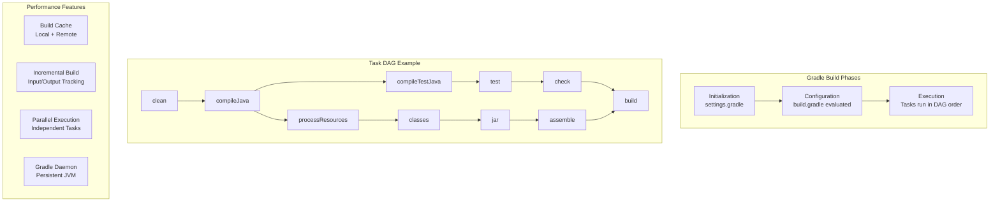
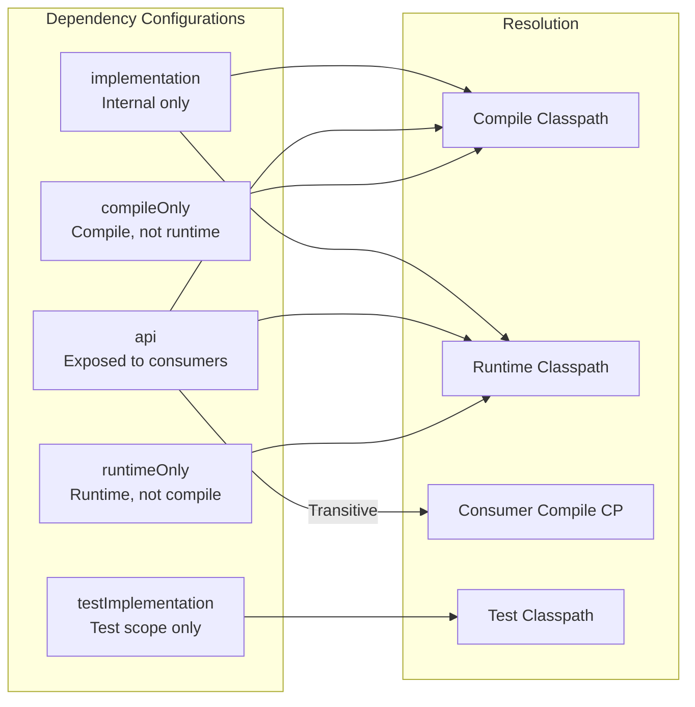

# Gradle

## Quick Reference

- Gradle is an open-source build automation tool using Groovy or Kotlin DSL instead of XML
- Core concepts: Projects (buildable units), Tasks (atomic work units), DAG (execution order)
- Key files: `build.gradle` (build script), `settings.gradle` (multi-project config), `gradle.properties` (settings)
- Dependency configurations: `implementation`, `api`, `compileOnly`, `runtimeOnly`, `testImplementation`
- Gradle Wrapper (`gradlew`) ensures consistent Gradle versions across team members and CI
- Performance features: incremental builds, build cache, parallel execution, compile avoidance
- Plugin ecosystem: `java`, `application`, `spring-boot`, `kotlin`, `android`, `publishing`

## When to Use

Gradle is the preferred build tool when you need maximum build performance, flexible build logic, or are working with Android development. Choose Gradle over Maven when your build requires custom logic that would be awkward in XML, when build speed is critical (Gradle's incremental builds and build cache significantly outperform Maven for large projects), or when you need to build polyglot projects (Java + Kotlin + Groovy in the same project). Gradle is particularly strong for multi-project builds with complex dependency graphs, projects requiring custom task definitions, and teams that want programmatic build configuration. The Kotlin DSL provides type-safe build scripts with IDE auto-completion, making complex builds more maintainable.

## Code Examples

### Build Configuration (Groovy DSL)

```groovy
plugins {
    id 'java'
    id 'org.springframework.boot' version '3.2.0'
    id 'io.spring.dependency-management' version '1.1.4'
    id 'jacoco'
}

group = 'com.example'
version = '1.0.0-SNAPSHOT'

java {
    sourceCompatibility = JavaVersion.VERSION_21
    targetCompatibility = JavaVersion.VERSION_21
}

repositories {
    mavenCentral()
    maven { url 'https://repo.company.com/maven-releases' }
}

dependencies {
    implementation 'org.springframework.boot:spring-boot-starter-web'
    implementation 'org.springframework.boot:spring-boot-starter-data-jpa'
    implementation 'org.mapstruct:mapstruct:1.5.5.Final'

    compileOnly 'org.projectlombok:lombok'
    annotationProcessor 'org.projectlombok:lombok'
    annotationProcessor 'org.mapstruct:mapstruct-processor:1.5.5.Final'

    runtimeOnly 'org.postgresql:postgresql'

    testImplementation 'org.springframework.boot:spring-boot-starter-test'
    testImplementation 'org.testcontainers:postgresql'
}

test {
    useJUnitPlatform()
    finalizedBy jacocoTestReport
}

jacocoTestReport {
    dependsOn test
    reports {
        xml.required = true
        html.required = true
    }
}

tasks.named('bootJar') {
    archiveFileName = "${project.name}.jar"
    launchScript()
}
```

### Build Configuration (Kotlin DSL)

```kotlin
// build.gradle.kts
plugins {
    kotlin("jvm") version "1.9.21"
    kotlin("plugin.spring") version "1.9.21"
    id("org.springframework.boot") version "3.2.0"
    id("io.spring.dependency-management") version "1.1.4"
}

dependencies {
    implementation("org.springframework.boot:spring-boot-starter-web")
    implementation("com.fasterxml.jackson.module:jackson-module-kotlin")
    implementation("org.jetbrains.kotlin:kotlin-reflect")

    testImplementation("org.springframework.boot:spring-boot-starter-test") {
        exclude(group = "org.junit.vintage", module = "junit-vintage-engine")
    }
}

tasks.withType<Test> {
    useJUnitPlatform()
    jvmArgs("-XX:+EnableDynamicAgentLoading")
}

tasks.withType<org.jetbrains.kotlin.gradle.tasks.KotlinCompile> {
    kotlinOptions {
        freeCompilerArgs += "-Xjsr305=strict"
        jvmTarget = "21"
    }
}
```

### Custom Tasks and Multi-Project Builds

```groovy
// settings.gradle
rootProject.name = 'ecommerce-platform'
include 'common', 'order-service', 'payment-service', 'gateway'

// Root build.gradle
subprojects {
    apply plugin: 'java'
    apply plugin: 'jacoco'

    repositories {
        mavenCentral()
    }

    dependencies {
        testImplementation 'org.junit.jupiter:junit-jupiter:5.10.1'
    }

    test {
        useJUnitPlatform()
    }
}

// Custom task example
tasks.register('generateBuildInfo') {
    def outputFile = file("${buildDir}/build-info.json")
    outputs.file(outputFile)

    doLast {
        outputFile.text = groovy.json.JsonOutput.prettyPrint(
            groovy.json.JsonOutput.toJson([
                version: project.version,
                timestamp: new Date().format("yyyy-MM-dd'T'HH:mm:ss'Z'"),
                gitCommit: 'git rev-parse HEAD'.execute().text.trim()
            ])
        )
    }
}

tasks.named('processResources') {
    dependsOn 'generateBuildInfo'
}
```

### Common Gradle Commands

```bash
# Build with tests
./gradlew clean build

# Skip tests
./gradlew build -x test

# Run specific test
./gradlew test --tests "com.example.OrderServiceTest"

# Display dependency tree
./gradlew dependencies --configuration runtimeClasspath

# Parallel build with build cache
./gradlew build --parallel --build-cache

# Refresh dependencies (bypass cache)
./gradlew build --refresh-dependencies

# Generate Gradle wrapper with specific version
gradle wrapper --gradle-version 8.5

# Run Spring Boot application
./gradlew bootRun --args='--spring.profiles.active=dev'

# List available tasks
./gradlew tasks --all
```

## Architecture and Diagrams





## Common Pitfalls

1. **Using `compile` instead of `implementation`**: The deprecated `compile` configuration leaks dependencies to consumers, causing unnecessary recompilation. Use `implementation` for internal dependencies and `api` only when the dependency is part of your module's public API.

2. **Not using the Gradle Wrapper**: Running `gradle` directly uses whatever version is installed locally, causing "works on my machine" issues. Always commit `gradlew`, `gradlew.bat`, and `gradle/wrapper/` to version control and use `./gradlew` in CI.

3. **Expensive configuration-phase logic**: Code in the configuration block runs on every build invocation, even for unrelated tasks. Move expensive operations (file I/O, network calls, process execution) into task actions (`doLast`, `doFirst`) so they only execute when the task runs.

4. **Build cache invalidation**: Tasks with non-deterministic outputs (timestamps, random values, absolute paths) prevent cache reuse. Use `@Input`/`@Output` annotations correctly and ensure task outputs are reproducible for the same inputs.

5. **Dependency resolution conflicts**: Unlike Maven's "nearest wins," Gradle selects the highest version by default. This can silently upgrade transitive dependencies to incompatible versions. Use `resolutionStrategy` with `failOnVersionConflict()` to detect conflicts early.

## Real-World Use Cases

- **Android development**: Gradle is the official build system for Android, handling APK/AAB packaging, resource merging, ProGuard/R8 optimization, multi-flavor builds, and the complex Android build pipeline with custom transforms. The Android Gradle Plugin provides specialized tasks for signing, bundling, and deploying to the Play Store.

- **Monorepo builds**: Large organizations use Gradle's composite builds and included builds to manage monorepos with hundreds of modules, leveraging the build cache and parallel execution to keep build times manageable as the codebase grows. Gradle's fine-grained task dependency graph ensures only affected modules are rebuilt after a change.

- **Polyglot projects**: Gradle natively supports Java, Kotlin, Groovy, Scala, and C++ in the same project, making it ideal for teams transitioning between languages or maintaining libraries with multiple language bindings. A single build script can compile Kotlin source, generate Java from Protocol Buffers, and package native libraries.

- **Custom build pipelines**: Teams with unique build requirements (code generation, protocol buffer compilation, Docker image building, infrastructure provisioning) use Gradle's task API to define custom build steps that integrate seamlessly with the standard lifecycle. The `buildSrc` directory enables sharing custom plugins across modules without publishing them externally.

- **Continuous delivery**: Gradle's incremental build model and remote build cache make it ideal for continuous delivery pipelines where fast feedback is critical. Teams achieve sub-minute build times for incremental changes by combining local and remote caches, enabling developers to push changes and see deployment results within minutes.

## Interview Questions

**Q: What is the difference between `implementation` and `api` dependency configurations?**
A: `implementation` dependencies are internal to the module — consumers of your module cannot see them on their compile classpath. `api` dependencies are exposed transitively to consumers. Use `implementation` by default (faster compilation, better encapsulation) and `api` only when the dependency types appear in your module's public API signatures.

**Q: How does Gradle's build cache work?**
A: Gradle computes a cache key from task inputs (source files, configuration, dependencies) and stores task outputs keyed by this hash. On subsequent builds, if inputs haven't changed, Gradle retrieves outputs from cache instead of re-executing the task. The cache can be local (per-machine) or remote (shared across CI agents and developers).

**Q: Explain Gradle's build lifecycle phases.**
A: Gradle has three phases: (1) Initialization — evaluates `settings.gradle` to determine which projects participate in the build. (2) Configuration — evaluates all `build.gradle` files to create the task DAG. (3) Execution — runs only the tasks needed to satisfy the requested goal, in dependency order. Understanding this separation is key to avoiding performance issues from expensive configuration-phase code.

**Q: How does Gradle compare to Maven for large projects?**
A: Gradle outperforms Maven for large projects through incremental builds (only recompiling changed files), build cache (reusing outputs across builds and machines), parallel task execution, and the Gradle Daemon (persistent JVM avoiding startup cost). Maven re-executes all phases sequentially. However, Maven's simpler model and wider enterprise adoption make it easier for large teams to maintain consistent builds.

## Production Tips

- **Remote build cache**: Configure a shared build cache (Gradle Enterprise or a custom HTTP cache) to share task outputs across CI agents and developer machines. This can reduce CI build times by 40-80% for incremental changes. Monitor cache hit rates and investigate tasks with low hit rates, as they often indicate non-deterministic inputs that can be fixed.

- **Dependency locking**: Use `dependencyLocking` to create lock files that pin resolved dependency versions, ensuring reproducible builds even when version ranges are used. Run `./gradlew dependencies --write-locks` to update lock files. Commit lock files to version control and review changes during dependency updates to catch unexpected transitive upgrades.

- **Build scan analysis**: Enable Gradle Build Scans (`--scan`) to get detailed performance analysis, dependency resolution insights, and build comparison tools. Use them to identify slow tasks, cache misses, and configuration bottlenecks. Compare scans between builds to understand why a previously fast build became slow after a change.

- **CI optimization**: Use `--no-daemon` in CI (daemon provides no benefit for single builds), enable `--build-cache` with a remote cache, and configure `org.gradle.parallel=true` and `org.gradle.caching=true` in `gradle.properties` for consistent performance settings. Set `org.gradle.jvmargs=-Xmx4g` to provide sufficient memory for large multi-module builds without triggering GC pressure.

- **Version catalog management**: Use Gradle's version catalogs (`libs.versions.toml`) to centralize dependency versions across multi-module projects. This provides type-safe accessors in build scripts, makes dependency updates visible in a single file, and integrates with Dependabot and Renovate for automated update PRs.

## Related Topics

- [Java](./java.md) - Gradle is a primary build tool for Java projects
- [Apache Maven](./apache-maven.md) - Alternative build tool; Gradle can consume Maven repositories and POMs
- [Spring Framework](./spring-framework.md) - Spring Boot Gradle Plugin provides bootJar and bootRun tasks
