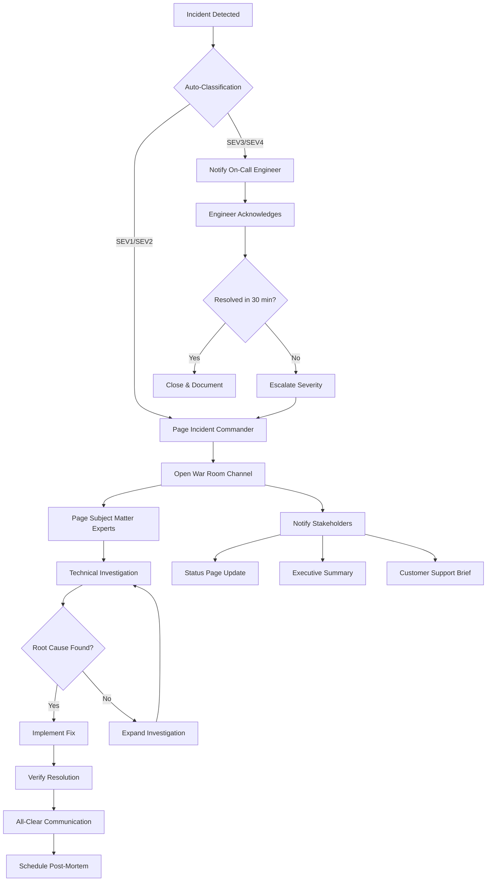
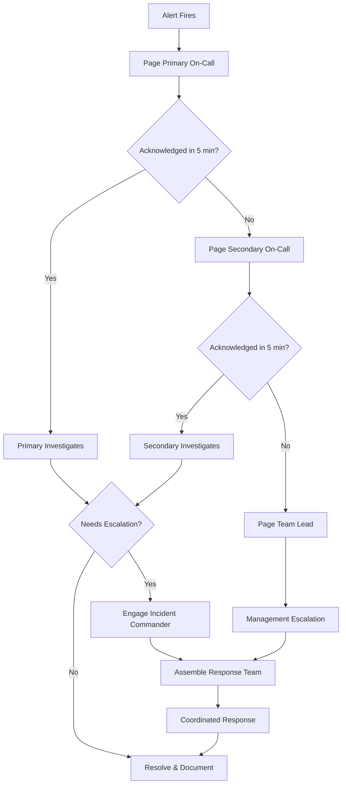

# Incident Response

## Quick Reference

- Incident response is the structured approach to detecting, managing, and resolving production issues in distributed systems
- Severity levels (SEV1-SEV4) determine escalation paths, response times, and communication cadence
- Runbooks provide step-by-step procedures for known failure modes, reducing mean time to recovery (MTTR)
- Post-mortems focus on blameless analysis of contributing factors, not individual fault
- On-call rotations ensure 24/7 coverage with clear escalation chains and handoff procedures
- Communication protocols define who gets notified, when, and through which channels during an incident
- Key metrics: MTTD (Mean Time to Detect), MTTR (Mean Time to Recover), MTBF (Mean Time Between Failures)
- Incident commanders coordinate response efforts and make decisions about escalation and communication
- The "golden signals" for any service are latency, traffic, errors, and saturation
- Feature flags provide the fastest rollback mechanism during incidents, faster than deployment rollbacks

## When to Use

Incident response processes are essential for any team operating production services that serve external or internal users. Every organization running distributed systems will experience failures, and the difference between a minor blip and a catastrophic outage often comes down to how prepared the team is to respond. These practices apply whenever you are building or operating systems where downtime has business consequences, whether that means lost revenue, damaged reputation, or regulatory violations.

Runbook creation is necessary when your team operates services with known failure modes that recur or when on-call engineers may not have deep familiarity with every system they support. Severity classification becomes critical once your organization grows beyond a single team and needs a shared vocabulary for communicating urgency across engineering, product, and executive stakeholders. Communication protocols are required when incidents affect customers or when multiple teams need to coordinate a response. Post-mortem processes should be adopted as soon as your team experiences its first significant incident, because organizational learning compounds over time and early investment in blameless culture pays dividends as the team scales. On-call practices matter whenever your service has availability requirements beyond business hours, which in practice means any customer-facing system in a global market.

These practices are particularly relevant for senior engineers and tech leads who are expected to design reliable systems, lead incident response efforts, and drive organizational improvements. In interviews, demonstrating fluency with incident response signals operational maturity and production experience that distinguishes senior candidates from those who have only worked in development environments.

## Code Examples

### Incident Classification and Routing Service

```java
@Service
public class IncidentClassifier {

    public Severity classify(IncidentSignals signals) {
        // SEV1: Complete outage or data integrity issue
        if (signals.getErrorRate() > 0.95 || signals.isDataCorruption()) {
            return Severity.SEV1;
        }
        // SEV2: Major degradation affecting significant user base
        if (signals.getErrorRate() > 0.50 ||
            signals.getLatencyP99().compareTo(Duration.ofSeconds(10)) > 0) {
            return Severity.SEV2;
        }
        // SEV3: Partial degradation or non-critical feature affected
        if (signals.getErrorRate() > 0.10 ||
            signals.getAffectedRegions() < signals.getTotalRegions()) {
            return Severity.SEV3;
        }
        // SEV4: Minor issue with workaround
        return Severity.SEV4;
    }
}

public enum Severity {
    SEV1("Critical", Duration.ofMinutes(5), Duration.ofMinutes(15)),
    SEV2("Major", Duration.ofMinutes(15), Duration.ofMinutes(30)),
    SEV3("Minor", Duration.ofHours(1), Duration.ofHours(2)),
    SEV4("Low", Duration.ofHours(24), Duration.ofHours(24));

    private final String label;
    private final Duration responseTarget;
    private final Duration updateCadence;

    Severity(String label, Duration responseTarget, Duration updateCadence) {
        this.label = label;
        this.responseTarget = responseTarget;
        this.updateCadence = updateCadence;
    }

    public Duration getResponseTarget() { return responseTarget; }
    public Duration getUpdateCadence() { return updateCadence; }
}
```

### Runbook Template in YAML Format

```yaml
---
title: "High Memory Usage on Order Service"
severity: SEV3
alert_source: "cloudwatch:order-service-memory-high"
last_updated: "2024-01-15"
author: "platform-team"

prerequisites:
  - AWS Console access with EKS permissions
  - kubectl configured for production cluster
  - Access to Splunk dashboard "order-service-metrics"

symptoms:
  - CloudWatch alarm "OrderService-MemoryUtilization" triggered
  - Response latency p99 exceeds 2 seconds
  - Pods showing OOMKilled restarts

diagnosis:
  - step: "Check current memory utilization"
    command: "kubectl top pods -n order-service"
    expected: "Memory usage above 85% threshold"
  - step: "Check for recent deployments"
    command: "kubectl rollout history deployment/order-service -n order-service"
    expected: "Identify if recent deploy correlates with memory spike"
  - step: "Review heap dump indicators"
    command: "kubectl logs -n order-service -l app=order-service --tail=100 | grep OutOfMemory"
    expected: "Check for OOM errors in application logs"

resolution:
  - step: "Scale horizontally if immediate relief needed"
    command: "kubectl scale deployment/order-service --replicas=5 -n order-service"
    rollback: "kubectl scale deployment/order-service --replicas=3 -n order-service"
  - step: "Restart affected pods if memory leak suspected"
    command: "kubectl rollout restart deployment/order-service -n order-service"
    rollback: "kubectl rollout undo deployment/order-service -n order-service"

verification:
  - "Confirm memory utilization drops below 75% within 5 minutes"
  - "Verify p99 latency returns below 500ms"
  - "Check CloudWatch alarm returns to OK state"

escalation:
  - condition: "Memory does not decrease after restart"
    action: "Escalate to SEV2, engage application team lead"
  - condition: "Multiple services affected"
    action: "Escalate to SEV1, engage incident commander"
```

### On-Call Rotation and Escalation Management

```java
@Service
public class OnCallScheduleService {

    private static final int MIN_ROTATION_SIZE = 5;
    private static final Duration SHIFT_DURATION = Duration.ofDays(7);

    public OnCallSchedule generateSchedule(Team team, LocalDate startDate, int weeks) {
        List<Engineer> eligible = team.getMembers().stream()
            .filter(Engineer::isOnCallEligible)
            .collect(Collectors.toList());

        if (eligible.size() < MIN_ROTATION_SIZE) {
            throw new InsufficientCoverageException(
                "Team needs at least " + MIN_ROTATION_SIZE +
                " eligible engineers for sustainable on-call rotation"
            );
        }

        List<OnCallShift> shifts = new ArrayList<>();
        Queue<Engineer> rotationQueue = new LinkedList<>(eligible);

        for (int week = 0; week < weeks; week++) {
            LocalDate shiftStart = startDate.plusWeeks(week);
            Engineer primary = rotationQueue.poll();
            Engineer secondary = rotationQueue.peek();

            shifts.add(OnCallShift.builder()
                .primary(primary)
                .secondary(secondary)
                .startDate(shiftStart)
                .endDate(shiftStart.plusDays(7))
                .build());

            rotationQueue.add(primary);
        }

        return OnCallSchedule.builder()
            .team(team)
            .shifts(shifts)
            .build();
    }

    public EscalationChain getEscalationChain(Incident incident) {
        OnCallShift currentShift = getCurrentShift(incident.getOwningTeam());

        return EscalationChain.builder()
            .level1(currentShift.getPrimary(), Duration.ofMinutes(5))
            .level2(currentShift.getSecondary(), Duration.ofMinutes(10))
            .level3(incident.getOwningTeam().getLead(), Duration.ofMinutes(20))
            .level4(getIncidentCommander(), Duration.ofMinutes(30))
            .build();
    }
}
```

## Architecture/Diagrams



The incident response lifecycle follows a well-defined flow from detection through resolution and learning. Automated monitoring systems detect anomalies and trigger alerts, which are routed to the appropriate on-call engineer based on service ownership. The severity classification determines the response intensity, communication cadence, and escalation timeline. This architecture ensures that critical incidents receive immediate coordinated attention while minor issues are handled efficiently without unnecessary overhead.



The escalation chain provides a safety net ensuring no alert goes unacknowledged. Each level has a defined timeout before escalating to the next responder. This prevents single points of failure in the human response layer and ensures that even if the primary on-call is unavailable, the incident receives attention within the defined SLA. The tiered approach also provides natural mentoring opportunities where secondary on-call engineers gain experience before taking primary responsibility.

## Runbook Creation

Runbooks are operational documents that provide step-by-step instructions for diagnosing and resolving known production issues. A well-crafted runbook reduces cognitive load during high-stress incidents and enables any on-call engineer to resolve issues regardless of their familiarity with the specific system. Runbooks should be living documents that evolve with the system, updated after every incident that reveals gaps in existing procedures.

Effective runbooks follow a consistent structure: a clear title describing the symptom or alert, prerequisites and access requirements, diagnostic steps to confirm the issue, resolution steps with rollback procedures, and verification steps to confirm the fix. Each step should be atomic and independently verifiable, allowing the responder to track progress and identify where things diverge from expectations. Ambiguity in runbook steps is dangerous because it forces decision-making during high-stress situations when cognitive capacity is already reduced.

Runbooks should be stored alongside the code they support, version-controlled, and linked directly from monitoring alerts. When an alert fires, the responder should be one click away from the relevant runbook. This tight coupling between alerts and runbooks dramatically reduces the MTTD-to-MTTR gap. Many organizations store runbooks in their wiki or documentation system, but the most effective approach is to keep them in the same repository as the service code so they are updated alongside infrastructure and application changes.

Automation is critical for runbook maintenance. Teams should implement runbook testing as part of their CI/CD pipeline, validating that referenced commands and endpoints still exist. Stale runbooks are worse than no runbooks because they create false confidence and waste precious time during incidents. Schedule quarterly runbook reviews where the on-call team verifies each runbook against the current system state. Track which runbooks are used during incidents and which have never been referenced — unused runbooks may indicate either excellent system reliability or poor alert-to-runbook linking.

The progression from manual runbooks to automated remediation follows a maturity model. Level 1 is documented procedures that humans follow manually. Level 2 adds executable scripts that automate individual steps while humans make decisions. Level 3 implements fully automated remediation for well-understood failure modes with human notification. Level 4 uses machine learning to detect novel failure patterns and suggest remediation steps. Most organizations should aim for Level 2-3 for their most common incidents while maintaining Level 1 documentation for rare or complex scenarios.

## Severity Classification

Severity classification provides a shared vocabulary for communicating the urgency and impact of production incidents. A well-defined severity framework ensures consistent response regardless of who is on call, eliminates ambiguity about escalation requirements, and helps organizations track reliability trends over time. The classification should be based on customer impact and business consequences rather than technical complexity.

A typical four-level severity system balances granularity with simplicity. Too many levels create confusion about which category applies; too few levels fail to differentiate between incidents requiring different response intensities. Each level should have clear, measurable criteria that any engineer can evaluate without subjective judgment.

| Severity | Customer Impact | Response Time | Update Cadence | Examples |
|----------|----------------|---------------|----------------|----------|
| SEV1 - Critical | Complete service outage or data loss affecting all users | Immediate (< 5 min) | Every 15 minutes | Payment processing down, database corruption, security breach |
| SEV2 - Major | Significant degradation affecting large user segment | < 15 minutes | Every 30 minutes | Checkout flow 50% error rate, search unavailable, API latency > 10s |
| SEV3 - Minor | Limited impact on subset of users or non-critical feature | < 1 hour | Every 2 hours | Single region degraded, admin panel slow, batch job delayed |
| SEV4 - Low | Cosmetic issue or minor bug with workaround available | Next business day | Daily summary | UI rendering glitch, non-critical log errors, minor data inconsistency |

Severity can change during an incident as more information becomes available or as impact spreads. An initial SEV3 may escalate to SEV1 if the root cause affects additional services. Teams should have clear criteria for both escalation and de-escalation, and the incident commander has authority to reclassify at any time. Document severity changes in the incident timeline to support post-mortem analysis. De-escalation is equally important — keeping an incident at SEV1 after impact is contained wastes organizational attention and creates fatigue.

The classification should account for time-of-day and business context. A payment processing failure during Black Friday peak traffic is more severe than the same failure at 3 AM on a Tuesday. Some organizations implement dynamic severity adjustment based on traffic volume, active user count, or proximity to critical business events. This contextual awareness prevents both under-response during high-impact periods and over-response during low-traffic windows.

## Communication Protocols

Communication during incidents is as critical as the technical response itself. Poor communication leads to duplicated effort, missed context, and stakeholder anxiety. A well-defined communication protocol ensures the right people receive the right information at the right time through the right channels, without overwhelming responders with coordination overhead.

The communication structure should separate technical response channels from stakeholder updates. Engineers working the incident need a focused, low-noise channel for real-time collaboration. Stakeholders (product managers, executives, customer support) need periodic structured updates that summarize impact, progress, and estimated resolution time without technical jargon. Mixing these audiences in a single channel creates noise that slows technical response while simultaneously confusing non-technical stakeholders with implementation details.

Each severity level triggers a different communication workflow. SEV1 incidents require immediate all-hands notification, a dedicated incident channel, and regular stakeholder updates every 15 minutes. SEV2 incidents need a dedicated channel and 30-minute stakeholder updates. SEV3 incidents may only require a Slack thread and an end-of-day summary. Define these workflows explicitly so responders do not waste time deciding who to notify during the incident.

The incident commander role is responsible for communication coordination during SEV1 and SEV2 incidents. This person does not debug the technical issue — their job is to ensure information flows correctly, decisions are made and communicated, and stakeholders receive timely updates. Separating the communication role from the technical response role prevents the most knowledgeable engineer from being pulled away from debugging to write status updates.

Status page updates should be written for customers, not engineers. Avoid technical jargon and focus on what users experience, what is being done, and when the next update will arrive. Templates help maintain consistency and reduce the cognitive load of crafting messages during high-pressure situations. Pre-approved templates for common scenarios allow faster communication without waiting for management approval. A good status update follows the pattern: acknowledge the issue, describe the impact in user terms, state what action is being taken, and commit to a next update time.

## Post-Mortem Processes

Post-mortems (also called retrospectives or incident reviews) are the primary mechanism for organizational learning from production incidents. The goal is not to assign blame but to understand the systemic factors that allowed the incident to occur and to identify improvements that prevent recurrence. A blameless culture is essential because engineers who fear punishment will hide information that could prevent future incidents.

Every SEV1 and SEV2 incident should trigger a mandatory post-mortem within 5 business days of resolution. SEV3 incidents should have lightweight post-mortems at the team's discretion. The post-mortem document should be accessible to the entire engineering organization to maximize learning and prevent other teams from making similar mistakes. Restricting access to post-mortems limits their value and signals that the organization is not truly committed to blameless culture.

The post-mortem process follows a structured timeline: immediate data collection during the incident (preserving logs, metrics, and chat transcripts), a cooling-off period of 24-48 hours to allow emotions to settle, a collaborative writing phase where all involved parties contribute their perspective, a review meeting to discuss findings and agree on action items, and action item tracking to completion. Rushing the process leads to shallow analysis; delaying too long causes memory loss and reduces urgency for improvements.

Root cause analysis should identify contributing factors at multiple levels rather than stopping at the first technical explanation. The "five whys" technique helps dig deeper: the database failed because the connection pool was exhausted, because a new query caused table scans, because there was no index, because there was no query performance gate in CI, because the team had not prioritized that automation. Each level reveals a different intervention point, and the most effective fixes address systemic factors rather than proximate causes.

The most important output of a post-mortem is not the document itself but the action items and their completion. Track action item completion rates as an organizational metric. If action items consistently go unfinished, the post-mortem process becomes performative rather than productive. Assign clear owners, set realistic deadlines, and review completion in team retrospectives. Organizations with high action item completion rates see measurably fewer recurring incidents.

## On-Call Practices

On-call is the operational backbone that ensures production systems have human oversight around the clock. Effective on-call practices balance system reliability with engineer well-being, recognizing that burned-out engineers make poor decisions during incidents. The goal is sustainable operations where on-call duty is manageable, fairly distributed, and adequately compensated.

Rotation design is the foundation of healthy on-call. Rotations should be long enough for engineers to build context (typically one week) but short enough to prevent fatigue. Teams should have at least 5-6 engineers in the rotation to ensure adequate rest between shifts. Primary and secondary on-call roles provide backup coverage and mentoring opportunities for newer team members. The secondary role is particularly valuable for engineers new to on-call, allowing them to observe and assist before taking primary responsibility.

On-call engineers need clear boundaries about what they are responsible for and what should be escalated. A well-defined escalation policy prevents both under-response (ignoring critical issues) and over-response (waking up the entire team for minor alerts). The on-call engineer should be empowered to make operational decisions including rollbacks, scaling changes, and feature flag toggles without requiring management approval during incidents.

On-call health metrics should be tracked and reviewed regularly. Alert fatigue is the primary risk to on-call effectiveness. If engineers are paged more than twice per shift for non-actionable alerts, the alerting system needs tuning. Track pages per shift, time to acknowledge, time to resolve, and percentage of actionable alerts. Set organizational targets (for example, fewer than 2 pages per on-call shift) and invest in alert quality when targets are missed.

Handoff procedures between shifts are critical for continuity. The outgoing on-call engineer should provide a written summary of ongoing issues, recent changes, and any alerts that may fire soon. This handoff should happen during overlapping business hours, not at midnight. A structured handoff template ensures nothing is missed and gives the incoming engineer confidence about the current system state. Include recent deployments, known flaky alerts, upcoming maintenance windows, and any incidents that were resolved but may recur.

Compensation and recognition for on-call duty directly affect participation quality. Engineers who feel their on-call time is valued will invest more effort in improving runbooks, reducing alert noise, and building automation. Whether compensation takes the form of additional pay, time off in lieu, or other benefits, it should be explicit and consistent. Organizations that treat on-call as an unpaid expectation will struggle with retention and engagement in their most operationally critical roles.

## Common Pitfalls

Treating post-mortems as blame exercises is the most damaging cultural mistake in incident response. When engineers fear consequences for honest reporting, they minimize their involvement, omit critical details, and avoid documenting near-misses. This creates a false sense of security while the same systemic issues continue to produce incidents. Leadership must actively model blameless behavior by focusing questions on systems and processes rather than individual decisions.

Over-alerting destroys on-call effectiveness faster than any other factor. When every alert is urgent, none are urgent. Engineers learn to ignore pages, delay acknowledgment, and treat on-call as background noise rather than a critical responsibility. The fix requires disciplined alert hygiene: every alert must be actionable, every page must require human intervention, and non-actionable alerts must be either fixed or removed. A weekly alert review meeting where the on-call engineer presents each page and its outcome drives continuous improvement.

Skipping post-mortems for "small" incidents misses the opportunity to catch systemic issues before they cause major outages. Many SEV1 incidents are preceded by multiple SEV3 or SEV4 incidents with the same root cause that were resolved without investigation. Lightweight post-mortems for minor incidents (even a 5-minute team discussion) can identify patterns that prevent escalation.

Writing runbooks that are too generic to be useful is a common failure mode. A runbook that says "investigate the issue and resolve it" provides no value. Effective runbooks contain specific commands, expected outputs, decision criteria, and escalation triggers. They should be written by someone who has resolved the issue before, reviewed by someone who has not, and tested by running through the steps in a non-production environment.

Failing to practice incident response before real incidents occur leaves teams unprepared when stakes are highest. Game days, chaos engineering exercises, and tabletop simulations build muscle memory for incident response procedures. Teams that only practice during real incidents learn slowly and painfully. Schedule regular practice sessions that test both technical procedures and communication workflows.

Not tracking post-mortem action item completion renders the entire post-mortem process performative. If the same contributing factors appear in multiple post-mortems because previous action items were never completed, the organization is accepting known risk without acknowledging it. Track completion rates, escalate overdue items, and include action item review in sprint planning.

## Real-World Use Cases

A large e-commerce platform experienced a cascading failure during their annual peak sales event when a database connection pool exhaustion in the order service propagated to the payment service and inventory service. Their incident response process enabled detection within 2 minutes through automated error rate monitoring, severity classification as SEV1 within 5 minutes based on revenue impact, and coordinated response through a pre-established war room. The incident commander made the decision to enable a pre-configured "degraded mode" feature flag that disabled non-essential features (recommendations, reviews) to reduce database load, restoring core checkout functionality within 12 minutes. The post-mortem identified that connection pool limits had not been updated after a recent traffic growth milestone, leading to an action item for automated capacity threshold alerts tied to traffic projections.

A financial services company implemented a tiered on-call structure across their microservices platform serving 50 million daily transactions. Each service team maintained their own primary/secondary rotation, with a platform-wide incident commander rotation staffed by senior engineers from across teams. When a cross-service incident occurred (such as a shared authentication service degradation), the incident commander coordinated response across multiple team rotations without requiring each team to independently discover and diagnose the shared root cause. This structure reduced their mean time to recovery for cross-cutting incidents from 45 minutes to 15 minutes by eliminating duplicated investigation effort.

A healthcare SaaS provider operating under strict HIPAA compliance requirements built their incident response process with mandatory communication to their compliance team for any incident involving patient data systems. Their severity classification included a "data integrity" dimension separate from availability, recognizing that a system could be fully available but still experiencing a SEV1 incident if patient records were being corrupted. Their post-mortem process included a compliance review step that assessed whether the incident constituted a reportable breach under HIPAA, with pre-defined criteria and legal team involvement for borderline cases. This integrated approach prevented compliance violations while maintaining rapid technical response.

A streaming media company with global presence implemented follow-the-sun on-call rotations across three geographic regions (Americas, EMEA, APAC), ensuring that on-call engineers were always working during their normal business hours. Handoffs occurred during 2-hour overlap windows where both the outgoing and incoming engineers were available. Each handoff included a structured briefing covering active incidents, recent deployments, known issues, and upcoming maintenance. This approach eliminated overnight pages entirely, reduced engineer burnout, and improved response quality because responders were always alert and working during their peak cognitive hours.

## Interview Questions

**Q: How would you design an incident response process for a new engineering organization?**
A: Start by defining severity levels based on customer impact, establish on-call rotations with at least 5 engineers per team, create runbook templates linked to monitoring alerts, implement a blameless post-mortem process with tracked action items, and define communication protocols for each severity level. Begin with simple processes and iterate based on incident learnings rather than over-engineering upfront.

**Q: What is the difference between MTTD, MTTR, and MTBF, and how do you improve each?**
A: MTTD (Mean Time to Detect) measures how quickly you identify an issue — improve with better monitoring, lower alert thresholds, and synthetic checks. MTTR (Mean Time to Recover) measures resolution speed — improve with runbooks, automation, and feature flags for quick rollbacks. MTBF (Mean Time Between Failures) measures system reliability — improve with better testing, chaos engineering, and addressing post-mortem action items.

**Q: How do you prevent alert fatigue in on-call rotations?**
A: Regularly audit alerts for actionability (every alert should require human intervention), consolidate related alerts into single notifications, implement alert suppression during known maintenance windows, set organizational targets for pages per shift, and dedicate engineering time to fix noisy alerts. Track the ratio of actionable to non-actionable pages and treat alert quality as a first-class engineering concern.

**Q: Describe a blameless post-mortem process and why it matters.**
A: A blameless post-mortem focuses on systemic factors rather than individual mistakes. It matters because engineers who fear blame will hide information, reducing organizational learning. The process includes timeline reconstruction, root cause analysis identifying contributing factors at the system level, documenting what went well, and creating tracked action items. The goal is to make the system more resilient, not to punish individuals.

**Q: How do you handle communication during a SEV1 incident?**
A: Immediately open a dedicated communication channel, page the incident commander, and assign a communications lead separate from the technical responders. Provide stakeholder updates every 15 minutes with impact scope, current actions, and estimated resolution time. Update the public status page for customer-facing issues. After resolution, send an all-clear with summary and schedule the post-mortem within 5 business days.

**Q: What makes a good runbook and how do you keep them current?**
A: A good runbook contains specific diagnostic commands with expected outputs, clear decision criteria for escalation, resolution steps with rollback procedures, and verification steps. Keep them current by linking them to alerts so they are used during incidents, updating them after every incident that reveals gaps, testing them quarterly in non-production environments, and tracking which runbooks have never been referenced.

## Production Tips

- Set up automated severity classification based on error rates and latency thresholds to reduce human judgment during high-stress moments and ensure consistent initial response regardless of who is on call
- Implement "break glass" procedures that allow on-call engineers to bypass normal change management processes during SEV1 incidents, with automatic audit logging for post-incident review
- Use feature flags as the primary rollback mechanism — they are faster than deployment rollbacks and allow surgical disabling of specific functionality without affecting the entire service
- Maintain a "golden signals" dashboard (latency, traffic, errors, saturation) for every service that loads in under 3 seconds, giving responders immediate situational awareness
- Schedule quarterly game days where the team practices incident response with simulated failures, testing both technical procedures and communication workflows under realistic conditions
- Track post-mortem action item completion as a team-level OKR — incomplete action items represent accepted risk that compounds over time
- Implement correlation IDs across all services so that during an incident, a single request can be traced through the entire distributed system without manual log correlation
- Configure PagerDuty or equivalent to suppress duplicate alerts for the same underlying issue, reducing noise during cascading failures

## Related Topics

- [Observability](../infrastructure/observability.md) — monitoring, alerting, and log analysis that feeds into incident detection and provides the data foundation for effective response
- [Security](./security.md) — security incident response shares processes with operational incident response but adds compliance and disclosure requirements
