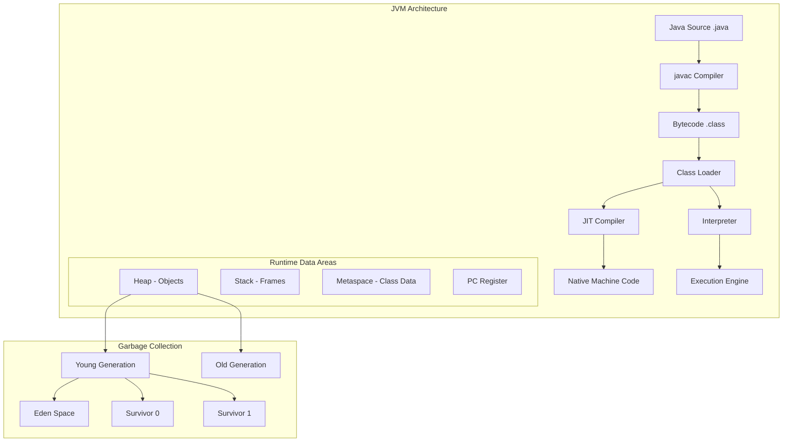
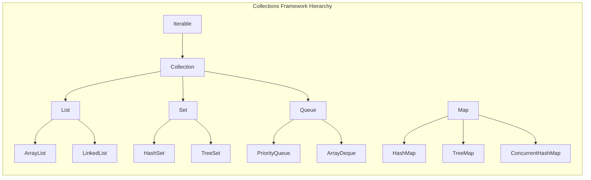

# Java

## Quick Reference

- Java is a statically-typed, object-oriented, platform-independent language running on the JVM
- Key principles: Write Once Run Anywhere (WORA), automatic garbage collection, strong type safety
- Java SE 8+ introduced lambdas, streams, Optional, and the DateTime API
- Access modifiers: `public`, `protected`, `default` (package-private), `private`
- Collections Framework: List, Set, Map, Queue with generics for type safety
- Concurrency: `synchronized`, `volatile`, `java.util.concurrent` package, `CompletableFuture`
- Memory model: Stack (primitives, references), Heap (objects), Metaspace (class metadata)

## When to Use

Java excels in enterprise backend systems where long-term maintainability, strong typing, and a mature ecosystem matter. Choose Java when building microservices with Spring Boot, high-throughput data processing pipelines, Android applications, or systems requiring robust concurrency support. Java's garbage collection and memory management make it suitable for long-running server processes. The extensive standard library and third-party ecosystem (Maven Central) reduce the need to build common functionality from scratch. Java is particularly strong for teams that value compile-time safety, IDE tooling support, and well-established design patterns. The language's backward compatibility guarantees mean that code written for Java 8 continues to run on Java 21 without modification, making it a safe long-term investment for enterprise codebases. Java's strong typing catches entire categories of bugs at compile time that would only surface at runtime in dynamically-typed languages, reducing production incidents and making large-scale refactoring feasible with IDE support.

## Code Examples

### Object-Oriented Fundamentals

```java
// Inheritance and polymorphism
public abstract class Loan {
    protected double principal;
    protected float interestRate;
    protected int tenure;

    public abstract double calculateEMI();

    public String getSummary() {
        return String.format("Principal: %.2f, Rate: %.2f%%, Tenure: %d years",
            principal, interestRate, tenure);
    }
}

public class HomeLoan extends Loan {
    private String propertyAddress;

    public HomeLoan(double principal, float rate, int tenure, String address) {
        this.principal = principal;
        this.interestRate = rate;
        this.tenure = tenure;
        this.propertyAddress = address;
    }

    @Override
    public double calculateEMI() {
        double monthlyRate = interestRate / 12 / 100;
        int months = tenure * 12;
        return (principal * monthlyRate * Math.pow(1 + monthlyRate, months))
               / (Math.pow(1 + monthlyRate, months) - 1);
    }
}
```

### Java SE 8+ Features

```java
// Streams and lambdas
List<Transaction> highValueTransactions = transactions.stream()
    .filter(t -> t.getAmount() > 10000)
    .sorted(Comparator.comparing(Transaction::getTimestamp).reversed())
    .limit(10)
    .collect(Collectors.toList());

// Optional for null safety
Optional<Customer> customer = customerRepository.findById(id);
String name = customer
    .map(Customer::getName)
    .orElseThrow(() -> new CustomerNotFoundException(id));

// CompletableFuture for async operations
CompletableFuture<OrderResult> result = CompletableFuture
    .supplyAsync(() -> validateOrder(order))
    .thenApplyAsync(validated -> processPayment(validated))
    .thenApplyAsync(paid -> shipOrder(paid))
    .exceptionally(ex -> handleFailure(ex));
```

### Concurrency and Multithreading

```java
// ExecutorService with thread pool
ExecutorService executor = Executors.newFixedThreadPool(
    Runtime.getRuntime().availableProcessors()
);

// ConcurrentHashMap for thread-safe operations
ConcurrentHashMap<String, AtomicLong> metrics = new ConcurrentHashMap<>();
metrics.computeIfAbsent("requests", k -> new AtomicLong()).incrementAndGet();

// ReentrantLock with try-finally pattern
private final ReentrantLock lock = new ReentrantLock();

public void transferFunds(Account from, Account to, BigDecimal amount) {
    lock.lock();
    try {
        from.debit(amount);
        to.credit(amount);
    } finally {
        lock.unlock();
    }
}
```

## Architecture and Diagrams





## Common Pitfalls

1. **NullPointerException**: Always use Optional or null checks. Prefer `Objects.requireNonNull()` at method boundaries for fail-fast behavior rather than letting nulls propagate deep into call stacks.

2. **Memory leaks with collections**: Static collections that grow unbounded, unclosed resources (streams, connections), and inner class references holding outer class instances are common sources of memory leaks in long-running applications.

3. **String concatenation in loops**: Using `+` operator in loops creates many intermediate String objects. Use `StringBuilder` for iterative string building, or `String.join()` / `Collectors.joining()` for collection-based concatenation.

4. **Mutable shared state**: Sharing mutable objects between threads without synchronization leads to race conditions. Prefer immutable objects, thread-local variables, or concurrent collections from `java.util.concurrent`.

5. **Checked exception overuse**: Wrapping every operation in checked exceptions forces callers to handle errors they cannot meaningfully recover from. Use unchecked exceptions for programming errors and checked exceptions only when the caller can take corrective action.

## Real-World Use Cases

- **Microservices with Spring Boot**: Java powers the majority of enterprise microservice architectures, handling millions of requests per second with frameworks like Spring Boot, Micronaut, and Quarkus providing rapid development and production-ready features. Organizations like Netflix, Amazon, and LinkedIn run thousands of Java microservices in production, leveraging the JVM's mature tooling for profiling, debugging, and monitoring at scale.

- **High-frequency trading systems**: Java's JIT compilation and low-latency garbage collectors (ZGC, Shenandoah) make it suitable for financial systems requiring sub-millisecond response times with predictable performance. The JVM's ability to optimize hot paths through tiered compilation and escape analysis enables trading systems to achieve near-native performance without sacrificing safety.

- **Big data processing**: Apache Kafka, Apache Spark, Apache Flink, and Hadoop are all built on Java/JVM, making Java the natural choice for data pipeline development and stream processing applications. The JVM's memory management and concurrency primitives handle the massive parallelism required for processing terabytes of data across distributed clusters.

- **Android development**: While Kotlin is now preferred, Java remains the foundation of the Android SDK and millions of existing Android applications rely on Java codebases. Understanding Java is essential for maintaining legacy Android code and working with the Android framework internals.

- **Enterprise integration**: Java EE (Jakarta EE) and Spring Integration provide robust messaging, transaction management, and connector architectures for integrating heterogeneous enterprise systems including ERP, CRM, and legacy mainframe applications through standardized APIs like JMS, JDBC, and JCA.

## Interview Questions

**Q: What is the difference between `==` and `.equals()` in Java?**
A: `==` compares reference identity (whether two variables point to the same object in memory), while `.equals()` compares logical equality (whether two objects have the same value). For strings, always use `.equals()` since string interning makes `==` behavior unpredictable.

**Q: Explain the Java Memory Model and happens-before relationship.**
A: The Java Memory Model defines how threads interact through memory. The happens-before relationship guarantees that memory writes by one thread are visible to another. Key happens-before edges include: program order within a thread, monitor lock/unlock, volatile write/read, thread start/join, and final field initialization.

**Q: What is the difference between `HashMap` and `ConcurrentHashMap`?**
A: `HashMap` is not thread-safe and can cause infinite loops during concurrent resize operations. `ConcurrentHashMap` uses lock striping (segments in Java 7, node-level CAS in Java 8+) to allow concurrent reads without locking and concurrent writes to different segments, providing much better throughput than `Collections.synchronizedMap()`.

**Q: How does garbage collection work in Java?**
A: The JVM uses generational garbage collection. New objects are allocated in Eden space. After surviving minor GC cycles, objects are promoted to Survivor spaces and eventually to the Old Generation. Major GC collects the Old Generation. Modern collectors like G1, ZGC, and Shenandoah minimize pause times through concurrent marking and incremental compaction.

## Production Tips

- **JVM tuning**: Set `-Xms` equal to `-Xmx` to avoid heap resizing overhead. Use G1GC for general workloads (`-XX:+UseG1GC`) or ZGC for low-latency requirements (`-XX:+UseZGC`). Monitor GC logs with `-Xlog:gc*` to identify memory pressure. For containerized deployments, ensure the JVM respects container memory limits with `-XX:+UseContainerSupport` (default since Java 10) and set `-XX:MaxRAMPercentage=75.0` to leave headroom for native memory.

- **Thread pool sizing**: For CPU-bound tasks, use `availableProcessors()` threads. For I/O-bound tasks, use `availableProcessors() * (1 + waitTime/computeTime)`. Always use bounded thread pools to prevent resource exhaustion under load. Consider virtual threads (Java 21+) for I/O-heavy workloads where creating thousands of lightweight threads eliminates the need for complex async programming models.

- **Connection pooling**: Use HikariCP for database connections with `maximumPoolSize` set to `(core_count * 2) + effective_spindle_count`. Monitor pool metrics (active, idle, waiting) to detect connection leaks. Set `leakDetectionThreshold` to log warnings when connections are held longer than expected, helping identify code paths that fail to close connections properly.

- **Monitoring and observability**: Expose JMX metrics, use Micrometer for application metrics, and enable JFR (Java Flight Recorder) in production for low-overhead profiling. Track heap usage, GC pause times, thread counts, and class loading metrics. Configure structured logging with MDC (Mapped Diagnostic Context) to correlate log entries across distributed service calls using trace IDs.

- **Startup optimization**: For microservices where startup time matters, use CDS (Class Data Sharing) archives to reduce class loading time, enable tiered compilation with `-XX:TieredStopAtLevel=1` for faster startup at the cost of peak throughput, or consider GraalVM native images for sub-second startup times with ahead-of-time compilation.

## Related Topics

- [Spring Framework](./spring-framework.md) - The dominant Java application framework for enterprise development
- [Apache Maven](./apache-maven.md) - Build tool and dependency management for Java projects
- [Gradle](./gradle.md) - Modern build automation tool commonly used with Java
