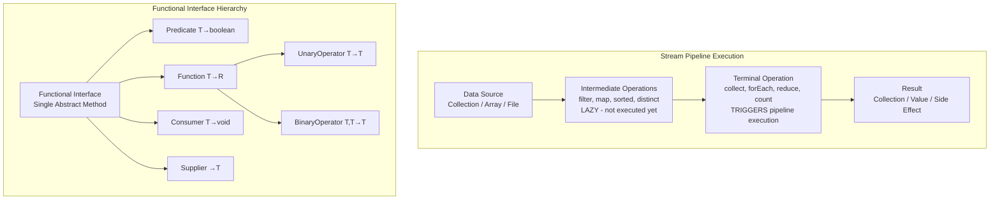

# Java SE 8 Features

## Quick Reference

- Lambda expressions: `(params) -> expression` enables functional-style programming with concise anonymous function syntax
- Functional interfaces: single abstract method interfaces (`@FunctionalInterface`) — `Predicate<T>`, `Function<T,R>`, `Consumer<T>`, `Supplier<T>`
- Stream API: `collection.stream().filter().map().collect()` for declarative data processing pipelines
- Optional: `Optional<T>` container eliminates null checks — use `orElse()`, `map()`, `flatMap()`, `ifPresent()`
- Default methods: `default void method() {}` in interfaces enables API evolution without breaking implementations
- Date/Time API: `java.time` package — `LocalDate`, `LocalTime`, `LocalDateTime`, `ZonedDateTime`, `Period`, `Duration`
- Method references: `Class::method` shorthand for lambdas — static (`Integer::parseInt`), instance (`String::length`), constructor (`ArrayList::new`)

## When to Use

Java 8 features are essential for modern Java development and should be used in any codebase targeting Java 8+. Lambda expressions and the Stream API replace verbose anonymous inner classes and imperative loops with declarative, composable operations that are easier to read, test, and parallelize. Use streams when processing collections with filter/map/reduce patterns, especially when the pipeline involves multiple transformations. Optional should be used as return types for methods that may not produce a result, replacing null returns and eliminating NullPointerException at call sites. The Date/Time API replaces the broken `java.util.Date` and `Calendar` classes with immutable, thread-safe alternatives that correctly model dates, times, and durations. Default methods enable library authors to evolve interfaces without breaking existing implementations — this is how the Collections API added `stream()`, `forEach()`, and `sort()` without requiring changes to every List implementation. These features are not optional modernizations; they are the standard idiom expected in production Java code and interview settings.

## Code Examples

### Lambda Expressions and Functional Interfaces

```java
// Lambda with Comparator
List<Employee> employees = getEmployees();
employees.sort((e1, e2) -> e1.getSalary().compareTo(e2.getSalary()));

// Predicate for filtering
Predicate<Employee> seniorFilter = emp -> emp.getYearsOfService() > 5;
Predicate<Employee> highEarner = emp -> emp.getSalary() > 100_000;

List<Employee> seniorHighEarners = employees.stream()
        .filter(seniorFilter.and(highEarner))
        .collect(Collectors.toList());

// Function for transformation
Function<Employee, String> toDisplayName = emp ->
        emp.getLastName() + ", " + emp.getFirstName();

// Consumer for side effects
Consumer<Employee> sendWelcomeEmail = emp ->
        emailService.send(emp.getEmail(), "Welcome aboard!");

// Supplier for lazy creation
Supplier<List<Employee>> employeeSupplier = () ->
        employeeRepository.findAll();

// BiFunction for combining
BiFunction<Double, Double, Double> calculateBonus =
        (salary, multiplier) -> salary * multiplier;

// Method references
employees.sort(Comparator.comparing(Employee::getLastName));
employees.forEach(System.out::println);
List<String> names = employees.stream()
        .map(Employee::getName)
        .collect(Collectors.toList());
```

### Stream API Operations

```java
// Complete pipeline: filter, transform, collect
List<OrderDTO> recentHighValueOrders = orders.stream()
        .filter(order -> order.getTotal().compareTo(BigDecimal.valueOf(1000)) > 0)
        .filter(order -> order.getDate().isAfter(LocalDate.now().minusDays(30)))
        .sorted(Comparator.comparing(Order::getDate).reversed())
        .map(order -> new OrderDTO(order.getId(), order.getTotal(), order.getStatus()))
        .collect(Collectors.toList());

// Grouping and aggregation
Map<Department, DoubleSummaryStatistics> salaryStats = employees.stream()
        .collect(Collectors.groupingBy(
                Employee::getDepartment,
                Collectors.summarizingDouble(Employee::getSalary)));

// Partitioning
Map<Boolean, List<Employee>> partitioned = employees.stream()
        .collect(Collectors.partitioningBy(emp -> emp.getSalary() > 75_000));

// FlatMap for nested collections
List<String> allSkills = employees.stream()
        .flatMap(emp -> emp.getSkills().stream())
        .distinct()
        .sorted()
        .collect(Collectors.toList());

// Reduce for aggregation
Optional<BigDecimal> totalRevenue = orders.stream()
        .map(Order::getTotal)
        .reduce(BigDecimal::add);

// Collectors.toMap with merge function
Map<String, Employee> employeeByEmail = employees.stream()
        .collect(Collectors.toMap(
                Employee::getEmail,
                Function.identity(),
                (existing, replacement) -> existing));

// Parallel stream for CPU-intensive work
long count = largeDataset.parallelStream()
        .filter(record -> complexValidation(record))
        .count();
```

### Optional Usage Patterns

```java
// Creating Optional values
Optional<Customer> customer = customerRepository.findById(id);
Optional<String> empty = Optional.empty();
Optional<String> present = Optional.of("value");
Optional<String> nullable = Optional.ofNullable(possiblyNull);

// Chaining with map and flatMap
String cityName = customer
        .flatMap(Customer::getAddress)    // Address is Optional<Address>
        .map(Address::getCity)            // getCity returns String
        .orElse("Unknown");

// orElseGet for expensive defaults (lazy evaluation)
Customer defaultCustomer = customer
        .orElseGet(() -> customerService.createDefault());

// orElseThrow for required values
Customer required = customer
        .orElseThrow(() -> new ResourceNotFoundException("Customer " + id));

// ifPresent for side effects
customer.ifPresent(c -> auditService.logAccess(c.getId()));

// filter within Optional
Optional<Customer> premiumCustomer = customer
        .filter(c -> c.getTier() == Tier.PREMIUM);

// Avoid: Optional as field or parameter
// Avoid: optional.get() without isPresent() check
// Avoid: Optional.of(null) — throws NPE
```

### Date/Time API

```java
// LocalDate — date without time
LocalDate today = LocalDate.now();
LocalDate birthday = LocalDate.of(1990, Month.MARCH, 15);
LocalDate nextWeek = today.plusWeeks(1);
Period age = Period.between(birthday, today);

// LocalTime — time without date
LocalTime meetingTime = LocalTime.of(14, 30);
LocalTime endTime = meetingTime.plusHours(1).plusMinutes(30);

// LocalDateTime — date and time without zone
LocalDateTime appointment = LocalDateTime.of(today, meetingTime);

// ZonedDateTime — full date/time with timezone
ZonedDateTime flightDeparture = ZonedDateTime.of(
        LocalDateTime.of(2024, 6, 15, 10, 30),
        ZoneId.of("America/New_York"));
ZonedDateTime arrivalLocal = flightDeparture
        .withZoneSameInstant(ZoneId.of("Europe/London"));

// Duration and Period for calculations
Duration between = Duration.between(startTime, endTime);
long hours = ChronoUnit.HOURS.between(startTime, endTime);

// Formatting and parsing
DateTimeFormatter formatter = DateTimeFormatter.ofPattern("dd-MMM-yyyy HH:mm");
String formatted = appointment.format(formatter);
LocalDateTime parsed = LocalDateTime.parse("15-Mar-2024 14:30", formatter);

// Temporal adjusters
LocalDate firstMonday = today.with(TemporalAdjusters.firstInMonth(DayOfWeek.MONDAY));
LocalDate lastDayOfMonth = today.with(TemporalAdjusters.lastDayOfMonth());
```

### Default and Static Methods in Interfaces

```java
public interface PaymentProcessor {
    // Abstract method — must be implemented
    PaymentResult process(Payment payment);

    // Default method — provides common behavior, can be overridden
    default PaymentResult processWithRetry(Payment payment, int maxRetries) {
        for (int attempt = 1; attempt <= maxRetries; attempt++) {
            PaymentResult result = process(payment);
            if (result.isSuccess()) return result;
            if (attempt < maxRetries) {
                try { Thread.sleep(1000L * attempt); }
                catch (InterruptedException e) { Thread.currentThread().interrupt(); }
            }
        }
        return PaymentResult.failed("Max retries exceeded");
    }

    // Static method — utility grouped with the interface
    static PaymentProcessor noOp() {
        return payment -> PaymentResult.success("No-op");
    }
}

// Implementation only needs to provide process()
public class StripePaymentProcessor implements PaymentProcessor {
    @Override
    public PaymentResult process(Payment payment) {
        return stripeClient.charge(payment.getAmount(), payment.getToken());
    }
}
```

## Architecture / Diagrams



## Common Pitfalls

1. **Reusing streams after terminal operation**: A stream can only be consumed once. Calling a terminal operation (collect, forEach, count) closes the stream. Attempting to reuse it throws `IllegalStateException`. If you need multiple passes over the data, collect to a list first or create a new stream each time.

2. **Parallel streams on small collections or I/O-bound work**: Parallel streams use the common ForkJoinPool and add overhead for thread coordination. For collections under 10,000 elements or I/O-bound operations (database calls, HTTP requests), sequential streams are faster. Benchmark before parallelizing, and never use parallel streams with shared mutable state.

3. **Optional.get() without checking presence**: Calling `get()` on an empty Optional throws `NoSuchElementException`, which is worse than the NPE you were trying to avoid. Always use `orElse()`, `orElseGet()`, `orElseThrow()`, or `ifPresent()`. Treat `get()` as a code smell in production code.

4. **Mutating state inside stream operations**: Stream operations should be stateless and side-effect-free. Modifying external variables inside `map()` or `filter()` leads to race conditions with parallel streams and makes code harder to reason about. Use `collect()` with proper collectors instead of accumulating into external collections.

5. **Using `orElse()` with expensive default computation**: `orElse(expensiveCall())` evaluates the default eagerly even when the Optional has a value. Use `orElseGet(() -> expensiveCall())` for lazy evaluation. This matters when the default involves database queries, network calls, or object creation.

## Real-World Use Cases

- **Data transformation pipelines**: Stream API replaces nested loops and temporary collections when transforming API responses, database results, or file contents. A typical service method chains filter/map/collect to convert entities to DTOs, apply business rules, and produce the final response in a single readable pipeline.

- **Event processing and filtering**: Lambda expressions with Predicate composition enable dynamic filtering rules that can be configured at runtime. Combine predicates with `and()`, `or()`, `negate()` to build complex filter chains for event routing, notification rules, or access control decisions without if-else cascades.

- **Null-safe service layer design**: Optional as return type from repository and service methods forces callers to handle the absence case explicitly. This eliminates entire categories of NullPointerException bugs and makes the API contract self-documenting — if a method returns `Optional<T>`, the caller knows the value might not exist.

- **Immutable date/time handling in financial systems**: The `java.time` API's immutability guarantees thread safety for date calculations in concurrent systems. Financial applications use `LocalDate` for settlement dates, `Duration` for SLA calculations, and `ZonedDateTime` for cross-timezone scheduling without the bugs that plagued `java.util.Date`.

## Interview Questions

**Q: What is the difference between `map()` and `flatMap()` in streams?**

A: `map()` applies a function to each element and wraps the result in the stream — if the function returns a collection, you get a `Stream<List<T>>`. `flatMap()` applies a function that returns a stream for each element, then flattens all resulting streams into a single stream. Use `flatMap()` when each input element maps to zero or more output elements (one-to-many), like extracting all order items from a list of orders: `orders.stream().flatMap(o -> o.getItems().stream())`.

**Q: Why is the Stream API lazy, and what are the performance implications?**

A: Intermediate operations (filter, map, sorted) are lazy — they build a pipeline description but don't process data until a terminal operation triggers execution. This enables short-circuiting optimizations: `findFirst()` stops processing after finding one match, `limit(n)` stops after n elements. It also allows the runtime to fuse operations (applying filter+map in a single pass) and avoid creating intermediate collections, reducing memory allocation and GC pressure.

**Q: When should you use `Optional.orElse()` vs `Optional.orElseGet()`?**

A: `orElse(value)` always evaluates the default value, even when the Optional contains a value. `orElseGet(supplier)` only evaluates the supplier when the Optional is empty. Use `orElse()` for cheap constants or pre-computed values. Use `orElseGet()` when the default involves computation, database access, or object creation. In production code, `orElseGet()` is almost always the correct choice because it avoids unnecessary work.

**Q: How do default methods in interfaces solve the diamond problem?**

A: Java resolves conflicts with three rules: (1) class methods always win over interface defaults, (2) more specific interfaces win over less specific ones (sub-interface overrides parent), (3) if ambiguity remains, the implementing class must explicitly override and choose which default to call using `InterfaceName.super.method()`. This is different from multiple inheritance of state (which Java doesn't allow) — default methods only provide behavior inheritance.

## Production Tips

- **Prefer `Collectors.toUnmodifiableList()` in Java 10+**: When collecting stream results that shouldn't be modified downstream, use unmodifiable collectors to prevent accidental mutation. In Java 8, wrap with `Collections.unmodifiableList()`. This catches bugs where downstream code accidentally adds to or removes from a result set that should be treated as immutable.

- **Use `Stream.of()` and `Optional.stream()` for null-safe flattening**: In Java 9+, `Optional.stream()` converts an Optional to a zero-or-one element stream, enabling clean integration with stream pipelines. For Java 8, use `optional.map(Stream::of).orElseGet(Stream::empty)` to achieve the same pattern when flatMapping over collections of Optionals.

- **Configure parallel stream thread pool for isolation**: Parallel streams share the common ForkJoinPool by default, meaning a slow parallel stream in one request can starve others. For production workloads, submit parallel stream operations to a custom ForkJoinPool: `customPool.submit(() -> stream.parallel().forEach(...)).get()`. This isolates batch processing from request-handling threads.

## Related Topics

- [Java](./core-language.md) — Core Java language fundamentals and OOP concepts
- [Spring Framework](../spring-framework/index.md) — Heavily uses lambdas and functional interfaces in configuration and reactive programming
- [Spring Boot](../spring-framework/spring-boot.md) — Stream API used extensively in service layer data transformations
