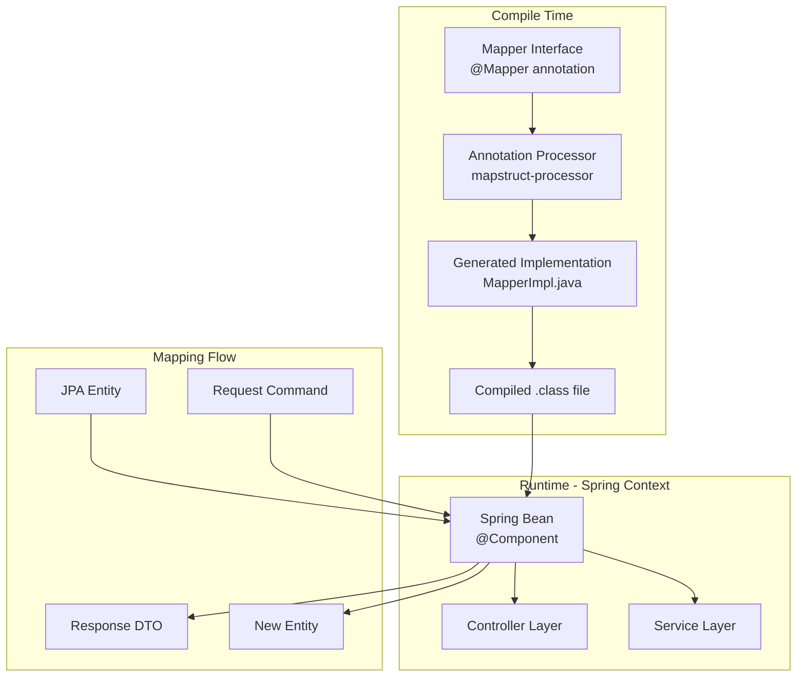

# MapStruct

## Quick Reference

- MapStruct is a compile-time code generator for type-safe Java bean mappings between DTOs, entities, and domain objects
- Annotate interfaces with `@Mapper` and define method signatures; MapStruct generates the implementation at compile time
- Zero runtime overhead compared to reflection-based mappers (ModelMapper, Dozer) since all mapping code is generated as plain Java
- Supports Spring integration via `@Mapper(componentModel = "spring")` for automatic dependency injection of mapper beans
- Handles nested object mapping, collection mapping, and enum mapping automatically when types are compatible
- Use `@Mapping(target = "field", source = "otherField")` for explicit field name mapping between source and target
- MapStruct generates null-safe code by default and supports customizable null-value strategies

## When to Use

MapStruct is the ideal choice when your application has a clear separation between layers that use different object representations. In enterprise applications following hexagonal or clean architecture, you typically have JPA entities for persistence, domain objects for business logic, DTOs for API responses, and command objects for incoming requests. Manually writing conversion code between these representations is tedious, error-prone, and creates maintenance burden as models evolve. MapStruct eliminates this boilerplate by generating type-safe mapping implementations at compile time, catching mapping errors during the build rather than at runtime. Choose MapStruct over reflection-based alternatives like ModelMapper when performance matters, when you want compile-time safety, or when you need to debug mapping logic by reading generated source code. MapStruct integrates seamlessly with Spring Boot, CDI, and JSR 330 dependency injection frameworks, making it a natural fit for enterprise Java microservices.

## Mapper Interfaces

Mapper interfaces are the core abstraction in MapStruct. You define a Java interface annotated with `@Mapper`, declare method signatures that describe the source-to-target conversion, and MapStruct generates the implementation class during compilation. The generated code is plain Java with no reflection, making it fast and debuggable.

A basic mapper interface requires only the method signature. MapStruct matches fields by name and type automatically. When the source and target objects share field names and compatible types, no additional configuration is needed. For fields with different names, you use `@Mapping` annotations to specify the correspondence explicitly.

MapStruct supports multiple mapping methods in a single interface, including forward and reverse mappings, update methods that modify an existing target object, and methods that map collections. The framework resolves nested mappings by looking for other mapper methods that can handle the nested type conversion, either within the same interface or in referenced mappers.

The `componentModel` attribute controls how the generated implementation is instantiated. Setting it to `"spring"` makes the generated class a Spring bean annotated with `@Component`, allowing you to inject it anywhere in your application. Other options include `"cdi"` for Jakarta CDI, `"jsr330"` for JSR 330, and the default which provides a static factory method via `Mappers.getMapper()`.

```java
@Mapper(componentModel = "spring")
public interface OrderMapper {

    @Mapping(target = "orderId", source = "id")
    @Mapping(target = "customerName", source = "customer.fullName")
    @Mapping(target = "totalAmount", source = "total")
    @Mapping(target = "createdDate", source = "createdAt", dateFormat = "yyyy-MM-dd")
    OrderResponse toResponse(Order order);

    @Mapping(target = "id", ignore = true)
    @Mapping(target = "createdAt", ignore = true)
    @Mapping(target = "status", constant = "PENDING")
    Order toEntity(CreateOrderRequest request);

    List<OrderResponse> toResponseList(List<Order> orders);

    @BeanMapping(nullValuePropertyMappingStrategy = NullValuePropertyMappingStrategy.IGNORE)
    void updateOrderFromRequest(UpdateOrderRequest request, @MappingTarget Order order);
}
```

The `@MappingTarget` annotation enables update methods that modify an existing object rather than creating a new one. This is particularly useful for PATCH operations where you want to update only the non-null fields from a request onto an existing entity. Combined with `NullValuePropertyMappingStrategy.IGNORE`, MapStruct skips null source properties during the update.

```java
@Mapper(componentModel = "spring", uses = {AddressMapper.class, PaymentMapper.class})
public interface CustomerMapper {

    @Mapping(target = "fullAddress", source = "address")
    @Mapping(target = "paymentInfo", source = "paymentDetails")
    CustomerDto toDto(Customer customer);

    @InheritInverseConfiguration
    Customer toEntity(CustomerDto dto);
}
```

The `uses` attribute references other mapper interfaces that MapStruct should use when it encounters nested types it cannot map directly. This promotes composition and reuse across your mapping layer without duplicating conversion logic.

## Custom Mappings

Custom mappings handle scenarios where automatic field matching is insufficient. MapStruct provides several mechanisms for customizing the mapping logic: `@Mapping` annotations with source expressions, default values, constant values, and qualifier-based method selection. For complex transformations that cannot be expressed declaratively, you can define default methods directly in the mapper interface or use abstract classes instead of interfaces.

When source and target fields have different names, the `@Mapping` annotation explicitly declares the correspondence. You can map nested properties using dot notation in the source expression, allowing you to flatten deeply nested source objects into flat target DTOs. MapStruct also supports mapping multiple source objects into a single target by defining methods with multiple parameters.

Default methods in the mapper interface let you write arbitrary Java logic for conversions that MapStruct cannot generate automatically. This is useful for type conversions between incompatible types, conditional logic, or aggregation of multiple source fields into a single target field. MapStruct will call your default method when it encounters a type that matches the method signature during code generation.

```java
@Mapper(componentModel = "spring")
public interface ProductMapper {

    @Mapping(target = "displayPrice", source = "price", qualifiedByName = "formatPrice")
    @Mapping(target = "categoryPath", source = "category.hierarchy")
    @Mapping(target = "available", source = "inventory.quantity", qualifiedByName = "checkAvailability")
    @Mapping(target = "tags", source = "metadata.tags")
    @Mapping(target = "discountedPrice", source = "price", defaultValue = "0.00")
    ProductResponse toResponse(Product product);

    @Named("formatPrice")
    default String formatPrice(BigDecimal price) {
        if (price == null) return "N/A";
        return "$" + price.setScale(2, RoundingMode.HALF_UP).toPlainString();
    }

    @Named("checkAvailability")
    default boolean checkAvailability(Integer quantity) {
        return quantity != null && quantity > 0;
    }
}
```

The `@Named` and `qualifiedByName` mechanism allows you to define multiple conversion methods for the same type pair and select the appropriate one for each field. Without qualifiers, MapStruct would be ambiguous about which method to use when multiple methods accept the same source type and return the same target type.

For mappings that combine multiple source objects, MapStruct supports multi-parameter mapping methods. This is common when assembling a response DTO from an entity plus additional context like user preferences or computed metrics.

```java
@Mapper(componentModel = "spring")
public interface ReportMapper {

    @Mapping(target = "title", source = "report.name")
    @Mapping(target = "authorName", source = "author.displayName")
    @Mapping(target = "generatedAt", source = "metadata.timestamp")
    @Mapping(target = "downloadUrl", source = "metadata.url")
    ReportSummary toSummary(Report report, User author, ReportMetadata metadata);

    default List<ReportSummary> toSummaryList(
            List<Report> reports, User author, ReportMetadata metadata) {
        return reports.stream()
            .map(report -> toSummary(report, author, metadata))
            .collect(Collectors.toList());
    }
}
```

You can also use abstract classes instead of interfaces when you need to inject dependencies or maintain state in your mapper. This approach is useful when custom mapping logic requires calling external services, repositories, or utility beans.

```java
@Mapper(componentModel = "spring")
public abstract class EnrichmentMapper {

    @Autowired
    protected PricingService pricingService;

    @Autowired
    protected InventoryClient inventoryClient;

    @Mapping(target = "currentPrice", ignore = true)
    @Mapping(target = "stockLevel", ignore = true)
    public abstract ProductView toView(Product product);

    @AfterMapping
    protected void enrichWithLiveData(Product source, @MappingTarget ProductView target) {
        target.setCurrentPrice(pricingService.getCurrentPrice(source.getSku()));
        target.setStockLevel(inventoryClient.getStock(source.getSku()));
    }
}
```

The `@AfterMapping` annotation marks a method that MapStruct calls after the generated mapping logic completes. This hook lets you perform additional transformations, validations, or enrichment that depend on the fully mapped target object.

## Expression Mappings

Expression mappings allow you to embed Java expressions directly in `@Mapping` annotations, providing inline computation without requiring separate default methods. This is powerful for simple transformations, string concatenation, static method calls, or conditional assignments that would be verbose as named methods.

The `expression` attribute accepts a Java expression wrapped in `java(...)` syntax. MapStruct inserts this expression directly into the generated code, so it must be valid Java that compiles in the context of the generated mapper class. You can reference the source parameter, call static methods, use ternary operators, and invoke constructors.

Expressions are best suited for simple, self-contained transformations. For complex logic involving multiple steps, error handling, or external dependencies, prefer default methods or `@AfterMapping` hooks for better readability and testability.

```java
@Mapper(componentModel = "spring", imports = {UUID.class, Instant.class, StringUtils.class})
public interface EventMapper {

    @Mapping(target = "eventId", expression = "java(UUID.randomUUID().toString())")
    @Mapping(target = "timestamp", expression = "java(Instant.now())")
    @Mapping(target = "fullName", expression = "java(event.getFirstName() + \" \" + event.getLastName())")
    @Mapping(target = "normalizedEmail", expression = "java(event.getEmail().toLowerCase().trim())")
    @Mapping(target = "source", constant = "ORDER_SERVICE")
    AuditEvent toAuditEvent(OrderEvent event);

    @Mapping(target = "key", expression = "java(notification.getType().name() + \"_\" + notification.getUserId())")
    @Mapping(target = "priority", expression = "java(notification.isUrgent() ? 1 : 5)")
    @Mapping(target = "expiresAt", expression = "java(Instant.now().plus(Duration.ofHours(24)))")
    NotificationMessage toMessage(Notification notification);
}
```

The `imports` attribute on `@Mapper` specifies classes that should be imported in the generated implementation file. This is required when your expressions reference classes that are not already imported through the method parameter types or return types. Without the imports declaration, the generated code will fail to compile.

Conditional expressions using ternary operators are common in expression mappings for null-safe transformations or default value logic that goes beyond what `defaultValue` supports.

```java
@Mapper(componentModel = "spring", imports = {Collections.class, Optional.class})
public interface ResponseMapper {

    @Mapping(target = "items", expression = "java(order.getItems() != null ? order.getItems() : Collections.emptyList())")
    @Mapping(target = "status", expression = "java(Optional.ofNullable(order.getStatus()).map(Enum::name).orElse(\"UNKNOWN\"))")
    @Mapping(target = "itemCount", expression = "java(order.getItems() != null ? order.getItems().size() : 0)")
    OrderSummary toSummary(Order order);
}
```

You can also use `defaultExpression` which is evaluated only when the source value is null, providing a computed fallback rather than a static constant.

```java
@Mapper(componentModel = "spring", imports = {UUID.class, Instant.class})
public interface EntityMapper {

    @Mapping(target = "id", source = "id", defaultExpression = "java(UUID.randomUUID())")
    @Mapping(target = "createdAt", source = "createdAt", defaultExpression = "java(Instant.now())")
    @Mapping(target = "version", source = "version", defaultExpression = "java(1L)")
    AuditableEntity toEntity(CreateRequest request);
}
```

## Decorator Patterns

Decorators in MapStruct allow you to wrap the generated mapper implementation with additional behavior while preserving the generated mapping logic. This pattern is useful when you need to add cross-cutting concerns like logging, validation, caching, or conditional logic that applies to all or specific mapping methods without modifying the mapper interface itself.

MapStruct supports decorators through the `@DecoratedWith` annotation on the mapper interface. You create an abstract class that extends the mapper interface, inject the generated delegate implementation, and override specific methods to add your custom behavior before or after delegating to the generated code. The decorator pattern maintains clean separation between mapping logic and cross-cutting concerns.

In a Spring context, the decorator becomes the primary bean while the generated implementation is injected as a delegate. This means consumers of the mapper get the decorated version automatically through dependency injection without any configuration changes.

```java
@Mapper(componentModel = "spring")
@DecoratedWith(OrderMapperDecorator.class)
public interface OrderMapper {

    @Mapping(target = "orderId", source = "id")
    @Mapping(target = "totalFormatted", source = "total")
    OrderResponse toResponse(Order order);

    Order toEntity(CreateOrderRequest request);
}

public abstract class OrderMapperDecorator implements OrderMapper {

    @Autowired
    @Qualifier("delegate")
    private OrderMapper delegate;

    @Autowired
    private AuditService auditService;

    @Autowired
    private ValidationService validationService;

    @Override
    public OrderResponse toResponse(Order order) {
        OrderResponse response = delegate.toResponse(order);
        auditService.logMapping("Order", order.getId(), "OrderResponse");
        return response;
    }

    @Override
    public Order toEntity(CreateOrderRequest request) {
        validationService.validateBusinessRules(request);
        Order entity = delegate.toEntity(request);
        entity.setCreatedBy(SecurityContextHolder.getContext().getAuthentication().getName());
        return entity;
    }
}
```

The decorator pattern is particularly valuable for adding validation logic that depends on business rules or external state. Rather than cluttering the mapper interface with validation annotations, you centralize validation in the decorator where you have access to injected services.

Another common use case is conditional mapping where the transformation logic depends on runtime context such as feature flags, user roles, or tenant configuration.

```java
public abstract class TenantAwareMapperDecorator implements ProductMapper {

    @Autowired
    @Qualifier("delegate")
    private ProductMapper delegate;

    @Autowired
    private TenantContext tenantContext;

    @Autowired
    private FeatureFlagService featureFlags;

    @Override
    public ProductResponse toResponse(Product product) {
        ProductResponse response = delegate.toResponse(product);

        if (featureFlags.isEnabled("SHOW_WHOLESALE_PRICE", tenantContext.getTenantId())) {
            response.setWholesalePrice(product.getWholesalePrice());
        } else {
            response.setWholesalePrice(null);
        }

        if (tenantContext.getCurrency() != null) {
            response.setDisplayCurrency(tenantContext.getCurrency().getCode());
        }

        return response;
    }
}
```

Decorators can also implement caching for expensive mapping operations where the source object is immutable and the same mapping is requested frequently.

```java
public abstract class CachingUserMapperDecorator implements UserMapper {

    @Autowired
    @Qualifier("delegate")
    private UserMapper delegate;

    private final Cache<UUID, UserProfile> cache = Caffeine.newBuilder()
        .maximumSize(1000)
        .expireAfterWrite(Duration.ofMinutes(5))
        .build();

    @Override
    public UserProfile toProfile(User user) {
        return cache.get(user.getId(), id -> delegate.toProfile(user));
    }
}
```

## Architecture and Diagrams

```mermaid
graph LR
    subgraph "Layered Architecture with MapStruct"
        API[API Layer<br/>Controllers] -->|Request DTO| MAP1[Request Mapper]
        MAP1 -->|Domain Object| BIZ[Business Layer<br/>Services]
        BIZ -->|Domain Object| MAP2[Response Mapper]
        MAP2 -->|Response DTO| API
        BIZ -->|Domain Object| MAP3[Persistence Mapper]
        MAP3 -->|JPA Entity| DB[Persistence Layer<br/>Repositories]
        DB -->|JPA Entity| MAP4[Entity-to-Domain Mapper]
        MAP4 -->|Domain Object| BIZ
    end
```





## Common Pitfalls

1. **Unmapped target properties warning**: MapStruct generates compiler warnings for target properties without a corresponding source. Suppress intentionally unmapped fields with `@Mapping(target = "field", ignore = true)` rather than using `unmappedTargetPolicy = ReportingPolicy.IGNORE` globally, which hides legitimate mapping gaps.

2. **Missing annotation processor in build**: MapStruct requires the `mapstruct-processor` dependency with `annotationProcessor` scope in Gradle or `maven-compiler-plugin` configuration in Maven. Without it, no implementation is generated and you get `NoSuchBeanDefinitionException` at runtime.

3. **Lombok and MapStruct ordering**: When using Lombok with MapStruct, the Lombok annotation processor must run before MapStruct so that getters and setters exist when MapStruct generates its code. In Maven, configure `annotationProcessorPaths` with Lombok listed before MapStruct. In Gradle, use `annotationProcessor` dependency ordering.

4. **Ambiguous mapping methods**: Defining multiple methods with the same source and target types without qualifiers causes compilation errors. Use `@Named` qualifiers and `qualifiedByName` to disambiguate, or use `@BeanMapping` with different result types.

5. **Circular references in nested mappings**: Entities with bidirectional relationships (e.g., parent-child with back-references) can cause infinite recursion during mapping. Break the cycle by using `@Mapping(target = "parent", ignore = true)` on the child mapper or implementing a custom method with cycle detection.

## Real-World Use Cases

- **Microservice API boundaries**: MapStruct maps between internal domain models and versioned API DTOs, allowing the internal model to evolve independently from the public contract. Different mapper interfaces handle v1 and v2 API responses from the same domain objects.

- **Event-driven systems**: When publishing domain events to Kafka or RabbitMQ, MapStruct converts rich domain objects into lean event payloads containing only the data consumers need, reducing message size and decoupling internal model changes from event schemas.

- **Database migration layers**: During gradual database migrations (e.g., moving from a monolithic schema to microservice-owned tables), MapStruct maps between old and new entity structures, allowing both schemas to coexist while the migration progresses.

- **Anti-corruption layers**: In systems integrating with legacy services or third-party APIs, MapStruct creates clean boundaries by mapping external response formats into your domain model, isolating your codebase from external schema changes.

## Interview Questions

**Q: Why choose MapStruct over reflection-based mappers like ModelMapper or Dozer?**
A: MapStruct generates plain Java code at compile time, providing zero runtime reflection overhead, compile-time type safety that catches mapping errors during the build, and debuggable generated source code. Reflection-based mappers discover mappings at runtime, which is slower, fails silently on mismatched fields, and is harder to debug.

**Q: How does MapStruct handle null values during mapping?**
A: By default, MapStruct generates null checks and returns null when the source is null. You can customize this with `nullValueMappingStrategy` (return null or create empty target), `nullValuePropertyMappingStrategy` (set null, ignore, or set default), and `nullValueCheckStrategy` on individual mappings or globally via `@MapperConfig`.

**Q: How do you test MapStruct mappers?**
A: Since MapStruct generates concrete implementations, you test them like any other class. Instantiate the mapper implementation directly (or inject via Spring in integration tests), pass source objects, and assert the target fields. The generated code is deterministic, so tests verify your mapping configuration is correct rather than testing the framework itself.

**Q: Explain how MapStruct resolves nested object mappings.**
A: When MapStruct encounters a field whose type differs between source and target, it looks for a mapping method (in the same mapper, in `uses` referenced mappers, or built-in conversions) that can convert the source field type to the target field type. If found, it calls that method. If not found, it reports a compilation error, forcing you to provide the missing conversion explicitly.

## Production Tips

- **Use `@MapperConfig` for shared configuration**: Define a shared configuration class with `@MapperConfig` containing common settings like `componentModel`, `unmappedTargetPolicy`, and `nullValueMappingStrategy`. Reference it via `@Mapper(config = SharedMapperConfig.class)` to ensure consistency across all mappers without repetition.

- **Monitor generated code size**: In large projects with hundreds of mappers, the generated code can significantly increase compilation time and JAR size. Use MapStruct's `unmappedSourcePolicy = ReportingPolicy.WARN` to identify unused source fields that indicate over-mapping, and consider splitting large mappers into focused, single-responsibility interfaces.

- **Version your API mappers**: When supporting multiple API versions, create separate mapper interfaces per version (e.g., `OrderMapperV1`, `OrderMapperV2`). This makes it explicit which fields are exposed in each version and simplifies deprecation of old API contracts.

- **Leverage `@Condition` for null-checking custom logic**: MapStruct 1.5+ supports `@Condition` methods that determine whether a source property should be mapped. This is cleaner than `@AfterMapping` hacks for conditional field population based on business rules.

## Related Topics

- [Spring Framework](./spring-framework.md) - MapStruct integrates with Spring's dependency injection for automatic mapper bean management
- [Java](./java.md) - MapStruct leverages Java annotation processing and generates idiomatic Java code
- [Apache Kafka](./apache-kafka.md) - MapStruct is commonly used to map domain objects to Kafka event payloads
