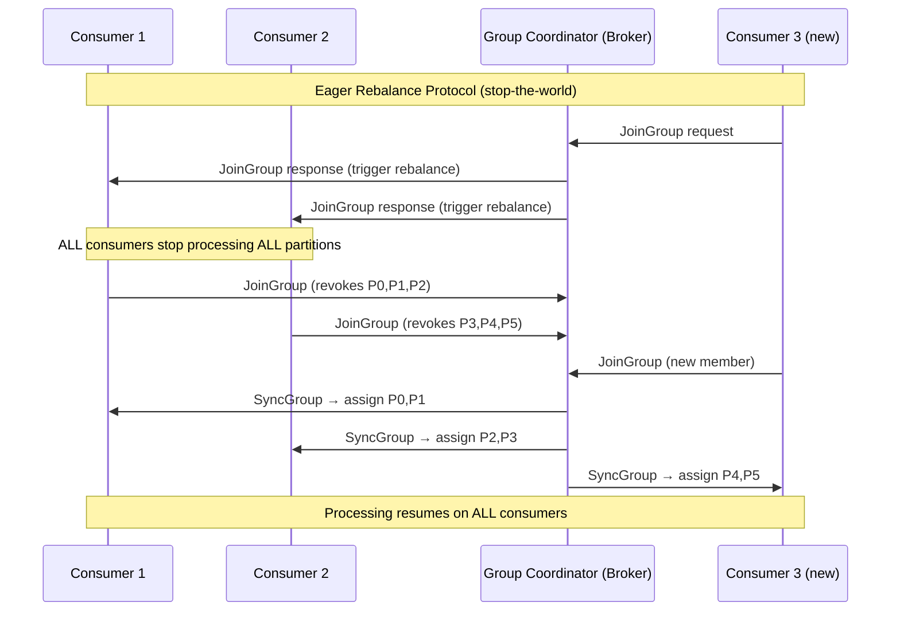
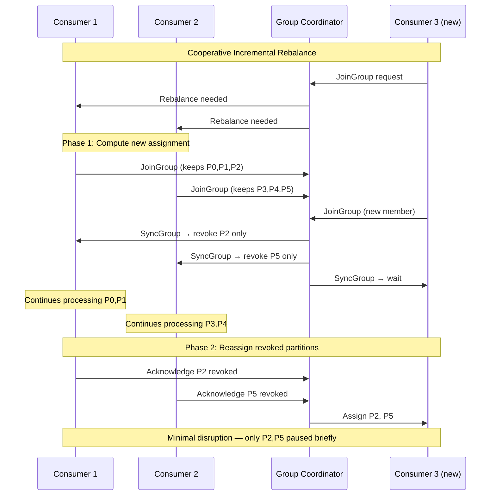
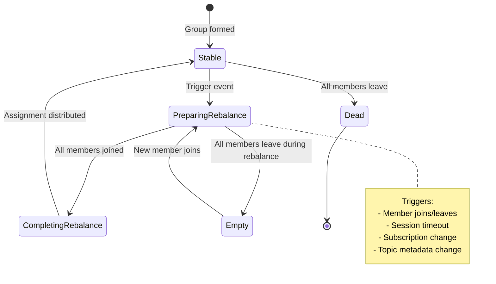

# Consumer Group Rebalancing

## Quick Reference

- **Rebalancing** is the process of redistributing topic partitions among consumers in a consumer group when membership changes
- **Eager rebalancing** (legacy): All consumers revoke all partitions simultaneously, then receive new assignments — causes a stop-the-world processing pause
- **Incremental cooperative rebalancing** (Kafka 2.4+): Only partitions that need to move are revoked; other partitions continue processing uninterrupted
- Rebalance triggers: consumer joins/leaves group, consumer crashes (session timeout), subscription change, topic partition count change
- **Static group membership** (`group.instance.id`): Prevents rebalance on transient disconnects; consumer retains its assignment across restarts within `session.timeout.ms`
- Group Coordinator (broker) manages group membership; Group Leader (first consumer) computes partition assignment
- Key timeouts: `session.timeout.ms` (heartbeat-based liveness), `max.poll.interval.ms` (processing liveness), `heartbeat.interval.ms` (heartbeat frequency)
- `group.initial.rebalance.delay.ms` (broker config): Delays first rebalance to batch multiple consumer joins during deployment

## When to Use

Understanding rebalancing mechanics is critical when you operate consumer groups in production and need to minimize processing disruptions during deployments, scaling events, and failure recovery.

Use **incremental cooperative rebalancing** (the default in Kafka 3.0+) for any production workload where processing continuity matters. This is especially important for latency-sensitive applications like payment processing, real-time fraud detection, or user-facing event streams where even brief pauses are unacceptable.

Use **static group membership** when your consumers run in environments with transient network issues (Kubernetes pods with rolling restarts, cloud instances with brief connectivity blips) and you want to avoid unnecessary rebalances that would otherwise be triggered by momentary heartbeat failures. Static membership is particularly valuable for Kafka Streams applications where state store restoration after a rebalance is expensive.

Use **eager rebalancing** only in legacy environments running Kafka versions before 2.4, or in testing scenarios where you want deterministic, atomic reassignment behavior. There is no production advantage to eager rebalancing in modern Kafka deployments.

Tune rebalance parameters when you observe frequent unnecessary rebalances (rebalance storms), excessive processing pauses during deployments, or consumer lag spikes correlated with group membership changes.

## Code Examples

### Cooperative Rebalancing with State Management

```java
// Consumer configured for cooperative incremental rebalancing
Properties props = new Properties();
props.put(ConsumerConfig.BOOTSTRAP_SERVERS_CONFIG, "broker1:9092,broker2:9092,broker3:9092");
props.put(ConsumerConfig.GROUP_ID_CONFIG, "payment-processing-group");
props.put(ConsumerConfig.KEY_DESERIALIZER_CLASS_CONFIG, StringDeserializer.class.getName());
props.put(ConsumerConfig.VALUE_DESERIALIZER_CLASS_CONFIG, JsonDeserializer.class.getName());

// Cooperative rebalancing configuration
props.put(ConsumerConfig.PARTITION_ASSIGNMENT_STRATEGY_CONFIG,
    CooperativeStickyAssignor.class.getName());

// Timeout tuning for production stability
props.put(ConsumerConfig.SESSION_TIMEOUT_MS_CONFIG, 45000);      // 45s session timeout
props.put(ConsumerConfig.HEARTBEAT_INTERVAL_MS_CONFIG, 15000);   // 15s heartbeat (session/3)
props.put(ConsumerConfig.MAX_POLL_INTERVAL_MS_CONFIG, 600000);   // 10min max processing time

// Static membership for Kubernetes deployments
props.put(ConsumerConfig.GROUP_INSTANCE_ID_CONFIG,
    "payment-consumer-" + System.getenv("HOSTNAME")); // Stable across pod restarts

KafkaConsumer<String, PaymentEvent> consumer = new KafkaConsumer<>(props);

// Rebalance listener with cooperative-aware state management
consumer.subscribe(List.of("payment-events"), new ConsumerRebalanceListener() {

    // In-memory state per partition (e.g., batch accumulators, dedup caches)
    private final Map<TopicPartition, PartitionState> partitionStates = new ConcurrentHashMap<>();

    @Override
    public void onPartitionsRevoked(Collection<TopicPartition> partitions) {
        // Cooperative: only called for partitions being moved away
        // Flush pending work and commit offsets for revoked partitions
        for (TopicPartition tp : partitions) {
            PartitionState state = partitionStates.remove(tp);
            if (state != null) {
                state.flushPendingBatch();  // Complete in-flight work
                commitOffset(tp, state.getLastProcessedOffset());
            }
        }
        log.info("Revoked partitions (cooperative): {}", partitions);
        metrics.recordRebalanceRevocation(partitions.size());
    }

    @Override
    public void onPartitionsAssigned(Collection<TopicPartition> partitions) {
        // Initialize state for newly assigned partitions
        for (TopicPartition tp : partitions) {
            PartitionState state = new PartitionState(tp);
            state.initialize();  // Load dedup cache, initialize batch accumulator
            partitionStates.put(tp, state);
        }
        log.info("Assigned partitions: {}", partitions);
        metrics.recordRebalanceAssignment(partitions.size());
    }

    @Override
    public void onPartitionsLost(Collection<TopicPartition> partitions) {
        // Partitions lost without clean revocation (session timeout exceeded)
        // Do NOT commit offsets — another consumer may already own these partitions
        for (TopicPartition tp : partitions) {
            PartitionState state = partitionStates.remove(tp);
            if (state != null) {
                state.discardPendingBatch();  // Discard uncommitted work
            }
        }
        log.warn("Partitions lost (unclean): {}", partitions);
        metrics.recordPartitionsLost(partitions.size());
    }
});
```

### Static Membership with Kubernetes

```java
// Static membership configuration for Kubernetes StatefulSet
// Each pod gets a stable hostname (e.g., payment-consumer-0, payment-consumer-1)
// This prevents rebalances during rolling restarts

Properties props = new Properties();
props.put(ConsumerConfig.BOOTSTRAP_SERVERS_CONFIG, kafkaBootstrapServers);
props.put(ConsumerConfig.GROUP_ID_CONFIG, "payment-processing");

// Static membership: use stable pod identity
String podName = System.getenv("POD_NAME"); // From Kubernetes downward API
props.put(ConsumerConfig.GROUP_INSTANCE_ID_CONFIG, "payment-" + podName);

// With static membership, session timeout controls how long the group
// waits before reassigning partitions from a disconnected static member
// Set higher than your rolling restart time
props.put(ConsumerConfig.SESSION_TIMEOUT_MS_CONFIG, 300000); // 5 minutes

// Heartbeat still needed for liveness detection
props.put(ConsumerConfig.HEARTBEAT_INTERVAL_MS_CONFIG, 10000);

props.put(ConsumerConfig.PARTITION_ASSIGNMENT_STRATEGY_CONFIG,
    CooperativeStickyAssignor.class.getName());

KafkaConsumer<String, Event> consumer = new KafkaConsumer<>(props);
consumer.subscribe(List.of("events"));

// During rolling restart:
// 1. Pod is terminated (consumer stops heartbeating)
// 2. Group coordinator waits session.timeout.ms (5 min) before triggering rebalance
// 3. New pod starts with same group.instance.id
// 4. Coordinator recognizes returning static member — no rebalance triggered
// 5. Consumer resumes from last committed offset on same partitions
```

### Monitoring Rebalance Events

```java
// Custom metrics for rebalance monitoring
public class RebalanceMetricsListener implements ConsumerRebalanceListener {

    private final MeterRegistry meterRegistry;
    private final Timer rebalanceTimer;
    private final Counter rebalanceCounter;
    private final AtomicLong rebalanceStartTime = new AtomicLong(0);

    public RebalanceMetricsListener(MeterRegistry meterRegistry, String groupId) {
        this.meterRegistry = meterRegistry;
        this.rebalanceCounter = Counter.builder("kafka.consumer.rebalance.total")
            .tag("group", groupId)
            .register(meterRegistry);
        this.rebalanceTimer = Timer.builder("kafka.consumer.rebalance.duration")
            .tag("group", groupId)
            .register(meterRegistry);
    }

    @Override
    public void onPartitionsRevoked(Collection<TopicPartition> partitions) {
        rebalanceStartTime.set(System.nanoTime());
        rebalanceCounter.increment();

        Gauge.builder("kafka.consumer.rebalance.partitions.revoked",
                partitions, Collection::size)
            .register(meterRegistry);
    }

    @Override
    public void onPartitionsAssigned(Collection<TopicPartition> partitions) {
        long startTime = rebalanceStartTime.get();
        if (startTime > 0) {
            long duration = System.nanoTime() - startTime;
            rebalanceTimer.record(duration, TimeUnit.NANOSECONDS);
        }

        Gauge.builder("kafka.consumer.rebalance.partitions.assigned",
                partitions, Collection::size)
            .register(meterRegistry);
    }

    @Override
    public void onPartitionsLost(Collection<TopicPartition> partitions) {
        Counter.builder("kafka.consumer.partitions.lost")
            .tag("count", String.valueOf(partitions.size()))
            .register(meterRegistry)
            .increment();
    }
}
```

## Architecture / Diagrams







## Common Pitfalls

- **Rebalance storms from slow consumers**: If `max.poll.interval.ms` is too low relative to processing time, consumers get kicked from the group, triggering a rebalance. The rebalance assigns those partitions to other consumers, which now have more work, potentially exceeding their own poll interval — cascading into repeated rebalances. Set `max.poll.interval.ms` to at least 2x your worst-case batch processing time and reduce `max.poll.records` if needed.

- **Heartbeat thread blocked by processing**: In older Kafka clients (pre-0.10.1), heartbeats were sent on the poll thread. Long-running `poll()` processing would block heartbeats, causing session timeouts. Modern clients use a background heartbeat thread, but you must still ensure `max.poll.interval.ms` is not exceeded. If your processing involves external calls (database writes, HTTP requests), implement timeouts on those calls.

- **Deploying all consumers simultaneously**: Rolling out all consumer instances at once triggers a massive rebalance as all members leave and rejoin. Use rolling deployments with `group.initial.rebalance.delay.ms` set to your deployment window (e.g., 60 seconds) so the coordinator batches all the join/leave events into a single rebalance rather than triggering one per instance.

- **Static membership with wrong session timeout**: Setting `session.timeout.ms` too low with static membership defeats its purpose — the coordinator reassigns partitions before the restarting consumer can rejoin. Set it higher than your maximum restart time (including container scheduling, image pull, and initialization). For Kubernetes, 5-10 minutes is typical. Setting it too high means genuinely failed consumers take longer to be detected.

- **Not handling `onPartitionsLost` separately from `onPartitionsRevoked`**: With cooperative rebalancing, `onPartitionsLost()` is called when partitions are taken away without a clean revocation (e.g., consumer exceeded session timeout). Committing offsets in `onPartitionsLost()` is dangerous because another consumer may already be processing those partitions. Always discard uncommitted work in `onPartitionsLost()` and only commit in `onPartitionsRevoked()`.

- **Ignoring rebalance metrics**: Without monitoring rebalance frequency and duration, you cannot distinguish between healthy scaling events and pathological rebalance storms. Track `rebalance-total`, `rebalance-rate-per-hour`, `last-rebalance-seconds-ago`, and `rebalance-latency-avg`. Alert when rebalance frequency exceeds 2-3 per hour outside of deployment windows.

## Real-World Use Cases

- **Zero-downtime Kubernetes deployments**: A payment processing service runs 12 consumer instances in a Kubernetes StatefulSet. Using static group membership with `group.instance.id` derived from the pod's stable hostname, rolling restarts complete without triggering any rebalances. Each pod restarts within the 5-minute session timeout window, rejoins with its original instance ID, and resumes processing its previously assigned partitions from the last committed offset. Total processing gap per partition: 30-60 seconds (pod restart time) instead of 2-3 minutes (full rebalance + state restoration).

- **Auto-scaling consumer groups**: An e-commerce platform auto-scales its order processing consumers based on consumer lag metrics. When lag exceeds threshold, new consumer instances are added. With cooperative sticky rebalancing, the new consumers receive a subset of partitions from existing consumers with minimal disruption. The platform uses `group.initial.rebalance.delay.ms=30000` to batch multiple scaling events into a single rebalance when the autoscaler adds 3-4 instances simultaneously.

- **Cross-datacenter consumer failover**: A financial services company runs active-passive consumer groups across two datacenters. The passive group uses static membership with a very high session timeout (30 minutes). During datacenter failover, the passive group's consumers are activated and begin processing. The high session timeout ensures the passive consumers maintain their group membership without actually consuming, ready for instant activation during failover without waiting for a rebalance.

- **Kafka Streams state store optimization**: A real-time recommendation engine uses Kafka Streams with 200GB of state across 48 partitions. Cooperative rebalancing combined with standby replicas (`num.standby.replicas=1`) ensures that when a partition moves, the receiving consumer already has a warm copy of the state store. Rebalance recovery time dropped from 15 minutes (full changelog replay) to 30 seconds (catch-up from standby).

## Interview Questions

**Q: What triggers a consumer group rebalance, and how can you minimize unnecessary rebalances?**

A: Rebalances are triggered by: (1) consumer joining the group, (2) consumer leaving gracefully (`consumer.close()`), (3) consumer crashing (session timeout expires without heartbeat), (4) consumer exceeding `max.poll.interval.ms` (considered stuck), (5) topic partition count changing, (6) consumer subscription pattern matching new topics. Minimize unnecessary rebalances by: using static group membership to tolerate transient disconnects, tuning `session.timeout.ms` higher than your worst-case GC pause or network blip, setting `max.poll.interval.ms` based on actual processing time, using `group.initial.rebalance.delay.ms` to batch joins during deployments, and implementing graceful shutdown (`consumer.close()`) to trigger a clean leave rather than waiting for session timeout.

**Q: Explain the difference between eager and cooperative rebalancing protocols. What is the migration path?**

A: Eager protocol: all consumers revoke all partitions at rebalance start, creating a stop-the-world pause where no messages are processed. After the leader computes the new assignment, all partitions are reassigned. Cooperative protocol: uses a two-phase approach where only partitions that need to move are revoked. Consumers continue processing retained partitions throughout the rebalance. Migration path: Phase 1 — configure all consumers with both assignors (e.g., `RangeAssignor,CooperativeStickyAssignor`) and perform a rolling restart. Phase 2 — remove the eager assignor, leaving only `CooperativeStickyAssignor`, and perform another rolling restart. This two-phase approach ensures the group never has a mix of cooperative-only and eager-only members.

**Q: How does static group membership work, and what are its trade-offs?**

A: Static membership assigns a persistent `group.instance.id` to each consumer. When a static member disconnects, the coordinator does NOT immediately trigger a rebalance — it waits for `session.timeout.ms` to expire. If the consumer reconnects with the same instance ID before timeout, it silently rejoins with its previous partition assignment. Trade-offs: (1) Benefit — eliminates rebalances during transient failures and rolling restarts, reducing processing gaps. (2) Cost — genuinely failed consumers take longer to be detected (up to session timeout). (3) Requirement — instance IDs must be stable across restarts (use Kubernetes StatefulSet hostnames, not random pod IDs). (4) Risk — if two consumers share an instance ID, one gets fenced with a `FencedInstanceIdException`.

**Q: What is a rebalance storm and how do you diagnose and fix it?**

A: A rebalance storm is a cascading cycle where rebalances trigger more rebalances. Common cause: consumer A exceeds `max.poll.interval.ms` and gets kicked, its partitions move to consumer B, which now has more partitions and also exceeds the poll interval, triggering another rebalance. Diagnosis: monitor `rebalance-rate-per-hour` metric — more than 5-10 rebalances per hour outside deployments indicates a storm. Check consumer lag growth pattern and `last-poll-seconds-ago` metric. Fix: increase `max.poll.interval.ms` to accommodate worst-case processing, reduce `max.poll.records` to limit per-poll work, optimize processing logic (add timeouts to external calls), add more consumers to reduce per-consumer partition count, or implement backpressure by pausing partitions when processing falls behind.

## Production Tips

- **Rebalance timeout tuning formula**: Set `session.timeout.ms` = max(GC pause, network blip duration, container restart time) × 2. Set `heartbeat.interval.ms` = `session.timeout.ms` / 3. Set `max.poll.interval.ms` = max(batch processing time) × 3. For Kubernetes: `session.timeout.ms` should exceed your pod termination grace period + scheduling time for static membership to be effective.

- **Graceful shutdown implementation**: Always call `consumer.close()` in a shutdown hook to trigger a clean LeaveGroup request. This causes an immediate rebalance (partitions reassigned in seconds) rather than waiting for session timeout (minutes). In Kubernetes, handle SIGTERM in your application and call `consumer.wakeup()` to break out of the poll loop, then `consumer.close()` with a timeout shorter than the pod's `terminationGracePeriodSeconds`.

- **Monitoring rebalance health**: Track these metrics per consumer group: `rebalance-total` (cumulative count), `rebalance-latency-avg` (time spent in rebalance), `last-rebalance-seconds-ago` (time since last rebalance), `assigned-partitions` (current assignment size). Alert on: rebalance frequency > 3/hour outside deployments, rebalance latency > 60 seconds, or assigned-partitions dropping to 0 (consumer lost all partitions).

## Related Topics

- [Partition Assignment Strategies](./partition-strategies.md) — The assignment algorithms that determine which consumer gets which partitions during rebalancing
- [Apache Kafka](./apache-kafka.md) — Comprehensive Kafka overview including consumer group fundamentals
- [ISR Mechanics](./isr-mechanics.md) — How replica synchronization interacts with consumer availability guarantees
