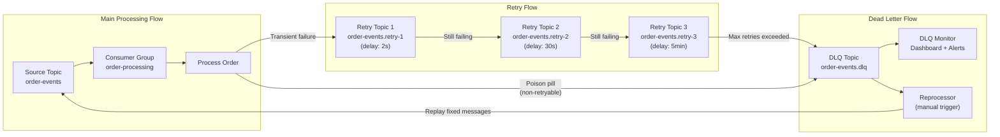
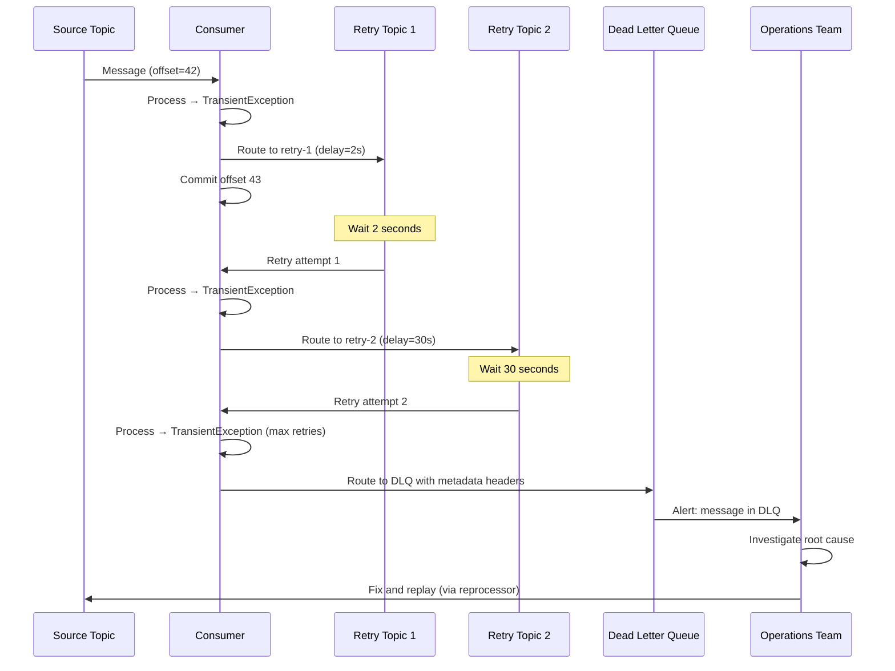
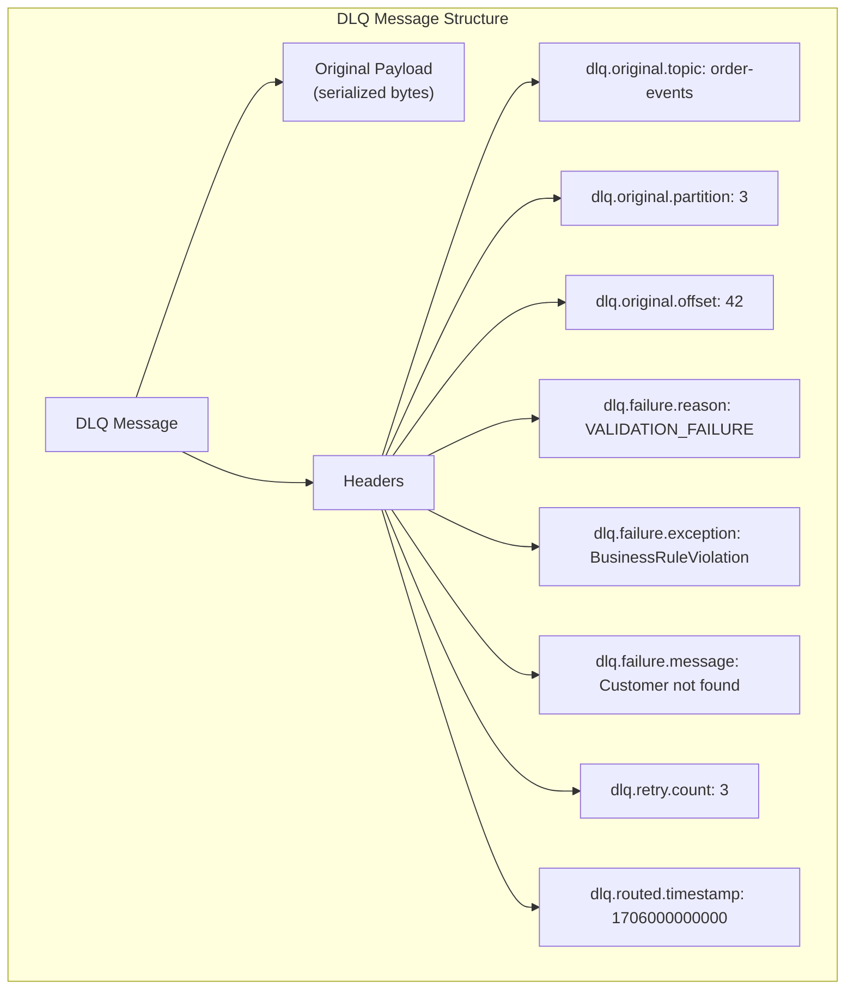

# Dead Letter Queues

## Quick Reference

- A **Dead Letter Queue (DLQ)** is a separate topic where messages that cannot be processed successfully are routed after exhausting retry attempts
- **Poison pill**: A message that consistently causes consumer failures (deserialization errors, schema violations, business logic exceptions) and blocks processing of subsequent messages on the same partition
- **Retry topic pattern**: Failed messages are sent to intermediate retry topics (e.g., `orders.retry-1`, `orders.retry-2`) with increasing delays before final routing to the DLQ
- DLQ topic naming convention: `{original-topic}.dlq` or `{original-topic}.dead-letter`
- Messages routed to DLQ should include metadata headers: original topic, partition, offset, failure reason, retry count, timestamp of first failure
- DLQ monitoring is critical: unprocessed DLQ messages represent data loss from the business perspective until manually resolved
- Spring Kafka provides built-in DLQ support via `DefaultErrorHandler` with `DeadLetterPublishingRecoverer`
- DLQ messages should be retained indefinitely (or with very long retention) since they require manual investigation and reprocessing

## When to Use

Implement a DLQ pattern when your consumer processes messages that can fail for reasons beyond transient infrastructure issues — specifically when certain messages are inherently unprocessable and retrying them indefinitely would block processing of valid messages behind them on the same partition.

Use DLQs for **deserialization failures** where the message payload does not conform to the expected schema (corrupted data, schema evolution incompatibility, encoding errors). These messages will never succeed regardless of retry count.

Use DLQs for **business logic validation failures** where the message content is syntactically valid but semantically invalid (referencing a non-existent entity, violating business rules, containing impossible values). These require human investigation to determine whether to fix and replay or discard.

Use DLQs for **external dependency failures that are message-specific** — for example, a message references a customer ID that does not exist in the database. Retrying will not help because the issue is with the message content, not the infrastructure.

Use **retry topics** (with exponential backoff) before routing to DLQ for **transient failures** that may resolve with time — database connection timeouts, rate limiting from external APIs, temporary network partitions. Only route to DLQ after exhausting a configurable number of retries.

Do NOT use DLQs as a substitute for proper error handling. If most messages are failing, the issue is likely systemic (misconfigured consumer, broken downstream service) and should be addressed at the root cause rather than routing everything to a DLQ.

## Code Examples

### Manual DLQ Implementation with Retry Logic

```java
public class OrderConsumerWithDLQ {

    private static final int MAX_RETRIES = 3;
    private static final String DLQ_TOPIC = "order-events.dlq";
    private static final String RETRY_TOPIC = "order-events.retry";

    private final KafkaConsumer<String, OrderEvent> consumer;
    private final KafkaProducer<String, byte[]> dlqProducer;
    private final Map<TopicPartition, Integer> retryCounters = new ConcurrentHashMap<>();

    public void processRecords() {
        while (running.get()) {
            ConsumerRecords<String, OrderEvent> records = consumer.poll(Duration.ofMillis(100));

            for (ConsumerRecord<String, OrderEvent> record : records) {
                try {
                    processOrder(record.value());
                    // Success — commit offset
                    consumer.commitSync(Map.of(
                        new TopicPartition(record.topic(), record.partition()),
                        new OffsetAndMetadata(record.offset() + 1)
                    ));
                } catch (DeserializationException e) {
                    // Poison pill — route directly to DLQ (no retry)
                    routeToDLQ(record, e, "DESERIALIZATION_FAILURE", 0);
                } catch (BusinessValidationException e) {
                    // Business logic failure — route to DLQ (no retry)
                    routeToDLQ(record, e, "VALIDATION_FAILURE", 0);
                } catch (TransientException e) {
                    // Transient failure — retry with backoff
                    int retryCount = getRetryCount(record);
                    if (retryCount >= MAX_RETRIES) {
                        routeToDLQ(record, e, "MAX_RETRIES_EXCEEDED", retryCount);
                    } else {
                        routeToRetryTopic(record, e, retryCount + 1);
                    }
                }
            }
        }
    }

    private void routeToDLQ(ConsumerRecord<String, OrderEvent> original,
                            Exception error, String reason, int retryCount) {
        ProducerRecord<String, byte[]> dlqRecord = new ProducerRecord<>(
            DLQ_TOPIC, original.key(), serialize(original.value()));

        // Add metadata headers for debugging and reprocessing
        dlqRecord.headers()
            .add("dlq.original.topic", original.topic().getBytes(UTF_8))
            .add("dlq.original.partition", intToBytes(original.partition()))
            .add("dlq.original.offset", longToBytes(original.offset()))
            .add("dlq.original.timestamp", longToBytes(original.timestamp()))
            .add("dlq.failure.reason", reason.getBytes(UTF_8))
            .add("dlq.failure.exception", error.getClass().getName().getBytes(UTF_8))
            .add("dlq.failure.message", error.getMessage().getBytes(UTF_8))
            .add("dlq.retry.count", intToBytes(retryCount))
            .add("dlq.routed.timestamp", longToBytes(System.currentTimeMillis()));

        // Preserve original headers
        original.headers().forEach(header ->
            dlqRecord.headers().add("original." + header.key(), header.value()));

        dlqProducer.send(dlqRecord, (metadata, exception) -> {
            if (exception != null) {
                log.error("Failed to send to DLQ! Message at {}:{} offset={} may be lost",
                    original.topic(), original.partition(), original.offset(), exception);
                metrics.counter("dlq.send.failure").increment();
            } else {
                log.warn("Routed to DLQ: topic={}, partition={}, offset={}, reason={}",
                    original.topic(), original.partition(), original.offset(), reason);
                metrics.counter("dlq.messages.routed", "reason", reason).increment();
            }
        });

        // Commit the original offset to move past the poison pill
        consumer.commitSync(Map.of(
            new TopicPartition(original.topic(), original.partition()),
            new OffsetAndMetadata(original.offset() + 1)
        ));
    }

    private void routeToRetryTopic(ConsumerRecord<String, OrderEvent> original,
                                    Exception error, int nextRetryCount) {
        // Calculate exponential backoff delay
        long delayMs = (long) Math.pow(2, nextRetryCount) * 1000; // 2s, 4s, 8s

        ProducerRecord<String, byte[]> retryRecord = new ProducerRecord<>(
            RETRY_TOPIC, original.key(), serialize(original.value()));

        retryRecord.headers()
            .add("retry.count", intToBytes(nextRetryCount))
            .add("retry.delay.ms", longToBytes(delayMs))
            .add("retry.scheduled.at", longToBytes(System.currentTimeMillis() + delayMs))
            .add("retry.original.topic", original.topic().getBytes(UTF_8))
            .add("retry.failure.reason", error.getMessage().getBytes(UTF_8));

        dlqProducer.send(retryRecord);
        consumer.commitSync(Map.of(
            new TopicPartition(original.topic(), original.partition()),
            new OffsetAndMetadata(original.offset() + 1)
        ));
    }
}
```

### Spring Kafka DLQ with Error Handler

```java
@Configuration
@EnableKafka
public class KafkaConsumerConfig {

    @Bean
    public ConcurrentKafkaListenerContainerFactory<String, OrderEvent> kafkaListenerContainerFactory(
            ConsumerFactory<String, OrderEvent> consumerFactory,
            KafkaTemplate<String, byte[]> dlqTemplate) {

        ConcurrentKafkaListenerContainerFactory<String, OrderEvent> factory =
            new ConcurrentKafkaListenerContainerFactory<>();
        factory.setConsumerFactory(consumerFactory);
        factory.setConcurrency(3);
        factory.getContainerProperties().setAckMode(AckMode.RECORD);

        // Configure error handler with retry + DLQ
        DefaultErrorHandler errorHandler = new DefaultErrorHandler(
            // Dead letter publishing recoverer
            new DeadLetterPublishingRecoverer(dlqTemplate,
                (record, exception) -> {
                    // Route to topic-specific DLQ
                    return new TopicPartition(record.topic() + ".dlq", record.partition());
                }),
            // Exponential backoff: 1s, 2s, 4s, then DLQ
            new ExponentialBackOff(1000L, 2.0)  // initialInterval, multiplier
        );

        // Configure which exceptions should NOT be retried (route directly to DLQ)
        errorHandler.addNotRetryableExceptions(
            DeserializationException.class,
            SchemaValidationException.class,
            BusinessRuleViolationException.class
        );

        // Configure which exceptions ARE retryable
        errorHandler.addRetryableExceptions(
            DatabaseTimeoutException.class,
            ExternalServiceUnavailableException.class
        );

        factory.setCommonErrorHandler(errorHandler);
        return factory;
    }

    @KafkaListener(topics = "order-events", groupId = "order-processing")
    public void processOrder(
            @Payload OrderEvent event,
            @Header(KafkaHeaders.RECEIVED_TOPIC) String topic,
            @Header(KafkaHeaders.RECEIVED_PARTITION) int partition,
            @Header(KafkaHeaders.OFFSET) long offset,
            Acknowledgment ack) {

        log.info("Processing order: topic={}, partition={}, offset={}", topic, partition, offset);

        // Business logic — exceptions trigger retry/DLQ behavior
        orderService.processOrder(event);

        ack.acknowledge();
    }
}

// DLQ consumer for monitoring and manual reprocessing
@KafkaListener(topics = "order-events.dlq", groupId = "dlq-monitor")
public void handleDLQMessage(
        @Payload byte[] payload,
        @Headers MessageHeaders headers,
        Acknowledgment ack) {

    String originalTopic = new String(headers.get("kafka_dlt-original-topic", byte[].class));
    String exception = new String(headers.get("kafka_dlt-exception-fqcn", byte[].class));
    String message = new String(headers.get("kafka_dlt-exception-message", byte[].class));

    log.error("DLQ message received: originalTopic={}, exception={}, message={}",
        originalTopic, exception, message);

    // Store in database for investigation dashboard
    dlqRepository.save(new DLQEntry(originalTopic, payload, exception, message, Instant.now()));

    // Alert operations team
    alertService.sendDLQAlert(originalTopic, exception);

    ack.acknowledge();
}
```

### DLQ Reprocessing Tool

```java
// CLI tool for reprocessing DLQ messages back to original topics
public class DLQReprocessor {

    private final KafkaConsumer<String, byte[]> dlqConsumer;
    private final KafkaProducer<String, byte[]> replayProducer;
    private final AdminClient adminClient;

    public ReprocessResult reprocess(ReprocessRequest request) {
        String dlqTopic = request.getOriginalTopic() + ".dlq";
        int messagesReprocessed = 0;
        int messagesSkipped = 0;

        // Assign specific partitions and seek to beginning (or specific offset)
        List<TopicPartition> partitions = getPartitions(dlqTopic);
        dlqConsumer.assign(partitions);

        if (request.getFromTimestamp() != null) {
            // Seek to specific timestamp for targeted reprocessing
            Map<TopicPartition, Long> timestamps = partitions.stream()
                .collect(Collectors.toMap(tp -> tp, tp -> request.getFromTimestamp()));
            Map<TopicPartition, OffsetAndTimestamp> offsets =
                dlqConsumer.offsetsForTimes(timestamps);
            offsets.forEach((tp, ot) -> {
                if (ot != null) dlqConsumer.seek(tp, ot.offset());
            });
        } else {
            dlqConsumer.seekToBeginning(partitions);
        }

        while (true) {
            ConsumerRecords<String, byte[]> records = dlqConsumer.poll(Duration.ofSeconds(5));
            if (records.isEmpty()) break;

            for (ConsumerRecord<String, byte[]> record : records) {
                // Apply filter if specified
                String failureReason = headerValue(record, "dlq.failure.reason");
                if (request.getReasonFilter() != null &&
                    !failureReason.matches(request.getReasonFilter())) {
                    messagesSkipped++;
                    continue;
                }

                // Replay to original topic
                String originalTopic = headerValue(record, "dlq.original.topic");
                ProducerRecord<String, byte[]> replayRecord =
                    new ProducerRecord<>(originalTopic, record.key(), record.value());

                // Add replay metadata
                replayRecord.headers()
                    .add("replay.source", "dlq-reprocessor".getBytes(UTF_8))
                    .add("replay.timestamp", longToBytes(System.currentTimeMillis()))
                    .add("replay.original.dlq.offset", longToBytes(record.offset()));

                replayProducer.send(replayRecord).get(); // Synchronous for ordering
                messagesReprocessed++;
            }
        }

        return new ReprocessResult(messagesReprocessed, messagesSkipped);
    }
}
```

## Architecture / Diagrams







## Common Pitfalls

- **DLQ as a black hole**: Routing messages to a DLQ without monitoring, alerting, or a reprocessing strategy means those messages are effectively lost. Every DLQ must have: (1) a consumer that records messages to a queryable store (database, Elasticsearch), (2) alerts when DLQ message rate exceeds threshold, (3) a documented reprocessing procedure, and (4) retention set to indefinite or very long (90+ days). Treat DLQ messages as incidents requiring investigation.

- **Blocking the partition on poison pills**: Without DLQ routing, a single malformed message causes the consumer to crash and restart repeatedly, blocking all subsequent messages on that partition. The consumer enters an infinite crash loop: start → read poison pill → crash → restart → read same poison pill. Always implement a maximum retry count with DLQ routing to move past unprocessable messages.

- **Losing message ordering with retry topics**: When a message is routed to a retry topic, subsequent messages on the same partition continue processing. If ordering matters (e.g., events for the same entity must be processed in order), routing one message to retry while processing the next can cause out-of-order processing. Solutions: (1) pause the partition until the retry succeeds or routes to DLQ, (2) use per-key retry queues, or (3) accept eventual consistency and handle out-of-order at the application level.

- **Retry storms overwhelming downstream services**: If a downstream service is temporarily unavailable and all messages fail simultaneously, routing them all to retry topics creates a thundering herd when the retry delay expires. Implement jitter in retry delays (`delay * (1 + random(0, 0.3))`) and circuit breaker patterns that pause consumption entirely when failure rate exceeds a threshold, rather than routing every message through the retry pipeline.

- **Not preserving original message context in DLQ**: DLQ messages without metadata about their origin (original topic, partition, offset, failure reason, timestamp) are nearly impossible to investigate. Always attach headers with full provenance information. Include the exception stack trace (truncated to fit header size limits) and the retry count so operators can distinguish between messages that failed immediately vs. after multiple retries.

- **DLQ topic with wrong partition count**: If the DLQ topic has fewer partitions than the source topic, messages from different source partitions may end up on the same DLQ partition, making it harder to correlate failures with specific source partitions. Create DLQ topics with the same partition count as the source topic and route messages to the same partition number for easier debugging.

## Real-World Use Cases

- **E-commerce order processing with tiered retries**: An order processing system uses a 3-tier retry strategy: Tier 1 (2-second delay) handles transient database connection failures, Tier 2 (30-second delay) handles external payment gateway timeouts, Tier 3 (5-minute delay) handles inventory service unavailability. Messages that fail all three tiers are routed to the DLQ. The operations team reviews DLQ messages daily, fixes root causes (missing customer records, invalid product IDs), and replays corrected messages. This approach processes 99.97% of messages automatically, with only 0.03% requiring manual intervention.

- **Schema evolution with DLQ safety net**: A microservices platform uses Avro schemas with a schema registry. When a producer deploys a new schema version that is not backward-compatible, consumers using the old schema fail to deserialize new messages. These messages are routed to the DLQ with `DESERIALIZATION_FAILURE` reason. The consumer team is alerted, updates their schema, and replays the DLQ messages. Without the DLQ, these messages would block the entire partition until the consumer is updated.

- **Financial reconciliation with DLQ audit trail**: A banking system routes failed transaction messages to a DLQ that feeds into a compliance database. Each DLQ entry is treated as a reconciliation exception requiring investigation. The compliance team uses a custom dashboard to view DLQ messages, annotate them with investigation notes, and either approve reprocessing or mark as intentionally discarded (with audit trail). Regulatory requirements mandate that no DLQ message can be deleted without documented justification.

- **IoT sensor data with noise filtering**: An IoT platform processes millions of sensor readings per minute. Approximately 0.1% of readings contain invalid values (sensor malfunction, transmission corruption). These are routed to a DLQ for analysis by the data quality team, who use the patterns to identify failing sensors and schedule maintenance. The DLQ serves dual purposes: preventing bad data from entering the analytics pipeline and providing a signal for predictive maintenance.

## Interview Questions

**Q: How would you design a DLQ system that preserves message ordering for the same key?**

A: The challenge is that routing a message to a retry/DLQ topic while continuing to process subsequent messages breaks per-key ordering. Design options: (1) **Partition-level pause**: When a message fails, pause the partition and retry in-place with backoff. Only route to DLQ after max retries, then resume the partition. This preserves strict ordering but reduces throughput during failures. (2) **Per-key retry buffer**: Maintain an in-memory buffer per key. When a message for key K fails, buffer all subsequent messages for key K while retrying. Process other keys normally. Route to DLQ after max retries and flush the buffer. (3) **Sequence number validation**: Accept out-of-order processing but validate sequence numbers at the consumer. If a message arrives out of order, buffer it until the predecessor is processed or confirmed in DLQ. Choose based on ordering requirements: option 1 for strict ordering, option 3 for eventual consistency.

**Q: What metrics would you monitor for a DLQ-based system, and what do they indicate?**

A: Key metrics: (1) **DLQ ingestion rate** (messages/sec entering DLQ) — sudden spikes indicate systemic issues (downstream service failure, schema incompatibility). (2) **DLQ depth** (total unconsumed messages) — growing depth means messages are not being investigated/reprocessed fast enough. (3) **DLQ message age** (time since oldest unprocessed DLQ message) — SLA for investigation response time. (4) **Retry success rate** (% of retried messages that eventually succeed) — low rate suggests retry is ineffective and messages should route to DLQ faster. (5) **DLQ by failure reason** (breakdown by error type) — identifies the most common failure modes for prioritization. (6) **Reprocessing success rate** (% of replayed DLQ messages that succeed) — validates that root causes are being properly fixed before replay. Alert on: DLQ rate > 1% of source topic throughput, DLQ depth growing for > 1 hour, any message older than SLA threshold.

**Q: How do you handle the scenario where the DLQ producer itself fails?**

A: This is the "DLQ of the DLQ" problem. If the DLQ producer fails, you risk losing the failed message entirely (it is already committed from the source topic but not yet in the DLQ). Strategies: (1) **Synchronous DLQ send with retry**: Send to DLQ synchronously and only commit the source offset after DLQ send succeeds. If DLQ send fails, do not commit — the message will be reprocessed on next poll. (2) **Local persistence fallback**: If DLQ send fails, write the message to a local file or embedded database. A background thread retries DLQ sends from the local store. (3) **Pause and alert**: If DLQ send fails, pause the partition and alert operations. Do not commit the offset. This prevents message loss at the cost of processing delay. (4) **Transactional DLQ**: Use Kafka transactions to atomically commit the source offset and produce to the DLQ topic. If either fails, the transaction aborts and the message is retried. Option 4 is the most robust but adds transactional overhead.

**Q: Compare DLQ patterns in Kafka vs. traditional message brokers like RabbitMQ.**

A: In RabbitMQ, DLQ is a first-class feature: messages are automatically routed to a configured dead-letter exchange after max delivery attempts or TTL expiry. The broker handles retry counting and routing transparently. In Kafka, DLQ is an application-level pattern — there is no built-in DLQ mechanism. The consumer application must implement retry counting, DLQ routing, and offset management. Key differences: (1) RabbitMQ DLQ is per-queue and automatic; Kafka DLQ is per-topic and manual. (2) RabbitMQ preserves message ordering within the DLQ; Kafka DLQ ordering depends on implementation. (3) Kafka's approach is more flexible (custom retry strategies, multiple retry tiers, conditional routing) but requires more application code. (4) RabbitMQ's `x-death` header automatically tracks retry history; in Kafka, you must add custom headers. Frameworks like Spring Kafka bridge this gap by providing RabbitMQ-like DLQ semantics on top of Kafka.

## Production Tips

- **DLQ retention and compaction strategy**: Set DLQ topic retention to at least 90 days (or indefinite with `retention.ms=-1`). DLQ messages represent unresolved issues that may take days or weeks to investigate. Use `cleanup.policy=delete` (not compact) because you want to preserve every failed message instance, not just the latest per key. Monitor DLQ disk usage and set alerts when it exceeds expected bounds — rapid DLQ growth indicates a systemic issue that should be fixed at the source.

- **Automated DLQ reprocessing with circuit breaker**: Build an automated reprocessor that periodically attempts to replay DLQ messages back to the source topic. Implement a circuit breaker: if the reprocessed messages fail again at a rate > 50%, stop reprocessing and alert. This handles the common case where DLQ messages accumulated due to a temporary downstream issue that has since been resolved. For messages that fail reprocessing, increment a `replay.attempt.count` header and route back to DLQ with updated metadata.

- **DLQ dashboard essentials**: Build a dashboard showing: (1) DLQ message count by source topic (bar chart), (2) DLQ ingestion rate over time (line chart — spikes indicate incidents), (3) failure reason distribution (pie chart — identifies top issues), (4) message age histogram (how long messages have been in DLQ), (5) reprocessing history (success/failure of replay attempts). Provide a UI for operators to inspect individual DLQ messages, view their headers and payload, and trigger selective reprocessing.

## Related Topics

- [Apache Kafka](./apache-kafka.md) — Comprehensive Kafka overview including consumer error handling fundamentals
- [Exactly-Once Semantics](./exactly-once-semantics.md) — How transactional guarantees interact with DLQ routing
- [Messaging Patterns and Architecture](./messaging-patterns.md) — Higher-level patterns including error handling in event-driven architectures
