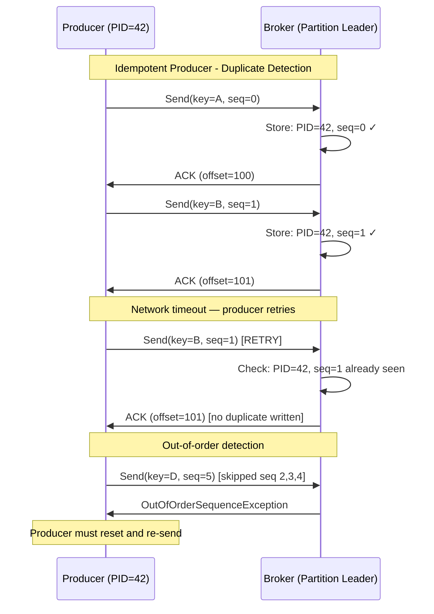
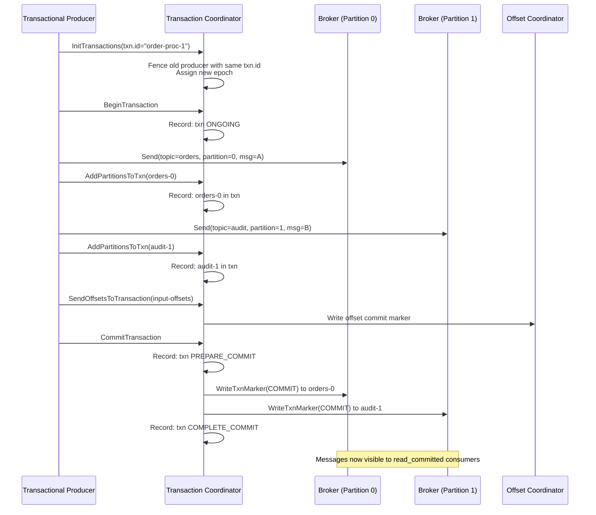
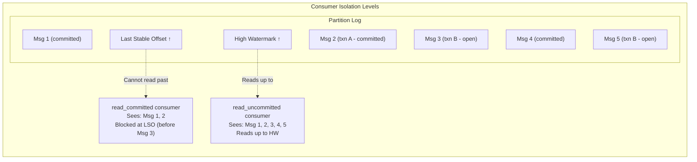

# Exactly-Once Semantics

## Quick Reference

- **Exactly-once semantics (EOS)** guarantees that each message is processed and its effects applied exactly once, even in the presence of producer retries, consumer failures, and broker crashes
- **Idempotent producer** (`enable.idempotence=true`): Eliminates duplicates within a single partition by assigning a producer ID (PID) and sequence number to each message; brokers detect and discard duplicates
- **Transactional API**: Enables atomic writes across multiple partitions and topics; either all messages in a transaction are committed or none are visible to consumers
- **`read_committed` isolation**: Consumers with `isolation.level=read_committed` only see messages from committed transactions; uncommitted or aborted transaction messages are filtered out
- EOS requires: `acks=all`, `enable.idempotence=true`, `transactional.id` (for transactions), and `max.in.flight.requests.per.connection <= 5`
- Transaction coordinator (broker) manages transaction state via the `__transaction_state` internal topic
- Performance overhead: ~3-5% throughput reduction for idempotent producers, ~10-20% for full transactions due to two-phase commit protocol
- Kafka Streams provides EOS out-of-the-box with `processing.guarantee=exactly_once_v2` (Kafka 3.0+)

## When to Use

Use **idempotent producers** as a baseline for all production deployments. The overhead is minimal (~3% throughput reduction) and it eliminates the most common source of duplicates: producer retries after network timeouts where the broker actually received and persisted the message. There is no reason to disable idempotence in modern Kafka deployments.

Use the **transactional API** when you need atomic writes across multiple topics or partitions, or when you need to atomically commit consumer offsets alongside produced messages (the consume-transform-produce pattern). Common scenarios include: event enrichment pipelines that read from one topic and write to multiple output topics, saga orchestrators that must atomically publish events to multiple aggregate topics, and exactly-once stream processing where consumer offset commits must be atomic with output writes.

Use **`read_committed` isolation** on consumers that must never see partial transaction results. This is essential for consumers downstream of transactional producers — without it, they would see uncommitted messages that may later be aborted. Note that `read_committed` consumers experience slightly higher end-to-end latency because they cannot read past the last stable offset (LSO), which lags behind the high watermark during open transactions.

Use **Kafka Streams EOS** (`exactly_once_v2`) when building stream processing applications that need end-to-end exactly-once guarantees without manually managing transactions. This is the simplest path to EOS for consume-transform-produce workloads.

Do NOT use transactions for simple produce-only workloads where idempotent producers suffice. The transactional overhead (coordinator round-trips, two-phase commit) is unnecessary when you only need per-partition deduplication.

## Code Examples

### Idempotent Producer Configuration

```java
// Idempotent producer: eliminates duplicates from retries within a partition
Properties props = new Properties();
props.put(ProducerConfig.BOOTSTRAP_SERVERS_CONFIG, "broker1:9092,broker2:9092,broker3:9092");
props.put(ProducerConfig.KEY_SERIALIZER_CLASS_CONFIG, StringSerializer.class.getName());
props.put(ProducerConfig.VALUE_SERIALIZER_CLASS_CONFIG, JsonSerializer.class.getName());

// Idempotence configuration
props.put(ProducerConfig.ENABLE_IDEMPOTENCE_CONFIG, true);  // Required for EOS
props.put(ProducerConfig.ACKS_CONFIG, "all");                // Required: all ISR must acknowledge
props.put(ProducerConfig.RETRIES_CONFIG, Integer.MAX_VALUE); // Retry indefinitely
props.put(ProducerConfig.MAX_IN_FLIGHT_REQUESTS_PER_CONNECTION, 5); // Max 5 with idempotence

// Performance tuning (compatible with idempotence)
props.put(ProducerConfig.BATCH_SIZE_CONFIG, 65536);          // 64KB batches
props.put(ProducerConfig.LINGER_MS_CONFIG, 10);              // 10ms linger for batching
props.put(ProducerConfig.COMPRESSION_TYPE_CONFIG, "lz4");    // Batch compression

KafkaProducer<String, OrderEvent> producer = new KafkaProducer<>(props);

// Under the hood:
// 1. Producer gets a unique PID (Producer ID) from the broker on first send
// 2. Each message gets a monotonically increasing sequence number per partition
// 3. Broker tracks (PID, partition, sequence) and rejects duplicates
// 4. If a retry arrives with a sequence number already seen, broker returns success
//    without writing the duplicate to the log

// Usage is identical to non-idempotent producer — transparency is the key benefit
Future<RecordMetadata> future = producer.send(
    new ProducerRecord<>("orders", order.getId(), orderEvent),
    (metadata, exception) -> {
        if (exception != null) {
            // Even with retries, this callback fires only once per logical send
            handleSendFailure(order, exception);
        }
    }
);
```

### Transactional Produce with Consumer Offset Commit

```java
// Transactional producer: atomic writes across topics + offset commits
Properties producerProps = new Properties();
producerProps.put(ProducerConfig.BOOTSTRAP_SERVERS_CONFIG, "broker1:9092,broker2:9092,broker3:9092");
producerProps.put(ProducerConfig.KEY_SERIALIZER_CLASS_CONFIG, StringSerializer.class.getName());
producerProps.put(ProducerConfig.VALUE_SERIALIZER_CLASS_CONFIG, JsonSerializer.class.getName());
producerProps.put(ProducerConfig.ENABLE_IDEMPOTENCE_CONFIG, true);

// Transactional ID: must be unique per producer instance and stable across restarts
// Used for fencing zombie producers (old instances with same transactional.id)
producerProps.put(ProducerConfig.TRANSACTIONAL_ID_CONFIG, "order-enrichment-" + instanceId);

KafkaProducer<String, Object> producer = new KafkaProducer<>(producerProps);

// Initialize transactions (registers with transaction coordinator, fences zombies)
producer.initTransactions();

// Consumer configured for read_committed
Properties consumerProps = new Properties();
consumerProps.put(ConsumerConfig.BOOTSTRAP_SERVERS_CONFIG, "broker1:9092,broker2:9092,broker3:9092");
consumerProps.put(ConsumerConfig.GROUP_ID_CONFIG, "order-enrichment-group");
consumerProps.put(ConsumerConfig.ISOLATION_LEVEL_CONFIG, "read_committed");
consumerProps.put(ConsumerConfig.ENABLE_AUTO_COMMIT_CONFIG, false); // Manual commit via transaction

KafkaConsumer<String, OrderEvent> consumer = new KafkaConsumer<>(consumerProps);
consumer.subscribe(List.of("raw-orders"));

while (running.get()) {
    ConsumerRecords<String, OrderEvent> records = consumer.poll(Duration.ofMillis(100));
    if (records.isEmpty()) continue;

    try {
        producer.beginTransaction();

        for (ConsumerRecord<String, OrderEvent> record : records) {
            // Transform: enrich order with customer data
            EnrichedOrder enriched = enrichOrder(record.value());

            // Produce to multiple output topics atomically
            producer.send(new ProducerRecord<>("enriched-orders", record.key(), enriched));
            producer.send(new ProducerRecord<>("order-audit", record.key(),
                new AuditEvent("enriched", record.key(), Instant.now())));

            // If order value > threshold, also produce to high-value topic
            if (enriched.getTotalValue() > HIGH_VALUE_THRESHOLD) {
                producer.send(new ProducerRecord<>("high-value-orders", record.key(), enriched));
            }
        }

        // Atomically commit consumer offsets as part of the transaction
        // This ensures exactly-once: offsets and output messages commit together
        Map<TopicPartition, OffsetAndMetadata> offsets = computeOffsets(records);
        producer.sendOffsetsToTransaction(offsets, consumer.groupMetadata());

        // Commit transaction: all messages + offsets become visible atomically
        producer.commitTransaction();

    } catch (ProducerFencedException | InvalidProducerEpochException e) {
        // Another producer with same transactional.id has been initialized (zombie fencing)
        log.error("Producer fenced — shutting down", e);
        producer.close();
        throw e;
    } catch (KafkaException e) {
        // Abort transaction: all messages in this transaction are discarded
        producer.abortTransaction();
        log.warn("Transaction aborted, will retry on next poll", e);
        // Consumer will re-read the same records on next poll (offsets not committed)
    }
}
```

### Kafka Streams Exactly-Once Configuration

```java
// Kafka Streams with exactly-once processing guarantee
Properties streamsProps = new Properties();
streamsProps.put(StreamsConfig.APPLICATION_ID_CONFIG, "order-analytics");
streamsProps.put(StreamsConfig.BOOTSTRAP_SERVERS_CONFIG, "broker1:9092,broker2:9092,broker3:9092");

// Exactly-once v2 (Kafka 3.0+): uses a single transaction per task
// More efficient than v1 which used a transaction per partition
streamsProps.put(StreamsConfig.PROCESSING_GUARANTEE_CONFIG, StreamsConfig.EXACTLY_ONCE_V2);

// EOS-compatible settings (automatically configured by Streams, shown for clarity)
streamsProps.put(StreamsConfig.COMMIT_INTERVAL_MS_CONFIG, 100); // Frequent commits for low latency
streamsProps.put(StreamsConfig.producerPrefix(ProducerConfig.ACKS_CONFIG), "all");
streamsProps.put(StreamsConfig.producerPrefix(ProducerConfig.ENABLE_IDEMPOTENCE_CONFIG), true);

StreamsBuilder builder = new StreamsBuilder();

// Consume-transform-produce with exactly-once guarantee
KStream<String, OrderEvent> orders = builder.stream("raw-orders");

// Stateful aggregation: revenue per customer (state store backed by changelog topic)
KTable<String, CustomerRevenue> customerRevenue = orders
    .groupBy((key, order) -> order.getCustomerId())
    .aggregate(
        CustomerRevenue::new,
        (customerId, order, revenue) -> revenue.addOrder(order),
        Materialized.<String, CustomerRevenue, KeyValueStore<Bytes, byte[]>>as("customer-revenue")
            .withKeySerde(Serdes.String())
            .withValueSerde(customerRevenueSerde)
    );

// Output enriched stream
customerRevenue.toStream()
    .filter((customerId, revenue) -> revenue.getTotalOrders() > 10)
    .to("vip-customers", Produced.with(Serdes.String(), customerRevenueSerde));

// With exactly_once_v2:
// - Input offset commit, state store update, and output writes are atomic
// - If a task fails mid-processing, the transaction is aborted
// - On recovery, the task resumes from the last committed offset
// - State store is restored from changelog (also transactional)
// - No duplicates in output topics, no double-counting in aggregations

KafkaStreams streams = new KafkaStreams(builder.build(), streamsProps);
streams.start();
```

## Architecture / Diagrams







## Common Pitfalls

- **Transactional ID reuse across unrelated producers**: Each transactional producer must have a unique, stable `transactional.id`. If two active producers share the same ID, one will be fenced with `ProducerFencedException`. The ID should encode the application instance identity (e.g., `"order-enrichment-" + partitionId`). For Kafka Streams, the framework manages transactional IDs automatically based on task assignment.

- **Forgetting `read_committed` on downstream consumers**: Transactional producers guarantee atomic writes, but consumers with the default `read_uncommitted` isolation will see uncommitted messages from in-progress or aborted transactions. Every consumer downstream of a transactional producer must set `isolation.level=read_committed` to maintain the exactly-once guarantee end-to-end.

- **Transaction timeout causing aborts**: The default `transaction.timeout.ms` is 60 seconds. If your consume-transform-produce loop takes longer than this (large batches, slow external calls), the transaction coordinator aborts the transaction. Either reduce batch sizes, increase the timeout (max is broker's `transaction.max.timeout.ms`, default 15 minutes), or process records in smaller sub-batches within the transaction.

- **LSO lag with long-running transactions**: Open transactions block `read_committed` consumers at the Last Stable Offset (LSO). A single long-running or stuck transaction can cause all `read_committed` consumers on that partition to fall behind, even for messages from other committed transactions. Monitor `records-lag` for `read_committed` consumers and set aggressive transaction timeouts to prevent stuck transactions from blocking consumption.

- **Zombie producer fencing gaps**: When a producer crashes and restarts with the same `transactional.id`, the new instance fences the old one. However, there is a brief window where the old producer's in-flight requests may still be processed by brokers before the fence takes effect. The broker's epoch-based fencing ensures these late-arriving writes are rejected, but applications should handle `ProducerFencedException` gracefully by shutting down the fenced instance immediately.

- **EOS performance impact underestimated**: Full transactional EOS adds latency from: (1) `InitTransactions` call on startup (one-time), (2) `AddPartitionsToTxn` RPC for each new partition in the transaction, (3) two-phase commit protocol on `commitTransaction()`, (4) transaction markers written to each partition. For high-throughput workloads, batch multiple records into a single transaction to amortize the per-transaction overhead.

## Real-World Use Cases

- **Financial transaction processing**: A payment platform uses transactional producers to atomically write payment events to both the `payments` topic and the `ledger-entries` topic. If either write fails, the entire transaction is aborted, preventing inconsistencies between the payment record and the accounting ledger. Downstream reconciliation consumers use `read_committed` isolation to ensure they never process partial payment records that were later aborted.

- **Event sourcing with projections**: An e-commerce platform uses Kafka transactions to atomically write domain events and update materialized view topics. When an order is placed, the transaction atomically writes `OrderCreated` to the event store topic and updates the `order-summary` compacted topic. Projection consumers reading from `order-summary` with `read_committed` isolation always see a consistent view of order state, never partial updates from aborted transactions.

- **Exactly-once stream processing pipeline**: A real-time fraud detection system uses Kafka Streams with `exactly_once_v2` to process transaction events, maintain windowed aggregation state (spending patterns per card), and produce alerts to a downstream topic. The EOS guarantee ensures that each transaction is counted exactly once in the aggregation, preventing both missed fraud alerts (under-counting) and false positives (double-counting from duplicates).

- **CDC pipeline with guaranteed delivery**: A change data capture pipeline reads database changes via Debezium, processes them through a Kafka Streams application that applies schema transformations, and writes to multiple downstream topics (search index updates, cache invalidation events, analytics events). Transactional EOS ensures that each database change is reflected exactly once in all downstream systems, even when the Streams application crashes and recovers.

## Interview Questions

**Q: Explain the difference between idempotent producers and transactional producers. When do you need each?**

A: Idempotent producers eliminate duplicates within a single partition by tracking (PID, sequence number) pairs. The broker detects retried messages with already-seen sequence numbers and discards them. This handles the most common duplicate scenario (network timeout on ACK, producer retries) with minimal overhead (~3%). Transactional producers extend this to provide atomicity across multiple partitions and topics — either all messages in a transaction are committed or none are visible. You need transactions when: (1) writing to multiple topics/partitions atomically, (2) committing consumer offsets atomically with produced messages (consume-transform-produce), or (3) ensuring downstream consumers never see partial results. Use idempotent-only for simple produce workloads; use transactions for consume-transform-produce patterns and multi-topic atomic writes.

**Q: How does Kafka's transaction protocol handle zombie producers?**

A: When a producer calls `initTransactions()` with a `transactional.id`, the transaction coordinator assigns it an epoch number (monotonically increasing). If a previous producer instance with the same `transactional.id` exists (zombie from a crash), the coordinator increments the epoch and fences the old producer. Any subsequent requests from the old producer (with the lower epoch) are rejected with `ProducerFencedException`. This prevents split-brain scenarios where two producers with the same transactional identity could both commit transactions. The fencing is epoch-based: brokers check the epoch on every write request and reject writes from stale epochs. The zombie's in-flight transaction is aborted, and its uncommitted messages are marked as aborted in the log.

**Q: What is the Last Stable Offset (LSO) and how does it affect `read_committed` consumers?**

A: The LSO is the offset of the first message that belongs to an open (uncommitted) transaction. `read_committed` consumers cannot read past the LSO — they are blocked until the transaction is either committed or aborted. This means a single long-running transaction can block all `read_committed` consumers on that partition, even for messages from other already-committed transactions that have higher offsets. The LSO advances when the oldest open transaction completes. This is why transaction timeouts are critical: a stuck transaction with a low LSO creates a consumption bottleneck. Monitor the gap between the high watermark and LSO (`records-lag` metric for `read_committed` consumers) to detect this issue.

**Q: What are the performance implications of exactly-once semantics, and how do you minimize the overhead?**

A: EOS overhead comes from: (1) Idempotence: ~3% throughput reduction from sequence number tracking and broker-side dedup checks — negligible. (2) Transactions: 10-20% throughput reduction from coordinator RPCs (`AddPartitionsToTxn`, `EndTxn`), two-phase commit protocol, and transaction markers written to each partition. Minimize overhead by: batching many records into a single transaction (amortize per-transaction cost), using `exactly_once_v2` in Kafka Streams (one transaction per commit interval across all tasks, vs. v1's one transaction per task per commit), keeping transactions short to avoid LSO lag, and tuning `commit.interval.ms` in Streams to balance latency vs. transaction frequency. For produce-only workloads, idempotent producers without transactions provide most of the benefit with minimal cost.

## Production Tips

- **Transaction timeout monitoring**: Set up alerts on the `transaction-coordinator` metrics: `txn-abort-rate` (high abort rate indicates timeout or application issues), `active-txn-count` (growing count indicates stuck transactions), and consumer-side `records-lag` for `read_committed` consumers (growing lag indicates LSO blocked by open transactions). A healthy system should have near-zero active transactions at any point in time.

- **Transactional ID naming strategy**: Use a deterministic naming scheme that encodes the application, instance, and optionally the input partition: `"{app}-{instance}-{partition}"`. For Kafka Streams, the framework handles this automatically. For custom consume-transform-produce loops, tie the transactional ID to the input partition assignment so that when partitions move during rebalance, the new consumer fences the old one's transactions for those specific partitions.

- **Benchmarking EOS overhead**: Before enabling transactions in production, benchmark with and without EOS on representative workloads. Measure: end-to-end latency (p99), throughput (messages/sec), and broker CPU/disk utilization. If the overhead is unacceptable, consider whether idempotent producers + application-level deduplication (using a dedup store keyed by message ID) can achieve "effectively once" semantics at lower cost.

## Related Topics

- [Apache Kafka](./apache-kafka.md) — Comprehensive Kafka overview including producer and consumer fundamentals
- [ISR Mechanics](./isr-mechanics.md) — How `acks=all` and ISR interact with exactly-once durability guarantees
- [Dead Letter Queues](./dead-letter-queues.md) — Handling messages that fail processing in exactly-once pipelines
