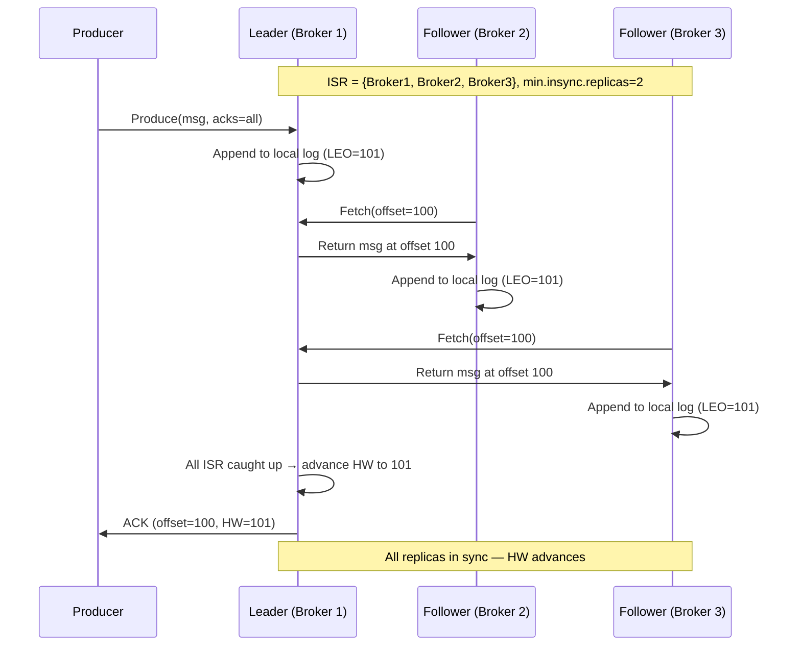
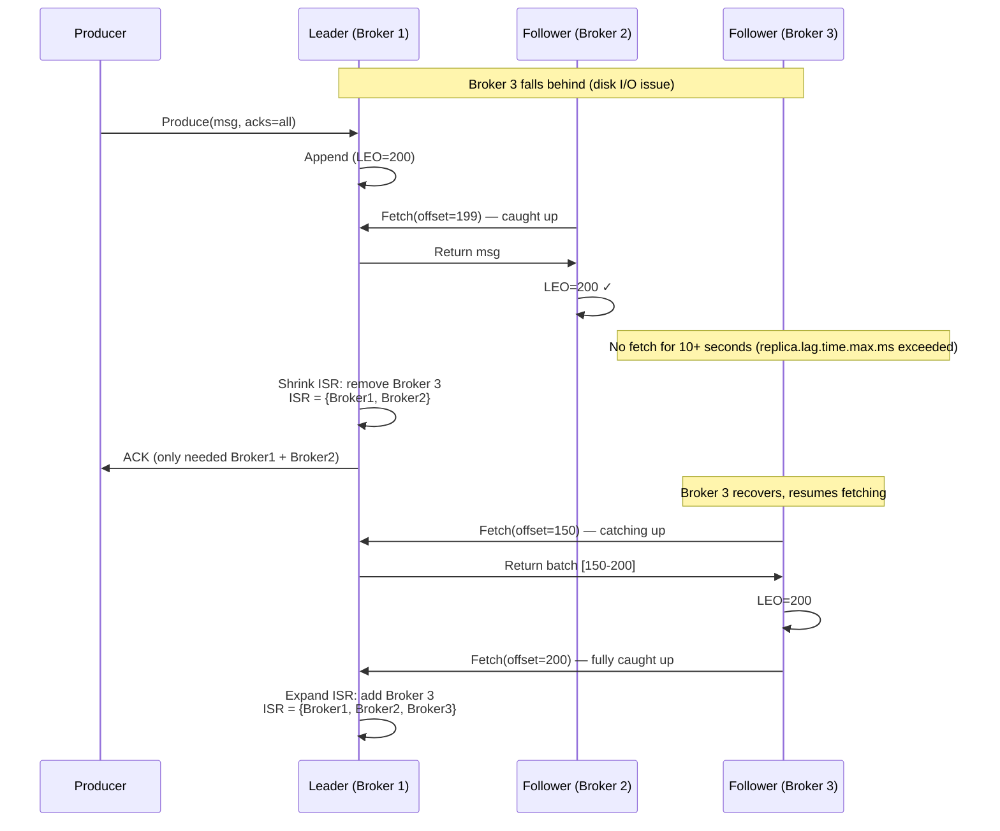
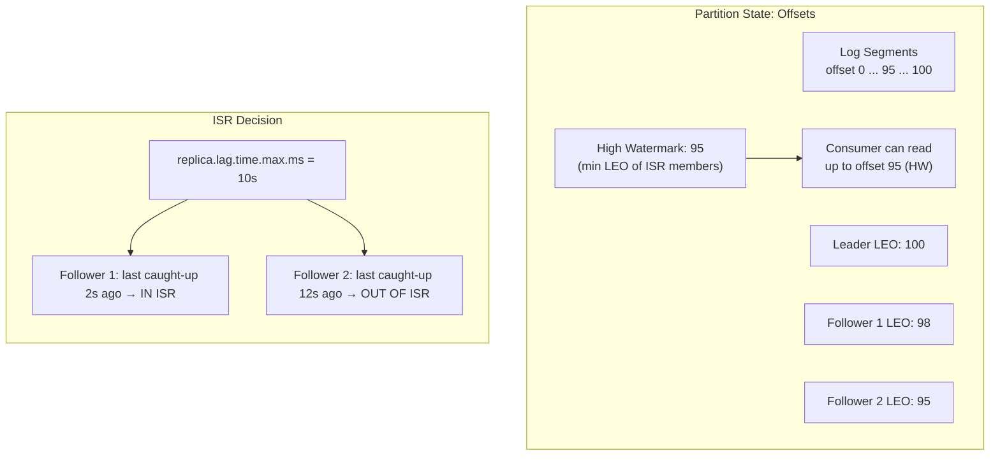
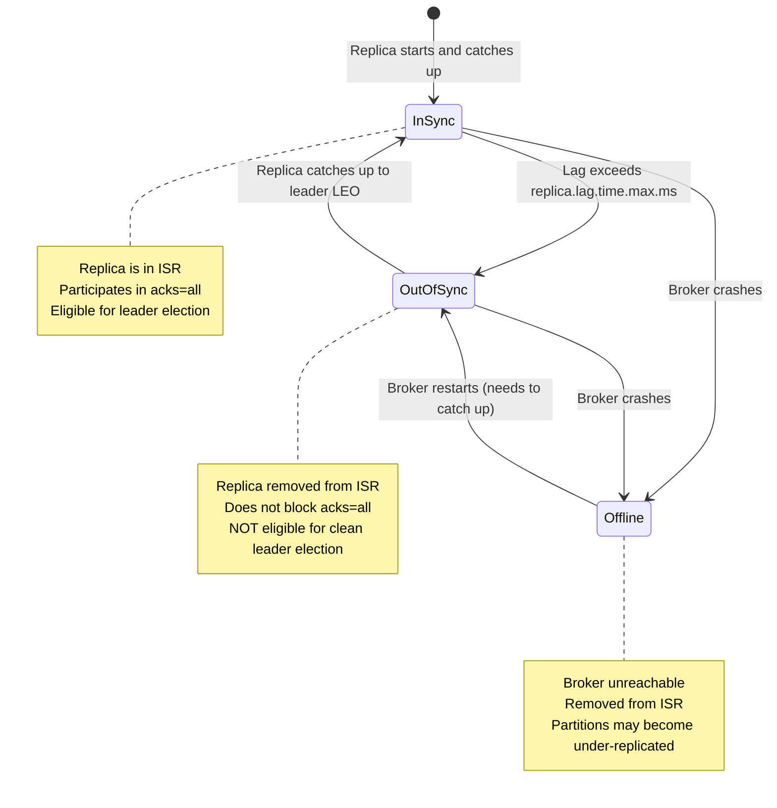

# ISR Mechanics

## Quick Reference

- **ISR (In-Sync Replicas)** is the set of replicas that are fully caught up with the partition leader within the configured lag threshold
- A replica falls out of ISR when it lags behind the leader by more than `replica.lag.time.max.ms` (default 10 seconds) — measured by time since last fetch request that caught up to the leader's log end offset
- **High Watermark (HW)**: The offset up to which all ISR replicas have replicated; consumers can only read up to the HW
- **Log End Offset (LEO)**: The offset of the last message written to a replica's log (leader LEO >= follower LEO >= HW)
- `min.insync.replicas` (topic/broker config): Minimum ISR size required for a producer with `acks=all` to succeed; if ISR drops below this, writes are rejected with `NotEnoughReplicasException`
- **Unclean leader election** (`unclean.leader.election.enable`): When disabled (default since Kafka 0.11), a partition becomes unavailable if all ISR replicas are down; when enabled, an out-of-sync replica can become leader, risking data loss
- ISR changes are persisted in ZooKeeper (pre-KRaft) or the `__cluster_metadata` topic (KRaft mode) and propagated to all brokers
- The controller (or KRaft quorum leader) manages ISR shrink/expand operations and leader election

## When to Use

Understanding ISR mechanics is essential when configuring Kafka for the correct balance between **durability**, **availability**, and **latency** for your specific workload.

Configure **`min.insync.replicas=2`** with **`acks=all`** and **replication factor 3** for production workloads where data loss is unacceptable (financial transactions, audit logs, event sourcing). This ensures at least 2 replicas acknowledge every write, tolerating 1 broker failure without data loss or unavailability.

Configure **`min.insync.replicas=1`** with **`acks=all`** for workloads where you want durability guarantees but can tolerate brief unavailability during multi-broker failures. This is the minimum configuration for preventing data loss — a single replica acknowledgment means the data exists on at least the leader.

Enable **unclean leader election** only for topics where availability is more important than data consistency (metrics, logs, non-critical telemetry). Never enable it for topics carrying financial data, user state, or event-sourced aggregates where losing even a single message creates irrecoverable inconsistency.

Monitor ISR shrinkage as a leading indicator of broker health issues. Frequent ISR shrink/expand cycles indicate disk I/O bottlenecks, network congestion, or GC pauses on follower brokers that need investigation before they escalate to data loss scenarios.

## Code Examples

### Producer Configuration for Durability

```java
// Producer configured for maximum durability with ISR awareness
Properties props = new Properties();
props.put(ProducerConfig.BOOTSTRAP_SERVERS_CONFIG, "broker1:9092,broker2:9092,broker3:9092");
props.put(ProducerConfig.KEY_SERIALIZER_CLASS_CONFIG, StringSerializer.class.getName());
props.put(ProducerConfig.VALUE_SERIALIZER_CLASS_CONFIG, JsonSerializer.class.getName());

// Durability settings — interact directly with ISR mechanics
props.put(ProducerConfig.ACKS_CONFIG, "all");
// "all" means: wait for ALL replicas in the current ISR to acknowledge
// If ISR = {broker1, broker2, broker3}, all three must acknowledge
// If ISR shrinks to {broker1, broker2}, only two need to acknowledge
// Combined with min.insync.replicas on the topic/broker, this provides the durability guarantee

props.put(ProducerConfig.ENABLE_IDEMPOTENCE_CONFIG, true);
props.put(ProducerConfig.RETRIES_CONFIG, Integer.MAX_VALUE);
props.put(ProducerConfig.MAX_IN_FLIGHT_REQUESTS_PER_CONNECTION, 5);

// Timeout for waiting for ISR acknowledgment
props.put(ProducerConfig.REQUEST_TIMEOUT_MS_CONFIG, 30000);  // 30s
props.put(ProducerConfig.DELIVERY_TIMEOUT_MS_CONFIG, 120000); // 2min total delivery timeout

KafkaProducer<String, PaymentEvent> producer = new KafkaProducer<>(props);

// Handle NotEnoughReplicasException (ISR < min.insync.replicas)
producer.send(record, (metadata, exception) -> {
    if (exception instanceof NotEnoughReplicasException) {
        // ISR has shrunk below min.insync.replicas
        // The write was rejected to prevent potential data loss
        log.error("ISR too small for topic={}, partition={}. " +
            "Check broker health and replication lag.",
            record.topic(), record.partition());
        alertOps("ISR_BELOW_MINIMUM", record.topic());
        // Retry with backoff — ISR may recover
        retryWithExponentialBackoff(record);
    } else if (exception != null) {
        log.error("Send failed", exception);
    }
});
```

### Topic Configuration for ISR Behavior

```bash
# Create topic with replication factor 3 and min.insync.replicas=2
# This tolerates 1 broker failure without data loss or unavailability
kafka-topics.sh --create \
  --bootstrap-server broker1:9092 \
  --topic payment-events \
  --partitions 12 \
  --replication-factor 3 \
  --config min.insync.replicas=2 \
  --config unclean.leader.election.enable=false

# Verify ISR status for a topic
kafka-topics.sh --describe \
  --bootstrap-server broker1:9092 \
  --topic payment-events

# Output example:
# Topic: payment-events  Partition: 0  Leader: 1  Replicas: 1,2,3  Isr: 1,2,3
# Topic: payment-events  Partition: 1  Leader: 2  Replicas: 2,3,1  Isr: 2,3,1
# Topic: payment-events  Partition: 2  Leader: 3  Replicas: 3,1,2  Isr: 3,1

# ^ Partition 2 has ISR={3,1} — broker 2 has fallen out of sync
# With min.insync.replicas=2, writes still succeed (ISR size = 2 >= min.insync.replicas)
# If broker 1 also falls out, ISR={3} < min.insync.replicas=2 → writes rejected

# Alter topic to change min.insync.replicas
kafka-configs.sh --alter \
  --bootstrap-server broker1:9092 \
  --entity-type topics \
  --entity-name payment-events \
  --add-config min.insync.replicas=2

# Check under-replicated partitions (ISR < replication factor)
kafka-topics.sh --describe \
  --bootstrap-server broker1:9092 \
  --under-replicated-partitions
```

### Monitoring ISR with JMX Metrics

```java
// Custom ISR health monitor using Kafka Admin Client
public class IsrHealthMonitor {

    private final AdminClient adminClient;
    private final MeterRegistry meterRegistry;
    private final ScheduledExecutorService scheduler;

    public IsrHealthMonitor(AdminClient adminClient, MeterRegistry meterRegistry) {
        this.adminClient = adminClient;
        this.meterRegistry = meterRegistry;
        this.scheduler = Executors.newSingleThreadScheduledExecutor();
    }

    public void startMonitoring(Duration interval) {
        scheduler.scheduleAtFixedRate(this::checkIsrHealth,
            0, interval.toMillis(), TimeUnit.MILLISECONDS);
    }

    private void checkIsrHealth() {
        try {
            // Get all topic descriptions
            Map<String, TopicDescription> topics = adminClient
                .describeTopics(getMonitoredTopics())
                .allTopicNameValues()
                .get(10, TimeUnit.SECONDS);

            int totalPartitions = 0;
            int underReplicated = 0;
            int offlinePartitions = 0;

            for (Map.Entry<String, TopicDescription> entry : topics.entrySet()) {
                String topicName = entry.getKey();
                TopicDescription desc = entry.getValue();

                for (TopicPartitionInfo partition : desc.partitions()) {
                    totalPartitions++;
                    int replicationFactor = partition.replicas().size();
                    int isrSize = partition.isr().size();

                    if (partition.leader() == null) {
                        offlinePartitions++;
                        alertCritical("PARTITION_OFFLINE",
                            topicName, partition.partition());
                    } else if (isrSize < replicationFactor) {
                        underReplicated++;
                        if (isrSize <= 1) {
                            alertWarning("ISR_CRITICAL",
                                topicName, partition.partition(), isrSize);
                        }
                    }

                    // Record per-partition ISR size
                    Gauge.builder("kafka.partition.isr.size",
                            () -> partition.isr().size())
                        .tag("topic", topicName)
                        .tag("partition", String.valueOf(partition.partition()))
                        .register(meterRegistry);
                }
            }

            // Aggregate metrics
            meterRegistry.gauge("kafka.partitions.under_replicated", underReplicated);
            meterRegistry.gauge("kafka.partitions.offline", offlinePartitions);
            meterRegistry.gauge("kafka.partitions.total", totalPartitions);

        } catch (Exception e) {
            log.error("Failed to check ISR health", e);
        }
    }
}
```

## Architecture / Diagrams









## Common Pitfalls

- **Setting `min.insync.replicas` equal to replication factor**: With RF=3 and `min.insync.replicas=3`, a single broker failure makes the partition unavailable for writes (ISR drops to 2, which is less than min.insync.replicas=3). The standard production configuration is RF=3 with `min.insync.replicas=2`, tolerating 1 failure. Setting min.insync.replicas = RF means zero fault tolerance for writes.

- **Ignoring `UnderReplicatedPartitions` metric**: This JMX metric is the most critical early warning signal for Kafka cluster health. A non-zero value means some replicas are not keeping up with their leaders. Common causes: disk I/O saturation on follower brokers, network congestion between brokers, GC pauses, or unbalanced partition leadership. Investigate immediately — if the under-replicated replica's broker fails, you lose redundancy.

- **Enabling unclean leader election for critical topics**: When `unclean.leader.election.enable=true` and all ISR replicas are down, an out-of-sync replica can become leader. This replica is missing messages that were acknowledged to producers (they existed on the old ISR members that are now down). Those messages are permanently lost. Only enable this for topics where availability trumps consistency (metrics, logs). Never for financial data or event stores.

- **Confusing `replica.lag.time.max.ms` with offset-based lag**: Prior to Kafka 0.9, ISR membership was based on offset lag (`replica.lag.max.messages`). This was removed because a burst of writes would temporarily push all followers out of ISR. Modern Kafka uses time-based lag only: a replica is removed from ISR if it hasn't made a fetch request that caught up to the leader's LEO within `replica.lag.time.max.ms`. This is more robust to bursty workloads.

- **Not accounting for ISR shrinkage in capacity planning**: When a broker fails and its replicas fall out of ISR, the remaining ISR members handle all replication traffic. If your cluster is already at 70%+ disk I/O utilization, the additional replication load from ISR recovery can cascade into further ISR shrinkage on other partitions. Plan for N-1 broker capacity (the cluster should handle full load with one broker down).

- **Producer timeout shorter than ISR acknowledgment time**: If `request.timeout.ms` is shorter than the time needed for all ISR replicas to acknowledge (which depends on replication latency and follower disk I/O), producers will timeout and retry, potentially causing duplicates (without idempotence) or unnecessary load. Set `request.timeout.ms` to at least 2x your observed p99 replication latency.

## Real-World Use Cases

- **Financial trading platform durability**: A trading platform configures RF=3, `min.insync.replicas=2`, `acks=all` for order execution topics. During a broker failure, the ISR shrinks from 3 to 2, and writes continue without interruption. The operations team is alerted by the `UnderReplicatedPartitions` metric and replaces the failed broker. Once the new broker catches up (ISR expands back to 3), full redundancy is restored. The platform has never lost a trade execution event in 3 years of operation.

- **Multi-region replication with ISR awareness**: A global e-commerce platform runs Kafka clusters in 3 regions with MirrorMaker 2 for cross-region replication. Within each region, RF=3 with `min.insync.replicas=2` ensures local durability. The operations team monitors ISR shrinkage per region as a leading indicator of regional infrastructure issues. When ISR shrinkage correlates across multiple topics in a region, it triggers automated traffic failover to another region before the issue escalates to data loss.

- **Controlled unclean leader election for metrics**: A monitoring platform uses Kafka for metrics ingestion (millions of data points per second). For metrics topics, `unclean.leader.election.enable=true` because losing a few seconds of metrics data is acceptable, but partition unavailability would create monitoring blind spots. For alert-rule topics (which trigger PagerDuty), unclean election is disabled because missing an alert event could mean an undetected outage.

- **ISR-aware producer routing**: A high-frequency trading system implements a custom partitioner that queries partition metadata and preferentially routes messages to partitions with full ISR (all replicas in sync). This minimizes the risk of data loss during the brief window between a write being acknowledged and a broker failure. Partitions with degraded ISR are used only when all full-ISR partitions are at capacity.

## Interview Questions

**Q: Explain the relationship between ISR, High Watermark, and consumer visibility.**

A: The High Watermark (HW) is the offset up to which all ISR replicas have successfully replicated. Consumers can only read up to the HW, not the leader's Log End Offset (LEO). This ensures consumers never read messages that could be lost if the leader fails — since all ISR replicas have the message, it survives any single broker failure. When a follower falls out of ISR, the HW can advance without waiting for it (only current ISR members matter). When a follower rejoins ISR, it must catch up to the leader's LEO before the HW can advance past its position. This mechanism provides the read-after-write consistency guarantee: once a consumer reads a message, that message is durably replicated.

**Q: What happens during leader election when the current leader fails? How does ISR affect this?**

A: When the controller detects a leader failure (via ZooKeeper session expiry or KRaft heartbeat timeout), it selects a new leader from the ISR. The first replica in the ISR list (by preference) that is alive becomes the new leader. Since ISR replicas are guaranteed to have all committed messages (up to the HW), no data loss occurs. If the ISR is empty (all replicas are down or out of sync), the partition becomes unavailable unless `unclean.leader.election.enable=true`, in which case an out-of-sync replica can become leader — but messages between its LEO and the old leader's LEO are permanently lost. The new leader truncates its log to the new HW and begins accepting writes.

**Q: How would you configure Kafka to tolerate 2 simultaneous broker failures without data loss?**

A: Set replication factor to 5 and `min.insync.replicas=3`. With RF=5, you have 5 replicas per partition. With `min.insync.replicas=3`, writes require at least 3 replicas to acknowledge. If 2 brokers fail simultaneously, ISR drops from 5 to 3, which still meets `min.insync.replicas=3`, so writes continue. The 3 surviving replicas have all committed data. Trade-offs: 5x storage cost, higher replication network traffic, and longer ISR recovery time when failed brokers return. For most production systems, RF=3 with `min.insync.replicas=2` (tolerating 1 failure) is the standard balance of cost and durability.

**Q: What causes ISR shrinkage and how do you diagnose it?**

A: ISR shrinkage occurs when a follower replica fails to fetch and catch up to the leader's LEO within `replica.lag.time.max.ms`. Common causes: (1) Disk I/O saturation on the follower — check `disk.utilization` and `log.flush.interval.ms`. (2) Network congestion between brokers — check inter-broker bandwidth and packet loss. (3) GC pauses on the follower JVM — check GC logs for stop-the-world pauses exceeding `replica.lag.time.max.ms`. (4) Unbalanced partition leadership — one broker handling disproportionate leader traffic. (5) Large message batches causing fetch delays. Diagnose by correlating `UnderReplicatedPartitions` with broker-level metrics (CPU, disk I/O, network, GC). Use `kafka-replica-verification.sh` to identify specific lagging replicas.

## Production Tips

- **ISR monitoring and alerting thresholds**: Alert on `UnderReplicatedPartitions > 0` sustained for more than 5 minutes (transient spikes during rolling restarts are normal). Alert critically on `OfflinePartitionsCount > 0` (immediate data availability risk). Track `IsrShrinksPerSec` and `IsrExpandsPerSec` — a high shrink rate without corresponding expands indicates a systemic issue. Dashboard the ISR size distribution across all partitions to spot patterns (e.g., all partitions on broker 3 shrinking simultaneously points to a broker-specific issue).

- **Tuning `replica.lag.time.max.ms`**: The default 10 seconds works for most deployments. Increase to 30 seconds if you have bursty workloads that temporarily overwhelm follower fetch capacity (prevents unnecessary ISR churn). Decrease to 5 seconds for latency-sensitive workloads where you want faster detection of lagging replicas (at the cost of more ISR churn during load spikes). Never set below 3 seconds — network jitter alone can cause false ISR removals.

- **Capacity planning for ISR recovery**: When a broker returns after failure, it must replicate all messages it missed. For a broker down for 1 hour with 100 MB/s aggregate write throughput across its partitions, it needs to replicate ~360 GB. At 100 MB/s inter-broker bandwidth, recovery takes ~1 hour. During recovery, the remaining brokers handle extra replication traffic. Plan inter-broker network capacity for N-1 operation plus recovery traffic. Use `log.retention.bytes` or `log.retention.hours` to bound the maximum recovery data volume.

## Related Topics

- [Exactly-Once Semantics](./exactly-once-semantics.md) — How `acks=all` and ISR interact with transactional durability guarantees
- [Consumer Rebalancing](./consumer-rebalancing.md) — How consumer group membership changes interact with partition availability
- [Apache Kafka](./apache-kafka.md) — Comprehensive Kafka overview including replication fundamentals
