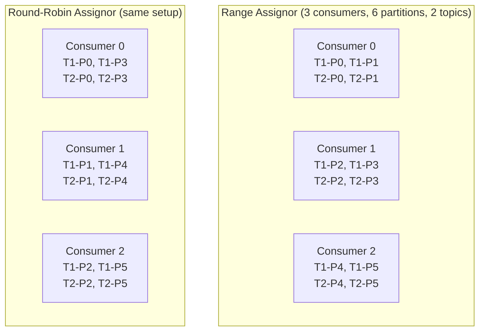
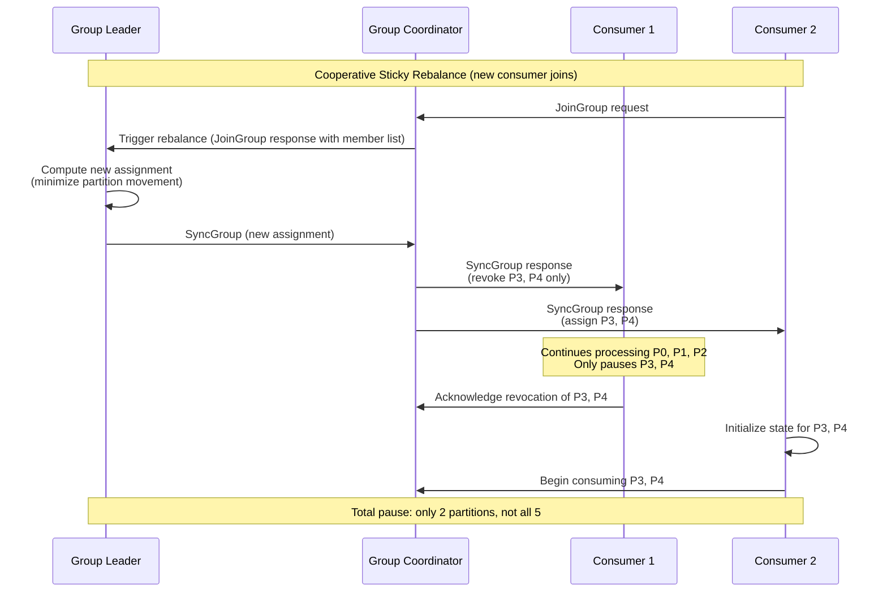
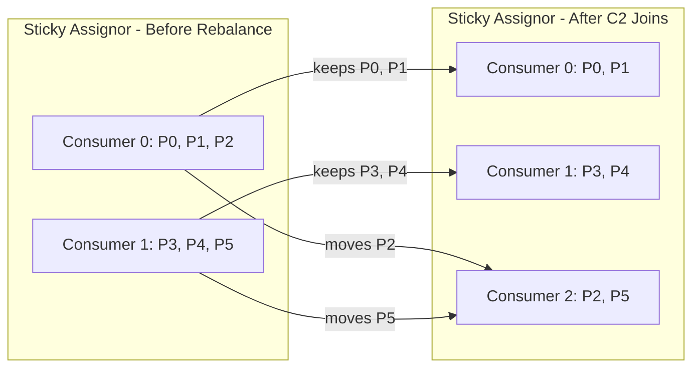

# Partition Assignment Strategies

## Quick Reference

- **Range Assignor** (default before 3.0): Assigns contiguous partition ranges per topic to consumers alphabetically; causes uneven distribution with many topics and few consumers
- **Round-Robin Assignor**: Distributes partitions across consumers in circular fashion across all subscribed topics; achieves better balance but breaks co-partitioning guarantees
- **Sticky Assignor**: Maximizes partition stickiness during rebalances — retains as many existing assignments as possible while achieving balance; reduces state rebuilding cost
- **Cooperative Sticky Assignor** (recommended for Kafka 3.0+): Combines sticky assignment with incremental cooperative rebalancing protocol; avoids stop-the-world pauses during rebalances
- Partition assignment is triggered during consumer group rebalances and executed by the group leader (first consumer to join)
- Custom assignors can be implemented via `ConsumerPartitionAssignor` interface for domain-specific routing (e.g., rack-aware, zone-aware)
- The `partition.assignment.strategy` consumer config accepts a comma-separated list of assignor classes; the group leader selects the first strategy supported by all members

## When to Use

Use **Range Assignor** when you need co-partitioned joins between topics (e.g., Kafka Streams applications joining two topics by key where partition N of topic A must be consumed by the same consumer as partition N of topic B). Range assignment preserves this co-location property but at the cost of potential imbalance when the number of partitions is not evenly divisible by the number of consumers.

Use **Round-Robin Assignor** when all consumers subscribe to the same set of topics and you want maximum balance without co-partitioning requirements. This works well for stateless consumers processing independent events where any consumer can handle any partition without needing correlated data from other topics.

Use **Sticky Assignor** when consumers maintain local state (caches, in-memory aggregations, local RocksDB stores) that is expensive to rebuild. The sticky property minimizes partition movement during rebalances, reducing the cold-start penalty. This is particularly valuable for Kafka Streams applications with large state stores that take minutes to restore from changelog topics.

Use **Cooperative Sticky Assignor** in production environments where you cannot tolerate the stop-the-world pause of eager rebalancing. This is the recommended default for Kafka 3.0+ deployments. It enables incremental rebalancing where only the partitions that need to move are revoked, while all other partitions continue processing uninterrupted.

Implement a **Custom Assignor** when you need rack-aware assignment (keep partitions on consumers in the same availability zone as the partition leader), weighted assignment (assign more partitions to consumers with more resources), or topic-priority assignment (ensure high-priority topics are assigned to dedicated consumers first).

## Code Examples

### Configuring Assignment Strategies

```java
// Consumer configuration with cooperative sticky assignor (recommended)
Properties props = new Properties();
props.put(ConsumerConfig.BOOTSTRAP_SERVERS_CONFIG, "broker1:9092,broker2:9092,broker3:9092");
props.put(ConsumerConfig.GROUP_ID_CONFIG, "order-processing-group");
props.put(ConsumerConfig.KEY_DESERIALIZER_CLASS_CONFIG, StringDeserializer.class.getName());
props.put(ConsumerConfig.VALUE_DESERIALIZER_CLASS_CONFIG, JsonDeserializer.class.getName());

// Use cooperative sticky assignor for incremental rebalancing
props.put(ConsumerConfig.PARTITION_ASSIGNMENT_STRATEGY_CONFIG,
    CooperativeStickyAssignor.class.getName());

// Important: with cooperative protocol, partitions are revoked incrementally
// The consumer will receive onPartitionsRevoked() only for partitions being moved
// Other partitions continue processing during the rebalance

KafkaConsumer<String, OrderEvent> consumer = new KafkaConsumer<>(props);

// Rebalance listener adapted for cooperative protocol
consumer.subscribe(List.of("order-events", "payment-events"), new ConsumerRebalanceListener() {
    @Override
    public void onPartitionsRevoked(Collection<TopicPartition> partitions) {
        // With cooperative: only called for partitions being moved away
        // Commit offsets for revoked partitions only
        Map<TopicPartition, OffsetAndMetadata> offsets = new HashMap<>();
        for (TopicPartition tp : partitions) {
            offsets.put(tp, new OffsetAndMetadata(currentOffsets.get(tp)));
        }
        consumer.commitSync(offsets);
        log.info("Revoked {} partitions: {}", partitions.size(), partitions);
    }

    @Override
    public void onPartitionsAssigned(Collection<TopicPartition> partitions) {
        // Initialize state for newly assigned partitions
        for (TopicPartition tp : partitions) {
            initializePartitionState(tp);
        }
        log.info("Assigned {} partitions: {}", partitions.size(), partitions);
    }

    @Override
    public void onPartitionsLost(Collection<TopicPartition> partitions) {
        // Called when partitions are lost without a clean revocation
        // (e.g., consumer exceeded session timeout)
        // State for these partitions may be stale — clean up without committing
        for (TopicPartition tp : partitions) {
            cleanupPartitionState(tp);
        }
        log.warn("Lost {} partitions unexpectedly: {}", partitions.size(), partitions);
    }
});
```

### Implementing a Custom Rack-Aware Assignor

```java
public class RackAwareAssignor extends AbstractPartitionAssignor {

    @Override
    public String name() {
        return "rack-aware";
    }

    @Override
    public Map<String, List<TopicPartition>> assign(
            Map<String, Integer> partitionsPerTopic,
            Map<String, Subscription> subscriptions) {

        // Build consumer-to-rack mapping from subscription user data
        Map<String, String> consumerRacks = new HashMap<>();
        for (Map.Entry<String, Subscription> entry : subscriptions.entrySet()) {
            String consumerId = entry.getKey();
            String rack = extractRack(entry.getValue().userData());
            consumerRacks.put(consumerId, rack);
        }

        // Build partition-to-rack mapping (leader broker rack)
        Map<TopicPartition, String> partitionRacks = getPartitionLeaderRacks();

        // Assign partitions preferring same-rack consumers
        Map<String, List<TopicPartition>> assignment = new HashMap<>();
        subscriptions.keySet().forEach(c -> assignment.put(c, new ArrayList<>()));

        for (Map.Entry<String, Integer> topicEntry : partitionsPerTopic.entrySet()) {
            String topic = topicEntry.getKey();
            int numPartitions = topicEntry.getValue();

            for (int partition = 0; partition < numPartitions; partition++) {
                TopicPartition tp = new TopicPartition(topic, partition);
                String partitionRack = partitionRacks.getOrDefault(tp, "unknown");

                // Find consumers in the same rack
                List<String> sameRackConsumers = subscriptions.keySet().stream()
                    .filter(c -> subscriptions.get(c).topics().contains(topic))
                    .filter(c -> partitionRack.equals(consumerRacks.get(c)))
                    .collect(Collectors.toList());

                // Assign to least-loaded same-rack consumer, or least-loaded overall
                String target;
                if (!sameRackConsumers.isEmpty()) {
                    target = sameRackConsumers.stream()
                        .min(Comparator.comparingInt(c -> assignment.get(c).size()))
                        .orElseThrow();
                } else {
                    target = subscriptions.keySet().stream()
                        .filter(c -> subscriptions.get(c).topics().contains(topic))
                        .min(Comparator.comparingInt(c -> assignment.get(c).size()))
                        .orElseThrow();
                }
                assignment.get(target).add(tp);
            }
        }
        return assignment;
    }
}
```

### Spring Kafka Configuration with Cooperative Assignor

```yaml
# application.yml - Spring Kafka consumer configuration
spring:
  kafka:
    bootstrap-servers: broker1:9092,broker2:9092,broker3:9092
    consumer:
      group-id: order-service
      auto-offset-reset: earliest
      enable-auto-commit: false
      properties:
        partition.assignment.strategy: org.apache.kafka.clients.consumer.CooperativeStickyAssignor
        # Cooperative protocol settings
        session.timeout.ms: 45000
        heartbeat.interval.ms: 15000
        max.poll.interval.ms: 300000
    listener:
      ack-mode: manual_immediate
      concurrency: 3  # Number of consumer threads (max = partition count)
```

## Architecture / Diagrams







## Common Pitfalls

- **Mixing eager and cooperative assignors in the same group**: If even one consumer in the group uses an eager assignor (Range, RoundRobin, or non-cooperative Sticky), the entire group falls back to the eager protocol. All consumers in a group must use the cooperative protocol for incremental rebalancing to work. During migration, use the two-phase rolling upgrade: first deploy with both old and new assignors in the strategy list, then remove the old one.

- **Co-partitioning broken by round-robin**: When using Kafka Streams or manual stream-table joins that require partition N of topic A to be processed by the same consumer as partition N of topic B, round-robin assignment breaks this guarantee. Use Range or Sticky assignor for co-partitioned workloads, or ensure topics have identical partition counts and key schemas.

- **Uneven distribution with Range assignor and many topics**: With Range assignor, if you have 10 topics each with 7 partitions and 3 consumers, consumer 0 gets partitions 0-2 from each topic (30 partitions) while consumer 2 gets partitions 5-6 from each topic (20 partitions). The imbalance compounds with more topics. Switch to Sticky or Round-Robin for better balance when co-partitioning is not required.

- **Ignoring `onPartitionsLost` with cooperative protocol**: The cooperative protocol introduces `onPartitionsLost()` which is called when partitions are taken away without a clean revocation (consumer exceeded session timeout). Unlike `onPartitionsRevoked()`, you should NOT commit offsets in `onPartitionsLost()` because another consumer may already be processing those partitions. Failing to handle this correctly leads to offset conflicts and duplicate processing.

- **Static membership misconfiguration**: Setting `group.instance.id` enables static membership (avoids rebalance on transient disconnects) but requires that each consumer instance has a globally unique, stable instance ID. If two consumers share the same instance ID, one will be fenced. If instance IDs change across restarts (e.g., using pod IP), you lose the static membership benefit entirely.

## Real-World Use Cases

- **Multi-tenant event processing**: A SaaS platform uses a custom partition assignor that routes tenant-specific partitions to consumers in the same region as the tenant's data residency requirement. High-value tenants get dedicated consumer instances while smaller tenants share consumers, all managed through custom assignment logic that reads tenant metadata from the subscription's user data field.

- **Kafka Streams state store optimization**: A real-time analytics service uses the Sticky assignor to minimize state store restoration during deployments. Each Kafka Streams instance maintains a 50GB RocksDB state store backed by a changelog topic. Without sticky assignment, a rolling restart would trigger full state restoration (15+ minutes per instance). With sticky assignment, partitions stay on the same instance across rebalances, requiring only a brief catch-up from the changelog rather than a full rebuild.

- **Zero-downtime deployments with cooperative rebalancing**: An e-commerce platform processes 500K orders/minute through Kafka consumers. Before cooperative rebalancing, each deployment caused a 30-second processing pause across all partitions during the eager rebalance. After migrating to CooperativeStickyAssignor, deployments cause only 2-3 second pauses on the specific partitions being moved, with 95% of partitions continuing uninterrupted throughout the rolling restart.

- **Rack-aware assignment for latency reduction**: A financial trading platform implements a custom rack-aware assignor that preferentially assigns partitions to consumers in the same availability zone as the partition leader broker. This reduces cross-AZ network latency from 2-5ms to sub-millisecond for read-heavy workloads, critical for their sub-10ms processing SLA.

## Interview Questions

**Q: What is the difference between Range and Round-Robin partition assignment, and when would you choose each?**

A: Range assignor divides partitions of each topic into contiguous ranges and assigns them to consumers in alphabetical order. For topic T with 7 partitions and 3 consumers: C0 gets P0-P2, C1 gets P3-P4, C2 gets P5-P6. This preserves co-partitioning (same consumer gets partition N across topics) but creates imbalance when partition count is not divisible by consumer count. Round-Robin distributes partitions one-by-one across consumers in circular order across all topics, achieving better balance but breaking co-partitioning. Choose Range for Kafka Streams joins or any workload requiring correlated partition processing. Choose Round-Robin for stateless consumers where balance matters more than partition affinity.

**Q: Explain how the Cooperative Sticky Assignor differs from the eager Sticky Assignor and why it matters in production.**

A: The eager Sticky Assignor revokes ALL partitions from ALL consumers at the start of a rebalance, then reassigns them (trying to maintain stickiness). During revocation, no consumer processes any messages — a stop-the-world pause. The Cooperative Sticky Assignor uses a two-phase protocol: first, it computes the new assignment and only revokes partitions that need to move. Consumers continue processing their retained partitions throughout the rebalance. In production with 100+ partitions, this reduces rebalance impact from a full processing halt (seconds to minutes) to a targeted pause affecting only the 2-3 partitions being relocated. This is critical for latency-sensitive workloads where even brief processing gaps violate SLAs.

**Q: How would you implement a custom partition assignor, and what are the key considerations?**

A: Implement `ConsumerPartitionAssignor` interface with the `assign()` method that receives partition metadata and consumer subscriptions, returning a mapping of consumer IDs to partition lists. Key considerations: (1) Balance — ensure roughly equal partition counts per consumer to avoid hotspots. (2) Stickiness — track previous assignments and minimize movement to reduce state rebuilding. (3) Subscription heterogeneity — handle consumers subscribing to different topic subsets. (4) User data — leverage the subscription's `userData` field to pass consumer metadata (rack, capacity, priority) to the assignor. (5) Determinism — the assignment must be deterministic given the same inputs, as the group coordinator validates the leader's assignment. Common use cases include rack-aware assignment, weighted assignment based on consumer capacity, and priority-based assignment for multi-tier processing.

**Q: What happens during a partition reassignment when a consumer maintains local state?**

A: When a partition is revoked from a consumer with local state (e.g., Kafka Streams RocksDB store), the consumer must: (1) flush any pending writes to the state store, (2) commit the current offset for that partition, (3) close the state store for that partition. When the new consumer receives the partition, it must: (1) create a new state store instance, (2) restore state from the changelog topic (replay all records from the beginning or from the last checkpoint), (3) begin processing from the committed offset. This restoration can take minutes for large state stores. The Sticky assignor minimizes this by keeping partitions on the same consumer across rebalances. Standby replicas (`num.standby.replicas`) can pre-warm state on other consumers to reduce failover time.

## Production Tips

- **Migrating to cooperative protocol**: Perform a two-phase rolling upgrade. Phase 1: configure all consumers with both assignors (`RangeAssignor,CooperativeStickyAssignor`). Deploy to all instances. Phase 2: remove the old assignor, leaving only `CooperativeStickyAssignor`. Deploy again. This ensures the group never has a mix of cooperative-only and eager-only consumers, which would cause assignment failures.

- **Monitoring assignment balance**: Track the `partition-assigned` metric per consumer instance and alert when the standard deviation exceeds 20% of the mean. Unbalanced assignment indicates either a misconfigured assignor or heterogeneous subscriptions. Use `kafka-consumer-groups.sh --describe` to inspect current assignment and identify imbalances before they cause consumer lag on overloaded instances.

- **Tuning for large consumer groups**: Groups with 50+ consumers experience longer rebalance times due to the JoinGroup/SyncGroup protocol overhead. Increase `session.timeout.ms` to 45-60 seconds to prevent false timeouts during rebalances. Set `group.initial.rebalance.delay.ms` on the broker (default 3 seconds) to batch multiple consumer joins into a single rebalance rather than triggering cascading rebalances as consumers start sequentially.

## Related Topics

- [Consumer Rebalancing](./consumer-rebalancing.md) — Deep dive into the rebalancing protocol that triggers partition reassignment
- [Apache Kafka](./apache-kafka.md) — Comprehensive Kafka overview covering producers, consumers, and streaming
- [Messaging Patterns and Architecture](./messaging-patterns.md) — Higher-level patterns for event-driven systems built on Kafka
