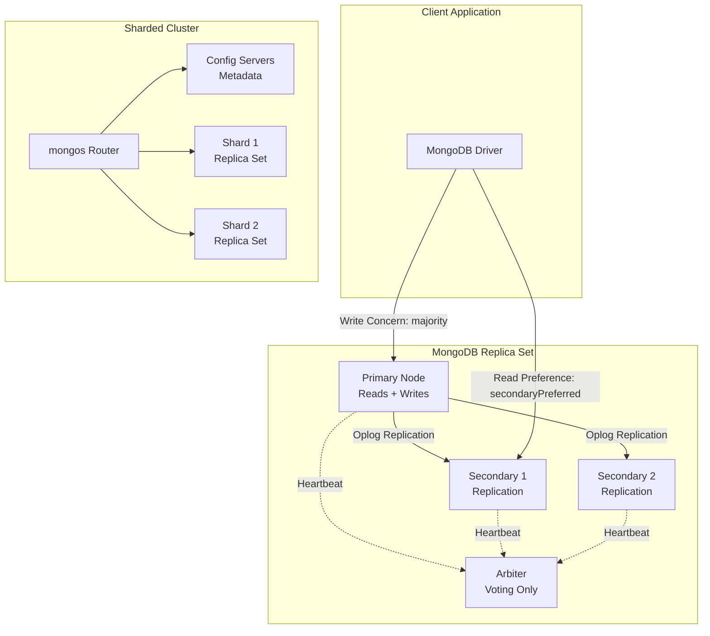
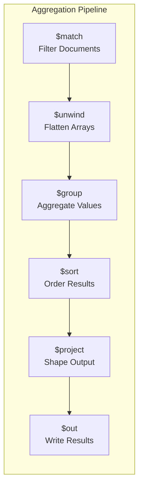

# MongoDB

## Quick Reference

- MongoDB is a document-oriented NoSQL database storing data as flexible BSON (Binary JSON) documents
- Collections are analogous to tables; documents are analogous to rows but with dynamic schemas
- CRUD operations: `insertOne`/`insertMany`, `find`/`findOne`, `updateOne`/`updateMany`, `deleteOne`/`deleteMany`
- Query operators: `$eq`, `$gt`, `$lt`, `$in`, `$and`, `$or`, `$regex`, `$exists`
- Aggregation pipeline stages: `$match`, `$group`, `$sort`, `$project`, `$lookup`, `$unwind`
- Index types: Single field, compound, multikey, text, geospatial, hashed
- Replication via replica sets (primary + secondaries); sharding for horizontal scaling

## When to Use

MongoDB is ideal for applications with evolving schemas, hierarchical data, or document-centric access patterns. Choose MongoDB when your data naturally fits a document model (e.g., product catalogs, content management, user profiles), when you need flexible schemas that can evolve without migrations, or when your read patterns align with document boundaries. MongoDB excels at horizontal scaling through sharding for write-heavy workloads and geographically distributed deployments. It is particularly strong for rapid prototyping, real-time analytics with the aggregation framework, and applications requiring low-latency reads with embedded documents that eliminate joins. MongoDB Atlas provides a fully managed cloud offering with automated backups, monitoring, and scaling, making it accessible for teams without dedicated database administrators. The document model maps naturally to object-oriented programming, eliminating the impedance mismatch between application objects and database rows that plagues relational ORMs.

## Code Examples

### CRUD Operations

```javascript
// Insert documents
db.orders.insertMany([
  {
    customerId: ObjectId("64a7b2c3d4e5f6a7b8c9d0e1"),
    items: [
      { productId: "SKU-001", name: "Laptop", quantity: 1, price: 999.99 },
      { productId: "SKU-042", name: "Mouse", quantity: 2, price: 29.99 }
    ],
    status: "pending",
    totalAmount: 1059.97,
    createdAt: new Date(),
    shippingAddress: {
      street: "123 Main St",
      city: "Seattle",
      state: "WA",
      zip: "98101"
    }
  }
]);

// Query with filters and projection
db.orders.find(
  {
    status: "pending",
    totalAmount: { $gte: 100 },
    "shippingAddress.state": "WA"
  },
  {
    customerId: 1,
    totalAmount: 1,
    status: 1,
    _id: 0
  }
).sort({ createdAt: -1 }).limit(10);

// Update with operators
db.orders.updateOne(
  { _id: ObjectId("64a7b2c3d4e5f6a7b8c9d0e1") },
  {
    $set: { status: "shipped", shippedAt: new Date() },
    $push: {
      statusHistory: {
        status: "shipped",
        timestamp: new Date(),
        updatedBy: "system"
      }
    }
  }
);

// Delete with filter
db.orders.deleteMany({
  status: "cancelled",
  createdAt: { $lt: new Date(Date.now() - 90 * 24 * 60 * 60 * 1000) }
});
```

### Aggregation Pipeline

```javascript
// Revenue analysis by product category
db.orders.aggregate([
  { $match: { status: "completed", createdAt: { $gte: ISODate("2024-01-01") } } },
  { $unwind: "$items" },
  {
    $lookup: {
      from: "products",
      localField: "items.productId",
      foreignField: "sku",
      as: "productDetails"
    }
  },
  { $unwind: "$productDetails" },
  {
    $group: {
      _id: "$productDetails.category",
      totalRevenue: { $sum: { $multiply: ["$items.price", "$items.quantity"] } },
      orderCount: { $sum: 1 },
      avgOrderValue: { $avg: { $multiply: ["$items.price", "$items.quantity"] } }
    }
  },
  { $sort: { totalRevenue: -1 } },
  {
    $project: {
      category: "$_id",
      totalRevenue: { $round: ["$totalRevenue", 2] },
      orderCount: 1,
      avgOrderValue: { $round: ["$avgOrderValue", 2] },
      _id: 0
    }
  }
]);
```

### Indexing Strategies

```javascript
// Compound index for common query patterns
db.orders.createIndex(
  { customerId: 1, status: 1, createdAt: -1 },
  { name: "customer_status_date_idx" }
);

// Partial index for active orders only
db.orders.createIndex(
  { createdAt: -1 },
  {
    partialFilterExpression: { status: { $in: ["pending", "processing"] } },
    name: "active_orders_idx"
  }
);

// TTL index for automatic document expiration
db.sessions.createIndex(
  { lastAccessedAt: 1 },
  { expireAfterSeconds: 3600, name: "session_ttl_idx" }
);

// Text index for full-text search
db.products.createIndex(
  { name: "text", description: "text", tags: "text" },
  { weights: { name: 10, tags: 5, description: 1 } }
);
```

## Architecture and Diagrams





## Common Pitfalls

1. **Unbounded document growth**: Using `$push` without limits causes documents to exceed the 16MB BSON limit. Use the bucket pattern or capped arrays with `$slice` to prevent unbounded growth in arrays.

2. **Missing indexes on query fields**: Full collection scans on large collections cause severe performance degradation. Use `explain("executionStats")` to verify queries use indexes and check for `COLLSCAN` stages.

3. **Over-embedding vs. over-referencing**: Embedding everything creates large documents with wasted bandwidth. Referencing everything requires multiple queries (no joins in MongoDB). Design based on access patterns: embed data that is always accessed together, reference data accessed independently.

4. **Write concern too low**: Using `w: 0` or `w: 1` without `j: true` risks data loss during primary failover. For critical data, use `w: "majority"` with `j: true` to ensure writes survive replica set elections.

5. **Schema design without considering queries**: Designing schemas based on data relationships (like relational modeling) rather than query patterns leads to poor performance. Always design your schema around your most common read and write operations.

## Real-World Use Cases

- **Content management systems**: MongoDB's flexible schema handles diverse content types (articles, videos, podcasts) with varying metadata fields without requiring schema migrations as content types evolve. Publishers like Forbes and The New York Times use MongoDB to manage millions of content documents with complex taxonomies and real-time personalization.

- **Real-time analytics**: The aggregation framework with change streams enables real-time dashboards that react to data changes, computing metrics like active users, conversion rates, and revenue in near real-time. Change streams provide a reliable event-driven interface for triggering downstream processing without polling.

- **IoT and time-series data**: MongoDB's time-series collections (5.0+) with automatic bucketing efficiently store and query sensor data, telemetry, and event logs with built-in compression and expiration. The columnar compression achieves up to 90% storage reduction compared to regular collections for time-series workloads.

- **E-commerce product catalogs**: Products with vastly different attributes (electronics vs. clothing vs. books) fit naturally into MongoDB's document model without sparse columns or entity-attribute-value anti-patterns. Faceted search and dynamic filtering are straightforward with compound indexes and the aggregation framework.

## Interview Questions

**Q: When would you choose MongoDB over a relational database?**
A: Choose MongoDB when your data has a natural document structure, schemas need to evolve frequently without downtime, you need horizontal scaling for write-heavy workloads, or your access patterns align with document boundaries. Relational databases are better when you need complex multi-table transactions, strict referential integrity, or your data is highly normalized with many relationships.

**Q: Explain the difference between embedding and referencing in MongoDB schema design.**
A: Embedding stores related data within a single document, providing atomic operations and single-query reads but increasing document size. Referencing stores related data in separate collections with ObjectId links, reducing duplication but requiring multiple queries or `$lookup`. Embed for one-to-few relationships accessed together; reference for one-to-many relationships, frequently updated subdocuments, or data exceeding 16MB limits.

**Q: How does MongoDB ensure high availability?**
A: MongoDB uses replica sets with automatic failover. A replica set has one primary (handles writes) and multiple secondaries (replicate via the oplog). If the primary fails, secondaries hold an election using the Raft-like protocol to choose a new primary, typically completing failover within 10-12 seconds. Write concern `majority` ensures acknowledged writes survive failover.

**Q: What is the aggregation pipeline and when would you use it over simple queries?**
A: The aggregation pipeline processes documents through sequential stages (match, group, sort, project, lookup, etc.) for complex data transformations. Use it for analytics (grouping, counting, averaging), data reshaping, joining collections via `$lookup`, or computing derived fields. Simple `find()` queries suffice for basic filtering and projection without transformation.

## Production Tips

- **Connection pooling**: Configure `maxPoolSize` based on your application's concurrency. The default (100) is often too high for small services. Monitor `connections.current` and `connections.available` server metrics. Set `minPoolSize` to avoid cold-start latency for connection establishment during traffic spikes.

- **Read preference strategy**: Use `primaryPreferred` for consistency-critical reads, `secondaryPreferred` for analytics queries to offload the primary, and `nearest` for geographically distributed deployments to minimize latency. Configure `maxStalenessSeconds` to prevent reading from severely lagging secondaries that could return stale data.

- **Index maintenance**: Regularly review indexes with `db.collection.getIndexes()` and remove unused ones (they consume RAM and slow writes). Use the `$indexStats` aggregation stage to identify indexes with zero usage. Build indexes in the background on secondaries first, then step down the primary to minimize production impact.

- **Monitoring essentials**: Track `opcounters` (operations/sec), `repl.lag` (replication delay), `wiredTiger.cache.bytes currently in the cache` vs. configured cache size, and `globalLock.currentQueue` for lock contention. Set up alerts for replication lag exceeding 10 seconds and cache utilization above 80%.

- **Schema versioning**: Use a `schemaVersion` field in documents to handle schema evolution gracefully. Implement lazy migration patterns where documents are upgraded to the latest schema version on read, avoiding expensive bulk migrations that lock collections during updates.

## Related Topics

- [Spring Framework](./spring-framework.md) - Spring Data MongoDB provides repository abstractions for MongoDB
- [Apache Kafka](./apache-kafka.md) - MongoDB Kafka Connector enables change data capture to Kafka topics
- [Java](./java.md) - MongoDB Java Driver for application integration
