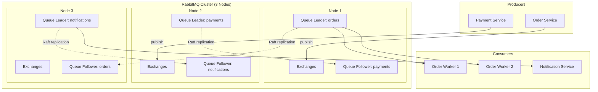
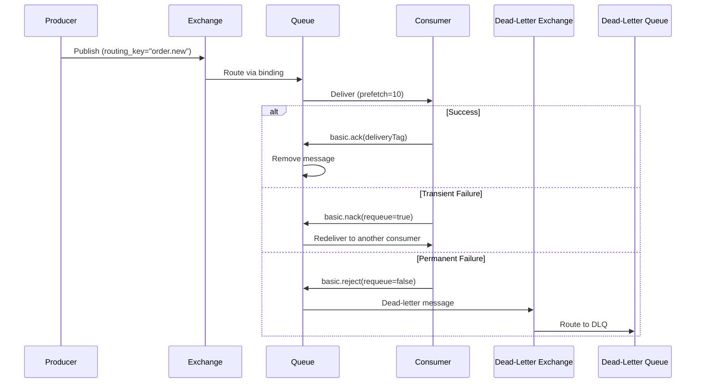

# RabbitMQ

## Quick Reference

- RabbitMQ is an open-source message broker implementing AMQP 0-9-1 (Advanced Message Queuing Protocol)
- Core model: Producers publish messages to Exchanges, which route them to Queues via Bindings, and Consumers read from Queues
- Exchange types: Direct (exact routing key match), Fanout (broadcast to all bound queues), Topic (pattern-based routing), Headers (header attribute matching)
- Delivery guarantees: at-most-once (auto-ack), at-least-once (manual ack + publisher confirms), effectively-once (deduplication at consumer)
- Persistence: durable exchanges/queues survive broker restart; persistent messages (delivery_mode=2) are written to disk
- Clustering: multiple nodes share topology and state; queues live on one node by default unless mirrored or using quorum queues
- Management UI available on port 15672; CLI tools via `rabbitmqctl` and `rabbitmq-diagnostics`

## When to Use

RabbitMQ is ideal when you need a traditional message broker with sophisticated routing capabilities, reliable delivery guarantees, and support for multiple messaging patterns including point-to-point, publish-subscribe, request-reply, and work queues. Choose RabbitMQ when your application requires complex routing logic through exchange types and binding rules, when you need per-message acknowledgments with redelivery on failure, or when you want built-in support for dead-letter exchanges to handle poison messages. RabbitMQ excels in enterprise integration scenarios where different services need different subsets of messages routed based on content or headers, and in task distribution systems where work must be load-balanced across multiple workers with guaranteed processing. It is particularly well-suited for systems that need priority queues, message TTL, delayed messaging, and request-reply patterns with correlation IDs. Prefer RabbitMQ over Kafka when you need smart routing at the broker level, true message deletion after consumption, and lower operational complexity for moderate throughput workloads (tens of thousands of messages per second rather than millions).

## Exchanges

Exchanges are the routing layer in RabbitMQ. Producers never send messages directly to queues; instead, they publish to an exchange, which then routes copies of the message to zero or more queues based on the exchange type and binding rules. Understanding exchange types is fundamental to designing effective messaging topologies.

A **direct exchange** routes messages to queues whose binding key exactly matches the message routing key. This is the simplest routing model and works well for point-to-point communication where each message type has a dedicated consumer. The default exchange (empty string name) is a special direct exchange that automatically binds to every queue using the queue name as the routing key.

A **fanout exchange** ignores routing keys entirely and broadcasts every message to all bound queues. This is the publish-subscribe pattern: one producer, many consumers each receiving every message. Use fanout exchanges for event notification systems where multiple services need to react to the same event independently.

A **topic exchange** routes messages based on wildcard pattern matching against the routing key. Routing keys are dot-delimited strings (e.g., `order.created.us`), and binding patterns use `*` (match exactly one word) and `#` (match zero or more words). Topic exchanges provide flexible content-based routing without requiring a binding for every possible routing key value.

A **headers exchange** ignores the routing key and routes based on message header attributes. The binding specifies header key-value pairs and a match type (`x-match: all` requires all headers to match, `x-match: any` requires at least one). Headers exchanges are useful when routing decisions depend on multiple attributes that do not fit cleanly into a single routing key string.

```java
// Declaring exchanges with Spring AMQP
@Configuration
public class RabbitExchangeConfig {

    @Bean
    public DirectExchange orderExchange() {
        return ExchangeBuilder.directExchange("order.direct")
            .durable(true)
            .build();
    }

    @Bean
    public FanoutExchange notificationExchange() {
        return ExchangeBuilder.fanoutExchange("notification.fanout")
            .durable(true)
            .build();
    }

    @Bean
    public TopicExchange eventExchange() {
        return ExchangeBuilder.topicExchange("event.topic")
            .durable(true)
            .build();
    }

    @Bean
    public HeadersExchange auditExchange() {
        return ExchangeBuilder.headersExchange("audit.headers")
            .durable(true)
            .build();
    }
}
```

## Queues

Queues are the storage mechanism in RabbitMQ where messages wait until a consumer retrieves them. Each queue is an ordered FIFO buffer residing on a single node (unless using quorum queues or classic mirrored queues). Queue properties determine durability, exclusivity, auto-deletion behavior, and advanced features like TTL and length limits.

**Classic queues** are the traditional queue type. They reside on a single node with optional mirroring to other nodes for high availability. Classic queues support all features including priority, lazy mode, and per-message TTL. However, mirrored classic queues have known issues with synchronization and are being deprecated in favor of quorum queues.

**Quorum queues** (RabbitMQ 3.8+) use the Raft consensus algorithm to replicate messages across multiple nodes. They provide stronger data safety guarantees than mirrored classic queues, with automatic leader election and consistent replication. Quorum queues are the recommended choice for durable, replicated queues in production. They do not support some classic queue features like priority and non-durable modes, but offer poison message handling via delivery count tracking.

**Lazy queues** move messages to disk as early as possible, keeping only a small buffer in memory. This is useful for queues that accumulate millions of messages (e.g., during consumer downtime) where keeping everything in memory would exhaust available RAM. In RabbitMQ 3.12+, all classic queues use a lazy-like storage engine by default.

```java
// Queue declarations with various configurations
@Configuration
public class RabbitQueueConfig {

    @Bean
    public Queue orderQueue() {
        return QueueBuilder.durable("order.processing")
            .withArgument("x-queue-type", "quorum")  // Quorum queue
            .withArgument("x-delivery-limit", 5)      // Max redeliveries
            .build();
    }

    @Bean
    public Queue notificationQueue() {
        return QueueBuilder.durable("notification.email")
            .withArgument("x-message-ttl", 86400000)  // 24h TTL
            .withArgument("x-max-length", 100000)     // Max 100k messages
            .withArgument("x-overflow", "reject-publish") // Reject when full
            .build();
    }

    @Bean
    public Queue temporaryQueue() {
        return QueueBuilder.nonDurable()
            .autoDelete()
            .exclusive()
            .build();
    }
}
```

## Bindings

Bindings are the rules that connect exchanges to queues (or other exchanges). A binding defines the relationship between an exchange and a queue, specifying under what conditions messages arriving at the exchange should be copied to the queue. Without bindings, messages published to an exchange are discarded because there is no route to any queue.

For **direct exchanges**, the binding key is a simple string that must exactly match the routing key of the published message. You can bind multiple queues with the same binding key to achieve fanout-like behavior on a direct exchange, or bind one queue with multiple binding keys to receive messages from different routing keys.

For **topic exchanges**, the binding key is a dot-delimited pattern. The wildcard `*` substitutes for exactly one word, and `#` substitutes for zero or more words. For example, binding key `order.*.us` matches routing keys `order.created.us` and `order.cancelled.us` but not `order.created.eu` or `order.item.created.us`.

**Exchange-to-exchange bindings** allow you to create routing topologies where one exchange forwards messages to another exchange before they reach queues. This enables layered routing architectures where a top-level topic exchange routes to specialized direct exchanges, each serving a different consumer group.

```java
// Binding configuration with Spring AMQP
@Configuration
public class RabbitBindingConfig {

    @Bean
    public Binding orderBinding(Queue orderQueue, DirectExchange orderExchange) {
        return BindingBuilder.bind(orderQueue)
            .to(orderExchange)
            .with("order.process");  // Routing key
    }

    @Bean
    public Binding notificationBinding(Queue notificationQueue, FanoutExchange notificationExchange) {
        return BindingBuilder.bind(notificationQueue)
            .to(notificationExchange);  // No routing key for fanout
    }

    @Bean
    public Binding eventBinding(Queue orderQueue, TopicExchange eventExchange) {
        return BindingBuilder.bind(orderQueue)
            .to(eventExchange)
            .with("order.#");  // Matches order.created, order.cancelled, etc.
    }

    @Bean
    public Binding auditBinding(Queue auditQueue, HeadersExchange auditExchange) {
        return BindingBuilder.bind(auditQueue)
            .to(auditExchange)
            .whereAll("source", "action").match();  // Match all specified headers
    }
}
```

## Acknowledgments

Acknowledgments are the mechanism by which consumers confirm successful message processing to the broker. Proper acknowledgment handling is critical for reliable messaging because it determines whether a message is removed from the queue or redelivered to another consumer. RabbitMQ supports both consumer acknowledgments (from consumer to broker) and publisher confirms (from broker to publisher).

**Consumer acknowledgments** come in three modes. In auto-ack mode (`autoAck=true`), the broker considers a message delivered the moment it sends it to the consumer, regardless of whether processing succeeds. This provides at-most-once delivery with the highest throughput but risks message loss on consumer failure. In manual-ack mode, the consumer explicitly sends `basic.ack` after successful processing, `basic.nack` to reject and optionally requeue, or `basic.reject` for a single message rejection. Manual acknowledgment provides at-least-once delivery guarantees.

**Publisher confirms** are the producer-side equivalent. When a channel is put into confirm mode, the broker acknowledges each published message with a `basic.ack` once it has been persisted (for persistent messages) or routed to at least one queue. If the message cannot be routed, the broker sends `basic.nack`. Publisher confirms combined with consumer manual acks provide end-to-end delivery guarantees.

**Prefetch count** (`basic.qos`) controls how many unacknowledged messages the broker delivers to a consumer at once. Setting prefetch to 1 ensures fair dispatch across consumers but reduces throughput. Higher prefetch values improve throughput by allowing consumers to pipeline processing but risk uneven load distribution if processing times vary significantly.

```java
// Consumer with manual acknowledgment using Spring AMQP
@Component
public class OrderConsumer {

    @RabbitListener(queues = "order.processing", ackMode = "MANUAL")
    public void processOrder(Message message, Channel channel,
                             @Header(AmqpHeaders.DELIVERY_TAG) long deliveryTag) {
        try {
            OrderEvent order = deserialize(message);
            orderService.process(order);

            // Acknowledge successful processing
            channel.basicAck(deliveryTag, false);  // false = single message
            log.info("Processed order: {}", order.getOrderId());

        } catch (RecoverableException e) {
            // Requeue for retry
            channel.basicNack(deliveryTag, false, true);  // requeue=true
            log.warn("Requeueing order due to transient error", e);

        } catch (PoisonMessageException e) {
            // Reject without requeue (send to DLQ if configured)
            channel.basicReject(deliveryTag, false);  // requeue=false
            log.error("Rejecting poison message", e);
        }
    }
}

// Publisher confirms configuration
@Configuration
public class PublisherConfirmConfig {

    @Bean
    public CachingConnectionFactory connectionFactory() {
        CachingConnectionFactory factory = new CachingConnectionFactory("localhost");
        factory.setPublisherConfirmType(ConfirmType.CORRELATED);
        factory.setPublisherReturns(true);
        return factory;
    }

    @Bean
    public RabbitTemplate rabbitTemplate(CachingConnectionFactory connectionFactory) {
        RabbitTemplate template = new RabbitTemplate(connectionFactory);
        template.setMandatory(true);

        template.setConfirmCallback((correlationData, ack, cause) -> {
            if (!ack) {
                log.error("Message not confirmed: {}", cause);
                // Retry or alert
            }
        });

        template.setReturnsCallback(returned -> {
            log.warn("Message returned: exchange={}, routingKey={}, replyCode={}",
                returned.getExchange(), returned.getRoutingKey(), returned.getReplyCode());
        });

        return template;
    }
}
```

## Dead-Letter Queues

Dead-letter queues (DLQs) are queues that receive messages which could not be processed successfully. RabbitMQ implements dead-lettering through dead-letter exchanges (DLXs): when a message is rejected, expires, or exceeds a queue length limit, it is republished to the configured dead-letter exchange, which routes it to a dead-letter queue. DLQs are essential for building resilient systems that handle failures gracefully without losing messages.

Messages are dead-lettered in three scenarios: the consumer rejects the message with `requeue=false` (via `basic.reject` or `basic.nack`), the message TTL expires while sitting in the queue, or the queue exceeds its maximum length and the overflow strategy is set to `reject-publish-dlx` or the default drop-head behavior pushes messages out.

When a message is dead-lettered, RabbitMQ adds headers to the message recording the reason for dead-lettering (`x-death` header array), the original exchange and routing key, the queue from which it was dead-lettered, and a count of how many times it has been dead-lettered. This metadata is invaluable for debugging and implementing retry logic.

A common pattern is the **retry with backoff** topology: the main queue dead-letters to a retry exchange, which routes to a delay queue with a TTL. When the TTL expires, the delay queue dead-letters back to the original exchange, creating a retry loop with configurable delay. After a maximum number of retries (tracked via the `x-death` count header), the message is routed to a parking lot queue for manual inspection.

```java
// Dead-letter queue configuration
@Configuration
public class DeadLetterConfig {

    // Main queue with DLX configuration
    @Bean
    public Queue orderQueue() {
        return QueueBuilder.durable("order.processing")
            .withArgument("x-dead-letter-exchange", "order.dlx")
            .withArgument("x-dead-letter-routing-key", "order.dead")
            .build();
    }

    // Dead-letter exchange
    @Bean
    public DirectExchange deadLetterExchange() {
        return new DirectExchange("order.dlx");
    }

    // Dead-letter queue
    @Bean
    public Queue deadLetterQueue() {
        return QueueBuilder.durable("order.dlq").build();
    }

    @Bean
    public Binding deadLetterBinding() {
        return BindingBuilder.bind(deadLetterQueue())
            .to(deadLetterExchange())
            .with("order.dead");
    }

    // Retry queue with TTL (messages wait here before retry)
    @Bean
    public Queue retryQueue() {
        return QueueBuilder.durable("order.retry")
            .withArgument("x-message-ttl", 30000)  // 30 second delay
            .withArgument("x-dead-letter-exchange", "order.direct")
            .withArgument("x-dead-letter-routing-key", "order.process")
            .build();
    }
}

// Consumer with retry count checking
@Component
public class OrderConsumerWithRetry {

    private static final int MAX_RETRIES = 3;

    @RabbitListener(queues = "order.processing", ackMode = "MANUAL")
    public void processOrder(Message message, Channel channel,
                             @Header(AmqpHeaders.DELIVERY_TAG) long deliveryTag) {
        int retryCount = getRetryCount(message);

        try {
            orderService.process(deserialize(message));
            channel.basicAck(deliveryTag, false);
        } catch (Exception e) {
            if (retryCount >= MAX_RETRIES) {
                // Send to DLQ (parking lot) for manual inspection
                channel.basicReject(deliveryTag, false);
                log.error("Max retries exceeded, sending to DLQ", e);
            } else {
                // Requeue to retry queue via DLX
                channel.basicNack(deliveryTag, false, false);
                log.warn("Retry {} of {}", retryCount + 1, MAX_RETRIES, e);
            }
        }
    }

    private int getRetryCount(Message message) {
        List<Map<String, ?>> deaths = message.getMessageProperties().getXDeathHeader();
        if (deaths == null || deaths.isEmpty()) return 0;
        return deaths.stream()
            .mapToInt(d -> ((Number) d.get("count")).intValue())
            .sum();
    }
}
```

## Clustering

RabbitMQ clustering connects multiple broker nodes into a single logical broker, sharing users, virtual hosts, exchanges, bindings, and runtime parameters across all nodes. Clustering provides both high availability (if one node fails, others continue serving) and horizontal scaling (distribute queues across nodes to increase total capacity). Understanding clustering topology is essential for production deployments.

In a cluster, all nodes share metadata (exchanges, bindings, users, policies) but queue contents live on the node where the queue was declared (the queue owner) unless replication is configured. Clients can connect to any node in the cluster; if they consume from a queue on a different node, the messages are transparently forwarded. However, this cross-node forwarding adds latency, so connecting consumers to the node hosting their queue is preferred.

**Quorum queues** are the recommended replication strategy for production clusters. They use the Raft consensus algorithm with a configurable replication factor (typically 3 or 5 nodes). A quorum queue elects a leader that handles all reads and writes, with followers replicating data. If the leader fails, a follower with the most up-to-date data is elected as the new leader. Quorum queues guarantee that acknowledged messages are not lost as long as a majority of replicas survive.

**Network partitions** are the primary failure mode in distributed systems. RabbitMQ offers three partition handling strategies: `pause-minority` (nodes in the minority partition pause until connectivity is restored, preventing split-brain), `autoheal` (the losing partition restarts after connectivity is restored), and `ignore` (nodes continue independently, requiring manual intervention). For most production deployments, `pause-minority` is recommended because it prevents split-brain scenarios where both sides accept writes.

```yaml
# rabbitmq.conf - Cluster configuration
cluster_formation.peer_discovery_backend = rabbit_peer_discovery_k8s
cluster_formation.k8s.host = kubernetes.default.svc.cluster.local
cluster_formation.k8s.address_type = hostname
cluster_formation.node_cleanup.interval = 30
cluster_formation.node_cleanup.only_log_warning = true
cluster_partition_handling = pause_minority

# Quorum queue defaults
default_queue_type = quorum

# Resource limits
vm_memory_high_watermark.relative = 0.7
disk_free_limit.absolute = 2GB
```

```bash
# Cluster management commands
# Join a node to an existing cluster
rabbitmqctl stop_app
rabbitmqctl reset
rabbitmqctl join_cluster rabbit@node1
rabbitmqctl start_app

# Check cluster status
rabbitmqctl cluster_status

# Set a policy for quorum queues with replication factor 3
rabbitmqctl set_policy ha-quorum "^order\." \
  '{"queue-type": "quorum", "x-quorum-initial-group-size": 3}' \
  --apply-to queues

# Force remove a failed node
rabbitmqctl forget_cluster_node rabbit@failed-node

# Rebalance queue leaders across nodes
rabbitmq-queues rebalance all
```

## Architecture and Diagrams





## Common Pitfalls

1. **Unbounded queue growth**: Without consumers or with slow consumers, queues grow indefinitely, consuming all available memory until the broker triggers flow control or crashes. Always set `x-max-length` or `x-max-length-bytes` on queues, and configure `x-overflow` to either `reject-publish` (backpressure to producers) or `drop-head` (discard oldest messages).

2. **Missing publisher confirms**: Publishing without confirms means the producer has no way to know if messages were actually persisted or routed. If the broker crashes between receiving a message and writing it to disk, the message is lost silently. Always enable publisher confirms for messages that must not be lost.

3. **Auto-ack with expensive processing**: Using auto-acknowledge mode means the broker removes the message from the queue immediately upon delivery. If the consumer crashes mid-processing, the message is gone. Use manual acknowledgment for any processing that takes more than trivial time or has side effects.

4. **Connection per operation anti-pattern**: Creating a new connection for each publish or consume operation is extremely expensive (TCP handshake + AMQP handshake + TLS negotiation). Use connection pooling and channel multiplexing. A single connection can support thousands of channels, each acting as a lightweight virtual connection.

5. **Ignoring memory and disk alarms**: When RabbitMQ hits the memory high watermark (default 40% of system RAM) or disk free space drops below the limit, it blocks all publishers via flow control. Monitor `rabbitmq_node_mem_used` and `rabbitmq_node_disk_free` metrics and set alerts well before thresholds are reached.

6. **Not setting message TTL**: Messages without TTL sit in queues indefinitely if consumers are down. For time-sensitive messages (notifications, OTPs, session tokens), always set per-message TTL or queue-level `x-message-ttl` to prevent stale message processing when consumers recover.

## Real-World Use Cases

- **Order processing pipeline**: E-commerce platforms use RabbitMQ to decouple order placement from fulfillment. The order service publishes to a topic exchange with routing keys like `order.created.electronics`, allowing inventory, shipping, and notification services to each bind with patterns matching their domain, processing orders independently and at their own pace.

- **Email and notification dispatch**: A notification service consumes from a fanout exchange, receiving all system events. It applies filtering logic to determine which events warrant user notifications, then publishes to priority queues (high for security alerts, low for marketing) with appropriate TTLs to prevent sending stale notifications.

- **Distributed task scheduling**: Background job systems use RabbitMQ work queues with prefetch=1 to distribute CPU-intensive tasks (image processing, report generation, data exports) across a pool of workers. Dead-letter queues capture failed jobs for retry or manual intervention, and priority queues ensure urgent tasks are processed first.

- **Microservice saga orchestration**: In distributed transactions spanning multiple services, RabbitMQ facilitates the saga pattern. A saga orchestrator publishes commands to service-specific queues and listens for completion or compensation events on reply queues, coordinating multi-step business processes with eventual consistency.

## Interview Questions

**Q: What is the difference between a direct exchange and a topic exchange?**
A: A direct exchange routes messages only when the routing key exactly matches the binding key. A topic exchange supports wildcard pattern matching with `*` (one word) and `#` (zero or more words) in binding keys, enabling flexible content-based routing where one binding can match multiple routing key patterns.

**Q: How does RabbitMQ ensure messages are not lost?**
A: Three mechanisms work together: durable exchanges and queues survive broker restarts, persistent messages (delivery_mode=2) are written to disk before acknowledgment, and publisher confirms notify producers when messages are safely persisted. On the consumer side, manual acknowledgments ensure messages are only removed from the queue after successful processing.

**Q: Explain the difference between basic.reject and basic.nack.**
A: `basic.reject` operates on a single message and can either requeue it or discard it (triggering dead-lettering). `basic.nack` is a RabbitMQ extension that supports rejecting multiple messages at once via the `multiple` flag, making it more efficient for batch rejection scenarios. Both support the `requeue` parameter.

**Q: What are quorum queues and when should you use them?**
A: Quorum queues use the Raft consensus algorithm to replicate queue data across multiple nodes. They provide stronger durability guarantees than classic mirrored queues, with automatic leader election and consistent replication. Use them for any queue where message loss is unacceptable. They trade some features (no priority, no non-durable mode) and slightly higher latency for significantly better data safety.

**Q: How does RabbitMQ handle network partitions in a cluster?**
A: RabbitMQ offers three strategies: `pause-minority` pauses nodes in the smaller partition to prevent split-brain (recommended for most cases), `autoheal` automatically restarts the losing partition after healing, and `ignore` lets both sides continue independently (risking divergence). The choice depends on whether you prioritize availability or consistency during partitions.

## Production Tips

- **Connection management**: Use a single long-lived connection per application instance with multiple channels for concurrency. Spring AMQP's `CachingConnectionFactory` handles this automatically. Set heartbeat interval to 60 seconds to detect dead connections without excessive network overhead.

- **Monitoring essentials**: Track queue depth (`rabbitmq_queue_messages`), consumer utilization (`rabbitmq_queue_consumer_utilisation`), message rates (`rabbitmq_queue_messages_published_total`), and node memory usage. Alert when queue depth exceeds normal operating range or consumer utilization drops below 70%.

- **Quorum queue sizing**: For quorum queues, use an odd replication factor (3 or 5). Three replicas tolerate one node failure; five tolerate two. More replicas increase write latency due to Raft consensus overhead. Place replicas across availability zones for maximum resilience.

- **Flow control awareness**: When the broker is under memory or disk pressure, it blocks publishing connections. Design producers to handle blocked connection callbacks gracefully, implementing backpressure or buffering rather than timing out and retrying aggressively, which worsens the situation.

- **Virtual host isolation**: Use separate virtual hosts for different applications or environments (dev, staging, production) sharing the same cluster. Virtual hosts provide namespace isolation for exchanges, queues, and bindings, plus independent permission controls and resource limits via policies.

## Related Topics

- [Apache Kafka](./apache-kafka.md) - Kafka provides event streaming with log-based persistence, complementing RabbitMQ's traditional message broker model
- [Spring Framework](./spring-framework.md) - Spring AMQP and Spring Cloud Stream provide high-level RabbitMQ integration with declarative listeners
- [Java](./java.md) - RabbitMQ Java client library and Spring AMQP are the primary integration points for JVM applications
