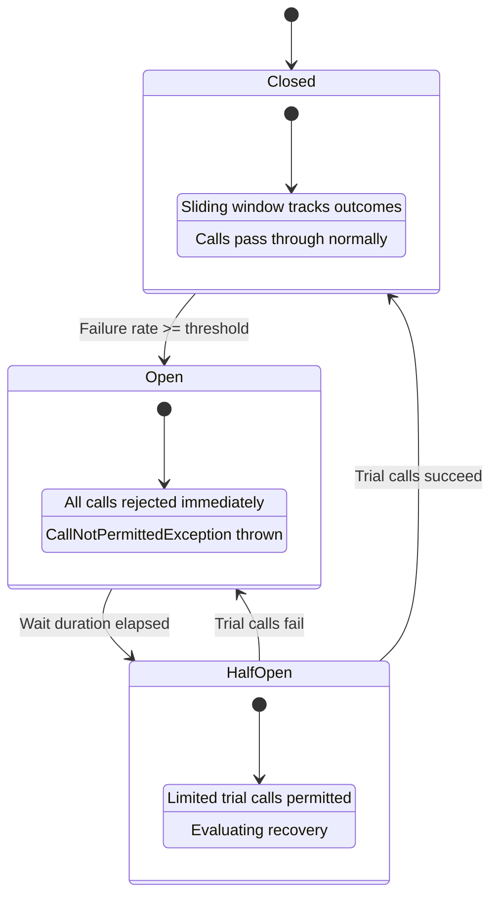
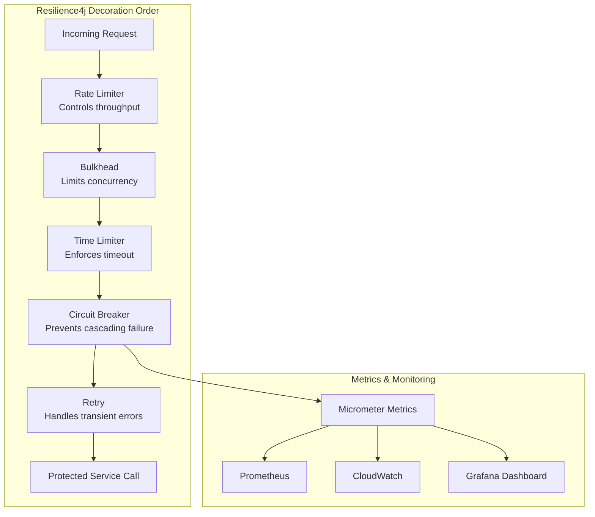
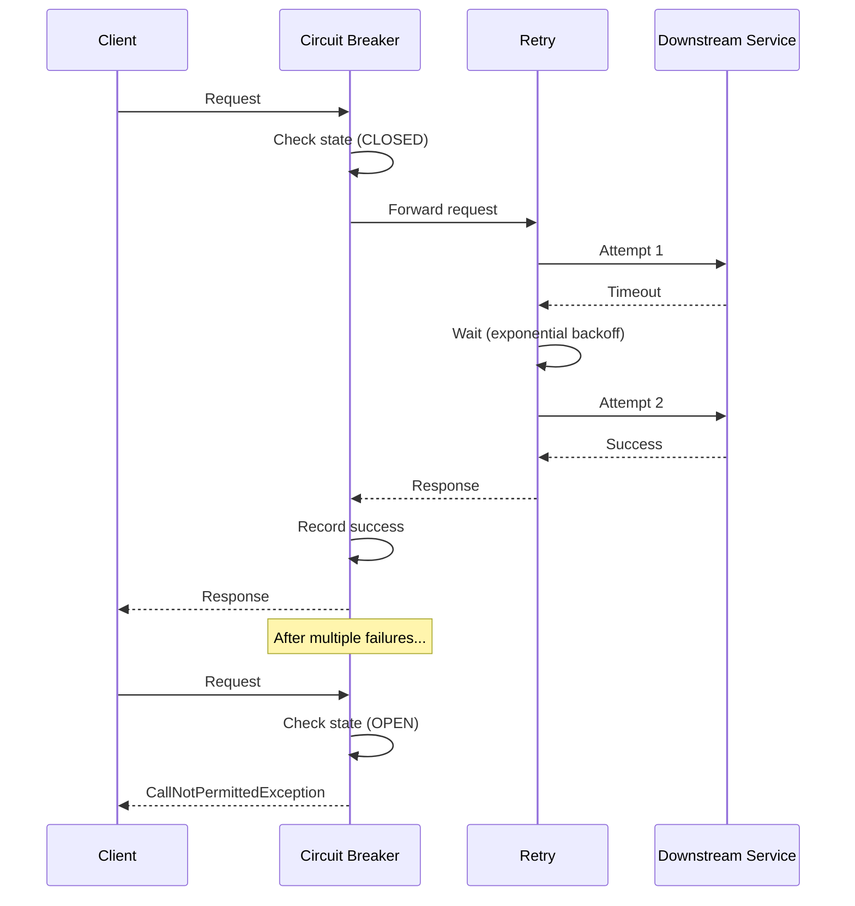

# Resilience4j

## Quick Reference

- Resilience4j is a lightweight, modular fault-tolerance library designed for Java and functional programming
- Core modules: CircuitBreaker, RateLimiter, Retry, Bulkhead, TimeLimiter
- Built on top of Vavr (functional library) with no external dependencies on other resilience frameworks
- Designed for Java 8+ with first-class support for functional interfaces, lambdas, and CompletableFuture
- Integrates natively with Spring Boot via `resilience4j-spring-boot3` starter
- Configuration via application.yml or programmatic builders with sensible defaults
- Decorators compose multiple resilience patterns around any functional interface (Supplier, Function, Runnable)
- Metrics export to Micrometer (Prometheus, CloudWatch, Datadog) out of the box
- Replaces Netflix Hystrix which entered maintenance mode in 2018

## When to Use

Resilience4j is the right choice when building microservices that communicate over unreliable networks and need protection against cascading failures. Use it when your service calls external APIs, databases, or downstream microservices that may become slow or unavailable. Circuit breakers prevent repeated calls to failing services, allowing them time to recover. Rate limiters protect your service from being overwhelmed by too many concurrent requests. Retry logic handles transient failures like network timeouts or temporary database connection issues. Bulkheads isolate different parts of your system so that a failure in one dependency does not exhaust resources needed by others. Time limiters enforce maximum wait times so that slow downstream calls do not block your threads indefinitely. Choose Resilience4j over Hystrix for new projects because it is actively maintained, has lower overhead, supports reactive programming with Project Reactor and RxJava, and provides a cleaner functional API without requiring thread pool isolation by default.

## Circuit Breakers

A circuit breaker monitors the success and failure rate of calls to a protected function and transitions between states to prevent cascading failures. In the closed state, all calls pass through normally and the circuit breaker records outcomes in a sliding window. When the failure rate exceeds a configured threshold (default 50%), the circuit breaker transitions to the open state, immediately rejecting all calls with a `CallNotPermittedException` without executing the protected function. After a configurable wait duration in the open state, the circuit breaker transitions to half-open, allowing a limited number of trial calls through. If those trial calls succeed at a rate above the threshold, the circuit breaker resets to closed. If they fail, it returns to open.

Resilience4j supports two sliding window types: count-based (tracks the last N calls) and time-based (tracks calls within the last N seconds). The count-based window is simpler and more predictable, while the time-based window adapts better to varying call rates. You can also configure slow call rate thresholds separately from failure rate thresholds, treating calls that exceed a duration threshold as slow even if they succeed.

```java
// Programmatic circuit breaker configuration
CircuitBreakerConfig config = CircuitBreakerConfig.custom()
    .failureRateThreshold(50)                     // Open when 50% of calls fail
    .slowCallRateThreshold(80)                    // Open when 80% of calls are slow
    .slowCallDurationThreshold(Duration.ofSeconds(2)) // Calls > 2s are "slow"
    .slidingWindowType(SlidingWindowType.COUNT_BASED)
    .slidingWindowSize(10)                        // Track last 10 calls
    .minimumNumberOfCalls(5)                      // Need at least 5 calls before evaluating
    .waitDurationInOpenState(Duration.ofSeconds(30)) // Wait 30s before half-open
    .permittedNumberOfCallsInHalfOpenState(3)     // Allow 3 trial calls
    .automaticTransitionFromOpenToHalfOpenEnabled(true)
    .recordExceptions(IOException.class, TimeoutException.class)
    .ignoreExceptions(BusinessException.class)    // Don't count business errors
    .build();

CircuitBreakerRegistry registry = CircuitBreakerRegistry.of(config);
CircuitBreaker circuitBreaker = registry.circuitBreaker("paymentService");

// Decorate a supplier
Supplier<PaymentResponse> decoratedSupplier = CircuitBreaker
    .decorateSupplier(circuitBreaker, () -> paymentClient.processPayment(request));

// Execute with fallback
Try<PaymentResponse> result = Try.ofSupplier(decoratedSupplier)
    .recover(CallNotPermittedException.class, e -> PaymentResponse.serviceUnavailable())
    .recover(IOException.class, e -> PaymentResponse.retryLater());
```

```yaml
# Spring Boot application.yml configuration
resilience4j:
  circuitbreaker:
    instances:
      paymentService:
        registerHealthIndicator: true
        slidingWindowSize: 10
        minimumNumberOfCalls: 5
        failureRateThreshold: 50
        slowCallRateThreshold: 80
        slowCallDurationThreshold: 2s
        waitDurationInOpenState: 30s
        permittedNumberOfCallsInHalfOpenState: 3
        automaticTransitionFromOpenToHalfOpenEnabled: true
        recordExceptions:
          - java.io.IOException
          - java.util.concurrent.TimeoutException
        ignoreExceptions:
          - com.example.BusinessException
```

## Rate Limiters

Rate limiters control the number of calls permitted within a time period, protecting services from being overwhelmed by bursts of traffic. Resilience4j implements a token bucket algorithm where tokens are replenished at a fixed rate. Each call consumes one token, and when no tokens are available, the caller either waits for the configured timeout duration or receives a `RequestNotPermitted` exception immediately.

Rate limiting is essential for protecting shared resources, enforcing API quotas, and preventing a single client from monopolizing service capacity. Unlike circuit breakers which react to failures, rate limiters proactively prevent overload before failures occur. You can apply rate limiters at the service boundary to protect downstream dependencies, or at the API gateway level to enforce per-client quotas.

The `limitForPeriod` setting defines how many calls are permitted in each `limitRefreshPeriod`. The `timeoutDuration` controls how long a thread will wait for permission before throwing an exception. Setting timeout to zero makes the rate limiter non-blocking, immediately rejecting excess calls.

```java
// Rate limiter configuration
RateLimiterConfig config = RateLimiterConfig.custom()
    .limitForPeriod(100)                    // 100 calls per period
    .limitRefreshPeriod(Duration.ofSeconds(1)) // Period = 1 second (100 RPS)
    .timeoutDuration(Duration.ofMillis(500))   // Wait up to 500ms for permission
    .build();

RateLimiterRegistry registry = RateLimiterRegistry.of(config);
RateLimiter rateLimiter = registry.rateLimiter("externalApi");

// Decorate a function
Function<SearchRequest, SearchResponse> decoratedSearch = RateLimiter
    .decorateFunction(rateLimiter, request -> searchClient.search(request));

// Use with Spring annotation
@RateLimiter(name = "externalApi", fallbackMethod = "searchFallback")
public SearchResponse search(SearchRequest request) {
    return searchClient.search(request);
}

public SearchResponse searchFallback(SearchRequest request, RequestNotPermitted ex) {
    return SearchResponse.cached(cacheService.getLastResult(request));
}
```

## Retry

The retry module automatically retries failed operations with configurable backoff strategies, handling transient failures that resolve themselves after a short delay. Resilience4j retry supports fixed wait intervals, exponential backoff, and randomized intervals to avoid thundering herd problems when multiple instances retry simultaneously.

You configure which exceptions trigger a retry and which should propagate immediately. For example, a `SocketTimeoutException` is worth retrying because the network may recover, but a `ValidationException` indicates a permanent problem that retrying will not fix. You can also configure retry based on the result of the call, retrying when the response indicates a transient error (like HTTP 503) even though no exception was thrown.

Exponential backoff with jitter is the recommended strategy for production systems. It spaces out retries exponentially (1s, 2s, 4s, 8s) and adds random jitter to prevent synchronized retry storms across multiple service instances. The `IntervalBiFunction` interface allows custom backoff logic based on the attempt number and the last exception or result.

```java
// Retry with exponential backoff and jitter
RetryConfig config = RetryConfig.custom()
    .maxAttempts(4)                              // Initial call + 3 retries
    .waitDuration(Duration.ofMillis(500))        // Base wait duration
    .intervalFunction(IntervalFunction.ofExponentialRandomBackoff(
        Duration.ofMillis(500),                  // Initial interval
        2.0,                                     // Multiplier
        Duration.ofSeconds(10)                   // Max interval cap
    ))
    .retryOnResult(response -> response.getStatusCode() == 503)
    .retryExceptions(IOException.class, TimeoutException.class)
    .ignoreExceptions(ValidationException.class, AuthenticationException.class)
    .failAfterMaxAttempts(true)                  // Throw MaxRetriesExceededException
    .build();

RetryRegistry registry = RetryRegistry.of(config);
Retry retry = registry.retry("inventoryService");

// Decorate and execute
Supplier<InventoryResponse> retryableSupplier = Retry
    .decorateSupplier(retry, () -> inventoryClient.checkStock(productId));

// Combine with circuit breaker (retry wraps circuit breaker)
Supplier<InventoryResponse> resilientSupplier = Decorators.ofSupplier(
        () -> inventoryClient.checkStock(productId))
    .withRetry(retry)
    .withCircuitBreaker(circuitBreaker)
    .decorate();
```

## Bulkhead

Bulkheads isolate different parts of your application so that a failure or resource exhaustion in one area does not cascade to others. The name comes from ship construction where watertight compartments prevent a hull breach from sinking the entire vessel. Resilience4j provides two bulkhead implementations: semaphore-based and thread pool-based.

The semaphore bulkhead limits the number of concurrent calls to a protected function. When the maximum concurrent calls are reached, additional callers either wait for the configured timeout or receive a `BulkheadFullException`. This is lightweight and does not require separate thread pools, making it suitable for most use cases.

The thread pool bulkhead executes calls in a dedicated thread pool, providing stronger isolation because the calling thread is not blocked. It returns a `CompletableFuture` and is ideal when you need to protect your main thread pool from being exhausted by slow downstream calls. The thread pool bulkhead also provides a queue for excess requests, allowing brief bursts above the core pool size.

Use bulkheads when your service has multiple downstream dependencies with different reliability characteristics. For example, if your order service calls both a payment service and a notification service, a bulkhead ensures that a slow notification service cannot consume all threads and prevent payment processing.

```java
// Semaphore bulkhead configuration
BulkheadConfig semaphoreConfig = BulkheadConfig.custom()
    .maxConcurrentCalls(25)                     // Max 25 concurrent calls
    .maxWaitDuration(Duration.ofMillis(200))    // Wait up to 200ms for permission
    .build();

Bulkhead bulkhead = Bulkhead.of("paymentService", semaphoreConfig);

// Thread pool bulkhead configuration
ThreadPoolBulkheadConfig threadPoolConfig = ThreadPoolBulkheadConfig.custom()
    .maxThreadPoolSize(10)                      // Max 10 threads
    .coreThreadPoolSize(5)                      // Core 5 threads
    .queueCapacity(20)                          // Queue up to 20 requests
    .keepAliveDuration(Duration.ofSeconds(30))  // Idle thread timeout
    .build();

ThreadPoolBulkhead threadPoolBulkhead = ThreadPoolBulkhead.of("notificationService", threadPoolConfig);

// Execute with thread pool bulkhead (returns CompletableFuture)
CompletableFuture<NotificationResult> future = threadPoolBulkhead.executeSupplier(
    () -> notificationClient.sendEmail(notification)
);

// Spring Boot annotation
@Bulkhead(name = "paymentService", fallbackMethod = "paymentFallback", type = Bulkhead.Type.SEMAPHORE)
public PaymentResponse processPayment(PaymentRequest request) {
    return paymentClient.charge(request);
}
```

## Time Limiter

The time limiter enforces a maximum execution duration for asynchronous operations, preventing slow calls from blocking threads indefinitely. It wraps a `CompletableFuture` or `CompletionStage` and cancels the operation if it does not complete within the configured timeout. When the timeout expires, the caller receives a `TimeoutException` and the underlying future is cancelled.

Time limiters are critical for maintaining responsiveness in systems where downstream services may become unresponsive without explicitly failing. Without a time limiter, a thread waiting on a hung connection can be blocked for minutes (depending on TCP timeout settings), consuming resources and degrading the overall system. The time limiter provides a predictable upper bound on call duration regardless of network-level timeout configurations.

In Spring Boot applications, the time limiter integrates with `@Async` methods and reactive types. It is commonly combined with a circuit breaker so that timeouts count as failures toward the circuit breaker threshold. The `cancelRunningFuture` option controls whether the underlying operation is interrupted when the timeout fires, which is important for operations that hold database connections or other resources.

```java
// Time limiter configuration
TimeLimiterConfig config = TimeLimiterConfig.custom()
    .timeoutDuration(Duration.ofSeconds(3))     // Max 3 seconds
    .cancelRunningFuture(true)                  // Cancel the future on timeout
    .build();

TimeLimiterRegistry registry = TimeLimiterRegistry.of(config);
TimeLimiter timeLimiter = registry.timeLimiter("reportService");

// Decorate a CompletableFuture supplier
Supplier<CompletableFuture<Report>> futureSupplier =
    () -> CompletableFuture.supplyAsync(() -> reportService.generateReport(params));

Callable<Report> decoratedCall = TimeLimiter.decorateCompletionStage(
    timeLimiter, scheduledExecutor, futureSupplier).toCompletableFuture()::get;

// Combined with circuit breaker in Spring Boot
@TimeLimiter(name = "reportService")
@CircuitBreaker(name = "reportService", fallbackMethod = "reportFallback")
public CompletableFuture<Report> generateReport(ReportParams params) {
    return CompletableFuture.supplyAsync(() -> reportService.generate(params));
}

public CompletableFuture<Report> reportFallback(ReportParams params, TimeoutException ex) {
    return CompletableFuture.completedFuture(Report.cachedOrEmpty(params));
}
```

## Architecture and Diagrams







## Common Pitfalls

1. **Incorrect decoration order**: The order in which you compose resilience patterns matters significantly. Retry should be the innermost decorator (closest to the service call) and rate limiter the outermost. If you place retry outside the circuit breaker, retries will be rejected when the circuit is open. The recommended order from outer to inner is: Rate Limiter, Bulkhead, Time Limiter, Circuit Breaker, Retry.

2. **Retrying non-idempotent operations**: Automatically retrying POST requests or payment operations can cause duplicate side effects. Only enable retry for idempotent operations (GET, PUT with idempotency keys) or implement deduplication on the server side. Configure `ignoreExceptions` for errors that indicate the operation already succeeded.

3. **Circuit breaker window too small**: A sliding window of 5 calls means a single failure represents 20% failure rate. This causes premature circuit opening during normal operation. Use at least 10-20 calls in the window and set `minimumNumberOfCalls` to prevent evaluation before sufficient data is collected.

4. **Missing fallback methods**: When a circuit breaker opens or a bulkhead is full, the exception propagates to the caller without a meaningful response. Always implement fallback methods that return cached data, default values, or graceful degradation responses rather than exposing raw infrastructure exceptions to clients.

5. **Thread pool bulkhead starvation**: If the queue capacity is too large, requests pile up during outages and all execute simultaneously when the service recovers, potentially causing another failure. Keep queue sizes small and prefer failing fast over queuing indefinitely.

## Real-World Use Cases

- **Payment gateway protection**: An e-commerce platform wraps payment provider calls with a circuit breaker (50% failure threshold, 30s open duration) and retry (3 attempts with exponential backoff). When the payment provider experiences downtime, the circuit opens and customers see a "try again later" message instead of hanging requests, while the retry handles transient network blips transparently.

- **Multi-tenant API rate limiting**: A SaaS platform applies per-tenant rate limiters to downstream service calls, ensuring that one tenant's traffic spike does not degrade service for others. Each tenant gets a dedicated rate limiter instance with limits proportional to their subscription tier.

- **Microservice bulkhead isolation**: An order orchestration service calls payment, inventory, and notification services. Each dependency gets its own semaphore bulkhead (payment: 50 concurrent, inventory: 30, notifications: 10). When the notification service becomes slow, only its bulkhead fills up while payment and inventory processing continue unaffected.

- **Report generation time limiting**: A dashboard service generates complex reports by aggregating data from multiple sources. A 5-second time limiter ensures that slow queries do not block the response thread, returning a partial or cached report instead of timing out the entire HTTP request.

## Interview Questions

**Q: How does a circuit breaker differ from a retry mechanism?**
A: A retry handles transient failures by repeating the operation, assuming the next attempt may succeed. A circuit breaker prevents calls entirely when a service is determined to be unhealthy, giving it time to recover. They complement each other: retry handles brief glitches while the circuit breaker prevents retry storms against a truly failed service. The circuit breaker uses failure rate statistics over a window to make state decisions, while retry acts on individual call outcomes.

**Q: What is the bulkhead pattern and why is it important in microservices?**
A: The bulkhead pattern isolates resources (threads, connections, memory) for different service dependencies so that one failing dependency cannot exhaust resources needed by others. Named after ship compartments that prevent flooding from spreading, it ensures that a slow or failing downstream service only affects its allocated resource pool. Without bulkheads, a single slow dependency can consume all available threads, causing the entire service to become unresponsive.

**Q: Explain the difference between semaphore and thread pool bulkheads.**
A: A semaphore bulkhead limits concurrent access using a counter on the calling thread, blocking or rejecting when the limit is reached. It is lightweight but the calling thread remains blocked during execution. A thread pool bulkhead executes work on a dedicated thread pool, returning a CompletableFuture immediately. It provides stronger isolation since the calling thread is freed, but adds overhead from thread context switching and requires async programming patterns.

**Q: How would you configure Resilience4j for a service that experiences frequent short outages?**
A: Use a count-based sliding window (10-20 calls) with a moderate failure threshold (50-60%), short wait duration in open state (10-15 seconds), and 3-5 permitted calls in half-open state. Combine with retry using exponential backoff (starting at 200ms, max 5 seconds) for 3 attempts. This configuration quickly detects outages, gives the service brief recovery time, and handles transient failures through retry without overwhelming the recovering service.

## Production Tips

- **Metrics and alerting**: Export circuit breaker state transitions and failure rates to your monitoring system via Micrometer. Alert on circuit breaker state changes (closed to open) as these indicate downstream service degradation. Track `resilience4j_circuitbreaker_state`, `resilience4j_circuitbreaker_failure_rate`, and `resilience4j_retry_calls_total` metrics.

- **Configuration tuning**: Start with conservative settings (lower thresholds, shorter timeouts) and tune based on production traffic patterns. Use Spring Boot Actuator endpoints (`/actuator/circuitbreakers`, `/actuator/ratelimiters`) to inspect current state and metrics without redeploying.

- **Fallback strategy hierarchy**: Implement tiered fallbacks: first try a cached response, then a degraded response with partial data, and finally a static default. Never let infrastructure exceptions (CallNotPermittedException, BulkheadFullException) reach the end user.

- **Testing resilience patterns**: Use chaos engineering tools (Chaos Monkey for Spring Boot, Toxiproxy) to inject failures and verify that circuit breakers open, retries fire, and fallbacks activate correctly. Include resilience integration tests in your CI pipeline that simulate downstream failures.

- **Shared vs dedicated instances**: Use dedicated circuit breaker instances per downstream endpoint rather than sharing one across all calls to a service. A failing `/payments` endpoint should not open the circuit for `/refunds` if they use different infrastructure paths.

## Related Topics

- [Spring Framework](./spring-framework.md) - Resilience4j integrates natively with Spring Boot via starters and annotations
- [Apache Kafka](./apache-kafka.md) - Kafka consumers benefit from retry and circuit breaker patterns for processing failures
- [Java](./java.md) - Resilience4j leverages Java functional interfaces, CompletableFuture, and lambda expressions
