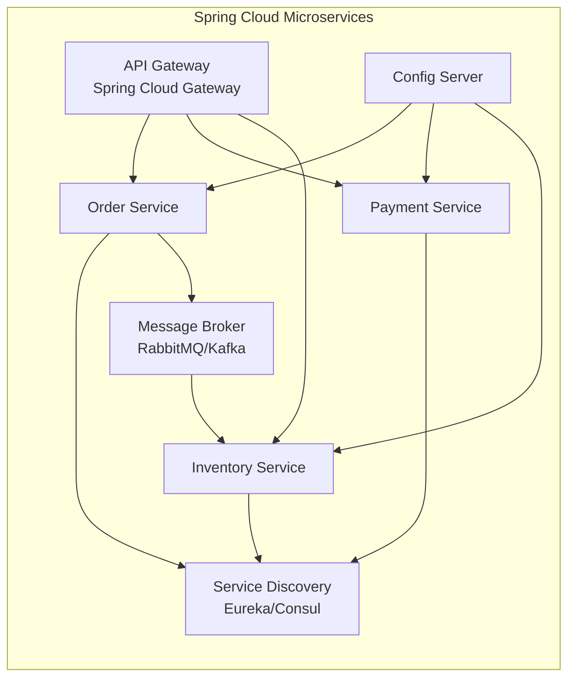

# Spring Framework

## Quick Reference

- Spring is a comprehensive Java framework built on Inversion of Control (IoC) and Dependency Injection (DI)
- Spring Boot provides opinionated defaults, embedded servers, and auto-configuration for rapid development
- Key modules: Core (IoC/DI), MVC (web), Data JPA (persistence), Security (auth), Cloud (distributed systems)
- Bean scopes: `singleton` (default), `prototype`, `request`, `session`, `application`
- Profiles enable environment-specific configuration (`@Profile("dev")`, `spring.profiles.active`)
- Spring Boot Actuator exposes health checks, metrics, and management endpoints
- Spring Cloud provides service discovery, circuit breakers, config server, and API gateway patterns

## When to Use

Spring Framework is the standard choice for enterprise Java applications requiring dependency injection, declarative transaction management, and a modular architecture. Use Spring Boot when you need rapid application development with production-ready defaults including embedded Tomcat/Netty, health checks, and externalized configuration. Spring is ideal for microservice architectures where you need service discovery (Eureka/Consul), resilience patterns (Resilience4j), distributed tracing (Micrometer/Zipkin), and centralized configuration. Choose Spring when your team values convention over configuration, extensive documentation, and a mature ecosystem with solutions for nearly every enterprise integration pattern. Spring's annotation-driven programming model reduces boilerplate significantly compared to Java EE, while its comprehensive testing support (MockMvc, TestContainers integration, slice tests) enables confident refactoring and continuous delivery. The framework's modular design means you only include what you need, avoiding the bloat of monolithic application servers.

## Code Examples

### Spring Boot Application with REST API

```java
@SpringBootApplication
public class OrderServiceApplication {
    public static void main(String[] args) {
        SpringApplication.run(OrderServiceApplication.class, args);
    }
}

@RestController
@RequestMapping("/api/v1/orders")
@RequiredArgsConstructor
public class OrderController {

    private final OrderService orderService;

    @PostMapping
    @ResponseStatus(HttpStatus.CREATED)
    public OrderResponse createOrder(@Valid @RequestBody CreateOrderRequest request) {
        return orderService.createOrder(request);
    }

    @GetMapping("/{orderId}")
    public OrderResponse getOrder(@PathVariable UUID orderId) {
        return orderService.findById(orderId)
            .orElseThrow(() -> new OrderNotFoundException(orderId));
    }

    @GetMapping
    public Page<OrderResponse> listOrders(
            @RequestParam(defaultValue = "0") int page,
            @RequestParam(defaultValue = "20") int size) {
        return orderService.findAll(PageRequest.of(page, size));
    }
}
```

### Dependency Injection and Configuration

```java
@Configuration
public class AppConfig {

    @Bean
    @Profile("production")
    public DataSource productionDataSource(
            @Value("${db.url}") String url,
            @Value("${db.username}") String username,
            @Value("${db.password}") String password) {
        HikariConfig config = new HikariConfig();
        config.setJdbcUrl(url);
        config.setUsername(username);
        config.setPassword(password);
        config.setMaximumPoolSize(20);
        config.setConnectionTimeout(30000);
        return new HikariDataSource(config);
    }

    @Bean
    public RestTemplate restTemplate(RestTemplateBuilder builder) {
        return builder
            .setConnectTimeout(Duration.ofSeconds(5))
            .setReadTimeout(Duration.ofSeconds(10))
            .build();
    }
}

@Service
@Transactional
@RequiredArgsConstructor
public class OrderService {

    private final OrderRepository orderRepository;
    private final PaymentClient paymentClient;
    private final EventPublisher eventPublisher;

    public OrderResponse createOrder(CreateOrderRequest request) {
        Order order = Order.from(request);
        order = orderRepository.save(order);
        paymentClient.processPayment(order.getPaymentDetails());
        eventPublisher.publish(new OrderCreatedEvent(order));
        return OrderResponse.from(order);
    }
}
```

### Spring Security Configuration

```java
@Configuration
@EnableWebSecurity
public class SecurityConfig {

    @Bean
    public SecurityFilterChain filterChain(HttpSecurity http) throws Exception {
        return http
            .csrf(csrf -> csrf.disable())
            .sessionManagement(session ->
                session.sessionCreationPolicy(SessionCreationPolicy.STATELESS))
            .authorizeHttpRequests(auth -> auth
                .requestMatchers("/api/public/**").permitAll()
                .requestMatchers("/actuator/health").permitAll()
                .requestMatchers("/api/admin/**").hasRole("ADMIN")
                .anyRequest().authenticated())
            .oauth2ResourceServer(oauth2 ->
                oauth2.jwt(jwt -> jwt.jwtAuthenticationConverter(jwtConverter())))
            .build();
    }
}
```

### Spring Data JPA Repository

```java
@Entity
@Table(name = "orders")
public class Order {
    @Id
    @GeneratedValue(strategy = GenerationType.UUID)
    private UUID id;

    @Enumerated(EnumType.STRING)
    private OrderStatus status;

    @OneToMany(cascade = CascadeType.ALL, orphanRemoval = true)
    private List<OrderItem> items = new ArrayList<>();

    @CreatedDate
    private Instant createdAt;
}

public interface OrderRepository extends JpaRepository<Order, UUID> {

    @Query("SELECT o FROM Order o WHERE o.status = :status AND o.createdAt > :since")
    Page<Order> findRecentByStatus(
        @Param("status") OrderStatus status,
        @Param("since") Instant since,
        Pageable pageable);

    @Modifying
    @Query("UPDATE Order o SET o.status = :status WHERE o.id = :id")
    int updateStatus(@Param("id") UUID id, @Param("status") OrderStatus status);
}
```

## Architecture and Diagrams

```mermaid
graph TB
    subgraph "Spring Boot Application"
        CONTROLLER[Controller Layer<br/>@RestController]
        SERVICE[Service Layer<br/>@Service @Transactional]
        REPO[Repository Layer<br/>@Repository]
        
        CONTROLLER --> SERVICE
        SERVICE --> REPO
        REPO --> DB[(Database)]
    end
    
    subgraph "Spring IoC Container"
        CTX[ApplicationContext]
        CTX --> BEANS[Bean Definitions]
        CTX --> AOP[AOP Proxies]
        CTX --> EVT[Event System]
    end
    
    subgraph "Cross-Cutting Concerns"
        SEC[Spring Security<br/>Filter Chain]
        TX[Transaction Manager<br/>@Transactional]
        CACHE[Cache Abstraction<br/>@Cacheable]
        VALID[Validation<br/>@Valid]
    end
    
    SEC --> CONTROLLER
    TX --> SERVICE
    CACHE --> SERVICE
    VALID --> CONTROLLER
```



## Common Pitfalls

1. **Circular dependencies**: Two beans depending on each other causes startup failures. Resolve by using `@Lazy`, setter injection instead of constructor injection, or redesigning the dependency graph to eliminate cycles.

2. **N+1 query problem**: JPA lazy loading triggers individual queries for each related entity. Use `@EntityGraph`, `JOIN FETCH` in JPQL, or batch fetching (`@BatchSize`) to load associations efficiently.

3. **Transaction propagation misunderstanding**: Calling a `@Transactional` method from within the same class bypasses the proxy, so the transaction annotation has no effect. Extract the method to a separate bean or use `self-injection` patterns.

4. **Bean scope mismatch**: Injecting a prototype-scoped bean into a singleton results in the same prototype instance being reused. Use `ObjectProvider<T>` or `@Scope(proxyMode = ScopedProxyMode.TARGET_CLASS)` to get fresh instances.

5. **Auto-configuration conflicts**: Multiple auto-configurations can conflict when dependencies overlap. Use `@ConditionalOnMissingBean`, explicit exclusions (`@SpringBootApplication(exclude = {...})`), or property-based feature flags to control which configurations activate.

## Real-World Use Cases

- **Enterprise microservices**: Spring Boot with Spring Cloud provides a complete platform for building distributed systems with service discovery, circuit breakers, distributed tracing, and centralized configuration management at scale. Companies like Netflix, Alibaba, and major banks run hundreds of Spring Boot microservices handling millions of transactions daily, relying on Spring's production-ready actuator endpoints for health monitoring and graceful degradation.

- **Event-driven architectures**: Spring Integration and Spring Cloud Stream enable building event-driven systems that connect to Kafka, RabbitMQ, or AWS SNS/SQS with minimal boilerplate and declarative binding configuration. The programming model abstracts away broker-specific details, allowing teams to switch messaging infrastructure without changing application code.

- **Batch processing**: Spring Batch handles large-scale data processing jobs with built-in support for chunked processing, retry/skip policies, job scheduling, and restartability for ETL pipelines and report generation. Its chunk-oriented processing model efficiently handles millions of records with configurable commit intervals and fault tolerance.

- **API gateways**: Spring Cloud Gateway provides a reactive, non-blocking API gateway with route predicates, filters for rate limiting, authentication, and request/response transformation. It integrates natively with service discovery and circuit breakers for resilient routing across microservice deployments.

- **Reactive systems**: Spring WebFlux with Project Reactor enables building non-blocking, backpressure-aware applications that handle thousands of concurrent connections with minimal thread usage, ideal for real-time streaming APIs, WebSocket servers, and high-concurrency proxy services.

## Interview Questions

**Q: Explain the difference between `@Component`, `@Service`, `@Repository`, and `@Controller`.**
A: All are specializations of `@Component` and trigger component scanning. `@Service` indicates business logic (no additional behavior). `@Repository` enables exception translation from persistence-specific exceptions to Spring's `DataAccessException`. `@Controller` marks MVC controllers for request mapping. The distinction is semantic for code clarity and enables targeted AOP advice.

**Q: How does Spring handle transactions with `@Transactional`?**
A: Spring creates a proxy around the bean that intercepts method calls. On entry, it begins a transaction (or joins an existing one based on propagation settings). On normal return, it commits. On unchecked exception, it rolls back (configurable via `rollbackFor`). The proxy uses either JDK dynamic proxies (interface-based) or CGLIB (class-based subclassing).

**Q: What is the difference between Spring MVC and Spring WebFlux?**
A: Spring MVC uses a thread-per-request model with blocking I/O, suitable for traditional CRUD applications. Spring WebFlux uses a reactive, non-blocking model with Project Reactor (Mono/Flux), handling many concurrent connections with fewer threads. WebFlux is ideal for streaming, high-concurrency scenarios, and integration with reactive datastores.

**Q: How does Spring Boot auto-configuration work?**
A: Spring Boot scans `META-INF/spring/org.springframework.boot.autoconfigure.AutoConfiguration.imports` for configuration classes. Each class uses `@Conditional` annotations (e.g., `@ConditionalOnClass`, `@ConditionalOnMissingBean`) to activate only when specific conditions are met. This allows libraries to provide sensible defaults that activate automatically when their dependencies are on the classpath.

## Production Tips

- **Actuator security**: Never expose all actuator endpoints publicly. Use `management.endpoints.web.exposure.include=health,info,metrics` and secure sensitive endpoints (heapdump, env, configprops) behind authentication. In Kubernetes deployments, expose health and readiness probes on a separate management port (`management.server.port`) that is not accessible through the ingress.

- **Connection pool monitoring**: Configure HikariCP metrics export to Micrometer. Alert on `hikaricp_connections_pending` > 0 sustained for more than 30 seconds, which indicates pool exhaustion and potential thread starvation. Set `hikaricp.connection-timeout` to fail fast rather than blocking indefinitely when the pool is exhausted.

- **Graceful shutdown**: Enable `server.shutdown=graceful` with `spring.lifecycle.timeout-per-shutdown-phase=30s` to allow in-flight requests to complete before the application stops, preventing 502 errors during deployments. Combine with Kubernetes preStop hooks to ensure the pod is removed from service discovery before shutdown begins.

- **Profile-based configuration**: Use `application-{profile}.yml` files for environment-specific settings. Never store secrets in config files; use environment variables, Vault, or AWS Secrets Manager with Spring Cloud Config. Leverage `@ConfigurationProperties` with validation annotations to fail fast on misconfiguration at startup.

- **Performance tuning**: Configure Tomcat thread pool size based on expected concurrency (`server.tomcat.threads.max`). Enable response compression (`server.compression.enabled=true`) for JSON APIs. Use `@Async` with custom executors for background tasks, and configure `spring.task.execution.pool.*` properties to control thread pool behavior for async operations.

## Related Topics

- [Java](./java.md) - The language foundation for Spring Framework
- [Apache Kafka](./apache-kafka.md) - Event streaming platform commonly integrated with Spring Cloud Stream
- [MongoDB](./mongodb.md) - NoSQL database with Spring Data MongoDB support
- [Resilience4j](./resilience4j.md) - Fault tolerance library with native Spring Boot integration
