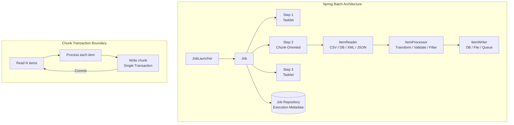
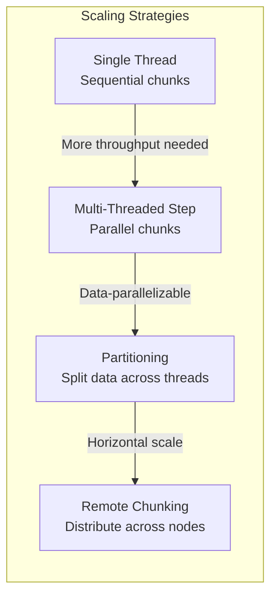
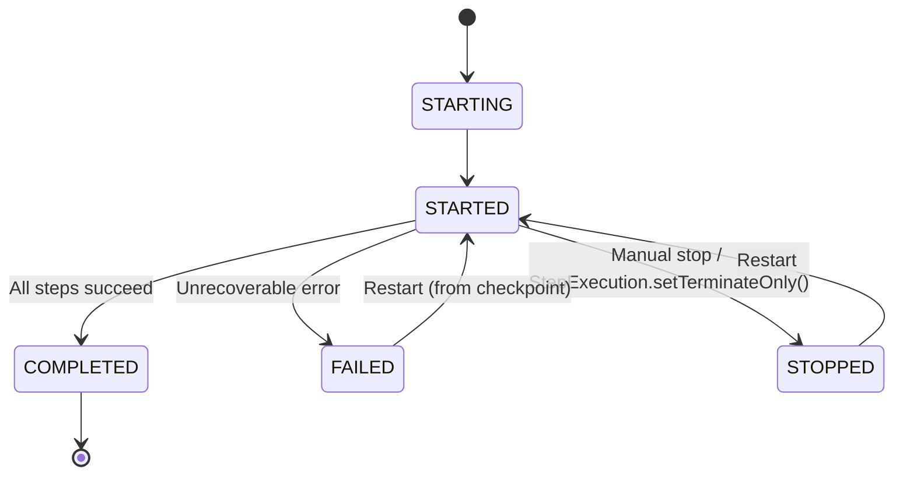

# Spring Batch

## Quick Reference

- Spring Batch is a lightweight framework for robust, scalable batch processing in Java built on top of Spring Framework
- Core abstraction: Job → Step → (Tasklet | Chunk<Reader, Processor, Writer>)
- Chunk-oriented processing: read N items → process each → write all in one transaction (commit-interval = chunk size)
- Job Repository stores execution metadata (status, parameters, read/write counts) in `BATCH_JOB_INSTANCE`, `BATCH_JOB_EXECUTION`, `BATCH_STEP_EXECUTION` tables
- Fault tolerance: `skip(Exception.class).skipLimit(10)`, `retry(Exception.class).retryLimit(3)`, restartable jobs resume from last checkpoint
- Scaling strategies: multithreaded steps, partitioning (split data across threads/nodes), remote chunking (distribute processing)
- Spring Batch is NOT a scheduler — use Cron, Quartz, Kubernetes CronJobs, or `@Scheduled` to trigger jobs

## When to Use

Spring Batch is the standard choice for Java-based batch processing where you need to process large volumes of data reliably with transaction management, restart capability, and skip/retry logic. Use Spring Batch when your business requires scheduled ETL pipelines, data migration between systems, report generation from large datasets, or periodic data cleanup jobs. It excels when processing millions of records where chunk-oriented processing keeps memory usage bounded and transactions manageable. Spring Batch provides the infrastructure for reading from diverse sources (databases, files, message queues, APIs), applying business transformations, and writing to multiple destinations in a single coordinated job. Choose Spring Batch over custom scripts when you need production-grade features like job restartability after failures, detailed execution auditing, skip policies for bad records, and the ability to scale horizontally via partitioning. The framework integrates naturally with Spring Boot for auto-configuration, Spring Data for database access, and Spring Integration for event-driven batch triggers.

## Code Examples

### Complete Job Configuration with Chunk Processing (Spring Batch 5.x / Spring Boot 3.x)

```java
@Configuration
@EnableBatchProcessing
public class ImportJobConfig {

    private final JobRepository jobRepository;
    private final PlatformTransactionManager transactionManager;

    public ImportJobConfig(JobRepository jobRepository,
                           PlatformTransactionManager transactionManager) {
        this.jobRepository = jobRepository;
        this.transactionManager = transactionManager;
    }

    @Bean
    public Job importCustomerJob(Step importStep, Step notificationStep) {
        return new JobBuilder("importCustomerJob", jobRepository)
                .incrementer(new RunIdIncrementer())
                .validator(new DefaultJobParametersValidator(
                    new String[]{"inputFile"}, new String[]{}))
                .start(importStep)
                .next(notificationStep)
                .listener(new JobCompletionListener())
                .build();
    }

    @Bean
    public Step importStep(ItemReader<CustomerRecord> reader,
                           ItemProcessor<CustomerRecord, Customer> processor,
                           ItemWriter<Customer> writer) {
        return new StepBuilder("importStep", jobRepository)
                .<CustomerRecord, Customer>chunk(100, transactionManager)
                .reader(reader)
                .processor(processor)
                .writer(writer)
                .faultTolerant()
                .skip(FlatFileParseException.class)
                .skipLimit(50)
                .retry(DeadlockLoserDataAccessException.class)
                .retryLimit(3)
                .listener(new StepMetricsListener())
                .build();
    }

    @Bean
    public Step notificationStep(Tasklet notificationTasklet) {
        return new StepBuilder("notificationStep", jobRepository)
                .tasklet(notificationTasklet, transactionManager)
                .build();
    }
}
```

### ItemReader, Processor, and Writer Implementations

```java
@Bean
@StepScope
public FlatFileItemReader<CustomerRecord> csvReader(
        @Value("#{jobParameters['inputFile']}") Resource inputFile) {
    return new FlatFileItemReaderBuilder<CustomerRecord>()
            .name("customerCsvReader")
            .resource(inputFile)
            .linesToSkip(1) // skip header
            .delimited()
            .delimiter(",")
            .names("id", "name", "email", "phone", "createdDate")
            .fieldSetMapper(new BeanWrapperFieldSetMapper<>() {{
                setTargetType(CustomerRecord.class);
            }})
            .build();
}

@Component
public class CustomerProcessor implements ItemProcessor<CustomerRecord, Customer> {

    private final CustomerRepository repository;

    public CustomerProcessor(CustomerRepository repository) {
        this.repository = repository;
    }

    @Override
    public Customer process(CustomerRecord record) throws Exception {
        // Return null to filter out invalid records
        if (record.getEmail() == null || record.getEmail().isBlank()) {
            return null;
        }
        // Skip duplicates
        if (repository.existsByEmail(record.getEmail())) {
            return null;
        }
        // Transform to domain entity
        Customer customer = new Customer();
        customer.setName(record.getName().trim().toUpperCase());
        customer.setEmail(record.getEmail().toLowerCase());
        customer.setPhone(record.getPhone());
        customer.setImportedAt(LocalDateTime.now());
        return customer;
    }
}

@Bean
public JdbcBatchItemWriter<Customer> jdbcWriter(DataSource dataSource) {
    return new JdbcBatchItemWriterBuilder<Customer>()
            .dataSource(dataSource)
            .sql("INSERT INTO customers (name, email, phone, imported_at) " +
                 "VALUES (:name, :email, :phone, :importedAt)")
            .beanMapped()
            .build();
}
```

### Conditional Job Flow with Decider

```java
@Bean
public Job conditionalJob(Step extractStep, Step transformStep,
                          Step errorStep, Step loadStep) {
    return new JobBuilder("conditionalJob", jobRepository)
            .start(extractStep)
                .on("FAILED").to(errorStep)
            .from(extractStep)
                .on("*").to(decider())
            .from(decider())
                .on("WEEKDAY").to(transformStep)
            .from(decider())
                .on("WEEKEND").to(loadStep)
            .end()
            .build();
}

@Bean
public JobExecutionDecider decider() {
    return (jobExecution, stepExecution) -> {
        DayOfWeek day = LocalDate.now().getDayOfWeek();
        String result = (day == DayOfWeek.SATURDAY || day == DayOfWeek.SUNDAY)
                ? "WEEKEND" : "WEEKDAY";
        return new FlowExecutionStatus(result);
    };
}
```

### Partitioned Step for Parallel Processing

```java
@Bean
public Step partitionedStep(Step workerStep, Partitioner partitioner) {
    return new StepBuilder("partitionedStep", jobRepository)
            .partitioner("workerStep", partitioner)
            .step(workerStep)
            .gridSize(4) // number of partitions
            .taskExecutor(new SimpleAsyncTaskExecutor())
            .build();
}

@Bean
public Partitioner rangePartitioner() {
    return gridSize -> {
        Map<String, ExecutionContext> partitions = new HashMap<>();
        long totalRecords = customerRepository.count();
        long partitionSize = totalRecords / gridSize;

        for (int i = 0; i < gridSize; i++) {
            ExecutionContext context = new ExecutionContext();
            context.putLong("minId", i * partitionSize + 1);
            context.putLong("maxId", (i + 1) * partitionSize);
            partitions.put("partition" + i, context);
        }
        return partitions;
    };
}
```

### Job Launcher via REST Endpoint

```java
@RestController
@RequestMapping("/api/jobs")
public class JobController {

    private final JobLauncher jobLauncher;
    private final Job importCustomerJob;

    @PostMapping("/import")
    public ResponseEntity<JobExecutionResponse> launchImport(
            @RequestParam String inputFile) throws Exception {
        JobParameters params = new JobParametersBuilder()
                .addString("inputFile", inputFile)
                .addLong("timestamp", System.currentTimeMillis())
                .toJobParameters();

        JobExecution execution = jobLauncher.run(importCustomerJob, params);

        return ResponseEntity.accepted().body(new JobExecutionResponse(
                execution.getId(),
                execution.getStatus().toString(),
                execution.getStartTime()));
    }
}
```

## Architecture / Diagrams







## Common Pitfalls

1. **Chunk size too large or too small**: A chunk size of 1 means one transaction per record (slow due to commit overhead). A chunk size of 10,000 means one massive transaction that holds locks and risks OOM. Start with 100-500 items per chunk, measure throughput, and tune based on your data size and transaction duration. Monitor `spring.batch.step.execution.write.count` metrics.

2. **Not making jobs restartable**: If a job processes 1 million records and fails at record 600,000, you want to restart from 600,001, not from the beginning. Ensure your Job Repository uses a persistent database (not in-memory), and that your readers support restart (cursor-based readers track position automatically). Test restart behavior explicitly.

3. **Self-invocation bypassing Spring proxies**: Calling a `@StepScope` or `@JobScope` bean method from within the same class bypasses the proxy, so late binding of job parameters fails. Always inject scoped beans from a different Spring-managed bean. This is the same proxy limitation as `@Transactional` and `@Cacheable`.

4. **Ignoring skip and retry interaction**: If you configure both skip and retry for the same exception, Spring Batch retries first, then skips if retries are exhausted. But if you forget to add the exception to both `skip()` and `retry()`, the behavior may not match expectations. Always test fault tolerance with intentionally bad records in your test data.

5. **Running jobs with identical parameters**: Spring Batch considers a Job Instance unique by Job name + Job Parameters. Running the same job with identical parameters returns `JobInstanceAlreadyCompleteException`. Use `RunIdIncrementer` or add a timestamp parameter to allow re-execution. For idempotent jobs, this is actually a safety feature preventing accidental double-processing.

## Real-World Use Cases

- **Financial reconciliation**: Banks process millions of transactions nightly, matching records between internal ledgers and external payment networks. Spring Batch reads from multiple sources (database cursors, SWIFT files), applies matching logic in processors, writes reconciliation results, and generates exception reports for manual review. Partitioning by account range enables parallel processing across cores.

- **Data migration between systems**: Migrating customer data from a legacy Oracle database to a new PostgreSQL system. Spring Batch handles schema transformation in processors, validates data integrity, writes to the new system, and maintains an audit trail of migrated records. Restart capability ensures the migration can resume after network interruptions without re-processing.

- **ETL for data warehousing**: Extract operational data from multiple microservice databases, transform it into dimensional models (star schema), and load into a data warehouse for analytics. Multi-step jobs handle extraction, deduplication, dimension lookups, fact table loading, and index rebuilding in sequence with proper transaction boundaries.

- **Regulatory report generation**: Financial institutions generate daily/monthly regulatory reports (Basel III, SOX compliance) by aggregating transaction data, applying complex calculations, and producing formatted output files. Spring Batch's chunk processing keeps memory bounded even for billions of transactions, while listeners track processing metrics for audit compliance.

## Interview Questions

**Q: What is the difference between a Tasklet and a Chunk-oriented step?**

A: A Tasklet executes a single block of code (the `execute()` method) repeatedly until it returns `RepeatStatus.FINISHED`. It runs in its own transaction per invocation. Use tasklets for simple operations like file cleanup, sending notifications, or calling APIs. Chunk-oriented steps follow the read-process-write pattern: read items one at a time, process each, then write the entire chunk in a single transaction. Use chunks when processing large datasets where you need bounded memory usage, transaction management per batch of records, and built-in skip/retry support.

**Q: How does Spring Batch handle job restartability?**

A: Spring Batch persists execution metadata (job parameters, step status, read/write counts, commit counts) in the Job Repository database tables. When a failed job is restarted with the same parameters, Spring Batch queries the repository to find the last successful checkpoint. Cursor-based readers resume from the last committed position. Chunk-oriented steps skip already-completed chunks. The `restartable` attribute on the job (default true) and `allow-start-if-complete` on steps control this behavior. A completed job instance cannot be restarted unless `allow-start-if-complete=true`.

**Q: Explain the transaction model in chunk-oriented processing.**

A: Each chunk operates within a single transaction. The reader reads items outside the transaction boundary (reader exceptions don't cause rollback). Processing and writing happen inside the transaction. If the writer throws an exception, the entire chunk rolls back and can be retried. The commit-interval (chunk size) determines how many items are processed per transaction. You can configure `no-rollback-exception-classes` for exceptions that should not trigger rollback, and `skip` policies for exceptions that should skip the item rather than fail the step.

**Q: How would you scale a Spring Batch job that processes 100 million records?**

A: Start with multithreaded steps (`TaskExecutor` on the step) to process multiple chunks in parallel — this works when items are independent. If data can be logically partitioned (by date range, ID range, or file), use partitioning to split work across threads or remote workers. For CPU-intensive processing with simple I/O, remote chunking distributes processing to worker nodes while the master handles reading and writing. Monitor throughput at each stage to identify bottlenecks. Often, the database write is the bottleneck — use `JdbcBatchItemWriter` with large batch sizes and consider disabling indexes during bulk loads.

## Production Tips

- **Monitor job execution with Actuator and Micrometer**: Expose batch metrics via `/actuator/metrics` including `spring.batch.job.active.count`, `spring.batch.step.execution.count`, and custom timers on readers/writers. Set up alerts for jobs exceeding their SLA duration or exceeding skip thresholds. Integrate with Prometheus/Grafana for historical trend analysis of job performance.

- **Use a persistent Job Repository with proper cleanup**: Configure the Job Repository to use your production database with proper connection pooling. Old execution metadata accumulates over time — implement a scheduled cleanup job that removes executions older than your retention period (typically 30-90 days). Without cleanup, the `BATCH_STEP_EXECUTION_CONTEXT` table grows unbounded and slows down job restarts.

- **Implement idempotent writers**: Network failures or container restarts can cause a chunk to be written partially, then retried. Your writer must handle duplicate writes gracefully using `INSERT ... ON CONFLICT DO NOTHING` (PostgreSQL) or `MERGE` statements. For file writers, use temporary files and atomic rename on completion. This ensures restart safety without data corruption.

- **Configure thread pool sizing for partitioned jobs**: Set partition grid size based on available CPU cores and database connection pool size. Each partition needs its own database connection for the duration of the step. If you have 20 max connections and 4 are used by the application, limit partitions to 16. Monitor connection pool metrics to detect exhaustion during batch runs.

## Related Topics

- [Spring Boot](./spring-boot.md) — Spring Batch auto-configuration and job launching via Spring Boot
- [Spring Framework](./core-container.md) — Transaction management and dependency injection foundation
- [Apache Kafka](./apache-kafka.md) — Event-driven batch triggers and Kafka-based ItemReader/Writer implementations
