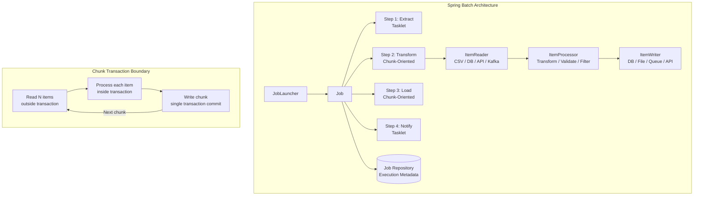
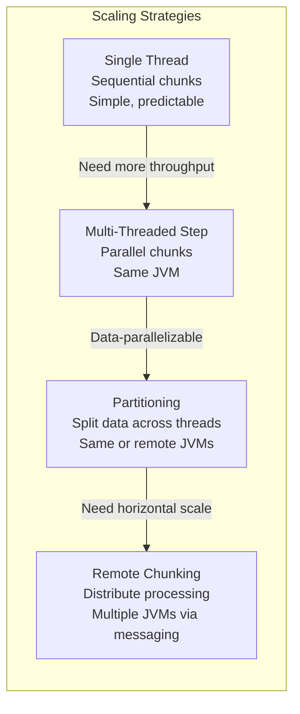
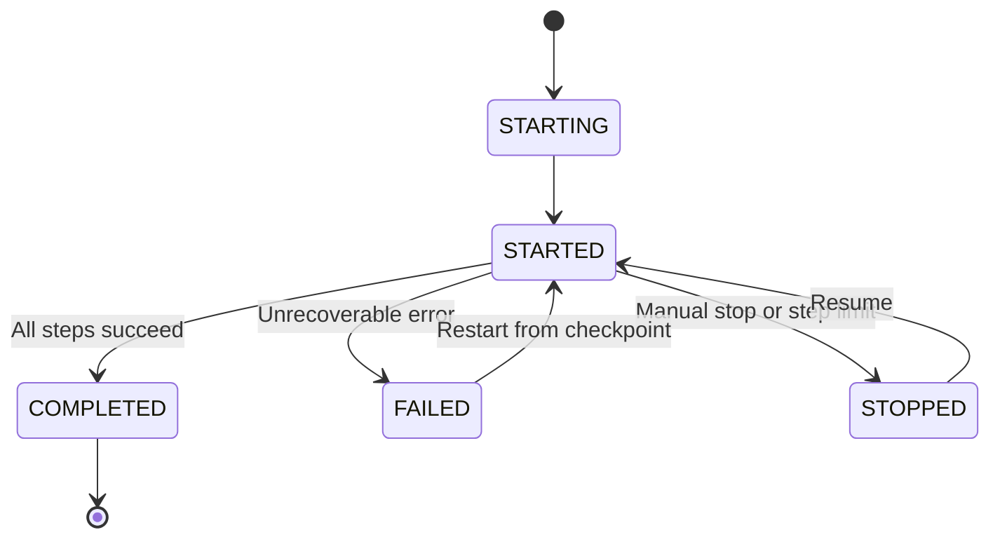

# Spring Batch

## Quick Reference

- Spring Batch is a lightweight framework for robust, scalable batch processing in Java built on top of Spring Framework
- Core abstraction: Job → Step → (Tasklet | Chunk<Reader, Processor, Writer>)
- Chunk-oriented processing: read N items → process each → write all in one transaction (commit-interval = chunk size)
- Job Repository stores execution metadata in `BATCH_JOB_INSTANCE`, `BATCH_JOB_EXECUTION`, `BATCH_STEP_EXECUTION` tables
- Fault tolerance: `skip(Exception.class).skipLimit(10)`, `retry(Exception.class).retryLimit(3)`, restartable jobs resume from last checkpoint
- Scaling strategies: multithreaded steps, partitioning (split data across threads/nodes), remote chunking (distribute processing)
- Spring Batch is NOT a scheduler — use Cron, Quartz, Kubernetes CronJobs, or `@Scheduled` to trigger jobs
- `@StepScope` and `@JobScope` enable late binding of job parameters into bean properties at runtime
- Spring Batch 5 (Boot 3) uses `JobBuilder`/`StepBuilder` pattern — `JobBuilderFactory` and `StepBuilderFactory` are removed
- `@EnableBatchProcessing` is optional in Boot 3 — auto-configuration handles Job Repository and launcher setup
- Virtual threads can be used as the `TaskExecutor` for partitioned steps, enabling thousands of concurrent partitions
- Observability via Micrometer: `spring.batch.job` and `spring.batch.step` metrics are auto-recorded
- Partitioning strategies: range-based, hash-based, file-based, and custom partitioners for data parallelism
- Remote chunking distributes processing across multiple JVMs via messaging (Kafka, RabbitMQ)
- Job scheduling: Kubernetes CronJobs (preferred for containerized), Quartz for complex schedules, `@Scheduled` for simple cases

## When to Use

Spring Batch is the standard choice for Java-based batch processing where you need to process large volumes of data reliably with transaction management, restart capability, and skip/retry logic. Use Spring Batch when your business requires scheduled ETL pipelines, data migration between systems, report generation from large datasets, or periodic data cleanup jobs. It excels when processing millions of records where chunk-oriented processing keeps memory usage bounded and transactions manageable.

Spring Batch provides the infrastructure for reading from diverse sources (databases, files, message queues, APIs), applying business transformations, and writing to multiple destinations in a single coordinated job. Choose Spring Batch over custom scripts when you need production-grade features like job restartability after failures, detailed execution auditing, skip policies for bad records, and the ability to scale horizontally via partitioning. The framework integrates naturally with Spring Boot for auto-configuration, Spring Data for database access, and Spring Integration for event-driven batch triggers.

For jobs processing under 10,000 records with simple logic, a plain `@Scheduled` method with repository calls may be simpler. Spring Batch's value emerges with large datasets, complex multi-step workflows, and production requirements like restart, audit, and monitoring.

## Code Examples

### Complete Job Configuration (Spring Batch 5 / Boot 3)

```java
@Configuration
public class ImportJobConfig {

    private final JobRepository jobRepository;
    private final PlatformTransactionManager transactionManager;

    public ImportJobConfig(JobRepository jobRepository,
                           PlatformTransactionManager transactionManager) {
        this.jobRepository = jobRepository;
        this.transactionManager = transactionManager;
    }

    @Bean
    public Job importCustomerJob(Step importStep, Step validationStep,
                                  Step notificationStep) {
        return new JobBuilder("importCustomerJob", jobRepository)
            .incrementer(new RunIdIncrementer())
            .validator(new DefaultJobParametersValidator(
                new String[]{"inputFile", "processDate"}, new String[]{}))
            .start(importStep)
            .next(validationStep)
            .next(notificationStep)
            .listener(new JobCompletionListener())
            .build();
    }

    @Bean
    public Step importStep(ItemReader<CustomerRecord> reader,
                           ItemProcessor<CustomerRecord, Customer> processor,
                           ItemWriter<Customer> writer) {
        return new StepBuilder("importStep", jobRepository)
            .<CustomerRecord, Customer>chunk(100, transactionManager)
            .reader(reader)
            .processor(processor)
            .writer(writer)
            .faultTolerant()
            .skip(FlatFileParseException.class)
            .skip(DataIntegrityViolationException.class)
            .skipLimit(50)
            .retry(DeadlockLoserDataAccessException.class)
            .retryLimit(3)
            .listener(new ChunkMetricsListener())
            .listener(new SkipListener<>() {
                @Override
                public void onSkipInProcess(CustomerRecord item, Throwable t) {
                    log.warn("Skipped record during processing: {} - {}",
                        item.getEmail(), t.getMessage());
                }
            })
            .build();
    }

    @Bean
    public Step notificationStep(Tasklet notificationTasklet) {
        return new StepBuilder("notificationStep", jobRepository)
            .tasklet(notificationTasklet, transactionManager)
            .build();
    }
}
```

### ItemReader, Processor, and Writer Implementations

```java
@Bean
@StepScope
public FlatFileItemReader<CustomerRecord> csvReader(
        @Value("#{jobParameters['inputFile']}") Resource inputFile) {
    return new FlatFileItemReaderBuilder<CustomerRecord>()
        .name("customerCsvReader")
        .resource(inputFile)
        .linesToSkip(1)  // skip header
        .delimited()
        .delimiter(",")
        .names("id", "name", "email", "phone", "createdDate")
        .fieldSetMapper(new BeanWrapperFieldSetMapper<>() {{
            setTargetType(CustomerRecord.class);
        }})
        .build();
}

// Database reader with pagination (avoids holding cursor open)
@Bean
@StepScope
public JdbcPagingItemReader<Transaction> transactionReader(
        DataSource dataSource,
        @Value("#{jobParameters['processDate']}") LocalDate processDate) {
    Map<String, Object> params = Map.of("processDate", processDate);

    return new JdbcPagingItemReaderBuilder<Transaction>()
        .name("transactionReader")
        .dataSource(dataSource)
        .selectClause("SELECT id, amount, account_id, created_at")
        .fromClause("FROM transactions")
        .whereClause("WHERE DATE(created_at) = :processDate AND processed = false")
        .sortKeys(Map.of("id", Order.ASCENDING))
        .parameterValues(params)
        .pageSize(500)
        .rowMapper(new BeanPropertyRowMapper<>(Transaction.class))
        .build();
}

// Composite processor — chain multiple processors
@Bean
public CompositeItemProcessor<CustomerRecord, Customer> compositeProcessor(
        ValidationProcessor validationProcessor,
        TransformProcessor transformProcessor,
        EnrichmentProcessor enrichmentProcessor) {
    CompositeItemProcessor<CustomerRecord, Customer> composite =
        new CompositeItemProcessor<>();
    composite.setDelegates(List.of(
        validationProcessor, transformProcessor, enrichmentProcessor));
    return composite;
}

@Component
public class TransformProcessor implements ItemProcessor<CustomerRecord, Customer> {

    private final CustomerRepository repository;

    @Override
    public Customer process(CustomerRecord record) throws Exception {
        // Return null to filter out (skip) this record
        if (record.getEmail() == null || record.getEmail().isBlank()) {
            return null;
        }
        if (repository.existsByEmail(record.getEmail())) {
            return null;  // Skip duplicates
        }
        Customer customer = new Customer();
        customer.setName(record.getName().trim());
        customer.setEmail(record.getEmail().toLowerCase());
        customer.setPhone(normalizePhone(record.getPhone()));
        customer.setImportedAt(LocalDateTime.now());
        return customer;
    }
}

// Composite writer — write to multiple destinations
@Bean
public CompositeItemWriter<Customer> compositeWriter(
        JdbcBatchItemWriter<Customer> dbWriter,
        KafkaItemWriter<String, Customer> kafkaWriter) {
    CompositeItemWriter<Customer> writer = new CompositeItemWriter<>();
    writer.setDelegates(List.of(dbWriter, kafkaWriter));
    return writer;
}

@Bean
public JdbcBatchItemWriter<Customer> jdbcWriter(DataSource dataSource) {
    return new JdbcBatchItemWriterBuilder<Customer>()
        .dataSource(dataSource)
        .sql("INSERT INTO customers (name, email, phone, imported_at) " +
             "VALUES (:name, :email, :phone, :importedAt)")
        .beanMapped()
        .build();
}
```

### Partitioning for Parallel Processing

```java
@Bean
public Step partitionedStep(Step workerStep, Partitioner partitioner) {
    return new StepBuilder("partitionedStep", jobRepository)
        .partitioner("workerStep", partitioner)
        .step(workerStep)
        .gridSize(8)  // number of partitions
        .taskExecutor(new VirtualThreadTaskExecutor("batch-partition-"))
        .build();
}

// Range-based partitioner — splits data by ID range
@Bean
public Partitioner rangePartitioner(JdbcTemplate jdbcTemplate) {
    return gridSize -> {
        Long minId = jdbcTemplate.queryForObject(
            "SELECT MIN(id) FROM transactions WHERE processed = false", Long.class);
        Long maxId = jdbcTemplate.queryForObject(
            "SELECT MAX(id) FROM transactions WHERE processed = false", Long.class);

        if (minId == null || maxId == null) return Map.of();

        long partitionSize = (maxId - minId) / gridSize + 1;
        Map<String, ExecutionContext> partitions = new HashMap<>();

        for (int i = 0; i < gridSize; i++) {
            ExecutionContext context = new ExecutionContext();
            context.putLong("minId", minId + (i * partitionSize));
            context.putLong("maxId", Math.min(minId + ((i + 1) * partitionSize) - 1, maxId));
            context.putString("partitionName", "partition-" + i);
            partitions.put("partition-" + i, context);
        }
        return partitions;
    };
}

// Worker step reads only its partition's data range
@Bean
@StepScope
public JdbcPagingItemReader<Transaction> partitionedReader(
        DataSource dataSource,
        @Value("#{stepExecutionContext['minId']}") Long minId,
        @Value("#{stepExecutionContext['maxId']}") Long maxId) {
    return new JdbcPagingItemReaderBuilder<Transaction>()
        .name("partitionedTransactionReader")
        .dataSource(dataSource)
        .selectClause("SELECT *")
        .fromClause("FROM transactions")
        .whereClause("WHERE id BETWEEN :minId AND :maxId AND processed = false")
        .sortKeys(Map.of("id", Order.ASCENDING))
        .parameterValues(Map.of("minId", minId, "maxId", maxId))
        .pageSize(500)
        .rowMapper(new BeanPropertyRowMapper<>(Transaction.class))
        .build();
}
```

### Conditional Job Flow with Decider

```java
@Bean
public Job conditionalJob(Step extractStep, Step transformStep,
                          Step errorStep, Step loadStep, Step archiveStep) {
    return new JobBuilder("conditionalJob", jobRepository)
        .start(extractStep)
            .on("FAILED").to(errorStep)
            .on("NO_DATA").end()  // Complete successfully with no further steps
        .from(extractStep)
            .on("*").to(decider())
        .from(decider())
            .on("FULL_LOAD").to(transformStep).next(loadStep).next(archiveStep)
        .from(decider())
            .on("INCREMENTAL").to(loadStep).next(archiveStep)
        .end()
        .build();
}

@Bean
public JobExecutionDecider decider() {
    return (jobExecution, stepExecution) -> {
        long recordCount = stepExecution.getWriteCount();
        if (recordCount > 100000) {
            return new FlowExecutionStatus("FULL_LOAD");
        }
        return new FlowExecutionStatus("INCREMENTAL");
    };
}
```

### Job Scheduling and Monitoring

```java
// REST endpoint to launch jobs on demand
@RestController
@RequestMapping("/api/jobs")
@RequiredArgsConstructor
public class JobController {

    private final JobLauncher jobLauncher;
    private final JobExplorer jobExplorer;
    private final Job importCustomerJob;

    @PostMapping("/import")
    public ResponseEntity<JobExecutionResponse> launchImport(
            @RequestParam String inputFile,
            @RequestParam @DateTimeFormat(iso = DateTimeFormat.ISO.DATE) LocalDate processDate) {
        JobParameters params = new JobParametersBuilder()
            .addString("inputFile", inputFile)
            .addLocalDate("processDate", processDate)
            .addLong("timestamp", System.currentTimeMillis())
            .toJobParameters();

        JobExecution execution = jobLauncher.run(importCustomerJob, params);

        return ResponseEntity.accepted().body(new JobExecutionResponse(
            execution.getId(),
            execution.getStatus().toString(),
            execution.getStartTime()));
    }

    @GetMapping("/{executionId}")
    public ResponseEntity<JobExecutionDetail> getJobStatus(@PathVariable Long executionId) {
        JobExecution execution = jobExplorer.getJobExecution(executionId);
        if (execution == null) {
            return ResponseEntity.notFound().build();
        }
        return ResponseEntity.ok(JobExecutionDetail.from(execution));
    }

    @GetMapping("/history")
    public List<JobExecutionSummary> getJobHistory(
            @RequestParam(defaultValue = "10") int limit) {
        return jobExplorer.findJobInstancesByJobName("importCustomerJob", 0, limit)
            .stream()
            .flatMap(instance -> jobExplorer.getJobExecutions(instance).stream())
            .map(JobExecutionSummary::from)
            .toList();
    }
}
```

### Testing Batch Jobs

```java
@SpringBatchTest
@SpringBootTest
@Testcontainers
class ImportJobTest {

    @Container
    @ServiceConnection
    static PostgreSQLContainer<?> postgres = new PostgreSQLContainer<>("postgres:16-alpine");

    @Autowired
    private JobLauncherTestUtils jobLauncherTestUtils;

    @Autowired
    private JobRepositoryTestUtils jobRepositoryTestUtils;

    @Autowired
    private CustomerRepository customerRepository;

    @BeforeEach
    void cleanup() {
        jobRepositoryTestUtils.removeJobExecutions();
        customerRepository.deleteAll();
    }

    @Test
    void shouldImportValidCustomersAndSkipInvalid() throws Exception {
        // Given: CSV with 5 valid and 2 invalid records
        JobParameters params = new JobParametersBuilder()
            .addString("inputFile", "classpath:test-data/customers-mixed.csv")
            .addLocalDate("processDate", LocalDate.now())
            .toJobParameters();

        // When
        JobExecution execution = jobLauncherTestUtils.launchJob(params);

        // Then
        assertThat(execution.getStatus()).isEqualTo(BatchStatus.COMPLETED);
        assertThat(execution.getExitStatus()).isEqualTo(ExitStatus.COMPLETED);

        StepExecution importStep = execution.getStepExecutions().stream()
            .filter(s -> s.getStepName().equals("importStep"))
            .findFirst().orElseThrow();

        assertThat(importStep.getReadCount()).isEqualTo(7);
        assertThat(importStep.getWriteCount()).isEqualTo(5);
        assertThat(importStep.getSkipCount()).isEqualTo(2);
        assertThat(customerRepository.count()).isEqualTo(5);
    }

    @Test
    void shouldRestartFromLastCheckpoint() throws Exception {
        // First run — simulate failure at record 3
        JobParameters params = new JobParametersBuilder()
            .addString("inputFile", "classpath:test-data/customers-large.csv")
            .addLocalDate("processDate", LocalDate.now())
            .toJobParameters();

        // Simulate partial completion then restart
        JobExecution firstRun = jobLauncherTestUtils.launchJob(params);
        // ... verify restart behavior
    }

    @Test
    void shouldTestSingleStep() throws Exception {
        // Test individual step in isolation
        JobExecution execution = jobLauncherTestUtils.launchStep("importStep",
            new JobParametersBuilder()
                .addString("inputFile", "classpath:test-data/customers-valid.csv")
                .toJobParameters());

        assertThat(execution.getStepExecutions().iterator().next().getExitStatus())
            .isEqualTo(ExitStatus.COMPLETED);
    }
}
```

### Kubernetes CronJob Integration

```yaml
apiVersion: batch/v1
kind: CronJob
metadata:
  name: daily-reconciliation
spec:
  schedule: "0 2 * * *"
  concurrencyPolicy: Forbid
  successfulJobsHistoryLimit: 3
  failedJobsHistoryLimit: 5
  jobTemplate:
    spec:
      backoffLimit: 2
      activeDeadlineSeconds: 7200
      template:
        spec:
          restartPolicy: Never
          containers:
            - name: batch-job
              image: registry.example.com/reconciliation-job:latest
              env:
                - name: SPRING_PROFILES_ACTIVE
                  value: production
                - name: SPRING_BATCH_JOB_NAME
                  value: dailyReconciliation
                - name: PROCESS_DATE
                  value: "$(date -d yesterday +%Y-%m-%d)"
              resources:
                requests:
                  memory: "1Gi"
                  cpu: "500m"
                limits:
                  memory: "2Gi"
                  cpu: "2000m"
```

## Architecture / Diagrams







## Common Pitfalls

1. **Chunk size too large or too small**: A chunk size of 1 means one transaction per record (slow due to commit overhead). A chunk size of 10,000 means one massive transaction that holds locks and risks OOM. Start with 100-500 items per chunk, measure throughput, and tune based on data size and transaction duration. Monitor commit time and memory usage per chunk.

2. **Not making jobs restartable**: If a job processes 1 million records and fails at record 600,000, you want to restart from 600,001. Ensure your Job Repository uses a persistent database (not in-memory), and that your readers support restart (cursor-based readers track position automatically). Test restart behavior explicitly in integration tests.

3. **Self-invocation bypassing Spring proxies**: Calling a `@StepScope` or `@JobScope` bean method from within the same class bypasses the proxy, so late binding of job parameters fails. Always inject scoped beans from a different Spring-managed bean.

4. **Ignoring skip and retry interaction**: If you configure both skip and retry for the same exception, Spring Batch retries first, then skips if retries are exhausted. But if you forget to add the exception to both `skip()` and `retry()`, the behavior may not match expectations. Always test fault tolerance with intentionally bad records.

5. **Running jobs with identical parameters**: Spring Batch considers a Job Instance unique by Job name + Job Parameters. Running the same job with identical parameters returns `JobInstanceAlreadyCompleteException`. Use `RunIdIncrementer` or add a timestamp parameter to allow re-execution.

6. **Not testing with production-scale data volumes**: A batch job that works with 1,000 test records may fail with 10 million production records due to memory exhaustion, connection pool timeout, or transaction log overflow. Always test with realistic data volumes in staging. Use `JdbcPagingItemReader` instead of `JdbcCursorItemReader` for very large datasets.

7. **Holding database cursors open for entire job duration**: `JdbcCursorItemReader` opens a database cursor and holds it for the entire step execution. For jobs running hours, this can exhaust database connections or hit cursor timeout limits. Use `JdbcPagingItemReader` for long-running jobs — it executes separate queries per page and doesn't hold a persistent cursor.

8. **Missing idempotent writers**: Network failures or container restarts can cause a chunk to be written partially, then retried on restart. Writers must handle duplicate writes gracefully using `INSERT ... ON CONFLICT DO NOTHING` or `MERGE` statements. For file writers, use temporary files and atomic rename on completion.

9. **Partitioned step with insufficient connection pool**: Each partition needs its own database connection for the duration of the step. If you have 20 max connections and configure 16 partitions, only 4 connections remain for the application. Size the connection pool to accommodate partitions plus application needs.

## Real-World Use Cases

- **Financial reconciliation**: Banks process millions of transactions nightly, matching records between internal ledgers and external payment networks. Spring Batch reads from multiple sources, applies matching logic in processors, writes reconciliation results, and generates exception reports. Partitioning by account range enables parallel processing.

- **Data migration between systems**: Migrating customer data from legacy Oracle to new PostgreSQL. Spring Batch handles schema transformation, validates data integrity, writes to the new system, and maintains an audit trail. Restart capability ensures migration resumes after interruptions without re-processing.

- **ETL for data warehousing**: Extract operational data from microservice databases, transform into dimensional models (star schema), and load into a data warehouse. Multi-step jobs handle extraction, deduplication, dimension lookups, fact table loading, and index rebuilding with proper transaction boundaries.

- **Regulatory report generation**: Financial institutions generate daily/monthly regulatory reports by aggregating transaction data, applying complex calculations, and producing formatted output files. Chunk processing keeps memory bounded even for billions of transactions.

- **Machine learning feature pipeline**: Data engineering teams extract raw event data, compute ML features (aggregations, time-windowed statistics), and load feature vectors into a feature store. Partitioned steps parallelize computation across date ranges, processing 500 million events nightly.

- **Data cleanup and archival**: Periodic jobs archive old records to cold storage (S3, Glacier), purge expired sessions, clean up orphaned files, and compact audit logs. Spring Batch's skip policies handle records that fail archival without stopping the entire job.

## Interview Questions

**Q: What is the difference between a Tasklet and a Chunk-oriented step?**

A: A Tasklet executes a single block of code repeatedly until it returns `RepeatStatus.FINISHED`. It runs in its own transaction per invocation. Use tasklets for simple operations like file cleanup, sending notifications, or calling APIs. Chunk-oriented steps follow the read-process-write pattern: read items one at a time, process each, then write the entire chunk in a single transaction. Use chunks when processing large datasets where you need bounded memory, transaction management per batch, and built-in skip/retry support.

**Q: How does Spring Batch handle job restartability?**

A: Spring Batch persists execution metadata (job parameters, step status, read/write counts, commit counts) in the Job Repository database tables. When a failed job is restarted with the same parameters, Spring Batch queries the repository to find the last successful checkpoint. Cursor-based readers resume from the last committed position. Chunk-oriented steps skip already-completed chunks. The `restartable` attribute on the job (default true) and `allow-start-if-complete` on steps control this behavior.

**Q: Explain the transaction model in chunk-oriented processing.**

A: Each chunk operates within a single transaction. The reader reads items outside the transaction boundary (reader exceptions don't cause rollback). Processing and writing happen inside the transaction. If the writer throws an exception, the entire chunk rolls back and can be retried. The commit-interval (chunk size) determines how many items are processed per transaction. You can configure `no-rollback-exception-classes` for exceptions that should not trigger rollback.

**Q: How would you scale a Spring Batch job that processes 100 million records?**

A: Start with multithreaded steps (`TaskExecutor` on the step) to process multiple chunks in parallel. If data can be logically partitioned (by date range, ID range, or file), use partitioning to split work across threads or remote workers. For CPU-intensive processing with simple I/O, remote chunking distributes processing to worker nodes while the master handles reading and writing. Monitor throughput at each stage to identify bottlenecks — often the database write is the bottleneck, so use `JdbcBatchItemWriter` with large batch sizes and consider disabling indexes during bulk loads.

**Q: What changed in Spring Batch 5 (Spring Boot 3)?**

A: `JobBuilderFactory` and `StepBuilderFactory` are removed — use `new JobBuilder(name, jobRepository)` and `new StepBuilder(name, jobRepository)` directly. `@EnableBatchProcessing` is optional with Spring Boot auto-configuration. The `chunk()` method requires a `PlatformTransactionManager` parameter. Job parameters support `LocalDate`, `LocalDateTime`, and `LocalTime` natively. The framework requires Java 17+ and Jakarta EE 9+. The `JobExplorer` and `JobOperator` APIs are simplified.

**Q: How do you handle job failures and alerting in production?**

A: Implement a `JobExecutionListener` that sends alerts (PagerDuty, Slack) on failure with context: job name, parameters, step that failed, exception message, and items processed. Export batch metrics to Prometheus via Micrometer — alert on job duration exceeding SLA, skip count exceeding threshold, or status transitioning to FAILED. In Kubernetes, configure CronJob's `backoffLimit` for automatic retries and `activeDeadlineSeconds` to kill stuck jobs.

**Q: What is the difference between partitioning and remote chunking?**

A: Partitioning splits the input data into independent subsets, each processed by a separate step execution (potentially on different JVMs). Each partition has its own reader, processor, and writer. Remote chunking keeps reading and writing on the master node but distributes processing to remote workers via messaging. Use partitioning when data is naturally divisible (ID ranges, date ranges, separate files) and each partition can read independently. Use remote chunking when reading is cheap but processing is expensive and you want to distribute CPU load without duplicating data access logic.

**Q: How do you test Spring Batch jobs effectively?**

A: Use `@SpringBatchTest` which provides `JobLauncherTestUtils` for launching jobs/steps and `JobRepositoryTestUtils` for cleanup. Test at multiple levels: unit test processors in isolation with plain JUnit, integration test individual steps with `launchStep()`, and end-to-end test complete jobs with `launchJob()`. Use Testcontainers for realistic database testing. Verify read counts, write counts, skip counts, and exit status. Test restart behavior by simulating failures. Include test data with known bad records to verify skip/retry policies.

## Production Tips

- **Monitor job execution with Actuator and Micrometer**: Expose batch metrics via `/actuator/metrics` including `spring.batch.job.active.count`, `spring.batch.step.execution.count`, and custom timers on readers/writers. Alert on jobs exceeding SLA duration or skip thresholds. Integrate with Prometheus/Grafana for historical trend analysis.

- **Use a persistent Job Repository with proper cleanup**: Configure the Job Repository with proper connection pooling. Old execution metadata accumulates — implement a scheduled cleanup job removing executions older than your retention period (30-90 days). Without cleanup, `BATCH_STEP_EXECUTION_CONTEXT` grows unbounded and slows restarts.

- **Implement idempotent writers**: Use `INSERT ... ON CONFLICT DO NOTHING` (PostgreSQL) or `MERGE` statements. For file writers, use temporary files and atomic rename on completion. This ensures restart safety without data corruption.

- **Configure thread pool sizing for partitioned jobs**: Set partition grid size based on available CPU cores and database connection pool size. Each partition needs its own connection. If you have 20 max connections and 4 are used by the application, limit partitions to 16. Monitor connection pool metrics during batch runs.

- **GraalVM native images for batch jobs**: Compile to native images for Kubernetes CronJobs that start in under 1 second instead of 15-30 seconds. Particularly valuable for short-running jobs where JVM startup is a significant percentage of total execution time. Register `RuntimeHints` for all reader/writer implementations.

- **Separate batch database from application database**: Run the Job Repository on a dedicated database or schema. This prevents batch metadata queries from competing with application queries and allows independent backup/retention policies.

- **Implement dead letter handling for skipped records**: Don't just skip and forget — write skipped records to a dead letter table or file with the exception details. Implement a dashboard or report showing skipped records for manual review. Set alerts when skip count exceeds a percentage threshold of total records.

## Related Topics

- [Spring Boot](./spring-boot.md) — Spring Batch auto-configuration and job launching via Spring Boot
- [Core Container and Dependency Injection](./core-container.md) — Transaction management and dependency injection foundation
- [Spring Data and Persistence](./spring-data.md) — JPA repositories used in readers and writers
- [Apache Kafka](../../messaging/apache-kafka.md) — Event-driven batch triggers and Kafka-based ItemReader/Writer implementations
