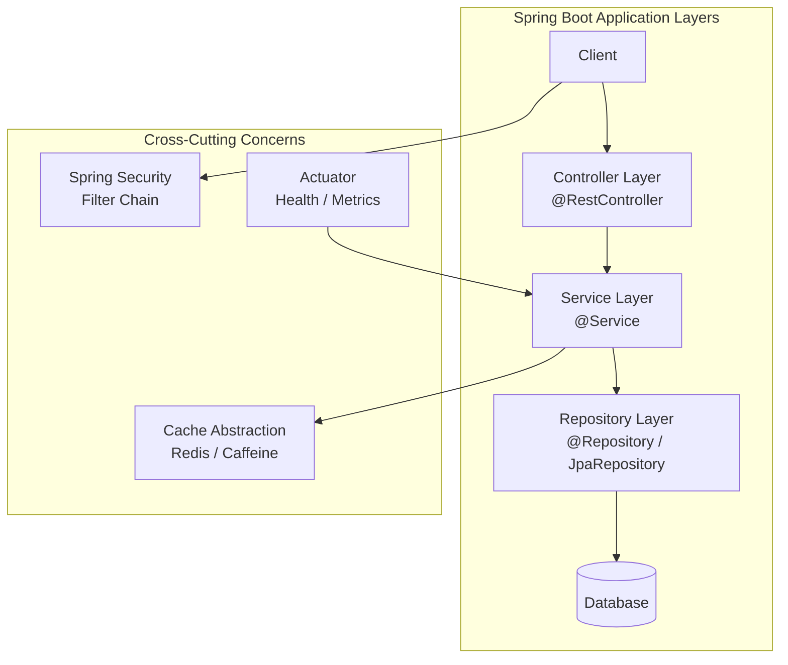
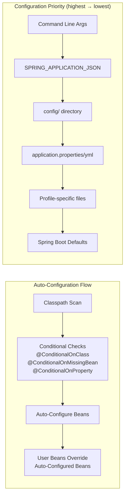

# Spring Boot

## Quick Reference

- Spring Boot is a convention-over-configuration framework that simplifies Spring application development with embedded servers, auto-configuration, and starter dependencies
- `@SpringBootApplication` combines `@Configuration`, `@EnableAutoConfiguration`, and `@ComponentScan` into a single annotation
- Starters aggregate dependencies: `spring-boot-starter-web`, `spring-boot-starter-data-jpa`, `spring-boot-starter-security`, `spring-boot-starter-actuator`
- Configuration priority (highest to lowest): command-line args → `SPRING_APPLICATION_JSON` → `config/application.properties` → `application.properties` → `@PropertySource` → defaults
- Profiles enable environment-specific config: `application-dev.yml`, `application-prod.yml`, activated via `spring.profiles.active`
- Actuator exposes production endpoints: `/actuator/health`, `/actuator/metrics`, `/actuator/env`, `/actuator/beans`, `/actuator/prometheus`
- Auto-configuration backs off when you define your own beans via `@ConditionalOnMissingBean`, giving you full control without fighting the framework
- Custom starters follow naming convention `{company}-spring-boot-starter` with auto-configuration in a separate `{company}-spring-boot-autoconfigure` module
- Spring Boot 3.x requires Java 17+ and uses Jakarta EE 9+ namespace (`jakarta.*` instead of `javax.*`)
- GraalVM native image support via `spring-boot-starter-parent` with `-Pnative` Maven profile or `nativeCompile` Gradle task
- Virtual threads enabled with `spring.threads.virtual.enabled=true` (Boot 3.2+) for massive concurrency without reactive programming
- Testcontainers integration via `spring-boot-testcontainers` for realistic integration tests with real databases and message brokers
- Externalized configuration supports `application.yml`, environment variables, Kubernetes ConfigMaps, Spring Cloud Config Server, and HashiCorp Vault

## When to Use

Spring Boot is the standard choice for building production-grade Java applications where rapid development, embedded deployment, and minimal configuration are priorities. Use Spring Boot when you need a standalone application with an embedded server (Tomcat, Jetty, or Netty) that can be deployed as a single JAR without external application server management. It excels in microservice architectures where each service needs independent deployment, health monitoring, and externalized configuration. Spring Boot's auto-configuration eliminates boilerplate for common patterns like database connections, security filters, and message broker integration. Choose Spring Boot when your team needs consistent project structure across services, built-in observability through Actuator and Micrometer, and seamless integration with Spring Cloud for distributed systems patterns like service discovery, circuit breakers, and centralized configuration. The framework's opinionated defaults mean new developers can be productive immediately while experienced developers can override any default when needed.

Spring Boot is also the right choice for serverless functions (AWS Lambda via Spring Cloud Function), CLI tools (using `CommandLineRunner`), and batch processing jobs that run on schedules. Its embedded server model eliminates the operational overhead of managing application server installations, version upgrades, and configuration drift across environments.

## Code Examples

### Application Entry Point with Custom Banner and Startup Hooks

```java
@SpringBootApplication
@EnableConfigurationProperties(AppProperties.class)
public class OrderServiceApplication {

    public static void main(String[] args) {
        SpringApplication app = new SpringApplication(OrderServiceApplication.class);
        app.setApplicationStartup(new BufferingApplicationStartup(2048));
        app.run(args);
    }

    @Bean
    public ApplicationRunner startupValidator(DataSource dataSource,
                                              AppProperties properties) {
        return args -> {
            // Validate critical infrastructure on startup
            try (Connection conn = dataSource.getConnection()) {
                log.info("Database connection verified: {}", conn.getMetaData().getURL());
            }
            log.info("Application started with config: maxRetries={}, timeout={}",
                properties.getMaxRetries(), properties.getTimeout());
        };
    }
}

// Type-safe configuration properties
@ConfigurationProperties(prefix = "app")
@Validated
public record AppProperties(
    @NotNull String name,
    @Min(1) @Max(10) int maxRetries,
    @DurationMin(seconds = 1) Duration timeout,
    @Valid RetryProperties retry,
    Map<String, FeatureFlag> features
) {
    public record RetryProperties(
        int maxAttempts,
        Duration initialBackoff,
        double multiplier
    ) {}

    public record FeatureFlag(
        boolean enabled,
        @DecimalMin("0.0") @DecimalMax("1.0") double rolloutPercentage
    ) {}
}
```

### Auto-Configuration Deep Dive — Writing a Custom Starter

```java
// Module: mycompany-spring-boot-autoconfigure
@AutoConfiguration
@ConditionalOnClass(NotificationService.class)
@ConditionalOnProperty(prefix = "mycompany.notifications", name = "enabled",
                       havingValue = "true", matchIfMissing = true)
@EnableConfigurationProperties(NotificationProperties.class)
public class NotificationAutoConfiguration {

    @Bean
    @ConditionalOnMissingBean
    public NotificationService notificationService(NotificationProperties props) {
        return new DefaultNotificationService(props.getProvider(), props.getApiKey());
    }

    @Bean
    @ConditionalOnMissingBean
    @ConditionalOnBean(NotificationService.class)
    public NotificationHealthIndicator notificationHealthIndicator(
            NotificationService service) {
        return new NotificationHealthIndicator(service);
    }

    @Configuration
    @ConditionalOnClass(name = "com.sendgrid.SendGrid")
    static class SendGridConfiguration {
        @Bean
        @ConditionalOnMissingBean
        public EmailSender sendGridEmailSender(NotificationProperties props) {
            return new SendGridEmailSender(props.getSendgrid().getApiKey());
        }
    }

    @Configuration
    @ConditionalOnClass(name = "com.twilio.Twilio")
    static class TwilioConfiguration {
        @Bean
        @ConditionalOnMissingBean
        public SmsSender twilioSmsSender(NotificationProperties props) {
            return new TwilioSmsSender(
                props.getTwilio().getAccountSid(),
                props.getTwilio().getAuthToken());
        }
    }
}

// Register in META-INF/spring/org.springframework.boot.autoconfigure.AutoConfiguration.imports:
// com.mycompany.autoconfigure.NotificationAutoConfiguration
```

### Externalized Configuration with Profiles and Config Server

```yaml
# application.yml - shared configuration across all environments
spring:
  application:
    name: order-service
  jpa:
    open-in-view: false
    hibernate:
      ddl-auto: validate
    properties:
      hibernate:
        jdbc:
          batch_size: 50
        order_inserts: true
        order_updates: true

server:
  port: 8080
  shutdown: graceful
  servlet:
    context-path: /api

management:
  endpoints:
    web:
      exposure:
        include: health,metrics,info,prometheus,env
  endpoint:
    health:
      show-details: when-authorized
      probes:
        enabled: true
  metrics:
    distribution:
      percentiles-histogram:
        http.server.requests: true
    tags:
      application: ${spring.application.name}

app:
  name: Order Service
  max-retries: 3
  timeout: 5s
  retry:
    max-attempts: 3
    initial-backoff: 100ms
    multiplier: 2.0

---
spring:
  config:
    activate:
      on-profile: dev
  datasource:
    url: jdbc:h2:mem:devdb
    driver-class-name: org.h2.Driver
  jpa:
    show-sql: true
    hibernate:
      ddl-auto: create-drop

---
spring:
  config:
    activate:
      on-profile: prod
  datasource:
    url: jdbc:postgresql://${DB_HOST:localhost}:5432/${DB_NAME:orders}
    username: ${DB_USER}
    password: ${DB_PASS}
    hikari:
      maximum-pool-size: ${HIKARI_MAX_POOL:20}
      minimum-idle: 5
      connection-timeout: 30000
      idle-timeout: 600000
      max-lifetime: 1800000
      leak-detection-threshold: 60000
  config:
    import: optional:configserver:${CONFIG_SERVER_URI:http://config-server:8888}

---
spring:
  config:
    activate:
      on-profile: kubernetes
  config:
    import: optional:kubernetes:
  cloud:
    kubernetes:
      config:
        enabled: true
        sources:
          - name: order-service-config
      reload:
        enabled: true
        strategy: refresh
```

### Actuator Custom Endpoints and Health Indicators

```java
// Custom health indicator for downstream service
@Component
public class PaymentServiceHealthIndicator implements HealthIndicator {

    private final RestClient paymentClient;

    @Override
    public Health health() {
        try {
            ResponseEntity<Void> response = paymentClient.get()
                .uri("/health")
                .retrieve()
                .toBodilessEntity();

            if (response.getStatusCode().is2xxSuccessful()) {
                return Health.up()
                    .withDetail("service", "payment-service")
                    .withDetail("responseTime", "< 500ms")
                    .build();
            }
            return Health.down()
                .withDetail("status", response.getStatusCode().value())
                .build();
        } catch (Exception e) {
            return Health.down()
                .withDetail("error", e.getMessage())
                .build();
        }
    }
}

// Custom actuator endpoint for business metrics
@Component
@Endpoint(id = "orders")
public class OrdersEndpoint {

    private final OrderRepository orderRepository;

    @ReadOperation
    public Map<String, Object> orderStats() {
        return Map.of(
            "totalOrders", orderRepository.count(),
            "pendingOrders", orderRepository.countByStatus(OrderStatus.PENDING),
            "todayOrders", orderRepository.countCreatedToday(),
            "averageOrderValue", orderRepository.averageOrderValue()
        );
    }

    @ReadOperation
    public Map<String, Object> ordersByStatus(@Selector String status) {
        OrderStatus orderStatus = OrderStatus.valueOf(status.toUpperCase());
        return Map.of(
            "status", orderStatus,
            "count", orderRepository.countByStatus(orderStatus)
        );
    }

    @WriteOperation
    public void cancelStaleOrders(@Selector int olderThanHours) {
        orderRepository.cancelOrdersOlderThan(
            Instant.now().minus(olderThanHours, ChronoUnit.HOURS));
    }
}
```

### Testcontainers Integration for Integration Testing

```java
@SpringBootTest(webEnvironment = SpringBootTest.WebEnvironment.RANDOM_PORT)
@Testcontainers
class OrderServiceIntegrationTest {

    @Container
    @ServiceConnection
    static PostgreSQLContainer<?> postgres = new PostgreSQLContainer<>("postgres:16-alpine")
            .withDatabaseName("testdb")
            .withUsername("test")
            .withPassword("test");

    @Container
    @ServiceConnection
    static GenericContainer<?> redis = new GenericContainer<>("redis:7-alpine")
            .withExposedPorts(6379);

    @Container
    static KafkaContainer kafka = new KafkaContainer(
            DockerImageName.parse("confluentinc/cp-kafka:7.5.0"));

    @DynamicPropertySource
    static void kafkaProperties(DynamicPropertyRegistry registry) {
        registry.add("spring.kafka.bootstrap-servers", kafka::getBootstrapServers);
    }

    @Autowired
    private TestRestTemplate restTemplate;

    @Autowired
    private OrderRepository orderRepository;

    @Test
    void shouldCreateOrderAndPersistToDatabase() {
        CreateOrderRequest request = new CreateOrderRequest(
                UUID.randomUUID(), List.of(new OrderItem("SKU-001", 2)));

        ResponseEntity<OrderDTO> response = restTemplate.postForEntity(
            "/api/v1/orders", request, OrderDTO.class);

        assertThat(response.getStatusCode()).isEqualTo(HttpStatus.CREATED);
        assertThat(response.getBody().getId()).isNotNull();
        assertThat(orderRepository.findById(response.getBody().getId())).isPresent();
    }
}
```

### Virtual Threads and Observability Configuration

```java
@Service
@RequiredArgsConstructor
public class ObservableOrderService {

    private final OrderRepository orderRepository;
    private final ObservationRegistry observationRegistry;

    @Observed(name = "order.creation",
              contextualName = "creating-order",
              lowCardinalityKeyValues = {"order.type", "standard"})
    public OrderDTO createOrder(CreateOrderRequest request) {
        return Observation.createNotStarted("order.validation", observationRegistry)
                .observe(() -> {
                    validateRequest(request);
                    Order order = Order.from(request);
                    order = orderRepository.save(order);
                    return OrderDTO.from(order);
                });
    }
}
```

### Security Configuration with JWT

```java
@Configuration
@EnableWebSecurity
public class SecurityConfig {

    @Bean
    public SecurityFilterChain filterChain(HttpSecurity http) throws Exception {
        http
            .csrf(csrf -> csrf.disable())
            .sessionManagement(session ->
                session.sessionCreationPolicy(SessionCreationPolicy.STATELESS))
            .authorizeHttpRequests(auth -> auth
                .requestMatchers("/api/public/**", "/actuator/health/**").permitAll()
                .requestMatchers("/api/admin/**").hasRole("ADMIN")
                .anyRequest().authenticated())
            .oauth2ResourceServer(oauth2 -> oauth2.jwt(Customizer.withDefaults()));
        return http.build();
    }
}
```

## Architecture / Diagrams





```mermaid
graph TB
    subgraph "Custom Starter Architecture"
        STARTER[mycompany-spring-boot-starter<br/>pom.xml only — aggregates deps]
        AUTOCONFIG[mycompany-spring-boot-autoconfigure<br/>@AutoConfiguration classes]
        LIB[mycompany-core-library<br/>Business logic]

        STARTER --> AUTOCONFIG
        STARTER --> LIB
        AUTOCONFIG --> LIB
    end

    subgraph "Consumer Application"
        APP[Application] --> STARTER
    end
```

## Common Pitfalls

1. **Circular dependency injection**: Two beans depending on each other causes `BeanCurrentlyInCreationException`. Refactor to break the cycle using `@Lazy`, extracting shared logic into a third bean, or redesigning the dependency graph. Constructor injection makes circular dependencies fail fast at startup rather than hiding them.

2. **N+1 query problem with JPA**: Lazy-loaded associations trigger individual queries for each parent entity. Use `@EntityGraph`, `JOIN FETCH` in JPQL, or batch fetching (`@BatchSize`) to load associations efficiently. Enable `spring.jpa.show-sql=true` in development to catch this early.

3. **Exposing entity classes directly in REST responses**: Coupling your API contract to your database schema means any schema change breaks clients. Use DTOs with MapStruct or manual mapping to decouple persistence from presentation. This also prevents accidentally serializing lazy-loaded proxies.

4. **Not configuring connection pool properly**: Default HikariCP settings may not suit production workloads. Set `maximum-pool-size` based on your database's max connections divided by application instances. Monitor pool metrics via Actuator to detect connection leaks or exhaustion before they cause outages.

5. **Ignoring Actuator security in production**: Exposing all Actuator endpoints without authentication leaks sensitive information (environment variables, bean definitions, heap dumps). Restrict exposure with `management.endpoints.web.exposure.include` and secure with Spring Security. Run Actuator on a separate management port in production.

6. **Jakarta EE namespace migration issues (Boot 3.x)**: Spring Boot 3 requires Jakarta EE 9+ (`jakarta.servlet`, `jakarta.persistence`, `jakarta.validation`). Libraries still using `javax.*` packages are incompatible and fail at runtime with `ClassNotFoundException`. Audit all dependencies before upgrading — use `openrewrite` recipes for automated migration.

7. **GraalVM native image reflection failures**: Native images require all reflective access to be declared at build time. Missing `RuntimeHints` registrations cause `ClassNotFoundException` or `NoSuchMethodException` at runtime. Test native compilation in CI with `mvn -Pnative native:compile` and run the full test suite against the native binary.

8. **Auto-configuration ordering conflicts**: When your custom configuration competes with auto-configuration for the same bean type, use `@AutoConfigureBefore` or `@AutoConfigureAfter` to control ordering. More commonly, rely on `@ConditionalOnMissingBean` in auto-configurations so user beans always win.

9. **Profile activation confusion**: Multiple profiles can be active simultaneously, and profile-specific properties override base properties. But `spring.profiles.active` in `application.yml` is overridden by environment variables and command-line args. Use `spring.profiles.include` for profiles that should always be active alongside the main profile. Test profile combinations explicitly — unexpected interactions between profiles cause production incidents.

## Real-World Use Cases

- **Microservice backends**: Each Spring Boot service owns a bounded context (orders, payments, inventory), deploys independently as a Docker container, and communicates via REST or messaging. Spring Boot's embedded server, health checks, and externalized configuration make it ideal for container orchestration with Kubernetes.

- **Event-driven architectures**: Spring Boot with `spring-boot-starter-amqp` or `spring-kafka` enables building event producers and consumers that react to domain events. Auto-configuration handles connection factories, serialization, and retry policies, while Actuator exposes consumer lag and message throughput metrics.

- **API gateways and BFF patterns**: Spring Boot with Spring Cloud Gateway provides routing, rate limiting, and authentication at the edge. The Backend-for-Frontend pattern uses a thin Spring Boot service to aggregate multiple downstream microservice calls into a single optimized response for specific client types.

- **Scheduled batch processing**: Spring Boot with `@Scheduled` or Spring Batch handles periodic data processing jobs like report generation, data synchronization, and cleanup tasks. Actuator health checks integrate with Kubernetes liveness probes to restart stuck jobs automatically.

- **Serverless functions**: Spring Cloud Function on Spring Boot enables deploying business logic as AWS Lambda functions, Azure Functions, or Google Cloud Functions. The same code runs locally as a web endpoint and in production as a serverless function, with auto-configuration adapting to the target platform.

- **Custom starter libraries**: Organizations build internal starters that standardize cross-cutting concerns (logging format, security configuration, metrics export, error handling) across dozens of microservices. A single starter dependency ensures consistent behavior and simplifies upgrades across the fleet.

## Interview Questions

**Q: How does Spring Boot auto-configuration work internally?**

A: Spring Boot scans `META-INF/spring/org.springframework.boot.autoconfigure.AutoConfiguration.imports` (or `spring.factories` in older versions) for auto-configuration classes. Each class uses conditional annotations like `@ConditionalOnClass`, `@ConditionalOnMissingBean`, and `@ConditionalOnProperty` to decide whether to create beans. User-defined beans always take precedence because `@ConditionalOnMissingBean` checks if you already defined one. Auto-configurations are ordered via `@AutoConfigureBefore`/`@AutoConfigureAfter` to handle dependencies between them. This is why you can override any auto-configured behavior by simply declaring your own bean.

**Q: How do you create a custom Spring Boot starter?**

A: A custom starter consists of two modules: the autoconfigure module containing `@AutoConfiguration` classes with conditional bean definitions and `@ConfigurationProperties` for type-safe configuration, and the starter module which is a POM-only artifact aggregating the autoconfigure module plus required dependencies. Register auto-configuration classes in `META-INF/spring/org.springframework.boot.autoconfigure.AutoConfiguration.imports`. Follow naming convention: `{company}-spring-boot-starter` for the starter, `{company}-spring-boot-autoconfigure` for the configuration module. Use `@ConditionalOnMissingBean` on all beans so consumers can override defaults.

**Q: Explain Spring Boot's externalized configuration and property resolution order.**

A: Spring Boot resolves properties in a defined order where later sources override earlier ones: default properties → `application.properties` in classpath → profile-specific properties → `SPRING_APPLICATION_JSON` environment variable → OS environment variables → command-line arguments. This allows the same JAR to run in any environment by changing external configuration. In Kubernetes, configuration comes from ConfigMaps and Secrets mounted as environment variables or files. Spring Cloud Config Server adds centralized, versioned configuration for microservice fleets. The `@ConfigurationProperties` annotation binds properties to type-safe Java objects with validation.

**Q: What are the benefits and trade-offs of GraalVM native images with Spring Boot 3?**

A: Native images compile Java applications ahead-of-time into standalone executables. Benefits include startup times under 100ms (vs. 5-30 seconds for JVM), 50-80% lower memory usage, and instant peak performance (no JIT warmup). Trade-offs include longer build times (2-5 minutes), no runtime class loading or dynamic proxies without explicit configuration, limited reflection support requiring `RuntimeHints`, and reduced peak throughput compared to JIT-optimized JVM for long-running applications. Use native images for serverless functions, CLI tools, and microservices where startup time matters. Keep JVM deployment for compute-intensive services that benefit from JIT optimization.

**Q: How do virtual threads in Spring Boot 3.2+ change application architecture?**

A: Virtual threads (Project Loom) allow millions of concurrent threads without the memory overhead of platform threads. With `spring.threads.virtual.enabled=true`, each HTTP request runs on a virtual thread that can block on I/O without consuming OS thread resources. This eliminates the primary motivation for reactive programming (WebFlux) in I/O-bound applications — you get the concurrency benefits of non-blocking I/O with the simplicity of synchronous code. The main caveats are: avoid `synchronized` blocks (use `ReentrantLock`), be aware that thread-local variables are cheap but not free at scale, and ensure your connection pools can handle the increased parallelism.

**Q: How does Spring Boot Actuator support Kubernetes deployments?**

A: Actuator provides separate liveness (`/actuator/health/liveness`) and readiness (`/actuator/health/readiness`) probe endpoints enabled via `management.endpoint.health.probes.enabled=true`. Liveness checks if the JVM is responsive (should only fail if the app is unrecoverable). Readiness checks if the app can serve traffic (database connected, caches warmed, downstream services reachable). Kubernetes uses these to decide whether to restart pods (liveness failure) or stop routing traffic (readiness failure). Actuator also exposes Prometheus-format metrics at `/actuator/prometheus` for monitoring, and the `/actuator/info` endpoint for build metadata in deployment dashboards.

**Q: What is the difference between `@Component`, `@Service`, `@Repository`, and `@Controller`?**

A: All four are specializations of `@Component` and are detected by component scanning. `@Service` indicates business logic with no additional behavior. `@Repository` adds automatic exception translation (converting JDBC/JPA exceptions to Spring's `DataAccessException` hierarchy). `@Controller` marks MVC controllers for view resolution. `@RestController` combines `@Controller` with `@ResponseBody`. The distinction is primarily semantic for code readability, though `@Repository` has the concrete benefit of exception translation.

**Q: How do you handle distributed transactions across microservices in Spring Boot?**

A: Avoid distributed transactions (2PC) in microservices due to coupling and performance costs. Instead, use the Saga pattern with choreography (events) or orchestration (a coordinator service). Spring Boot supports this via Spring Cloud Stream for event-driven sagas or frameworks like Axon. For eventual consistency, implement compensating transactions and idempotent operations. Use the outbox pattern with Debezium for reliable event publishing that guarantees at-least-once delivery without distributed transactions.

## Production Tips

- **Graceful shutdown**: Enable `server.shutdown=graceful` with `spring.lifecycle.timeout-per-shutdown-phase=30s` to allow in-flight requests to complete before the application stops. This prevents 502 errors during rolling deployments in Kubernetes. Combine with readiness probes that mark the pod as not-ready before shutdown begins.

- **Structured logging for observability**: Configure Logback to output JSON-formatted logs with correlation IDs for distributed tracing. Use MDC (Mapped Diagnostic Context) to propagate trace IDs across async boundaries. Ship logs to ELK or Loki for centralized querying. Set `logging.level.org.springframework=WARN` in production to reduce noise while keeping application-level logs at INFO.

- **Health check granularity**: Configure separate liveness (`/actuator/health/liveness`) and readiness (`/actuator/health/readiness`) probes. Liveness should only check if the JVM is responsive. Readiness should verify database connectivity, cache availability, and downstream service health. This prevents Kubernetes from killing pods that are temporarily unable to serve traffic but are otherwise healthy.

- **Connection pool monitoring**: Export HikariCP metrics to Prometheus via Micrometer (`management.metrics.export.prometheus.enabled=true`). Alert on `hikaricp_connections_pending` exceeding zero for more than 30 seconds, which indicates pool exhaustion. Set `spring.datasource.hikari.leak-detection-threshold=60000` to log stack traces of connections held longer than 60 seconds.

- **Kubernetes deployment with proper probe configuration**: Configure distinct liveness and readiness probes pointing to `/actuator/health/liveness` and `/actuator/health/readiness`. Set `initialDelaySeconds` based on your application's startup time (use `ApplicationStartup` to measure). Enable graceful shutdown with `server.shutdown=graceful` and set `terminationGracePeriodSeconds` in the pod spec to match `spring.lifecycle.timeout-per-shutdown-phase`. Use `preStop` hooks to add a delay before SIGTERM, allowing the load balancer to drain connections.

- **Native image CI/CD pipeline**: Add a native compilation step to your CI pipeline that builds and tests the native binary. Use multi-stage Docker builds: compile with `ghcr.io/graalvm/native-image-community:17` and run with `gcr.io/distroless/base-debian12` for minimal attack surface. The resulting image is typically 80-150MB compared to 300-500MB for JVM-based images. Cache the native image build layers in CI to reduce build times.

- **Configuration encryption**: Never store secrets in plain text in configuration files or environment variables visible in `/actuator/env`. Use Spring Cloud Config Server's encryption support, HashiCorp Vault integration (`spring-cloud-vault`), or Kubernetes Secrets with volume mounts. Sanitize sensitive keys in Actuator output with `management.endpoint.env.keys-to-sanitize`.

## Related Topics

- [Core Container and Dependency Injection](./core-container.md) — Spring Boot builds on top of the core Spring Framework IoC container and modules
- [Spring REST](./spring-rest.md) — Building RESTful APIs with Spring Boot's web layer
- [Spring Data and Persistence](./spring-data.md) — Auto-configured JPA repositories and datasource management
- [Spring Batch](./spring-batch.md) — Batch processing framework that integrates with Spring Boot for scheduled data jobs
