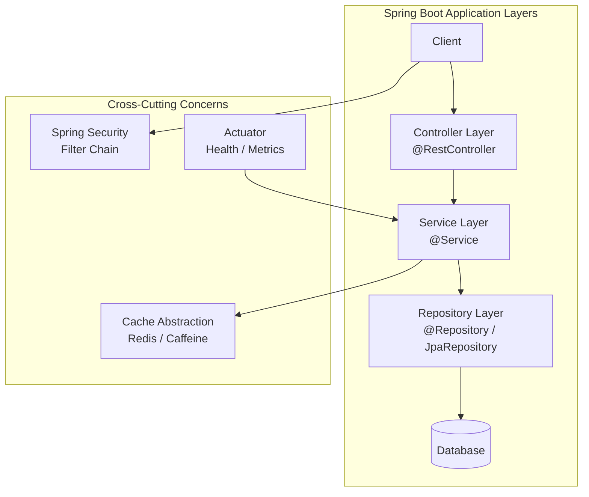
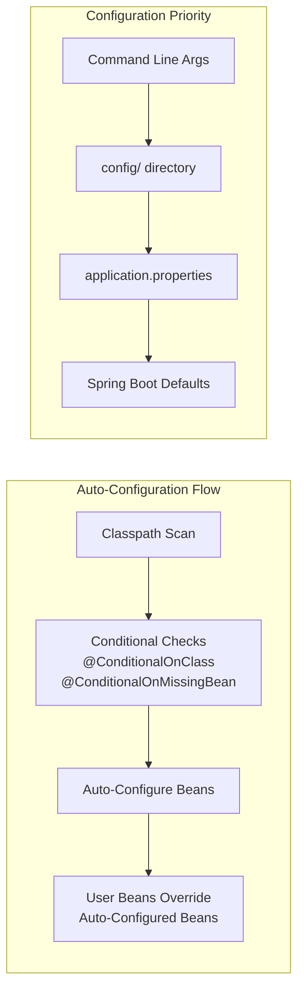

# Spring Boot

## Quick Reference

- Spring Boot is a convention-over-configuration framework that simplifies Spring application development with embedded servers, auto-configuration, and starter dependencies
- `@SpringBootApplication` combines `@Configuration`, `@EnableAutoConfiguration`, and `@ComponentScan` into a single annotation
- Starters aggregate dependencies: `spring-boot-starter-web`, `spring-boot-starter-data-jpa`, `spring-boot-starter-security`, `spring-boot-starter-actuator`
- Configuration priority (highest to lowest): command-line args → `config/application.properties` → `application.properties` → defaults
- Profiles enable environment-specific config: `application-dev.properties`, `application-prod.properties`, activated via `spring.profiles.active`
- Actuator exposes production endpoints: `/actuator/health`, `/actuator/metrics`, `/actuator/env`, `/actuator/beans`
- Auto-configuration backs off when you define your own beans, giving you full control without fighting the framework

## When to Use

Spring Boot is the standard choice for building production-grade Java applications where rapid development, embedded deployment, and minimal configuration are priorities. Use Spring Boot when you need a standalone application with an embedded server (Tomcat, Jetty, or Netty) that can be deployed as a single JAR without external application server management. It excels in microservice architectures where each service needs independent deployment, health monitoring, and externalized configuration. Spring Boot's auto-configuration eliminates boilerplate for common patterns like database connections, security filters, and message broker integration. Choose Spring Boot when your team needs consistent project structure across services, built-in observability through Actuator and Micrometer, and seamless integration with Spring Cloud for distributed systems patterns like service discovery, circuit breakers, and centralized configuration. The framework's opinionated defaults mean new developers can be productive immediately while experienced developers can override any default when needed.

## Code Examples

### Application Entry Point with Configuration

```java
@SpringBootApplication
@PropertySource("classpath:custom.properties")
public class OrderServiceApplication {

    public static void main(String[] args) {
        SpringApplication.run(OrderServiceApplication.class, args);
    }
}
```

### REST Controller with Validation and Exception Handling

```java
@RestController
@RequestMapping("/api/v1/customers")
public class CustomerController {

    private final CustomerService customerService;

    public CustomerController(CustomerService customerService) {
        this.customerService = customerService;
    }

    @GetMapping("/{id}")
    public ResponseEntity<CustomerDTO> getCustomer(@PathVariable Long id) {
        return ResponseEntity.ok(customerService.findById(id));
    }

    @PostMapping
    public ResponseEntity<CustomerDTO> createCustomer(
            @Valid @RequestBody CreateCustomerRequest request) {
        CustomerDTO created = customerService.create(request);
        URI location = ServletUriComponentsBuilder.fromCurrentRequest()
                .path("/{id}").buildAndExpand(created.getId()).toUri();
        return ResponseEntity.created(location).body(created);
    }
}

@RestControllerAdvice
public class GlobalExceptionHandler {

    @ExceptionHandler(ResourceNotFoundException.class)
    public ResponseEntity<ErrorResponse> handleNotFound(ResourceNotFoundException ex) {
        ErrorResponse error = new ErrorResponse(
            HttpStatus.NOT_FOUND.value(), ex.getMessage());
        return new ResponseEntity<>(error, HttpStatus.NOT_FOUND);
    }

    @ExceptionHandler(MethodArgumentNotValidException.class)
    public ResponseEntity<ErrorResponse> handleValidation(
            MethodArgumentNotValidException ex) {
        String message = ex.getBindingResult().getAllErrors().stream()
                .map(ObjectError::getDefaultMessage)
                .collect(Collectors.joining(", "));
        return new ResponseEntity<>(
            new ErrorResponse(HttpStatus.BAD_REQUEST.value(), message),
            HttpStatus.BAD_REQUEST);
    }
}
```

### Spring Data JPA Repository with Custom Queries

```java
@Entity
@Table(name = "customers")
public class Customer {
    @Id
    @GeneratedValue(strategy = GenerationType.IDENTITY)
    private Long id;

    @Column(nullable = false)
    private String name;

    @Column(unique = true, nullable = false)
    private String email;

    @Column(name = "created_at")
    private LocalDateTime createdAt;
}

public interface CustomerRepository extends JpaRepository<Customer, Long> {
    Optional<Customer> findByEmail(String email);

    @Query("SELECT c FROM Customer c WHERE c.createdAt > :since")
    List<Customer> findRecentCustomers(@Param("since") LocalDateTime since);

    Page<Customer> findByNameContainingIgnoreCase(String name, Pageable pageable);
}
```

### Profile-Based Configuration with YAML

```yaml
# application.yml - shared configuration
spring:
  application:
    name: order-service
  jpa:
    open-in-view: false
    hibernate:
      ddl-auto: validate

server:
  port: 8080
  servlet:
    context-path: /api

management:
  endpoints:
    web:
      exposure:
        include: health,metrics,info,prometheus
  endpoint:
    health:
      show-details: when-authorized

---
# application-dev.yml
spring:
  config:
    activate:
      on-profile: dev
  datasource:
    url: jdbc:h2:mem:devdb
    driver-class-name: org.h2.Driver
  jpa:
    show-sql: true
    hibernate:
      ddl-auto: create-drop

---
# application-prod.yml
spring:
  config:
    activate:
      on-profile: prod
  datasource:
    url: jdbc:postgresql://${DB_HOST}:5432/${DB_NAME}
    username: ${DB_USER}
    password: ${DB_PASS}
    hikari:
      maximum-pool-size: 20
      minimum-idle: 5
```

### Security Configuration with JWT

```java
@Configuration
@EnableWebSecurity
public class SecurityConfig {

    @Bean
    public SecurityFilterChain filterChain(HttpSecurity http) throws Exception {
        http
            .csrf(csrf -> csrf.disable())
            .sessionManagement(session ->
                session.sessionCreationPolicy(SessionCreationPolicy.STATELESS))
            .authorizeHttpRequests(auth -> auth
                .requestMatchers("/api/public/**", "/actuator/health").permitAll()
                .requestMatchers("/api/admin/**").hasRole("ADMIN")
                .anyRequest().authenticated())
            .oauth2ResourceServer(oauth2 -> oauth2.jwt(Customizer.withDefaults()));
        return http.build();
    }

    @Bean
    public PasswordEncoder passwordEncoder() {
        return new BCryptPasswordEncoder();
    }
}
```

### Caching with Redis

```java
@Configuration
@EnableCaching
public class CacheConfig {

    @Bean
    public RedisCacheManager cacheManager(RedisConnectionFactory factory) {
        RedisCacheConfiguration config = RedisCacheConfiguration.defaultCacheConfig()
                .entryTtl(Duration.ofMinutes(30))
                .serializeValuesWith(
                    SerializationPair.fromSerializer(new GenericJackson2JsonRedisSerializer()));
        return RedisCacheManager.builder(factory)
                .cacheDefaults(config)
                .build();
    }
}

@Service
public class ProductService {

    @Cacheable(value = "products", key = "#id")
    public ProductDTO findById(Long id) {
        return productRepository.findById(id)
                .map(this::toDTO)
                .orElseThrow(() -> new ResourceNotFoundException("Product not found"));
    }

    @CacheEvict(value = "products", key = "#id")
    public void update(Long id, UpdateProductRequest request) {
        // update logic
    }
}
```

## Architecture / Diagrams





## Common Pitfalls

1. **Circular dependency injection**: Two beans depending on each other causes `BeanCurrentlyInCreationException`. Refactor to break the cycle using `@Lazy`, extracting shared logic into a third bean, or redesigning the dependency graph. Constructor injection makes circular dependencies fail fast at startup rather than hiding them.

2. **N+1 query problem with JPA**: Lazy-loaded associations trigger individual queries for each parent entity. Use `@EntityGraph`, `JOIN FETCH` in JPQL, or batch fetching (`@BatchSize`) to load associations efficiently. Enable `spring.jpa.show-sql=true` in development to catch this early.

3. **Exposing entity classes directly in REST responses**: Coupling your API contract to your database schema means any schema change breaks clients. Use DTOs with MapStruct or manual mapping to decouple persistence from presentation. This also prevents accidentally serializing lazy-loaded proxies.

4. **Not configuring connection pool properly**: Default HikariCP settings may not suit production workloads. Set `maximum-pool-size` based on your database's max connections divided by application instances. Monitor pool metrics via Actuator to detect connection leaks or exhaustion before they cause outages.

5. **Ignoring Actuator security in production**: Exposing all Actuator endpoints without authentication leaks sensitive information (environment variables, bean definitions, heap dumps). Restrict exposure with `management.endpoints.web.exposure.include` and secure with Spring Security. Run Actuator on a separate management port in production.

## Real-World Use Cases

- **Microservice backends**: Each Spring Boot service owns a bounded context (orders, payments, inventory), deploys independently as a Docker container, and communicates via REST or messaging. Spring Boot's embedded server, health checks, and externalized configuration make it ideal for container orchestration with Kubernetes.

- **Event-driven architectures**: Spring Boot with `spring-boot-starter-amqp` or `spring-kafka` enables building event producers and consumers that react to domain events. Auto-configuration handles connection factories, serialization, and retry policies, while Actuator exposes consumer lag and message throughput metrics.

- **API gateways and BFF patterns**: Spring Boot with Spring Cloud Gateway provides routing, rate limiting, and authentication at the edge. The Backend-for-Frontend pattern uses a thin Spring Boot service to aggregate multiple downstream microservice calls into a single optimized response for specific client types.

- **Scheduled batch processing**: Spring Boot with `@Scheduled` or Spring Batch handles periodic data processing jobs like report generation, data synchronization, and cleanup tasks. Actuator health checks integrate with Kubernetes liveness probes to restart stuck jobs automatically.

## Interview Questions

**Q: How does Spring Boot auto-configuration work internally?**

A: Spring Boot scans `META-INF/spring/org.springframework.boot.autoconfigure.AutoConfiguration.imports` (or `spring.factories` in older versions) for auto-configuration classes. Each class uses conditional annotations like `@ConditionalOnClass`, `@ConditionalOnMissingBean`, and `@ConditionalOnProperty` to decide whether to create beans. User-defined beans always take precedence because `@ConditionalOnMissingBean` checks if you already defined one. This is why you can override any auto-configured behavior by simply declaring your own bean.

**Q: What is the difference between `@Component`, `@Service`, `@Repository`, and `@Controller`?**

A: All four are specializations of `@Component` and are detected by component scanning. `@Service` indicates business logic with no additional behavior. `@Repository` adds automatic exception translation (converting JDBC/JPA exceptions to Spring's `DataAccessException` hierarchy). `@Controller` marks MVC controllers for view resolution. `@RestController` combines `@Controller` with `@ResponseBody`. The distinction is primarily semantic for code readability, though `@Repository` has the concrete benefit of exception translation.

**Q: How do you handle distributed transactions across microservices in Spring Boot?**

A: Avoid distributed transactions (2PC) in microservices due to coupling and performance costs. Instead, use the Saga pattern with choreography (events) or orchestration (a coordinator service). Spring Boot supports this via Spring Cloud Stream for event-driven sagas or frameworks like Axon. For eventual consistency, implement compensating transactions and idempotent operations. Use outbox pattern with Debezium for reliable event publishing.

**Q: Explain Spring Boot's externalized configuration and property resolution order.**

A: Spring Boot resolves properties in a defined order where later sources override earlier ones: default properties → `application.properties` in classpath → profile-specific properties → environment variables → command-line arguments. This allows the same JAR to run in any environment by changing external configuration. In production, sensitive values come from environment variables or a secrets manager, while `application.properties` holds non-sensitive defaults. Spring Cloud Config Server adds centralized, versioned configuration for microservice fleets.

## Production Tips

- **Graceful shutdown**: Enable `server.shutdown=graceful` with `spring.lifecycle.timeout-per-shutdown-phase=30s` to allow in-flight requests to complete before the application stops. This prevents 502 errors during rolling deployments in Kubernetes. Combine with readiness probes that mark the pod as not-ready before shutdown begins.

- **Structured logging for observability**: Configure Logback to output JSON-formatted logs with correlation IDs for distributed tracing. Use MDC (Mapped Diagnostic Context) to propagate trace IDs across async boundaries. Ship logs to ELK or Loki for centralized querying. Set `logging.level.org.springframework=WARN` in production to reduce noise while keeping application-level logs at INFO.

- **Health check granularity**: Configure separate liveness (`/actuator/health/liveness`) and readiness (`/actuator/health/readiness`) probes. Liveness should only check if the JVM is responsive. Readiness should verify database connectivity, cache availability, and downstream service health. This prevents Kubernetes from killing pods that are temporarily unable to serve traffic but are otherwise healthy.

- **Connection pool monitoring**: Export HikariCP metrics to Prometheus via Micrometer (`management.metrics.export.prometheus.enabled=true`). Alert on `hikaricp_connections_pending` exceeding zero for more than 30 seconds, which indicates pool exhaustion. Set `spring.datasource.hikari.leak-detection-threshold=60000` to log stack traces of connections held longer than 60 seconds.

## Related Topics

- [Spring Framework](./spring-framework.md) — Spring Boot builds on top of the core Spring Framework IoC container and modules
- [Spring REST](./spring-rest.md) — Building RESTful APIs with Spring Boot's web layer
- [Spring Batch](./spring-batch.md) — Batch processing framework that integrates with Spring Boot for scheduled data jobs
