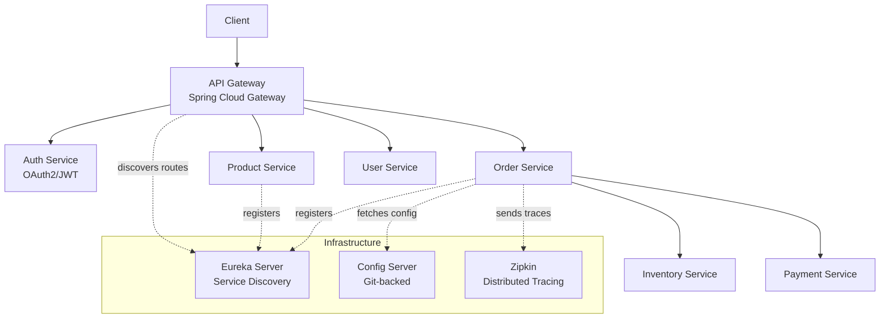
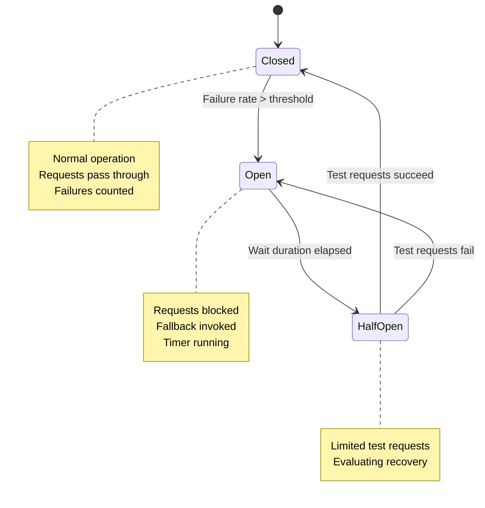
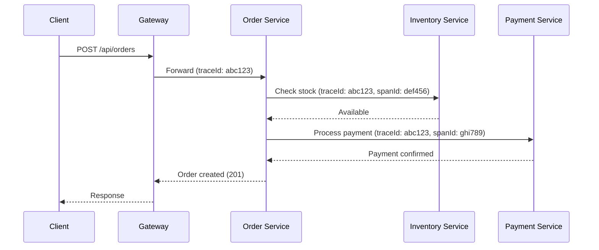

# Spring Cloud & Microservices

## Quick Reference

- Microservices architecture decomposes applications into small, independently deployable services organized around business capabilities
- Service Discovery: Eureka Server for registration, `@EnableDiscoveryClient` for clients, heartbeat-based health (30s default)
- API Gateway: Spring Cloud Gateway (or Zuul) provides routing, load balancing, security, and rate limiting at the edge
- Client-side load balancing: Spring Cloud LoadBalancer (replaces Ribbon) distributes requests across service instances
- Declarative REST clients: OpenFeign (`@FeignClient`) generates HTTP client implementations from interfaces with built-in load balancing
- Resilience: Resilience4j circuit breaker (replaces Hystrix) — states: Closed → Open → Half-Open with fallback methods
- Distributed tracing: Micrometer Tracing (replaces Sleuth) + Zipkin for end-to-end request tracking via traceId/spanId
- Centralized configuration: Spring Cloud Config Server backed by Git with `@RefreshScope` for runtime updates

## When to Use

Spring Cloud microservices architecture is appropriate when your application has grown beyond what a single team can effectively develop, deploy, and maintain as a monolith. Choose microservices when you need independent deployment cycles for different business domains, polyglot technology choices per service, or the ability to scale individual components based on their specific load patterns. Spring Cloud provides battle-tested solutions for the distributed systems challenges that microservices introduce: service discovery eliminates hardcoded URLs, circuit breakers prevent cascading failures, distributed tracing enables debugging across service boundaries, and centralized configuration manages environment-specific settings without redeployment. Use this architecture when your organization has the operational maturity for container orchestration (Kubernetes), CI/CD pipelines per service, and distributed monitoring. Do not adopt microservices prematurely — a well-structured monolith is simpler to develop, test, and deploy for small teams. The overhead of network communication, distributed transactions, and operational complexity only pays off at scale.

## Code Examples

### Service Discovery with Eureka

```java
// Eureka Server
@SpringBootApplication
@EnableEurekaServer
public class DiscoveryServerApplication {
    public static void main(String[] args) {
        SpringApplication.run(DiscoveryServerApplication.class, args);
    }
}

// application.yml for Eureka Server
// server:
//   port: 8761
// eureka:
//   client:
//     register-with-eureka: false
//     fetch-registry: false

// Eureka Client (any microservice)
@SpringBootApplication
@EnableDiscoveryClient
public class OrderServiceApplication {
    public static void main(String[] args) {
        SpringApplication.run(OrderServiceApplication.class, args);
    }
}
```

```yaml
# application.yml for a microservice client
spring:
  application:
    name: order-service
eureka:
  client:
    service-url:
      defaultZone: http://localhost:8761/eureka/
  instance:
    prefer-ip-address: true
```

### API Gateway with Spring Cloud Gateway

```java
@SpringBootApplication
public class GatewayApplication {
    public static void main(String[] args) {
        SpringApplication.run(GatewayApplication.class, args);
    }

    @Bean
    public RouteLocator customRoutes(RouteLocatorBuilder builder) {
        return builder.routes()
                .route("order-service", r -> r
                        .path("/api/orders/**")
                        .filters(f -> f
                                .stripPrefix(1)
                                .addRequestHeader("X-Gateway", "true")
                                .circuitBreaker(config -> config
                                        .setName("orderCircuitBreaker")
                                        .setFallbackUri("forward:/fallback/orders")))
                        .uri("lb://order-service"))
                .route("inventory-service", r -> r
                        .path("/api/inventory/**")
                        .filters(f -> f.stripPrefix(1))
                        .uri("lb://inventory-service"))
                .build();
    }
}
```

### Feign Declarative Client with Fallback

```java
@FeignClient(name = "inventory-service",
             fallbackFactory = InventoryClientFallbackFactory.class)
public interface InventoryClient {

    @GetMapping("/inventory/{sku}")
    InventoryResponse checkStock(@PathVariable String sku);

    @PostMapping("/inventory/reserve")
    ReservationResponse reserve(@RequestBody ReservationRequest request);
}

@Component
public class InventoryClientFallbackFactory
        implements FallbackFactory<InventoryClient> {

    @Override
    public InventoryClient create(Throwable cause) {
        return new InventoryClient() {
            @Override
            public InventoryResponse checkStock(String sku) {
                return InventoryResponse.unknown(sku);
            }

            @Override
            public ReservationResponse reserve(ReservationRequest request) {
                throw new ServiceUnavailableException(
                        "Inventory service unavailable", cause);
            }
        };
    }
}
```

### Circuit Breaker with Resilience4j

```java
@Service
public class OrderService {

    private final InventoryClient inventoryClient;

    @CircuitBreaker(name = "inventory", fallbackMethod = "inventoryFallback")
    @Retry(name = "inventory", fallbackMethod = "inventoryFallback")
    @TimeLimiter(name = "inventory")
    public CompletableFuture<OrderResponse> placeOrder(OrderRequest request) {
        InventoryResponse stock = inventoryClient.checkStock(request.getSku());
        if (!stock.isAvailable()) {
            throw new InsufficientStockException(request.getSku());
        }
        // proceed with order creation
        return CompletableFuture.completedFuture(createOrder(request));
    }

    private CompletableFuture<OrderResponse> inventoryFallback(
            OrderRequest request, Throwable t) {
        // Queue order for later processing
        orderQueue.enqueue(request);
        return CompletableFuture.completedFuture(
                OrderResponse.pending("Order queued, inventory check pending"));
    }
}
```

```yaml
# Resilience4j configuration
resilience4j:
  circuitbreaker:
    instances:
      inventory:
        sliding-window-size: 10
        failure-rate-threshold: 50
        wait-duration-in-open-state: 10s
        permitted-number-of-calls-in-half-open-state: 3
  retry:
    instances:
      inventory:
        max-attempts: 3
        wait-duration: 500ms
  timelimiter:
    instances:
      inventory:
        timeout-duration: 3s
```

### Centralized Configuration

```java
// Config Server
@SpringBootApplication
@EnableConfigServer
public class ConfigServerApplication {
    public static void main(String[] args) {
        SpringApplication.run(ConfigServerApplication.class, args);
    }
}
```

```yaml
# Config Server application.yml
server:
  port: 8888
spring:
  cloud:
    config:
      server:
        git:
          uri: https://github.com/org/config-repo
          default-label: main
          search-paths: '{application}'
```

```yaml
# Client microservice application.yml
spring:
  application:
    name: order-service
  config:
    import: optional:configserver:http://localhost:8888
```

```java
// Using @RefreshScope for runtime config updates
@RestController
@RefreshScope
public class FeatureFlagController {

    @Value("${feature.new-checkout:false}")
    private boolean newCheckoutEnabled;

    @GetMapping("/features/checkout")
    public Map<String, Boolean> getCheckoutFeature() {
        return Map.of("newCheckout", newCheckoutEnabled);
    }
}
```

### Distributed Tracing with Micrometer

```xml
<!-- Dependencies for tracing -->
<dependency>
    <groupId>io.micrometer</groupId>
    <artifactId>micrometer-tracing-bridge-brave</artifactId>
</dependency>
<dependency>
    <groupId>io.zipkin.reporter2</groupId>
    <artifactId>zipkin-reporter-brave</artifactId>
</dependency>
```

```yaml
# Tracing configuration
management:
  tracing:
    sampling:
      probability: 1.0  # 100% in dev, lower in prod
  zipkin:
    tracing:
      endpoint: http://localhost:9411/api/v2/spans
```

## Architecture / Diagrams







## Common Pitfalls

1. **Distributed monolith**: Splitting a monolith into microservices that still share a database, deploy together, or require synchronized releases gives you the worst of both worlds — distributed complexity without independent deployability. Each service must own its data and be deployable independently. If changing one service requires changing another, they should be merged.

2. **No circuit breaker on external calls**: Without circuit breakers, a slow downstream service causes thread pool exhaustion in the caller, which cascades to its callers, eventually bringing down the entire system. Every inter-service HTTP call needs a circuit breaker with appropriate thresholds and a meaningful fallback (cached data, degraded response, or queued retry).

3. **Synchronous chains of service calls**: A request that synchronously calls Service A → B → C → D creates a fragile chain where any service failure or slowness blocks the entire request. Use asynchronous messaging (Kafka, RabbitMQ) for operations that don't need immediate responses. For necessary synchronous calls, parallelize independent calls and set aggressive timeouts.

4. **Shared database between services**: Two services reading/writing the same database tables creates hidden coupling — schema changes in one service break the other. Each service should own its data exclusively. Use events or API composition for cross-service data needs. Accept eventual consistency as the trade-off for independence.

5. **Not handling partial failures in API composition**: When an endpoint aggregates data from multiple services and one fails, returning a 500 error to the client is often wrong. Design for graceful degradation — return available data with indicators of what's missing. A product page can show details without reviews if the review service is down.

## Real-World Use Cases

- **E-commerce platform decomposition**: Order, inventory, payment, shipping, and notification services each own their domain. The API gateway routes requests, Feign clients handle inter-service communication, and Kafka events trigger asynchronous workflows (order placed → reserve inventory → process payment → schedule shipping → send confirmation).

- **Multi-tenant SaaS platform**: Each tenant's configuration is managed via Spring Cloud Config with tenant-specific profiles. Service discovery enables dynamic scaling of compute-intensive services during peak hours. Circuit breakers isolate tenant workloads so one tenant's heavy usage doesn't degrade others.

- **Real-time data pipeline**: Microservices consume events from Kafka topics, process them (enrichment, validation, aggregation), and produce to downstream topics. Spring Cloud Stream provides the abstraction layer. Distributed tracing tracks an event's journey through the pipeline for debugging data quality issues.

- **Progressive migration from monolith**: The Strangler Fig pattern uses Spring Cloud Gateway to route requests — new features go to microservices while legacy features remain in the monolith. Over time, functionality is extracted service by service. Service discovery and the gateway make this transparent to clients.

## Interview Questions

**Q: How does service discovery work with Eureka, and what happens when the Eureka server goes down?**

A: Services register with Eureka on startup and send heartbeats every 30 seconds. Clients cache the registry locally and refresh every 30 seconds. If Eureka goes down, clients continue operating using their cached registry — they can still discover and call other services. However, new services cannot register and stale entries won't be evicted. For production, run Eureka in a cluster (peer-aware mode) where instances replicate registry data to each other, eliminating the single point of failure.

**Q: Explain the circuit breaker pattern and its three states.**

A: The circuit breaker monitors calls to a downstream service. In the Closed state, requests pass through normally while failures are counted. When the failure rate exceeds a threshold (e.g., 50% of the last 10 calls), it transitions to Open — all requests are immediately rejected and the fallback is invoked. After a configured wait duration, it moves to Half-Open, allowing a limited number of test requests through. If they succeed, the circuit closes; if they fail, it reopens. This prevents cascading failures by failing fast rather than waiting for timeouts on a known-broken service.

**Q: What is the difference between choreography and orchestration in microservices?**

A: In choreography, services react to events independently — Order Service publishes "OrderPlaced", and Inventory, Payment, and Notification services each subscribe and act autonomously. There's no central coordinator. In orchestration, a central service (saga orchestrator) explicitly tells each service what to do and handles the workflow logic. Choreography is more decoupled but harder to debug and monitor. Orchestration is easier to understand and modify but creates a central point of coupling. Choose choreography for simple flows and orchestration for complex multi-step transactions requiring compensation logic.

**Q: How do you handle distributed transactions across microservices?**

A: Avoid distributed transactions (2PC) due to coupling and availability costs. Instead, use the Saga pattern: a sequence of local transactions where each service commits its own transaction and publishes an event. If a step fails, compensating transactions undo previous steps. For example: Order Service creates order → Payment Service charges card → if shipping fails, Payment Service refunds and Order Service cancels. Implement with choreography (events) or orchestration (coordinator). Ensure operations are idempotent so retries are safe.

## Production Tips

- **Health check configuration for Kubernetes**: Configure separate liveness and readiness probes. Readiness should verify Eureka registration and downstream service connectivity. Set `eureka.instance.lease-renewal-interval-in-seconds=10` and `lease-expiration-duration-in-seconds=30` for faster failure detection in container environments where pods restart frequently.

- **Feign client timeout and retry tuning**: Set explicit connect and read timeouts on Feign clients (`feign.client.config.default.connectTimeout=2000`, `readTimeout=5000`). Combine with Resilience4j retry (not Feign's built-in retry) for better control. Log all Feign requests at DEBUG level in staging to catch unexpected latency before production.

- **Config Server high availability**: Run multiple Config Server instances behind a load balancer. Configure `spring.cloud.config.fail-fast=true` with retry (`spring.cloud.config.retry.max-attempts=5`) so services wait for Config Server during rolling deployments rather than starting with stale configuration. Use encryption for sensitive properties (`{cipher}` prefix).

- **Trace sampling in production**: Set `management.tracing.sampling.probability=0.1` (10%) in production to reduce tracing overhead and storage costs. Use 100% sampling only for specific problematic requests by propagating a sampling decision header from the gateway. Retain traces for at least 7 days in Zipkin for post-incident analysis.

## Related Topics

- [Spring Boot](./spring-boot.md) — Foundation framework for building individual microservices
- [Spring REST](./spring-rest.md) — HTTP API layer for inter-service communication
- [Apache Kafka](./apache-kafka.md) — Event-driven communication between microservices
