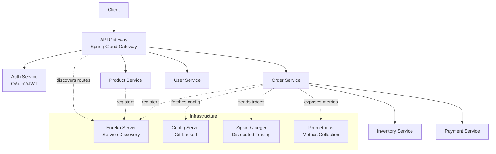
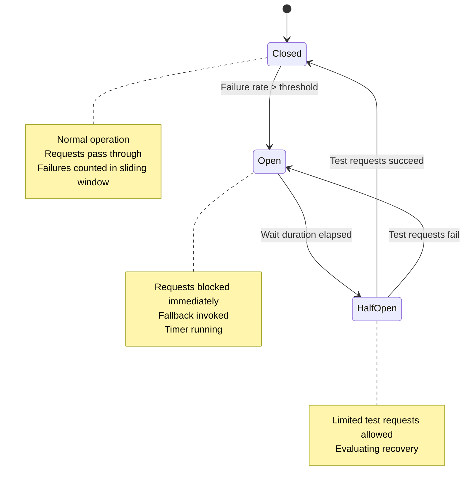
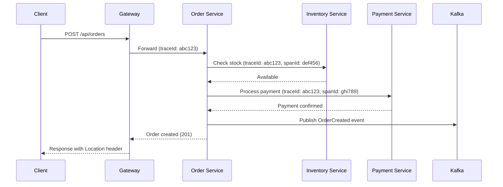

# Spring Cloud & Microservices

## Quick Reference

- Microservices architecture decomposes applications into small, independently deployable services organized around business capabilities
- Service Discovery: Eureka Server for registration, `@EnableDiscoveryClient` for clients, heartbeat-based health (30s default)
- API Gateway: Spring Cloud Gateway provides routing, load balancing, security, rate limiting, and request transformation at the edge
- Client-side load balancing: Spring Cloud LoadBalancer (replaces Ribbon) distributes requests across service instances
- Declarative REST clients: OpenFeign (`@FeignClient`) generates HTTP client implementations from interfaces with built-in load balancing
- `@HttpExchange` interfaces (Spring 6) replace Feign for declarative HTTP clients with native Spring integration
- Resilience: Resilience4j circuit breaker — states: Closed → Open → Half-Open with configurable thresholds and fallback methods
- Resilience4j also provides: retry, rate limiter, bulkhead (thread pool isolation), and time limiter patterns
- Distributed tracing: Micrometer Tracing (replaces Sleuth) + Zipkin/Jaeger for end-to-end request tracking via traceId/spanId
- Centralized configuration: Spring Cloud Config Server backed by Git, Vault, or database with `@RefreshScope` for runtime updates
- Kubernetes-native service discovery via `spring-cloud-kubernetes` eliminates the need for Eureka in K8s environments
- Spring Cloud Stream provides event-driven microservice communication abstraction over Kafka/RabbitMQ
- Spring Cloud 2023+ aligns with Spring Boot 3.x and requires Java 17+, Jakarta EE 9+ namespace
- Saga pattern for distributed transactions: choreography (events) or orchestration (coordinator service)

## When to Use

Spring Cloud microservices architecture is appropriate when your application has grown beyond what a single team can effectively develop, deploy, and maintain as a monolith. Choose microservices when you need independent deployment cycles for different business domains, polyglot technology choices per service, or the ability to scale individual components based on their specific load patterns. Spring Cloud provides battle-tested solutions for the distributed systems challenges that microservices introduce: service discovery eliminates hardcoded URLs, circuit breakers prevent cascading failures, distributed tracing enables debugging across service boundaries, and centralized configuration manages environment-specific settings without redeployment.

Use this architecture when your organization has the operational maturity for container orchestration (Kubernetes), CI/CD pipelines per service, and distributed monitoring. Do not adopt microservices prematurely — a well-structured monolith is simpler to develop, test, and deploy for small teams. The overhead of network communication, distributed transactions, and operational complexity only pays off at scale (typically 5+ teams working on the same product). Start with a modular monolith and extract services when deployment independence becomes a bottleneck.

## Code Examples

### Service Discovery with Eureka

```java
// Eureka Server
@SpringBootApplication
@EnableEurekaServer
public class DiscoveryServerApplication {
    public static void main(String[] args) {
        SpringApplication.run(DiscoveryServerApplication.class, args);
    }
}
```

```yaml
# Eureka Server application.yml
server:
  port: 8761
eureka:
  client:
    register-with-eureka: false
    fetch-registry: false
  server:
    enable-self-preservation: true
    eviction-interval-timer-in-ms: 5000
    response-cache-update-interval-ms: 3000
```

```yaml
# Microservice client application.yml
spring:
  application:
    name: order-service
eureka:
  client:
    service-url:
      defaultZone: http://eureka-1:8761/eureka/,http://eureka-2:8762/eureka/
    registry-fetch-interval-seconds: 15
  instance:
    prefer-ip-address: true
    lease-renewal-interval-in-seconds: 10
    lease-expiration-duration-in-seconds: 30
    metadata-map:
      version: ${app.version}
      zone: us-east-1a
```

### API Gateway with Spring Cloud Gateway

```java
@SpringBootApplication
public class GatewayApplication {
    public static void main(String[] args) {
        SpringApplication.run(GatewayApplication.class, args);
    }

    @Bean
    public RouteLocator customRoutes(RouteLocatorBuilder builder) {
        return builder.routes()
            .route("order-service", r -> r
                .path("/api/orders/**")
                .filters(f -> f
                    .stripPrefix(1)
                    .addRequestHeader("X-Gateway-Timestamp", Instant.now().toString())
                    .circuitBreaker(config -> config
                        .setName("orderCircuitBreaker")
                        .setFallbackUri("forward:/fallback/orders"))
                    .requestRateLimiter(config -> config
                        .setRateLimiter(redisRateLimiter())
                        .setKeyResolver(userKeyResolver()))
                    .retry(config -> config
                        .setRetries(2)
                        .setStatuses(HttpStatus.SERVICE_UNAVAILABLE)
                        .setBackoff(Duration.ofMillis(100), Duration.ofSeconds(1), 2, true)))
                .uri("lb://order-service"))
            .route("inventory-service", r -> r
                .path("/api/inventory/**")
                .filters(f -> f
                    .stripPrefix(1)
                    .addResponseHeader("X-Response-Time", "#{T(System).currentTimeMillis()}"))
                .uri("lb://inventory-service"))
            .build();
    }

    @Bean
    public RedisRateLimiter redisRateLimiter() {
        return new RedisRateLimiter(10, 20);  // 10 requests/sec, burst of 20
    }

    @Bean
    public KeyResolver userKeyResolver() {
        return exchange -> Mono.justOrEmpty(
            exchange.getRequest().getHeaders().getFirst("X-API-Key"))
            .defaultIfEmpty("anonymous");
    }
}

// Fallback controller
@RestController
public class FallbackController {

    @GetMapping("/fallback/orders")
    public ResponseEntity<Map<String, String>> ordersFallback() {
        return ResponseEntity.status(HttpStatus.SERVICE_UNAVAILABLE)
            .body(Map.of(
                "message", "Order service is temporarily unavailable",
                "suggestion", "Please retry in a few seconds"));
    }
}
```

### Circuit Breaker with Resilience4j

```java
@Service
@RequiredArgsConstructor
public class OrderService {

    private final InventoryClient inventoryClient;
    private final CircuitBreakerRegistry circuitBreakerRegistry;

    @CircuitBreaker(name = "inventory", fallbackMethod = "inventoryFallback")
    @Retry(name = "inventory", fallbackMethod = "inventoryFallback")
    @TimeLimiter(name = "inventory")
    @Bulkhead(name = "inventory", type = Bulkhead.Type.THREADPOOL)
    public CompletableFuture<OrderResponse> placeOrder(OrderRequest request) {
        InventoryResponse stock = inventoryClient.checkStock(request.getSku());
        if (!stock.isAvailable()) {
            throw new InsufficientStockException(request.getSku());
        }
        return CompletableFuture.completedFuture(createOrder(request));
    }

    private CompletableFuture<OrderResponse> inventoryFallback(
            OrderRequest request, Throwable t) {
        log.warn("Inventory service unavailable, queuing order: {}", t.getMessage());
        orderQueue.enqueue(request);
        return CompletableFuture.completedFuture(
            OrderResponse.pending("Order queued, inventory check pending"));
    }

    // Programmatic circuit breaker usage
    public OrderResponse placeOrderProgrammatic(OrderRequest request) {
        CircuitBreaker cb = circuitBreakerRegistry.circuitBreaker("inventory");
        return cb.executeSupplier(() -> {
            InventoryResponse stock = inventoryClient.checkStock(request.getSku());
            if (!stock.isAvailable()) {
                throw new InsufficientStockException(request.getSku());
            }
            return createOrder(request);
        });
    }
}
```

```yaml
# Resilience4j configuration
resilience4j:
  circuitbreaker:
    instances:
      inventory:
        sliding-window-type: COUNT_BASED
        sliding-window-size: 10
        failure-rate-threshold: 50
        slow-call-rate-threshold: 80
        slow-call-duration-threshold: 2s
        wait-duration-in-open-state: 10s
        permitted-number-of-calls-in-half-open-state: 3
        minimum-number-of-calls: 5
        record-exceptions:
          - java.io.IOException
          - java.net.SocketTimeoutException
        ignore-exceptions:
          - com.example.BusinessException
  retry:
    instances:
      inventory:
        max-attempts: 3
        wait-duration: 500ms
        exponential-backoff-multiplier: 2
        retry-exceptions:
          - java.io.IOException
  timelimiter:
    instances:
      inventory:
        timeout-duration: 3s
        cancel-running-future: true
  bulkhead:
    instances:
      inventory:
        max-concurrent-calls: 25
        max-wait-duration: 500ms
```

### Feign Client with Fallback and Configuration

```java
@FeignClient(name = "inventory-service",
             configuration = InventoryFeignConfig.class,
             fallbackFactory = InventoryClientFallbackFactory.class)
public interface InventoryClient {

    @GetMapping("/inventory/{sku}")
    InventoryResponse checkStock(@PathVariable String sku);

    @PostMapping("/inventory/reserve")
    ReservationResponse reserve(@RequestBody ReservationRequest request);

    @GetMapping("/inventory/bulk")
    List<InventoryResponse> checkBulkStock(@RequestParam("skus") List<String> skus);
}

@Configuration
public class InventoryFeignConfig {

    @Bean
    public RequestInterceptor bearerTokenInterceptor() {
        return template -> {
            Authentication auth = SecurityContextHolder.getContext().getAuthentication();
            if (auth instanceof JwtAuthenticationToken jwt) {
                template.header("Authorization", "Bearer " + jwt.getToken().getTokenValue());
            }
        };
    }

    @Bean
    public ErrorDecoder errorDecoder() {
        return (methodKey, response) -> {
            if (response.status() == 404) {
                return new ResourceNotFoundException("Inventory item not found");
            }
            if (response.status() == 429) {
                return new RateLimitExceededException("Inventory service rate limited");
            }
            return new FeignException.InternalServerError(
                "Inventory service error", response.request(), null, null);
        };
    }
}

@Component
public class InventoryClientFallbackFactory implements FallbackFactory<InventoryClient> {

    @Override
    public InventoryClient create(Throwable cause) {
        return new InventoryClient() {
            @Override
            public InventoryResponse checkStock(String sku) {
                log.warn("Fallback: returning unknown stock for {}: {}", sku, cause.getMessage());
                return InventoryResponse.unknown(sku);
            }

            @Override
            public ReservationResponse reserve(ReservationRequest request) {
                throw new ServiceUnavailableException("Inventory service unavailable", cause);
            }

            @Override
            public List<InventoryResponse> checkBulkStock(List<String> skus) {
                return skus.stream().map(InventoryResponse::unknown).toList();
            }
        };
    }
}
```

### Centralized Configuration with Spring Cloud Config

```java
// Config Server
@SpringBootApplication
@EnableConfigServer
public class ConfigServerApplication {
    public static void main(String[] args) {
        SpringApplication.run(ConfigServerApplication.class, args);
    }
}
```

```yaml
# Config Server application.yml
server:
  port: 8888
spring:
  cloud:
    config:
      server:
        git:
          uri: https://github.com/org/config-repo
          default-label: main
          search-paths: '{application}'
          clone-on-start: true
        encrypt:
          enabled: true
encrypt:
  key: ${CONFIG_ENCRYPT_KEY}
```

```yaml
# Client microservice bootstrap
spring:
  application:
    name: order-service
  config:
    import: optional:configserver:http://config-server:8888
  cloud:
    config:
      fail-fast: true
      retry:
        max-attempts: 5
        initial-interval: 1000
        multiplier: 1.5
```

```java
// Using @RefreshScope for runtime config updates without restart
@RestController
@RefreshScope
@RequiredArgsConstructor
public class FeatureFlagController {

    @Value("${feature.new-checkout:false}")
    private boolean newCheckoutEnabled;

    @Value("${feature.max-items-per-order:50}")
    private int maxItemsPerOrder;

    @GetMapping("/features")
    public Map<String, Object> getFeatures() {
        return Map.of(
            "newCheckout", newCheckoutEnabled,
            "maxItemsPerOrder", maxItemsPerOrder);
    }
}
// Trigger refresh: POST /actuator/refresh or Spring Cloud Bus broadcast
```

### Distributed Tracing with Micrometer and OpenTelemetry

```java
@Configuration
public class ObservabilityConfig {

    @Bean
    public ObservationRegistryCustomizer<ObservationRegistry> observationCustomizer() {
        return registry -> registry.observationConfig()
            .observationHandler(new DefaultMeterObservationHandler(meterRegistry()));
    }
}

@Service
@RequiredArgsConstructor
public class OrderService {

    private final ObservationRegistry observationRegistry;
    private final OrderRepository orderRepository;
    private final InventoryClient inventoryClient;

    public OrderResponse createOrder(CreateOrderRequest request) {
        return Observation.createNotStarted("order.creation", observationRegistry)
            .lowCardinalityKeyValue("order.type", request.getType().name())
            .highCardinalityKeyValue("customer.id", request.getCustomerId().toString())
            .observe(() -> {
                // Each downstream call automatically gets traceId propagated
                InventoryResponse stock = inventoryClient.checkStock(request.getSku());
                Order order = Order.from(request);
                order = orderRepository.save(order);
                return OrderResponse.from(order);
            });
    }
}
```

```yaml
# OpenTelemetry export configuration
management:
  otlp:
    tracing:
      endpoint: http://otel-collector:4318/v1/traces
    metrics:
      export:
        endpoint: http://otel-collector:4318/v1/metrics
  tracing:
    sampling:
      probability: 0.1  # 10% in production
  metrics:
    distribution:
      percentiles-histogram:
        http.server.requests: true
    tags:
      application: ${spring.application.name}
      environment: ${spring.profiles.active:default}
```

### Kubernetes-Native Service Discovery

```yaml
# application.yml for Kubernetes deployment (replaces Eureka)
spring:
  application:
    name: order-service
  cloud:
    kubernetes:
      discovery:
        enabled: true
        all-namespaces: false
      config:
        enabled: true
        sources:
          - name: order-service-config
      reload:
        enabled: true
        strategy: refresh
        period: 15000
```

```yaml
# Kubernetes deployment manifest
apiVersion: apps/v1
kind: Deployment
metadata:
  name: order-service
spec:
  replicas: 3
  selector:
    matchLabels:
      app: order-service
  template:
    metadata:
      labels:
        app: order-service
      annotations:
        prometheus.io/scrape: "true"
        prometheus.io/port: "8080"
        prometheus.io/path: "/actuator/prometheus"
    spec:
      containers:
        - name: order-service
          image: registry.example.com/order-service:latest
          ports:
            - containerPort: 8080
          env:
            - name: SPRING_PROFILES_ACTIVE
              value: kubernetes
          livenessProbe:
            httpGet:
              path: /actuator/health/liveness
              port: 8080
            initialDelaySeconds: 30
            periodSeconds: 10
          readinessProbe:
            httpGet:
              path: /actuator/health/readiness
              port: 8080
            initialDelaySeconds: 10
            periodSeconds: 5
          resources:
            requests:
              memory: "256Mi"
              cpu: "250m"
            limits:
              memory: "512Mi"
              cpu: "1000m"
---
apiVersion: v1
kind: Service
metadata:
  name: order-service
spec:
  selector:
    app: order-service
  ports:
    - port: 8080
      targetPort: 8080
```

## Architecture / Diagrams







## Common Pitfalls

1. **Distributed monolith**: Splitting a monolith into microservices that still share a database, deploy together, or require synchronized releases gives you the worst of both worlds. Each service must own its data and be deployable independently. If changing one service requires changing another, they should be merged.

2. **No circuit breaker on external calls**: Without circuit breakers, a slow downstream service causes thread pool exhaustion in the caller, which cascades to its callers. Every inter-service HTTP call needs a circuit breaker with appropriate thresholds and a meaningful fallback (cached data, degraded response, or queued retry).

3. **Synchronous chains of service calls**: A request that synchronously calls Service A → B → C → D creates a fragile chain where any failure blocks the entire request. Use asynchronous messaging (Kafka, RabbitMQ) for operations that don't need immediate responses. For necessary synchronous calls, parallelize independent calls and set aggressive timeouts.

4. **Shared database between services**: Two services reading/writing the same tables creates hidden coupling. Each service should own its data exclusively. Use events or API composition for cross-service data needs. Accept eventual consistency as the trade-off for independence.

5. **Not handling partial failures in API composition**: When an endpoint aggregates data from multiple services and one fails, returning a 500 error is often wrong. Design for graceful degradation — return available data with indicators of what's missing.

6. **Ignoring observability from day one**: Without distributed tracing and centralized logging, debugging production issues across 10+ microservices becomes nearly impossible. Instrument services with Micrometer Tracing from the start. The cost of adding observability retroactively is 5-10x higher than building it in from the beginning.

7. **Over-engineering from the start**: Starting with Eureka, Config Server, API Gateway, and message brokers for a 3-service application adds unnecessary complexity. Start simple (direct HTTP calls, environment variables for config) and add infrastructure components as the system grows and the pain points become clear.

8. **Missing idempotency in event consumers**: Network failures cause message redelivery. If consumers are not idempotent, duplicate processing corrupts data. Use idempotency keys, database constraints, or deduplication tables to ensure processing the same event twice produces the same result.

## Real-World Use Cases

- **E-commerce platform decomposition**: Order, inventory, payment, shipping, and notification services each own their domain. The API gateway routes requests, Feign clients handle inter-service communication, and Kafka events trigger asynchronous workflows (order placed → reserve inventory → process payment → schedule shipping → send confirmation).

- **Multi-tenant SaaS platform**: Each tenant's configuration is managed via Spring Cloud Config with tenant-specific profiles. Service discovery enables dynamic scaling of compute-intensive services during peak hours. Circuit breakers isolate tenant workloads so one tenant's heavy usage doesn't degrade others.

- **Real-time data pipeline**: Microservices consume events from Kafka topics, process them (enrichment, validation, aggregation), and produce to downstream topics. Spring Cloud Stream provides the abstraction layer. Distributed tracing tracks an event's journey through the pipeline.

- **Progressive migration from monolith**: The Strangler Fig pattern uses Spring Cloud Gateway to route requests — new features go to microservices while legacy features remain in the monolith. Over time, functionality is extracted service by service, transparent to clients.

- **Multi-region deployment**: Services deployed across AWS regions use Spring Cloud Gateway for geographic routing, Config Server for region-specific configuration, and Kafka for cross-region event replication. Circuit breakers prevent cross-region calls from blocking when a region is degraded.

## Interview Questions

**Q: How does service discovery work with Eureka, and what happens when the Eureka server goes down?**

A: Services register with Eureka on startup and send heartbeats every 30 seconds. Clients cache the registry locally and refresh every 30 seconds. If Eureka goes down, clients continue operating using their cached registry — they can still discover and call other services. However, new services cannot register and stale entries won't be evicted. For production, run Eureka in a cluster (peer-aware mode) where instances replicate registry data to each other, eliminating the single point of failure.

**Q: Explain the circuit breaker pattern and its three states.**

A: The circuit breaker monitors calls to a downstream service. In the Closed state, requests pass through normally while failures are counted in a sliding window. When the failure rate exceeds a threshold (e.g., 50% of the last 10 calls), it transitions to Open — all requests are immediately rejected and the fallback is invoked. After a configured wait duration, it moves to Half-Open, allowing a limited number of test requests. If they succeed, the circuit closes; if they fail, it reopens. This prevents cascading failures by failing fast rather than waiting for timeouts.

**Q: What is the difference between choreography and orchestration in microservices?**

A: In choreography, services react to events independently — Order Service publishes "OrderPlaced", and Inventory, Payment, and Notification services each subscribe and act autonomously. No central coordinator exists. In orchestration, a central service explicitly tells each service what to do and handles the workflow logic, including compensation on failure. Choreography is more decoupled but harder to debug. Orchestration is easier to understand and modify but creates a central point of coupling. Choose choreography for simple flows and orchestration for complex multi-step transactions requiring compensation logic.

**Q: How do you handle distributed transactions across microservices?**

A: Avoid distributed transactions (2PC) due to coupling and availability costs. Use the Saga pattern: a sequence of local transactions where each service commits its own transaction and publishes an event. If a step fails, compensating transactions undo previous steps. Implement with choreography (events) or orchestration (coordinator). Ensure operations are idempotent so retries are safe. Use the outbox pattern for reliable event publishing within the same database transaction as the business operation.

**Q: How does Kubernetes-native service discovery differ from Eureka?**

A: With Eureka, services register themselves and clients cache the registry. With Kubernetes-native discovery (`spring-cloud-kubernetes`), services are discovered via Kubernetes Service resources and cluster DNS. Kubernetes handles registration automatically when pods start. Advantages: eliminates Eureka infrastructure, leverages Kubernetes health checks, integrates with ConfigMaps. Trade-off: tightly couples to Kubernetes, making local development harder. Use Eureka for multi-platform deployments; use Kubernetes discovery for K8s-only environments.

**Q: What is the difference between Spring Cloud Gateway and a Kubernetes Ingress Controller?**

A: Kubernetes Ingress Controllers (NGINX, Traefik) operate at the infrastructure level — TLS termination, basic path routing, load balancing. Spring Cloud Gateway operates at the application level with full access to Spring's ecosystem — business logic, request/response transformation, Spring Security integration for OAuth2 token validation, rate limiting with custom algorithms, and routing based on request body content. Use Ingress for infrastructure concerns and Spring Cloud Gateway for application-level concerns.

**Q: How does Resilience4j's bulkhead pattern prevent cascading failures?**

A: The bulkhead pattern isolates different service calls into separate thread pools (or semaphores), preventing a slow service from consuming all available threads. If the inventory service is slow, only the threads allocated to inventory calls are blocked — other service calls (payment, shipping) continue unaffected. Resilience4j supports two bulkhead types: semaphore-based (limits concurrent calls) and thread-pool-based (dedicated thread pool per downstream service). Configure `maxConcurrentCalls` based on the downstream service's capacity and your acceptable queue depth.

**Q: How do you implement the Saga pattern with Spring Cloud?**

A: For choreography-based sagas, use Spring Cloud Stream with Kafka/RabbitMQ. Each service listens for events and publishes its own events after completing its local transaction. For orchestration-based sagas, create a dedicated saga orchestrator service that coordinates the workflow, calling each participant service in sequence and triggering compensating actions on failure. Frameworks like Axon or Temporal provide saga orchestration infrastructure. In both cases, ensure idempotent operations, store saga state for recovery, and implement dead letter queues for failed events.

## Production Tips

- **Health check configuration for Kubernetes**: Configure separate liveness and readiness probes. Readiness should verify downstream service connectivity. Set `eureka.instance.lease-renewal-interval-in-seconds=10` and `lease-expiration-duration-in-seconds=30` for faster failure detection in container environments.

- **Feign client timeout and retry tuning**: Set explicit connect and read timeouts (`feign.client.config.default.connectTimeout=2000`, `readTimeout=5000`). Combine with Resilience4j retry (not Feign's built-in retry) for better control. Log all Feign requests at DEBUG level in staging to catch unexpected latency.

- **Config Server high availability**: Run multiple Config Server instances behind a load balancer. Configure `spring.cloud.config.fail-fast=true` with retry so services wait for Config Server during rolling deployments. Use encryption for sensitive properties (`{cipher}` prefix). Consider Kubernetes ConfigMaps as a simpler alternative for K8s-only deployments.

- **Trace sampling in production**: Set `management.tracing.sampling.probability=0.1` (10%) in production to reduce overhead and storage costs. Use 100% sampling only for specific problematic requests by propagating a sampling decision header. Retain traces for at least 7 days for post-incident analysis.

- **GraalVM native images for microservices**: Compile to native images for sub-second startup and 50-80% memory reduction. This enables aggressive Kubernetes HPA scaling — pods start in 100ms instead of 15 seconds. Use multi-stage Docker builds with distroless runtime images. Test native compilation in CI to catch reflection issues early.

- **Service mesh vs. Spring Cloud**: For large deployments (50+ services), consider offloading cross-cutting concerns (mTLS, retries, circuit breaking, observability) to a service mesh like Istio or Linkerd. This removes resilience logic from application code and provides consistent behavior across polyglot services. Spring Cloud remains valuable for application-level concerns that service meshes cannot handle.

- **Event-driven communication with Spring Cloud Stream**: Use Spring Cloud Stream for asynchronous inter-service communication. Define `Function<Input, Output>` beans that automatically bind to Kafka/RabbitMQ topics. This decouples services temporally (producer doesn't wait for consumer) and allows independent scaling of producers and consumers.

## Related Topics

- [Spring Boot](./spring-boot.md) — Foundation framework for building individual microservices
- [Spring REST](./spring-rest.md) — HTTP API layer for inter-service communication
- [Spring Security](./spring-security.md) — OAuth2 and JWT for securing inter-service communication
- [Apache Kafka](../../messaging/apache-kafka.md) — Event-driven communication between microservices
