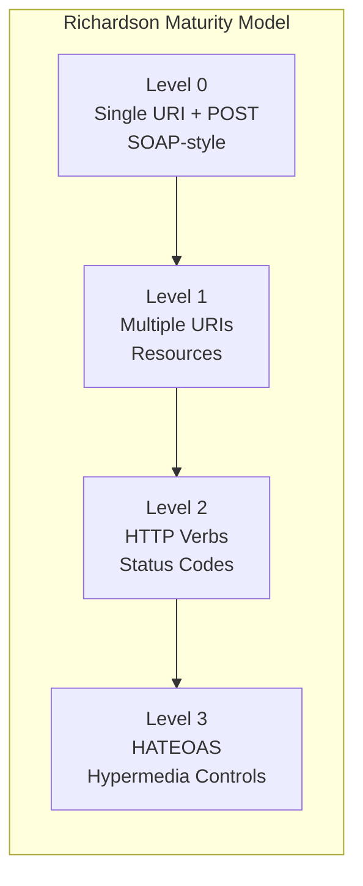

# Spring REST

## Quick Reference

- `@RestController` combines `@Controller` + `@ResponseBody`; returns data (JSON/XML) instead of views
- HTTP method mappings: `@GetMapping`, `@PostMapping`, `@PutMapping`, `@PatchMapping`, `@DeleteMapping`
- Request data binding: `@RequestBody` (JSON body), `@PathVariable` (URI segments), `@RequestParam` (query params)
- Content negotiation via `Accept` header; Jackson handles JSON serialization by default, add `jackson-dataformat-xml` for XML
- Validation: `@Valid` on `@RequestBody` triggers Bean Validation (JSR-380); `@Validated` on class enables `@PathVariable`/`@RequestParam` validation
- Global exception handling: `@RestControllerAdvice` + `@ExceptionHandler` returns structured error responses
- Richardson Maturity Model: Level 0 (single URI) → Level 1 (resources) → Level 2 (HTTP verbs) → Level 3 (HATEOAS)
- `RestClient` (Spring 6.1) is the modern synchronous HTTP client replacing `RestTemplate`, with fluent API and error handling
- `WebClient` (reactive) supports non-blocking I/O with backpressure, timeouts, and retry policies
- `ProblemDetail` (RFC 7807) provides standardized error response format in Spring 6
- OpenAPI 3.0 documentation via SpringDoc generates interactive Swagger UI from controller annotations
- HATEOAS with `spring-boot-starter-hateoas` adds hypermedia links to responses via `EntityModel` and `CollectionModel`
- Pagination via Spring Data's `Pageable` parameter with automatic `page`, `size`, `sort` query parameter resolution
- API versioning strategies: URI path (`/v1/`), custom header (`X-API-VERSION`), media type (`application/vnd.app.v1+json`)

## When to Use

Spring REST is the standard approach for building HTTP APIs in the Spring ecosystem when you need stateless, resource-oriented services that communicate via JSON or XML. Use Spring REST when building microservice APIs consumed by frontends (React, Angular), mobile apps, or other backend services. It excels when you need fine-grained control over HTTP semantics including status codes, headers, content negotiation, and HATEOAS links. Spring REST integrates seamlessly with Spring Security for OAuth2/JWT authentication, Spring Data for pagination and sorting, and Bean Validation for input sanitization. Choose Spring REST over Spring MVC (view-based) when your API serves data rather than rendered HTML. For reactive non-blocking APIs handling high concurrency, consider Spring WebFlux with the same annotation model. Spring REST's mature ecosystem provides built-in support for API documentation (SpringDoc/OpenAPI), versioning strategies, CORS configuration, and comprehensive testing via MockMvc and `RestClient` test support.

Understanding the differences between `RestTemplate` (deprecated for new code), `WebClient` (reactive), and `RestClient` (modern synchronous) is essential for choosing the right HTTP client for service-to-service communication. Each has different threading models, error handling approaches, and performance characteristics that affect application architecture.

## Code Examples

### Complete CRUD Controller with Pagination and HATEOAS

```java
@RestController
@RequestMapping("/api/v1/orders")
@Validated
@RequiredArgsConstructor
public class OrderController {

    private final OrderService orderService;
    private final PagedResourcesAssembler<OrderDTO> pagedAssembler;

    @GetMapping
    public PagedModel<EntityModel<OrderDTO>> listOrders(
            @RequestParam(defaultValue = "0") int page,
            @RequestParam(defaultValue = "20") int size,
            @RequestParam(defaultValue = "createdAt,desc") String sort) {
        Pageable pageable = PageRequest.of(page, size, Sort.by(sort.split(",")));
        Page<OrderDTO> orders = orderService.findAll(pageable);
        return pagedAssembler.toModel(orders, order ->
            EntityModel.of(order,
                linkTo(methodOn(OrderController.class).getOrder(order.getId())).withSelfRel(),
                linkTo(methodOn(OrderController.class).listOrders(page, size, sort))
                    .withRel("orders")));
    }

    @GetMapping("/{id}")
    public EntityModel<OrderDTO> getOrder(@PathVariable Long id) {
        OrderDTO order = orderService.findById(id);
        return EntityModel.of(order,
            linkTo(methodOn(OrderController.class).getOrder(id)).withSelfRel(),
            linkTo(methodOn(OrderController.class).listOrders(0, 20, "createdAt,desc"))
                .withRel("all-orders"),
            linkTo(methodOn(OrderController.class).updateOrder(id, null)).withRel("update"),
            linkTo(methodOn(OrderController.class).deleteOrder(id)).withRel("delete"));
    }

    @PostMapping
    public ResponseEntity<EntityModel<OrderDTO>> createOrder(
            @Valid @RequestBody CreateOrderRequest request) {
        OrderDTO created = orderService.create(request);
        EntityModel<OrderDTO> model = EntityModel.of(created,
            linkTo(methodOn(OrderController.class).getOrder(created.getId())).withSelfRel());
        return ResponseEntity
            .created(model.getRequiredLink("self").toUri())
            .body(model);
    }

    @PutMapping("/{id}")
    public ResponseEntity<OrderDTO> updateOrder(
            @PathVariable Long id,
            @Valid @RequestBody UpdateOrderRequest request) {
        return ResponseEntity.ok(orderService.update(id, request));
    }

    @DeleteMapping("/{id}")
    public ResponseEntity<Void> deleteOrder(@PathVariable Long id) {
        orderService.delete(id);
        return ResponseEntity.noContent().build();
    }
}
```

### Exception Handling with RFC 7807 ProblemDetail

```java
@RestControllerAdvice
public class ApiExceptionHandler {

    @ExceptionHandler(ResourceNotFoundException.class)
    public ProblemDetail handleNotFound(ResourceNotFoundException ex) {
        ProblemDetail problem = ProblemDetail.forStatusAndDetail(
            HttpStatus.NOT_FOUND, ex.getMessage());
        problem.setTitle("Resource Not Found");
        problem.setType(URI.create("https://api.example.com/errors/not-found"));
        problem.setProperty("resourceType", ex.getResourceType());
        problem.setProperty("resourceId", ex.getResourceId());
        problem.setProperty("timestamp", Instant.now());
        return problem;
    }

    @ExceptionHandler(MethodArgumentNotValidException.class)
    public ProblemDetail handleValidation(MethodArgumentNotValidException ex) {
        ProblemDetail problem = ProblemDetail.forStatusAndDetail(
            HttpStatus.BAD_REQUEST, "Validation failed");
        problem.setTitle("Invalid Request");
        problem.setProperty("errors", ex.getBindingResult().getFieldErrors().stream()
            .map(fe -> Map.of(
                "field", fe.getField(),
                "rejected", String.valueOf(fe.getRejectedValue()),
                "message", fe.getDefaultMessage()))
            .toList());
        return problem;
    }

    @ExceptionHandler(OptimisticLockingFailureException.class)
    public ProblemDetail handleConflict(OptimisticLockingFailureException ex) {
        ProblemDetail problem = ProblemDetail.forStatusAndDetail(
            HttpStatus.CONFLICT, "Resource was modified by another request");
        problem.setTitle("Conflict");
        problem.setProperty("suggestion", "Retry with the latest version");
        return problem;
    }

    @ExceptionHandler(RateLimitExceededException.class)
    public ResponseEntity<ProblemDetail> handleRateLimit(RateLimitExceededException ex) {
        ProblemDetail problem = ProblemDetail.forStatusAndDetail(
            HttpStatus.TOO_MANY_REQUESTS, "Rate limit exceeded");
        problem.setProperty("retryAfter", ex.getRetryAfterSeconds());
        return ResponseEntity.status(HttpStatus.TOO_MANY_REQUESTS)
            .header("Retry-After", String.valueOf(ex.getRetryAfterSeconds()))
            .body(problem);
    }
}
```

### RestClient — Modern Synchronous HTTP Client (Spring 6.1)

```java
@Configuration
public class RestClientConfig {

    @Bean
    public RestClient inventoryRestClient(RestClient.Builder builder,
                                          TokenProvider tokenProvider) {
        return builder
            .baseUrl("http://inventory-service:8080/api/v1")
            .defaultHeader(HttpHeaders.CONTENT_TYPE, MediaType.APPLICATION_JSON_VALUE)
            .requestInterceptor((request, body, execution) -> {
                request.getHeaders().setBearerAuth(tokenProvider.getToken());
                request.getHeaders().set("X-Request-ID", UUID.randomUUID().toString());
                return execution.execute(request, body);
            })
            .defaultStatusHandler(HttpStatusCode::is4xxClientError, (request, response) -> {
                String body = new String(response.getBody().readAllBytes());
                throw new DownstreamClientException(
                    "Inventory service returned " + response.getStatusCode() + ": " + body);
            })
            .defaultStatusHandler(HttpStatusCode::is5xxServerError, (request, response) -> {
                throw new DownstreamServerException(
                    "Inventory service error: " + response.getStatusCode());
            })
            .build();
    }
}

@Service
@RequiredArgsConstructor
public class InventoryService {

    private final RestClient inventoryRestClient;

    public InventoryResponse checkStock(String sku) {
        return inventoryRestClient.get()
            .uri("/stock/{sku}", sku)
            .retrieve()
            .body(InventoryResponse.class);
    }

    public List<InventoryResponse> checkBulkStock(List<String> skus) {
        return inventoryRestClient.get()
            .uri(uriBuilder -> uriBuilder
                .path("/stock/bulk")
                .queryParam("skus", skus)
                .build())
            .retrieve()
            .body(new ParameterizedTypeReference<>() {});
    }

    public ReservationResponse reserve(ReservationRequest request) {
        return inventoryRestClient.post()
            .uri("/reservations")
            .body(request)
            .retrieve()
            .body(ReservationResponse.class);
    }
}
```

### WebClient for Reactive/Non-Blocking External Calls

```java
@Service
public class PaymentGatewayClient {

    private final WebClient webClient;

    public PaymentGatewayClient(WebClient.Builder builder,
            @Value("${payment.gateway.url}") String baseUrl) {
        this.webClient = builder.baseUrl(baseUrl)
                .defaultHeader(HttpHeaders.CONTENT_TYPE, MediaType.APPLICATION_JSON_VALUE)
                .filter(ExchangeFilterFunctions.basicAuthentication("client", "secret"))
                .filter(logRequest())
                .filter(logResponse())
                .build();
    }

    public Mono<PaymentResponse> processPayment(PaymentRequest request) {
        return webClient.post()
                .uri("/v1/payments")
                .bodyValue(request)
                .retrieve()
                .onStatus(HttpStatusCode::is4xxClientError,
                    response -> response.bodyToMono(String.class)
                        .map(body -> new PaymentException("Client error: " + body)))
                .onStatus(HttpStatusCode::is5xxServerError,
                    response -> Mono.error(new PaymentException("Payment service unavailable")))
                .bodyToMono(PaymentResponse.class)
                .timeout(Duration.ofSeconds(5))
                .retryWhen(Retry.backoff(3, Duration.ofMillis(500))
                    .filter(ex -> ex instanceof PaymentException &&
                        ((PaymentException) ex).isRetryable()));
    }

    // Blocking usage in non-reactive application (with virtual threads)
    public PaymentResponse processPaymentBlocking(PaymentRequest request) {
        return processPayment(request).block(Duration.ofSeconds(10));
    }

    private ExchangeFilterFunction logRequest() {
        return ExchangeFilterFunction.ofRequestProcessor(request -> {
            log.debug("Request: {} {}", request.method(), request.url());
            return Mono.just(request);
        });
    }

    private ExchangeFilterFunction logResponse() {
        return ExchangeFilterFunction.ofResponseProcessor(response -> {
            log.debug("Response: {}", response.statusCode());
            return Mono.just(response);
        });
    }
}
```

### API Versioning Strategies

```java
// Strategy 1: URI versioning (most common, most explicit)
@RestController
@RequestMapping("/api/v1/products")
public class ProductControllerV1 {
    @GetMapping("/{id}")
    public ProductV1DTO getProduct(@PathVariable Long id) { /* ... */ }
}

@RestController
@RequestMapping("/api/v2/products")
public class ProductControllerV2 {
    @GetMapping("/{id}")
    public ProductV2DTO getProduct(@PathVariable Long id) { /* ... */ }
}

// Strategy 2: Header versioning
@RestController
@RequestMapping("/api/products")
public class ProductController {

    @GetMapping(value = "/{id}", headers = "X-API-VERSION=1")
    public ProductV1DTO getProductV1(@PathVariable Long id) { /* ... */ }

    @GetMapping(value = "/{id}", headers = "X-API-VERSION=2")
    public ProductV2DTO getProductV2(@PathVariable Long id) { /* ... */ }
}

// Strategy 3: Content negotiation versioning (media type)
@RestController
@RequestMapping("/api/products")
public class ProductMediaTypeController {

    @GetMapping(value = "/{id}", produces = "application/vnd.myapp.v1+json")
    public ProductV1DTO getProductMediaV1(@PathVariable Long id) { /* ... */ }

    @GetMapping(value = "/{id}", produces = "application/vnd.myapp.v2+json")
    public ProductV2DTO getProductMediaV2(@PathVariable Long id) { /* ... */ }
}
```

### OpenAPI Documentation with SpringDoc

```java
@Configuration
public class OpenApiConfig {

    @Bean
    public OpenAPI customOpenAPI() {
        return new OpenAPI()
            .info(new Info()
                .title("Order Service API")
                .version("1.0.0")
                .description("REST API for order management")
                .contact(new Contact().name("Platform Team").email("platform@example.com")))
            .addSecurityItem(new SecurityRequirement().addList("bearer-jwt"))
            .components(new Components()
                .addSecuritySchemes("bearer-jwt", new SecurityScheme()
                    .type(SecurityScheme.Type.HTTP)
                    .scheme("bearer")
                    .bearerFormat("JWT")));
    }
}

@RestController
@RequestMapping("/api/v1/orders")
@Tag(name = "Orders", description = "Order management operations")
public class OrderController {

    @Operation(summary = "Create a new order",
               description = "Creates an order and initiates payment processing")
    @ApiResponses({
        @ApiResponse(responseCode = "201", description = "Order created successfully"),
        @ApiResponse(responseCode = "400", description = "Invalid request body"),
        @ApiResponse(responseCode = "409", description = "Duplicate order")
    })
    @PostMapping
    public ResponseEntity<OrderDTO> createOrder(
            @io.swagger.v3.oas.annotations.parameters.RequestBody(
                description = "Order creation request",
                required = true)
            @Valid @RequestBody CreateOrderRequest request) {
        // ...
    }
}
```

### Request/Response Logging Filter

```java
@Component
@Order(Ordered.HIGHEST_PRECEDENCE)
public class RequestResponseLoggingFilter extends OncePerRequestFilter {

    @Override
    protected void doFilterInternal(HttpServletRequest request,
                                     HttpServletResponse response,
                                     FilterChain filterChain) throws ServletException, IOException {
        ContentCachingRequestWrapper wrappedRequest =
            new ContentCachingRequestWrapper(request);
        ContentCachingResponseWrapper wrappedResponse =
            new ContentCachingResponseWrapper(response);

        long startTime = System.nanoTime();

        try {
            filterChain.doFilter(wrappedRequest, wrappedResponse);
        } finally {
            long duration = TimeUnit.NANOSECONDS.toMillis(System.nanoTime() - startTime);

            if (log.isDebugEnabled()) {
                logRequest(wrappedRequest);
                logResponse(wrappedResponse, duration);
            } else {
                log.info("{} {} {} {}ms",
                    request.getMethod(), request.getRequestURI(),
                    response.getStatus(), duration);
            }

            wrappedResponse.copyBodyToResponse();
        }
    }

    private void logRequest(ContentCachingRequestWrapper request) {
        byte[] body = request.getContentAsByteArray();
        if (body.length > 0 && body.length < 10000) {
            String sanitized = sanitize(new String(body, StandardCharsets.UTF_8));
            log.debug("Request body: {}", sanitized);
        }
    }

    private String sanitize(String body) {
        // Mask sensitive fields like passwords and tokens
        return body.replaceAll("\"password\"\\s*:\\s*\"[^\"]*\"", "\"password\":\"***\"")
                   .replaceAll("\"token\"\\s*:\\s*\"[^\"]*\"", "\"token\":\"***\"");
    }
}
```

## Architecture / Diagrams

```mermaid
graph TB
    subgraph "Spring REST Request Lifecycle"
        CLIENT[HTTP Client] --> FILTER[Security Filter Chain]
        FILTER --> DISPATCHER[DispatcherServlet]
        DISPATCHER --> HANDLER[HandlerMapping<br/>finds @RequestMapping]
        HANDLER --> INTERCEPTOR[HandlerInterceptor<br/>pre-handle]
        INTERCEPTOR --> CONVERTER_IN[HttpMessageConverter<br/>deserialize request body]
        CONVERTER_IN --> VALIDATOR[Bean Validation<br/>@Valid processing]
        VALIDATOR --> CONTROLLER[@RestController method]
        CONTROLLER --> CONVERTER_OUT[HttpMessageConverter<br/>serialize response body]
        CONVERTER_OUT --> CLIENT
    end

    subgraph "Exception Flow"
        CONTROLLER -->|Exception| ADVICE[@RestControllerAdvice]
        ADVICE --> CONVERTER_OUT
    end
```

```mermaid
graph LR
    subgraph "HTTP Client Evolution"
        RT[RestTemplate<br/>Synchronous, blocking<br/>Maintenance mode] --> WC[WebClient<br/>Reactive, non-blocking<br/>Requires Reactor]
        RT --> RC[RestClient<br/>Synchronous, fluent API<br/>Spring 6.1+ recommended]
        WC --> HE[@HttpExchange<br/>Declarative interfaces<br/>Spring 6+ recommended]
        RC --> HE
    end
```



## Common Pitfalls

1. **Returning entities directly from controllers**: Exposes internal database structure, lazy-loading proxies, and circular references to API consumers. Always use DTOs to control the API contract independently of your persistence model. Jackson's `@JsonIgnore` is a band-aid that couples serialization concerns to your domain model.

2. **Not using proper HTTP status codes**: Returning 200 for everything (including errors) forces clients to parse response bodies to determine success. Use 201 for creation, 204 for deletion, 400 for validation errors, 404 for missing resources, 409 for conflicts, 429 for rate limiting, and 500 only for unexpected server errors.

3. **Missing CORS configuration for frontend integration**: Browsers block cross-origin requests by default. Configure CORS globally via `WebMvcConfigurer.addCorsMappings()` with specific allowed origins rather than wildcards in production. Forgetting this causes cryptic frontend errors that look like network failures.

4. **Blocking the request thread with synchronous external calls**: RestTemplate blocks the thread while waiting for responses from downstream services. Under load, this exhausts the thread pool and causes cascading failures. Use `RestClient` with timeouts, `WebClient` for non-blocking calls, or enable virtual threads. Always configure circuit breakers (Resilience4j) for external service calls.

5. **Not validating path variables and request parameters**: `@Valid` only works on `@RequestBody`. For `@PathVariable` and `@RequestParam` validation, annotate the controller class with `@Validated` and add constraint annotations directly on parameters. Without this, invalid path segments pass through unchecked to your service layer.

6. **Unbounded pagination**: Allowing clients to request unlimited page sizes (`?size=1000000`) can cause OOM errors or database timeouts. Always enforce a maximum page size with `@Max` on the size parameter or configure `spring.data.web.pageable.max-page-size`. Return 400 for requests exceeding the limit.

7. **Missing idempotency for POST endpoints**: Network retries can cause duplicate resource creation. Implement idempotency keys: clients send a unique `Idempotency-Key` header, the server caches the response keyed by this value, and duplicate requests return the cached response without re-executing the operation.

8. **API versioning without deprecation strategy**: Adding new API versions without a plan to sunset old ones leads to maintaining multiple versions indefinitely. Document deprecation timelines in API responses via `Sunset` and `Deprecation` headers. Monitor usage of deprecated versions and communicate migration timelines to consumers.

## Real-World Use Cases

- **Public API platforms**: Companies expose REST APIs for third-party integrations with versioning (URI-based for simplicity), rate limiting (via Spring Cloud Gateway), OAuth2 authentication, and OpenAPI documentation auto-generated from controller annotations. Spring REST's content negotiation supports both JSON and XML consumers from the same endpoint.

- **Backend-for-Frontend (BFF) services**: A Spring REST service aggregates data from multiple microservices into optimized responses for specific client types (mobile vs. web). `RestClient` or `WebClient` makes parallel calls to downstream services, combines results, and returns a tailored DTO. This reduces client-side complexity and network round trips.

- **Webhook receivers and event processors**: Spring REST controllers receive webhook callbacks from external services (payment processors, CI/CD systems, messaging platforms), validate signatures, and dispatch events to internal message queues. The combination of `@RequestBody` with custom `HttpMessageConverter` handles vendor-specific payload formats.

- **File upload and download services**: Spring REST handles multipart file uploads with `@RequestParam MultipartFile`, streams large files via `StreamingResponseBody` to avoid memory issues, and serves static content with proper cache headers and range request support for resumable downloads.

- **GraphQL gateway with REST fallback**: Organizations migrating from REST to GraphQL use Spring REST controllers as a compatibility layer that translates REST requests into GraphQL queries, allowing gradual migration without breaking existing API consumers.

## Interview Questions

**Q: What is the difference between `RestTemplate`, `WebClient`, and `RestClient`?**

A: `RestTemplate` is the original synchronous HTTP client — it blocks the calling thread during I/O and is in maintenance mode (no new features). `WebClient` is reactive and non-blocking, built on Project Reactor — it supports backpressure, streaming, and doesn't hold threads during I/O waits, but requires reactive dependencies. `RestClient` (Spring 6.1) is the modern synchronous replacement for `RestTemplate` with a fluent API similar to `WebClient` but without requiring Reactor. Use `RestClient` for new synchronous code, `WebClient` for reactive applications or when you need non-blocking I/O, and avoid `RestTemplate` in new projects. With virtual threads enabled, `RestClient` provides the same concurrency benefits as `WebClient` with simpler code.

**Q: How would you implement pagination and sorting in a Spring REST API?**

A: Use Spring Data's `Pageable` interface as a controller parameter. Spring automatically resolves `page`, `size`, and `sort` query parameters into a `Pageable` object. Pass it to repository methods returning `Page<T>`. The response includes content, total elements, total pages, and navigation metadata. For HATEOAS, use `PagedResourcesAssembler` to add next/previous links. Always set a maximum page size to prevent clients from requesting unbounded result sets. Consider cursor-based pagination for large datasets where offset-based pagination becomes slow.

**Q: How do you implement idempotency in REST APIs?**

A: Idempotency ensures that repeating the same request produces the same result without side effects. GET, PUT, and DELETE are naturally idempotent by HTTP semantics. For POST (creation), implement an idempotency key: clients send a unique `Idempotency-Key` header, the server stores the key with the response in Redis (with TTL of 24-48 hours), and duplicate requests return the cached response. Use a Spring MVC interceptor to check the key before controller execution. This prevents duplicate order creation from network retries or client bugs.

**Q: Explain HATEOAS and when you would use it.**

A: HATEOAS (Hypermedia as the Engine of Application State) is Level 3 of the Richardson Maturity Model where API responses include links to related resources and available actions. Instead of clients hardcoding URLs, they follow links from responses. Spring HATEOAS provides `EntityModel<T>` for single resources and `CollectionModel<T>` for collections, with `linkTo(methodOn(...))` for type-safe link generation. Use HATEOAS when building APIs consumed by multiple clients that need to discover available operations dynamically, or when API evolution requires changing URLs without breaking clients. Skip it for internal microservice APIs where clients are tightly coupled and link discovery adds unnecessary overhead.

**Q: What is `RestClient` in Spring 6.1 and how does it differ from `RestTemplate` and `WebClient`?**

A: `RestClient` is the modern synchronous HTTP client introduced in Spring 6.1 as the replacement for `RestTemplate`. It provides a fluent, functional API similar to `WebClient` but operates synchronously without requiring Project Reactor. Key advantages over `RestTemplate`: fluent builder pattern, built-in error handling via `defaultStatusHandler`, request/response interceptors, and better testability with `MockRestServiceServer`. Unlike `WebClient`, it does not require reactive dependencies. Use `RestClient` for synchronous service-to-service calls in Spring Boot 3.2+ projects, especially when combined with virtual threads where blocking is acceptable.

**Q: How do you handle API versioning in Spring REST?**

A: Three main strategies exist. URI versioning (`/api/v1/`, `/api/v2/`) is the most explicit and cacheable but requires maintaining separate controller classes. Header versioning (`X-API-VERSION: 2`) keeps URLs clean but is harder to test in browsers and less visible. Media type versioning (`Accept: application/vnd.app.v2+json`) follows REST principles most closely but is complex to implement and document. URI versioning is most common in practice due to simplicity. Regardless of strategy, use a deprecation policy with `Sunset` headers, maintain backward compatibility within a version, and provide migration guides when introducing breaking changes.

**Q: How does content negotiation work in Spring REST?**

A: Spring uses the `Accept` header to determine response format. `HttpMessageConverter` implementations handle serialization: `MappingJackson2HttpMessageConverter` for JSON, `Jaxb2RootElementHttpMessageConverter` for XML. The `produces` attribute on `@RequestMapping` restricts which formats an endpoint supports. For requests, the `Content-Type` header determines which converter deserializes the body. Custom converters can be registered for formats like CSV, Protocol Buffers, or MessagePack via `WebMvcConfigurer.extendMessageConverters()`.

## Production Tips

- **Implement request/response logging carefully**: Log request method, URI, status code, and duration at INFO level. Log request/response bodies only at DEBUG level and never in production (PII exposure, performance impact). Use a servlet filter with `ContentCachingRequestWrapper` for body access. Mask sensitive fields (passwords, tokens, credit card numbers) in any logged payloads. Set size limits on logged bodies to prevent log flooding from large uploads.

- **Set timeouts on all external HTTP calls**: Configure `RestClient` and `WebClient` with connect timeout (2-5 seconds), read timeout (5-30 seconds depending on the operation), and overall request timeout. Without explicit timeouts, a slow downstream service can hold your threads indefinitely, causing cascading failures. Combine with Resilience4j circuit breaker to fail fast when a dependency is unhealthy.

- **Use ETags and conditional requests for caching**: Implement `ShallowEtagHeaderFilter` for automatic ETag generation based on response body hash. For expensive queries, compute ETags from data version/timestamp and return 304 Not Modified when the client's `If-None-Match` header matches. This reduces bandwidth and server load for frequently polled endpoints.

- **Rate limit API endpoints**: Protect your service from abuse and cascading load with rate limiting. Use Spring Cloud Gateway's `RequestRateLimiter` filter backed by Redis for distributed rate limiting. Return 429 Too Many Requests with `Retry-After` header. Differentiate limits by authentication level (anonymous vs. authenticated vs. premium). Include rate limit headers (`X-RateLimit-Remaining`, `X-RateLimit-Reset`) in all responses.

- **API documentation with SpringDoc OpenAPI**: Add `springdoc-openapi-starter-webmvc-ui` for automatic OpenAPI 3.0 spec generation from controller annotations. Customize with `@Operation`, `@ApiResponse`, and `@Schema` annotations. Serve Swagger UI at `/swagger-ui.html` in non-production environments. Generate client SDKs from the OpenAPI spec using `openapi-generator`. Disable in production with `springdoc.api-docs.enabled=false` to prevent information disclosure.

- **Observability for REST endpoints**: Spring Boot 3 auto-records `http.server.requests` metrics with Micrometer, including URI template, method, status, and exception tags. Add custom `@Observed` annotations on service methods for distributed tracing spans. Export to Prometheus/Grafana for dashboards showing p50/p95/p99 latency, throughput, and error rates per endpoint.

## Related Topics

- [Spring MVC and REST APIs](./spring-mvc.md) — Spring REST builds on Spring MVC's DispatcherServlet and handler mapping infrastructure
- [Spring Boot](./spring-boot.md) — Spring REST is built on Spring Boot's web auto-configuration and embedded server
- [Spring Security](./spring-security.md) — OAuth2 and JWT authentication for securing REST endpoints
- [API Design](../api-design/rest-api-design.md) — REST API design principles and best practices
