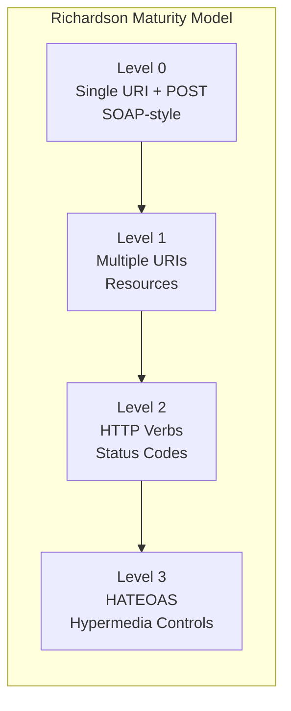

# Spring REST

## Quick Reference

- `@RestController` combines `@Controller` + `@ResponseBody`; returns data (JSON/XML) instead of views
- HTTP method mappings: `@GetMapping`, `@PostMapping`, `@PutMapping`, `@PatchMapping`, `@DeleteMapping`
- Request data binding: `@RequestBody` (JSON body), `@PathVariable` (URI segments), `@RequestParam` (query params)
- Content negotiation via `Accept` header; Jackson handles JSON serialization by default, add `jackson-dataformat-xml` for XML
- Validation: `@Valid` on `@RequestBody` triggers Bean Validation (JSR-380); `@Validated` on class enables `@PathVariable`/`@RequestParam` validation
- Global exception handling: `@RestControllerAdvice` + `@ExceptionHandler` returns structured error responses
- Richardson Maturity Model: Level 0 (single URI) → Level 1 (resources) → Level 2 (HTTP verbs) → Level 3 (HATEOAS)

## When to Use

Spring REST is the standard approach for building HTTP APIs in the Spring ecosystem when you need stateless, resource-oriented services that communicate via JSON or XML. Use Spring REST when building microservice APIs consumed by frontends (React, Angular), mobile apps, or other backend services. It excels when you need fine-grained control over HTTP semantics including status codes, headers, content negotiation, and HATEOAS links. Spring REST integrates seamlessly with Spring Security for OAuth2/JWT authentication, Spring Data for pagination and sorting, and Bean Validation for input sanitization. Choose Spring REST over Spring MVC (view-based) when your API serves data rather than rendered HTML. For reactive non-blocking APIs handling high concurrency, consider Spring WebFlux with the same annotation model. Spring REST's mature ecosystem provides built-in support for API documentation (SpringDoc/OpenAPI), versioning strategies, CORS configuration, and comprehensive testing via MockMvc.

## Code Examples

### Complete CRUD Controller with Pagination

```java
@RestController
@RequestMapping("/api/v1/orders")
@Validated
public class OrderController {

    private final OrderService orderService;

    public OrderController(OrderService orderService) {
        this.orderService = orderService;
    }

    @GetMapping
    public ResponseEntity<Page<OrderDTO>> listOrders(
            @RequestParam(defaultValue = "0") int page,
            @RequestParam(defaultValue = "20") int size,
            @RequestParam(defaultValue = "createdAt,desc") String sort) {
        Pageable pageable = PageRequest.of(page, size, Sort.by(sort.split(",")));
        return ResponseEntity.ok(orderService.findAll(pageable));
    }

    @GetMapping("/{id}")
    public ResponseEntity<OrderDTO> getOrder(@PathVariable Long id) {
        return ResponseEntity.ok(orderService.findById(id));
    }

    @PostMapping
    public ResponseEntity<OrderDTO> createOrder(
            @Valid @RequestBody CreateOrderRequest request) {
        OrderDTO created = orderService.create(request);
        URI location = ServletUriComponentsBuilder.fromCurrentRequest()
                .path("/{id}").buildAndExpand(created.getId()).toUri();
        return ResponseEntity.created(location).body(created);
    }

    @PutMapping("/{id}")
    public ResponseEntity<OrderDTO> updateOrder(
            @PathVariable Long id,
            @Valid @RequestBody UpdateOrderRequest request) {
        return ResponseEntity.ok(orderService.update(id, request));
    }

    @DeleteMapping("/{id}")
    public ResponseEntity<Void> deleteOrder(@PathVariable Long id) {
        orderService.delete(id);
        return ResponseEntity.noContent().build();
    }
}
```

### Exception Handling with Structured Error Responses

```java
@RestControllerAdvice
public class ApiExceptionHandler {

    @ExceptionHandler(ResourceNotFoundException.class)
    public ResponseEntity<ApiError> handleNotFound(ResourceNotFoundException ex) {
        ApiError error = ApiError.builder()
                .status(HttpStatus.NOT_FOUND.value())
                .message(ex.getMessage())
                .timestamp(Instant.now())
                .build();
        return new ResponseEntity<>(error, HttpStatus.NOT_FOUND);
    }

    @ExceptionHandler(MethodArgumentNotValidException.class)
    public ResponseEntity<ApiError> handleValidation(MethodArgumentNotValidException ex) {
        List<String> errors = ex.getBindingResult().getFieldErrors().stream()
                .map(fe -> fe.getField() + ": " + fe.getDefaultMessage())
                .toList();
        ApiError error = ApiError.builder()
                .status(HttpStatus.BAD_REQUEST.value())
                .message("Validation failed")
                .errors(errors)
                .timestamp(Instant.now())
                .build();
        return new ResponseEntity<>(error, HttpStatus.BAD_REQUEST);
    }

    @ExceptionHandler(ConstraintViolationException.class)
    public ResponseEntity<ApiError> handleConstraintViolation(
            ConstraintViolationException ex) {
        List<String> errors = ex.getConstraintViolations().stream()
                .map(cv -> cv.getPropertyPath() + ": " + cv.getMessage())
                .toList();
        return new ResponseEntity<>(
            ApiError.builder().status(400).message("Invalid parameters")
                .errors(errors).timestamp(Instant.now()).build(),
            HttpStatus.BAD_REQUEST);
    }
}
```

### Content Negotiation and HATEOAS

```java
@RestController
@RequestMapping("/api/v1/customers")
public class CustomerController {

    @GetMapping(value = "/{id}",
            produces = {MediaType.APPLICATION_JSON_VALUE, MediaType.APPLICATION_XML_VALUE})
    public EntityModel<CustomerDTO> getCustomer(@PathVariable Long id) {
        CustomerDTO customer = customerService.findById(id);
        return EntityModel.of(customer,
            linkTo(methodOn(CustomerController.class).getCustomer(id)).withSelfRel(),
            linkTo(methodOn(CustomerController.class).listCustomers(0, 20))
                .withRel("all-customers"),
            linkTo(methodOn(OrderController.class).getOrdersByCustomer(id))
                .withRel("orders"));
    }

    @PostMapping(consumes = {MediaType.APPLICATION_JSON_VALUE,
                             MediaType.APPLICATION_XML_VALUE})
    public ResponseEntity<EntityModel<CustomerDTO>> createCustomer(
            @Valid @RequestBody CustomerDTO dto) {
        CustomerDTO created = customerService.create(dto);
        EntityModel<CustomerDTO> model = EntityModel.of(created,
            linkTo(methodOn(CustomerController.class).getCustomer(created.getId()))
                .withSelfRel());
        return ResponseEntity.created(model.getRequiredLink("self").toUri())
                .body(model);
    }
}
```

### WebClient for Consuming External APIs

```java
@Service
public class PaymentGatewayClient {

    private final WebClient webClient;

    public PaymentGatewayClient(WebClient.Builder builder,
            @Value("${payment.gateway.url}") String baseUrl) {
        this.webClient = builder.baseUrl(baseUrl)
                .defaultHeader(HttpHeaders.CONTENT_TYPE, MediaType.APPLICATION_JSON_VALUE)
                .filter(ExchangeFilterFunctions.basicAuthentication("client", "secret"))
                .build();
    }

    public Mono<PaymentResponse> processPayment(PaymentRequest request) {
        return webClient.post()
                .uri("/v1/payments")
                .bodyValue(request)
                .retrieve()
                .onStatus(HttpStatusCode::is4xxClientError,
                    response -> response.bodyToMono(String.class)
                        .map(body -> new PaymentException("Client error: " + body)))
                .bodyToMono(PaymentResponse.class)
                .timeout(Duration.ofSeconds(5))
                .retryWhen(Retry.backoff(3, Duration.ofMillis(500)));
    }
}
```

### API Versioning Strategies

```java
// URI versioning (most common)
@RestController
@RequestMapping("/api/v1/products")
public class ProductControllerV1 { }

@RestController
@RequestMapping("/api/v2/products")
public class ProductControllerV2 { }

// Header versioning
@GetMapping(value = "/products", headers = "X-API-VERSION=1")
public List<ProductV1DTO> getProductsV1() { }

@GetMapping(value = "/products", headers = "X-API-VERSION=2")
public List<ProductV2DTO> getProductsV2() { }

// Content negotiation versioning
@GetMapping(value = "/products",
    produces = "application/vnd.myapp.v1+json")
public List<ProductV1DTO> getProductsMediaV1() { }
```

## Architecture / Diagrams

```mermaid
graph TB
    subgraph "Spring REST Request Lifecycle"
        CLIENT[HTTP Client] --> FILTER[Security Filter Chain]
        FILTER --> DISPATCHER[DispatcherServlet]
        DISPATCHER --> HANDLER[HandlerMapping<br/>finds @RequestMapping]
        HANDLER --> INTERCEPTOR[HandlerInterceptor<br/>pre-handle]
        INTERCEPTOR --> CONVERTER_IN[HttpMessageConverter<br/>deserialize request body]
        CONVERTER_IN --> VALIDATOR[Bean Validation<br/>@Valid processing]
        VALIDATOR --> CONTROLLER[@RestController method]
        CONTROLLER --> CONVERTER_OUT[HttpMessageConverter<br/>serialize response body]
        CONVERTER_OUT --> CLIENT
    end

    subgraph "Exception Flow"
        CONTROLLER -->|Exception| ADVICE[@RestControllerAdvice]
        ADVICE --> CONVERTER_OUT
    end
```



## Common Pitfalls

1. **Returning entities directly from controllers**: Exposes internal database structure, lazy-loading proxies, and circular references to API consumers. Always use DTOs to control the API contract independently of your persistence model. Jackson's `@JsonIgnore` is a band-aid that couples serialization concerns to your domain model.

2. **Not using proper HTTP status codes**: Returning 200 for everything (including errors) forces clients to parse response bodies to determine success. Use 201 for creation, 204 for deletion, 400 for validation errors, 404 for missing resources, 409 for conflicts, and 500 only for unexpected server errors.

3. **Missing CORS configuration for frontend integration**: Browsers block cross-origin requests by default. Configure CORS globally via `WebMvcConfigurer.addCorsMappings()` with specific allowed origins rather than wildcards in production. Forgetting this causes cryptic frontend errors that look like network failures.

4. **Blocking the request thread with synchronous external calls**: RestTemplate blocks the thread while waiting for responses from downstream services. Under load, this exhausts the thread pool and causes cascading failures. Use WebClient with timeouts and circuit breakers (Resilience4j) for external service calls, or configure a dedicated thread pool for blocking operations.

5. **Not validating path variables and request parameters**: `@Valid` only works on `@RequestBody`. For `@PathVariable` and `@RequestParam` validation, annotate the controller class with `@Validated` and add constraint annotations directly on parameters. Without this, invalid path segments pass through unchecked to your service layer.

## Real-World Use Cases

- **Public API platforms**: Companies expose REST APIs for third-party integrations with versioning (URI-based for simplicity), rate limiting (via Spring Cloud Gateway), OAuth2 authentication, and OpenAPI documentation auto-generated from controller annotations. Spring REST's content negotiation supports both JSON and XML consumers from the same endpoint.

- **Backend-for-Frontend (BFF) services**: A Spring REST service aggregates data from multiple microservices into optimized responses for specific client types (mobile vs. web). WebClient makes parallel non-blocking calls to downstream services, combines results, and returns a tailored DTO. This reduces client-side complexity and network round trips.

- **Webhook receivers and event processors**: Spring REST controllers receive webhook callbacks from external services (payment processors, CI/CD systems, messaging platforms), validate signatures, and dispatch events to internal message queues. The combination of `@RequestBody` with custom `HttpMessageConverter` handles vendor-specific payload formats.

- **File upload and download services**: Spring REST handles multipart file uploads with `@RequestParam MultipartFile`, streams large files via `StreamingResponseBody` to avoid memory issues, and serves static content with proper cache headers and range request support for resumable downloads.

## Interview Questions

**Q: What is the difference between `@Controller` and `@RestController`?**

A: `@RestController` is a convenience annotation combining `@Controller` and `@ResponseBody`. With `@Controller`, each method must explicitly annotate with `@ResponseBody` to return data directly; without it, Spring assumes the return value is a view name and passes it to a ViewResolver. `@RestController` eliminates this boilerplate for APIs that always return serialized data. Use `@Controller` only when you need to return both views (HTML) and data from the same controller.

**Q: How does Spring handle content negotiation for REST APIs?**

A: Spring uses the `Accept` header to determine response format. `HttpMessageConverter` implementations handle serialization: `MappingJackson2HttpMessageConverter` for JSON, `Jaxb2RootElementHttpMessageConverter` for XML. The `produces` attribute on `@RequestMapping` restricts which formats an endpoint supports. For requests, the `Content-Type` header determines which converter deserializes the body. You can customize negotiation strategy via `WebMvcConfigurer.configureContentNegotiation()` to support URL extensions or query parameters.

**Q: How would you implement pagination and sorting in a Spring REST API?**

A: Use Spring Data's `Pageable` interface as a controller parameter. Spring automatically resolves `page`, `size`, and `sort` query parameters into a `Pageable` object. Pass it to repository methods returning `Page<T>`. The response includes content, total elements, total pages, and navigation metadata. For HATEOAS, use `PagedResourcesAssembler` to add next/previous links. Always set a maximum page size to prevent clients from requesting unbounded result sets.

**Q: Explain the difference between `RestTemplate` and `WebClient`. When would you use each?**

A: `RestTemplate` is synchronous and blocking — the calling thread waits for the response. `WebClient` is non-blocking and reactive, built on Project Reactor. Use `WebClient` for new projects because it supports both blocking (`.block()`) and non-blocking patterns, handles backpressure, and integrates with reactive streams. `RestTemplate` is in maintenance mode. In high-concurrency scenarios, `WebClient` prevents thread pool exhaustion because it doesn't hold threads during I/O waits. Even in non-reactive applications, `WebClient` with `.block()` is preferred over `RestTemplate`.

## Production Tips

- **Implement request/response logging carefully**: Log request method, URI, status code, and duration at INFO level. Log request/response bodies only at DEBUG level and never in production (PII exposure, performance impact). Use a servlet filter or Spring's `CommonsRequestLoggingFilter` with size limits. Mask sensitive fields (passwords, tokens) in any logged payloads.

- **Set timeouts on all external HTTP calls**: Configure `WebClient` with `responseTimeout`, `connectTimeout`, and read timeout. Without explicit timeouts, a slow downstream service can hold your threads indefinitely, causing cascading failures. Combine with Resilience4j circuit breaker to fail fast when a dependency is unhealthy. Default timeout of 5 seconds with 3 retries and exponential backoff covers most scenarios.

- **Use ETags and conditional requests for caching**: Implement `ShallowEtagHeaderFilter` for automatic ETag generation based on response body hash. For expensive queries, compute ETags from data version/timestamp and return 304 Not Modified when the client's `If-None-Match` header matches. This reduces bandwidth and server load for frequently polled endpoints.

- **Rate limit API endpoints**: Protect your service from abuse and cascading load with rate limiting. Use Spring Cloud Gateway's `RequestRateLimiter` filter backed by Redis for distributed rate limiting. Return 429 Too Many Requests with `Retry-After` header. Differentiate limits by authentication level (anonymous vs. authenticated vs. premium).

## Related Topics

- [Spring Boot](./spring-boot.md) — Spring REST is built on Spring Boot's web auto-configuration and embedded server
- [Spring Framework](./core-container.md) — Core Spring MVC provides the DispatcherServlet and handler mapping infrastructure
- [Security](./spring-security.md) — OAuth2 and JWT authentication for securing REST endpoints
- [Spring Batch](./spring-batch.md) — REST endpoints can trigger batch jobs via JobLauncher
