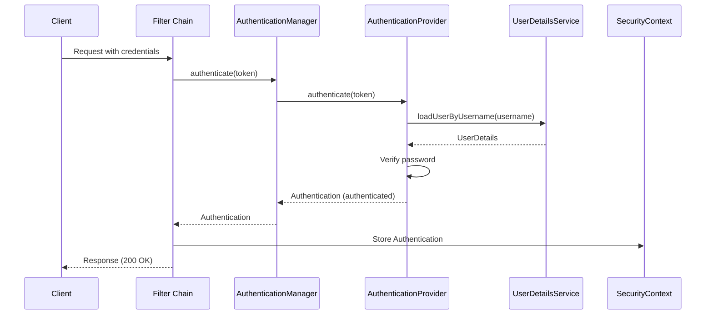

# Spring Security

## Quick Reference

- Spring Security is a powerful authentication and authorization framework for Java applications built on servlet filters
- The security filter chain processes every HTTP request through an ordered list of security filters before reaching the controller
- Authentication verifies identity (who you are); authorization verifies permissions (what you can do)
- Supports multiple authentication mechanisms: form login, HTTP Basic, OAuth2, JWT, SAML, LDAP, and custom providers
- `SecurityContext` holds the authenticated principal and is stored in `ThreadLocal` via `SecurityContextHolder`
- Method-level security with `@PreAuthorize`, `@PostAuthorize`, `@Secured`, and `@RolesAllowed` annotations
- CSRF protection enabled by default for stateful applications; typically disabled for stateless REST APIs using JWT
- Password encoding with `BCryptPasswordEncoder` (recommended), `Argon2PasswordEncoder`, or `SCryptPasswordEncoder`
- CORS configuration must be done in the security filter chain when Spring Security is active, not just in `WebMvcConfigurer`
- Session management: `SessionCreationPolicy.STATELESS` for JWT APIs, `ALWAYS`/`IF_REQUIRED` for web apps
- Spring Security 6 uses the new `requestMatchers()` API replacing deprecated `antMatchers()`, `mvcMatchers()`, and `regexMatchers()`
- OAuth2 Resource Server validates JWT tokens with minimal configuration: `spring.security.oauth2.resourceserver.jwt.issuer-uri`
- `@EnableMethodSecurity` replaces `@EnableGlobalMethodSecurity` in Spring Security 6 with `prePostEnabled=true` by default
- Multiple `SecurityFilterChain` beans can coexist for different URL patterns (API vs. web), evaluated in `@Order` sequence

## When to Use

Spring Security is essential for any Spring-based application that requires authentication, authorization, or protection against common security exploits. Use Spring Security when building REST APIs that need JWT or OAuth2 token validation, web applications requiring form-based login with session management, microservices needing service-to-service authentication, or applications integrating with enterprise identity providers via SAML or LDAP. Spring Security provides comprehensive protection against CSRF, session fixation, clickjacking, and other web vulnerabilities out of the box. It integrates seamlessly with Spring Boot auto-configuration, requiring minimal setup for common scenarios while offering deep customization for complex enterprise requirements. The framework's filter-based architecture allows you to intercept and modify security behavior at any point in the request processing pipeline, making it suitable for implementing custom authentication schemes, multi-tenancy security, and fine-grained access control policies that go beyond simple role-based checks.

Understanding the security filter chain internals — which filters execute in what order, how authentication objects flow through the chain, and how exceptions are translated into HTTP responses — is critical for debugging security issues and implementing custom security requirements in production systems.

## Code Examples

### Security Filter Chain Configuration

```java
@Configuration
@EnableWebSecurity
@EnableMethodSecurity(prePostEnabled = true)
public class SecurityConfig {

    // API security — stateless JWT validation
    @Bean
    @Order(1)
    public SecurityFilterChain apiFilterChain(HttpSecurity http) throws Exception {
        return http
            .securityMatcher("/api/**")
            .csrf(csrf -> csrf.disable())  // Stateless API — no CSRF needed
            .sessionManagement(session ->
                session.sessionCreationPolicy(SessionCreationPolicy.STATELESS))
            .authorizeHttpRequests(auth -> auth
                .requestMatchers("/api/public/**").permitAll()
                .requestMatchers("/api/admin/**").hasRole("ADMIN")
                .requestMatchers(HttpMethod.GET, "/api/products/**").hasAuthority("PRODUCT_READ")
                .requestMatchers(HttpMethod.POST, "/api/products/**").hasAuthority("PRODUCT_WRITE")
                .anyRequest().authenticated())
            .oauth2ResourceServer(oauth2 -> oauth2
                .jwt(jwt -> jwt
                    .jwtAuthenticationConverter(jwtAuthenticationConverter())))
            .exceptionHandling(ex -> ex
                .authenticationEntryPoint(new CustomAuthenticationEntryPoint())
                .accessDeniedHandler(new CustomAccessDeniedHandler()))
            .cors(cors -> cors.configurationSource(corsConfigurationSource()))
            .build();
    }

    // Web security — session-based form login
    @Bean
    @Order(2)
    public SecurityFilterChain webFilterChain(HttpSecurity http) throws Exception {
        return http
            .securityMatcher("/**")
            .authorizeHttpRequests(auth -> auth
                .requestMatchers("/login", "/register", "/css/**", "/js/**").permitAll()
                .anyRequest().authenticated())
            .formLogin(form -> form
                .loginPage("/login")
                .defaultSuccessUrl("/dashboard")
                .failureUrl("/login?error=true"))
            .logout(logout -> logout
                .logoutSuccessUrl("/login?logout=true")
                .invalidateHttpSession(true)
                .deleteCookies("JSESSIONID"))
            .sessionManagement(session -> session
                .maximumSessions(2)
                .maxSessionsPreventsLogin(false)
                .expiredUrl("/login?expired=true"))
            .rememberMe(remember -> remember
                .tokenValiditySeconds(86400)
                .key("uniqueAndSecretKey"))
            .build();
    }

    @Bean
    public JwtAuthenticationConverter jwtAuthenticationConverter() {
        JwtGrantedAuthoritiesConverter grantedAuthoritiesConverter =
            new JwtGrantedAuthoritiesConverter();
        grantedAuthoritiesConverter.setAuthoritiesClaimName("permissions");
        grantedAuthoritiesConverter.setAuthorityPrefix("");

        JwtAuthenticationConverter converter = new JwtAuthenticationConverter();
        converter.setJwtGrantedAuthoritiesConverter(grantedAuthoritiesConverter);
        return converter;
    }

    @Bean
    public CorsConfigurationSource corsConfigurationSource() {
        CorsConfiguration config = new CorsConfiguration();
        config.setAllowedOrigins(List.of("https://app.example.com"));
        config.setAllowedMethods(List.of("GET", "POST", "PUT", "DELETE", "OPTIONS"));
        config.setAllowedHeaders(List.of("*"));
        config.setAllowCredentials(true);
        config.setMaxAge(3600L);

        UrlBasedCorsConfigurationSource source = new UrlBasedCorsConfigurationSource();
        source.registerCorsConfiguration("/api/**", config);
        return source;
    }
}
```

### Custom Authentication Provider with MFA

```java
@Component
@RequiredArgsConstructor
public class CustomAuthenticationProvider implements AuthenticationProvider {

    private final UserRepository userRepository;
    private final PasswordEncoder passwordEncoder;
    private final MfaService mfaService;
    private final LoginAttemptService loginAttemptService;

    @Override
    public Authentication authenticate(Authentication authentication)
            throws AuthenticationException {
        String username = authentication.getName();
        String password = authentication.getCredentials().toString();

        // Check for brute-force lockout
        if (loginAttemptService.isBlocked(username)) {
            throw new LockedException("Account temporarily locked due to too many failed attempts");
        }

        User user = userRepository.findByUsername(username)
            .orElseThrow(() -> {
                loginAttemptService.recordFailure(username);
                return new BadCredentialsException("Invalid credentials");
            });

        if (!passwordEncoder.matches(password, user.getPasswordHash())) {
            loginAttemptService.recordFailure(username);
            throw new BadCredentialsException("Invalid credentials");
        }

        if (user.isMfaEnabled()) {
            String mfaCode = ((MfaAuthenticationToken) authentication).getMfaCode();
            if (mfaCode == null || !mfaService.verifyCode(user, mfaCode)) {
                throw new BadCredentialsException("Invalid MFA code");
            }
        }

        if (!user.isEnabled()) {
            throw new DisabledException("Account is disabled");
        }

        loginAttemptService.recordSuccess(username);

        List<GrantedAuthority> authorities = user.getRoles().stream()
            .flatMap(role -> role.getPermissions().stream())
            .map(permission -> new SimpleGrantedAuthority(permission.getName()))
            .collect(Collectors.toList());

        return new UsernamePasswordAuthenticationToken(user, null, authorities);
    }

    @Override
    public boolean supports(Class<?> authentication) {
        return MfaAuthenticationToken.class.isAssignableFrom(authentication);
    }
}
```

### OAuth2 Resource Server with Custom Claim Extraction

```java
@Configuration
@EnableWebSecurity
public class OAuth2ResourceServerConfig {

    @Bean
    public SecurityFilterChain resourceServerFilterChain(HttpSecurity http) throws Exception {
        return http
            .authorizeHttpRequests(auth -> auth
                .requestMatchers("/api/public/**").permitAll()
                .requestMatchers("/api/admin/**").hasAuthority("SCOPE_admin")
                .anyRequest().authenticated())
            .oauth2ResourceServer(oauth2 -> oauth2
                .jwt(jwt -> jwt
                    .jwtAuthenticationConverter(customJwtConverter())))
            .build();
    }

    @Bean
    public JwtAuthenticationConverter customJwtConverter() {
        JwtAuthenticationConverter converter = new JwtAuthenticationConverter();
        converter.setJwtGrantedAuthoritiesConverter(jwt -> {
            Collection<GrantedAuthority> authorities = new ArrayList<>();

            // Extract roles from Keycloak realm_access.roles
            Map<String, Object> realmAccess = jwt.getClaimAsMap("realm_access");
            if (realmAccess != null) {
                List<String> roles = (List<String>) realmAccess.get("roles");
                if (roles != null) {
                    authorities.addAll(roles.stream()
                        .map(role -> new SimpleGrantedAuthority("ROLE_" + role))
                        .toList());
                }
            }

            // Extract scopes
            String scope = jwt.getClaimAsString("scope");
            if (scope != null) {
                authorities.addAll(Arrays.stream(scope.split(" "))
                    .map(s -> new SimpleGrantedAuthority("SCOPE_" + s))
                    .toList());
            }

            // Extract custom permissions claim
            List<String> permissions = jwt.getClaimAsStringList("permissions");
            if (permissions != null) {
                authorities.addAll(permissions.stream()
                    .map(SimpleGrantedAuthority::new)
                    .toList());
            }

            return authorities;
        });
        return converter;
    }

    @Bean
    public JwtDecoder jwtDecoder() {
        NimbusJwtDecoder decoder = JwtDecoders.fromIssuerLocation(
            "https://auth.example.com/realms/production");
        decoder.setJwtValidator(new DelegatingOAuth2TokenValidator<>(
            JwtValidators.createDefaultWithIssuer("https://auth.example.com/realms/production"),
            new JwtClaimValidator<List<String>>("aud", aud -> aud.contains("order-service")),
            new JwtTimestampValidator(Duration.ofSeconds(60))  // 60s clock skew tolerance
        ));
        return decoder;
    }
}
```

### Method-Level Security with Custom Evaluators

```java
@Service
@RequiredArgsConstructor
public class DocumentService {

    private final DocumentRepository documentRepository;

    @PreAuthorize("hasAuthority('DOCUMENT_CREATE')")
    public Document createDocument(CreateDocumentRequest request) {
        Document doc = Document.from(request);
        doc.setOwnerId(getCurrentUserId());
        return documentRepository.save(doc);
    }

    @PreAuthorize("hasAuthority('DOCUMENT_READ') and @documentSecurity.canAccess(#id)")
    public Document getDocument(UUID id) {
        return documentRepository.findById(id)
            .orElseThrow(() -> new DocumentNotFoundException(id));
    }

    @PostAuthorize("returnObject.ownerId == authentication.principal.id or hasRole('ADMIN')")
    public Document getDocumentWithOwnerCheck(UUID id) {
        return documentRepository.findById(id)
            .orElseThrow(() -> new DocumentNotFoundException(id));
    }

    @PreAuthorize("@documentSecurity.canDelete(#id)")
    public void deleteDocument(UUID id) {
        documentRepository.deleteById(id);
    }

    // Filter returned collection based on permissions
    @PostFilter("filterObject.ownerId == authentication.principal.id or hasRole('ADMIN')")
    public List<Document> findAll() {
        return documentRepository.findAll();
    }
}

@Component("documentSecurity")
@RequiredArgsConstructor
public class DocumentSecurityEvaluator {

    private final DocumentRepository documentRepository;
    private final TeamMembershipService teamService;

    public boolean canAccess(UUID documentId) {
        Authentication auth = SecurityContextHolder.getContext().getAuthentication();
        String userId = ((CustomUserDetails) auth.getPrincipal()).getId();

        Document doc = documentRepository.findById(documentId).orElse(null);
        if (doc == null) return false;

        return doc.getOwnerId().equals(userId)
            || doc.getSharedWith().contains(userId)
            || teamService.isTeamMember(doc.getTeamId(), userId);
    }

    public boolean canDelete(UUID documentId) {
        Authentication auth = SecurityContextHolder.getContext().getAuthentication();
        if (auth.getAuthorities().stream()
                .anyMatch(a -> a.getAuthority().equals("ROLE_ADMIN"))) {
            return true;
        }
        String userId = ((CustomUserDetails) auth.getPrincipal()).getId();
        return documentRepository.findById(documentId)
            .map(doc -> doc.getOwnerId().equals(userId))
            .orElse(false);
    }
}
```

### CSRF Protection Configuration

```java
@Configuration
public class CsrfConfig {

    // For SPA applications — CSRF token in cookie readable by JavaScript
    @Bean
    public SecurityFilterChain spaSecurityChain(HttpSecurity http) throws Exception {
        return http
            .csrf(csrf -> csrf
                .csrfTokenRepository(CookieCsrfTokenRepository.withHttpOnlyFalse())
                .csrfTokenRequestHandler(new SpaCsrfTokenRequestHandler()))
            .build();
    }
}

// Custom CSRF handler for SPAs that use BREACH protection
public class SpaCsrfTokenRequestHandler extends CsrfTokenRequestAttributeHandler {

    private final CsrfTokenRequestHandler delegate = new XorCsrfTokenRequestAttributeHandler();

    @Override
    public void handle(HttpServletRequest request, HttpServletResponse response,
                       Supplier<CsrfToken> csrfToken) {
        // Always make the token available as a request attribute
        this.delegate.handle(request, response, csrfToken);
    }

    @Override
    public String resolveCsrfTokenValue(HttpServletRequest request, CsrfToken csrfToken) {
        // Check header first (SPA), then fall back to parameter (form)
        String headerValue = request.getHeader(csrfToken.getHeaderName());
        if (StringUtils.hasText(headerValue)) {
            return super.resolveCsrfTokenValue(request, csrfToken);
        }
        return this.delegate.resolveCsrfTokenValue(request, csrfToken);
    }
}
```

### Session Management and Concurrent Session Control

```java
@Configuration
public class SessionConfig {

    @Bean
    public SecurityFilterChain sessionSecurityChain(HttpSecurity http) throws Exception {
        return http
            .sessionManagement(session -> session
                .sessionCreationPolicy(SessionCreationPolicy.IF_REQUIRED)
                .invalidSessionUrl("/login?invalid-session")
                .sessionFixation(fix -> fix.migrateSession())  // Prevent session fixation
                .maximumSessions(2)  // Max 2 concurrent sessions per user
                .maxSessionsPreventsLogin(false)  // Kick oldest session
                .expiredUrl("/login?expired"))
            .build();
    }

    // Redis-backed session store for distributed deployments
    @Bean
    public HttpSessionIdResolver httpSessionIdResolver() {
        // Use header-based session ID for API clients
        return HeaderHttpSessionIdResolver.xAuthToken();
    }
}
```

### Security Event Auditing

```java
@Component
@RequiredArgsConstructor
@Slf4j
public class SecurityEventListener {

    private final AuditLogRepository auditLogRepository;

    @EventListener
    public void onAuthenticationSuccess(AuthenticationSuccessEvent event) {
        String username = event.getAuthentication().getName();
        log.info("Successful login: {}", username);
        auditLogRepository.save(AuditLog.builder()
            .eventType("LOGIN_SUCCESS")
            .username(username)
            .ipAddress(getClientIp())
            .timestamp(Instant.now())
            .build());
    }

    @EventListener
    public void onAuthenticationFailure(AbstractAuthenticationFailureEvent event) {
        String username = event.getAuthentication().getName();
        log.warn("Failed login attempt: {} - reason: {}",
            username, event.getException().getMessage());
        auditLogRepository.save(AuditLog.builder()
            .eventType("LOGIN_FAILURE")
            .username(username)
            .ipAddress(getClientIp())
            .details(event.getException().getMessage())
            .timestamp(Instant.now())
            .build());
    }

    @EventListener
    public void onAuthorizationDenied(AuthorizationDeniedEvent<?> event) {
        Authentication auth = event.getAuthentication().get();
        log.warn("Access denied for user: {} attempting: {}",
            auth.getName(), event.getSource());
    }
}
```

## Architecture / Diagrams

```mermaid
graph TB
    subgraph "Security Filter Chain (ordered)"
        REQ[HTTP Request] --> F1[SecurityContextPersistenceFilter<br/>Load/save SecurityContext]
        F1 --> F2[CorsFilter<br/>CORS preflight handling]
        F2 --> F3[CsrfFilter<br/>CSRF token validation]
        F3 --> F4[LogoutFilter<br/>Handle /logout]
        F4 --> F5[UsernamePasswordAuthenticationFilter<br/>Form login processing]
        F5 --> F6[BearerTokenAuthenticationFilter<br/>JWT extraction and validation]
        F6 --> F7[ExceptionTranslationFilter<br/>Convert security exceptions to HTTP]
        F7 --> F8[AuthorizationFilter<br/>URL-based access control]
        F8 --> CONTROLLER[Controller]
    end
```





## Common Pitfalls

- **Self-invocation bypasses security proxies**: Calling a `@PreAuthorize`-annotated method from within the same class bypasses the security proxy, so the authorization check never executes. Extract secured methods to a separate bean or use `AopContext.currentProxy()` to invoke through the proxy.

- **Order of filter chain matchers matters**: Spring Security evaluates `SecurityFilterChain` beans in `@Order` sequence. If a permissive chain matches before a restrictive one, requests bypass intended security. Define more specific `securityMatcher` patterns on restrictive chains with lower `@Order` values.

- **CORS misconfiguration with security**: When Spring Security is active, CORS preflight OPTIONS requests are rejected unless explicitly allowed. Configure CORS in the security filter chain using `.cors(cors -> cors.configurationSource(...))` rather than relying solely on `@CrossOrigin` annotations, which are processed after security filters.

- **Storing plain-text passwords**: Never store passwords without hashing. Always use `PasswordEncoder` (BCrypt with strength 10-12 is the standard). Migrating from legacy hashing requires `DelegatingPasswordEncoder` which detects the encoding scheme from a prefix like `{bcrypt}` or `{sha256}`.

- **Overly permissive token expiration**: Setting JWT access tokens with long expiration (hours or days) means compromised tokens remain valid with no way to revoke them. Use short-lived access tokens (5-15 minutes) with refresh tokens for session continuity. Implement a token blacklist for immediate revocation capability.

- **Ignoring security context propagation in async code**: `SecurityContext` is stored in `ThreadLocal` and is not automatically propagated to new threads. When using `@Async`, `CompletableFuture`, or virtual threads created manually, wrap executors with `DelegatingSecurityContextExecutorService`.

- **Missing security headers**: Not configuring `X-Content-Type-Options`, `X-Frame-Options`, `Strict-Transport-Security`, and `Content-Security-Policy` headers leaves the application vulnerable to clickjacking, MIME-type sniffing, and XSS attacks. Configure via `http.headers()` in the security filter chain.

- **Permitting actuator endpoints without restriction**: Exposing `/actuator/env`, `/actuator/heapdump`, or `/actuator/configprops` without authentication leaks sensitive information including database credentials and API keys. Always secure actuator endpoints or run them on a separate management port.

## Real-World Use Cases

- **Multi-tenant SaaS authorization**: Enterprise SaaS platforms use Spring Security with custom `PermissionEvaluator` implementations to enforce tenant isolation. Each request is validated against the tenant context extracted from the JWT, ensuring users can only access resources belonging to their organization. Row-level security is enforced through Hibernate filters with Spring Security providing the tenant context.

- **OAuth2 resource server for microservices**: Each service acts as an OAuth2 resource server validating JWT tokens issued by a central authorization server (Keycloak, Auth0, Okta). Spring Security's `oauth2ResourceServer` configuration handles token validation, claim extraction, and authority mapping. Services communicate using machine-to-machine tokens via client credentials grant.

- **API rate limiting and abuse prevention**: Custom `OncePerRequestFilter` implementations check Redis-backed counters before allowing requests through, returning 429 responses when limits are exceeded. This integrates naturally with the security filter chain, applying rate limits after authentication but before authorization.

- **Graduated authentication for sensitive operations**: Banking applications implement step-up authentication where viewing balances requires standard auth, but transfers require re-authentication or MFA. Custom `AccessDecisionVoter` implementations evaluate authentication strength level and prompt for additional verification when insufficient.

- **API key authentication for machine clients**: B2B integrations use API keys in headers for authentication. A custom `OncePerRequestFilter` extracts the key, validates it against a database or cache, and creates an `Authentication` object with appropriate authorities. This coexists with JWT authentication for human users on the same endpoints.

## Interview Questions

**Q: How does the Spring Security filter chain work?**

A: Spring Security inserts a `DelegatingFilterProxy` into the servlet filter chain, which delegates to a `FilterChainProxy` managing one or more `SecurityFilterChain` instances. Each chain has a request matcher and an ordered list of security filters (typically 15-20 filters). The first chain whose matcher matches the request processes it. Key filters include `SecurityContextPersistenceFilter` (loads/saves context), `UsernamePasswordAuthenticationFilter` (form login), `BearerTokenAuthenticationFilter` (JWT), `ExceptionTranslationFilter` (converts exceptions to HTTP responses), and `AuthorizationFilter` (URL-based access control).

**Q: What is the difference between `@Secured`, `@PreAuthorize`, and `@RolesAllowed`?**

A: `@Secured` accepts role names as strings and supports only role-based checks (no SpEL). `@RolesAllowed` is the JSR-250 equivalent with identical functionality. `@PreAuthorize` uses Spring Expression Language (SpEL) and supports complex expressions including method parameters (`#id`), custom bean references (`@beanName.method()`), and boolean logic. `@PreAuthorize` is the most flexible and recommended approach. `@PostAuthorize` evaluates after method execution with access to `returnObject`. `@PreFilter`/`@PostFilter` filter collection parameters/return values.

**Q: How would you implement token refresh in a stateless API?**

A: Issue a short-lived access token (5-15 minutes) and a longer-lived refresh token (7-30 days) at login. Store a hashed refresh token in the database with metadata (device, IP, creation time). When the access token expires, the client sends the refresh token to `/auth/refresh`. The server validates it hasn't been revoked, issues a new access token, and rotates the refresh token (invalidating the old one). If a revoked token is reused, revoke all tokens in that family (indicating theft). Set absolute expiration on refresh tokens regardless of activity.

**Q: How does Spring Security handle CSRF protection?**

A: Spring Security generates a unique CSRF token per session and expects it in every state-changing request (POST, PUT, DELETE). For server-rendered forms, the token is included as a hidden field. For SPAs, `CookieCsrfTokenRepository.withHttpOnlyFalse()` stores the token in a cookie readable by JavaScript, which the client includes in a custom header (X-XSRF-TOKEN). Stateless APIs using JWT typically disable CSRF because the token itself serves as proof of authentication and is not automatically sent by browsers like cookies are.

**Q: How does Spring Security 6's OAuth2 Resource Server validate JWT tokens?**

A: The auto-configuration fetches the authorization server's public keys from the JWKS endpoint (derived from `issuer-uri`). For each request, it extracts the Bearer token from the Authorization header, validates the JWT signature against cached public keys, checks standard claims (expiration, issuer, audience), and converts claims to `GrantedAuthority` objects via `JwtAuthenticationConverter`. The validated JWT becomes the `Authentication` object in the `SecurityContext`. Token validation is stateless — no session or database lookup required.

**Q: What changed in Spring Security 6 compared to Spring Security 5?**

A: Major changes: `WebSecurityConfigurerAdapter` is removed — use `SecurityFilterChain` beans. `antMatchers()`/`mvcMatchers()`/`regexMatchers()` replaced by unified `requestMatchers()`. `@EnableGlobalMethodSecurity` replaced by `@EnableMethodSecurity` (enables `@PreAuthorize` by default). Lambda DSL is the standard configuration style. `AuthorizationManager` replaces legacy `AccessDecisionManager`/`AccessDecisionVoter`. `SecurityContextHolder` requires explicit propagation for virtual threads. The `Customizer.withDefaults()` pattern replaces `.and()` chaining.

**Q: How do you configure CORS properly with Spring Security?**

A: CORS must be configured in the security filter chain because security filters execute before Spring MVC's CORS processing. Use `.cors(cors -> cors.configurationSource(source))` in the `SecurityFilterChain` configuration. The `CorsConfigurationSource` bean defines allowed origins, methods, headers, and credentials per URL pattern. Never use `allowedOrigins("*")` with `allowCredentials(true)` — browsers reject this combination. For preflight OPTIONS requests, ensure the security chain permits them without authentication.

## Production Tips

- **Secure actuator endpoints separately**: Create a dedicated `SecurityFilterChain` for `/actuator/**` with stricter authentication. Expose only health and info publicly; require authentication for env, heapdump, and configprops. In Kubernetes, run actuator on a separate management port (`management.server.port=9090`) not exposed through the ingress.

- **Implement security event auditing**: Listen for `AuthenticationSuccessEvent`, `AbstractAuthenticationFailureEvent`, and `AuthorizationDeniedEvent`. Log with contextual information (IP address, user agent, requested resource) for compliance and incident investigation. Rate-limit failed authentication attempts per IP and per account to prevent brute-force attacks.

- **Use security headers**: Configure `headers()` to add `X-Content-Type-Options: nosniff`, `X-Frame-Options: DENY`, `Strict-Transport-Security` (HSTS with max-age of 1 year), and `Content-Security-Policy`. These prevent clickjacking, MIME-type sniffing, and XSS attacks at the browser level with zero application code changes.

- **Token storage and rotation**: For refresh tokens, store a hashed version in the database with metadata (device, IP, creation time). Implement token family tracking so that if a refresh token is reused after rotation, all tokens in that family are revoked (indicating potential theft). Set absolute expiration regardless of activity.

- **Security context propagation with virtual threads**: When using virtual threads (Spring Boot 3.2+), the default `ThreadLocal`-based `SecurityContextHolder` works for virtual threads managed by Spring. For manually created virtual threads, wrap executors with `DelegatingSecurityContextExecutorService`. Test authentication in async code paths explicitly — missing context propagation causes silent authorization failures.

- **OIDC provider failover and caching**: Cache the JWKS from your identity provider to avoid runtime failures when the provider is temporarily unreachable. Configure a local cache TTL of 24 hours. Monitor JWT validation failures — a spike often indicates key rotation issues or token forgery attempts. For multi-region deployments, use regional OIDC providers or cache keys in Redis.

## Related Topics

- [Core Container and Dependency Injection](./core-container.md) — Security beans are managed by the IoC container and leverage AOP proxies
- [Spring MVC and REST APIs](./spring-mvc.md) — Security filter chain integrates with the MVC request processing pipeline
- [Spring Boot](./spring-boot.md) — Auto-configuration of security defaults and actuator endpoint protection
- [Java Concurrency](../java/concurrency.md) — SecurityContext propagation in multi-threaded applications requires understanding ThreadLocal behavior
