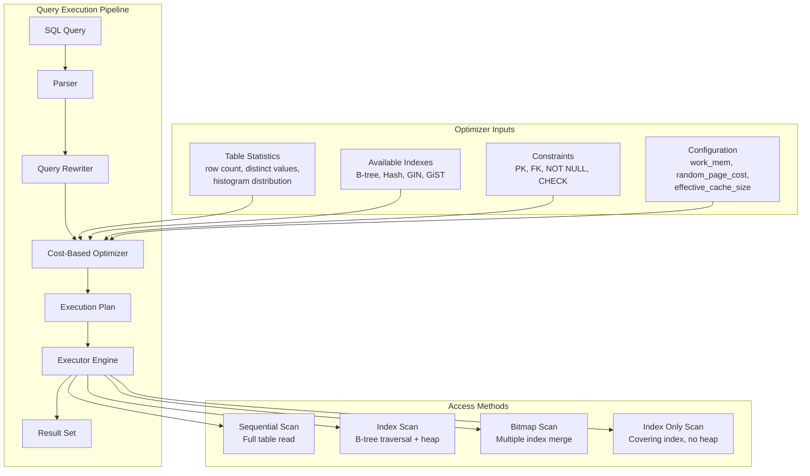
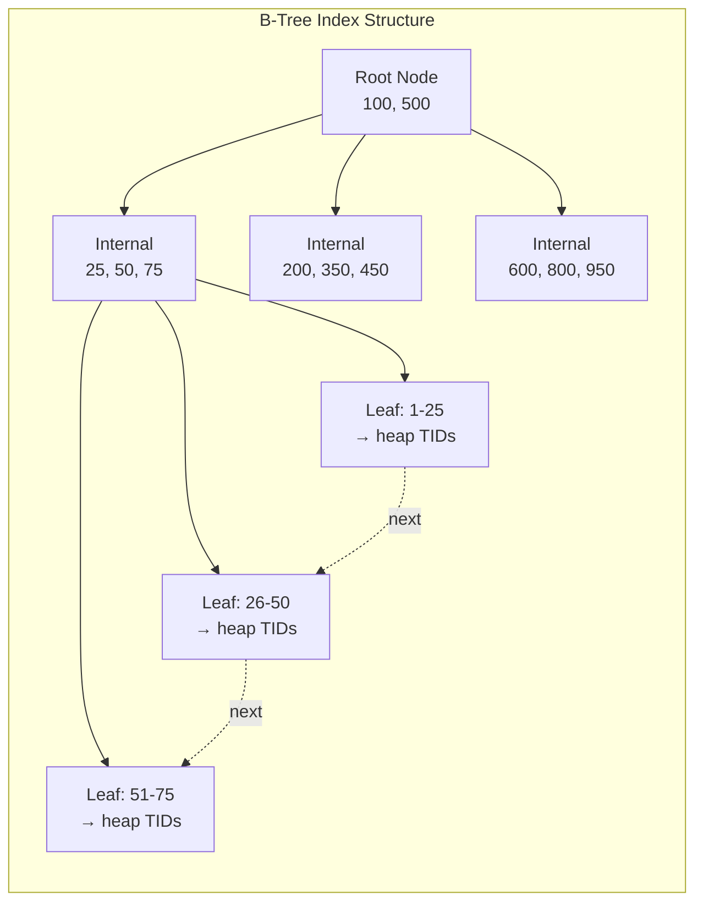
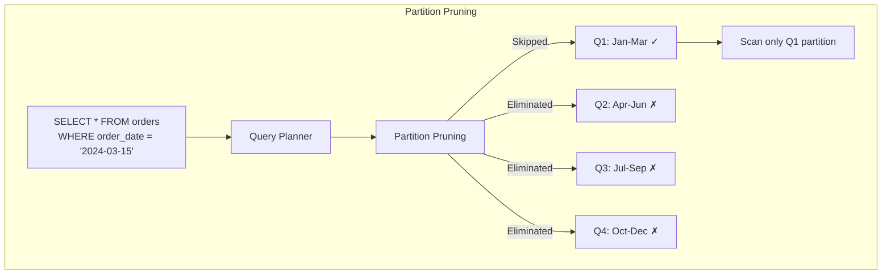

# SQL Performance Tuning

## Quick Reference

- Use `EXPLAIN ANALYZE` to inspect actual execution plans, row estimates, and timing for any query
- B-tree indexes are the default and best for equality and range queries; use composite indexes with the most selective column first
- Covering indexes include all columns needed by a query, eliminating table lookups entirely
- Partitioning splits large tables into smaller physical segments by range, list, or hash for faster scans and easier maintenance
- The query optimizer chooses between sequential scans, index scans, and bitmap scans based on table statistics and cost estimates
- Avoid `SELECT *`, implicit type conversions, and functions on indexed columns in WHERE clauses
- Keep statistics up to date with `ANALYZE` (PostgreSQL) or `UPDATE STATISTICS` (SQL Server) to help the optimizer make accurate decisions
- Connection pooling (PgBouncer, HikariCP) prevents connection overhead from degrading throughput under load

## When to Use

SQL performance tuning is essential whenever database queries become a bottleneck in application response times or system throughput. You should invest in tuning when queries exceed acceptable latency thresholds (typically 100ms for user-facing operations), when database CPU or I/O utilization is consistently high, or when slow query logs reveal repeated problematic patterns. Performance tuning is particularly critical during scaling events where data volume grows beyond what unoptimized queries can handle, during migration from monolithic to microservice architectures where database access patterns change, and when preparing for production launches where load testing reveals query bottlenecks. Start with query plan analysis to identify the root cause before applying any optimization, as premature indexing or denormalization without understanding the actual execution path often introduces new problems rather than solving existing ones.

## Code Examples

### Reading and Interpreting Query Plans

```sql
-- PostgreSQL: EXPLAIN ANALYZE shows actual execution time and row counts
EXPLAIN ANALYZE
SELECT o.order_id, o.total_amount, c.name
FROM orders o
JOIN customers c ON o.customer_id = c.customer_id
WHERE o.order_date >= '2024-01-01'
  AND o.status = 'SHIPPED'
ORDER BY o.order_date DESC
LIMIT 50;

-- Example output interpretation:
-- Limit (cost=1234.56..1234.70 rows=50 width=64) (actual time=2.1..2.3 rows=50 loops=1)
--   -> Sort (cost=1234.56..1256.78 rows=8900 width=64) (actual time=2.1..2.2 rows=50 loops=1)
--         Sort Key: o.order_date DESC
--         Sort Method: top-N heapsort  Memory: 32kB
--         -> Hash Join (cost=45.00..1100.00 rows=8900 width=64) (actual time=0.5..1.8 rows=8900 loops=1)
--               Hash Cond: (o.customer_id = c.customer_id)
--               -> Bitmap Heap Scan on orders o (cost=12.00..900.00 rows=8900 width=48)
--                     Recheck Cond: (order_date >= '2024-01-01' AND status = 'SHIPPED')
--                     -> Bitmap Index Scan on idx_orders_date_status (cost=0.00..11.50 rows=8900)
--               -> Hash (cost=25.00..25.00 rows=1000 width=20)
--                     -> Seq Scan on customers c (cost=0.00..25.00 rows=1000 width=20)

-- Key metrics to examine:
-- 1. actual time vs estimated cost (large discrepancies indicate stale statistics)
-- 2. rows (estimated vs actual) - if wildly different, run ANALYZE
-- 3. Sort Method - external merge sort indicates insufficient work_mem
-- 4. Seq Scan on large tables - potential missing index
```

### Creating Effective Indexes

```sql
-- Composite index: most selective column first
-- If status has 5 distinct values and order_date has 365, date is more selective
CREATE INDEX idx_orders_date_status
ON orders (order_date, status);

-- Covering index: includes all columns needed by the query
-- Avoids heap table lookup entirely (Index Only Scan)
CREATE INDEX idx_orders_covering
ON orders (order_date, status)
INCLUDE (order_id, total_amount, customer_id);

-- Partial index: only indexes rows matching a condition
-- Dramatically smaller index for queries that always filter on this condition
CREATE INDEX idx_orders_active
ON orders (order_date, customer_id)
WHERE status IN ('PENDING', 'PROCESSING', 'SHIPPED');

-- Expression index: for queries that apply functions to columns
CREATE INDEX idx_customers_lower_email
ON customers (LOWER(email));

-- Hash index: for equality-only lookups (PostgreSQL 10+)
CREATE INDEX idx_sessions_token
ON sessions USING hash (session_token);

-- GIN index: for full-text search and JSONB containment
CREATE INDEX idx_products_tags
ON products USING gin (tags);

-- Monitor index usage to identify unused indexes
SELECT schemaname, relname, indexrelname, idx_scan, idx_tup_read
FROM pg_stat_user_indexes
WHERE idx_scan = 0
ORDER BY pg_relation_size(indexrelid) DESC;
```

### Table Partitioning

```sql
-- Range partitioning by date (PostgreSQL declarative partitioning)
CREATE TABLE orders (
    order_id    BIGSERIAL,
    customer_id BIGINT NOT NULL,
    order_date  DATE NOT NULL,
    total_amount DECIMAL(10,2),
    status      VARCHAR(20)
) PARTITION BY RANGE (order_date);

-- Create partitions for each quarter
CREATE TABLE orders_2024_q1 PARTITION OF orders
    FOR VALUES FROM ('2024-01-01') TO ('2024-04-01');
CREATE TABLE orders_2024_q2 PARTITION OF orders
    FOR VALUES FROM ('2024-04-01') TO ('2024-07-01');
CREATE TABLE orders_2024_q3 PARTITION OF orders
    FOR VALUES FROM ('2024-07-01') TO ('2024-10-01');
CREATE TABLE orders_2024_q4 PARTITION OF orders
    FOR VALUES FROM ('2024-10-01') TO ('2025-01-01');

-- Create a default partition for data outside defined ranges
CREATE TABLE orders_default PARTITION OF orders DEFAULT;

-- Indexes on partitioned tables are created per-partition automatically
CREATE INDEX idx_orders_part_customer ON orders (customer_id);

-- List partitioning by region
CREATE TABLE customers (
    customer_id BIGSERIAL,
    name        VARCHAR(100),
    region      VARCHAR(20) NOT NULL
) PARTITION BY LIST (region);

CREATE TABLE customers_us PARTITION OF customers
    FOR VALUES IN ('US', 'CA');
CREATE TABLE customers_eu PARTITION OF customers
    FOR VALUES IN ('UK', 'DE', 'FR', 'ES');
CREATE TABLE customers_apac PARTITION OF customers
    FOR VALUES IN ('JP', 'AU', 'SG', 'IN');

-- Hash partitioning for even distribution
CREATE TABLE audit_logs (
    log_id      BIGSERIAL,
    user_id     BIGINT NOT NULL,
    action      VARCHAR(50),
    created_at  TIMESTAMP DEFAULT NOW()
) PARTITION BY HASH (user_id);

CREATE TABLE audit_logs_p0 PARTITION OF audit_logs
    FOR VALUES WITH (MODULUS 4, REMAINDER 0);
CREATE TABLE audit_logs_p1 PARTITION OF audit_logs
    FOR VALUES WITH (MODULUS 4, REMAINDER 1);
CREATE TABLE audit_logs_p2 PARTITION OF audit_logs
    FOR VALUES WITH (MODULUS 4, REMAINDER 2);
CREATE TABLE audit_logs_p3 PARTITION OF audit_logs
    FOR VALUES WITH (MODULUS 4, REMAINDER 3);
```

### Query Optimization Techniques

```sql
-- BEFORE: Correlated subquery executes once per row in outer query
SELECT c.name, c.email,
    (SELECT COUNT(*) FROM orders o WHERE o.customer_id = c.customer_id) AS order_count
FROM customers c
WHERE c.region = 'US';

-- AFTER: JOIN with aggregation executes as a single pass
SELECT c.name, c.email, COALESCE(o.order_count, 0) AS order_count
FROM customers c
LEFT JOIN (
    SELECT customer_id, COUNT(*) AS order_count
    FROM orders
    GROUP BY customer_id
) o ON o.customer_id = c.customer_id
WHERE c.region = 'US';

-- BEFORE: OR conditions prevent index usage
SELECT * FROM orders
WHERE customer_id = 1001 OR order_date = '2024-06-15';

-- AFTER: UNION ALL allows each branch to use its own index
SELECT * FROM orders WHERE customer_id = 1001
UNION ALL
SELECT * FROM orders WHERE order_date = '2024-06-15'
    AND customer_id != 1001;

-- Pagination: keyset pagination instead of OFFSET for large datasets
-- BEFORE: OFFSET scans and discards rows (O(n) for page n)
SELECT * FROM orders ORDER BY order_date DESC, order_id DESC
OFFSET 10000 LIMIT 50;

-- AFTER: Keyset pagination uses index efficiently (O(1) per page)
SELECT * FROM orders
WHERE (order_date, order_id) < ('2024-03-15', 987654)
ORDER BY order_date DESC, order_id DESC
LIMIT 50;

-- Batch operations: process in chunks to avoid lock contention
-- BEFORE: Single massive UPDATE locks entire table
UPDATE orders SET status = 'ARCHIVED' WHERE order_date < '2023-01-01';

-- AFTER: Batch processing with controlled commit size
DO $$
DECLARE
    batch_size INT := 5000;
    rows_affected INT;
BEGIN
    LOOP
        UPDATE orders SET status = 'ARCHIVED'
        WHERE order_id IN (
            SELECT order_id FROM orders
            WHERE order_date < '2023-01-01' AND status != 'ARCHIVED'
            LIMIT batch_size
            FOR UPDATE SKIP LOCKED
        );
        GET DIAGNOSTICS rows_affected = ROW_COUNT;
        COMMIT;
        EXIT WHEN rows_affected = 0;
        PERFORM pg_sleep(0.1); -- Brief pause to reduce lock pressure
    END LOOP;
END $$;
```

## Architecture and Diagrams







## Query Plans

Understanding query plans is the foundation of SQL performance tuning. Every database engine uses a cost-based optimizer that evaluates multiple execution strategies and selects the plan with the lowest estimated cost. The plan reveals exactly how the database will access data, join tables, sort results, and apply filters. Reading plans from the innermost node outward (bottom-up) shows the order of operations the executor follows.

Key plan node types include sequential scans (reading every row in a table), index scans (traversing a B-tree to find specific rows), bitmap scans (combining multiple index results before accessing the heap), nested loop joins (for small result sets or indexed lookups), hash joins (for equi-joins on larger datasets), and merge joins (for pre-sorted inputs). The actual execution time, row estimates versus actual rows, and buffer hit ratios are the most important metrics for identifying bottlenecks.

When estimated rows differ significantly from actual rows, the optimizer is working with stale statistics and may choose suboptimal plans. Running `ANALYZE` on affected tables updates the statistics that the planner relies on. The `work_mem` setting controls how much memory is available for sort operations and hash tables; insufficient memory forces the executor to spill to disk, dramatically increasing query time. Monitor the `Sort Method` in plan output: an in-memory quicksort is fast, while an external merge sort indicates memory pressure.

## Indexing Strategies

Effective indexing is the single highest-impact optimization for most database workloads. A well-designed index allows the database to locate rows in O(log n) time instead of scanning the entire table in O(n) time. However, indexes are not free: each index adds write overhead (every INSERT, UPDATE, and DELETE must maintain the index), consumes disk space, and increases backup and replication time.

The most important indexing strategies include composite indexes ordered by selectivity (place the most filtering column first), covering indexes that include all columns referenced by a query to enable index-only scans, partial indexes that only index a subset of rows matching a condition (reducing index size and maintenance cost), and expression indexes for queries that apply functions to columns. When designing composite indexes, consider the query patterns: an index on `(a, b, c)` supports queries filtering on `a`, `a AND b`, and `a AND b AND c`, but not queries filtering only on `b` or `c` alone.

Monitor index usage through system views like `pg_stat_user_indexes` in PostgreSQL or `sys.dm_db_index_usage_stats` in SQL Server. Unused indexes waste resources and should be dropped. Duplicate or overlapping indexes (where one index is a prefix of another) should be consolidated. For write-heavy workloads, minimize the number of indexes and consider using partial indexes or deferred index maintenance during bulk loads.

## Partitioning

Table partitioning divides a large table into smaller, more manageable physical segments while maintaining a single logical table interface for queries. The query planner uses partition pruning to eliminate irrelevant partitions from scans, dramatically reducing I/O for queries that filter on the partition key. Partitioning also enables parallel query execution across partitions and simplifies data lifecycle management (dropping old partitions is instantaneous compared to deleting millions of rows).

Range partitioning is the most common strategy, typically applied to time-series data where queries naturally filter by date ranges. List partitioning works well for categorical data like region or tenant in multi-tenant systems. Hash partitioning distributes data evenly across a fixed number of partitions, useful when no natural range or list key exists but you need to limit partition size for maintenance operations.

Partitioning introduces trade-offs: queries that do not filter on the partition key must scan all partitions (partition-wise joins help but add complexity), unique constraints must include the partition key, and foreign keys referencing partitioned tables have limitations. The optimal partition size is typically between 100MB and 1GB; too many small partitions increase planning overhead, while too few large partitions reduce the benefit of pruning. Automate partition creation and maintenance with scheduled jobs that create future partitions and detach or drop expired ones.

## Query Optimization

Query optimization involves rewriting SQL statements to enable the optimizer to choose more efficient execution plans. The optimizer can only work with what it is given: poorly structured queries constrain the optimizer's choices regardless of available indexes or hardware resources. The most impactful optimizations include eliminating correlated subqueries (replacing them with JOINs or window functions), using keyset pagination instead of OFFSET for large result sets, and breaking complex queries into simpler steps using CTEs or temporary tables when the optimizer struggles with plan selection.

Join order significantly affects performance: the optimizer generally handles this well, but hints or restructuring may be needed when statistics are inaccurate. For queries joining many tables, ensure the most restrictive filters are applied early to reduce intermediate result set sizes. Use EXISTS instead of IN for subqueries when you only need to check existence, as EXISTS can short-circuit after finding the first match. Avoid DISTINCT when possible by restructuring joins to prevent duplicates in the first place.

Batch processing is critical for bulk operations: updating or deleting millions of rows in a single transaction acquires locks that block other queries, generates massive WAL (Write-Ahead Log) entries, and risks transaction log overflow. Process in chunks of 1000-10000 rows with explicit commits between batches, using `FOR UPDATE SKIP LOCKED` to avoid contention with concurrent operations. For analytical queries on large datasets, consider materialized views that pre-compute expensive aggregations and refresh on a schedule.

## Common Anti-Patterns

Several recurring SQL anti-patterns cause severe performance degradation in production systems. The most damaging include using `SELECT *` when only specific columns are needed (preventing covering index usage and increasing I/O), applying functions to indexed columns in WHERE clauses (which prevents index usage because the optimizer cannot match the transformed value against the index), and using implicit type conversions that force full table scans.

The N+1 query pattern occurs when application code loops through a result set and executes an additional query for each row, generating thousands of round trips instead of a single JOIN or batch query. Object-relational mappers (ORMs) frequently produce this pattern through lazy loading. Always inspect generated SQL and use eager loading or explicit joins for known access patterns.

Using OFFSET-based pagination for deep pages is another common anti-pattern: `OFFSET 100000 LIMIT 50` requires the database to scan and discard 100000 rows before returning 50, making each subsequent page slower. Keyset pagination (using a WHERE clause with the last seen value) provides constant-time access to any page. Similarly, counting total rows with `SELECT COUNT(*)` on large tables for pagination metadata is expensive; consider approximate counts or cached totals instead.

Overusing triggers and stored procedures for business logic creates hidden performance costs that are difficult to profile and optimize. Each trigger fires within the same transaction, adding latency to every write operation. Prefer application-level logic where possible, reserving triggers for audit logging or referential integrity that cannot be enforced otherwise. Finally, neglecting connection pooling causes repeated connection establishment overhead (TCP handshake, authentication, session setup) that adds 5-50ms per query in cloud environments.

## Real-World Use Cases

- **E-commerce order search optimization**: A retail platform with 500 million orders experienced 8-second response times on the order history page. Analysis revealed a sequential scan on the orders table due to a missing composite index on `(customer_id, order_date)`. Adding a covering index with INCLUDE columns for display fields reduced query time to 12ms. Partitioning by quarter further improved archival queries and enabled instant partition drops for GDPR data deletion requests.

- **Financial transaction reporting**: A payment processing system needed sub-second aggregation across billions of transactions for daily settlement reports. The solution combined range partitioning by transaction date with materialized views that pre-compute daily summaries. Incremental refresh of materialized views during off-peak hours keeps reports current without impacting OLTP workload, while partition pruning ensures ad-hoc queries only scan relevant date ranges.

- **Multi-tenant SaaS query isolation**: A B2B platform serving 10,000 tenants on a shared database experienced noisy-neighbor problems where one tenant's analytical queries degraded performance for others. Hash partitioning by tenant_id combined with connection pool isolation (separate pools per tenant tier) and query timeout enforcement resolved contention. Partial indexes filtered by tenant_id for the largest tenants eliminated unnecessary index bloat for smaller accounts.

- **Real-time analytics dashboard**: A logistics company needed sub-200ms dashboard queries across 2 billion GPS tracking points. The solution used TimescaleDB hypertables (automatic time-based partitioning) with continuous aggregates for pre-computed hourly and daily rollups. Chunk exclusion (partition pruning) ensures real-time queries only touch the most recent chunks, while compressed older chunks reduce storage by 90% without affecting query capability.

## Common Interview Questions

**Q: How do you identify a slow query and determine the root cause?**
A: Start with the slow query log to identify problematic queries, then use `EXPLAIN ANALYZE` to examine the actual execution plan. Look for sequential scans on large tables (missing index), large discrepancies between estimated and actual rows (stale statistics), sort operations spilling to disk (insufficient `work_mem`), and nested loop joins on large result sets (missing join index or incorrect join strategy).

**Q: When would you choose not to add an index?**
A: Avoid adding indexes on tables with very high write-to-read ratios (each index adds write overhead), on columns with very low cardinality where the optimizer would choose a sequential scan anyway, on small tables where a full scan is faster than index traversal overhead, and when the index would duplicate coverage already provided by an existing composite index.

**Q: Explain the difference between a clustered and non-clustered index.**
A: A clustered index determines the physical storage order of table rows (only one per table), making range scans on the clustering key extremely efficient since data is contiguous on disk. Non-clustered indexes store a separate structure with pointers back to the heap or clustered index key, requiring an additional lookup to retrieve non-covered columns. In PostgreSQL, the equivalent is using `CLUSTER` command to reorder a table by an index.

**Q: How does partitioning improve query performance?**
A: Partitioning enables partition pruning where the query planner eliminates entire partitions from scans based on the WHERE clause filter on the partition key. A query filtering on `order_date = '2024-03-15'` against a table partitioned by month only scans the March 2024 partition instead of the entire table. This reduces I/O proportionally to the number of eliminated partitions and enables parallel scans across remaining partitions.

**Q: What is a covering index and when should you use one?**
A: A covering index includes all columns referenced by a query (in SELECT, WHERE, JOIN, and ORDER BY clauses), enabling an Index Only Scan that never accesses the heap table. Use covering indexes for frequently executed queries where the additional index size is justified by eliminating random I/O heap lookups. In PostgreSQL, use the INCLUDE clause to add non-key columns to the index without affecting sort order.

## Production Tips

- **Monitor query plan changes**: Use `pg_stat_statements` (PostgreSQL) or Query Store (SQL Server) to track plan regressions after deployments, statistics updates, or data growth. A query that was fast yesterday may become slow today if the optimizer switches from an index scan to a sequential scan due to changed statistics.

- **Automate partition maintenance**: Create future partitions ahead of time with scheduled jobs (at least one month ahead for monthly partitions). Set up alerts for partition boundary violations and automate detaching or dropping expired partitions during low-traffic windows to avoid locking issues.

- **Right-size connection pools**: Set pool size to `(core_count * 2) + effective_spindle_count` as a starting point (typically 10-30 connections for most applications). Too many connections cause context switching overhead and lock contention; too few cause request queuing. Monitor pool wait time and active connection count.

- **Use read replicas strategically**: Route analytical and reporting queries to read replicas to offload the primary. Be aware of replication lag (typically 10-100ms for synchronous, seconds for asynchronous) and ensure application logic tolerates stale reads where replicas are used.

- **Index maintenance schedule**: Schedule `REINDEX` or `pg_repack` for bloated indexes during maintenance windows. B-tree indexes accumulate dead tuples from updates and deletes, increasing index size and scan time. Monitor index bloat with `pgstattuple` extension and reindex when bloat exceeds 30-40%.

## Related Topics

- [Java](./java.md) - JDBC connection management, PreparedStatement for parameterized queries, and HikariCP connection pooling
- [Spring Framework](./spring-framework.md) - Spring Data JPA query optimization, @Query annotations, and transaction management
- [MongoDB](./mongodb.md) - Comparison of document store indexing strategies with relational database B-tree indexes
