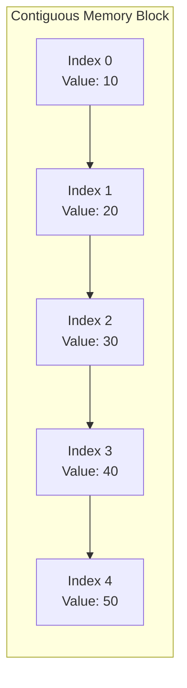

# Array

An **array** is a fundamental data structure in Java that allows you to store multiple elements of the same type in a contiguous block of memory. Arrays provide fast, index-based access to their elements and are widely used for their simplicity and efficiency. Understanding arrays is essential because they form the building block for more complex data structures like heaps, hash tables, and matrices.

---

## Quick Reference

- **Access by index**: O(1) constant time
- **Search (unsorted)**: O(n) linear scan
- **Search (sorted)**: O(log n) binary search
- **Insert at end**: O(1) if space available
- **Insert at index**: O(n) requires shifting
- **Delete by index**: O(n) requires shifting
- **Space complexity**: O(n) contiguous allocation
- **Java declaration**: `int[] arr = new int[size];` or `int[] arr = {1, 2, 3};`
- **Get length**: `arr.length` (field, not method)
- **Sort**: `Arrays.sort(arr)` uses dual-pivot quicksort for primitives, TimSort for objects
- **Copy**: `Arrays.copyOf(arr, newLength)` or `System.arraycopy(src, srcPos, dest, destPos, length)`
- **Compare**: `Arrays.equals(arr1, arr2)` for content equality

---

## When to Use

Arrays are the right choice when you need fast random access by index and know the size of your collection ahead of time. They excel in scenarios where memory locality matters for cache performance, such as numerical computations, image processing, and matrix operations.

**Choose arrays when:**
- You need O(1) random access to elements by position
- The collection size is known at compile time or initialization
- You are working with primitive types and want to avoid boxing overhead
- Cache performance is critical (contiguous memory layout)
- You need a backing store for other data structures (heaps, hash tables, ring buffers)

**Avoid arrays when:**
- The collection size changes frequently (use ArrayList or LinkedList instead)
- You need key-value associations (use HashMap)
- You need fast insertion/deletion in the middle (use LinkedList)
- You need thread-safe dynamic resizing (use CopyOnWriteArrayList or Vector)

---

## Key Features of Arrays

1. **Fixed Size**: Arrays are created with a predefined size and cannot grow or shrink dynamically.
2. **Homogeneous Data**: All elements in an array must be of the same type.
3. **Zero-Based Indexing**: Array indexing starts at 0, with the first element at index 0 and the last element at `length - 1`.
4. **Direct Access**: Array elements can be accessed in constant time using their index.
5. **Memory Efficiency**: Arrays are stored in contiguous memory locations, leading to efficient access patterns.

---

## Declaring and Initializing Arrays

1. **Declaration**: Use square brackets `[]` after the type to declare an array.
2. **Initialization**:
    - Inline initialization with known values.
    - Using `new` keyword to specify size and optionally assign values later.

### Examples:

```java
// Declaration and inline initialization
int[] numbers = {1, 2, 3, 4, 5};

// Declaration with size specified
String[] names = new String[3];  // Default value is null for Strings
names[0] = "Alice";
names[1] = "Bob";
names[2] = "Charlie";
```

### Accessing and Modifying Array Elements

Array elements can be accessed and modified using their index:

```java
int[] scores = {90, 80, 70};
System.out.println(scores[1]);  // Output: 80
scores[1] = 85;                 // Modify element
System.out.println(scores[1]);  // Output: 85
```

---

## Iterating Through Arrays

### Using a For Loop:

```java
int[] arr = {1, 2, 3, 4, 5};
for (int i = 0; i < arr.length; i++) {
    System.out.println(arr[i]);
}
```

### Using an Enhanced For Loop:

```java
String[] colors = {"Red", "Green", "Blue"};
for (String color : colors) {
    System.out.println(color);
}
```

---

## Code Examples

### Binary Search on a Sorted Array

Binary search is one of the most important array algorithms, leveraging the sorted property to achieve O(log n) search time by repeatedly halving the search space.

```java
public static int binarySearch(int[] arr, int target) {
    int left = 0, right = arr.length - 1;
    while (left <= right) {
        int mid = left + (right - left) / 2;  // Avoids integer overflow
        if (arr[mid] == target) return mid;
        else if (arr[mid] < target) left = mid + 1;
        else right = mid - 1;
    }
    return -1;  // Not found
}
```

### Two-Pointer Technique

The two-pointer technique is a common pattern for solving array problems efficiently, often reducing O(n²) brute force to O(n).

```java
// Find two numbers in a sorted array that sum to a target
public static int[] twoSum(int[] sorted, int target) {
    int left = 0, right = sorted.length - 1;
    while (left < right) {
        int sum = sorted[left] + sorted[right];
        if (sum == target) return new int[]{left, right};
        else if (sum < target) left++;
        else right--;
    }
    return new int[]{-1, -1};
}
```

### Sliding Window Maximum

The sliding window pattern is used for subarray problems where you need to track a window of elements moving across the array.

```java
// Find maximum sum subarray of size k
public static int maxSumSubarray(int[] arr, int k) {
    int windowSum = 0, maxSum = Integer.MIN_VALUE;
    for (int i = 0; i < arr.length; i++) {
        windowSum += arr[i];
        if (i >= k - 1) {
            maxSum = Math.max(maxSum, windowSum);
            windowSum -= arr[i - (k - 1)];
        }
    }
    return maxSum;
}
```

### Dutch National Flag (3-Way Partition)

A classic array partitioning algorithm used in quicksort variants and problems involving three categories of elements.

```java
// Partition array into three sections: less than, equal to, greater than pivot
public static void dutchNationalFlag(int[] arr, int pivot) {
    int low = 0, mid = 0, high = arr.length - 1;
    while (mid <= high) {
        if (arr[mid] < pivot) {
            swap(arr, low++, mid++);
        } else if (arr[mid] == pivot) {
            mid++;
        } else {
            swap(arr, mid, high--);
        }
    }
}

private static void swap(int[] arr, int i, int j) {
    int temp = arr[i];
    arr[i] = arr[j];
    arr[j] = temp;
}
```

---

## Real-World Applications of Arrays

Arrays are versatile and have numerous real-world applications, including:

1. **Storing Data**:
    - Contacts in a phone directory.
    - Book titles in a library management system.
2. **Gaming**:
    - Maintaining a leaderboard.
    - Representing a chessboard using a 2D array.
3. **Image and Video Processing**:
    - Using 2D or 3D arrays for pixel representation.
4. **Multidimensional Calculations**:
    - Representing matrices in linear algebra or data science.
5. **System Operations**:
    - Implementing CPU scheduling algorithms.
    - Storing data for caching mechanisms.

---

## Key Points About Arrays in Java

1. **Arrays Are Objects**:
    - Arrays are treated as objects in Java, even though they don't correspond to a specific class.
    - Arrays inherit from the **`Object`** class.
2. **Default Values**:
    - If an array is not initialized explicitly, its elements are assigned default values based on the type:
        - **`0`** for numeric types.
        - **`false`** for boolean.
        - **`null`** for objects.
3. **Printing an Array**:
    - Directly printing an array object displays its memory reference:

        ```java
        int[] arr = {1, 2, 3};
        System.out.println(arr);  // Prints something like [I@4e25154f
        ```

    - Use **`Arrays.toString()`** or loop through the array to display its elements:

        ```java
        System.out.println(Arrays.toString(arr));  // Output: [1, 2, 3]
        ```

4. **ArrayIndexOutOfBoundsException**:
    - Accessing an index outside the bounds of an array throws this exception:

        ```java
        int[] arr = {1, 2, 3};
        System.out.println(arr[3]);  // Throws ArrayIndexOutOfBoundsException
        ```

---

## Multidimensional Arrays

Java supports multidimensional arrays, such as 2D arrays, often used for representing grids or matrices.

### Declaring and Initializing:

```java
int[][] matrix = {
    {1, 2, 3},
    {4, 5, 6},
    {7, 8, 9}
};
```

### Accessing Elements:

```java
System.out.println(matrix[1][2]);  // Output: 6
```

### Iterating Through a 2D Array:

```java
for (int i = 0; i < matrix.length; i++) {
    for (int j = 0; j < matrix[i].length; j++) {
        System.out.print(matrix[i][j] + " ");
    }
    System.out.println();
}
```

---

## Array Memory Layout



---

## Advantages of Arrays

1. **Efficient Access**: Direct indexing provides constant-time access to elements.
2. **Memory Compactness**: Elements are stored in contiguous memory locations.
3. **Ease of Use**: Arrays are simple and intuitive for basic data storage and manipulation.

---

## Limitations of Arrays

1. **Fixed Size**: Arrays cannot grow or shrink dynamically, which can lead to wasted memory or the need for resizing.
2. **Type Homogeneity**: Only elements of the same type can be stored.
3. **No Built-in Methods**: Arrays lack utility methods like those provided by the Java Collections Framework.

---

## Operations on Arrays with Time Complexity

| **Operation** | **Description** | **Time Complexity** |
| --- | --- | --- |
| **Access** | Retrieve an element using its index. | O(1) |
| **Search** | Search for an element (linear search). | O(n) |
| **Insert (at end)** | Add an element at the end of the array. | O(1) (if space allows) |
| **Insert (at index)** | Shift elements and add an element at a specific index. | O(n) |
| **Delete (by index)** | Remove an element and shift remaining elements. | O(n) |
| **Traversal** | Iterate through all elements in the array. | O(n) |
| **Sorting** | Sorting the elements (e.g., quicksort, mergesort). | O(n log n) |

---

## Common Pitfalls

1. **Off-by-one errors**: The most frequent array bug. Remember that valid indices are `0` to `length - 1`. Using `<=` instead of `<` in loop conditions causes `ArrayIndexOutOfBoundsException`.

2. **Integer overflow in midpoint calculation**: When computing `mid = (left + right) / 2` in binary search, the sum can overflow for large indices. Always use `mid = left + (right - left) / 2` instead.

3. **Confusing reference vs. value copying**: Assigning one array variable to another copies the reference, not the contents. Modifying one affects the other. Use `Arrays.copyOf()` or `clone()` for independent copies.

4. **Forgetting that Arrays.sort() modifies in place**: `Arrays.sort()` mutates the original array. If you need the original order preserved, sort a copy.

5. **Assuming arrays are resizable**: Unlike ArrayList, arrays have a fixed size. Attempting to add beyond capacity requires creating a new larger array and copying elements.

6. **Null elements in object arrays**: Object arrays default to `null`. Iterating and calling methods without null checks leads to `NullPointerException`.

---

## Interview Questions

**Q1: How would you find the kth largest element in an unsorted array?**
Use a min-heap of size k. Iterate through the array, maintaining only the k largest elements in the heap. The root of the heap is the kth largest. Time complexity is O(n log k). Alternatively, use quickselect for average O(n) time.

**Q2: How do you detect a duplicate in an array of n+1 integers where each integer is between 1 and n?**
Floyd's cycle detection (tortoise and hare) treats the array as a linked list where `arr[i]` points to the next index. This finds the duplicate in O(n) time and O(1) space without modifying the array.

**Q3: Explain the difference between Arrays.sort() for primitives vs. objects in Java.**
For primitives, Java uses dual-pivot quicksort (average O(n log n), not stable). For objects, it uses TimSort (worst-case O(n log n), stable). The distinction matters when stability of equal elements is required.

**Q4: How would you rotate an array by k positions in O(n) time and O(1) space?**
Use the reversal algorithm: reverse the entire array, then reverse the first k elements, then reverse the remaining n-k elements. Each reversal is O(n), giving O(n) total with O(1) extra space.

---

## Production Tips

1. **Prefer ArrayList for dynamic collections**: In production code, use `ArrayList<>` unless you specifically need primitive arrays for performance. ArrayList handles resizing, provides bounds checking, and integrates with the Collections framework. Reserve raw arrays for performance-critical inner loops or when interfacing with APIs that require them.

2. **Use System.arraycopy for bulk operations**: When copying large arrays, `System.arraycopy()` is a native method that uses optimized memory copy operations (often `memcpy` under the hood). It significantly outperforms manual element-by-element copying for arrays larger than a few dozen elements.

3. **Consider memory alignment and cache lines**: Arrays benefit from CPU cache prefetching because elements are contiguous. When processing large arrays, sequential access patterns (iterating forward) are dramatically faster than random access due to cache line utilization. Structure your algorithms to access array elements sequentially when possible.

4. **Watch for array allocation in hot paths**: Creating arrays inside frequently-called methods generates garbage collection pressure. In latency-sensitive applications, pre-allocate arrays and reuse them via object pooling or thread-local storage.

5. **Use Arrays.parallelSort for large datasets**: For arrays with more than 8192 elements, `Arrays.parallelSort()` leverages the ForkJoinPool to sort in parallel, providing significant speedup on multi-core systems.

---

## Related Topics

- [List](./list.md) — ArrayList and LinkedList provide dynamic alternatives to fixed-size arrays
- [Heap](./heap.md) — Heaps are implemented using arrays with parent-child index relationships
- [Queue](./queue.md) — Array-backed queues (ArrayDeque) offer efficient FIFO operations
- [Ring Buffer](./ring-buffer.md) — Circular buffers use arrays with wrap-around indexing
- [Big O Notation](./big-o-notation.md) — Understanding time complexity of array operations
