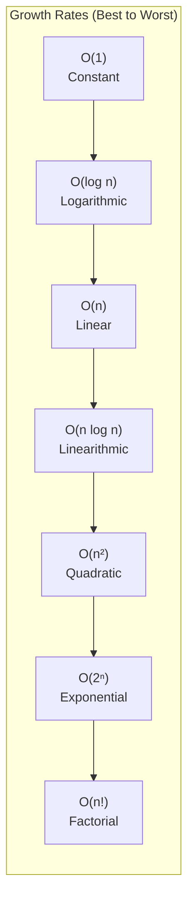

# Big O Notation

Big O notation is a mathematical way to describe the efficiency of an algorithm, focusing on how its runtime or space requirements grow as input size increases. It is crucial for evaluating algorithms' performance and determining which one is best suited for a particular problem.

---

## Quick Reference

- **O(1)** — Constant: array access, hash table lookup, stack push/pop
- **O(log n)** — Logarithmic: binary search, balanced BST operations
- **O(n)** — Linear: linear search, single traversal, counting sort
- **O(n log n)** — Linearithmic: merge sort, heap sort, TimSort
- **O(n²)** — Quadratic: bubble sort, selection sort, nested loops
- **O(2ⁿ)** — Exponential: recursive Fibonacci, power set generation
- **O(n!)** — Factorial: permutation generation, brute-force TSP
- **Drop constants**: O(2n) = O(n), O(100) = O(1)
- **Drop non-dominant terms**: O(n² + n) = O(n²)
- **Multiple inputs**: O(a + b) when sequential, O(a × b) when nested
- **Space complexity**: counts additional memory beyond input (stack frames, auxiliary arrays)
- **Amortized**: average cost per operation over a sequence (e.g., dynamic array insert is amortized O(1))

---

## When to Use

Big O analysis is essential whenever you need to evaluate whether an algorithm will scale to production workloads. Use it during code reviews, system design interviews, and when choosing between competing approaches.

**Apply Big O analysis when:**
- Comparing two algorithms that solve the same problem
- Estimating whether a solution will meet latency requirements at scale
- Identifying bottlenecks in nested loops or recursive calls
- Deciding between time-space tradeoffs (e.g., caching vs. recomputation)
- Communicating performance characteristics to team members

**Keep in mind:**
- Big O describes asymptotic behavior, not actual wall-clock time
- Constants matter in practice (an O(n) algorithm with a large constant can be slower than O(n log n) for small n)
- Cache behavior, branch prediction, and memory allocation patterns affect real performance beyond what Big O captures

---

## Common Big O Complexities



---

## Code Examples

### Example 1: Single Loops

```java
void foo(int[] array) {
    int sum = 0;
    int product = 1;
    for (int i = 0; i < array.length; i++) {
        sum += array[i];
    }
    for (int i = 0; i < array.length; i++) {
        product *= array[i];
    }
    System.out.println(sum + ", " + product);
}
```

**Explanation and Runtime:**

- The algorithm has two loops, each iterating through the array N times.
- While there are two separate loops, they don't affect each other in terms of scaling, so the time complexity remains **O(N)**.

---

### Example 2: Nested Loops

```java
void printPairs(int[] array) {
    for (int i = 0; i < array.length; i++) {
        for (int j = 0; j < array.length; j++) {
            System.out.println(array[i] + "," + array[j]);
        }
    }
}
```

**Explanation and Runtime:**

- The outer loop runs N times, and for each iteration of the outer loop, the inner loop also runs N times.
- The total number of iterations is N × N, so the overall time complexity is **O(N²)**.

---

### Example 3: Nested Loops (Non-Overlapping Pairs)

```java
void printUnorderedPairs(int[] array) {
    for (int i = 0; i < array.length; i++) {
        for (int j = i + 1; j < array.length; j++) {
            System.out.println(array[i] + "," + array[j]);
        }
    }
}
```

**Explanation and Runtime:**

- The number of iterations reduces with each step: the outer loop runs N times, and the inner loop runs N-1, N-2, etc. times.
- The total number of iterations sums up to N(N-1)/2, which simplifies to **O(N²)**.

---

### Example 4: Two Arrays

```java
void printUnorderedPairs(int[] arrayA, int[] arrayB) {
    for (int i = 0; i < arrayA.length; i++) {
        for (int j = 0; j < arrayB.length; j++) {
            if (arrayA[i] < arrayB[j]) {
                System.out.println(arrayA[i] + "," + arrayB[j]);
            }
        }
    }
}
```

**Explanation and Runtime:**

- If arrayA has a elements and arrayB has b elements, the total number of iterations is a × b.
- **Big O Notation:** **O(a × b)**.

---

### Example 5: Constant Work in Nested Loops

```java
void printUnorderedPairs(int[] arrayA, int[] arrayB) {
    for (int i = 0; i < arrayA.length; i++) {
        for (int j = 0; j < arrayB.length; j++) {
            for (int k = 0; k < 100000; k++) {
                System.out.println(arrayA[i] + "," + arrayB[j]);
            }
        }
    }
}
```

**Explanation and Runtime:**

- The innermost loop runs 100,000 times for each pair, but since the constant factor doesn't depend on the input size, it doesn't affect the overall time complexity.
- **Big O Notation:** **O(a × b)** (constant factors like 100,000 are ignored).

---

### Example 6: Reversing an Array

```java
void reverse(int[] array) {
    for (int i = 0; i < array.length / 2; i++) {
        int other = array.length - i - 1;
        int temp = array[i];
        array[i] = array[other];
        array[other] = temp;
    }
}
```

**Explanation and Runtime:**

- The algorithm iterates through only half of the array. Since the array has N elements, the number of iterations is N/2, which simplifies to **O(N)**.

---

### Example 7: Runtime Equivalence

Which of the following are equivalent to O(N)?

1. **O(N + P)**, where P < N → simplifies to **O(N)**.
2. **O(2N)** → constant factors are ignored, equivalent to **O(N)**.
3. **O(N + log N)** → O(N) dominates, as log N grows slower.
4. **O(N + M)** → no relationship between N and M, remains **O(N + M)**.

---

### Example 8: Sorting Strings and Arrays

**Scenario:** Sort an array of strings, where each string is sorted individually, then sort the array.

1. Sorting each string: O(s log s), where s is the length of the string.
2. Sorting a strings: O(a × s log s).
3. Sorting the array of strings by comparing: O(a × s log a).
4. Total: **O(a × s (log a + log s))**.

---

### Example 9: Recursive Sum of a Binary Tree

```java
int sum(Node node) {
    if (node == null) return 0;
    return sum(node.left) + node.value + sum(node.right);
}
```

**Explanation:** Each node is visited once and the work done per node is constant. **O(N)**.

---

### Example 10: Prime Checking

```java
boolean isPrime(int n) {
    for (int x = 2; x * x <= n; x++) {
        if (n % x == 0) return false;
    }
    return true;
}
```

**Explanation:** The loop checks divisibility up to √n. **O(√n)**.

---

### Example 11: Factorial Calculation

```java
int factorial(int n) {
    if (n < 0) return -1;
    else if (n == 0) return 1;
    else return n * factorial(n - 1);
}
```

**Explanation:** Makes n recursive calls. **O(n)**.

---

### Example 12: String Permutations

```java
void permutation(String str) {
    permutation(str, "");
}

void permutation(String str, String prefix) {
    if (str.length() == 0) {
        System.out.println(prefix);
    } else {
        for (int i = 0; i < str.length(); i++) {
            String rem = str.substring(0, i) + str.substring(i + 1);
            permutation(rem, prefix + str.charAt(i));
        }
    }
}
```

**Explanation:** For a string of length n, there are n! permutations. Each takes O(n) to print. **O(n × n!)**.

---

### Example 13: Fibonacci Calculation

```java
int fib(int n) {
    if (n <= 0) return 0;
    else if (n == 1) return 1;
    return fib(n - 1) + fib(n - 2);
}
```

**Explanation:** Two recursive calls per invocation, growing exponentially. **O(2ⁿ)**.

---

### Example 14: Printing All Fibonacci Numbers

```java
void allFib(int n) {
    for (int i = 0; i < n; i++) {
        System.out.println(i + ": " + fib(i));
    }
}
```

**Explanation:** The total work is dominated by the largest term fib(n), which is O(2ⁿ). **O(2ⁿ)**.

---

### Example 15: Fibonacci Numbers with Memoization

```java
void allFib(int n) {
    int[] memo = new int[n + 1];
    for (int i = 0; i < n; i++) {
        System.out.println(i + ": " + fib(i, memo));
    }
}

int fib(int n, int[] memo) {
    if (n <= 0) return 0;
    else if (n == 1) return 1;
    else if (memo[n] > 0) return memo[n];

    memo[n] = fib(n - 1, memo) + fib(n - 2, memo);
    return memo[n];
}
```

**Explanation:** Each Fibonacci number is calculated only once. Total calls: **O(n)**.

---

### Example 16: Printing Powers of 2

```java
int powersOf2(int n) {
    if (n < 1) {
        return 0;
    } else if (n == 1) {
        System.out.println(1);
        return 1;
    } else {
        int prev = powersOf2(n / 2);
        int curr = prev * 2;
        System.out.println(curr);
        return curr;
    }
}
```

**Explanation:** The number of times n can be halved until it reaches 1 is log₂(n). **O(log n)**.

---

## Common Pitfalls

1. **Confusing Big O with exact runtime**: O(n) does not mean the algorithm takes n milliseconds. It describes growth rate, not absolute performance. An O(n) algorithm with a constant factor of 1000 is slower than O(n²) for inputs smaller than 1000.

2. **Ignoring hidden loops in library methods**: Calling `list.contains()` inside a loop creates O(n²) behavior even though each line looks O(1). String concatenation in a loop is O(n²) because each concatenation copies the entire string.

3. **Forgetting space complexity**: An algorithm with O(n) time but O(n) space may be worse than O(n log n) time with O(1) space when memory is constrained. Always analyze both dimensions.

4. **Misapplying amortized analysis**: Amortized O(1) for ArrayList insertion means the average over many operations is O(1), but individual insertions can still be O(n). This matters for latency-sensitive systems where worst-case per-operation cost matters.

5. **Assuming recursion depth equals time complexity**: A recursive function with depth d and branching factor b has O(b^d) time complexity, not O(d). The Fibonacci recursion is O(2^n), not O(n).

6. **Overlooking log base differences**: While log bases differ by a constant factor (irrelevant for Big O), confusing log₂ with log₁₀ in actual calculations leads to incorrect estimates of real-world performance.

---

## Interview Questions

**Q1: What is the time complexity of finding an element in a sorted array vs. an unsorted array?**
Sorted array allows binary search at O(log n). Unsorted array requires linear scan at O(n). This is why maintaining sorted order is valuable when reads dominate writes.

**Q2: If an algorithm has O(n log n) time complexity, is it always faster than O(n²)?**
Asymptotically yes, but for small inputs the O(n²) algorithm may be faster due to lower constant factors and better cache behavior. This is why hybrid sorts like TimSort use insertion sort (O(n²)) for small subarrays.

**Q3: Explain the difference between O(1) amortized and O(1) worst-case.**
O(1) worst-case means every single operation completes in constant time (e.g., array access). O(1) amortized means the average over a sequence of operations is constant, but individual operations may be expensive (e.g., dynamic array resize copies all elements occasionally).

**Q4: What is the space complexity of a recursive algorithm with depth n?**
At minimum O(n) for the call stack frames. Each frame stores local variables and return addresses. Tail-call optimization can reduce this to O(1) in languages that support it, but Java does not optimize tail calls.

**Q5: How do you determine the time complexity of a recursive function?**
Draw the recursion tree. Count total nodes (each represents one function call). For branching factor b and depth d, total calls are O(b^d). Alternatively, use the Master Theorem for divide-and-conquer recurrences of the form T(n) = aT(n/b) + O(n^c).

---

## Production Tips

1. **Profile before optimizing**: Big O tells you the growth rate, but profiling tells you where time is actually spent. A theoretically optimal O(n log n) algorithm may be slower than a simpler O(n²) approach for your actual data sizes due to constant factors, cache misses, or memory allocation patterns.

2. **Consider the realistic input size**: If your input is always under 1000 elements, the difference between O(n log n) and O(n²) is negligible. Optimize for readability first, then for performance only when profiling shows a bottleneck.

3. **Watch for accidental quadratic behavior**: Common sources include string concatenation in loops (use StringBuilder), nested contains() calls on lists (use HashSet), and repeated array shifting (use appropriate data structures). These are the most common performance bugs in production Java code.

4. **Use appropriate data structures to achieve target complexity**: If you need O(1) lookup, use a HashMap. If you need O(log n) sorted operations, use a TreeMap. Choosing the right data structure is more impactful than micro-optimizing algorithms.

5. **Document complexity in method Javadoc**: For public APIs and shared libraries, document the time and space complexity of methods. This helps consumers make informed decisions about usage patterns and prevents accidental misuse in hot paths.

---

## Related Topics

- [Array Fundamentals](../arrays-and-strings/array-fundamentals.md) — Understanding array operation complexities is fundamental to Big O analysis
- [Heap](./heap.md) — Heap operations demonstrate O(log n) behavior in priority queue implementations
- [Graph Representations and Traversal](../trees-and-graphs/graph-representations-and-traversal.md) — Graph algorithms showcase O(V + E) traversal complexity
- [Binary Trees and BSTs](../trees-and-graphs/binary-trees-and-bsts.md) — Balanced trees achieve O(log n) search through height-bounded structures
- [Hash Tables](./hash-tables.md) — Hash tables demonstrate amortized O(1) vs. TreeMap O(log n) tradeoffs

---

## What is Big O Notation?

- Big O notation describes the efficiency of an algorithm, focusing on how its runtime or space requirements grow as input size increases.
- It helps you:
    1. Develop better algorithms.
    2. Evaluate the performance impact of changes in code.

---

## An Analogy

- **Scenario**: You need to send a file to a friend across the country.
    - For a small file, electronic transfer is fastest (time increases linearly: O(s)).
    - For a very large file, physically delivering it may be faster (constant time: O(1)).
    - Key takeaway: **Different algorithms work better for different sizes or scenarios.**

---

## Common Big O Notations

1. **O(1) – Constant Time**: Time does not depend on the size of the input. *Example*: Accessing an element in an array by index.
2. **O(log N) – Logarithmic Time**: Time grows slower as the input size increases. *Example*: Binary search.
3. **O(N) – Linear Time**: Time grows directly proportional to the input size. *Example*: Traversing an array.
4. **O(N log N) – Linearithmic Time**: Combines linear and logarithmic growth. *Example*: Merge sort or heap sort.
5. **O(N²) – Quadratic Time**: Time grows quadratically with input size. *Example*: Nested loops in a brute-force algorithm.
6. **O(2ⁿ) – Exponential Time**: Time doubles with each additional input. *Example*: Recursive algorithms solving the Tower of Hanoi.

---

## Complexity with Multiple Variables

- Algorithms can depend on more than one variable.
- Example: Painting a fence of width w, height h, and p layers: O(w·h·p).

---

## Best, Worst, and Expected Case

- **Best Case**: Minimum time an algorithm can take. Often ignored, as it is unrealistic. *Example*: O(N) for quicksort if all elements are equal.
- **Worst Case**: Maximum time an algorithm can take. Most useful for evaluating reliability. *Example*: O(N²) for quicksort when the pivot selection is poor.
- **Expected Case**: Average time an algorithm takes. *Example*: O(N log N) for quicksort with random pivot selection.

---

## Big O, Big Theta, and Big Omega

- **Big O (O)**: Upper bound of runtime. Describes the worst-case performance.
- **Big Omega (Ω)**: Lower bound of runtime. Describes the best-case performance.
- **Big Theta (Θ)**: Tight bound of runtime. Describes both upper and lower bounds.

Note: In industry, people use Big O to refer to the tight bound (similar to Θ).

---

## Space Complexity

Space complexity measures the memory required by an algorithm relative to the input size.

### Key Concepts

1. **Recursive Calls and Stack Space**: Each recursive call adds a new frame to the stack.

    ```java
    int sum(int n) {
        if (n <= 0) return 0;
        return n + sum(n - 1);
    }
    ```

    - Space Complexity: O(n) (due to n levels of recursion)

2. **Simultaneous vs. Non-Simultaneous Calls**: If function calls are not simultaneous, they do not stack up in memory.

    ```java
    int pairSumSequence(int n) {
        int sum = 0;
        for (int i = 0; i < n; i++) {
            sum += pairSum(i, i + 1);
        }
        return sum;
    }
    int pairSum(int a, int b) {
        return a + b;
    }
    ```

    - Space Complexity: O(1), because only one pairSum call exists at a time.

---

## Drop the Constants

- Constants in runtime or space complexity are irrelevant for asymptotic analysis.
- Example: O(2N) simplifies to O(N).
- Big O describes **scaling**, not exact performance.

---

## Drop the Non-Dominant Terms

- Only consider the **dominant term** in the runtime expression.
- Examples:
    - O(N² + N) → O(N²)
    - O(N + log N) → O(N)
    - O(5·2ⁿ + 1000N¹⁰⁰) → O(2ⁿ)

---

## Adding Runtimes: O(A + B)

If two parts of an algorithm run **independently**, their runtimes are added.

```java
for (int a : arrA) {
    print(a);
}
for (int b : arrB) {
    print(b);
}
```

Runtime: O(A + B)

## Multiplying Runtimes: O(A · B)

If one part is executed **for each iteration** of another, their runtimes are multiplied.

```java
for (int a : arrA) {
    for (int b : arrB) {
        print(a + "," + b);
    }
}
```

Runtime: O(A · B)

---

## Amortized Time

Amortized analysis gives an average runtime over a sequence of operations, even if some operations are costly.

### Example: Dynamic Array

An ArrayList doubles its capacity whenever it runs out of space.

1. **Worst Case**: If the array is full, inserting an element takes O(N) time (copying all N elements).
2. **Amortized Cost**: Total cost of all copies is 1+2+4+8+…+X = 2X. Over X insertions, the amortized time per insertion is **O(1)**.

---

## Logarithmic Runtimes O(log N)

### Binary Search

- Input size is halved at every step.
- Number of steps = k, where 2^k = N, giving k = log₂N.
- **Runtime**: O(log N)

### Key Takeaway

- **When problem size reduces by a factor (e.g., halving), runtime is O(log N).**
- Logarithmic bases don't matter in Big O because they differ by a constant factor.

---

## Recursive Runtimes

Analyzing recursive functions involves identifying:

1. The number of **branches** at each recursive call.
2. The **depth** of recursion.

Formula: O(branches^depth)

### Example:

```java
int f(int n) {
    if (n <= 1) {
        return 1;
    }
    return f(n - 1) + f(n - 1);
}
```

- **Branches**: 2 recursive calls per invocation.
- **Depth**: n.
- **Runtime**: O(2ⁿ).
- **Space Complexity**: O(n) (max stack depth).
