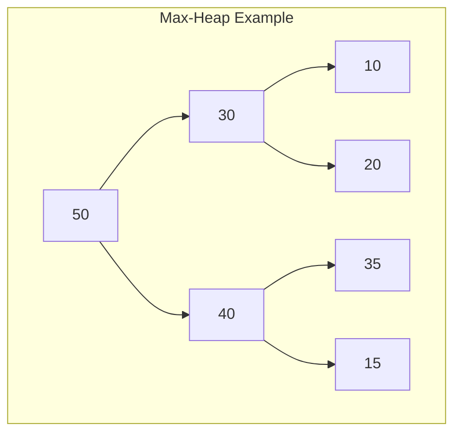

# Heap

A **heap** is a specialized binary tree-based data structure that satisfies the heap property. In a **max-heap**, for any given node, the value of the parent is greater than or equal to the value of the children. In a **min-heap**, the value of the parent is less than or equal to the value of the children. Heaps are widely used in **priority queues** and algorithms like heapsort, and they form the backbone of efficient graph algorithms like Dijkstra's shortest path and Prim's minimum spanning tree.

---

## Quick Reference

- **Insert**: O(log n) — add at end, bubble up
- **Peek (get min/max)**: O(1) — root element
- **Poll (remove min/max)**: O(log n) — remove root, bubble down
- **Heapify (build from array)**: O(n) — bottom-up construction
- **Remove arbitrary element**: O(log n) with index tracking
- **Java min-heap**: `new PriorityQueue<>()`
- **Java max-heap**: `new PriorityQueue<>(Collections.reverseOrder())`
- **Parent index**: `(i - 1) / 2`
- **Left child index**: `2 * i + 1`
- **Right child index**: `2 * i + 2`
- **Array representation**: complete binary tree stored level-by-level in array
- **Height**: O(log n) for n elements

---

## When to Use

Heaps are the right choice when you need efficient access to the minimum or maximum element while supporting dynamic insertions and deletions. They provide a middle ground between sorted arrays (expensive inserts) and unsorted arrays (expensive min/max queries).

**Choose heaps when:**
- You need to repeatedly extract the minimum or maximum element (priority queues)
- You need the top-k elements from a stream of data
- You are implementing graph algorithms (Dijkstra's, Prim's, A*)
- You need to merge k sorted lists efficiently
- You need a scheduling system with priorities (task schedulers, event-driven systems)

**Avoid heaps when:**
- You need to search for arbitrary elements (use hash maps or BSTs)
- You need sorted iteration over all elements (use TreeSet or sorted arrays)
- You need O(1) access by index (use arrays)
- The collection is small enough that linear scan is acceptable

---

## Key Features of Heaps

1. **Binary Tree Structure**: A heap is a complete binary tree where every level, except possibly the last, is completely filled, and all nodes are as far left as possible.
2. **Heap Property**: In a max-heap, the parent node's value is greater than or equal to its children, while in a min-heap, the parent node's value is less than or equal to its children.
3. **Efficient Access**: The root element (the maximum in a max-heap or the minimum in a min-heap) can be accessed in constant time.
4. **Dynamic Structure**: Heaps can grow or shrink dynamically with insertions and deletions.

---

## Heap Structure



---

## Code Examples

### Declaring and Initializing Heaps in Java

In Java, the **PriorityQueue** class implements a min-heap by default. For a max-heap, a custom comparator can be used.

### Examples:

```java
// Min-Heap using PriorityQueue
PriorityQueue<Integer> minHeap = new PriorityQueue<>();

// Max-Heap using PriorityQueue with a custom comparator
PriorityQueue<Integer> maxHeap = new PriorityQueue<>(Collections.reverseOrder());
```

### Inserting Elements into the Heap:

```java
minHeap.add(10);
minHeap.add(20);
minHeap.add(5);
System.out.println(minHeap.peek());  // Output: 5 (min element in min-heap)

maxHeap.add(10);
maxHeap.add(20);
maxHeap.add(5);
System.out.println(maxHeap.peek());  // Output: 20 (max element in max-heap)
```

---

## Heap Operations

1. **Insertion**: Adds a new element while maintaining the heap property.
2. **Peek**: Retrieves, but does not remove, the root element (maximum for max-heap, minimum for min-heap).
3. **Poll**: Retrieves and removes the root element.
4. **Heapify**: Converts an unsorted array into a heap.
5. **Remove**: Removes a specific element while maintaining the heap property.

### Example: Insertion and Polling

```java
PriorityQueue<Integer> heap = new PriorityQueue<>();
heap.add(10);
heap.add(15);
heap.add(5);

System.out.println(heap.poll());  // Output: 5 (min element removed)
System.out.println(heap.poll());  // Output: 10
```

---

## Real-World Applications of Heaps

1. **Priority Queues**: Heaps are the underlying data structure for priority queues, allowing efficient retrieval of the highest (or lowest) priority element.
2. **Heap Sort**: A comparison-based sorting algorithm that uses a binary heap to sort elements.
3. **Graph Algorithms**:
    - **Dijkstra's Algorithm**: For finding the shortest path in a weighted graph.
    - **Prim's Algorithm**: For finding the minimum spanning tree.
4. **Task Scheduling**: Used in operating systems for scheduling jobs by priority.
5. **Memory Management**: Heaps are used to allocate memory dynamically in systems.

---

## Key Points About Heaps in Java

1. **PriorityQueue Class**: Java's PriorityQueue implements a min-heap by default. It can be customized to act as a max-heap.
2. **Heapify Operation**: Java's PriorityQueue does not have a direct heapify method, but you can heapify an array by adding all its elements into a PriorityQueue.
3. **Time Complexity**: Heap operations such as insertion, deletion, and polling have logarithmic time complexity due to the height of the heap being proportional to the logarithm of the number of elements.

---

## Advantages of Heaps

1. **Efficient Root Element Access**: The root element (min or max) can be accessed in constant time.
2. **Efficient Insertion and Deletion**: Insertion and deletion operations maintain the heap property and run in logarithmic time.
3. **Dynamic Size**: Heaps can grow and shrink dynamically, unlike arrays.

---

## Limitations of Heaps

1. **No Direct Access to Arbitrary Elements**: Unlike arrays, elements in a heap cannot be accessed directly by index without losing the heap property.
2. **Non-Sequential Data**: A heap is not useful for scenarios where you need to traverse the data in a specific order (like a sorted array).
3. **Complexity in Implementation**: Maintaining the heap property during insertion and deletion adds complexity compared to simpler data structures.

---

## Operations on Heaps with Time Complexity

| **Operation** | **Description** | **Time Complexity** |
| --- | --- | --- |
| **Insert** | Adds a new element while maintaining the heap property. | O(log n) |
| **Peek (Get Min/Max)** | Retrieves the root element without removing it. | O(1) |
| **Poll (Remove Min/Max)** | Removes the root element and heapifies the structure. | O(log n) |
| **Heapify** | Converts an unsorted array into a heap. | O(n) |
| **Remove** | Removes a specific element and maintains the heap property. | O(log n) |
| **Traversal** | Iterates through all elements in the heap. | O(n) |

---

## Heap Sort Algorithm

Heap sort is a comparison-based sorting algorithm that leverages the heap structure. It works by building a max-heap and repeatedly removing the root (the maximum element) and placing it at the end of the array.

### Steps:

1. Build a max-heap from the array.
2. Swap the root (largest element) with the last element in the array.
3. Reduce the size of the heap and heapify the root.
4. Repeat until all elements are sorted.

### Example:

```java
public void heapSort(int[] arr) {
    int n = arr.length;

    // Build max heap
    for (int i = n / 2 - 1; i >= 0; i--) {
        heapify(arr, n, i);
    }

    // Extract elements from heap one by one
    for (int i = n - 1; i > 0; i--) {
        // Move current root to end
        int temp = arr[0];
        arr[0] = arr[i];
        arr[i] = temp;

        // Heapify the reduced heap
        heapify(arr, i, 0);
    }
}

void heapify(int[] arr, int n, int i) {
    int largest = i;
    int left = 2 * i + 1;
    int right = 2 * i + 2;

    if (left < n && arr[left] > arr[largest]) {
        largest = left;
    }

    if (right < n && arr[right] > arr[largest]) {
        largest = right;
    }

    if (largest != i) {
        int swap = arr[i];
        arr[i] = arr[largest];
        arr[largest] = swap;

        heapify(arr, n, largest);
    }
}
```

### Time Complexity of Heap Sort:

- **Building the heap**: O(n)
- **Heapify after removing root**: O(log n) for each element, resulting in O(n log n) overall.

---

## Common Pitfalls

1. **Assuming PriorityQueue is a max-heap**: Java's PriorityQueue is a min-heap by default. To get a max-heap, you must pass `Collections.reverseOrder()` or a custom comparator. This is a frequent source of bugs in interview solutions.

2. **Modifying elements after insertion**: If you change the priority of an element already in the heap, the heap property is violated. PriorityQueue does not automatically re-heapify. You must remove and re-insert the element, or use an indexed priority queue that supports decrease-key operations.

3. **Using PriorityQueue for sorted iteration**: Iterating over a PriorityQueue with a for-each loop does NOT return elements in sorted order. Only `poll()` guarantees order. The internal array representation is a heap, not a sorted array.

4. **Forgetting that heapify is O(n), not O(n log n)**: Building a heap from an unsorted array using bottom-up heapify is O(n), not O(n log n). Many developers incorrectly assume it requires n insertions at O(log n) each. The bottom-up approach is more efficient because most nodes are near the leaves.

5. **Stack overflow with recursive heapify on large arrays**: For very large arrays, recursive sift-down can overflow the stack. Use iterative implementations in production code.

6. **Not considering thread safety**: Java's PriorityQueue is not thread-safe. In concurrent environments, use `PriorityBlockingQueue` or synchronize access externally.

---

## Interview Questions

**Q1: How would you find the kth largest element in a stream of numbers?**
Maintain a min-heap of size k. For each new number, if it is larger than the heap's root, remove the root and insert the new number. The root always holds the kth largest element. This provides O(log k) per insertion and O(1) to query the kth largest.

**Q2: How do you merge k sorted arrays efficiently?**
Use a min-heap of size k, initially containing the first element from each array along with its array index and position. Repeatedly extract the minimum, add it to the result, and insert the next element from the same array. Time complexity is O(n log k) where n is the total number of elements.

**Q3: What is the difference between a heap and a binary search tree?**
A heap only guarantees that the parent is greater (or smaller) than its children, not that left < parent < right. This means heaps cannot efficiently search for arbitrary elements (O(n) vs. O(log n) in BST). However, heaps guarantee O(1) access to the min/max and are simpler to implement using arrays.

**Q4: Can you implement a heap that supports O(log n) decrease-key?**
Yes, using an indexed priority queue that maintains a position map from elements to their array indices. When a key decreases, look up its position in O(1) and bubble it up in O(log n). This is essential for efficient Dijkstra's algorithm implementation.

**Q5: Why is building a heap O(n) instead of O(n log n)?**
Bottom-up heapify starts from the last non-leaf node and sifts down. Nodes at depth d require at most (h - d) swaps where h is the height. Since most nodes are near the bottom (where they need few swaps), the total work sums to O(n) by geometric series analysis.

---

## Production Tips

1. **Use PriorityBlockingQueue for concurrent producers/consumers**: In multi-threaded systems like task schedulers or event processing pipelines, PriorityBlockingQueue provides thread-safe priority queue operations with blocking semantics, eliminating the need for external synchronization.

2. **Consider specialized heap variants for specific workloads**: Fibonacci heaps provide O(1) amortized decrease-key (important for Dijkstra's on dense graphs). Pairing heaps offer simpler implementation with good practical performance. D-ary heaps (d > 2) can improve cache performance for large heaps.

3. **Pre-size your PriorityQueue**: If you know the approximate number of elements, pass the initial capacity to the constructor to avoid repeated array resizing. This reduces garbage collection pressure in high-throughput systems.

4. **Use heaps for streaming top-k problems**: When processing large data streams where you cannot store all elements in memory, a heap of size k gives you the top-k elements using only O(k) space. This pattern is common in log analysis, metrics aggregation, and recommendation systems.

5. **Monitor heap size in production priority queues**: Unbounded priority queues can grow indefinitely if consumption is slower than production. Set capacity limits and implement backpressure or overflow strategies to prevent out-of-memory conditions.

---

## Related Topics

- [Array Fundamentals](../arrays-and-strings/array-fundamentals.md) — Heaps are implemented using arrays with index-based parent-child relationships
- [Binary Trees and BSTs](../trees-and-graphs/binary-trees-and-bsts.md) — Heaps are complete binary trees with the heap ordering property
- [Queue](./queue.md) — Priority queues are the primary application of heap data structures
- [Graph Representations and Traversal](../trees-and-graphs/graph-representations-and-traversal.md) — Dijkstra's and Prim's algorithms use heaps for efficient vertex selection
- [Big O Notation](./big-o-notation.md) — Understanding logarithmic complexity of heap operations
