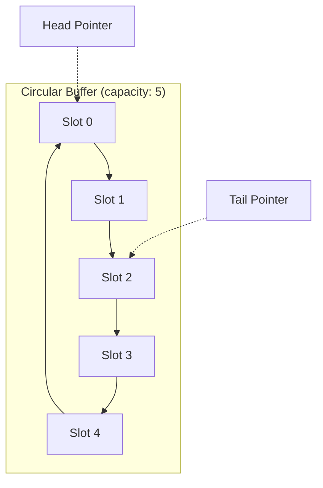

# Ring Buffer

A **ring buffer** (also known as a circular buffer) is a fixed-size data structure that uses a single, continuous block of memory to store elements in a circular manner. When the buffer reaches its end, new data wraps around to the beginning, overwriting old data if necessary. Ring buffers are widely used in scenarios requiring efficient FIFO (First-In, First-Out) data handling, such as streaming, real-time processing, and embedded systems. They are the foundation of high-performance I/O systems, network packet buffers, and lock-free concurrent data structures.

---

## Quick Reference

- **Enqueue**: O(1) — write at tail, advance tail pointer
- **Dequeue**: O(1) — read at head, advance head pointer
- **Peek**: O(1) — read at head without advancing
- **IsFull check**: O(1) — `(tail + 1) % capacity == head` or size == capacity
- **IsEmpty check**: O(1) — head == tail or size == 0
- **Space**: O(n) fixed allocation, no dynamic resizing
- **Wrap-around formula**: `index = (index + 1) % capacity`
- **Java equivalent**: `ArrayDeque` (resizable), custom implementation for fixed-size
- **Overwrite policy**: configurable (overwrite oldest vs. reject new)
- **Memory layout**: contiguous array, cache-friendly sequential access
- **Thread-safe variant**: single-producer single-consumer (SPSC) requires no locks

---

## When to Use

Ring buffers are the right choice when you need a fixed-size FIFO buffer with guaranteed O(1) operations and no memory allocation during operation. They excel in real-time systems where predictable latency is more important than unbounded capacity.

**Choose ring buffers when:**
- You need bounded memory usage with predictable allocation
- You are building producer-consumer pipelines with fixed buffer sizes
- You need lock-free single-producer single-consumer (SPSC) communication
- You are working in embedded systems with limited memory
- You need to buffer streaming data (audio, video, network packets)
- You want to avoid garbage collection pauses (no object allocation per operation)

**Avoid ring buffers when:**
- You need unbounded growth (use ArrayList or LinkedList)
- You need random access by index (use arrays)
- Multiple producers or consumers need concurrent access (use ConcurrentLinkedQueue or Disruptor)
- You need to search for elements (use HashMap or TreeSet)

---

## Key Features of Ring Buffers

1. **Fixed Size**: A ring buffer has a predefined capacity and cannot grow dynamically.
2. **Circular Structure**: When the buffer reaches its end, it wraps around to the beginning, making efficient use of memory.
3. **Efficient FIFO Operations**: Supports fast insertions and deletions in constant time, making it ideal for queue-based applications.
4. **Overwrite Behavior**: Depending on the implementation, new data may overwrite old data when the buffer is full.
5. **Uses Two Pointers**: Typically implemented using a `head` (front of the buffer) and a `tail` (end of the buffer) pointer to track data insertion and removal.

---

## Ring Buffer Structure



---

## Implementing a Ring Buffer in Java

A ring buffer can be implemented using an array and two pointers (`head` and `tail`) to track the front and rear positions.

### Example Implementation:

```java
class RingBuffer {
    private int[] buffer;
    private int head = 0;
    private int tail = 0;
    private int size = 0;
    private int capacity;

    public RingBuffer(int capacity) {
        this.capacity = capacity;
        this.buffer = new int[capacity];
    }

    public void enqueue(int value) {
        if (size == capacity) {
            System.out.println("Buffer is full. Overwriting oldest element.");
            head = (head + 1) % capacity;
            size--;
        }
        buffer[tail] = value;
        tail = (tail + 1) % capacity;
        size++;
    }

    public int dequeue() {
        if (size == 0) {
            throw new RuntimeException("Buffer is empty!");
        }
        int value = buffer[head];
        head = (head + 1) % capacity;
        size--;
        return value;
    }

    public boolean isEmpty() {
        return size == 0;
    }

    public boolean isFull() {
        return size == capacity;
    }

    public void printBuffer() {
        System.out.print("Buffer: ");
        for (int i = 0; i < size; i++) {
            System.out.print(buffer[(head + i) % capacity] + " ");
        }
        System.out.println();
    }
}
```

### Example Usage:

```java
public class Main {
    public static void main(String[] args) {
        RingBuffer rb = new RingBuffer(3);

        rb.enqueue(10);
        rb.enqueue(20);
        rb.enqueue(30);
        rb.printBuffer();  // Output: Buffer: 10 20 30

        rb.enqueue(40);  // Overwrites oldest element (10)
        rb.printBuffer();  // Output: Buffer: 20 30 40

        System.out.println("Dequeued: " + rb.dequeue());  // Output: Dequeued: 20
        rb.printBuffer();  // Output: Buffer: 30 40
    }
}
```

---

## Real-World Applications of Ring Buffers

1. **Streaming and Audio Processing**: Used in audio processing to store audio samples in a fixed-size buffer for real-time playback.
2. **Embedded Systems**: Common in microcontroller applications where memory constraints require efficient data structures.
3. **Networking**: Used in packet buffering for network communication.
4. **Logging Systems**: Helps store logs efficiently without consuming excessive memory.
5. **Concurrency Control**: Used in multi-threaded applications where a producer-consumer model is needed.

---

## Key Points About Ring Buffers in Java

1. **Efficient Memory Utilization**: Since it reuses a fixed array, no dynamic memory allocations occur during runtime.
2. **Constant Time Operations**: Insertions and deletions are performed in O(1) time.
3. **Avoids Fragmentation**: Unlike linked lists, ring buffers avoid memory fragmentation since elements are stored contiguously.
4. **Overwriting Mechanism**: Can be implemented to overwrite old data when full or reject new data.

---

## Advantages of Ring Buffers

1. **Fast Insertions and Deletions**: Unlike arrays that require shifting elements, a ring buffer maintains constant-time operations.
2. **Fixed Memory Footprint**: Useful in constrained environments where memory efficiency is important.
3. **Efficient Circular Handling**: Automatically wraps around when reaching the end, reducing memory wastage.

---

## Limitations of Ring Buffers

1. **Fixed Capacity**: Cannot dynamically grow; once full, old data is overwritten or new data is rejected.
2. **Complex Implementation**: Requires careful handling of pointer movements to avoid buffer corruption.
3. **Sequential Access**: Unlike random-access structures, accessing arbitrary elements is not straightforward.

---

## Operations on Ring Buffers with Time Complexity

| **Operation** | **Description** | **Time Complexity** |
| --- | --- | --- |
| **Enqueue** | Inserts an element at the `tail` and updates pointers. | O(1) |
| **Dequeue** | Removes the element at the `head` and updates pointers. | O(1) |
| **Peek** | Retrieves the element at the `head` without removing it. | O(1) |
| **IsEmpty** | Checks if the buffer is empty. | O(1) |
| **IsFull** | Checks if the buffer is full. | O(1) |
| **Print Buffer** | Iterates through the elements for display. | O(n) |

---

## Comparison with Other Data Structures

| **Feature** | **Ring Buffer** | **Array** | **Queue (LinkedList)** |
| --- | --- | --- | --- |
| **Memory Usage** | Fixed, efficient | Fixed, may waste space | Extra space for pointers |
| **Access Time** | FIFO, sequential | Random access O(1) | FIFO, sequential |
| **Insertion Time** | O(1) | O(1) at end, O(n) at start/mid | O(1) at end |
| **Deletion Time** | O(1) | O(n) (requires shifting) | O(1) at front |

---

## Summary

- A **ring buffer** is a circular queue that efficiently handles FIFO operations in O(1) time.
- It uses a **fixed-size array** with `head` and `tail` pointers to track elements.
- Commonly used in **streaming**, **networking**, **embedded systems**, and **real-time applications**.
- **Advantages** include constant-time operations, efficient memory utilization, and automatic circular wrapping.
- **Limitations** include fixed capacity and complexity in managing circular indexing.

---

## Code Examples

### Generic Ring Buffer with Overwrite Policy

A production-quality ring buffer that supports configurable behavior when full: either overwrite the oldest element or reject the new one.

```java
public class RingBuffer<T> {
    private final Object[] buffer;
    private int head = 0;
    private int tail = 0;
    private int size = 0;
    private final int capacity;
    private final boolean overwriteOnFull;

    public RingBuffer(int capacity, boolean overwriteOnFull) {
        this.capacity = capacity;
        this.buffer = new Object[capacity];
        this.overwriteOnFull = overwriteOnFull;
    }

    public boolean offer(T element) {
        if (size == capacity) {
            if (!overwriteOnFull) return false;
            head = (head + 1) % capacity;  // Drop oldest
            size--;
        }
        buffer[tail] = element;
        tail = (tail + 1) % capacity;
        size++;
        return true;
    }

    @SuppressWarnings("unchecked")
    public T poll() {
        if (size == 0) return null;
        T element = (T) buffer[head];
        buffer[head] = null;  // Help GC
        head = (head + 1) % capacity;
        size--;
        return element;
    }

    public int size() { return size; }
    public boolean isEmpty() { return size == 0; }
    public boolean isFull() { return size == capacity; }
}
```

### Lock-Free SPSC Ring Buffer

A single-producer single-consumer ring buffer using volatile variables for thread-safe communication without locks. This pattern is used in high-performance messaging systems.

```java
public class SPSCRingBuffer<T> {
    private final Object[] buffer;
    private final int capacity;
    private volatile long head = 0;  // Consumer reads from here
    private volatile long tail = 0;  // Producer writes here

    public SPSCRingBuffer(int capacity) {
        this.capacity = capacity;
        this.buffer = new Object[capacity];
    }

    // Called by producer thread only
    public boolean offer(T element) {
        long currentTail = tail;
        if (currentTail - head >= capacity) return false;  // Full
        buffer[(int)(currentTail % capacity)] = element;
        tail = currentTail + 1;  // Volatile write publishes the element
        return true;
    }

    // Called by consumer thread only
    @SuppressWarnings("unchecked")
    public T poll() {
        long currentHead = head;
        if (currentHead >= tail) return null;  // Empty
        T element = (T) buffer[(int)(currentHead % capacity)];
        head = currentHead + 1;  // Volatile write releases the slot
        return element;
    }
}
```

---

## Common Pitfalls

1. **Off-by-one in full/empty detection**: The most common ring buffer bug is confusing full and empty states. When head == tail, the buffer could be either full or empty. Solutions: track size separately, waste one slot (full when `(tail + 1) % capacity == head`), or use a boolean flag.

2. **Not handling the wrap-around correctly**: Forgetting modulo arithmetic when advancing pointers causes array index out of bounds. Always use `(index + 1) % capacity` for pointer advancement.

3. **Memory visibility in multi-threaded usage**: Without proper synchronization (volatile, locks, or memory barriers), writes by the producer may not be visible to the consumer. In SPSC buffers, the tail write must use volatile or a store-release barrier to publish the written element.

4. **Power-of-two optimization assumption**: Many optimized ring buffers use bitwise AND (`index & (capacity - 1)`) instead of modulo for wrap-around, which only works when capacity is a power of two. Using this optimization with non-power-of-two sizes causes subtle corruption.

5. **Not nulling references after dequeue**: In garbage-collected languages, failing to null out dequeued slots prevents the GC from collecting the objects, causing memory leaks in long-running buffers.

6. **Assuming thread safety from a single volatile**: A single volatile variable does not make the entire ring buffer thread-safe for multiple producers or consumers. SPSC is safe with volatiles; MPMC requires CAS operations or locks.

---

## Interview Questions

**Q1: How does a ring buffer differ from a regular queue backed by an array?**
A regular array-backed queue either wastes space (elements pile up at the end) or requires O(n) shifting. A ring buffer reuses freed space by wrapping pointers around, maintaining O(1) operations without wasted space or shifting. The trade-off is fixed capacity.

**Q2: How would you implement a ring buffer that supports multiple producers and multiple consumers?**
Use compare-and-swap (CAS) operations on head and tail indices. Each producer atomically claims a slot by CAS-incrementing tail, writes the element, then marks the slot as ready. Each consumer atomically claims a slot by CAS-incrementing head, waits for the slot to be ready, then reads. This is the approach used by the LMAX Disruptor.

**Q3: Why are ring buffers preferred in real-time systems over dynamic data structures?**
Ring buffers have deterministic O(1) operations with no memory allocation or deallocation during operation. Dynamic structures (ArrayList, LinkedList) may trigger garbage collection pauses or memory allocation delays, which violate real-time latency guarantees.

**Q4: How do you handle the case where a ring buffer is full?**
Three strategies: (1) Block the producer until space is available (blocking queue semantics), (2) Overwrite the oldest element (lossy buffer, common in logging), (3) Reject the new element and return failure (backpressure signal). The choice depends on whether data loss is acceptable.

---

## Production Tips

1. **Use power-of-two capacity for performance**: When capacity is a power of two, the modulo operation `index % capacity` can be replaced with bitwise AND `index & (capacity - 1)`, which is significantly faster on modern CPUs. Most high-performance ring buffer implementations enforce this constraint.

2. **Pad to avoid false sharing in concurrent buffers**: In multi-threaded ring buffers, head and tail variables accessed by different threads should be padded to separate cache lines (64 bytes on x86). False sharing occurs when both variables share a cache line, causing unnecessary cache invalidation between cores.

3. **Use ring buffers for logging in latency-sensitive paths**: Instead of writing logs synchronously (which may block on I/O), write log entries to a ring buffer and have a background thread drain them to disk. This bounds the latency impact of logging to a single array write.

4. **Consider memory-mapped ring buffers for IPC**: For inter-process communication, a ring buffer backed by a memory-mapped file allows zero-copy data transfer between processes. This is used in high-frequency trading systems and kernel bypass networking.

5. **Monitor buffer utilization as a capacity planning metric**: Track the high-water mark of buffer occupancy. If the buffer frequently reaches capacity, you need either a larger buffer, faster consumers, or backpressure mechanisms to prevent data loss.

---

## Related Topics

- [Queue](./queue.md) — Ring buffers implement queue semantics with fixed-size circular storage
- [Array](./array.md) — Ring buffers use arrays as their underlying storage mechanism
- [Linked Lists](./linked-lists.md) — ArrayDeque is Java's resizable ring buffer implementation
- [Heap](./heap.md) — Both use array-based storage with index arithmetic for structure
- [Big O Notation](./big-o-notation.md) — Ring buffer operations demonstrate true O(1) worst-case complexity
