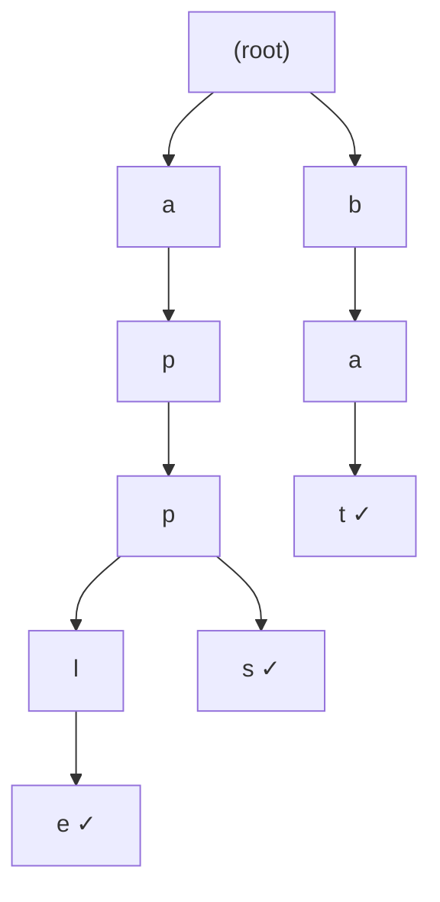

# Trie

A **Trie** (pronounced "try"), also known as a **prefix tree**, is a tree-based data structure that stores a dynamic set of strings, commonly used for searching words and prefixes efficiently. Each node represents a character, and words are stored by linking characters together from the root to leaf nodes. Tries are the backbone of autocomplete systems, spell checkers, IP routing tables, and any application requiring fast prefix-based lookups.

---

## Quick Reference

- **Insert word**: O(m) where m is word length
- **Search word**: O(m) exact match lookup
- **Prefix search**: O(m) check if any word starts with prefix
- **Delete word**: O(m) with recursive cleanup of unused nodes
- **Space**: O(ALPHABET_SIZE × m × n) worst case for n words of length m
- **Alphabet size**: typically 26 (lowercase English) or 128 (ASCII)
- **Node structure**: array/map of children + end-of-word flag
- **Compressed trie (Radix tree)**: stores common prefixes as single edges
- **No hash collisions**: unlike HashMap, lookup time is deterministic
- **Lexicographic ordering**: DFS traversal yields words in sorted order
- **Wildcard search**: O(ALPHABET_SIZE^k × m) for k wildcards

---

## When to Use

Tries are the right choice when you need fast prefix-based operations on a collection of strings. They outperform hash maps for prefix queries and provide natural lexicographic ordering.

**Choose tries when:**
- You need autocomplete or typeahead suggestions
- You need to find all words with a given prefix
- You are implementing a spell checker or dictionary
- You need longest prefix matching (IP routing, URL routing)
- You need lexicographic sorting of strings
- You need word frequency counting with prefix aggregation

**Avoid tries when:**
- You only need exact string lookup (HashMap is simpler and often faster)
- Memory is severely constrained (tries use more memory than hash maps for short strings)
- Your alphabet is very large (Unicode) without compression
- You have very few strings (linear scan or HashSet is simpler)

---

## Key Features of Tries

1. **Efficient Prefix Searching**: Tries allow for quick lookups of words and prefixes, making them ideal for autocomplete and dictionary applications.
2. **Hierarchical Character Storage**: Unlike hash maps or arrays, tries store characters in a tree structure, reducing redundancy.
3. **Supports Various Operations**: Tries efficiently handle operations like searching, insertion, deletion, and prefix matching.
4. **No Collisions**: Unlike hash tables, tries do not suffer from collisions, making lookup times more predictable.
5. **Memory Usage**: Tries can consume more memory due to pointers at each node but optimize storage for shared prefixes.

---

## Trie Structure



The diagram above shows a trie containing the words "apple", "apps", and "bat". The ✓ symbol marks end-of-word nodes.

---

## Implementing a Trie in Java

A Trie consists of:

- A **root node** (starting point of all words).
- **Child nodes** representing characters.
- A **boolean flag** at the end of a word to mark completion.

### TrieNode Class:

```java
class TrieNode {
    TrieNode[] children = new TrieNode[26];  // Assuming lowercase English letters (a-z)
    boolean isEndOfWord = false;
}
```

### Trie Class with Insert, Search, and Prefix Matching:

```java
class Trie {
    private TrieNode root;

    public Trie() {
        root = new TrieNode();
    }

    public void insert(String word) {
        TrieNode node = root;
        for (char ch : word.toCharArray()) {
            int index = ch - 'a';
            if (node.children[index] == null) {
                node.children[index] = new TrieNode();
            }
            node = node.children[index];
        }
        node.isEndOfWord = true;
    }

    public boolean search(String word) {
        TrieNode node = root;
        for (char ch : word.toCharArray()) {
            int index = ch - 'a';
            if (node.children[index] == null) {
                return false;
            }
            node = node.children[index];
        }
        return node.isEndOfWord;
    }

    public boolean startsWith(String prefix) {
        TrieNode node = root;
        for (char ch : prefix.toCharArray()) {
            int index = ch - 'a';
            if (node.children[index] == null) {
                return false;
            }
            node = node.children[index];
        }
        return true;
    }
}
```

### Example Usage:

```java
public class Main {
    public static void main(String[] args) {
        Trie trie = new Trie();

        trie.insert("apple");
        trie.insert("app");

        System.out.println(trie.search("apple"));   // Output: true
        System.out.println(trie.search("app"));     // Output: true
        System.out.println(trie.search("appl"));    // Output: false
        System.out.println(trie.startsWith("appl"));// Output: true
    }
}
```

---

## Real-World Applications of Tries

1. **Autocomplete & Spell Checking**: Used in search engines, messaging apps, and text editors for predictive text.
2. **Dictionary & Lexicographical Sorting**: Helps store and retrieve words efficiently.
3. **IP Routing**: Used in networking to store IP addresses hierarchically.
4. **DNA Sequence Matching**: Efficiently finds genetic sequences in biological data.
5. **Compression Algorithms**: Utilized in data compression techniques like T9 predictive texting.

---

## Key Points About Tries in Java

1. **Trie Nodes Store Characters**: Each node represents a single character in a word.
2. **Supports Fast Lookup**: Can check if a word or prefix exists in O(m) time, where m is the word length.
3. **Memory-Intensive**: Uses extra space for child node pointers, leading to higher memory consumption compared to hash maps.
4. **No Collisions**: Unlike hash maps, tries do not have hash collisions, ensuring consistent performance.

---

## Advantages of Tries

1. **Fast Lookups**: Searching for words and prefixes takes O(m) time.
2. **No Collisions**: Unlike hash maps, tries avoid key collisions.
3. **Efficient Prefix Matching**: Ideal for autocomplete and dictionary applications.
4. **Space Optimization**: Common prefixes are stored once, reducing redundancy.

---

## Limitations of Tries

1. **High Memory Usage**: Requires extra storage for child node pointers.
2. **Inefficient for Short Strings**: If strings are short, a hash table may be more space-efficient.
3. **Slower than Hash Tables for Exact Matches**: Hash maps provide O(1) lookups, while tries take O(m).

---

## Operations on Tries with Time Complexity

| **Operation** | **Description** | **Time Complexity** |
| --- | --- | --- |
| **Insert** | Add a word character by character. | O(m) |
| **Search** | Find if a word exists in the trie. | O(m) |
| **Prefix Matching** | Check if a prefix exists. | O(m) |
| **Delete** | Remove a word (may require recursive traversal). | O(m) |

---

## Comparison with Other Data Structures

| **Feature** | **Trie** | **HashMap** | **Array** |
| --- | --- | --- | --- |
| **Memory Usage** | Higher (due to pointers) | Lower (but requires hashing) | Fixed, efficient |
| **Prefix Lookup** | O(m) | O(m) (with extra processing) | Not efficient |
| **Insertion** | O(m) | O(1) | O(1) at end, O(n) at start |
| **Search** | O(m) | O(1) for exact match | O(n) |

---

## Summary

- A **Trie** is a tree-based data structure used for storing words efficiently.
- It supports O(m) time complexity for searching, inserting, and prefix matching.
- Commonly used in **autocomplete, dictionaries, spell checking, and network routing**.
- **Advantages** include fast prefix lookups and no hash collisions.
- **Limitations** include high memory usage and slower exact lookups compared to hash tables.

---

## Code Examples

### Trie with Delete Operation

Deletion in a trie requires careful cleanup of nodes that are no longer part of any word, using recursive backtracking.

```java
public class TrieWithDelete {
    private TrieNode root = new TrieNode();

    public void delete(String word) {
        delete(root, word, 0);
    }

    private boolean delete(TrieNode node, String word, int depth) {
        if (depth == word.length()) {
            if (!node.isEndOfWord) return false;  // Word doesn't exist
            node.isEndOfWord = false;
            return isEmpty(node);  // Can delete node if no children
        }
        int index = word.charAt(depth) - 'a';
        if (node.children[index] == null) return false;

        boolean shouldDeleteChild = delete(node.children[index], word, depth + 1);
        if (shouldDeleteChild) {
            node.children[index] = null;
            return !node.isEndOfWord && isEmpty(node);
        }
        return false;
    }

    private boolean isEmpty(TrieNode node) {
        for (TrieNode child : node.children) {
            if (child != null) return false;
        }
        return true;
    }
}
```

### Autocomplete with Trie (Find All Words with Prefix)

Returns all words in the trie that start with a given prefix, useful for search suggestions and typeahead.

```java
public List<String> autocomplete(String prefix) {
    List<String> results = new ArrayList<>();
    TrieNode node = root;

    // Navigate to the prefix node
    for (char c : prefix.toCharArray()) {
        int index = c - 'a';
        if (node.children[index] == null) return results;
        node = node.children[index];
    }

    // DFS to find all words from this node
    collectWords(node, new StringBuilder(prefix), results);
    return results;
}

private void collectWords(TrieNode node, StringBuilder current, List<String> results) {
    if (node.isEndOfWord) results.add(current.toString());
    for (int i = 0; i < 26; i++) {
        if (node.children[i] != null) {
            current.append((char)('a' + i));
            collectWords(node.children[i], current, results);
            current.deleteCharAt(current.length() - 1);
        }
    }
}
```

### Word Search with Wildcards

Supports '.' as a wildcard matching any single character, commonly used in word games and pattern matching.

```java
public boolean searchWithWildcard(String pattern) {
    return searchWildcard(root, pattern, 0);
}

private boolean searchWildcard(TrieNode node, String pattern, int index) {
    if (index == pattern.length()) return node.isEndOfWord;

    char c = pattern.charAt(index);
    if (c == '.') {
        // Try all possible children
        for (int i = 0; i < 26; i++) {
            if (node.children[i] != null &&
                searchWildcard(node.children[i], pattern, index + 1)) {
                return true;
            }
        }
        return false;
    } else {
        int childIndex = c - 'a';
        if (node.children[childIndex] == null) return false;
        return searchWildcard(node.children[childIndex], pattern, index + 1);
    }
}
```

---

## Common Pitfalls

1. **Excessive memory usage with sparse tries**: A standard trie with 26-element arrays at each node wastes memory when most children are null. For sparse tries (few words, long words), use HashMap-based children or compressed tries (radix trees) to reduce memory by 10-50x.

2. **Not handling case sensitivity**: Tries built with `char - 'a'` only work for lowercase letters. Mixed-case input causes ArrayIndexOutOfBoundsException. Normalize input (toLowerCase) before insertion and search, or use a larger alphabet array.

3. **Memory leaks from incomplete deletion**: Simply unsetting `isEndOfWord` without cleaning up unused nodes leaves dead branches in the trie, wasting memory. Always recursively remove nodes that have no children and are not end-of-word markers.

4. **Forgetting that prefix search and word search are different**: `startsWith("app")` returns true if any word begins with "app", while `search("app")` returns true only if "app" itself was inserted. The difference is checking `isEndOfWord` at the final node.

5. **Stack overflow on very long strings**: Recursive trie operations on strings with thousands of characters can overflow the call stack. Use iterative implementations for production systems handling arbitrary-length strings.

6. **Not considering Unicode**: Real-world text includes Unicode characters beyond ASCII. Using a fixed-size array of 26 or 128 fails for internationalized content. Use HashMap-based children for Unicode support.

---

## Interview Questions

**Q1: How would you implement autocomplete with ranking?**
Extend each trie node with a frequency counter or priority score. During autocomplete, collect all words with the given prefix and sort by frequency. For efficiency, maintain a pre-sorted list of top-k suggestions at each node (updated on insertion), providing O(m) autocomplete without post-collection sorting.

**Q2: What is the difference between a trie and a radix tree (compressed trie)?**
A radix tree compresses chains of single-child nodes into single edges labeled with multiple characters. For example, "application" and "apply" share the edge "appl" instead of four separate nodes. This reduces memory usage and improves cache performance while maintaining the same time complexity.

**Q3: How would you find the longest common prefix among a set of strings using a trie?**
Insert all strings into the trie. Starting from the root, follow the path as long as each node has exactly one child and is not an end-of-word marker. The path from root to the first branching point (or end-of-word) is the longest common prefix. Time: O(S) where S is the sum of all string lengths.

**Q4: How does a trie compare to a hash map for string operations?**
HashMap provides O(1) average exact lookup but cannot efficiently find all strings with a given prefix (requires scanning all keys). Trie provides O(m) lookup and O(m + k) prefix search (where k is the number of results). Trie also provides natural lexicographic ordering. HashMap is better for exact-match-only workloads.

**Q5: How would you implement a spell checker using a trie?**
Insert all dictionary words into a trie. For a misspelled word, generate candidates by: (1) deleting one character, (2) inserting one character, (3) replacing one character, (4) transposing adjacent characters. Check each candidate against the trie. For edit distance > 1, use BFS over the edit graph with the trie pruning invalid prefixes early.

---

## Production Tips

1. **Use compressed tries (Patricia/Radix trees) for production**: Standard tries waste memory on long strings with few shared prefixes. Radix trees compress single-child chains into multi-character edges, reducing node count by 50-80% in typical workloads. Libraries like Apache Commons and Guava provide production-ready implementations.

2. **Consider double-array tries for read-heavy workloads**: Double-array tries store the trie structure in two flat arrays, providing excellent cache performance and compact memory usage. They are ideal for static dictionaries (spell checkers, NLP models) where the word set doesn't change frequently.

3. **Use tries for IP routing (longest prefix match)**: Network routers use binary tries (one bit per level) to find the longest matching prefix for IP addresses. This determines which route to use for packet forwarding. Compressed variants (LC-trie) handle millions of routes efficiently.

4. **Implement concurrent tries with lock-free techniques**: For multi-threaded autocomplete systems, use Ctrie (concurrent trie) which provides lock-free operations using CAS on node references. This avoids the bottleneck of global locks on high-throughput search systems.

5. **Limit autocomplete results and use lazy evaluation**: In production autocomplete, don't collect all matching words. Use a bounded DFS that stops after finding k results, or maintain pre-computed top-k lists at frequently-accessed prefix nodes. This bounds response time regardless of how many words match.

---

## Related Topics

- [Tree](./tree.md) — Tries are specialized tree structures optimized for string operations
- [Hash Tables](./hash-tables.md) — HashMap provides O(1) exact lookup but cannot do prefix search
- [Sets](./sets.md) — TreeSet provides sorted string storage but O(log n) prefix operations
- [Graph](./graph.md) — Trie traversal uses DFS patterns similar to graph exploration
- [Big O Notation](./big-o-notation.md) — Trie operations are O(m) where m is string length, independent of collection size
