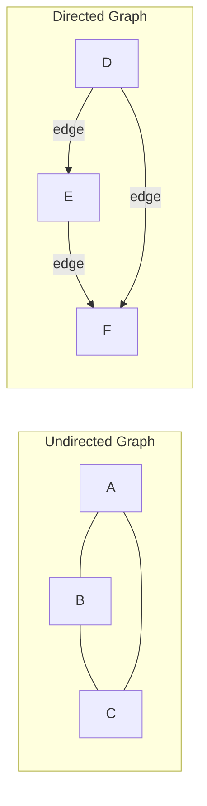
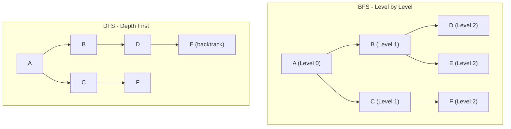

# Graph

A **graph** is a collection of **vertices (nodes)** and **edges** that connect pairs of vertices. Graphs are a powerful abstraction used in computer science to model relationships, networks, and structures such as social media connections, web pages, and transportation systems. They are one of the most versatile data structures, appearing in problems ranging from shortest path routing to dependency resolution and recommendation engines.

---

## Quick Reference

- **Vertices (V)**: The nodes or points in the graph
- **Edges (E)**: The connections between vertices
- **Adjacency Matrix space**: O(V²)
- **Adjacency List space**: O(V + E)
- **BFS/DFS time**: O(V + E)
- **Dijkstra's (min-heap)**: O((V + E) log V)
- **Bellman-Ford**: O(V × E)
- **Floyd-Warshall**: O(V³)
- **Topological Sort**: O(V + E)
- **Kruskal's MST**: O(E log E)
- **Prim's MST**: O((V + E) log V)
- **Cycle detection (directed)**: O(V + E) using DFS with coloring
- **Strongly Connected Components**: O(V + E) using Tarjan's or Kosaraju's

---

## When to Use

Graphs are the right data structure when your problem involves relationships between entities that are not strictly hierarchical. They model connections, dependencies, flows, and networks naturally.

**Choose graphs when:**
- You need to model relationships between entities (social networks, web links)
- You need shortest path computation (navigation, network routing)
- You need to detect cycles or dependencies (build systems, deadlock detection)
- You need to find connected components (network segmentation, clustering)
- You need to model flow or capacity (network bandwidth, supply chains)
- You need topological ordering (task scheduling, course prerequisites)

**Avoid graphs when:**
- Data is strictly hierarchical with single parents (use trees instead)
- You only need key-value lookups (use maps)
- Relationships are sequential (use lists or arrays)

---

## Types of Graphs



### Undirected Graph

- **Characteristics**: In an undirected graph, edges have no direction. If there is an edge between vertex A and vertex B, it is bidirectional, meaning you can traverse it in both directions (A to B and B to A).
- **Applications**:
    - **Social networks**: Friendships are typically mutual.
    - **Communication networks**: Two-way communication between nodes.

### Directed Graph (Digraph)

- **Characteristics**: In a directed graph, edges have a direction. If there is an edge from vertex A to vertex B, traversal can only happen from A to B, not the other way around.
- **Applications**:
    - **Web page links**: One page may link to another, but the reverse is not necessarily true.
    - **Flow networks**: Representing the direction of flow in systems like transportation, water, or electricity grids.

### Weighted Graph

- **Characteristics**: Edges in a weighted graph have weights that represent costs, distances, or other measurable quantities.
- **Applications**:
    - **Road networks**: Distances between intersections are represented as weights on the edges.
    - **Flight networks**: Flight times or costs between airports.

### Unweighted Graph

- **Characteristics**: Edges do not have weights, and connections are treated equally.
- **Applications**:
    - **Social network connections**: Connections between individuals without considering the strength of the connection.
    - **Simple connectivity problems**: Where only the presence of a connection matters.

---

## Graph Representations

### Adjacency Matrix

- **Structure**: A 2D array where each cell at row i and column j indicates the presence (and possibly the weight) of an edge between vertex i and vertex j.
- **Advantages**:
    - Simple to implement.
    - Quick edge lookup: O(1) time for checking if an edge exists between two vertices.
- **Disadvantages**:
    - Space inefficiency: Uses O(V²) space, even for sparse graphs.
    - Inefficient for sparse graphs with many fewer edges than the maximum possible number of edges.

### Adjacency List

- **Structure**: An array of lists. Each index of the array represents a vertex, and each list at that index contains the vertices adjacent to it.
- **Advantages**:
    - Space-efficient for sparse graphs, using only O(V + E) space, where E is the number of edges.
    - Easier to iterate over neighbors.
- **Disadvantages**:
    - Slightly slower edge lookup compared to the adjacency matrix, requiring O(V) time in the worst case.

---

## Code Examples

### BFS Implementation (Shortest Path in Unweighted Graph)

```java
import java.util.*;

public class GraphBFS {
    private Map<Integer, List<Integer>> adjList = new HashMap<>();

    public void addEdge(int u, int v) {
        adjList.computeIfAbsent(u, k -> new ArrayList<>()).add(v);
        adjList.computeIfAbsent(v, k -> new ArrayList<>()).add(u);
    }

    public int[] shortestPath(int source, int numVertices) {
        int[] distance = new int[numVertices];
        Arrays.fill(distance, -1);
        distance[source] = 0;

        Queue<Integer> queue = new LinkedList<>();
        queue.offer(source);

        while (!queue.isEmpty()) {
            int current = queue.poll();
            for (int neighbor : adjList.getOrDefault(current, Collections.emptyList())) {
                if (distance[neighbor] == -1) {
                    distance[neighbor] = distance[current] + 1;
                    queue.offer(neighbor);
                }
            }
        }
        return distance;
    }
}
```

### DFS with Cycle Detection (Directed Graph)

```java
public class CycleDetection {
    private enum State { WHITE, GRAY, BLACK }

    public boolean hasCycle(Map<Integer, List<Integer>> graph, int numVertices) {
        State[] state = new State[numVertices];
        Arrays.fill(state, State.WHITE);

        for (int v = 0; v < numVertices; v++) {
            if (state[v] == State.WHITE && dfs(graph, v, state)) {
                return true;
            }
        }
        return false;
    }

    private boolean dfs(Map<Integer, List<Integer>> graph, int v, State[] state) {
        state[v] = State.GRAY;
        for (int neighbor : graph.getOrDefault(v, Collections.emptyList())) {
            if (state[neighbor] == State.GRAY) return true;  // Back edge = cycle
            if (state[neighbor] == State.WHITE && dfs(graph, neighbor, state)) return true;
        }
        state[v] = State.BLACK;
        return false;
    }
}
```

### Dijkstra's Shortest Path (Weighted Graph)

```java
public int[] dijkstra(int[][] graph, int source) {
    int n = graph.length;
    int[] dist = new int[n];
    Arrays.fill(dist, Integer.MAX_VALUE);
    dist[source] = 0;

    PriorityQueue<int[]> pq = new PriorityQueue<>((a, b) -> a[1] - b[1]);
    pq.offer(new int[]{source, 0});

    while (!pq.isEmpty()) {
        int[] curr = pq.poll();
        int u = curr[0], d = curr[1];
        if (d > dist[u]) continue;  // Skip stale entries

        for (int v = 0; v < n; v++) {
            if (graph[u][v] > 0 && dist[u] + graph[u][v] < dist[v]) {
                dist[v] = dist[u] + graph[u][v];
                pq.offer(new int[]{v, dist[v]});
            }
        }
    }
    return dist;
}
```

---

## Graph Traversal Algorithms



### Breadth-First Search (BFS)

- **Method**: BFS explores the graph level by level, starting from a source node and visiting all neighboring nodes at the current level before moving to the next level.
- **Applications**:
    - **Shortest path**: In unweighted graphs, BFS finds the shortest path between two nodes.
    - **Level-order traversal**: Used in tree data structures for visiting nodes level by level.
- **Time Complexity**: O(V + E), where V is the number of vertices and E is the number of edges.
- **Space Complexity**: O(V), due to the need to store the queue of vertices.

### Depth-First Search (DFS)

- **Method**: DFS explores a graph by going as deep as possible along each branch before backtracking. It uses a stack (either implicitly via recursion or explicitly).
- **Applications**:
    - **Pathfinding**: Used for finding a path between nodes or exploring all possible paths.
    - **Topological sorting**: Ordering vertices such that for every directed edge u → v, vertex u comes before v.
    - **Cycle detection**: Helps detect cycles in directed graphs.
- **Time Complexity**: O(V + E).
- **Space Complexity**: O(V), as the recursion stack or explicit stack needs to store vertices.

---

## Special Graph Types

### Tree

- **Characteristics**: A tree is an acyclic graph in which any two vertices are connected by exactly one path. A tree with n vertices has n - 1 edges.
- **Applications**:
    - **Hierarchical data structures**: File systems, organizational charts, taxonomies.
    - **Binary trees**: Used in searching and sorting algorithms (e.g., binary search trees).

### Acyclic Graph

- **Characteristics**: A graph with no cycles (no paths that start and end at the same vertex).
- **Applications**:
    - **Course prerequisite structures**: Ensuring courses are taken in the correct order.
    - **Scheduling problems**: Tasks that need to be scheduled in a specific order without dependencies forming cycles.

### Cyclic Graph

- **Characteristics**: A graph that contains at least one cycle (a path that starts and ends at the same vertex).
- **Applications**:
    - **Round-robin tournaments**: Where each participant plays against others in a cyclic manner.
    - **Feedback systems**: In systems where outputs feed back into the system (e.g., control systems, iterative algorithms).

### Connected Graph

- **Characteristics**: A graph is connected if there is a path between every pair of vertices.
- **Applications**:
    - **Network connectivity**: Ensuring that all nodes in a network can communicate with each other.
    - **Routing algorithms**: Ensuring there is a valid path between source and destination.

### Disconnected Graph

- **Characteristics**: A graph is disconnected if there are at least two vertices with no path connecting them.
- **Applications**:
    - **Clustered networks**: Representing isolated sub-networks in larger systems.
    - **Fault tolerance**: Identifying and isolating faulty nodes in a network.

---

## Common Pitfalls

1. **Using adjacency matrix for sparse graphs**: An adjacency matrix uses O(V²) space regardless of edge count. For a graph with 10,000 nodes but only 20,000 edges, an adjacency list uses far less memory and iterates neighbors faster.

2. **Not handling disconnected components**: BFS/DFS from a single source only visits the connected component containing that source. Always iterate over all vertices and start a new traversal for unvisited nodes to handle disconnected graphs.

3. **Infinite loops in cyclic graphs**: Forgetting to mark nodes as visited during traversal causes infinite loops in graphs with cycles. Always maintain a visited set or color array.

4. **Using Dijkstra's with negative weights**: Dijkstra's algorithm produces incorrect results when edges have negative weights. Use Bellman-Ford for graphs with negative edges, or Johnson's algorithm for all-pairs shortest paths with negative weights.

5. **Stack overflow with recursive DFS on large graphs**: Deep recursion on graphs with thousands of nodes can overflow the call stack. Use an explicit stack (iterative DFS) for large graphs.

6. **Confusing directed and undirected edge addition**: When building an undirected graph, you must add edges in both directions. Forgetting this creates a directed graph unintentionally.

---

## Interview Questions

**Q1: How would you detect if a directed graph has a cycle?**
Use DFS with three-color marking (white=unvisited, gray=in-progress, black=completed). A back edge to a gray node indicates a cycle. Alternatively, attempt topological sort using Kahn's algorithm; if not all nodes are processed, a cycle exists.

**Q2: Explain the difference between BFS and DFS. When would you choose one over the other?**
BFS explores level by level using a queue, finding shortest paths in unweighted graphs. DFS explores depth-first using a stack/recursion, useful for topological sort, cycle detection, and path enumeration. Choose BFS for shortest path problems; choose DFS for exhaustive search, backtracking, and topological ordering.

**Q3: How does Dijkstra's algorithm work, and what is its time complexity?**
Dijkstra's maintains a priority queue of (distance, vertex) pairs. It greedily selects the closest unvisited vertex, relaxes its edges, and updates distances. With a binary heap, complexity is O((V + E) log V). It requires non-negative edge weights.

**Q4: What is a topological sort and when is it used?**
A topological sort is a linear ordering of vertices in a DAG such that for every directed edge u→v, u appears before v. Used for build systems, task scheduling, course prerequisites, and dependency resolution. Can be computed via DFS (reverse post-order) or Kahn's algorithm (BFS with in-degree tracking).

**Q5: How would you find the shortest path in a weighted graph with negative edges?**
Use Bellman-Ford algorithm, which relaxes all edges V-1 times. It handles negative weights and can detect negative cycles (if any distance decreases on the Vth iteration). Time complexity is O(V × E).

---

## Production Tips

1. **Choose the right representation for your access pattern**: Use adjacency lists for sparse graphs (most real-world graphs) and adjacency matrices only for dense graphs or when you need O(1) edge existence checks. In production systems like social networks, adjacency lists with hash sets for neighbors provide O(1) neighbor lookup with O(V + E) space.

2. **Consider graph databases for large-scale graph problems**: For production systems with millions of nodes and complex traversal queries, dedicated graph databases (Neo4j, Amazon Neptune, JanusGraph) outperform in-memory representations. They provide query languages (Cypher, Gremlin) optimized for graph traversal patterns.

3. **Use bidirectional BFS for point-to-point shortest paths**: When finding the shortest path between two specific nodes in a large graph, bidirectional BFS (searching from both source and target simultaneously) reduces the search space from O(b^d) to O(b^(d/2)), where b is the branching factor and d is the distance.

4. **Implement graph algorithms with early termination**: In production, you rarely need to explore the entire graph. Add early termination conditions (found target, exceeded distance threshold, visited enough nodes) to avoid unnecessary computation.

5. **Cache frequently-accessed subgraphs**: For read-heavy graph workloads (recommendation engines, social feeds), cache hot subgraphs in memory. Use TTL-based eviction and invalidate on edge additions/removals.

---

## Related Topics

- [Tree](./tree.md) — Trees are acyclic connected graphs with hierarchical structure
- [Heap](./heap.md) — Priority queues (heaps) are used in Dijkstra's and Prim's algorithms
- [Queue](./queue.md) — BFS uses queues for level-order traversal
- [Map](./map.md) — Adjacency lists are typically implemented using hash maps
- [Big O Notation](./big-o-notation.md) — Understanding graph algorithm complexity analysis
