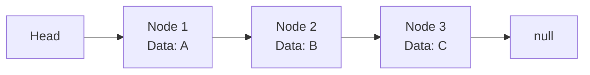
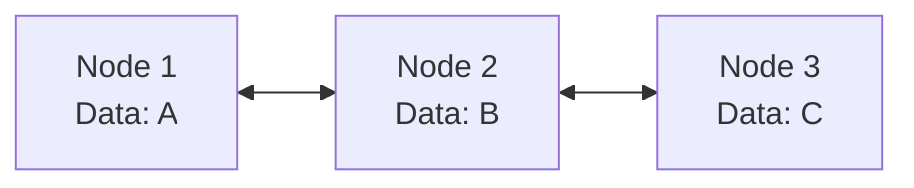

# List

**Lists** are ordered collections of elements, allowing for efficient data retrieval and manipulation. Various implementations in Java provide unique features, making them suitable for specific use cases. Below, we'll explore popular list implementations in detail, along with their characteristics, advantages, and limitations.

---

## Quick Reference

- **ArrayList access by index**: O(1)
- **ArrayList insert/delete at end**: O(1) amortized
- **ArrayList insert/delete at index**: O(n) due to shifting
- **LinkedList access by index**: O(n) traversal required
- **LinkedList insert/delete at head/tail**: O(1)
- **LinkedList insert/delete at index**: O(n) traversal + O(1) splice
- **Stack push/pop/peek**: O(1)
- **Vector**: synchronized ArrayList (legacy, prefer Collections.synchronizedList)
- **CopyOnWriteArrayList**: thread-safe, O(n) writes, O(1) reads
- **Java List interface**: `java.util.List<E>` with implementations ArrayList, LinkedList, Vector
- **Iteration**: all implementations support Iterator and enhanced for-loop
- **Null elements**: allowed in ArrayList and LinkedList

---

## When to Use

The choice of list implementation depends on your access patterns. ArrayList dominates for random access and append-heavy workloads, while LinkedList excels when you frequently insert or remove elements at arbitrary positions (given a reference to the node).

**Choose ArrayList when:**
- You need fast random access by index
- Most operations are reads or appends to the end
- You want cache-friendly sequential iteration
- Memory overhead per element should be minimal

**Choose LinkedList when:**
- You frequently insert/remove at the beginning or middle (with iterator)
- You need a deque (double-ended queue) implementation
- You cannot tolerate occasional O(n) resizing pauses

**Choose Stack when:**
- You need LIFO semantics (undo/redo, DFS, expression parsing)
- Operations are exclusively push, pop, and peek

**Avoid lists when:**
- You need O(1) lookup by key (use HashMap)
- You need sorted order with O(log n) operations (use TreeSet)
- You need thread-safe concurrent access (use ConcurrentLinkedDeque or CopyOnWriteArrayList)

---

## LinkedList

A **LinkedList** is a data structure where elements (nodes) are connected sequentially. Each node contains:

1. **Data**: The value stored in the node.
2. **Pointer(s)**: References to the next node (and optionally the previous node in a doubly linked list).



### Key Features:

- **Structure**: Elements are not stored in contiguous memory locations but are connected via pointers.
- **Head and Tail**: The head is the first node, and the tail is the last node. The tail points to `null` in a singly linked list.

### Time Complexity:

- **Access by Index**: O(n) because traversal is required from the head to the desired node.
- **Insert/Delete at Head**: O(1) by adjusting the head pointer.
- **Insert/Delete at Tail**: O(1) if a tail pointer is maintained; otherwise, O(n).
- **Insert/Delete by Index**: O(n) due to traversal to the desired node.

### Strengths:

- **Dynamic Size**: Can grow or shrink as needed without reallocation of memory.
- **Efficient Insertions/Deletions**: Operations at the head or tail are fast (O(1)).

### Weaknesses:

- **Slow Lookups**: Accessing elements by index is O(n).
- **Memory Overhead**: Each node requires additional memory for pointers.

### Example Code:

```java
import java.util.LinkedList;

LinkedList<String> list = new LinkedList<>();
list.add("Java");
list.add("Python");
list.addFirst("C++");
System.out.println(list);  // Output: [C++, Java, Python]
```

---

## Doubly Linked List

A **Doubly Linked List** is a variation of a linked list where each node contains pointers to both the next and previous nodes. This allows traversal in both directions.



### Strengths:

- **Bidirectional Traversal**: Can traverse forwards and backwards.
- **Efficient Deletions**: Deleting a node is faster because both next and previous pointers are accessible.

### Weaknesses:

- **Higher Memory Usage**: Requires two pointers per node (next and previous).
- **Slightly Slower Operations**: Additional pointer updates are needed during insertions and deletions.

### Real-World Applications:

- **Undo/Redo**: Commonly used to navigate back and forth in actions.
- **Browser History**: Tracks forward and backward navigation.

### Example Code:

```java
import java.util.LinkedList;

public class DoublyLinkedListExample {
    public static void main(String[] args) {
        LinkedList<String> dll = new LinkedList<>();
        dll.addFirst("Node1");
        dll.addLast("Node2");
        dll.addLast("Node3");

        System.out.println("Forward Traversal:");
        for (String node : dll) {
            System.out.println(node);
        }

        dll.removeFirst();
        dll.removeLast();

        System.out.println("After Removals:");
        for (String node : dll) {
            System.out.println(node);
        }
    }
}
```

---

## Stack

A **Stack** is a linear data structure following the **Last In, First Out (LIFO)** principle. The last element added is the first to be removed.

### Key Operations:

- **Push**: Add an element to the top.
- **Pop**: Remove and return the top element.
- **Peek**: View the top element without removing it.

### Time Complexity:

- **Push/Pop/Peek**: O(1) for all operations.

### Strengths:

- **Fast Operations**: Constant time for core operations.
- **Simple Design**: Suitable for scenarios requiring nested or recursive operations.

### Use Cases:

- **Call Stack**: Tracks function calls during program execution.
- **Expression Parsing**: Evaluates mathematical expressions or validates parentheses.
- **Depth-First Search (DFS)**: Tracks visited nodes in traversal algorithms.

### Example Code:

```java
import java.util.Stack;

Stack<Integer> stack = new Stack<>();
stack.push(10);
stack.push(20);
System.out.println(stack.pop());  // Output: 20
```

---

## Vector

A **Vector** is a dynamic array that is thread-safe. Unlike ArrayList, Vector methods are synchronized, ensuring thread safety in concurrent environments.

### Key Features:

- **Dynamic Resizing**: Automatically expands when needed.
- **Thread-Safe**: All operations are synchronized.
- **Legacy Class**: Introduced in Java 1.0, now largely replaced by ArrayList for non-threaded applications.

### Time Complexity:

- **Access by Index**: O(1).
- **Insert/Delete at End**: O(1) (amortized).
- **Insert/Delete at Index**: O(n) due to shifting elements.

### Strengths:

- **Thread Safety**: Suitable for multi-threaded applications.

### Weaknesses:

- **Slower Performance**: Synchronization adds overhead.
- **Legacy Class**: Generally replaced by newer alternatives like ArrayList.

### Example Code:

```java
import java.util.Vector;

Vector<String> vector = new Vector<>();
vector.add("Java");
vector.add("Python");
System.out.println(vector);  // Output: [Java, Python]
```

---

## ArrayList

An **ArrayList** is a resizable array implementation of the **List** interface. It provides dynamic sizing and efficient random access.

### Key Features:

- **Dynamic Sizing**: Automatically grows or shrinks as elements are added or removed.
- **Random Access**: Direct access to elements by index is O(1).
- **Wrapper Classes**: Stores objects, requiring primitive types to be wrapped (e.g., Integer, Double).

### Time Complexity:

- **Access by Index**: O(1).
- **Insert/Delete at End**: O(1) (amortized).
- **Insert/Delete by Index**: O(n) due to shifting.

### Strengths:

- **Efficient Random Access**: Ideal for scenarios with frequent reads.
- **Dynamic Size**: No need for manual resizing.

### Weaknesses:

- **Costly Middle Operations**: Insertions or deletions in the middle require shifting elements.
- **Not Thread-Safe**: Must be manually synchronized for concurrent use.

### Example Code:

```java
import java.util.ArrayList;

ArrayList<String> arrayList = new ArrayList<>();
arrayList.add("Java");
arrayList.add("Python");
arrayList.add(1, "C++");
System.out.println(arrayList);  // Output: [Java, C++, Python]
```

---

## Big O Comparison of List Implementations

| **Operation** | ArrayList | LinkedList | Vector | Stack |
| --- | --- | --- | --- | --- |
| **Access by Index** | O(1) | O(n) | O(1) | O(n) |
| **Insert at Beginning** | O(n) | O(1) | O(n) | O(1) |
| **Insert at End** | O(1) | O(1) | O(1) | O(1) |
| **Delete at Beginning** | O(n) | O(1) | O(n) | O(1) |
| **Delete at End** | O(1) | O(1) | O(1) | O(1) |
| **Search** | O(n) | O(n) | O(n) | O(n) |

---

## Summary

Each list implementation has its strengths and weaknesses:

- **ArrayList**: Best for random access and frequent additions/removals at the end.
- **LinkedList**: Ideal for scenarios requiring frequent insertions/deletions in the middle or at both ends.
- **Stack**: Suitable for LIFO operations like undo/redo and DFS.
- **Vector**: Use when thread safety is a priority.

---

## Code Examples

### Reversing a Linked List (Iterative)

A classic interview problem that demonstrates pointer manipulation. This in-place reversal runs in O(n) time with O(1) space.

```java
public ListNode reverseList(ListNode head) {
    ListNode prev = null;
    ListNode current = head;
    while (current != null) {
        ListNode next = current.next;
        current.next = prev;
        prev = current;
        current = next;
    }
    return prev;
}
```

### Detecting a Cycle in a Linked List (Floyd's Algorithm)

Floyd's tortoise and hare algorithm detects cycles in O(n) time with O(1) space by using two pointers moving at different speeds.

```java
public boolean hasCycle(ListNode head) {
    ListNode slow = head, fast = head;
    while (fast != null && fast.next != null) {
        slow = slow.next;
        fast = fast.next.next;
        if (slow == fast) return true;
    }
    return false;
}
```

### Implementing an LRU Cache with LinkedHashMap

LinkedHashMap with access-order provides an elegant LRU cache implementation that automatically evicts the least recently used entry.

```java
public class LRUCache<K, V> extends LinkedHashMap<K, V> {
    private final int capacity;

    public LRUCache(int capacity) {
        super(capacity, 0.75f, true);  // true = access order
        this.capacity = capacity;
    }

    @Override
    protected boolean removeEldestEntry(Map.Entry<K, V> eldest) {
        return size() > capacity;
    }
}
```

---

## Common Pitfalls

1. **Using LinkedList for random access**: Calling `list.get(i)` on a LinkedList is O(n) because it must traverse from the head. If you need indexed access, use ArrayList. This is the most common performance mistake with lists.

2. **ConcurrentModificationException during iteration**: Modifying a list while iterating with a for-each loop throws ConcurrentModificationException. Use `Iterator.remove()`, `ListIterator`, or iterate over a copy.

3. **Autoboxing overhead with primitive types**: `ArrayList<Integer>` boxes every int into an Integer object, consuming 16+ bytes per element instead of 4. For large collections of primitives, use specialized libraries (Eclipse Collections IntArrayList, or primitive arrays).

4. **Assuming ArrayList.remove(int) removes by value**: `list.remove(0)` removes the element at index 0, not the element with value 0. To remove by value, use `list.remove(Integer.valueOf(0))`.

5. **Not pre-sizing ArrayList**: If you know the approximate size, pass it to the constructor: `new ArrayList<>(expectedSize)`. This avoids repeated array copying during growth, which matters for large lists.

6. **Using Stack class instead of Deque**: Java's `Stack` class extends Vector and is synchronized (slow). Prefer `ArrayDeque` as a stack: it is faster and not synchronized.

---

## Interview Questions

**Q1: How do you find the middle element of a linked list in one pass?**
Use the slow/fast pointer technique. Move slow one step and fast two steps at a time. When fast reaches the end, slow is at the middle. This works in O(n) time with O(1) space.

**Q2: How would you merge two sorted linked lists?**
Use a dummy head node and a current pointer. Compare the heads of both lists, append the smaller one to current, and advance that list's pointer. Continue until one list is exhausted, then append the remainder. Time: O(n + m), Space: O(1).

**Q3: What is the difference between ArrayList and LinkedList in terms of memory?**
ArrayList stores elements in a contiguous array (compact, cache-friendly, ~4-8 bytes per element for references). LinkedList stores each element in a node with prev/next pointers (~40 bytes per element due to object header + two pointers + data reference). ArrayList is almost always more memory-efficient.

**Q4: How do you implement a stack using two queues?**
Push: enqueue to queue1 (O(1)). Pop: dequeue all elements from queue1 to queue2 except the last one, return the last one, then swap queue names. This gives O(1) push and O(n) pop, or vice versa depending on which operation you optimize.

---

## Production Tips

1. **Default to ArrayList**: In production Java code, ArrayList is the correct default choice for list implementations. It has better cache locality, lower memory overhead, and faster iteration than LinkedList. LinkedIn's engineering team found that replacing LinkedList with ArrayList improved throughput by 10-15% in their messaging system.

2. **Use Collections.unmodifiableList for API boundaries**: When returning lists from public methods, wrap them in `Collections.unmodifiableList()` to prevent callers from modifying your internal state. This is a defensive programming practice that prevents subtle bugs.

3. **Consider List.of() for small immutable lists**: Java 9+ provides `List.of(a, b, c)` which creates compact, immutable lists. These use less memory than ArrayList for small fixed collections and communicate immutability intent clearly.

4. **Use subList for range operations**: `list.subList(from, to)` returns a view (not a copy) of the list. This is efficient for range operations but be aware that modifications to the sublist affect the original list, and structural modifications to the original invalidate the sublist.

5. **Profile before choosing LinkedList**: In nearly all real-world benchmarks, ArrayList outperforms LinkedList even for insertion-heavy workloads due to CPU cache effects. Only choose LinkedList when you have measured evidence that it performs better for your specific access pattern.

---

## Related Topics

- [Array](./array.md) — ArrayList is backed by a dynamic array with amortized O(1) append
- [Queue](./queue.md) — LinkedList implements the Deque interface for queue operations
- [Map](./map.md) — LinkedHashMap combines HashMap with a linked list for ordered iteration
- [Ring Buffer](./ring-buffer.md) — ArrayDeque uses a circular array as an alternative to LinkedList
- [Big O Notation](./big-o-notation.md) — Comparing time complexities across list implementations
