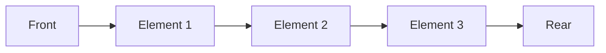

# Queue

A **queue** is a linear data structure that follows the **First-In, First-Out (FIFO)** principle. Elements are added to the back of the queue (enqueued) and removed from the front (dequeued). Queues are fundamental to computer science, appearing in operating system schedulers, network packet handling, breadth-first search algorithms, and message-passing systems.

---

## Quick Reference

- **Enqueue (add)**: O(1) — add element to rear
- **Dequeue (remove)**: O(1) — remove element from front
- **Peek (view front)**: O(1) — view without removing
- **Java Queue interface**: `java.util.Queue<E>` (LinkedList, ArrayDeque, PriorityQueue)
- **Java Deque interface**: `java.util.Deque<E>` (ArrayDeque, LinkedList)
- **Preferred implementation**: `ArrayDeque` (faster than LinkedList for both stack and queue usage)
- **Thread-safe queues**: `ArrayBlockingQueue`, `LinkedBlockingQueue`, `ConcurrentLinkedQueue`
- **Priority queue**: O(log n) enqueue/dequeue based on priority
- **Circular queue**: fixed-size with wrap-around indexing
- **offer() vs add()**: offer returns false on capacity failure; add throws exception

---

## When to Use

Queues are the right choice when you need to process elements in the order they arrive, implement producer-consumer patterns, or perform level-order traversal of tree/graph structures.

**Choose queues when:**
- You need FIFO processing order (task scheduling, request handling)
- You are implementing BFS (breadth-first search) on graphs or trees
- You need a producer-consumer buffer between threads
- You are building an event-driven system or message queue
- You need rate limiting or throttling (bounded queues)

**Choose priority queues when:**
- Elements have different priorities (task schedulers, Dijkstra's algorithm)
- You need the minimum or maximum element efficiently

**Choose deques when:**
- You need both FIFO and LIFO operations
- You are implementing a sliding window algorithm
- You need work-stealing in parallel processing

**Avoid queues when:**
- You need random access by index (use ArrayList)
- You need sorted iteration (use TreeSet)
- You need key-value associations (use HashMap)

---

- **Big O Complexity**:
    - **Enqueue (add)**: O(1)
    - **Dequeue (remove)**: O(1)
    - **Peek (view front item)**: O(1)

---

## Simple Queue

A **simple queue** is the most basic type of queue where the enqueue operation occurs at the rear, and the dequeue operation occurs at the front.



### Applications:

- Process scheduling
- Disk scheduling
- Memory management
- IO buffering
- Call center phone systems
- Interrupt handling

### Example:

```java
import java.util.LinkedList;
import java.util.Queue;

public class SimpleQueueExample {
    public static void main(String[] args) {
        Queue<String> queue = new LinkedList<>();

        queue.add("First");
        queue.add("Second");
        queue.add("Third");

        System.out.println(queue.poll());  // Output: First
        System.out.println(queue.poll());  // Output: Second
    }
}
```

### Big O Analysis:

- **Enqueue**: O(1) because adding to the end of the queue takes constant time.
- **Dequeue**: O(1) because removing from the front also takes constant time.

---

## Circular Queue

A **circular queue** is a fixed-size queue where the last node points to the first node, creating a circular connection. It helps in better memory utilization as the queue wraps around instead of leaving unused space.

### Characteristics:

- When the queue is full and the first node is free, insertion can happen at the front.
- Also called a **ring buffer**.
- Fixes the issue of wasted space in a fixed-size queue.

### Applications:

- Traffic signal systems
- Implementing buffers in network protocols
- Replacing a simple queue for better memory usage

### Example:

```java
public class CircularQueueExample {
    static class CircularQueue {
        int[] queue;
        int front, rear, size;
        int capacity;

        CircularQueue(int capacity) {
            this.capacity = capacity;
            queue = new int[capacity];
            front = 0;
            rear = -1;
            size = 0;
        }

        public void enqueue(int data) {
            if (size == capacity) {
                System.out.println("Queue is full");
            } else {
                rear = (rear + 1) % capacity;
                queue[rear] = data;
                size++;
            }
        }

        public int dequeue() {
            if (size == 0) {
                System.out.println("Queue is empty");
                return -1;
            } else {
                int item = queue[front];
                front = (front + 1) % capacity;
                size--;
                return item;
            }
        }
    }

    public static void main(String[] args) {
        CircularQueue cq = new CircularQueue(5);
        cq.enqueue(1);
        cq.enqueue(2);
        cq.enqueue(3);

        System.out.println(cq.dequeue());  // Output: 1
        cq.enqueue(4);

        System.out.println(cq.dequeue());  // Output: 2
    }
}
```

### Big O Analysis:

- **Enqueue**: O(1), constant time as it simply updates the rear pointer.
- **Dequeue**: O(1), constant time as it updates the front pointer.

---

## Priority Queue

A **priority queue** is a special type of queue where each item has a predefined priority. Higher priority elements are dequeued before lower priority ones, regardless of their arrival order.

### Characteristics:

- Enqueue operation occurs in the order of arrival at the rear.
- Dequeue operation occurs based on the priority of the items.
- Items with the same priority are dequeued in FIFO order.

### Applications:

- Interrupt handling in operating systems
- Algorithms like Prim's and Dijkstra's for finding shortest paths
- Implementing Huffman code generation
- Heap sort algorithm

### Example:

```java
import java.util.PriorityQueue;

public class PriorityQueueExample {
    public static void main(String[] args) {
        PriorityQueue<Integer> pq = new PriorityQueue<>();

        pq.add(10);
        pq.add(5);
        pq.add(20);

        System.out.println(pq.poll());  // Output: 5 (smallest priority)
        System.out.println(pq.poll());  // Output: 10
    }
}
```

### Big O Analysis:

- **Enqueue**: O(log n), due to the need to maintain the heap property.
- **Dequeue**: O(log n), as it involves removing the root of the heap and reheapifying.

---

## Double-Ended Queue (Deque)

A **deque** allows both enqueue and dequeue operations at both ends, making it more flexible. It may or may not follow the FIFO principle.

### Characteristics:

- Can insert and remove items from both ends.
- Can operate as a queue or a stack, depending on the operation chosen.

### Types:

- **Input-Restricted Queue**: Allows removal from the rear.
- **Output-Restricted Queue**: Allows insertion at the front.

### Applications:

- Undo operations in software applications
- Browser history management
- Implementing both stack and queue behaviors

### Example:

```java
import java.util.ArrayDeque;
import java.util.Deque;

public class DequeExample {
    public static void main(String[] args) {
        Deque<String> deque = new ArrayDeque<>();

        deque.addFirst("First");
        deque.addLast("Second");

        System.out.println(deque.pollFirst());  // Output: First
        System.out.println(deque.pollLast());   // Output: Second
    }
}
```

### Big O Analysis:

- **Enqueue (addFirst or addLast)**: O(1), constant time.
- **Dequeue (pollFirst or pollLast)**: O(1), constant time.

---

## The Queue Interface in Java

The **Queue** interface in Java extends the **Collection** interface and defines a contract for a queue data structure. It provides methods for adding, removing, and peeking at elements following FIFO semantics.

### Common Implementations:

- **LinkedList**: Implements both Queue and Deque interfaces.
- **ArrayBlockingQueue**: A thread-safe implementation useful in concurrent programming.
- **PriorityQueue**: Implements a priority-based queue.

---

## Summary

Queues are essential for managing tasks in a sequential order, used across a wide range of applications from process scheduling to search algorithms. The choice of queue type (simple, circular, priority, deque) depends on the specific use case and required functionality.

- **Simple Queue**: Basic FIFO structure.
- **Circular Queue**: Efficient memory use in fixed-size queues.
- **Priority Queue**: Items processed based on priority.
- **Deque**: Flexible queue with operations at both ends.

Each type has different performance characteristics, which is important to consider based on the specific task you are solving.

---

## Code Examples

### BFS Using a Queue

Breadth-first search is the canonical queue application, exploring nodes level by level in a graph or tree.

```java
public List<Integer> bfs(Map<Integer, List<Integer>> graph, int start) {
    List<Integer> visited = new ArrayList<>();
    Queue<Integer> queue = new ArrayDeque<>();
    Set<Integer> seen = new HashSet<>();

    queue.offer(start);
    seen.add(start);

    while (!queue.isEmpty()) {
        int current = queue.poll();
        visited.add(current);
        for (int neighbor : graph.getOrDefault(current, Collections.emptyList())) {
            if (!seen.contains(neighbor)) {
                seen.add(neighbor);
                queue.offer(neighbor);
            }
        }
    }
    return visited;
}
```

### Sliding Window Maximum Using Deque

A monotonic deque maintains elements in decreasing order, enabling O(n) sliding window maximum computation.

```java
public int[] maxSlidingWindow(int[] nums, int k) {
    Deque<Integer> deque = new ArrayDeque<>();  // Stores indices
    int[] result = new int[nums.length - k + 1];

    for (int i = 0; i < nums.length; i++) {
        // Remove elements outside the window
        while (!deque.isEmpty() && deque.peekFirst() <= i - k) {
            deque.pollFirst();
        }
        // Remove smaller elements from the back
        while (!deque.isEmpty() && nums[deque.peekLast()] <= nums[i]) {
            deque.pollLast();
        }
        deque.offerLast(i);
        if (i >= k - 1) {
            result[i - k + 1] = nums[deque.peekFirst()];
        }
    }
    return result;
}
```

### Producer-Consumer with BlockingQueue

BlockingQueue provides thread-safe FIFO operations with blocking semantics, ideal for concurrent producer-consumer patterns.

```java
public class ProducerConsumer {
    private final BlockingQueue<String> queue = new ArrayBlockingQueue<>(100);

    public void produce(String item) throws InterruptedException {
        queue.put(item);  // Blocks if queue is full
    }

    public String consume() throws InterruptedException {
        return queue.take();  // Blocks if queue is empty
    }
}
```

---

## Common Pitfalls

1. **Using LinkedList instead of ArrayDeque**: Java's ArrayDeque is faster than LinkedList for both queue and stack operations due to better cache locality and no node allocation overhead. Always prefer ArrayDeque unless you need null elements or List interface compatibility.

2. **Confusing add/offer and remove/poll semantics**: `add()` throws IllegalStateException on capacity failure; `offer()` returns false. `remove()` throws NoSuchElementException on empty queue; `poll()` returns null. Use offer/poll for bounded queues where failure is expected.

3. **Unbounded queue causing OutOfMemoryError**: Using an unbounded LinkedBlockingQueue in a producer-consumer system where producers are faster than consumers leads to memory exhaustion. Always use bounded queues (ArrayBlockingQueue) with backpressure.

4. **Not handling InterruptedException in blocking queues**: BlockingQueue operations throw InterruptedException. Swallowing this exception (empty catch block) breaks thread interruption contracts. Always restore the interrupt flag: `Thread.currentThread().interrupt()`.

5. **Polling in a busy loop**: Repeatedly calling `poll()` in a tight loop wastes CPU cycles. Use `take()` for blocking behavior, or `poll(timeout, unit)` for timed waiting.

6. **Assuming PriorityQueue iteration order is sorted**: Iterating over a PriorityQueue does NOT yield elements in priority order. Only `poll()` returns elements in order. The internal heap structure does not maintain sorted iteration order.

---

## Interview Questions

**Q1: How would you implement a queue using two stacks?**
Use stack1 for enqueue (push). For dequeue, if stack2 is empty, pop all elements from stack1 and push to stack2 (reversing order), then pop from stack2. Amortized O(1) per operation because each element is moved at most twice.

**Q2: Design a queue that supports getMin() in O(1) time.**
Maintain a secondary deque that tracks minimums. On enqueue, remove all elements from the back of the min-deque that are greater than the new element, then add the new element. On dequeue, if the front of the min-deque equals the dequeued element, remove it. getMin() returns the front of the min-deque.

**Q3: What is the difference between ArrayBlockingQueue and LinkedBlockingQueue?**
ArrayBlockingQueue uses a fixed-size array (bounded, must specify capacity). LinkedBlockingQueue can be bounded or unbounded (defaults to Integer.MAX_VALUE). ArrayBlockingQueue has better cache performance; LinkedBlockingQueue has higher throughput under high contention because it uses separate locks for put and take.

**Q4: How does a circular queue avoid wasted space in a fixed-size array?**
A circular queue uses modulo arithmetic to wrap indices around: `rear = (rear + 1) % capacity`. This reuses slots freed by dequeue operations without shifting elements. The queue is full when `(rear + 1) % capacity == front` and empty when `front == rear`.

---

## Production Tips

1. **Use ArrayBlockingQueue for bounded producer-consumer**: In production systems, bounded queues with backpressure prevent memory exhaustion. ArrayBlockingQueue provides fair ordering (optional) and predictable memory usage. Size the queue based on expected burst capacity and acceptable latency.

2. **Consider Disruptor for ultra-low-latency queuing**: For systems requiring sub-microsecond latency (financial trading, real-time analytics), the LMAX Disruptor provides a lock-free ring buffer that eliminates contention between producers and consumers through mechanical sympathy with CPU caches.

3. **Monitor queue depth as a health metric**: In production services, queue depth (number of pending items) is a critical metric. Rising queue depth indicates consumers cannot keep up with producers. Set alerts on queue depth thresholds and implement circuit breakers or load shedding.

4. **Use DelayQueue for scheduled task execution**: Java's DelayQueue holds elements until their delay expires, making it ideal for implementing retry mechanisms, scheduled notifications, and time-based expiration without external scheduling infrastructure.

5. **Prefer ConcurrentLinkedQueue for non-blocking scenarios**: When you need a thread-safe queue without blocking semantics (fire-and-forget logging, event buses), ConcurrentLinkedQueue provides lock-free operations using CAS, avoiding thread parking overhead.

---

## Related Topics

- [Ring Buffer](./ring-buffer.md) — Circular queues are a specialized form of ring buffer
- [Heap](./heap.md) — Priority queues are implemented using heap data structures
- [List](./list.md) — LinkedList implements the Queue and Deque interfaces
- [Graph](./graph.md) — BFS traversal uses queues for level-order exploration
- [Big O Notation](./big-o-notation.md) — Understanding amortized O(1) queue operations
