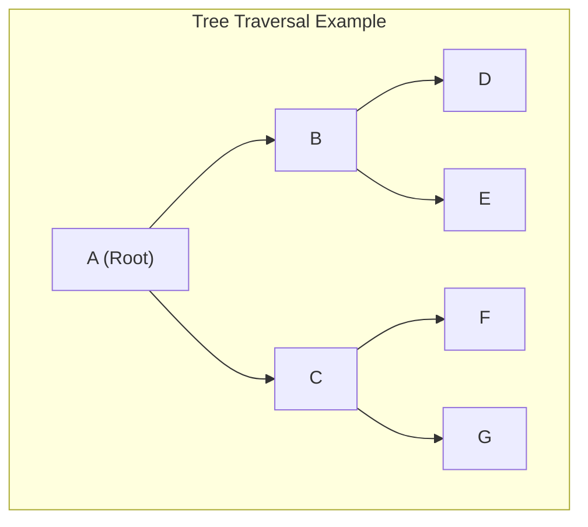
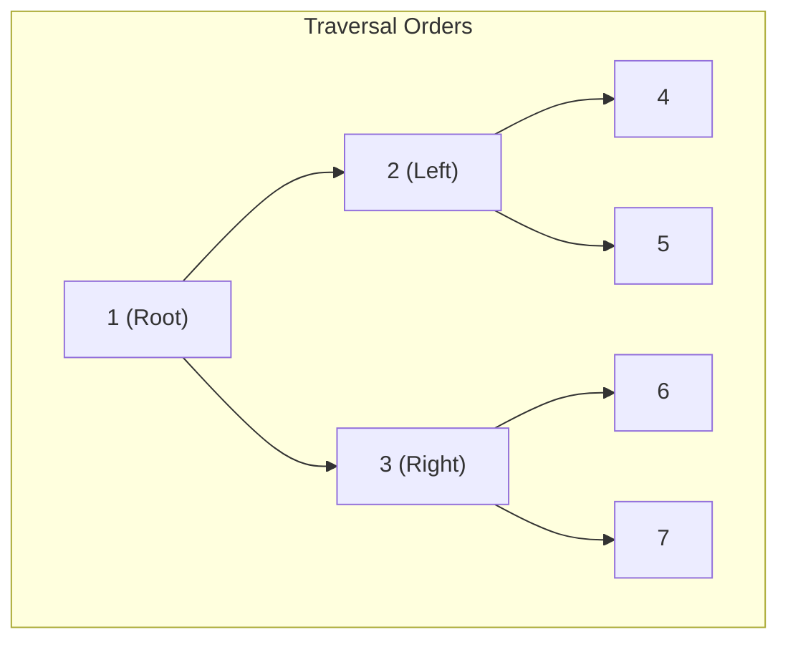
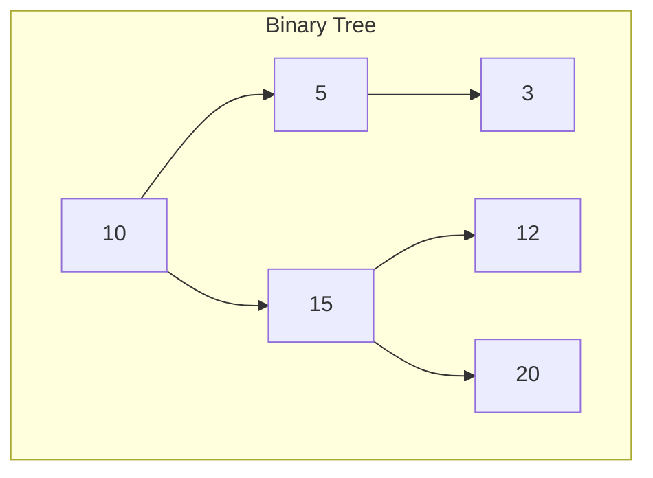
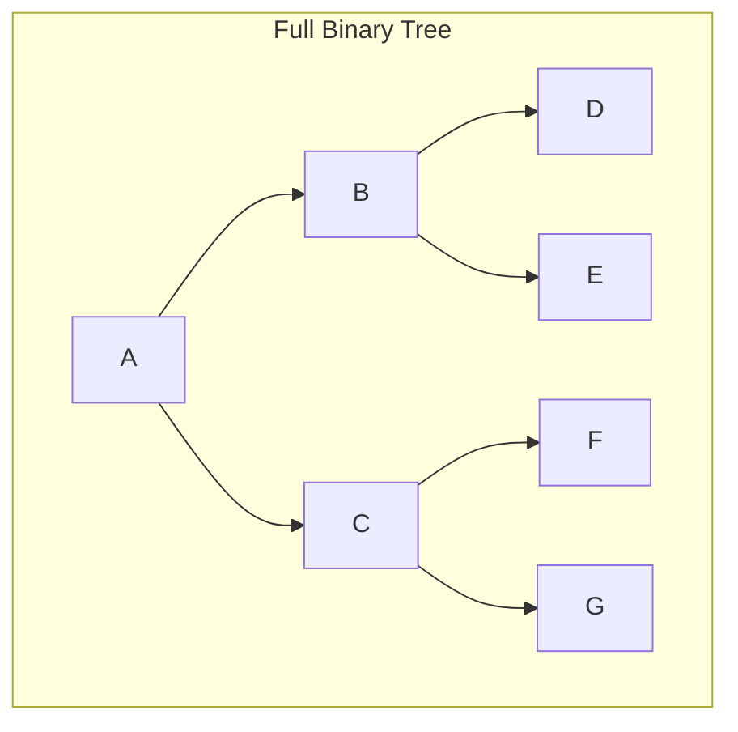
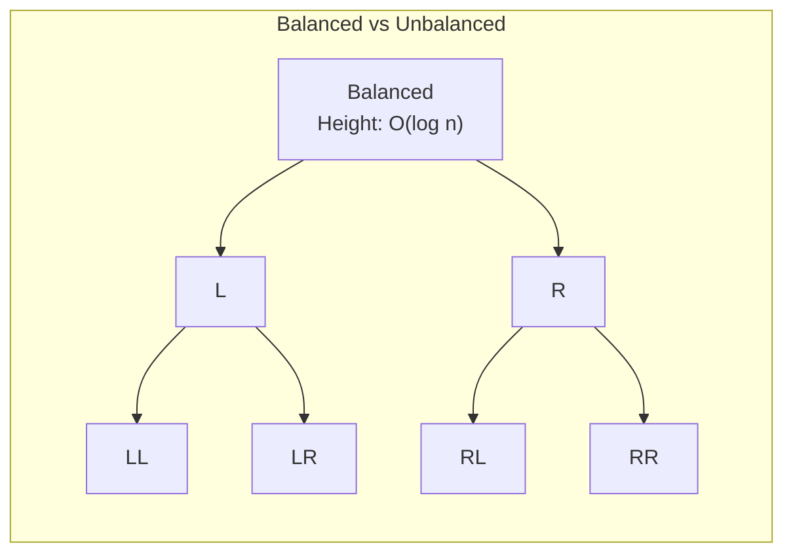

# Tree

A **tree** is a hierarchical data structure where each node contains a value and links to child nodes. The tree's structure resembles a branching structure where each branch connects to more branches or leaves. Trees are particularly useful in applications that involve hierarchical data, such as file systems, organizational charts, and family trees. They provide O(log n) operations for balanced variants, making them essential for databases, compilers, and search algorithms.

---

## Quick Reference

- **Binary Search Tree (BST) search/insert/delete**: O(log n) average, O(n) worst (unbalanced)
- **AVL Tree operations**: O(log n) guaranteed (self-balancing)
- **Red-Black Tree operations**: O(log n) guaranteed (used in Java TreeMap/TreeSet)
- **B-Tree operations**: O(log n) with high branching factor (used in databases)
- **Heap (complete binary tree)**: O(1) peek, O(log n) insert/delete
- **Tree height (balanced)**: O(log n)
- **Tree height (unbalanced)**: O(n) worst case
- **Traversal (any order)**: O(n) visits every node
- **Space for n nodes**: O(n)
- **Binary tree max nodes at level k**: 2^k
- **Complete binary tree with n nodes has height**: floor(log₂ n)

---

## When to Use

Trees are the right choice when your data has a natural hierarchical structure or when you need O(log n) search, insertion, and deletion with ordered data. They bridge the gap between O(1) hash-based structures (unordered) and O(n) linear structures (ordered but slow).

**Choose trees when:**
- You need sorted data with O(log n) search, insert, and delete (BST, AVL, Red-Black)
- You need range queries or ordered iteration (TreeMap, TreeSet)
- Your data is naturally hierarchical (file systems, DOM, organizational charts)
- You need prefix-based searching (Trie)
- You are implementing a priority queue (Heap)
- You need efficient disk-based storage with minimal I/O (B-Tree, B+ Tree)

**Avoid trees when:**
- You only need O(1) lookup by key without ordering (use HashMap)
- Data is flat with no hierarchical relationships (use arrays or lists)
- You need constant-time access by index (use arrays)
- The dataset is small enough that linear scan is acceptable

---

## Node Characteristics

- **Leaf Nodes**: These are nodes that have no children and are located at the bottom of the tree. They are terminal nodes and often represent the final elements in a structure.
- **Depth**: The depth of a node is the number of edges (links) from the root to that node. For example, the root node has a depth of 0.
- **Height**: The height of a node is the number of edges on the longest path from that node to a leaf. The height of the entire tree is the height of the root node.

---

## Traversal Methods



### Breadth-First Search (BFS)

- **Method**: BFS explores the tree level by level, starting from the root. It first explores all the nodes at depth 1 (immediate children), then moves to depth 2, and so on.
- **Applications**:
    - Finding the shortest path in unweighted graphs or trees.
    - Suitable for scenarios like peer-to-peer networking or social networks to discover all direct connections.
- **Time Complexity**: O(V + E), where V is the number of vertices (nodes) and E is the number of edges (links).

### Depth-First Search (DFS)

- **Method**: DFS explores as deep as possible down one branch before backtracking to explore other branches.
- **Applications**:
    - Pathfinding algorithms where every path must be explored.
    - Useful for tree traversal and graph search operations like topological sorting or cycle detection.
- **Time Complexity**: O(V + E).
- **Space Complexity**: O(V), due to the space used by the recursion stack.

---

## Tree Traversals



**Pre-Order**: 1, 2, 4, 5, 3, 6, 7 (Root → Left → Right)

**In-Order**: 4, 2, 5, 1, 6, 3, 7 (Left → Root → Right)

**Post-Order**: 4, 5, 2, 6, 7, 3, 1 (Left → Right → Root)

### Pre-Order Traversal

- **Order**: Visit the current node, then recursively visit the left subtree, followed by the right subtree.
- **Applications**:
    - Used to create a copy of the tree.
    - Used in expression tree evaluations and prefix notation.

### In-Order Traversal

- **Order**: First, recursively visit the left subtree, then visit the current node, and finally traverse the right subtree.
- **Applications**:
    - Commonly used in **binary search trees (BSTs)** to visit nodes in sorted order.
    - Used in binary expression trees to evaluate expressions in infix notation.

### Post-Order Traversal

- **Order**: First, recursively traverse the left subtree, then the right subtree, and finally visit the current node.
- **Applications**:
    - Used in tree deletion algorithms, where children are deleted before their parent nodes.
    - Useful in postfix notation evaluation.

---

## Types of Binary Trees

### Binary Tree

- **Characteristics**: In a binary tree, each node can have at most two children. It serves as the basic structure for more complex types of binary trees.



### Full Binary Tree

- **Characteristics**: In a full binary tree, every node has either 0 or 2 children, meaning no node has only one child.
- **Applications**:
    - Used in certain tree-based data structures like heaps.
    - Can be helpful in situations where each node's children must be balanced.



### Perfect Binary Tree

- **Characteristics**: A perfect binary tree is completely filled. Every non-leaf node has exactly two children, and all leaf nodes are at the same level.
- **Applications**:
    - Used in heaps and priority queues, where complete filling ensures efficient insertion and removal.

### Complete Binary Tree

- **Characteristics**: Like a perfect binary tree, but the last level may not be completely filled. All nodes are filled from left to right in the last level, with no gaps in the tree.
- **Applications**:
    - Forms the basis for efficient implementations of heaps and priority queues (used in algorithms like heap sort).

### Balanced Binary Tree

- **Characteristics**: A balanced binary tree has a height that is minimized in relation to the number of nodes. This typically means that the height of the tree is O(log n), where n is the number of nodes.
- **Applications**:
    - Ensures efficient search, insertion, and deletion operations, making it ideal for use in **binary search trees (BSTs)** and **AVL trees**.
    - Often used in databases and file systems to maintain fast access times.



---

## Summary

Trees are essential for organizing hierarchical data and enable efficient searching, sorting, and pathfinding. Whether it's a **binary tree** with two children per node, or more advanced types like **perfect**, **full**, and **balanced** binary trees, trees provide an efficient structure for representing various types of data.

Different traversal methods such as **BFS** and **DFS** offer flexibility in exploring the tree, each with its specific use cases and applications. The types of binary trees cater to different needs, with **balanced** trees optimizing for efficiency, while **complete** trees are key to efficient heap-based operations.

By understanding how trees and their variations work, one can effectively manage and manipulate data in a variety of applications, from file systems to complex network routing.

---

## Code Examples

### Binary Search Tree Implementation

A BST maintains the invariant that left children are smaller and right children are larger, enabling O(log n) search in balanced trees.

```java
public class BST {
    private TreeNode root;

    static class TreeNode {
        int val;
        TreeNode left, right;
        TreeNode(int val) { this.val = val; }
    }

    public void insert(int val) {
        root = insertRec(root, val);
    }

    private TreeNode insertRec(TreeNode node, int val) {
        if (node == null) return new TreeNode(val);
        if (val < node.val) node.left = insertRec(node.left, val);
        else if (val > node.val) node.right = insertRec(node.right, val);
        return node;
    }

    public boolean search(int val) {
        TreeNode current = root;
        while (current != null) {
            if (val == current.val) return true;
            current = val < current.val ? current.left : current.right;
        }
        return false;
    }
}
```

### Lowest Common Ancestor (LCA) in a Binary Tree

A classic interview problem solved with recursive post-order traversal in O(n) time.

```java
public TreeNode lowestCommonAncestor(TreeNode root, TreeNode p, TreeNode q) {
    if (root == null || root == p || root == q) return root;
    TreeNode left = lowestCommonAncestor(root.left, p, q);
    TreeNode right = lowestCommonAncestor(root.right, p, q);
    if (left != null && right != null) return root;  // p and q on different sides
    return left != null ? left : right;
}
```

### Level-Order Traversal (BFS) with Level Grouping

Returns nodes grouped by level, useful for zigzag traversal, right-side view, and level averages.

```java
public List<List<Integer>> levelOrder(TreeNode root) {
    List<List<Integer>> result = new ArrayList<>();
    if (root == null) return result;

    Queue<TreeNode> queue = new ArrayDeque<>();
    queue.offer(root);

    while (!queue.isEmpty()) {
        int levelSize = queue.size();
        List<Integer> level = new ArrayList<>();
        for (int i = 0; i < levelSize; i++) {
            TreeNode node = queue.poll();
            level.add(node.val);
            if (node.left != null) queue.offer(node.left);
            if (node.right != null) queue.offer(node.right);
        }
        result.add(level);
    }
    return result;
}
```

### Validate Binary Search Tree

Verifies BST property using range-based validation, a common interview question with subtle edge cases.

```java
public boolean isValidBST(TreeNode root) {
    return validate(root, Long.MIN_VALUE, Long.MAX_VALUE);
}

private boolean validate(TreeNode node, long min, long max) {
    if (node == null) return true;
    if (node.val <= min || node.val >= max) return false;
    return validate(node.left, min, node.val) &&
           validate(node.right, node.val, max);
}
```

---

## Common Pitfalls

1. **Assuming BSTs are always balanced**: An unbalanced BST degenerates into a linked list with O(n) operations. Inserting sorted data into a plain BST creates a worst-case linear structure. Use self-balancing trees (AVL, Red-Black) when input order is unpredictable.

2. **Stack overflow with deep recursion**: Recursive tree algorithms on deep trees (100,000+ nodes) can overflow the call stack. Convert to iterative approaches using an explicit stack for production code handling large trees.

3. **Confusing tree height and depth**: Height is measured from a node down to the deepest leaf (root has maximum height). Depth is measured from the root down to a node (root has depth 0). Mixing these up leads to off-by-one errors in balanced tree checks.

4. **Modifying tree structure during traversal**: Adding or removing nodes while traversing causes missed nodes or infinite loops. Collect modifications in a separate list and apply them after traversal completes.

5. **Not handling null children in recursive algorithms**: Every recursive tree function must handle the null base case. Forgetting this causes NullPointerException on leaf nodes' children.

6. **Using BST when HashMap suffices**: If you only need O(1) lookup without ordering, a HashMap is simpler and faster than a BST. Only use trees when you need sorted order, range queries, or floor/ceiling operations.

---

## Interview Questions

**Q1: How do you determine if a binary tree is balanced?**
A tree is balanced if the height difference between left and right subtrees is at most 1 for every node. Use a bottom-up recursive approach that returns -1 for unbalanced subtrees, avoiding redundant height calculations. This runs in O(n) time.

**Q2: How would you serialize and deserialize a binary tree?**
Use pre-order traversal with null markers. Serialize: visit root, serialize left, serialize right, using a delimiter and null marker (e.g., "1,2,null,null,3,4,null,null,5,null,null"). Deserialize: read values sequentially, recursively building left then right subtrees. Both operations are O(n).

**Q3: What is the difference between a Red-Black tree and an AVL tree?**
Both are self-balancing BSTs with O(log n) operations. AVL trees are more strictly balanced (height difference ≤ 1), providing faster lookups but slower insertions/deletions due to more rotations. Red-Black trees allow height difference up to 2x, requiring fewer rotations on modification. Java's TreeMap uses Red-Black trees.

**Q4: How do you find the kth smallest element in a BST?**
Use in-order traversal (which visits BST nodes in sorted order) and count nodes visited. When the count reaches k, return that node's value. Time: O(h + k) where h is tree height. For frequent queries, augment each node with subtree size for O(h) lookup.

**Q5: How would you convert a sorted array to a balanced BST?**
Use divide-and-conquer: the middle element becomes the root, recursively build the left subtree from the left half and right subtree from the right half. This produces a height-balanced BST in O(n) time with O(log n) stack space.

---

## Production Tips

1. **Use Java's TreeMap/TreeSet for sorted operations**: These are backed by Red-Black trees providing guaranteed O(log n) for all operations. They support efficient range queries via `subMap()`, `headMap()`, `tailMap()`, and nearest-element queries via `floorKey()`, `ceilingKey()`.

2. **Consider B-Trees for disk-based storage**: B-Trees minimize disk I/O by using high branching factors (hundreds of children per node), keeping the tree shallow. Each node fits in one disk page. This is why databases (PostgreSQL, MySQL) and file systems (NTFS, ext4) use B-Tree variants.

3. **Use iterative Morris traversal for O(1) space**: When memory is constrained and you need in-order traversal without recursion or an explicit stack, Morris traversal temporarily modifies tree pointers to achieve O(n) time with O(1) extra space. Restore pointers after traversal.

4. **Cache tree heights for repeated balance checks**: If your application frequently checks tree balance or performs height-dependent operations, store height as a field in each node and update it during modifications. This avoids O(n) height recalculation.

5. **Use immutable trees for concurrent read-heavy workloads**: Persistent (immutable) tree structures allow concurrent readers without locks. Modifications create new paths from the changed node to the root, sharing unchanged subtrees. This pattern is used in functional programming and concurrent databases.

---

## Related Topics

- [Heap](./heap.md) — Heaps are complete binary trees stored in arrays for priority queue operations
- [Graph](./graph.md) — Trees are acyclic connected graphs; tree algorithms extend to graph problems
- [Trie](./trie.md) — Tries are specialized trees for string prefix operations
- [Map](./map.md) — TreeMap uses Red-Black trees for sorted key-value storage
- [Big O Notation](./big-o-notation.md) — Tree operations demonstrate O(log n) through height-bounded structures
