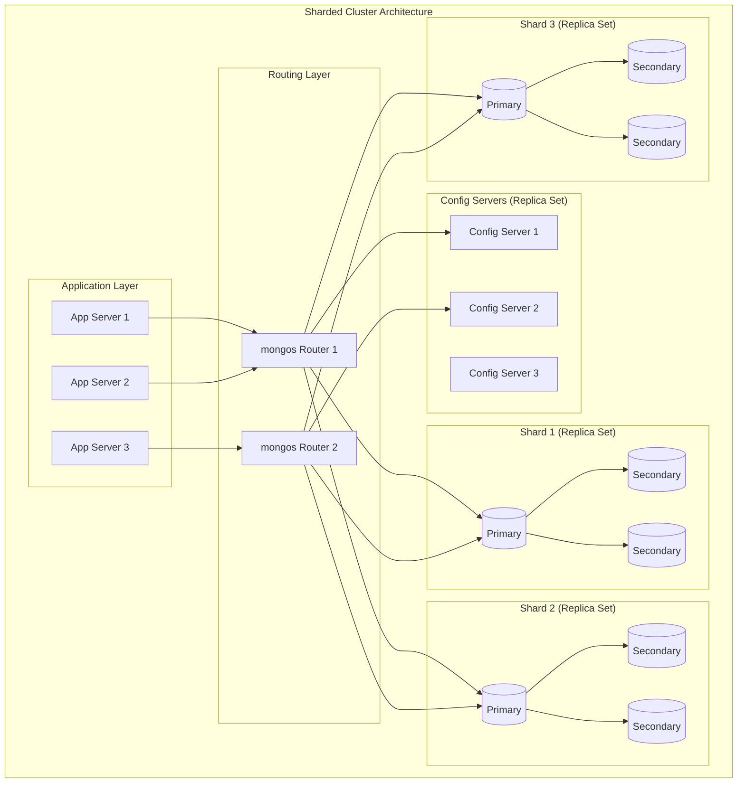
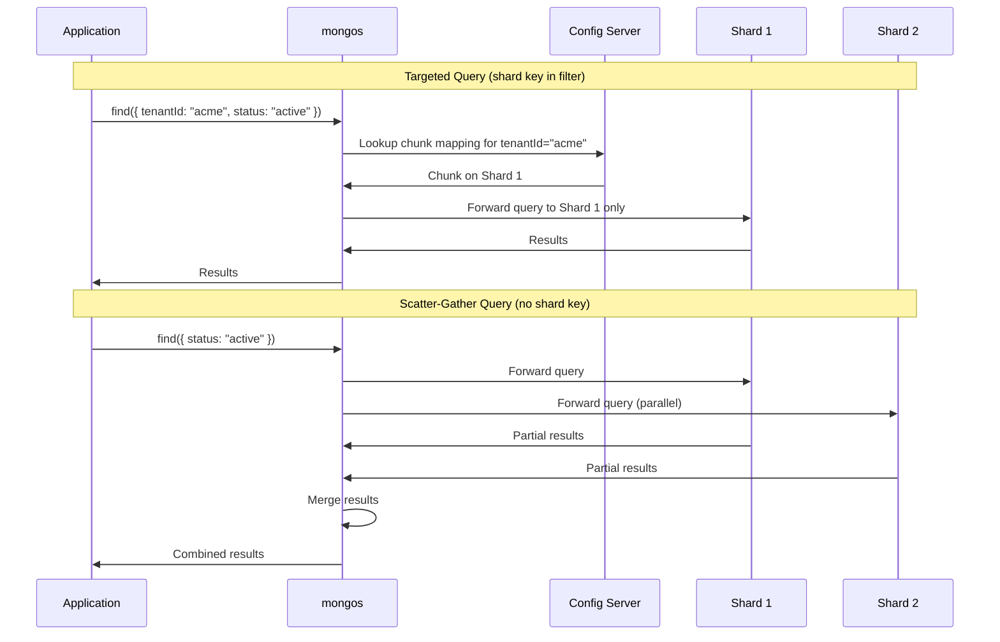
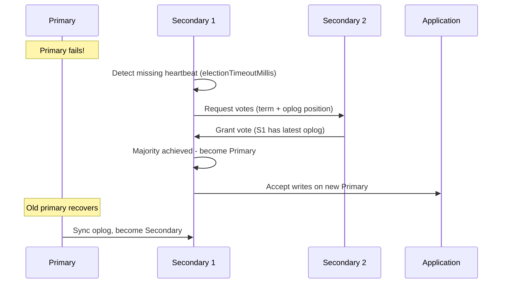

# MongoDB Replication & Sharding

## Quick Reference

- **Replica Set** is a group of mongod instances (minimum 3) maintaining the same data set — one primary accepts writes, secondaries replicate asynchronously
- **Elections** use the Raft-based consensus protocol; a majority of voting members must agree to elect a new primary (requires > N/2 votes)
- **Read Preferences** control which replica set members serve read operations: `primary`, `primaryPreferred`, `secondary`, `secondaryPreferred`, `nearest`
- **Write Concerns** specify the level of acknowledgment: `w:1` (primary only), `w:majority` (majority of data-bearing members), `w:0` (fire-and-forget)
- **Sharding** horizontally partitions data across multiple shards, each being a replica set; the cluster is accessed through `mongos` routers
- **Shard Key** determines how documents are distributed across shards — choose carefully as it cannot be easily changed (resharding available in 5.0+)
- **Hashed shard keys** provide even distribution but sacrifice range query efficiency; **ranged shard keys** support range queries but risk hot spots
- **Balancer** automatically migrates chunks between shards to maintain even data distribution
- **Chunks** are contiguous ranges of shard key values; default max size is 128MB before splitting
- **Zone Sharding** pins data ranges to specific shards for data locality, compliance, or tiered storage requirements

## When to Use

Deploy replica sets for every production MongoDB deployment — even if you don't need read scaling, replica sets provide automatic failover and data redundancy. A three-member replica set (primary + two secondaries) tolerates one node failure while maintaining a majority for elections. For cost-sensitive deployments, use a primary + secondary + arbiter configuration, though this provides less redundancy.

Implement sharding when your dataset exceeds the storage capacity of a single server, when write throughput exceeds what a single primary can handle, or when you need to distribute data geographically. Sharding adds significant operational complexity — don't shard prematurely. A single replica set can handle hundreds of thousands of operations per second and terabytes of data with proper indexing.

Use zone sharding when you have regulatory requirements (EU data must stay in EU), when you want to co-locate data with its consumers for latency reduction, or when implementing tiered storage (hot data on SSD shards, cold data on HDD shards).

Choose hashed shard keys when write distribution is your primary concern and you don't need efficient range queries on the shard key. Choose ranged shard keys when your queries frequently filter on shard key ranges (e.g., time-based queries on a timestamp shard key) and you can tolerate potential hot spots during sequential writes.

## Code Examples

### Replica Set Initialization

```javascript
// Connect to the first mongod instance and initiate the replica set
rs.initiate({
  _id: "rs-production",
  members: [
    { _id: 0, host: "mongo1.example.com:27017", priority: 2 },
    { _id: 1, host: "mongo2.example.com:27017", priority: 1 },
    { _id: 2, host: "mongo3.example.com:27017", priority: 1 }
  ],
  settings: {
    electionTimeoutMillis: 10000,       // 10 seconds to detect primary failure
    heartbeatTimeoutSecs: 10,
    chainingAllowed: true,               // secondaries can replicate from other secondaries
    getLastErrorDefaults: { w: "majority", wtimeout: 5000 }
  }
});

// Add a delayed secondary for point-in-time recovery (1 hour delay)
rs.add({
  host: "mongo4.example.com:27017",
  priority: 0,           // cannot become primary
  votes: 0,             // doesn't participate in elections
  hidden: true,         // invisible to read preferences
  secondaryDelaySecs: 3600  // 1 hour behind primary
});

// Add an arbiter (voting member with no data)
rs.addArb("mongo-arbiter.example.com:27017");

// Check replica set status
rs.status();

// Check replication lag
rs.printSecondaryReplicationInfo();

// Step down the primary (trigger election)
rs.stepDown(60);  // step down for 60 seconds

// Force reconfiguration (when majority is lost)
cfg = rs.conf();
cfg.members = cfg.members.filter(m => m.host !== "failed-node:27017");
rs.reconfig(cfg, { force: true });
```

### Read Preferences and Write Concerns

```javascript
// Application-level read preference configuration (Node.js driver)
const { MongoClient, ReadPreference } = require('mongodb');

const client = new MongoClient('mongodb://mongo1,mongo2,mongo3/mydb?replicaSet=rs-production', {
  readPreference: ReadPreference.SECONDARY_PREFERRED,
  readConcern: { level: 'majority' },
  writeConcern: { w: 'majority', j: true, wtimeout: 5000 }
});

// Per-operation read preference override
const collection = client.db('mydb').collection('orders');

// Read from nearest member (lowest latency)
const recentOrders = await collection
  .find({ status: 'pending' })
  .readPreference('nearest', [{ region: 'us-east' }])  // tag set filtering
  .toArray();

// Strong consistency read (from primary only)
const balance = await collection
  .findOne({ userId: 'user123' }, {
    readPreference: 'primary',
    readConcern: { level: 'linearizable' }  // strongest consistency
  });

// Write with custom write concern
await collection.insertOne(
  { orderId: 'ORD-001', total: 99.99 },
  { writeConcern: { w: 3, j: true, wtimeout: 10000 } }  // wait for 3 members + journal
);

// Causal consistency session (read-your-writes guarantee)
const session = client.startSession({ causalConsistency: true });
await collection.insertOne({ key: 'value' }, { session });
// This read is guaranteed to see the above write, even from a secondary
const doc = await collection.findOne({ key: 'value' }, {
  session,
  readPreference: 'secondary'
});
session.endSession();
```

### Sharded Cluster Setup

```javascript
// Step 1: Configure config server replica set (mongod --configsvr)
// mongod --configsvr --replSet configRS --port 27019 --dbpath /data/configdb

// Step 2: Initialize config server replica set
rs.initiate({
  _id: "configRS",
  configsvr: true,
  members: [
    { _id: 0, host: "config1:27019" },
    { _id: 1, host: "config2:27019" },
    { _id: 2, host: "config3:27019" }
  ]
});

// Step 3: Start mongos router
// mongos --configdb configRS/config1:27019,config2:27019,config3:27019 --port 27017

// Step 4: Add shards (each shard is a replica set)
sh.addShard("shard1RS/shard1a:27018,shard1b:27018,shard1c:27018");
sh.addShard("shard2RS/shard2a:27018,shard2b:27018,shard2c:27018");
sh.addShard("shard3RS/shard3a:27018,shard3b:27018,shard3c:27018");

// Step 5: Enable sharding on database
sh.enableSharding("ecommerce");

// Step 6: Shard a collection with a hashed shard key (even distribution)
sh.shardCollection("ecommerce.orders", { orderId: "hashed" });

// Shard with a ranged compound shard key (supports range queries)
sh.shardCollection("ecommerce.events", { tenantId: 1, timestamp: 1 });

// Check sharding status
sh.status();

// Check chunk distribution
db.orders.getShardDistribution();

// View chunk details
use config;
db.chunks.find({ ns: "ecommerce.orders" }).sort({ min: 1 });
```

### Shard Key Selection Strategies

```javascript
// Strategy 1: Hashed shard key for write-heavy workloads
// Pros: Even distribution, no hot spots
// Cons: Range queries scatter to all shards
sh.shardCollection("analytics.events", { eventId: "hashed" });

// Strategy 2: Compound shard key for multi-tenant
// Pros: Tenant queries target single shard, good distribution
// Cons: Large tenants may create hot shards
sh.shardCollection("saas.documents", { tenantId: 1, createdAt: 1 });

// Strategy 3: Compound key with hashed prefix for time-series
// Avoids the "hot shard" problem of monotonically increasing timestamps
sh.shardCollection("iot.readings", { deviceId: "hashed", timestamp: 1 });

// Analyze shard key cardinality before choosing
db.orders.aggregate([
  { $group: { _id: "$customerId", count: { $sum: 1 } } },
  { $group: {
    _id: null,
    totalDistinct: { $sum: 1 },
    maxFrequency: { $max: "$count" },
    avgFrequency: { $avg: "$count" }
  }}
]);
// Good shard key: high cardinality, low frequency, non-monotonic

// Resharding (MongoDB 5.0+) - change shard key online
db.adminCommand({
  reshardCollection: "ecommerce.orders",
  key: { customerId: 1, orderId: 1 }  // new shard key
});
```

### Zone Sharding Configuration

```javascript
// Add zone tags to shards
sh.addShardTag("shard1RS", "US");
sh.addShardTag("shard2RS", "EU");
sh.addShardTag("shard3RS", "APAC");

// Define zone ranges for data locality
sh.addTagRange(
  "global.users",
  { region: "us", orderId: MinKey },
  { region: "us", orderId: MaxKey },
  "US"
);

sh.addTagRange(
  "global.users",
  { region: "eu", orderId: MinKey },
  { region: "eu", orderId: MaxKey },
  "EU"
);

sh.addTagRange(
  "global.users",
  { region: "apac", orderId: MinKey },
  { region: "apac", orderId: MaxKey },
  "APAC"
);

// Tiered storage zones: hot data on SSD, cold on HDD
sh.addShardTag("shard-ssd-1", "HOT");
sh.addShardTag("shard-ssd-2", "HOT");
sh.addShardTag("shard-hdd-1", "COLD");

// Recent data on SSD shards
sh.addTagRange(
  "logs.events",
  { timestamp: new Date("2024-01-01") },
  { timestamp: MaxKey },
  "HOT"
);

// Historical data on HDD shards
sh.addTagRange(
  "logs.events",
  { timestamp: MinKey },
  { timestamp: new Date("2024-01-01") },
  "COLD"
);

// Verify zone configuration
sh.status();
use config;
db.tags.find();
```

## Architecture / Diagrams







## Common Pitfalls

**Choosing a low-cardinality shard key**: A shard key with few distinct values (e.g., `status` with 5 possible values) creates a maximum of 5 chunks that can never be split further. This means data cannot be distributed across more than 5 shards, and the balancer cannot resolve uneven distribution. Always choose shard keys with cardinality at least 10x your planned shard count. Verify with `db.collection.distinct("field").length`.

**Monotonically increasing shard keys creating hot shards**: Using `_id` (ObjectId) or a timestamp as a ranged shard key directs all new writes to the shard owning the maximum chunk range. This creates a single hot shard while others sit idle. Solutions: use a hashed shard key, prepend a high-cardinality field (like tenantId), or use a compound key where the first field provides distribution.

**Scatter-gather queries killing performance**: If your most frequent queries don't include the shard key in the filter, every query hits every shard (scatter-gather). This negates the performance benefits of sharding and adds network overhead. Design your shard key around your most common query patterns. Use `explain()` to verify queries are targeted to specific shards.

**Write concern w:1 with replica sets**: Using `w:1` (acknowledge from primary only) means data can be lost if the primary fails before replicating to secondaries. The new primary after election won't have those writes. For any data you cannot afford to lose, use `w:"majority"`. The latency penalty is typically 1-5ms for same-datacenter replicas.

**Oversized chunks preventing balancing**: If documents are very large or the shard key range within a chunk has low cardinality, chunks can grow beyond the maximum size (128MB) and become "jumbo chunks" that the balancer cannot move. Monitor for jumbo chunks with `db.chunks.find({ jumbo: true })` and either split them manually or choose a shard key with finer granularity.

**Not configuring read concern with read preference**: Reading from secondaries with `readPreference: 'secondary'` but without `readConcern: 'majority'` can return data that may be rolled back if the secondary's oplog entries haven't been majority-committed. For consistent reads from secondaries, always pair with `readConcern: 'majority'` or use causal consistency sessions.

## Real-World Use Cases

**Multi-tenant SaaS platform**: A B2B SaaS company shards their document store by `tenantId` as the first field in a compound shard key (`{ tenantId: 1, createdAt: 1 }`). This ensures all queries for a single tenant are routed to one shard (targeted queries), while the `createdAt` field provides ordering within each tenant's data. Large enterprise tenants that outgrow a single shard are handled by resharding to `{ tenantId: "hashed" }` for that collection, distributing the tenant's data across multiple shards at the cost of scatter-gather for tenant-specific queries.

**IoT telemetry ingestion**: An IoT platform ingests 2 million sensor readings per second across 500,000 devices. They shard by `{ deviceId: "hashed" }` to distribute writes evenly. Each shard is a 3-member replica set with NVMe storage. The hashed key ensures no single shard becomes a write bottleneck regardless of which devices are most active. Time-range queries for a specific device are efficient because they target a single shard (deviceId is in the filter), then use a secondary index on `timestamp` within that shard.

**Global content delivery with zone sharding**: A media company stores user-generated content with zone sharding based on the creator's region. US content lives on US-based shards, EU content on EU shards (GDPR compliance), and APAC content on Singapore-based shards. The mongos routers in each region connect to all shards but primarily serve local data. Cross-region reads (e.g., a US user viewing EU content) are handled transparently by mongos routing to the EU shard, with acceptable latency for this less-common access pattern.

**Financial transaction ledger**: A fintech company uses a 5-shard cluster for their transaction ledger with `w:"majority"` write concern and `readConcern:"majority"` for all operations. The shard key is `{ accountId: 1, transactionDate: 1 }`, ensuring all transactions for an account are co-located for efficient balance calculations. A hidden, delayed secondary (1-hour delay) on each shard provides protection against application-level data corruption without impacting normal operations.

## Interview Questions

**Q: How does a MongoDB replica set election work, and what happens during an election?**

A: When a secondary detects that the primary is unreachable (no heartbeat for `electionTimeoutMillis`, default 10 seconds), it initiates an election. The candidate increments its term number and requests votes from all other voting members. Each member votes for at most one candidate per term, preferring the candidate with the most recent oplog entry. A candidate needs votes from a strict majority (> N/2) of voting members to win. During the election (typically 1-5 seconds), the replica set has no primary — all write operations fail and must be retried by the application. Read operations continue on secondaries if the read preference allows it. After election, the new primary applies any oplog entries it received but the old primary hadn't replicated, potentially rolling back uncommitted writes on the old primary when it rejoins.

**Q: What makes a good shard key, and what are the consequences of a bad choice?**

A: A good shard key has three properties: (1) **High cardinality** — many distinct values to allow fine-grained chunk splitting and distribution; (2) **Low frequency** — no single value dominates, preventing jumbo chunks; (3) **Non-monotonic** — values don't always increase, avoiding hot shard problems. It should also align with your query patterns so most queries include the shard key (targeted queries). A bad shard key causes: uneven data distribution (some shards full, others empty), hot shards (all writes go to one shard), jumbo chunks that can't be split or moved, and scatter-gather queries that hit every shard. Prior to MongoDB 5.0, changing a shard key required migrating to a new collection. Now resharding is possible online but is still a heavy operation.

**Q: Explain the difference between write concern w:1, w:majority, and w:0.**

A: `w:0` (unacknowledged) returns immediately without waiting for any confirmation — the driver doesn't even check for network errors. Use only for non-critical telemetry where speed matters more than durability. `w:1` waits for the primary to acknowledge the write to its in-memory journal, but doesn't wait for replication. If the primary crashes before replicating, the write is lost when a new primary is elected. `w:"majority"` waits until a majority of data-bearing replica set members have acknowledged the write (written to their journals). This guarantees the write survives any single-node failure and won't be rolled back during elections. The latency cost of `w:"majority"` over `w:1` is typically the replication lag to the nearest secondary (1-10ms in the same datacenter). For financial or critical data, always use `w:"majority"` with `j:true`.

**Q: How does the MongoDB balancer work, and when might it cause problems?**

A: The balancer runs on the primary of the config server replica set and monitors chunk distribution across shards. When the difference in chunk count between the most-loaded and least-loaded shard exceeds a threshold (8 chunks for < 20 total, 2 for collections with few chunks), it initiates chunk migrations. A migration copies the chunk's documents from the source to the destination shard, then updates the config server's metadata. During migration, reads and writes continue normally (the source shard serves the chunk until migration completes). Problems arise when: migrations compete with application I/O (mitigate with balancer windows), large chunks take long to migrate causing temporary inconsistency windows, or frequent migrations indicate a poor shard key choice. You can set balancer windows (`sh.setBalancerState()`) to restrict migrations to off-peak hours.

**Q: What is causal consistency in MongoDB and when do you need it?**

A: Causal consistency guarantees that operations within a client session observe a causally consistent view of the data — specifically, read-your-writes, monotonic reads, and monotonic writes. Without causal consistency, a client that writes to the primary and then reads from a secondary might not see its own write (because the secondary hasn't replicated it yet). With a causally consistent session, MongoDB tracks the cluster time and operation time, ensuring that reads from secondaries only return data that includes all writes from that session. You need it when: reading from secondaries after writes (common with `readPreference: secondaryPreferred`), implementing read-after-write consistency in distributed applications, or when multiple operations must see a consistent progression of state. Enable it with `client.startSession({ causalConsistency: true })`.

## Production Tips

**Replica set member sizing**: All data-bearing members should have identical hardware specifications. If a secondary has less RAM or slower disks, it will lag during peak load and may become a bottleneck if elected primary. Use `priority: 0` for members with reduced specs (analytics replicas, delayed members) to prevent them from becoming primary.

**Monitoring oplog window**: The oplog is a capped collection that determines how far behind a secondary can fall and still catch up without a full resync. Monitor the oplog window (time span covered by the oplog) with `rs.printReplicationInfo()`. If your oplog window is 24 hours and a secondary goes offline for 25 hours, it requires a full initial sync (copying all data). Size the oplog to cover at least 2x your longest expected maintenance window. Increase with `replSetResizeOplog`.

**Balancer window configuration**: In production, restrict the balancer to off-peak hours to avoid migration I/O competing with application workload. Use `sh.setBalancerState(true/false)` or configure a window. Monitor migration activity with `sh.isBalancerRunning()` and check for failed migrations in the config database. Set `_secondaryThrottle` to control how aggressively migrations write to the destination shard.

**Connection string best practices**: Always include all mongos routers (or all replica set members) in the connection string for automatic failover. Use `retryWrites=true` and `retryReads=true` (default in 4.2+) to handle transient failures during elections or migrations transparently. Set appropriate `serverSelectionTimeoutMS` (default 30s) and `connectTimeoutMS` based on your SLA requirements.

## Related Topics

- [MongoDB Schema Design Patterns](./schema-design-patterns.md) — Document modeling patterns and anti-patterns
- [MongoDB and Document Databases](./mongodb.md) — Aggregation pipelines, indexing, and core MongoDB features
- [System Design - Sharding](../../system-design/system-design/database-sharding.md) — General sharding concepts and strategies
