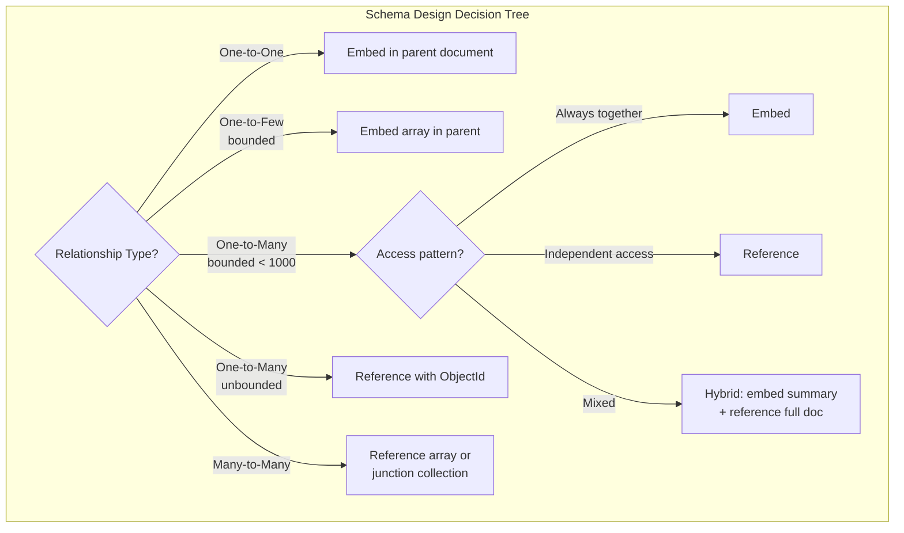
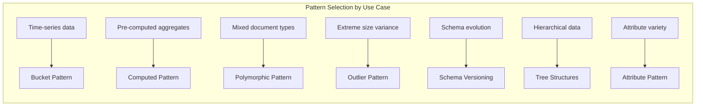

# MongoDB Schema Design Patterns

## Quick Reference

- **Embedding** stores related data in a single document for atomic reads; best when data is accessed together and the embedded array is bounded
- **Referencing** stores related data in separate collections with ObjectId links; best for many-to-many relationships or unbounded growth
- **Polymorphic Pattern** stores documents with different shapes in the same collection, using a discriminator field to identify the type
- **Bucket Pattern** groups time-series or sequential data into fixed-size buckets (e.g., 1 hour of readings per document) to reduce document count
- **Outlier Pattern** handles documents that exceed normal size by flagging them and storing overflow in separate documents
- **Computed Pattern** pre-computes and stores derived values (aggregations, counts) to avoid expensive real-time calculations
- **Schema Versioning** adds a version field to documents, allowing gradual migration between schema shapes without downtime
- **Tree Structures** can be modeled as materialized paths, nested sets, parent references, or child references depending on query patterns
- **16MB document size limit** is a hard constraint — design schemas to stay well under this limit (target < 1MB for performance)
- **Anti-patterns**: massive unbounded arrays, unnecessary normalization, storing large binary data inline, deep nesting beyond 3 levels

## When to Use

Use embedding when the related data has a one-to-one or one-to-few relationship, is always accessed together with the parent document, and has a bounded size. For example, embedding a shipping address within an order document is ideal — the address is always read with the order, there's exactly one per order, and it never grows.

Use referencing when the related data has a one-to-many or many-to-many relationship with unbounded growth, when the related data is frequently accessed independently, or when the embedded data would push documents near the 16MB limit. For example, comments on a popular blog post should be referenced — a viral post could accumulate millions of comments.

Apply the Bucket Pattern for time-series data, IoT sensor readings, or any scenario where you'd otherwise create millions of tiny documents. Grouping 60 sensor readings into one document (one per minute for an hour) reduces collection size by 60x and dramatically improves query performance for time-range queries.

The Computed Pattern is essential when your application frequently displays aggregated data (counts, sums, averages) that would otherwise require expensive aggregation pipeline queries on every page load. Pre-compute these values on write and store them alongside the source data.

## Code Examples

### Embedding vs Referencing

```javascript
// EMBEDDING: One-to-few relationship (address within user)
// Good: always accessed together, bounded, atomic updates
{
  _id: ObjectId("user123"),
  name: "Alice Johnson",
  email: "alice@example.com",
  addresses: [
    {
      type: "home",
      street: "123 Main St",
      city: "Portland",
      state: "OR",
      zip: "97201",
      isPrimary: true
    },
    {
      type: "work",
      street: "456 Tech Ave",
      city: "Portland",
      state: "OR",
      zip: "97204",
      isPrimary: false
    }
  ],
  preferences: {
    theme: "dark",
    notifications: { email: true, sms: false },
    language: "en"
  }
}

// REFERENCING: One-to-many with unbounded growth (orders reference user)
// orders collection
{
  _id: ObjectId("order789"),
  userId: ObjectId("user123"),  // reference to users collection
  items: [
    { productId: ObjectId("prod456"), name: "Widget", qty: 2, price: 29.99 },
    { productId: ObjectId("prod789"), name: "Gadget", qty: 1, price: 49.99 }
  ],
  total: 109.97,
  status: "shipped",
  createdAt: ISODate("2024-03-15T10:30:00Z")
}

// HYBRID: Embed summary, reference details
// Embed the most-accessed fields, reference the full document
{
  _id: ObjectId("order789"),
  customer: {
    _id: ObjectId("user123"),
    name: "Alice Johnson",      // denormalized for display
    email: "alice@example.com"  // denormalized for notifications
  },
  // Full customer details fetched via userId when needed
  itemCount: 3,
  total: 109.97,
  status: "shipped"
}
```

### Polymorphic Pattern

```javascript
// Single collection storing different product types
// All share common fields; type-specific fields vary
db.products.insertMany([
  {
    _id: ObjectId("prod001"),
    type: "book",
    name: "Design Patterns",
    price: 49.99,
    category: "technology",
    // Book-specific fields
    author: "Gang of Four",
    isbn: "978-0201633610",
    pages: 395,
    publisher: "Addison-Wesley"
  },
  {
    _id: ObjectId("prod002"),
    type: "electronics",
    name: "Wireless Headphones",
    price: 199.99,
    category: "audio",
    // Electronics-specific fields
    brand: "SoundMax",
    warranty_months: 24,
    specs: {
      battery_hours: 30,
      bluetooth: "5.3",
      weight_grams: 250
    }
  },
  {
    _id: ObjectId("prod003"),
    type: "clothing",
    name: "Performance T-Shirt",
    price: 34.99,
    category: "athletic",
    // Clothing-specific fields
    sizes: ["S", "M", "L", "XL"],
    colors: ["black", "navy", "gray"],
    material: "polyester blend",
    gender: "unisex"
  }
]);

// Query all products (polymorphic - works regardless of type)
db.products.find({ price: { $lt: 50 } });

// Query type-specific fields
db.products.find({ type: "book", pages: { $gt: 300 } });

// Index strategy for polymorphic collections
db.products.createIndex({ type: 1, category: 1 });
db.products.createIndex({ type: 1, "specs.bluetooth": 1 }, { sparse: true });
```

### Bucket Pattern

```javascript
// ANTI-PATTERN: One document per sensor reading (millions of tiny documents)
// { sensorId: "temp-01", value: 22.5, timestamp: ISODate("2024-03-15T10:00:01Z") }
// { sensorId: "temp-01", value: 22.6, timestamp: ISODate("2024-03-15T10:00:02Z") }
// ... millions more

// BUCKET PATTERN: Group readings into hourly buckets
{
  _id: ObjectId("bucket001"),
  sensorId: "temp-01",
  bucketStart: ISODate("2024-03-15T10:00:00Z"),
  bucketEnd: ISODate("2024-03-15T11:00:00Z"),
  count: 3600,  // readings in this bucket
  measurements: [
    { timestamp: ISODate("2024-03-15T10:00:01Z"), value: 22.5 },
    { timestamp: ISODate("2024-03-15T10:00:02Z"), value: 22.6 },
    { timestamp: ISODate("2024-03-15T10:00:03Z"), value: 22.4 },
    // ... up to 3600 readings per hour
  ],
  // Pre-computed statistics for the bucket
  stats: {
    min: 21.8,
    max: 23.2,
    avg: 22.5,
    sum: 81000
  }
}

// Insert a new reading into the current bucket
db.sensorData.updateOne(
  {
    sensorId: "temp-01",
    count: { $lt: 3600 },  // bucket not full
    bucketStart: {
      $gte: new Date(new Date().setMinutes(0, 0, 0))  // current hour
    }
  },
  {
    $push: { measurements: { timestamp: new Date(), value: 22.7 } },
    $inc: { count: 1, "stats.sum": 22.7 },
    $min: { "stats.min": 22.7 },
    $max: { "stats.max": 22.7 },
    $setOnInsert: {
      sensorId: "temp-01",
      bucketStart: new Date(new Date().setMinutes(0, 0, 0)),
      bucketEnd: new Date(new Date().setMinutes(0, 0, 0) + 3600000)
    }
  },
  { upsert: true }
);

// Query: average temperature for a sensor over a day (reads 24 documents, not 86400)
db.sensorData.aggregate([
  { $match: {
    sensorId: "temp-01",
    bucketStart: { $gte: ISODate("2024-03-15"), $lt: ISODate("2024-03-16") }
  }},
  { $group: {
    _id: "$sensorId",
    avgTemp: { $avg: "$stats.avg" },
    minTemp: { $min: "$stats.min" },
    maxTemp: { $max: "$stats.max" }
  }}
]);
```

### Outlier Pattern

```javascript
// Problem: Most users have 10-50 followers, but celebrities have millions
// Embedding all followers would exceed 16MB for celebrities

// Normal user (followers embedded)
{
  _id: ObjectId("user001"),
  username: "regular_user",
  followers: [
    ObjectId("user010"), ObjectId("user011"), ObjectId("user012")
    // ... up to ~1000 followers embedded
  ],
  followerCount: 45,
  hasOverflow: false
}

// Celebrity user (flagged as outlier, overflow in separate collection)
{
  _id: ObjectId("user002"),
  username: "celebrity",
  followers: [
    // First 1000 followers embedded for common operations
    ObjectId("user100"), ObjectId("user101"), // ...
  ],
  followerCount: 2500000,
  hasOverflow: true  // Flag indicating overflow documents exist
}

// Overflow collection for outliers
// followers_overflow collection
{
  _id: ObjectId("overflow001"),
  userId: ObjectId("user002"),
  page: 1,
  followers: [
    ObjectId("user1001"), ObjectId("user1002"), // ... next 1000
  ]
}

// Query: get all followers (handles both normal and outlier)
async function getFollowers(userId) {
  const user = await db.users.findOne({ _id: userId });

  if (!user.hasOverflow) {
    return user.followers;
  }

  // Fetch overflow pages
  const overflowDocs = await db.followers_overflow
    .find({ userId: userId })
    .sort({ page: 1 })
    .toArray();

  return [
    ...user.followers,
    ...overflowDocs.flatMap(doc => doc.followers)
  ];
}
```

### Computed Pattern

```javascript
// Problem: Displaying product ratings requires aggregating all reviews every time
// Solution: Pre-compute and store the aggregation

// Product with computed rating stats
{
  _id: ObjectId("prod001"),
  name: "Wireless Headphones",
  price: 199.99,
  // Computed fields (updated on each review write)
  rating: {
    average: 4.3,
    count: 1247,
    distribution: { 1: 23, 2: 45, 3: 156, 4: 489, 5: 534 }
  },
  // Computed sales stats (updated by background job)
  sales: {
    totalUnits: 15420,
    last30Days: 892,
    revenue: 3072780.00
  }
}

// When a new review is submitted, atomically update computed fields
db.products.updateOne(
  { _id: ObjectId("prod001") },
  [
    {
      $set: {
        "rating.count": { $add: ["$rating.count", 1] },
        "rating.distribution.4": { $add: ["$rating.distribution.4", 1] },
        "rating.average": {
          $divide: [
            { $add: [
              { $multiply: ["$rating.average", "$rating.count"] },
              4  // new rating value
            ]},
            { $add: ["$rating.count", 1] }
          ]
        }
      }
    }
  ]
);

// Background job to recompute (handles drift from failed updates)
db.reviews.aggregate([
  { $match: { productId: ObjectId("prod001") } },
  { $group: {
    _id: "$productId",
    average: { $avg: "$rating" },
    count: { $sum: 1 },
    dist: { $push: "$rating" }
  }},
  { $merge: { into: "products", on: "_id", whenMatched: "merge" } }
]);
```

### Schema Versioning Pattern

```javascript
// Version 1: Original schema
{
  _id: ObjectId("user001"),
  schemaVersion: 1,
  name: "Alice Johnson",
  address: "123 Main St, Portland, OR 97201"  // single string
}

// Version 2: Structured address
{
  _id: ObjectId("user002"),
  schemaVersion: 2,
  name: "Bob Smith",
  address: {
    street: "456 Oak Ave",
    city: "Seattle",
    state: "WA",
    zip: "98101",
    country: "US"
  }
}

// Version 3: Added phone numbers array
{
  _id: ObjectId("user003"),
  schemaVersion: 3,
  firstName: "Carol",
  lastName: "Davis",
  address: {
    street: "789 Pine Rd",
    city: "Denver",
    state: "CO",
    zip: "80201",
    country: "US"
  },
  phones: [
    { type: "mobile", number: "+1-555-0123", primary: true },
    { type: "work", number: "+1-555-0456", primary: false }
  ]
}

// Application-level migration handler
function normalizeUser(doc) {
  switch (doc.schemaVersion) {
    case 1:
      // Parse address string into structured format
      const parts = doc.address.split(', ');
      const [city, stateZip] = [parts[1], parts[2]];
      const [state, zip] = stateZip.split(' ');
      return {
        ...doc,
        schemaVersion: 3,
        firstName: doc.name.split(' ')[0],
        lastName: doc.name.split(' ').slice(1).join(' '),
        address: { street: parts[0], city, state, zip, country: 'US' },
        phones: []
      };
    case 2:
      return {
        ...doc,
        schemaVersion: 3,
        firstName: doc.name.split(' ')[0],
        lastName: doc.name.split(' ').slice(1).join(' '),
        phones: []
      };
    case 3:
      return doc;  // current version
  }
}

// Lazy migration: update on read
async function getUser(userId) {
  const doc = await db.users.findOne({ _id: userId });
  if (doc.schemaVersion < 3) {
    const normalized = normalizeUser(doc);
    await db.users.replaceOne({ _id: userId }, normalized);
    return normalized;
  }
  return doc;
}
```

### Tree Structures

```javascript
// MATERIALIZED PATHS: Store full ancestry path as a string
// Best for: subtree queries, finding all ancestors
{
  _id: "electronics",
  name: "Electronics",
  path: ",root,electronics,",
  depth: 1
}
{
  _id: "phones",
  name: "Phones",
  path: ",root,electronics,phones,",
  depth: 2
}
{
  _id: "smartphones",
  name: "Smartphones",
  path: ",root,electronics,phones,smartphones,",
  depth: 3
}

// Find all descendants of "electronics"
db.categories.find({ path: /,electronics,/ });

// Find all ancestors of "smartphones"
const doc = await db.categories.findOne({ _id: "smartphones" });
const ancestorIds = doc.path.split(',').filter(Boolean);
db.categories.find({ _id: { $in: ancestorIds } });

// Index for path queries
db.categories.createIndex({ path: 1 });

// PARENT REFERENCE: Simple, good for finding parent
{
  _id: "smartphones",
  name: "Smartphones",
  parent: "phones"
}

// CHILD REFERENCE: Good for finding children
{
  _id: "electronics",
  name: "Electronics",
  children: ["phones", "computers", "tablets"]
}

// NESTED SETS: Optimal for read-heavy trees (rare updates)
{
  _id: "electronics",
  name: "Electronics",
  left: 1,
  right: 12  // all descendants have left > 1 AND right < 12
}
{
  _id: "phones",
  name: "Phones",
  left: 2,
  right: 7
}
{
  _id: "smartphones",
  name: "Smartphones",
  left: 3,
  right: 4
}

// Find all descendants using nested sets (single query, no recursion)
db.categories.find({
  left: { $gt: 1 },   // electronics.left
  right: { $lt: 12 }  // electronics.right
});
```

## Architecture / Diagrams





## Common Pitfalls

**Unbounded array growth**: Embedding an array that grows without limit (e.g., all comments on a post, all events for a user) will eventually hit the 16MB document limit and cause write failures. Even before hitting the limit, large arrays degrade performance because MongoDB must rewrite the entire document on every array push. Rule of thumb: if an array can grow beyond a few hundred elements, use a separate collection with a reference.

**Over-normalizing like a relational database**: Splitting every entity into its own collection and joining with `$lookup` negates MongoDB's strengths. Each `$lookup` is essentially a left outer join that requires additional network round-trips in sharded clusters. Embrace denormalization for data that's read together — the storage cost of duplicated data is almost always cheaper than the performance cost of joins.

**Massive documents causing working set pressure**: Documents larger than a few KB consume disproportionate buffer cache space. If your working set (frequently accessed documents) doesn't fit in RAM because documents are bloated with rarely-accessed embedded data, query performance degrades dramatically. Keep hot documents small; move cold or large data (file attachments, full history) to separate collections.

**Not using the Subset Pattern for large embedded arrays**: When you embed 1000 items but only display the latest 10 on the UI, you're transferring 100x more data than needed on every read. Use the Subset Pattern: embed only the most recent/relevant N items in the main document, and store the full history in a separate collection. Update both atomically using transactions or accept eventual consistency.

**Ignoring document growth and padding**: When documents grow (array pushes, new fields), MongoDB may need to relocate them on disk if they outgrow their allocated space. This causes write amplification and fragmentation. Design schemas with predictable document sizes. If growth is expected, pre-allocate space or use the Bucket Pattern to create fixed-size documents.

**Deep nesting beyond 3 levels**: Deeply nested documents (e.g., `order.items[0].variants[2].options[1].value`) are difficult to index, query, and update atomically. MongoDB's dot notation for updates becomes unwieldy, and positional operators (`$`) only work on the first matching array element. Flatten nested structures or use separate collections for deeply nested entities.

## Real-World Use Cases

**E-commerce product catalog with Polymorphic Pattern**: An online marketplace stores electronics, clothing, books, and food items in a single `products` collection. Each product type has different attributes (electronics have specs, clothing has sizes/colors, books have ISBN/author). The polymorphic pattern with a `type` discriminator field allows a single collection with type-specific indexes (`sparse: true` for type-specific fields). The product listing page queries all types uniformly, while detail pages render type-specific templates based on the discriminator.

**Social media feed with Computed + Bucket Patterns**: A social platform stores post engagement metrics using the Computed Pattern — each post document contains pre-computed `likeCount`, `commentCount`, and `shareCount` updated atomically on each interaction. The activity feed uses the Bucket Pattern, grouping a user's feed items into daily buckets (one document per user per day containing up to 200 feed items). This reduces the feed query from scanning thousands of individual activity documents to reading 1-7 bucket documents for a week's feed.

**Healthcare records with Schema Versioning**: A health records system evolved its patient schema through 5 versions over 3 years (adding structured medications, splitting name fields, adding insurance arrays). Rather than migrating 50 million patient records in a single operation, they use schema versioning with lazy migration — documents are upgraded to the latest schema when accessed. A background job gradually migrates cold records during off-peak hours. The application layer handles all versions transparently through a normalization function.

**Content management with Tree Structures**: A CMS uses materialized paths for its category hierarchy (5 levels deep, 10,000 categories). The path field enables efficient queries for "all articles in Electronics and subcategories" with a single regex query on the path index. Breadcrumb generation extracts ancestor IDs directly from the path string without additional queries. Category moves update the path prefix for the moved subtree in a single `updateMany` operation.

## Interview Questions

**Q: When would you choose embedding over referencing in MongoDB?**

A: Embed when: (1) the relationship is one-to-one or one-to-few with a bounded upper limit; (2) the embedded data is always accessed with the parent (no independent access pattern); (3) updates to the embedded data are infrequent or can be done atomically with the parent; (4) the embedded data doesn't push the document near 16MB. Reference when: (1) the relationship is one-to-many with unbounded growth; (2) the related data is frequently accessed independently; (3) many-to-many relationships exist; (4) the related data is large and would bloat the parent document. The hybrid approach (embed a summary, reference the full document) works well when you need fast reads of key fields but the full related data is large or independently accessed.

**Q: Explain the Bucket Pattern and when you'd use it over individual documents.**

A: The Bucket Pattern groups related documents into fixed-size containers. Instead of one document per event (e.g., one per sensor reading per second = 86,400 documents/day/sensor), you create one document per time bucket (e.g., one per hour = 24 documents/day/sensor). Each bucket contains an array of measurements plus pre-computed statistics (min, max, avg, count). Benefits: 60x fewer documents reduces index size and improves query performance; pre-computed stats enable fast aggregations without scanning individual readings; time-range queries read fewer documents. Use it for: IoT telemetry, financial tick data, user activity logs, or any time-series data with high write frequency. The trade-off is more complex insert logic (upsert into current bucket) and potential for uneven bucket sizes if data arrives irregularly.

**Q: How do you handle schema changes in MongoDB without downtime?**

A: Use the Schema Versioning Pattern: add a `schemaVersion` field to every document. When the schema evolves, increment the version for new documents but don't migrate existing ones immediately. The application layer includes a normalization function that transforms any version to the current expected shape on read. Optionally, write the normalized version back (lazy migration). For bulk migration, run a background process during off-peak hours that reads old-version documents in batches and updates them. This approach provides zero-downtime schema evolution because: old and new documents coexist in the same collection, the application handles both transparently, and migration happens gradually without locking. Combine with MongoDB's schema validation (`$jsonSchema`) set to `warn` mode during transition periods to log non-conforming documents without rejecting writes.

**Q: What are the anti-patterns in MongoDB schema design?**

A: The major anti-patterns are: (1) **Massive arrays** — embedding unbounded arrays that grow indefinitely, eventually hitting 16MB or causing write amplification on every push; (2) **Unnecessary normalization** — splitting data into many collections and using `$lookup` everywhere, negating MongoDB's document model advantages; (3) **Bloated documents** — storing large binary data (images, files) inline instead of using GridFS or external storage; (4) **Deep nesting** — documents nested 4+ levels deep that are impossible to index and painful to update with positional operators; (5) **No schema at all** — treating MongoDB as truly "schemaless" without any structure, leading to inconsistent data that breaks application logic; (6) **Using MongoDB as a queue** — polling a collection for unprocessed documents instead of using a proper message queue; (7) **Storing computed values without refresh logic** — denormalized counts/sums that drift from reality because the update logic doesn't handle all edge cases.

**Q: How would you model a many-to-many relationship in MongoDB?**

A: Three approaches depending on the access pattern: (1) **Embed array of references on both sides** — store an array of related IDs in both documents. Works when both sides are bounded (e.g., students and courses where a student takes < 50 courses and a course has < 500 students). (2) **Embed on the side you query most** — if you always query "which courses does this student take?" but rarely "which students are in this course?", embed course references only in the student document. (3) **Junction collection** — create a separate collection with documents like `{ studentId, courseId, enrolledAt, grade }`. This is best when the relationship itself has attributes, when both sides are unbounded, or when you need to query the relationships independently. In practice, most many-to-many relationships in MongoDB use approach 1 or 2 with denormalized summary data to avoid joins.

## Production Tips

**Document size monitoring**: Set up alerts when any document exceeds 5MB (well before the 16MB limit). Query for large documents periodically: `db.collection.find({ $expr: { $gt: [{ $bsonSize: "$$ROOT" }, 5000000] } })`. Large documents indicate an unbounded array or embedded data that should be refactored into a separate collection.

**Index strategy for polymorphic collections**: Use partial indexes with filter expressions matching the document type. For example, `db.products.createIndex({ "specs.cpu": 1 }, { partialFilterExpression: { type: "laptop" } })` creates a small, efficient index only for laptop documents. This avoids indexing null values for documents of other types and keeps index sizes manageable.

**Denormalization consistency**: When you denormalize data (e.g., storing customer name in order documents), implement a change stream listener that propagates updates to all denormalized copies. Accept that denormalized data may be briefly stale (eventual consistency) and design your UI to handle this gracefully. Run periodic reconciliation jobs to catch any missed updates.

**Schema validation in production**: Use MongoDB's `$jsonSchema` validator with `validationAction: "warn"` initially to log non-conforming documents without rejecting writes. Once you're confident the schema is correct, switch to `validationAction: "error"` for strict enforcement. This prevents data quality issues from accumulating over time while allowing safe rollout.

## Related Topics

- [MongoDB Replication & Sharding](./replication-and-sharding.md) — Replica sets, sharding architecture, and distributed operations
- [MongoDB and Document Databases](./mongodb.md) — Aggregation pipelines, indexing, and core MongoDB features
- [SQL Design Patterns](../sql-foundations/database-design-patterns.md) — Relational schema design for comparison
