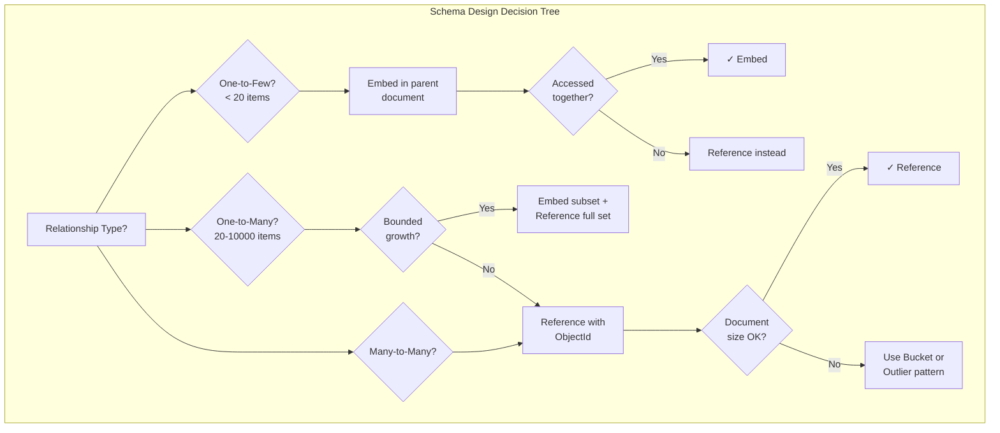
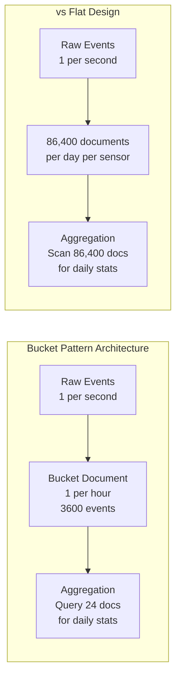

# Schema Design

MongoDB schema design is fundamentally different from relational database design — instead of normalizing data across tables and joining at query time, MongoDB encourages denormalization and embedding related data within documents to optimize for the application's access patterns. The key insight is that schema design in MongoDB is driven by how the application reads and writes data, not by the logical relationships between entities. A well-designed MongoDB schema can serve complex queries with a single document read (no joins), while a poorly designed schema forces multiple round-trips and application-level joins that negate MongoDB's performance advantages. The document model offers flexibility that relational schemas cannot match: polymorphic collections where documents in the same collection have different structures, schema versioning that allows gradual migration without downtime, and nested documents that represent one-to-few relationships without separate collections. However, this flexibility requires discipline — without the guardrails of foreign keys and normalization rules, it's easy to create schemas that are difficult to query, impossible to index efficiently, or that grow documents beyond the 16MB BSON limit.

## Quick Reference

- **Embedding**: Store related data in nested documents/arrays within the parent document; optimal for one-to-few relationships and data accessed together
- **Referencing**: Store ObjectId references to documents in other collections; necessary for one-to-many/many-to-many relationships and independently accessed data
- **16MB document limit**: Maximum BSON document size; design schemas to avoid unbounded array growth that could hit this limit
- **Polymorphic pattern**: Documents in the same collection with different structures; use a discriminator field (e.g., `type`) to distinguish variants
- **Bucket pattern**: Group time-series or sequential data into fixed-size buckets (e.g., 1 hour of readings per document) to balance document size and query efficiency
- **Outlier pattern**: Handle documents with abnormally large arrays by overflow into separate documents; flag the parent with `has_overflow: true`
- **Schema versioning**: Include a `schema_version` field; application handles multiple versions simultaneously during gradual migration
- **Computed pattern**: Store pre-computed values (counts, sums, averages) that are expensive to calculate on read; update on write
- **Extended reference**: Embed frequently-accessed fields from a referenced document to avoid joins for common queries (denormalized copy)
- **Subset pattern**: Embed only the most recent/relevant subset of related data; full data lives in a separate collection

## When to Use

Embedding is the right choice when related data is always accessed together (a blog post and its comments displayed on the same page), when the relationship is one-to-few (a person's addresses, typically 1-3), when the embedded data doesn't change independently of the parent, and when the embedded array has a bounded size that won't approach the 16MB limit. Embedding provides atomic updates (the entire document is written atomically), eliminates the need for joins, and enables single-document reads for complex data structures.

Referencing is appropriate when related data is accessed independently (users and their orders — you often query orders without needing user details), when the relationship is one-to-many or many-to-many (a product with thousands of reviews), when the related data changes frequently and independently, or when embedding would cause documents to exceed the 16MB limit. References require application-level joins ($lookup in aggregation pipeline) but keep documents small and independently manageable.

The bucket pattern should be used for time-series data, event logs, and IoT sensor readings where individual events are small but numerous. Instead of one document per event (millions of tiny documents with high index overhead) or one document per device (unbounded growth), bucket by time window (e.g., one document per device per hour containing all readings for that hour). This balances document size, index efficiency, and query patterns.

The polymorphic pattern is ideal for collections that store different entity types with shared base fields — a `products` collection containing electronics, clothing, and food items each with different attribute schemas but shared fields like `name`, `price`, and `category`. Use a discriminator field to enable type-specific queries and validation.

Schema versioning is essential for production systems that cannot afford downtime for migrations. Include a `schema_version` field in every document, write application code that handles all active versions, and migrate documents lazily (on read) or in background batches. This enables zero-downtime schema evolution.

## Code Examples

### Embedding vs Referencing Patterns

```javascript
// EMBEDDING: One-to-few relationship (user with addresses)
// Good: addresses are always accessed with the user, bounded count
{
  _id: ObjectId("user123"),
  name: "Jane Smith",
  email: "jane@example.com",
  addresses: [
    {
      type: "home",
      street: "123 Main St",
      city: "Portland",
      state: "OR",
      zip: "97201",
      is_default: true
    },
    {
      type: "work",
      street: "456 Tech Ave",
      city: "Portland",
      state: "OR",
      zip: "97204",
      is_default: false
    }
  ],
  created_at: ISODate("2024-01-15T10:00:00Z")
}

// REFERENCING: One-to-many relationship (user with orders)
// Good: orders are queried independently, unbounded count
// Users collection
{
  _id: ObjectId("user123"),
  name: "Jane Smith",
  email: "jane@example.com"
}

// Orders collection (references user)
{
  _id: ObjectId("order456"),
  user_id: ObjectId("user123"),  // reference
  items: [
    { product_id: ObjectId("prod789"), name: "Widget", quantity: 2, price: 29.99 },
    { product_id: ObjectId("prod012"), name: "Gadget", quantity: 1, price: 49.99 }
  ],
  total: 109.97,
  status: "shipped",
  created_at: ISODate("2024-03-01T14:30:00Z")
}

// EXTENDED REFERENCE: Embed frequently-needed fields to avoid joins
// Order with embedded user summary (avoids $lookup for order listing page)
{
  _id: ObjectId("order456"),
  user: {
    _id: ObjectId("user123"),
    name: "Jane Smith",      // denormalized copy
    email: "jane@example.com" // denormalized copy
  },
  items: [...],
  total: 109.97,
  status: "shipped"
}

// SUBSET PATTERN: Embed only recent reviews, full set in separate collection
// Products collection (embedded subset)
{
  _id: ObjectId("prod789"),
  name: "Premium Widget",
  price: 29.99,
  avg_rating: 4.5,
  review_count: 1247,
  recent_reviews: [  // only last 10 reviews embedded
    { user_name: "Alice", rating: 5, text: "Excellent!", date: ISODate("2024-03-15") },
    { user_name: "Bob", rating: 4, text: "Good value", date: ISODate("2024-03-14") }
    // ... 8 more
  ]
}

// Reviews collection (complete set)
{
  _id: ObjectId("review001"),
  product_id: ObjectId("prod789"),
  user_id: ObjectId("user456"),
  user_name: "Alice",
  rating: 5,
  text: "Excellent product, exceeded expectations!",
  helpful_votes: 23,
  created_at: ISODate("2024-03-15T09:00:00Z")
}
```

### Polymorphic Pattern

```javascript
// Products collection with different schemas per type
// All share: name, price, category, type (discriminator)
// Each type has unique attributes

// Electronics product
{
  _id: ObjectId("prod001"),
  type: "electronics",
  name: "MacBook Pro 16\"",
  price: 2499.99,
  category: "laptops",
  brand: "Apple",
  // Electronics-specific fields
  specs: {
    cpu: "M3 Max",
    ram_gb: 36,
    storage_gb: 1000,
    display_inches: 16.2,
    battery_hours: 22
  },
  warranty_months: 12,
  weight_kg: 2.14
}

// Clothing product
{
  _id: ObjectId("prod002"),
  type: "clothing",
  name: "Merino Wool Sweater",
  price: 89.99,
  category: "sweaters",
  brand: "Patagonia",
  // Clothing-specific fields
  sizes_available: ["S", "M", "L", "XL"],
  colors: ["navy", "charcoal", "forest"],
  material: "100% Merino Wool",
  care_instructions: "Hand wash cold",
  gender: "unisex"
}

// Food product
{
  _id: ObjectId("prod003"),
  type: "food",
  name: "Organic Dark Chocolate Bar",
  price: 4.99,
  category: "chocolate",
  brand: "Green & Black's",
  // Food-specific fields
  nutrition: {
    calories: 250,
    fat_g: 18,
    sugar_g: 14,
    protein_g: 3
  },
  allergens: ["milk", "soy"],
  expiry_date: ISODate("2024-12-31"),
  organic: true,
  weight_g: 100
}

// Query all products (works across types)
db.products.find({ price: { $lt: 100 } }).sort({ price: 1 });

// Query type-specific (only electronics with > 16GB RAM)
db.products.find({
  type: "electronics",
  "specs.ram_gb": { $gte: 16 }
});

// Index strategy for polymorphic collection
db.products.createIndex({ type: 1, category: 1, price: 1 });
db.products.createIndex({ "specs.ram_gb": 1 }, { sparse: true }); // only electronics
```

### Bucket Pattern

```javascript
// BAD: One document per sensor reading (millions of tiny documents)
// { sensor_id: "temp_01", value: 22.5, timestamp: ISODate("2024-03-15T10:00:01Z") }

// GOOD: Bucket pattern - one document per sensor per hour
{
  _id: ObjectId("bucket001"),
  sensor_id: "temp_01",
  bucket_start: ISODate("2024-03-15T10:00:00Z"),
  bucket_end: ISODate("2024-03-15T11:00:00Z"),
  measurement_count: 3600,  // computed field for quick count
  sum: 81000,               // computed for quick average
  min: 21.2,                // computed for quick min
  max: 23.8,                // computed for quick max
  measurements: [
    { timestamp: ISODate("2024-03-15T10:00:01Z"), value: 22.5 },
    { timestamp: ISODate("2024-03-15T10:00:02Z"), value: 22.6 },
    { timestamp: ISODate("2024-03-15T10:00:03Z"), value: 22.4 },
    // ... up to 3600 readings per hour
  ]
}

// Insert new reading (upsert into current bucket)
db.sensor_data.updateOne(
  {
    sensor_id: "temp_01",
    bucket_start: ISODate("2024-03-15T10:00:00Z"),
    measurement_count: { $lt: 3600 }  // prevent overflow
  },
  {
    $push: { measurements: { timestamp: new Date(), value: 22.7 } },
    $inc: { measurement_count: 1, sum: 22.7 },
    $min: { min: 22.7 },
    $max: { max: 22.7 },
    $setOnInsert: {
      bucket_end: ISODate("2024-03-15T11:00:00Z")
    }
  },
  { upsert: true }
);

// Query: Average temperature for a sensor over a day (reads 24 documents vs 86,400)
db.sensor_data.aggregate([
  {
    $match: {
      sensor_id: "temp_01",
      bucket_start: {
        $gte: ISODate("2024-03-15T00:00:00Z"),
        $lt: ISODate("2024-03-16T00:00:00Z")
      }
    }
  },
  {
    $group: {
      _id: null,
      avg_temp: { $avg: { $divide: ["$sum", "$measurement_count"] } },
      min_temp: { $min: "$min" },
      max_temp: { $max: "$max" },
      total_readings: { $sum: "$measurement_count" }
    }
  }
]);

// Index for bucket queries
db.sensor_data.createIndex({ sensor_id: 1, bucket_start: 1 });
```

### Outlier Pattern and Schema Versioning

```javascript
// OUTLIER PATTERN: Handle documents with abnormally large arrays
// Most books have < 20 reviews, but bestsellers have 100,000+

// Normal book (reviews embedded)
{
  _id: ObjectId("book001"),
  title: "Clean Code",
  author: "Robert C. Martin",
  has_overflow: false,
  reviews: [
    { user: "alice", rating: 5, text: "Essential reading" },
    { user: "bob", rating: 4, text: "Good but verbose" }
    // ... up to 100 reviews embedded
  ]
}

// Bestseller with overflow (only first 100 embedded)
{
  _id: ObjectId("book002"),
  title: "Harry Potter",
  author: "J.K. Rowling",
  has_overflow: true,  // flag indicating overflow documents exist
  review_count: 150000,
  reviews: [
    // only most recent 100 reviews embedded
  ]
}

// Overflow collection for outlier reviews
{
  _id: ObjectId("overflow001"),
  book_id: ObjectId("book002"),
  page: 2,  // pagination for overflow
  reviews: [
    // next 100 reviews
  ]
}

// Application logic:
// if (book.has_overflow) {
//   const overflow = await db.book_reviews_overflow.find({ book_id: book._id });
// }

// SCHEMA VERSIONING: Gradual migration without downtime
// Version 1: Original schema
{
  _id: ObjectId("user001"),
  schema_version: 1,
  name: "Jane Smith",
  address: "123 Main St, Portland, OR 97201"  // single string
}

// Version 2: Structured address
{
  _id: ObjectId("user002"),
  schema_version: 2,
  name: "Jane Smith",
  address: {
    street: "123 Main St",
    city: "Portland",
    state: "OR",
    zip: "97201"
  }
}

// Version 3: Multiple addresses with type
{
  _id: ObjectId("user003"),
  schema_version: 3,
  name: { first: "Jane", last: "Smith" },  // name also evolved
  addresses: [
    { type: "home", street: "123 Main St", city: "Portland", state: "OR", zip: "97201" }
  ]
}

// Application migration function
function migrateUser(doc) {
  if (doc.schema_version === 1) {
    const parts = doc.address.split(', ');
    doc.address = { street: parts[0], city: parts[1], state: parts[2]?.split(' ')[0], zip: parts[2]?.split(' ')[1] };
    doc.schema_version = 2;
  }
  if (doc.schema_version === 2) {
    doc.addresses = [{ type: "home", ...doc.address }];
    delete doc.address;
    doc.name = { first: doc.name.split(' ')[0], last: doc.name.split(' ')[1] };
    doc.schema_version = 3;
  }
  return doc;
}

// Lazy migration: upgrade on read
async function getUser(userId) {
  let user = await db.users.findOne({ _id: userId });
  if (user.schema_version < 3) {
    user = migrateUser(user);
    await db.users.replaceOne({ _id: userId }, user);
  }
  return user;
}
```

## Architecture / Diagrams





## Common Pitfalls

**Unbounded array growth**: Embedding arrays that grow without limit (e.g., all comments on a popular post, all orders for a customer) will eventually hit the 16MB document limit and cause write failures. Even before hitting the limit, large documents consume excessive memory and network bandwidth. Design with bounded arrays: embed only the N most recent items, use the subset pattern for the rest, or reference entirely for unbounded relationships.

**Over-normalizing like a relational database**: Developers with SQL backgrounds often create highly normalized MongoDB schemas with many small collections and frequent $lookup operations. This negates MongoDB's primary advantage — single-document reads. If you're doing 5 $lookups to assemble a single page view, your schema is too normalized. Denormalize data that's read together, accepting the trade-off of update complexity for read performance.

**Ignoring the working set size**: MongoDB performs best when the working set (frequently accessed documents and indexes) fits in RAM. Schemas with large documents that are partially accessed waste memory — if you only need 3 fields from a 50KB document, the entire 50KB is loaded into the WiredTiger cache. Use projection to limit returned fields, but understand that the full document still occupies cache space. Consider splitting rarely-accessed fields into a separate collection.

**Not designing for your query patterns**: MongoDB schema design must be driven by access patterns, not entity relationships. A schema that's perfect for one query pattern may be terrible for another. Before designing, list your top 10 queries by frequency and importance, then design the schema to serve those queries efficiently. If a query requires scanning an entire collection, you need either an index or a schema redesign.

**Embedding data that changes independently**: If embedded data is updated frequently without the parent document being read, you're paying the cost of rewriting the entire parent document for every embedded update. For example, embedding a user's current location in every order document means updating thousands of order documents when the user moves. Reference independently-changing data instead.

**Using $lookup as a substitute for joins**: While MongoDB's $lookup enables join-like operations in the aggregation pipeline, it's significantly slower than embedding or application-level caching. Each $lookup performs a separate collection scan or index lookup per input document. For high-throughput queries, denormalize the needed fields into the primary collection (extended reference pattern) rather than relying on $lookup at query time.

## Real-World Use Cases

**E-commerce product catalog with polymorphic schema**: An online marketplace stores 10M products across 500 categories in a single `products` collection using the polymorphic pattern. Each category has different attributes (electronics have specs, clothing has sizes/colors, food has nutrition info) but shares common fields (name, price, seller, images). A discriminator field `category_type` enables type-specific validation in the application layer. They use the subset pattern for reviews (last 5 embedded, full set in a reviews collection) and the computed pattern for aggregate ratings (avg_rating, review_count updated on each new review). This design serves the product detail page with a single document read — no joins needed.

**Social media platform with activity feeds**: A social platform stores user activity feeds using the bucket pattern — each document contains one hour of activity items (likes, comments, shares) for a user. The feed page loads the most recent bucket (single document read) and paginates by loading older buckets on scroll. They use the extended reference pattern to embed author name and avatar URL in each activity item, avoiding $lookup for the feed rendering. For users with millions of followers (outlier pattern), fan-out-on-read is used instead of fan-out-on-write to avoid writing to millions of feed documents.

**Healthcare patient records with schema versioning**: A healthcare system stores patient records that have evolved over 10 years through 7 schema versions. Each document carries a `schema_version` field, and the application handles all versions transparently. New features use the latest schema, while legacy records are migrated lazily (upgraded when accessed by a clinician). This approach enabled continuous operation through multiple regulatory changes (new required fields, restructured medication records, added consent tracking) without any downtime for data migration. Background jobs gradually migrate old documents during off-peak hours.

**IoT fleet management with bucket pattern**: A logistics company tracks 50,000 vehicles with GPS readings every 5 seconds. Using the bucket pattern (one document per vehicle per 5-minute window, containing 60 readings), they reduced document count from 864M per day to 14.4M per day. Each bucket includes pre-computed fields: distance_traveled, max_speed, avg_speed, and geofence_violations. The 95th percentile query latency for "show vehicle route for the last hour" dropped from 800ms (scanning 720 individual documents) to 12ms (scanning 12 bucket documents).

## Interview Questions

**Q: When would you choose embedding over referencing in MongoDB? What are the trade-offs?**

A: Embed when: data is accessed together (one read serves the use case), the relationship is one-to-few with bounded growth, embedded data doesn't change independently, and the combined document stays well under 16MB. Reference when: data is accessed independently, the relationship is one-to-many or many-to-many, related data changes frequently without the parent, or embedding would cause unbounded document growth. Trade-offs: embedding provides atomic operations, no joins, and single-document reads but increases document size, duplicates data (update anomalies), and can hit the 16MB limit. Referencing keeps documents small and independently manageable but requires multiple queries or $lookup, loses atomicity across documents (need transactions for multi-document updates), and increases query latency.

**Q: Explain the bucket pattern. When is it appropriate and what problems does it solve?**

A: The bucket pattern groups related time-series or sequential data into fixed-size documents (buckets) instead of storing one document per event. For example, IoT sensor readings bucketed by hour: one document contains all 3,600 readings for one sensor for one hour. It solves three problems: (1) document count explosion — millions of tiny documents create excessive index overhead and metadata storage, (2) query efficiency — reading one hour of data requires 1 document read instead of 3,600, (3) pre-aggregation — each bucket stores computed values (min, max, avg, count) enabling fast aggregate queries without scanning individual readings. Appropriate for: time-series data, event logs, metrics, and any high-frequency sequential data. Size buckets based on query patterns — if most queries ask for "last hour," bucket by hour.

**Q: How would you handle schema evolution in a production MongoDB system with zero downtime?**

A: Use schema versioning: add a `schema_version` field to every document. When the schema needs to change, increment the version for new documents and write application code that handles both old and new versions. Migration strategies: (1) Lazy migration — upgrade documents to the latest version when they're read, writing back the upgraded document. Gradually all active documents migrate without bulk operations. (2) Background migration — a worker process iterates through old-version documents in batches, upgrading them during off-peak hours. (3) Dual-write period — during transition, write both old and new format, then switch reads to new format, then stop writing old format. Key principles: never assume document structure without checking version, make migration functions idempotent (safe to run multiple times), and maintain backward compatibility in application code until migration is complete.

**Q: What is the outlier pattern and when would you use it?**

A: The outlier pattern handles documents that would normally use embedding but where a small percentage of documents have abnormally large embedded arrays that would exceed the 16MB limit or cause performance issues. Example: a book reviews system where 99% of books have <100 reviews (safely embedded) but bestsellers have 100,000+ reviews. Solution: embed reviews up to a threshold (e.g., 100), set a `has_overflow: true` flag when exceeded, and store additional reviews in an overflow collection. Application logic checks the flag and queries the overflow collection only for outlier documents. This optimizes for the common case (single document read for 99% of books) while handling outliers gracefully. The alternative — referencing all reviews for all books — penalizes the 99% to accommodate the 1%.

**Q: How do you design a MongoDB schema for a multi-tenant SaaS application?**

A: Three approaches with different trade-offs: (1) Shared collection with tenant_id field — simplest operationally, all tenants in one collection with `tenant_id` as the first field in every index (compound indexes: `{tenant_id: 1, ...}`). Works for thousands of small tenants. Risk: noisy neighbor if one tenant's queries impact others. (2) Collection-per-tenant — each tenant gets dedicated collections (e.g., `orders_tenant123`). Better isolation, easier to drop a tenant's data, but operational complexity scales with tenant count. (3) Database-per-tenant — maximum isolation, independent backup/restore, but highest operational overhead. For most SaaS applications, shared collection with tenant_id is the right starting point. Add the tenant_id to every query and every index prefix. Use MongoDB's zone sharding to physically isolate large tenants on dedicated shards if needed.

## Production Tips

**Design indexes before writing application code**: In MongoDB, indexes are even more critical than in relational databases because there's no query optimizer that can choose between multiple join strategies. Without an appropriate index, every query performs a collection scan. List your top queries, design compound indexes that serve them (following the ESR rule: Equality, Sort, Range field order), and validate with `explain()` before deploying. A missing index on a high-frequency query can bring down a production cluster.

**Use schema validation for critical collections**: MongoDB supports JSON Schema validation at the collection level (`db.createCollection("orders", { validator: { $jsonSchema: {...} } })`). While MongoDB is "schemaless," production systems benefit from validation that prevents obviously invalid documents (missing required fields, wrong types, invalid enum values). Set `validationAction: "warn"` initially to log violations without rejecting writes, then switch to `"error"` once you've confirmed no legitimate writes are rejected.

**Monitor document size distribution**: Use the aggregation pipeline to periodically check document size distribution: `$bsonSize` (MongoDB 4.4+) reveals documents approaching the 16MB limit. Alert when any document exceeds 5MB — this usually indicates an unbounded array that needs the outlier or bucket pattern. Also monitor the ratio of document size to useful data accessed per query — if you're reading 50KB documents but only using 2KB of fields, consider restructuring.

**Implement change streams for denormalized data consistency**: When using the extended reference pattern (embedding copies of data from other collections), use MongoDB change streams to propagate updates. When a user changes their name, a change stream listener updates the denormalized name in all their orders, reviews, and comments. This is eventually consistent but handles the update propagation automatically without application-level coordination.

## Related Topics

- [MongoDB and Document Databases](./mongodb.md) — Core MongoDB concepts, aggregation pipelines, and indexing strategies
- [Operations and Scaling](./operations-and-scaling.md) — Sharding strategies, replica sets, and production operations
- [SQL Design Patterns](../sql-foundations/database-design-patterns.md) — Relational schema design patterns for comparison
- [Redis Data Structures](../redis/data-structures-deep-dive.md) — Alternative data modeling approaches with Redis
