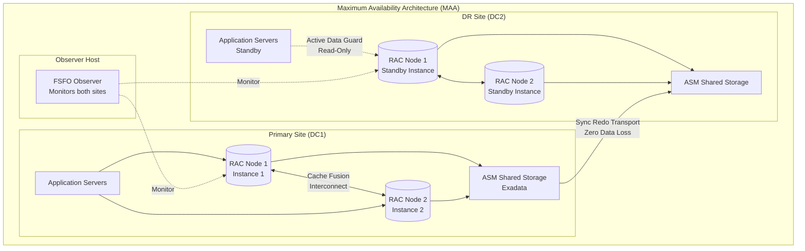
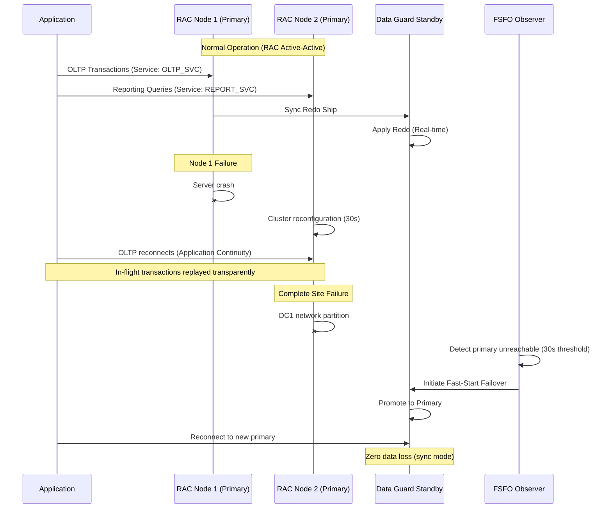

# High Availability

Oracle Database provides the most comprehensive high availability ecosystem in the enterprise database market, combining Real Application Clusters (RAC) for active-active multi-instance access to a shared database, Data Guard for disaster recovery with physical and logical standby databases, and GoldenGate for heterogeneous real-time replication across different database platforms and versions. These technologies can be combined in Maximum Availability Architecture (MAA) configurations that achieve zero data loss (RPO=0) and near-zero recovery time (RTO<30 seconds) even during complete site failures. Understanding the architectural differences between RAC (shared-everything clustering for local HA), Data Guard (shared-nothing replication for DR), and GoldenGate (logical replication for data distribution) is essential for designing Oracle HA solutions that match business requirements for availability, performance, and cost. Oracle's HA stack is unique in providing transparent application failover — applications can survive node failures, storage failures, and even entire datacenter outages with minimal or zero transaction loss and automatic reconnection through features like Application Continuity and Transparent Application Failover (TAF).

## Quick Reference

- **RAC (Real Application Clusters)**: Multiple database instances on separate servers accessing the same shared storage; provides local HA and horizontal read scalability; uses Cache Fusion for inter-node block transfer
- **Data Guard Physical Standby**: Byte-for-byte copy maintained via redo log shipping; supports real-time query (Active Data Guard); can be opened read-only while applying redo
- **Data Guard Logical Standby**: Applies redo as SQL statements; standby can have additional indexes/materialized views; supports reporting workloads with local modifications
- **Switchover**: Planned role reversal between primary and standby (zero data loss, reversible); used for maintenance, patching, and testing
- **Failover**: Unplanned promotion of standby to primary after primary failure; may involve data loss in Maximum Performance mode
- **GoldenGate**: Log-based change data capture for real-time replication; supports heterogeneous databases (Oracle-to-PostgreSQL, Oracle-to-Kafka); sub-second latency
- **Fast-Start Failover (FSFO)**: Automatic failover managed by Data Guard Broker observer; detects primary failure and promotes standby without DBA intervention
- **Application Continuity**: Transparently replays in-flight transactions after failover; applications don't see errors for recoverable operations
- **Maximum Availability mode**: Synchronous redo shipping; zero data loss guaranteed; primary waits for standby acknowledgment before committing
- **Maximum Performance mode**: Asynchronous redo shipping; minimal performance impact on primary; potential for small data loss (typically <1 second of transactions)

## When to Use

RAC is appropriate when you need local high availability (survive individual server failures without any data loss or application interruption) and when your workload benefits from horizontal scaling across multiple nodes. RAC excels for OLTP workloads where different application services can be directed to different instances (service-based workload management), reducing inter-node Cache Fusion traffic. RAC is NOT a scaling solution for single-threaded operations or queries that require full table scans — these don't parallelize across nodes effectively. RAC requires shared storage (ASM, Exadata) and high-bandwidth, low-latency interconnect between nodes.

Data Guard Physical Standby is the foundation of Oracle disaster recovery. Use it when you need a complete copy of the database in a remote datacenter ready for failover. Physical standby is simpler to manage than logical standby (no SQL apply conflicts) and supports all Oracle features without restrictions. Active Data Guard (licensed separately) allows the physical standby to be open read-only while applying redo — enabling reporting queries, backups, and data validation on the standby without impacting the primary. Use Maximum Availability mode for zero data loss requirements (financial, healthcare) and Maximum Performance mode when write latency sensitivity outweighs the risk of losing the last few seconds of transactions.

Data Guard Logical Standby is appropriate when the standby database needs to differ from the primary — additional indexes for reporting, materialized views for aggregation, or local tables for staging. Logical standby applies changes as SQL, so the standby can have a different physical structure. However, logical standby has restrictions: some data types and DDL operations aren't supported, and SQL apply can fall behind during heavy DML periods.

GoldenGate is the right choice for heterogeneous replication (Oracle to non-Oracle databases), active-active multi-master configurations, selective table-level replication, and real-time data integration with messaging systems (Kafka, JMS). GoldenGate operates at the logical level, capturing changes from redo logs and applying them as DML on the target. It supports conflict detection and resolution for bidirectional replication and can transform data during replication (column mapping, filtering, aggregation).

## Code Examples

### Data Guard Configuration

```sql
-- PRIMARY database preparation
-- Enable FORCE LOGGING (ensures all changes are logged, even NOLOGGING operations)
ALTER DATABASE FORCE LOGGING;

-- Configure redo transport to standby
ALTER SYSTEM SET LOG_ARCHIVE_DEST_2 =
    'SERVICE=standby_tns ASYNC VALID_FOR=(ONLINE_LOGFILES,PRIMARY_ROLE)
     DB_UNIQUE_NAME=standby_db COMPRESSION=ENABLE' SCOPE=BOTH;

-- For Maximum Availability (synchronous, zero data loss):
ALTER SYSTEM SET LOG_ARCHIVE_DEST_2 =
    'SERVICE=standby_tns SYNC AFFIRM VALID_FOR=(ONLINE_LOGFILES,PRIMARY_ROLE)
     DB_UNIQUE_NAME=standby_db NET_TIMEOUT=10' SCOPE=BOTH;

-- Set protection mode
ALTER DATABASE SET STANDBY DATABASE TO MAXIMIZE AVAILABILITY;
-- Options: MAXIMIZE PROTECTION (sync, primary shuts down if standby unavailable)
--          MAXIMIZE AVAILABILITY (sync, degrades to async if standby unavailable)
--          MAXIMIZE PERFORMANCE (async, default, minimal primary impact)

-- Create standby redo logs (required for real-time apply)
-- One more group than online redo logs, same size
ALTER DATABASE ADD STANDBY LOGFILE GROUP 4 SIZE 1G;
ALTER DATABASE ADD STANDBY LOGFILE GROUP 5 SIZE 1G;
ALTER DATABASE ADD STANDBY LOGFILE GROUP 6 SIZE 1G;
ALTER DATABASE ADD STANDBY LOGFILE GROUP 7 SIZE 1G;

-- STANDBY database: Start managed recovery (redo apply)
ALTER DATABASE RECOVER MANAGED STANDBY DATABASE USING CURRENT LOGFILE DISCONNECT;

-- Active Data Guard: Open standby read-only while applying redo
ALTER DATABASE OPEN READ ONLY;
ALTER DATABASE RECOVER MANAGED STANDBY DATABASE USING CURRENT LOGFILE DISCONNECT;

-- Monitor Data Guard status
SELECT
    DEST_ID, STATUS, TYPE, DATABASE_MODE, PROTECTION_MODE,
    ARCHIVED_SEQ#, APPLIED_SEQ#, ARCHIVED_SEQ# - APPLIED_SEQ# AS GAP
FROM V$ARCHIVE_DEST_STATUS
WHERE DEST_ID = 2;

-- Check apply lag
SELECT NAME, VALUE, DATUM_TIME FROM V$DATAGUARD_STATS
WHERE NAME IN ('transport lag', 'apply lag', 'apply finish time');
```

### Data Guard Broker Management

```sql
-- Configure Data Guard Broker (preferred management method)
-- On PRIMARY:
ALTER SYSTEM SET DG_BROKER_START = TRUE SCOPE=BOTH;

-- DGMGRL command-line interface
-- $ dgmgrl sys/password@primary

-- Create broker configuration
DGMGRL> CREATE CONFIGURATION 'prod_dg' AS
         PRIMARY DATABASE IS 'prod_primary'
         CONNECT IDENTIFIER IS 'prod_primary_tns';

DGMGRL> ADD DATABASE 'prod_standby' AS
         CONNECT IDENTIFIER IS 'prod_standby_tns'
         MAINTAINED AS PHYSICAL;

DGMGRL> ENABLE CONFIGURATION;

-- Show configuration status
DGMGRL> SHOW CONFIGURATION;
-- Configuration - prod_dg
--   Protection Mode: MaxAvailability
--   Members:
--     prod_primary - Primary database
--     prod_standby - Physical standby database
--   Fast-Start Failover: DISABLED
-- Configuration Status: SUCCESS

-- Perform switchover (planned, zero data loss)
DGMGRL> SWITCHOVER TO 'prod_standby';
-- Performing switchover NOW, please wait...
-- Operation requires a connection to instance "prod_standby"
-- Switchover succeeded, new primary is "prod_standby"

-- Enable Fast-Start Failover (automatic failover)
DGMGRL> ENABLE FAST_START FAILOVER;

-- Configure FSFO observer (runs on separate host)
-- $ dgmgrl sys/password@primary
DGMGRL> START OBSERVER;

-- FSFO properties
DGMGRL> SHOW FAST_START FAILOVER;
-- Fast-Start Failover: ENABLED
-- Threshold: 30 seconds
-- Target: prod_standby
-- Observer: observer_host
-- Lag Limit: 30 seconds
-- Shutdown Primary: TRUE
-- Auto-Reinstate: TRUE

-- Manual failover (when primary is lost and FSFO not configured)
DGMGRL> FAILOVER TO 'prod_standby';
```

### RAC Architecture and Services

```sql
-- RAC: Check cluster status
SELECT inst_id, instance_name, host_name, status, database_status
FROM gv$instance;

-- RAC: Create services for workload management
BEGIN
    DBMS_SERVICE.CREATE_SERVICE(
        service_name     => 'OLTP_SERVICE',
        network_name     => 'OLTP_SERVICE',
        goal             => DBMS_SERVICE.GOAL_SERVICE_TIME,
        clb_goal         => DBMS_SERVICE.CLB_GOAL_SHORT,
        aq_ha_notifications => TRUE,
        failover_method  => 'BASIC',
        failover_type    => 'SELECT',
        failover_retries => 30,
        failover_delay   => 5
    );
END;
/

-- Start service on specific instances
BEGIN
    DBMS_SERVICE.START_SERVICE(
        service_name => 'OLTP_SERVICE',
        instance_name => 'prod1'  -- preferred instance
    );
END;
/

-- RAC: Application Continuity configuration (12c+)
BEGIN
    DBMS_SERVICE.MODIFY_SERVICE(
        service_name          => 'OLTP_SERVICE',
        failover_type         => DBMS_SERVICE.FAILOVER_TYPE_TRANSACTION,
        failover_retries      => 30,
        failover_delay        => 10,
        replay_initiation_timeout => 900,
        session_state_consistency => 'DYNAMIC',
        commit_outcome        => TRUE,
        retention_timeout     => 86400
    );
END;
/

-- Monitor Cache Fusion (inter-node block transfers)
SELECT
    inst_id,
    gc_cr_blocks_received,
    gc_current_blocks_received,
    gc_cr_block_receive_time,
    gc_current_block_receive_time
FROM gv$instance_cache_transfer
ORDER BY inst_id;

-- Check interconnect performance
SELECT
    inst_id, name,
    ROUND(value / 1024 / 1024, 2) AS mb
FROM gv$sysstat
WHERE name IN ('gc cr blocks received', 'gc current blocks received',
               'gc cr block receive time', 'gc current block receive time');

-- RAC: Global cache efficiency
SELECT
    ROUND((1 - (physical_reads / (db_block_gets + consistent_gets))) * 100, 2) AS buffer_cache_hit_pct,
    ROUND(gc_cr_blocks_received / (db_block_gets + consistent_gets) * 100, 4) AS gc_pct
FROM (
    SELECT
        SUM(CASE WHEN name = 'physical reads' THEN value END) AS physical_reads,
        SUM(CASE WHEN name = 'db block gets' THEN value END) AS db_block_gets,
        SUM(CASE WHEN name = 'consistent gets' THEN value END) AS consistent_gets,
        SUM(CASE WHEN name = 'gc cr blocks received' THEN value END) AS gc_cr_blocks_received
    FROM v$sysstat
);
```

### GoldenGate Configuration

```sql
-- GoldenGate: Source (Extract) configuration
-- Extract parameter file (dirprm/ext_prod.prm)
/*
EXTRACT ext_prod
USERID ogg_admin, PASSWORD ogg_pass
EXTTRAIL ./dirdat/ep
TRANLOGOPTIONS EXCLUDEUSER ogg_admin
TABLE hr.employees;
TABLE hr.departments;
TABLE sales.orders, COLSMAP (
    USEDEFAULTS,
    target_region = @CASE(source_region, 'US', 'AMERICAS', 'EU', 'EMEA', 'APAC')
);
*/

-- GoldenGate: Target (Replicat) configuration
-- Replicat parameter file (dirprm/rep_standby.prm)
/*
REPLICAT rep_standby
USERID ogg_admin, PASSWORD ogg_pass
ASSUMETARGETDEFS
DISCARDFILE ./dirrpt/rep_standby.dsc, PURGE
MAP hr.employees, TARGET hr.employees;
MAP hr.departments, TARGET hr.departments;
MAP sales.orders, TARGET sales.orders,
    COLMAP (USEDEFAULTS, last_modified = @DATENOW());
*/

-- GoldenGate: Conflict Detection and Resolution (for bidirectional)
/*
REPLICAT rep_bidir
MAP sales.orders, TARGET sales.orders,
    RESOLVECONFLICT (
        INSERTROWEXISTS, (DEFAULT, USEMAX (last_modified))),
        UPDATEROWMISSING, (DEFAULT, DISCARD)),
        DELETEROWMISSING, (DEFAULT, DISCARD))
    );
*/

-- Monitor GoldenGate lag
-- GGSCI> INFO ALL
-- GGSCI> LAG EXTRACT ext_prod
-- GGSCI> LAG REPLICAT rep_standby

-- GoldenGate to Kafka (Oracle GoldenGate for Big Data)
/*
REPLICAT rkafka
TARGETDB LIBFILE libggjava.so SET property=dirprm/kafka.props
MAP hr.*, TARGET hr.*;
*/

-- kafka.props
/*
gg.handlerlist=kafkahandler
gg.handler.kafkahandler.type=kafka
gg.handler.kafkahandler.topicMappingTemplate=${tableName}
gg.handler.kafkahandler.format=json
gg.handler.kafkahandler.format.includePrimaryKeys=true
gg.handler.kafkahandler.kafkaProducerConfigFile=producer.properties
*/
```

### Monitoring HA Status

```sql
-- Comprehensive Data Guard health check
SELECT
    DATABASE_ROLE,
    PROTECTION_MODE,
    PROTECTION_LEVEL,
    SWITCHOVER_STATUS,
    DATAGUARD_BROKER,
    FORCE_LOGGING
FROM V$DATABASE;

-- Check for redo transport gaps
SELECT
    THREAD#, LOW_SEQUENCE#, HIGH_SEQUENCE#
FROM V$ARCHIVE_GAP;

-- Data Guard process status
SELECT
    PROCESS, STATUS, THREAD#, SEQUENCE#,
    BLOCK#, BLOCKS, DELAY_MINS
FROM V$MANAGED_STANDBY;

-- RAC: Cluster interconnect health
SELECT
    inst_id, name, ip_address, is_public
FROM gv$cluster_interconnects;

-- RAC: Node eviction history (critical for diagnosing split-brain)
SELECT
    node_name, event_type, event_time, event_details
FROM crs_stat_history
WHERE event_type = 'EVICTION'
ORDER BY event_time DESC;

-- Verify Application Continuity is working
SELECT
    service_name, failover_type, failover_method,
    commit_outcome, replay_initiation_timeout
FROM dba_services
WHERE failover_type = 'TRANSACTION';

-- Check replay statistics
SELECT
    inst_id, service_name,
    total_replays_initiated,
    total_replays_successful,
    total_replays_failed
FROM gv$service_stats
WHERE total_replays_initiated > 0;
```

## Architecture / Diagrams





## Common Pitfalls

**RAC interconnect bandwidth saturation**: Cache Fusion transfers data blocks between RAC nodes over the private interconnect. If application design causes heavy cross-instance block contention (multiple instances updating the same hot blocks), interconnect traffic can saturate the network, causing "gc buffer busy" waits. Solution: use service-based workload partitioning to direct related transactions to the same instance, reducing cross-instance block transfers. Monitor `gc cr block receive time` — if average exceeds 2ms, investigate interconnect bandwidth or application partitioning.

**Data Guard in Maximum Protection mode causing primary outage**: Maximum Protection mode shuts down the primary database if it cannot ship redo to at least one synchronous standby. If the standby or network fails, the primary stops accepting transactions. This is appropriate only for zero-tolerance data loss requirements (financial regulations). For most environments, Maximum Availability mode is preferred — it provides synchronous shipping but degrades gracefully to asynchronous if the standby is unavailable, then resynchronizes when connectivity is restored.

**Not testing failover procedures regularly**: Many organizations configure Data Guard but never test failover until an actual disaster occurs. Untested failover procedures fail in production due to: stale TNS configurations, application connection strings not updated, missing standby redo logs, or FSFO observer not running. Schedule quarterly switchover tests (switchover is reversible and zero-data-loss) to validate the entire failover chain including application reconnection, monitoring alerts, and runbook procedures.

**GoldenGate conflict resolution misconfiguration**: In bidirectional GoldenGate replication, conflicts occur when the same row is modified on both sides simultaneously. Without proper conflict detection and resolution (CDR) rules, data diverges silently. Always configure CDR for bidirectional setups: use timestamp-based resolution (latest wins), supplemental logging for all columns, and a conflict resolution table for audit. Monitor the discard file for unresolved conflicts — any entries indicate data inconsistency.

**Ignoring Application Continuity configuration**: RAC and Data Guard provide infrastructure-level HA, but applications still see errors during failover unless Application Continuity is configured. Without it, in-flight transactions receive ORA-03113/ORA-03135 errors and must be manually retried by the application. With Application Continuity, Oracle transparently replays the transaction on the surviving instance. Configuration requires: COMMIT_OUTCOME=TRUE on the service, mutable value functions (sequences, SYSDATE) registered, and JDBC connection pool configured for replay.

**Undersizing standby hardware**: Running the standby database on significantly smaller hardware than the primary creates a hidden risk: during failover, the promoted standby cannot handle production workload. Active Data Guard read-only queries add load that may not be accounted for in capacity planning. Size standby hardware to handle full production load plus Active Data Guard read workload. Test by running production-equivalent load tests against the standby after switchover.

## Real-World Use Cases

**Global banking with MAA**: A multinational bank runs Oracle RAC on Exadata in their primary datacenter (4 nodes, active-active) with synchronous Data Guard to a DR site 50km away (2-node RAC standby). Fast-Start Failover is configured with a 30-second threshold. The observer runs on a third site to avoid split-brain during network partitions between the two datacenters. Application Continuity ensures that ATM transactions and wire transfers are never lost during node failures. They perform quarterly switchovers to the DR site, running production from DR for 48 hours to validate capacity and application behavior. Annual RTO test: 28 seconds from primary failure to first successful transaction on the new primary.

**Telecom billing with RAC workload management**: A telecom company processes 2 billion CDRs (Call Detail Records) daily using a 8-node RAC cluster. They use service-based workload management: real-time rating runs on nodes 1-4 (latency-sensitive), batch billing runs on nodes 5-6 (throughput-oriented), and reporting/analytics runs on nodes 7-8 (read-heavy). Each service has different Application Continuity settings — real-time rating replays transactions, batch billing checkpoints and restarts from the last committed batch. If a node fails, its services automatically relocate to surviving nodes with the same service affinity, maintaining workload isolation.

**Insurance company Oracle-to-Kafka with GoldenGate**: An insurance company uses GoldenGate to stream real-time changes from their Oracle policy administration system to Apache Kafka. Policy changes, claims updates, and payment events are captured from Oracle redo logs and published to Kafka topics within 500ms. Downstream microservices consume these events for: real-time fraud detection, customer notification, regulatory reporting, and data lake ingestion. GoldenGate's schema evolution support handles DDL changes gracefully, and the trail file architecture provides replay capability if a downstream consumer needs to reprocess events.

**Healthcare system with zero data loss**: A hospital network runs patient records on Oracle with Maximum Availability Data Guard to a standby 30km away. Regulatory requirements mandate zero data loss (RPO=0) and RTO<60 seconds. They use synchronous redo transport with AFFIRM (standby writes to disk before acknowledging). The 30km distance adds ~0.2ms to commit latency — acceptable for their workload. Active Data Guard on the standby serves read-only queries for clinical decision support systems, offloading 40% of read traffic from the primary. FSFO with a dedicated observer ensures automatic failover if the primary site loses power.

## Interview Questions

**Q: Explain the difference between RAC and Data Guard. When would you use each, and when would you use both together?**

A: RAC provides local high availability through multiple instances accessing shared storage — if one server fails, others continue serving the same database with no data loss and minimal interruption (seconds). Data Guard provides disaster recovery through a separate database copy maintained via redo shipping — it protects against storage failures, site disasters, and data corruption that RAC cannot handle (since RAC shares storage). Use RAC alone when you need local HA and horizontal scaling but your DR requirements are met by backups. Use Data Guard alone when you need DR protection but a single instance provides sufficient performance. Use both together (MAA) when you need both local HA (survive server failures instantly) AND remote DR (survive site failures with zero data loss). In MAA, RAC handles local failures transparently while Data Guard handles site-level disasters.

**Q: What is the difference between switchover and failover in Data Guard? What are the implications of each?**

A: Switchover is a planned, graceful role reversal: the primary transitions to standby role, then the standby transitions to primary role. It's zero data loss, fully reversible, and both databases remain synchronized throughout. Use for planned maintenance, patching, or DR testing. Failover is an emergency promotion of the standby when the primary is unavailable. In Maximum Performance mode, failover may lose transactions that were committed on the primary but not yet shipped to the standby (typically <1 second of data). In Maximum Availability mode, failover is zero data loss if the standby was synchronized before the failure. After failover, the old primary cannot simply rejoin — it must be reinstated (using Flashback Database if enabled) or rebuilt from the new primary. Fast-Start Failover automates the failover decision but the reinstatement still requires DBA intervention.

**Q: How does Oracle's Cache Fusion work in RAC, and what performance problems can it cause?**

A: Cache Fusion is RAC's mechanism for maintaining cache coherency across instances. When Instance 2 needs a block that Instance 1 has modified in its buffer cache, Cache Fusion transfers the block directly over the private interconnect (memory-to-memory, no disk I/O). This is faster than reading from disk but slower than a local buffer cache hit. Performance problems occur when: (1) multiple instances frequently modify the same blocks ("hot blocks") causing excessive Cache Fusion transfers and "gc buffer busy" waits, (2) the interconnect is saturated or has high latency, or (3) sequences with small cache sizes cause contention on the sequence block. Solutions: partition workload by service so related transactions hit the same instance, increase sequence cache size to 1000+, use reverse-key indexes to distribute inserts across blocks, and ensure the interconnect uses dedicated high-bandwidth links (10Gbps+).

**Q: Describe Oracle GoldenGate's architecture and how it achieves real-time replication.**

A: GoldenGate uses a three-stage architecture: Extract, Trail, and Replicat. The Extract process reads the source database's redo/archive logs (not triggers or polling), capturing committed DML changes with minimal source impact. Changes are written to Trail files — portable, platform-independent binary files that serve as a reliable queue. The Replicat process reads Trail files and applies changes to the target database as DML statements. This architecture enables: sub-second latency (Extract reads redo in near-real-time), heterogeneous replication (Trail format is database-agnostic), transformation during replication (column mapping, filtering, routing), and resilience (Trail files persist changes if the target is temporarily unavailable). For bidirectional replication, each side runs both Extract and Replicat, with loop detection preventing infinite replication cycles (changes applied by Replicat are tagged and excluded by the local Extract).

**Q: How would you design an Oracle HA solution for an application requiring RPO=0, RTO<30 seconds, and the ability to survive a complete datacenter failure?**

A: Deploy a 2-node RAC cluster at the primary site for local HA (survives server failures in <10 seconds with Application Continuity). Configure Data Guard with synchronous redo transport (AFFIRM) to a physical standby at the DR site (ensures RPO=0). Enable Fast-Start Failover with a 15-second threshold and place the observer on a third site (or cloud) to avoid split-brain during network partitions between sites. Configure Active Data Guard on the standby for read offloading and validation. Enable Flashback Database on both sites for fast reinstatement after failover. Application layer: use Oracle Notification Service (ONS) for fast failure detection, Application Continuity for transparent transaction replay, and connection pool configuration with Fast Connection Failover. Test: quarterly switchovers validate the full chain, monthly FSFO tests validate automatic failover. The 30-second RTO budget: ~15 seconds for failure detection + ~10 seconds for standby promotion + ~5 seconds for application reconnection.

## Production Tips

**Enable Flashback Database on both primary and standby**: Flashback Database allows you to rewind a database to a point in time without restoring from backup. After a failover, the old primary can be reinstated as a standby by flashing back to before the failover point — this takes minutes instead of hours (vs rebuilding from backup). Configure `DB_FLASHBACK_RETENTION_TARGET = 1440` (24 hours) and ensure the flash recovery area has sufficient space (2-3x daily redo generation). Without Flashback, reinstatement requires a full rebuild of the old primary.

**Monitor Data Guard transport and apply lag continuously**: Set up alerts on `V$DATAGUARD_STATS` for transport lag > 5 seconds and apply lag > 30 seconds. In Maximum Availability mode, transport lag indicates network issues between sites. Apply lag indicates the standby cannot keep up with redo application (CPU or I/O bottleneck on standby). Sustained apply lag means your actual RTO is longer than expected because the standby must apply accumulated redo before it can serve transactions after promotion.

**Use Data Guard Broker for all management operations**: Never manage Data Guard manually with SQL commands in production — use Data Guard Broker (DGMGRL) exclusively. Broker maintains configuration consistency, validates changes before applying them, and provides a single point of management for complex configurations (multiple standbys, cascaded standbys, far sync instances). It also manages Fast-Start Failover observer lifecycle and provides the `SHOW CONFIGURATION` command for instant health assessment.

**Implement connection string best practices for failover**: Application connection strings should use Oracle's connection failover features: `(FAILOVER=ON)(LOAD_BALANCE=ON)` in TNS descriptors, or SCAN (Single Client Access Name) for RAC. For Data Guard failover, use a TNS entry that lists both primary and standby addresses with `FAILOVER=ON` — the client automatically connects to whichever is currently primary. In JDBC, use `oracle.jdbc.ReadTimeout` and `oracle.net.CONNECT_TIMEOUT` to detect failures quickly rather than waiting for TCP timeout (default 2+ minutes).

## Related Topics

- [Oracle Database](./oracle-database.md) — Core Oracle concepts, PL/SQL, partitioning, and flashback technology
- [Performance Diagnostics](./performance-diagnostics.md) — AWR, ASH, ADDM, and SQL tuning for Oracle performance analysis
- [PostgreSQL Replication and HA](../postgresql/replication-and-ha.md) — Comparative HA approach with streaming replication and Patroni
- [Distributed Systems](../../system-design/system-design/distributed-systems.md) — CAP theorem and consensus algorithms underlying HA architectures
