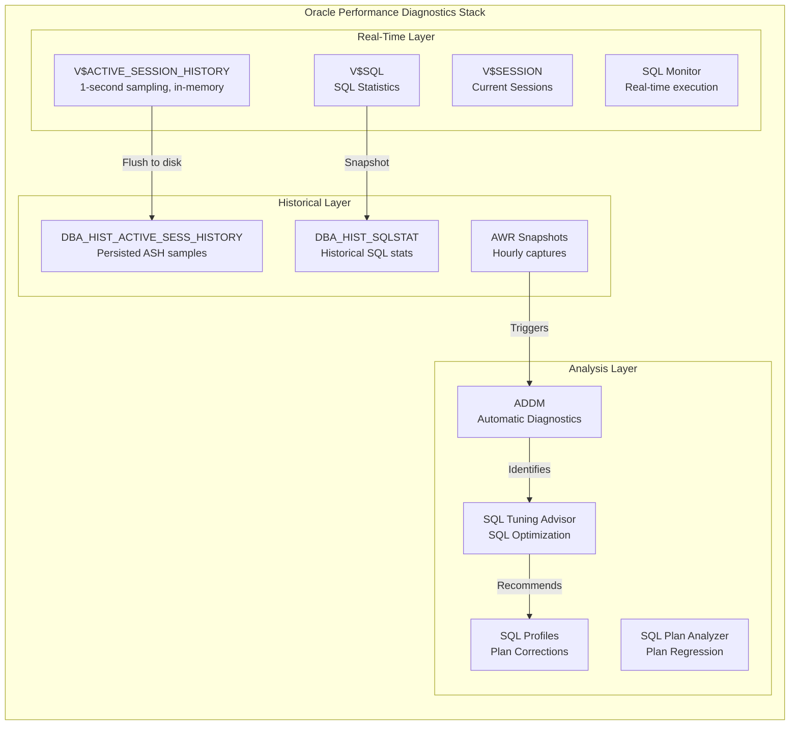
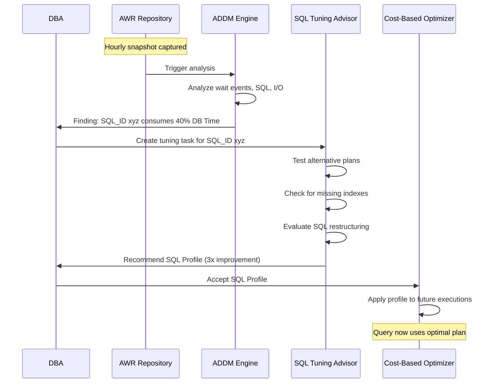

# Performance Diagnostics

Oracle Database provides the most comprehensive performance diagnostics ecosystem of any relational database, with built-in tools that automatically collect performance data (AWR), analyze active sessions in real-time (ASH), generate optimization recommendations (ADDM), and tune individual SQL statements (SQL Tuning Advisor). Unlike PostgreSQL where performance analysis requires manual EXPLAIN ANALYZE and third-party tools, Oracle's diagnostic infrastructure operates continuously in the background, maintaining a historical record of database performance that enables root cause analysis of problems that occurred hours or days ago. The Automatic Workload Repository (AWR) captures snapshots of over 1,000 performance statistics every hour, while Active Session History (ASH) samples every active session once per second — together they provide both macro-level trends and micro-level session analysis. Understanding Oracle's wait event model is fundamental to performance diagnosis: every session is either on CPU or waiting for a specific resource (I/O, lock, latch, network), and the wait event hierarchy tells you exactly where time is being spent. The Cost-Based Optimizer (CBO) in Oracle is the most sophisticated query optimizer in any commercial database, using column statistics, histograms, system statistics, and adaptive plans to generate execution strategies — but it requires accurate statistics and sometimes manual guidance through hints.

## Quick Reference

- **AWR (Automatic Workload Repository)**: Captures hourly performance snapshots; stores SQL statistics, wait events, system metrics, and segment statistics; retained for 8 days by default (configurable)
- **ASH (Active Session History)**: Samples all active sessions every second; stores session state, SQL_ID, wait event, blocking session, and execution plan; 1-second granularity for real-time analysis
- **ADDM (Automatic Database Diagnostic Monitor)**: Analyzes AWR snapshots automatically; generates findings with quantified impact and actionable recommendations; runs after every AWR snapshot
- **SQL Tuning Advisor**: Analyzes individual SQL statements; recommends SQL profiles, indexes, restructured SQL, and materialized views; can be run on-demand or automatically (STA)
- **Execution plans**: `EXPLAIN PLAN`, `DBMS_XPLAN.DISPLAY_CURSOR` for actual plans; shows access paths, join methods, partition pruning, and parallel execution
- **Optimizer hints**: `/*+ FULL(t) */`, `/*+ INDEX(t idx) */`, `/*+ PARALLEL(t,8) */`, `/*+ USE_HASH(a b) */` — override CBO decisions when statistics are misleading
- **Wait events**: Categorized into classes (User I/O, System I/O, Concurrency, Application, Network); top wait events indicate the primary bottleneck
- **SQL Monitor**: Real-time execution monitoring for long-running SQL; shows per-operation timing, rows processed, and I/O statistics as the query executes
- **V$SESSION / V$SQL**: Dynamic performance views showing current session activity and SQL execution statistics in real-time
- **Statspack**: Free alternative to AWR (no Diagnostics Pack license required); captures similar statistics but with less automation

## When to Use

Use AWR reports when investigating performance problems that occurred in the past — "the system was slow yesterday at 3 PM." Generate an AWR report spanning the problem period and compare it to a baseline period. The report's "Top 5 Timed Events" section immediately identifies whether the bottleneck was CPU, I/O, locking, or network. AWR is also essential for capacity planning: trending DB Time, I/O throughput, and CPU usage over weeks reveals growth patterns.

ASH is the tool for real-time performance investigation — "the system is slow right now, what's happening?" Query `V$ACTIVE_SESSION_HISTORY` to see what every active session is doing this second: which SQL they're executing, what they're waiting for, and who's blocking them. ASH is also invaluable for analyzing brief performance spikes that don't show up in hourly AWR snapshots — a 30-second lock contention event is visible in ASH but averaged away in AWR.

ADDM should be reviewed after every significant performance incident. It automatically identifies the top performance issues, quantifies their impact (e.g., "SQL_ID abc123 consumed 45% of DB Time"), and provides specific recommendations. ADDM catches issues that manual analysis might miss: undersized SGA, excessive parsing, I/O bottlenecks, and connection storms.

SQL Tuning Advisor is appropriate for individual high-impact SQL statements identified through AWR or ASH. It performs comprehensive analysis including alternative execution plans, missing indexes, stale statistics, and SQL profile recommendations. Use it for the top 10 SQL statements by elapsed time or buffer gets — these represent the highest-impact optimization targets.

Optimizer hints should be used sparingly and only when you've confirmed the CBO is making a suboptimal decision due to data skew, correlation between columns, or stale statistics that cannot be fixed through normal means. Document every hint with a comment explaining why it's necessary — hints are technical debt that must be re-evaluated when statistics or data distributions change.

## Code Examples

### AWR Report Generation and Analysis

```sql
-- Generate AWR report between two snapshots
-- First, find available snapshots
SELECT snap_id, begin_interval_time, end_interval_time
FROM dba_hist_snapshot
WHERE begin_interval_time > SYSDATE - 1
ORDER BY snap_id;

-- Generate HTML AWR report
SELECT * FROM TABLE(
    DBMS_WORKLOAD_REPOSITORY.AWR_REPORT_HTML(
        l_dbid     => (SELECT dbid FROM v$database),
        l_inst_num => 1,
        l_bid      => 1000,  -- begin snapshot
        l_eid      => 1005   -- end snapshot
    )
);

-- AWR SQL report for a specific SQL_ID
SELECT * FROM TABLE(
    DBMS_WORKLOAD_REPOSITORY.AWR_SQL_REPORT_HTML(
        l_dbid     => (SELECT dbid FROM v$database),
        l_inst_num => 1,
        l_bid      => 1000,
        l_eid      => 1005,
        l_sqlid    => 'abc123def456'
    )
);

-- Top SQL by elapsed time from AWR
SELECT
    sql_id,
    SUM(elapsed_time_delta) / 1e6 AS elapsed_sec,
    SUM(executions_delta) AS executions,
    ROUND(SUM(elapsed_time_delta) / NULLIF(SUM(executions_delta), 0) / 1e6, 3) AS avg_sec,
    SUM(buffer_gets_delta) AS buffer_gets,
    SUM(disk_reads_delta) AS disk_reads
FROM dba_hist_sqlstat
WHERE snap_id BETWEEN 1000 AND 1005
GROUP BY sql_id
ORDER BY elapsed_sec DESC
FETCH FIRST 20 ROWS ONLY;

-- Compare two AWR periods (baseline vs problem)
-- AWR Diff Report
SELECT * FROM TABLE(
    DBMS_WORKLOAD_REPOSITORY.AWR_DIFF_REPORT_HTML(
        l_dbid1 => (SELECT dbid FROM v$database), l_inst_num1 => 1,
        l_bid1 => 900, l_eid1 => 905,    -- baseline period
        l_dbid2 => (SELECT dbid FROM v$database), l_inst_num2 => 1,
        l_bid2 => 1000, l_eid2 => 1005   -- problem period
    )
);

-- Modify AWR retention and interval
BEGIN
    DBMS_WORKLOAD_REPOSITORY.MODIFY_SNAPSHOT_SETTINGS(
        retention => 30 * 24 * 60,  -- 30 days retention (minutes)
        interval  => 30             -- snapshot every 30 minutes
    );
END;
/
```

### Active Session History (ASH) Analysis

```sql
-- Current active sessions: what are they doing right now?
SELECT
    s.sid, s.serial#, s.username,
    s.sql_id, s.event, s.wait_class,
    s.blocking_session, s.seconds_in_wait,
    sq.sql_text
FROM v$session s
LEFT JOIN v$sql sq ON s.sql_id = sq.sql_id AND s.sql_child_number = sq.child_number
WHERE s.status = 'ACTIVE'
  AND s.type = 'USER';

-- ASH: Top SQL in the last hour
SELECT
    sql_id,
    COUNT(*) AS ash_samples,
    ROUND(COUNT(*) / (SELECT COUNT(DISTINCT sample_time) FROM v$active_session_history
                      WHERE sample_time > SYSDATE - 1/24) * 100, 2) AS pct_db_time,
    MAX(sql_plan_hash_value) AS plan_hash,
    session_state
FROM v$active_session_history
WHERE sample_time > SYSDATE - 1/24
GROUP BY sql_id, session_state
ORDER BY ash_samples DESC
FETCH FIRST 20 ROWS ONLY;

-- ASH: Wait event analysis for a specific time window
SELECT
    event, wait_class,
    COUNT(*) AS samples,
    ROUND(COUNT(*) * 100 / SUM(COUNT(*)) OVER(), 2) AS pct
FROM v$active_session_history
WHERE sample_time BETWEEN
    TO_TIMESTAMP('2024-03-15 14:00:00', 'YYYY-MM-DD HH24:MI:SS') AND
    TO_TIMESTAMP('2024-03-15 14:30:00', 'YYYY-MM-DD HH24:MI:SS')
GROUP BY event, wait_class
ORDER BY samples DESC;

-- ASH: Find blocking chains
SELECT
    level, LPAD(' ', 2 * (level - 1)) || sid AS tree,
    blocking_session, event, sql_id,
    sample_time
FROM v$active_session_history
WHERE sample_time > SYSDATE - 1/24
START WITH blocking_session IS NULL
    AND event LIKE '%enq%'
CONNECT BY PRIOR sid = blocking_session
    AND PRIOR sample_id = sample_id;

-- Historical ASH (DBA_HIST_ACTIVE_SESS_HISTORY) for past analysis
SELECT
    sql_id, event,
    COUNT(*) AS samples,
    MIN(sample_time) AS first_seen,
    MAX(sample_time) AS last_seen
FROM dba_hist_active_sess_history
WHERE sample_time BETWEEN
    TO_TIMESTAMP('2024-03-14 09:00:00', 'YYYY-MM-DD HH24:MI:SS') AND
    TO_TIMESTAMP('2024-03-14 10:00:00', 'YYYY-MM-DD HH24:MI:SS')
  AND sql_id = 'abc123def456'
GROUP BY sql_id, event
ORDER BY samples DESC;
```

### Execution Plans and SQL Tuning

```sql
-- Get actual execution plan for a running/recent SQL
SELECT * FROM TABLE(DBMS_XPLAN.DISPLAY_CURSOR(
    sql_id => 'abc123def456',
    cursor_child_no => 0,
    format => 'ALLSTATS LAST ADVANCED +PEEKED_BINDS'
));

-- EXPLAIN PLAN (estimated, not actual)
EXPLAIN PLAN FOR
SELECT /*+ GATHER_PLAN_STATISTICS */
    c.customer_name, SUM(o.amount) AS total
FROM customers c
JOIN orders o ON o.customer_id = c.id
WHERE o.order_date > ADD_MONTHS(SYSDATE, -12)
GROUP BY c.customer_name
ORDER BY total DESC;

SELECT * FROM TABLE(DBMS_XPLAN.DISPLAY(format => 'ALL'));

-- SQL Tuning Advisor
DECLARE
    l_task_name VARCHAR2(30) := 'tune_slow_query';
    l_sql_id   VARCHAR2(13) := 'abc123def456';
BEGIN
    -- Create tuning task
    l_task_name := DBMS_SQLTUNE.CREATE_TUNING_TASK(
        sql_id      => l_sql_id,
        scope       => DBMS_SQLTUNE.SCOPE_COMPREHENSIVE,
        time_limit  => 300,  -- 5 minutes analysis time
        task_name   => l_task_name
    );

    -- Execute the task
    DBMS_SQLTUNE.EXECUTE_TUNING_TASK(task_name => l_task_name);
END;
/

-- View recommendations
SELECT DBMS_SQLTUNE.REPORT_TUNING_TASK('tune_slow_query') FROM DUAL;

-- Accept a SQL Profile recommendation
BEGIN
    DBMS_SQLTUNE.ACCEPT_SQL_PROFILE(
        task_name => 'tune_slow_query',
        name      => 'profile_slow_query',
        force_match => TRUE  -- apply to similar SQL with different literals
    );
END;
/

-- SQL Monitor: Real-time execution monitoring
SELECT DBMS_SQL_MONITOR.REPORT_SQL_MONITOR(
    sql_id       => 'abc123def456',
    type         => 'HTML',
    report_level => 'ALL'
) FROM DUAL;
```

### Optimizer Hints

```sql
-- Force full table scan (when index scan is suboptimal for large result sets)
SELECT /*+ FULL(o) */ order_id, amount
FROM orders o
WHERE status IN ('PENDING', 'PROCESSING', 'SHIPPED');

-- Force specific index usage
SELECT /*+ INDEX(o idx_orders_customer_date) */ order_id, amount
FROM orders o
WHERE customer_id = :cust_id AND order_date > SYSDATE - 30;

-- Control join method
SELECT /*+ USE_HASH(o c) LEADING(c o) */
    c.name, o.amount
FROM customers c
JOIN orders o ON o.customer_id = c.id
WHERE c.region = 'EMEA';

-- Parallel execution
SELECT /*+ PARALLEL(o, 8) PARALLEL(c, 4) */
    c.segment, SUM(o.amount)
FROM orders o
JOIN customers c ON o.customer_id = c.id
GROUP BY c.segment;

-- Prevent optimizer from merging subquery (force specific execution order)
SELECT /*+ NO_MERGE(recent_orders) */
    c.name, recent_orders.total
FROM customers c
JOIN (
    SELECT /*+ NO_MERGE */ customer_id, SUM(amount) AS total
    FROM orders
    WHERE order_date > SYSDATE - 30
    GROUP BY customer_id
) recent_orders ON recent_orders.customer_id = c.id;

-- Adaptive plan hints (Oracle 12c+)
SELECT /*+ ADAPTIVE_PLAN */ *
FROM orders o JOIN customers c ON o.customer_id = c.id
WHERE o.status = :status;

-- Cardinality hint (when statistics are misleading)
SELECT /*+ CARDINALITY(o, 1000) */
    o.order_id, o.amount
FROM orders o
WHERE o.status = :status AND o.region = :region;
```

### Wait Event Analysis

```sql
-- System-wide wait event summary
SELECT
    wait_class,
    event,
    total_waits,
    ROUND(time_waited_micro / 1e6, 2) AS time_waited_sec,
    ROUND(average_wait_micro / 1e3, 2) AS avg_wait_ms
FROM v$system_event
WHERE wait_class != 'Idle'
ORDER BY time_waited_micro DESC
FETCH FIRST 20 ROWS ONLY;

-- Session-level wait events (find what a specific session is waiting for)
SELECT
    sid, event, wait_class,
    state, seconds_in_wait,
    p1text, p1, p2text, p2, p3text, p3
FROM v$session_wait
WHERE sid = :target_sid;

-- I/O statistics by datafile (identify hot files)
SELECT
    f.file_name,
    s.phyrds AS physical_reads,
    s.phywrts AS physical_writes,
    s.readtim / NULLIF(s.phyrds, 0) * 10 AS avg_read_ms,
    s.writetim / NULLIF(s.phywrts, 0) * 10 AS avg_write_ms
FROM v$filestat s
JOIN dba_data_files f ON s.file# = f.file_id
ORDER BY s.phyrds + s.phywrts DESC;

-- Latch contention analysis
SELECT
    name, gets, misses, sleeps,
    ROUND(misses / NULLIF(gets, 0) * 100, 4) AS miss_pct,
    immediate_gets, immediate_misses
FROM v$latch
WHERE misses > 0
ORDER BY sleeps DESC
FETCH FIRST 10 ROWS ONLY;

-- Enqueue (lock) waits
SELECT
    s.sid, s.serial#, s.username,
    l.type, l.id1, l.id2, l.lmode, l.request,
    s.sql_id, s.event, s.blocking_session
FROM v$lock l
JOIN v$session s ON l.sid = s.sid
WHERE l.request > 0  -- sessions waiting for a lock
ORDER BY s.seconds_in_wait DESC;
```

## Architecture / Diagrams





## Common Pitfalls

**Ignoring ADDM recommendations**: ADDM runs automatically after every AWR snapshot and provides quantified, actionable recommendations. Many DBAs generate AWR reports manually but never check ADDM findings. ADDM catches issues like "Top SQL consuming 60% of DB Time could benefit from an index" or "PGA memory is undersized causing excessive temp I/O." Make reviewing ADDM findings part of your daily routine — `SELECT * FROM dba_advisor_findings WHERE task_name LIKE 'ADDM%' AND finding_id > 0`.

**Using hints as a permanent fix without documentation**: Optimizer hints bypass the CBO's decision-making, creating brittle SQL that doesn't adapt to data changes. A `/*+ INDEX(t idx_name) */` hint that's optimal today may be terrible after the table grows 10x. Every hint should have a comment explaining why it's necessary, a JIRA ticket tracking it, and periodic review. Prefer SQL Profiles over hints — profiles guide the optimizer without hardcoding access paths and can be dropped without changing application SQL.

**Not gathering statistics after bulk operations**: The CBO relies on accurate statistics for cost estimation. After bulk loads, partition exchanges, or large deletes, statistics become stale and the optimizer makes poor decisions. Always run `DBMS_STATS.GATHER_TABLE_STATS` after significant data changes. Use `METHOD_OPT => 'FOR ALL COLUMNS SIZE AUTO'` to let Oracle determine appropriate histogram buckets. For partitioned tables, gather statistics on the affected partition: `GRANULARITY => 'PARTITION'`.

**Misinterpreting AWR "Top 5 Timed Events"**: The top wait events show where time is spent, not necessarily where the problem is. "db file sequential read" (single-block I/O) being the top event doesn't mean you have an I/O problem — it might mean you're doing too many single-block reads due to inefficient SQL (missing indexes causing excessive buffer gets). Always correlate wait events with the "SQL ordered by" sections to find the root cause SQL statements driving the waits.

**Over-relying on SQL Monitor for short queries**: SQL Monitor automatically activates for queries running longer than 5 seconds or consuming significant resources. For sub-second queries that execute millions of times, use `V$SQL` statistics (elapsed_time, buffer_gets, executions) and AWR SQL reports instead. The cumulative impact of a 10ms query executed 1M times per day (10,000 seconds of DB Time) far exceeds a single 30-second report query.

**Ignoring bind variable peeking issues**: Oracle peeks at bind variable values during hard parse to generate an optimal plan for those specific values. If the first execution uses an atypical value (e.g., a rare status code), the plan is optimized for that value and reused for all subsequent executions — even when typical values would benefit from a different plan. Use Adaptive Cursor Sharing (enabled by default in 12c+) or create SQL Plan Baselines to manage plan stability for queries with skewed data distributions.

## Real-World Use Cases

**Banking core system performance investigation**: A major bank's online banking system experienced 3x response time degradation every day between 2-4 PM. AWR comparison between the problem period and a normal period revealed "log file sync" wait event increased 500% — indicating commit-heavy batch processing competing with online transactions. ASH analysis showed a specific batch job (SQL_ID identified) performing single-row commits in a loop. Fix: restructured the batch to commit every 1,000 rows using FORALL bulk operations, reducing log file sync waits by 95% and restoring online response times.

**Telecom billing system SQL tuning**: A telecom company's monthly billing run grew from 4 hours to 18 hours over 6 months as the customer base grew. SQL Tuning Advisor identified the top billing query was using a nested loop join (appropriate for small result sets) but now processing 50M rows. The advisor recommended a SQL Profile that switched to a hash join with parallel execution. After accepting the profile, the billing run completed in 3 hours. They also implemented SQL Plan Baselines to prevent plan regression during future optimizer upgrades.

**Insurance claims processing with ADDM**: An insurance company's claims processing system showed intermittent slowdowns. ADDM findings revealed: (1) "Hard parsing consuming 25% of DB Time" — application not using bind variables for dynamic queries, (2) "PGA over-allocation causing temp tablespace I/O" — `PGA_AGGREGATE_TARGET` too low for concurrent report generation. Fixes: implemented bind variables in the application (reducing parse time by 90%), increased PGA target from 4GB to 16GB (eliminating temp I/O for sorts), and added a result cache for frequently-executed reference data queries.

**E-commerce flash sale preparation**: Before major sales events, the operations team runs SQL Performance Analyzer (SPA) to test the impact of increased load on execution plans. They capture the current SQL workload, simulate 10x volume, and identify queries whose plans degrade under load. For identified regressions, they create SQL Plan Baselines locking the optimal plan. During the sale, they monitor with SQL Monitor in real-time, watching parallel query execution and I/O patterns. Post-sale, they compare AWR reports to pre-sale baselines to identify any new performance issues introduced by the traffic spike.

## Interview Questions

**Q: Explain the relationship between AWR, ASH, and ADDM. How do they work together for performance diagnosis?**

A: AWR captures hourly snapshots of cumulative database statistics — SQL execution stats, wait events, system metrics, and segment statistics. It provides the "what happened over this period" view. ASH samples every active session once per second, providing granular "what was happening at this exact moment" data — it's stored in memory (V$ACTIVE_SESSION_HISTORY) and periodically flushed to disk (DBA_HIST_ACTIVE_SESS_HISTORY). ADDM automatically analyzes AWR snapshots after each capture, comparing the period to baselines and generating findings with quantified impact and recommendations. The workflow: ADDM identifies "SQL_ID xyz consumed 40% of DB Time" (from AWR data), you drill into ASH to see exactly when it ran, what it waited for, and whether it was blocked. Then you use SQL Tuning Advisor on that specific SQL_ID for optimization recommendations.

**Q: How do you diagnose and resolve a "library cache latch" contention issue?**

A: Library cache latch contention indicates excessive hard parsing — the database is spending significant time compiling new SQL statements rather than reusing cached plans. Diagnosis: check `V$SQLAREA` for SQL statements with `EXECUTIONS = 1` (unique, non-sharable SQL), which indicates literal values instead of bind variables. Check `V$SYSSTAT` for "parse count (hard)" vs "parse count (total)" — hard parses should be <5% of total. Resolution: (1) modify application to use bind variables, (2) enable `CURSOR_SHARING = FORCE` as a temporary workaround (replaces literals with system-generated binds), (3) increase shared pool size if the issue is plan aging due to insufficient cache. Long-term: implement a coding standard requiring bind variables and use static analysis tools to detect literal SQL in code reviews.

**Q: What is a SQL Profile and how does it differ from an optimizer hint? When would you use each?**

A: A SQL Profile is metadata stored in the data dictionary that provides the optimizer with additional information (cardinality corrections, join order preferences) without modifying the SQL text. It's created by SQL Tuning Advisor and applied transparently — the application doesn't change. A hint is embedded in the SQL text and forces a specific execution strategy regardless of statistics. Key differences: profiles are adaptive (the optimizer still makes decisions, just with better information), hints are rigid (override the optimizer completely). Profiles don't require application changes, hints require SQL modification. Profiles can be dropped/disabled without touching code, hints require redeployment. Use profiles for production SQL you can't modify (vendor applications, ORM-generated queries). Use hints only in development/testing to verify a specific plan is better, then convert to a profile or SQL Plan Baseline for production.

**Q: How would you investigate a sudden increase in "db file sequential read" wait events?**

A: "db file sequential read" means single-block I/O reads — typically index lookups or table access by ROWID. A sudden increase indicates either: (1) a new/changed SQL statement performing excessive index lookups, (2) buffer cache pressure causing previously-cached blocks to be re-read from disk, or (3) a plan change causing an index scan where a full table scan was previously used. Investigation steps: Check AWR "SQL ordered by Physical Reads" to identify the SQL driving the I/O. Compare the current execution plan to the previous plan (DBA_HIST_SQL_PLAN). Check if buffer cache hit ratio dropped (indicating memory pressure). Check if the table/index grew significantly (data growth). If it's a plan change, create a SQL Plan Baseline with the previous good plan. If it's data growth, consider partitioning or a different index strategy.

**Q: Explain Oracle's Adaptive Query Optimization features and when they help.**

A: Adaptive Query Optimization (12c+) includes: (1) Adaptive Plans — the optimizer embeds alternative sub-plans and chooses at runtime based on actual cardinalities (e.g., starts with nested loop but switches to hash join if row count exceeds threshold), (2) Adaptive Statistics — automatic re-optimization of queries that had significant cardinality misestimates, storing corrected statistics for future executions, (3) SQL Plan Directives — persistent notes that tell the optimizer to gather additional statistics (dynamic sampling) for specific table/column combinations where estimates were wrong. These help when: data is skewed and histograms don't capture the distribution well, correlated columns cause multiplicative estimation errors, or complex predicates defeat the optimizer's independence assumption. They're most valuable for ad-hoc queries and data warehouse workloads where query patterns are unpredictable.

## Production Tips

**Establish AWR baselines for critical periods**: Create AWR baselines for normal operation periods (`DBMS_WORKLOAD_REPOSITORY.CREATE_BASELINE`). When performance degrades, generate AWR Diff reports comparing the problem period to the baseline. This immediately highlights what changed — new SQL statements, increased I/O, latch contention, or plan regressions. Maintain baselines for: typical weekday, month-end processing, and peak traffic periods.

**Automate ADDM review with alerts**: Create a scheduled job that queries `DBA_ADVISOR_FINDINGS` after each AWR snapshot and sends alerts for high-impact findings (impact > 20% of DB Time). Most organizations generate AWR reports reactively after users complain — proactive ADDM monitoring catches degradation before it impacts users. Integrate with your monitoring system (Prometheus, Datadog, OEM) for dashboard visibility.

**Use SQL Plan Baselines for plan stability**: For critical SQL statements, create SQL Plan Baselines that lock the known-good execution plan. The optimizer can discover better plans but won't use them until a DBA verifies and evolves the baseline. This prevents plan regressions during statistics gathering, optimizer upgrades, or parameter changes. Essential for OLTP systems where plan stability is more important than theoretical optimization.

**Monitor V$SQL for resource-intensive queries continuously**: Set up real-time monitoring on `V$SQL` to alert when any SQL_ID exceeds thresholds: buffer_gets/execution > 100,000, elapsed_time/execution > 5 seconds, or disk_reads/execution > 10,000. Catch performance regressions within minutes of deployment rather than waiting for the next AWR snapshot. Use `V$SQL_MONITOR` for queries currently executing that exceed resource thresholds.

## Related Topics

- [Oracle Database](./oracle-database.md) — Core Oracle concepts, PL/SQL, partitioning, and flashback technology
- [High Availability](./high-availability.md) — RAC, Data Guard, and GoldenGate for Oracle HA architectures
- [SQL Performance Tuning](../sql-foundations/sql-performance-tuning.md) — General SQL optimization principles applicable across databases
- [PostgreSQL Performance Tuning](../postgresql/performance-tuning.md) — Comparative approach to performance tuning in PostgreSQL
