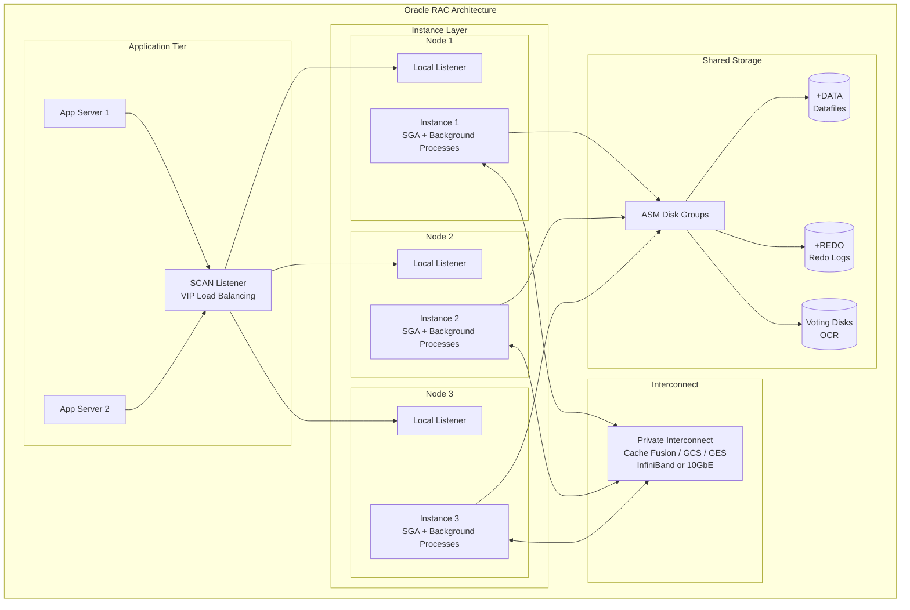
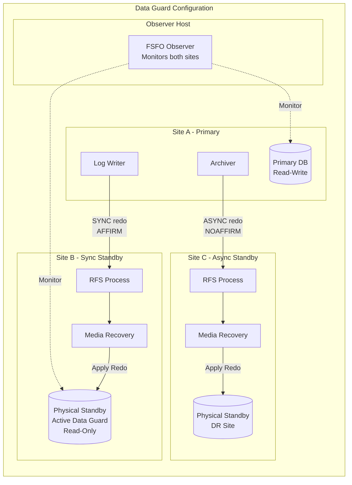
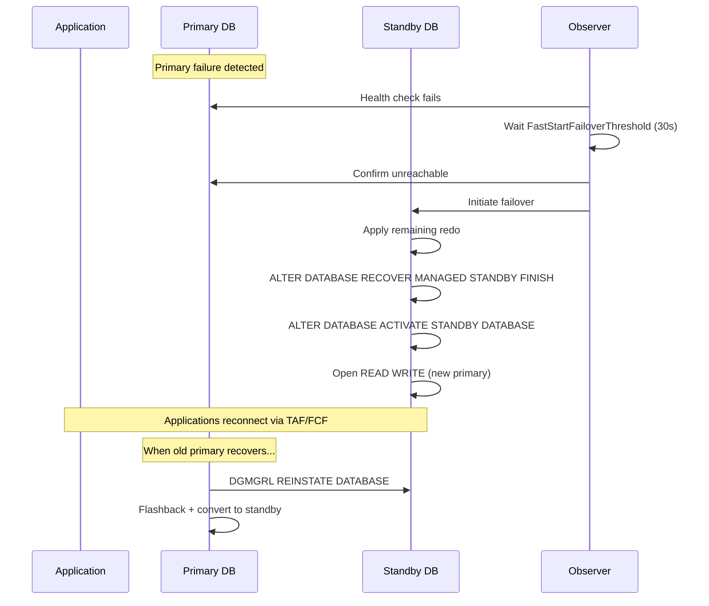

# Oracle RAC & Data Guard

## Quick Reference

- **Oracle RAC** (Real Application Clusters) allows multiple instances to access a single database simultaneously, providing horizontal scalability and high availability
- **Cache Fusion** is RAC's mechanism for transferring data blocks between instances via the private interconnect without writing to disk
- **Data Guard** maintains synchronized standby databases (physical or logical) for disaster recovery with automatic role transitions
- **Physical Standby** applies redo logs block-for-block, creating an exact copy; can be opened read-only with Active Data Guard
- **Logical Standby** converts redo to SQL statements, allowing the standby to be open read-write for reporting with some data type restrictions
- **Active Data Guard** (licensed option) allows queries on a physical standby while it continues applying redo — offloads reporting workloads
- **Fast-Start Failover (FSFO)** enables automatic failover without DBA intervention when the primary becomes unreachable
- **Maximum Availability Architecture (MAA)** is Oracle's reference architecture combining RAC + Data Guard + GoldenGate for zero data loss and near-zero downtime
- **GoldenGate** provides real-time, heterogeneous replication with transformation capabilities across Oracle and non-Oracle databases
- **Data Guard Broker** (DGMGRL) simplifies management of Data Guard configurations with a command-line and Enterprise Manager interface

## When to Use

Deploy Oracle RAC when your workload requires both high availability and horizontal read/write scalability within a single data center. RAC is ideal for OLTP workloads where multiple application servers need concurrent read-write access to the same database, and where single-instance vertical scaling has reached its limits. RAC provides instance-level failover — if one node fails, surviving nodes continue serving requests with minimal interruption.

Use Data Guard when you need disaster recovery across geographically separated sites. Physical standby is the standard choice for DR because it provides exact block-level copies with minimal overhead. Choose logical standby when you need the standby database open for reporting queries that require write access (temporary tables, materialized views) or when replicating between different hardware architectures.

Active Data Guard is appropriate when you want to offload read-heavy reporting, backups, or data mining to the standby without compromising its DR capability. It eliminates the traditional trade-off between using a standby for queries versus keeping it synchronized.

Fast-Start Failover suits environments requiring automated DR with strict RTO requirements (under 30 seconds). It requires an Observer process running on a third site to avoid split-brain scenarios.

GoldenGate is the right choice for heterogeneous replication (Oracle to non-Oracle), bidirectional replication for active-active configurations, or when you need real-time data transformation during replication. It operates at the logical level and supports filtering, mapping, and conflict resolution.

## Code Examples

### Data Guard Broker Configuration

```sql
-- Enable Data Guard Broker on primary and standby
ALTER SYSTEM SET dg_broker_start = TRUE SCOPE = BOTH;

-- Connect to broker CLI
-- $ dgmgrl sys/password@primary

-- Create Data Guard configuration
DGMGRL> CREATE CONFIGURATION 'dg_config' AS
         PRIMARY DATABASE IS 'prod'
         CONNECT IDENTIFIER IS 'prod_tns';

DGMGRL> ADD DATABASE 'prod_stby' AS
         CONNECT IDENTIFIER IS 'prod_stby_tns'
         MAINTAINED AS PHYSICAL;

DGMGRL> ENABLE CONFIGURATION;

-- Verify configuration status
DGMGRL> SHOW CONFIGURATION;
-- Output:
-- Configuration - dg_config
--   Protection Mode: MaxPerformance
--   Members:
--     prod      - Primary database
--     prod_stby - Physical standby database
-- Fast-Start Failover: DISABLED
-- Configuration Status: SUCCESS

-- Show detailed database status
DGMGRL> SHOW DATABASE 'prod_stby';

-- Change protection mode to Maximum Availability
DGMGRL> EDIT CONFIGURATION SET PROTECTION MODE AS MaxAvailability;

-- Configure transport for synchronous redo shipping
DGMGRL> EDIT DATABASE 'prod_stby' SET PROPERTY LogXptMode = 'SYNC';
DGMGRL> EDIT DATABASE 'prod_stby' SET PROPERTY NetTimeout = 30;

-- Perform switchover (planned role reversal)
DGMGRL> SWITCHOVER TO 'prod_stby';
-- Both databases swap roles gracefully with no data loss

-- Perform failover (unplanned - primary is down)
DGMGRL> FAILOVER TO 'prod_stby';
-- Standby becomes new primary; old primary needs reinstatement
```

### Fast-Start Failover Configuration

```sql
-- Configure FSFO via broker
DGMGRL> EDIT DATABASE 'prod_stby' SET PROPERTY FastStartFailoverTarget = 'prod';
DGMGRL> EDIT DATABASE 'prod' SET PROPERTY FastStartFailoverTarget = 'prod_stby';

-- Set failover conditions
DGMGRL> EDIT CONFIGURATION SET PROPERTY FastStartFailoverThreshold = 30;
DGMGRL> EDIT CONFIGURATION SET PROPERTY FastStartFailoverLagLimit = 0;
DGMGRL> EDIT CONFIGURATION SET PROPERTY FastStartFailoverAutoReinstate = TRUE;

-- Enable FSFO (requires Observer running)
DGMGRL> ENABLE FAST_START FAILOVER;

-- Start Observer on a third host
-- $ dgmgrl sys/password@prod
DGMGRL> START OBSERVER observer1 IN BACKGROUND
         FILE IS '/opt/oracle/observer/observer.log'
         CONNECT IDENTIFIER IS 'prod_tns'
         LOGFILE IS '/opt/oracle/observer/observer_dgmgrl.log';

-- Verify Observer status
DGMGRL> SHOW FAST_START FAILOVER;
-- Fast-Start Failover: ENABLED
-- Threshold:          30 seconds
-- Target:             prod_stby
-- Observer:           observer1
-- Lag Limit:          0 seconds
-- Shutdown Primary:   TRUE
-- Auto-reinstate:     TRUE
```

### RAC Service Configuration

```sql
-- Create a service for OLTP workload (preferred on instance 1, available on instance 2)
BEGIN
  DBMS_SERVICE.CREATE_SERVICE(
    service_name     => 'OLTP_SVC',
    network_name     => 'OLTP_SVC.example.com',
    aq_ha_notifications => TRUE,
    failover_method  => 'BASIC',
    failover_type    => 'SELECT',
    failover_retries => 180,
    failover_delay   => 5,
    clb_goal         => DBMS_SERVICE.CLB_GOAL_SHORT,
    goal             => DBMS_SERVICE.GOAL_SERVICE_TIME
  );
END;
/

-- Using srvctl to manage RAC services (command line)
-- Create service with preferred/available instances
-- $ srvctl add service -db PRODDB -service OLTP_SVC \
--     -preferred "PRODDB1,PRODDB2" -available "PRODDB3" \
--     -failovermethod BASIC -failovertype SELECT \
--     -tafpolicy BASIC -notification TRUE

-- Start the service
-- $ srvctl start service -db PRODDB -service OLTP_SVC

-- Relocate service to another instance (online)
-- $ srvctl relocate service -db PRODDB -service OLTP_SVC \
--     -oldinst PRODDB1 -newinst PRODDB2

-- Check service status
-- $ srvctl status service -db PRODDB
-- Service OLTP_SVC is running on instance(s) PRODDB1, PRODDB2

-- Create a read-only service for reporting (runs on specific instances)
-- $ srvctl add service -db PRODDB -service REPORT_SVC \
--     -preferred "PRODDB3" -available "PRODDB2" \
--     -clbgoal LONG -rlbgoal THROUGHPUT
```

### RAC Interconnect Monitoring

```sql
-- Check interconnect traffic and latency
SELECT instance_number, name, value
FROM gv$sysstat
WHERE name IN (
    'gc cr blocks received',
    'gc cr block receive time',
    'gc current blocks received',
    'gc current block receive time',
    'gc cr block build time',
    'gc cr block flush time'
)
ORDER BY instance_number, name;

-- Calculate average block transfer time (should be < 1ms)
SELECT inst_id,
       round(avg_cr_receive_time_ms, 3) AS avg_cr_ms,
       round(avg_current_receive_time_ms, 3) AS avg_current_ms
FROM (
    SELECT b1.inst_id,
           b1.value / greatest(b2.value, 1) * 10 AS avg_cr_receive_time_ms,
           b3.value / greatest(b4.value, 1) * 10 AS avg_current_receive_time_ms
    FROM gv$sysstat b1, gv$sysstat b2, gv$sysstat b3, gv$sysstat b4
    WHERE b1.inst_id = b2.inst_id
      AND b1.inst_id = b3.inst_id
      AND b1.inst_id = b4.inst_id
      AND b1.name = 'gc cr block receive time'
      AND b2.name = 'gc cr blocks received'
      AND b3.name = 'gc current block receive time'
      AND b4.name = 'gc current blocks received'
);

-- Check for interconnect contention
SELECT * FROM gv$cluster_interconnects;

-- Global cache efficiency
SELECT inst_id,
       round((1 - (physical_reads / (db_block_gets + consistent_gets))) * 100, 2) AS buffer_hit_pct,
       round(gc_cr_blocks_received / greatest(consistent_gets, 1) * 100, 2) AS gc_cr_pct
FROM (
    SELECT inst_id,
           sum(CASE WHEN name = 'physical reads' THEN value END) AS physical_reads,
           sum(CASE WHEN name = 'db block gets' THEN value END) AS db_block_gets,
           sum(CASE WHEN name = 'consistent gets' THEN value END) AS consistent_gets,
           sum(CASE WHEN name = 'gc cr blocks received' THEN value END) AS gc_cr_blocks_received
    FROM gv$sysstat
    WHERE name IN ('physical reads', 'db block gets', 'consistent gets', 'gc cr blocks received')
    GROUP BY inst_id
);
```

### Data Guard Redo Transport and Apply Monitoring

```sql
-- Check redo transport status on primary
SELECT dest_id, status, error,
       archived_seq#, applied_seq#,
       (archived_seq# - applied_seq#) AS apply_lag_sequences
FROM v$archive_dest_status
WHERE dest_id IN (2, 3);

-- Check apply lag on standby
SELECT name, value, datum_time
FROM v$dataguard_stats
WHERE name IN ('transport lag', 'apply lag', 'apply finish time');

-- Monitor redo apply rate on standby
SELECT process, status, thread#, sequence#,
       block#, blocks
FROM v$managed_standby
WHERE process IN ('MRP0', 'RFS', 'ARCH');

-- Check for gaps in archived logs
SELECT thread#, low_sequence#, high_sequence#
FROM v$archive_gap;

-- Validate standby database
-- $ dgmgrl sys/password@prod_stby
DGMGRL> VALIDATE DATABASE 'prod_stby';
```

## Architecture / Diagrams







## Common Pitfalls

**RAC interconnect saturation**: If the private interconnect bandwidth is insufficient, Cache Fusion block transfers queue up, causing `gc buffer busy` waits. This manifests as application latency spikes. Always use dedicated high-bandwidth interconnect (InfiniBand or bonded 10GbE minimum). Monitor `gc cr block receive time` — average should be under 1ms. If it exceeds 3ms consistently, investigate network saturation or misconfigured routing that sends interconnect traffic over the public network.

**Hot blocks in RAC causing excessive global cache transfers**: When multiple instances frequently modify the same data blocks (e.g., sequence-generated PKs inserting into the same index leaf block), Cache Fusion transfers dominate. Mitigate with reverse-key indexes, hash partitioning of hot tables, or using instance-specific sequences with different cache sizes and increments. Use `GV$SEGMENT_STATISTICS` to identify hot segments.

**Data Guard protection mode mismatch with network reality**: Setting Maximum Protection mode means the primary shuts down if it cannot ship redo to at least one synchronous standby. If your network between sites is unreliable, this causes primary outages. Use Maximum Availability mode instead — it degrades to Maximum Performance temporarily when the standby is unreachable, then resynchronizes automatically.

**FSFO false failovers**: If the Observer loses connectivity to the primary (but the primary is actually healthy), it may trigger an unnecessary failover. Mitigate by placing the Observer on a third network path, setting appropriate `FastStartFailoverThreshold` (not too aggressive), and configuring `FastStartFailoverPmyShutdown = TRUE` to fence the old primary.

**Neglecting RAC-aware application design**: Applications that don't use connection pools with RAC awareness (FCF — Fast Connection Failover, or UCP — Universal Connection Pool) will experience long timeouts during instance failures. Configure `ONS` (Oracle Notification Service) and enable FAN (Fast Application Notification) events so the connection pool proactively cleans up dead connections and redistributes load.

**Standby redo log sizing**: If standby redo logs are not configured (or are undersized), redo apply on the standby falls behind during peak write periods. Always create standby redo logs on both primary and standby, sized to match or exceed online redo logs, with one extra group per thread.

## Real-World Use Cases

**Global banking platform with zero data loss**: A multinational bank runs a 4-node RAC cluster as the primary database for core banking transactions processing 50,000 TPS. Data Guard with synchronous transport ships redo to a physical standby in a secondary data center 50km away (latency < 5ms round-trip). Active Data Guard on the standby serves all reporting and regulatory queries. A third async standby in another country provides geographic DR. Fast-Start Failover with a 15-second threshold ensures automatic failover if the primary site is lost.

**Telecommunications billing system**: A telecom provider processes 2 billion CDRs (Call Detail Records) daily using a 6-node RAC cluster. Services are partitioned by workload: OLTP services run on nodes 1-4 with short-transaction optimization, while batch rating services run on nodes 5-6 with large PGA allocations. GoldenGate replicates rated CDRs in real-time to a data warehouse for analytics, with transformation rules converting the OLTP schema to a star schema during replication.

**Healthcare system with regulatory compliance**: A hospital network uses Data Guard with a 4-hour delayed apply standby specifically for protection against ransomware and accidental data corruption. The delayed standby provides a recovery window — if corruption is detected within 4 hours, they can activate the standby at a point before the corruption occurred. A separate real-time standby handles HA failover for the clinical application that cannot tolerate any downtime.

**E-commerce with active-active across regions**: A global retailer uses GoldenGate bidirectional replication between RAC clusters in US and EU data centers. Each region handles local writes with conflict resolution rules (timestamp-based, with manual review queue for unresolvable conflicts). This provides sub-50ms response times for users in both regions while maintaining a globally consistent catalog. During regional failures, all traffic routes to the surviving site with full read-write capability.

## Interview Questions

**Q: How does Cache Fusion work in Oracle RAC, and what problem does it solve?**

A: Cache Fusion solves the problem of multiple instances needing access to the same data blocks without constantly writing to and reading from shared disk. When Instance 1 holds a modified block in its buffer cache and Instance 2 needs that block, Cache Fusion transfers the block directly over the private interconnect from Instance 1's SGA to Instance 2's SGA — a memory-to-memory transfer that avoids disk I/O entirely. This is managed by the Global Cache Service (GCS) which tracks block ownership and the Global Enqueue Service (GES) which manages lock coordination. The transfer typically completes in under 1ms over InfiniBand. Without Cache Fusion, every cross-instance data access would require a disk write followed by a disk read, making RAC impractical for OLTP workloads.

**Q: What is the difference between switchover and failover in Data Guard?**

A: A **switchover** is a planned, graceful role reversal where the primary transitions to standby and the standby transitions to primary. Both databases remain synchronized throughout — no data is lost, and both databases are available in their new roles immediately. Use switchover for planned maintenance, patching, or hardware upgrades. A **failover** is an unplanned operation performed when the primary is unavailable (crashed, site lost). The standby is promoted to primary unilaterally. Depending on the protection mode, some redo may not have been received by the standby, resulting in potential data loss (in Maximum Performance mode). After failover, the old primary cannot simply rejoin — it must be reinstated using Flashback Database or rebuilt from the new primary.

**Q: Explain the three Data Guard protection modes and their trade-offs.**

A: **Maximum Protection** guarantees zero data loss — the primary will shut itself down rather than commit a transaction that hasn't been confirmed by at least one synchronous standby. This provides the strongest guarantee but risks primary availability if all standbys become unreachable. **Maximum Availability** also provides zero data loss under normal operation (synchronous transport), but if the standby becomes unreachable, the primary continues operating in Maximum Performance mode temporarily, then resynchronizes when connectivity returns. This balances data protection with availability. **Maximum Performance** (default) uses asynchronous transport — the primary commits without waiting for standby acknowledgment. This has zero performance impact on the primary but allows potential data loss equal to the transport lag (typically seconds). Choose based on your RPO requirements and acceptable impact on primary commit latency.

**Q: When would you choose GoldenGate over Data Guard for replication?**

A: Choose GoldenGate when you need: (1) heterogeneous replication — Oracle to non-Oracle databases or vice versa; (2) bidirectional/active-active replication with conflict resolution; (3) selective replication of specific tables or rows with filtering and transformation; (4) replication between different Oracle versions or platforms where Data Guard isn't supported; (5) zero-downtime migrations between different database versions or platforms. Data Guard is superior for pure DR scenarios because it's simpler, has lower overhead (ships raw redo vs. logical change capture), replicates everything (DDL, sequences, system changes), and is included in Enterprise Edition licensing. GoldenGate requires a separate license and more complex configuration but provides flexibility that Data Guard cannot match.

**Q: How does SCAN (Single Client Access Name) work in RAC?**

A: SCAN provides a single DNS name that resolves to multiple IP addresses (typically 3) for client connections to a RAC cluster. Clients connect to the SCAN name, and the SCAN listener (running on any node via Grid Infrastructure) routes the connection to the appropriate instance based on the requested service and current load. This decouples clients from specific node addresses — nodes can be added or removed without changing client connection strings. The SCAN listener performs server-side load balancing using Runtime Connection Load Balancing (RCLB) metrics, directing new connections to the least-loaded instance. DNS round-robin distributes initial connections across SCAN IPs, while the SCAN listener on each IP handles the actual routing decision.

## Production Tips

**RAC interconnect sizing and monitoring**: Size the interconnect for 2x your peak expected Cache Fusion traffic. Monitor `gc cr block receive time` and `gc current block receive time` in AWR reports — if average exceeds 2ms, investigate. Use dedicated VLANs or InfiniBand for interconnect traffic. Never share the interconnect network with backup traffic or application data. Configure redundant interconnect paths (bonded NICs or dual InfiniBand HCAs) for both bandwidth and availability.

**Data Guard apply lag alerting**: Set up monitoring on `V$DATAGUARD_STATS` apply lag. For synchronous configurations, any apply lag indicates a problem. For async, establish a baseline and alert when lag exceeds 2x normal. Use the broker's `SHOW DATABASE` verbose output to identify whether lag is due to transport (network) or apply (standby I/O). Tune `DB_RECOVERY_FILE_DEST_SIZE` to ensure the standby has sufficient space for archived logs during lag spikes.

**RAC service design for workload isolation**: Create separate database services for OLTP, batch, and reporting workloads. Assign each service to specific preferred instances with different available (failover) instances. This prevents batch jobs from consuming resources needed by OLTP on the same instance. Use Resource Manager to set CPU and I/O limits per service. Monitor service-level response times via AWR Service Statistics.

**Testing failover regularly**: Schedule quarterly DR drills using Data Guard switchover. Verify application reconnection times, check that connection pools properly drain and reconnect, and validate that the new primary handles full production load. Document the runbook and measure actual RTO against your SLA. For FSFO configurations, test Observer failover scenarios including network partitions between Observer and primary.

## Related Topics

- [Oracle Performance Diagnostics](./performance-diagnostics.md) — AWR, ASH, and SQL tuning for Oracle databases
- [Oracle Database](./oracle-database.md) — PL/SQL, flashback technology, and core Oracle features
- [SQL Foundations - Transactions](../sql-foundations/transactions-and-consistency.md) — Transaction isolation and concurrency fundamentals
