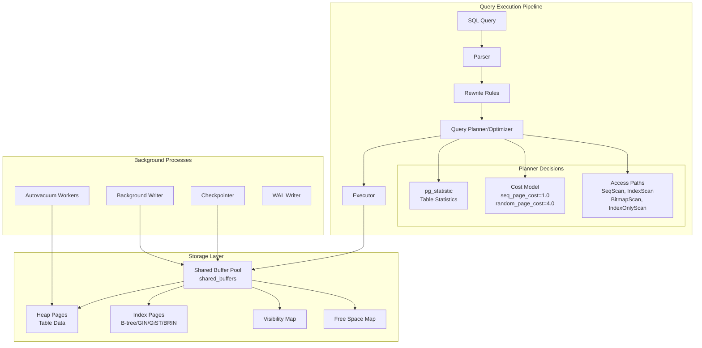
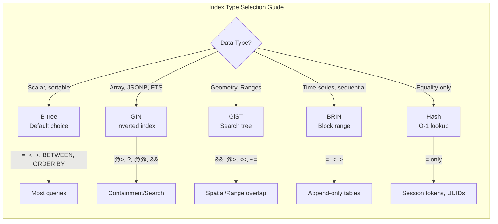

# PostgreSQL Performance & Indexing

## Quick Reference

- **EXPLAIN ANALYZE** executes the query and shows actual row counts, timing, and buffer usage — always use `BUFFERS` option for I/O insight
- **B-tree** is the default index type, optimal for equality and range queries on sortable data; supports `<`, `<=`, `=`, `>=`, `>`, `BETWEEN`, `IN`, `IS NULL`
- **GIN** (Generalized Inverted Index) indexes composite values — arrays, JSONB, full-text search vectors; ideal for containment operators (`@>`, `?`, `@@`)
- **GiST** (Generalized Search Tree) supports geometric data, range types, and full-text search with proximity ranking
- **BRIN** (Block Range Index) is extremely compact for naturally ordered data (timestamps, sequential IDs); stores min/max per block range
- **Partial indexes** include only rows matching a WHERE clause, reducing index size and maintenance cost
- **Covering indexes** (`INCLUDE` clause) store additional columns in the index leaf pages, enabling index-only scans
- **Table partitioning** splits large tables into smaller physical pieces by range, list, or hash for improved query performance and maintenance
- **VACUUM** reclaims dead tuples from MVCC; **autovacuum** runs automatically but requires tuning for high-write workloads
- **pg_stat_statements** tracks execution statistics for all SQL statements — the single most important extension for query optimization

## When to Use

Use EXPLAIN ANALYZE as your first diagnostic tool whenever a query performs below expectations. It reveals whether the planner chose sequential scans over index scans, where the most time is spent, and whether row estimates are wildly off (indicating stale statistics).

Choose GIN indexes when querying JSONB documents with containment operators, searching arrays for element membership, or implementing full-text search. GIN indexes are larger and slower to update than B-tree but provide fast lookups for multi-valued columns.

Deploy BRIN indexes on append-only or time-series tables where data is physically ordered by the indexed column. A BRIN index on a billion-row table with timestamps might be only a few MB compared to a multi-GB B-tree, while still eliminating 99% of blocks from sequential scans.

Implement table partitioning when tables exceed tens of millions of rows and queries consistently filter on the partition key. Partitioning enables partition pruning (skipping irrelevant partitions entirely), parallel maintenance operations (VACUUM individual partitions), and efficient data lifecycle management (dropping old partitions instead of DELETE).

Enable pg_stat_statements in every production database. It answers the critical question: "Which queries consume the most total time?" — often revealing that a fast query called millions of times dominates resource usage more than an occasional slow query.

## Code Examples

### EXPLAIN ANALYZE Deep Dive

```sql
-- Basic EXPLAIN ANALYZE with all useful options
EXPLAIN (ANALYZE, BUFFERS, FORMAT TEXT)
SELECT o.order_id, o.total, c.name
FROM orders o
JOIN customers c ON c.id = o.customer_id
WHERE o.created_at >= '2024-01-01'
  AND o.status = 'completed'
ORDER BY o.total DESC
LIMIT 20;

-- Example output interpretation:
-- Limit  (cost=1234.56..1234.78 rows=20 width=52) (actual time=12.345..12.367 rows=20 loops=1)
--   Buffers: shared hit=1024 read=56
--   ->  Sort  (cost=1234.56..1256.78 rows=8900 width=52) (actual time=12.340..12.355 rows=20 loops=1)
--         Sort Key: o.total DESC
--         Sort Method: top-N heapsort  Memory: 27kB
--         Buffers: shared hit=1024 read=56
--         ->  Hash Join  (cost=100.00..1100.00 rows=8900 width=52) (actual time=1.234..10.567 rows=8900 loops=1)
--               Hash Cond: (o.customer_id = c.id)
--               ->  Index Scan using idx_orders_created_status on orders o  (cost=0.43..950.00 rows=8900 width=24)
--                     Index Cond: (created_at >= '2024-01-01')
--                     Filter: (status = 'completed')
--                     Rows Removed by Filter: 1200
--               ->  Hash  (cost=75.00..75.00 rows=5000 width=36)
--                     Buckets: 8192  Batches: 1  Memory Usage: 300kB
--                     ->  Seq Scan on customers c  (cost=0.00..75.00 rows=5000 width=36)

-- Key metrics to watch:
-- 1. actual rows vs estimated rows (large discrepancy = stale stats)
-- 2. shared hit vs read (read = disk I/O, hit = buffer cache)
-- 3. Rows Removed by Filter (high = index not selective enough)
-- 4. Sort Method: external merge = spilling to disk (increase work_mem)
```

### Creating Various Index Types

```sql
-- B-tree: default, most common
CREATE INDEX idx_orders_customer_date
ON orders (customer_id, created_at DESC);

-- Partial index: only index active orders (much smaller)
CREATE INDEX idx_orders_active
ON orders (customer_id, created_at)
WHERE status != 'archived';

-- Covering index: enables index-only scans
CREATE INDEX idx_orders_covering
ON orders (customer_id, created_at DESC)
INCLUDE (total, status);

-- Expression index: index computed values
CREATE INDEX idx_users_email_lower
ON users (lower(email));
-- Query must match: WHERE lower(email) = 'user@example.com'

-- GIN index for JSONB containment queries
CREATE INDEX idx_products_attrs
ON products USING GIN (attributes jsonb_path_ops);
-- Supports: WHERE attributes @> '{"color": "red"}'

-- GIN index for array containment
CREATE INDEX idx_posts_tags
ON posts USING GIN (tags);
-- Supports: WHERE tags @> ARRAY['postgresql', 'performance']

-- GIN for full-text search
CREATE INDEX idx_articles_fts
ON articles USING GIN (to_tsvector('english', title || ' ' || body));

-- GiST for range types
CREATE INDEX idx_reservations_period
ON reservations USING GiST (tsrange(check_in, check_out));
-- Supports: WHERE tsrange(check_in, check_out) && tsrange('2024-03-01', '2024-03-07')

-- BRIN for time-series data (extremely compact)
CREATE INDEX idx_events_timestamp
ON events USING BRIN (created_at)
WITH (pages_per_range = 32);
-- 32 pages per range = ~256KB granularity

-- Hash index (PostgreSQL 10+ WAL-logged, crash-safe)
CREATE INDEX idx_sessions_token
ON sessions USING HASH (session_token);
-- Only supports equality (=), but smaller and faster than B-tree for this case
```

### Table Partitioning

```sql
-- Range partitioning by date (most common)
CREATE TABLE events (
    id          bigint GENERATED ALWAYS AS IDENTITY,
    event_type  text NOT NULL,
    payload     jsonb,
    created_at  timestamptz NOT NULL DEFAULT now()
) PARTITION BY RANGE (created_at);

-- Create monthly partitions
CREATE TABLE events_2024_01 PARTITION OF events
    FOR VALUES FROM ('2024-01-01') TO ('2024-02-01');
CREATE TABLE events_2024_02 PARTITION OF events
    FOR VALUES FROM ('2024-02-01') TO ('2024-03-01');
CREATE TABLE events_2024_03 PARTITION OF events
    FOR VALUES FROM ('2024-03-01') TO ('2024-04-01');

-- Default partition catches anything that doesn't match
CREATE TABLE events_default PARTITION OF events DEFAULT;

-- Indexes on partitioned tables are created on each partition
CREATE INDEX idx_events_type_created ON events (event_type, created_at);

-- List partitioning by region
CREATE TABLE orders (
    id          bigint GENERATED ALWAYS AS IDENTITY,
    region      text NOT NULL,
    total       numeric(12,2),
    created_at  timestamptz NOT NULL
) PARTITION BY LIST (region);

CREATE TABLE orders_us PARTITION OF orders FOR VALUES IN ('us-east', 'us-west');
CREATE TABLE orders_eu PARTITION OF orders FOR VALUES IN ('eu-west', 'eu-central');
CREATE TABLE orders_apac PARTITION OF orders FOR VALUES IN ('ap-south', 'ap-east');

-- Hash partitioning for even distribution
CREATE TABLE sessions (
    id          uuid PRIMARY KEY,
    user_id     bigint NOT NULL,
    data        jsonb,
    expires_at  timestamptz
) PARTITION BY HASH (id);

CREATE TABLE sessions_0 PARTITION OF sessions FOR VALUES WITH (MODULUS 4, REMAINDER 0);
CREATE TABLE sessions_1 PARTITION OF sessions FOR VALUES WITH (MODULUS 4, REMAINDER 1);
CREATE TABLE sessions_2 PARTITION OF sessions FOR VALUES WITH (MODULUS 4, REMAINDER 2);
CREATE TABLE sessions_3 PARTITION OF sessions FOR VALUES WITH (MODULUS 4, REMAINDER 3);

-- Automate partition creation (example function)
CREATE OR REPLACE FUNCTION create_monthly_partition(table_name text, year int, month int)
RETURNS void AS $$
DECLARE
    partition_name text;
    start_date date;
    end_date date;
BEGIN
    partition_name := format('%s_%s_%s', table_name, year, lpad(month::text, 2, '0'));
    start_date := make_date(year, month, 1);
    end_date := start_date + interval '1 month';

    EXECUTE format(
        'CREATE TABLE IF NOT EXISTS %I PARTITION OF %I FOR VALUES FROM (%L) TO (%L)',
        partition_name, table_name, start_date, end_date
    );
END;
$$ LANGUAGE plpgsql;
```

### VACUUM and Autovacuum Tuning

```sql
-- Check table bloat and dead tuples
SELECT schemaname, relname,
       n_live_tup,
       n_dead_tup,
       round(n_dead_tup::numeric / greatest(n_live_tup, 1) * 100, 2) AS dead_pct,
       last_vacuum,
       last_autovacuum,
       last_analyze,
       last_autoanalyze
FROM pg_stat_user_tables
WHERE n_dead_tup > 10000
ORDER BY n_dead_tup DESC;

-- Per-table autovacuum tuning for high-write tables
ALTER TABLE orders SET (
    autovacuum_vacuum_threshold = 1000,          -- default 50
    autovacuum_vacuum_scale_factor = 0.01,       -- default 0.2 (20%)
    autovacuum_analyze_threshold = 500,
    autovacuum_analyze_scale_factor = 0.005,
    autovacuum_vacuum_cost_delay = 2,            -- ms, default 2
    autovacuum_vacuum_cost_limit = 1000          -- default 200 (or -1 for global)
);

-- Global autovacuum settings (postgresql.conf)
-- autovacuum_max_workers = 5              -- default 3
-- autovacuum_naptime = 30s                -- default 1min
-- autovacuum_vacuum_cost_delay = 2ms      -- default 2ms
-- autovacuum_vacuum_cost_limit = 800      -- default -1 (uses vacuum_cost_limit=200)

-- Manual VACUUM for immediate cleanup
VACUUM (VERBOSE, ANALYZE) orders;

-- VACUUM FULL rewrites the table (locks it!) - use pg_repack instead
-- VACUUM FULL orders;  -- DON'T do this in production

-- Use pg_repack for online table rewrite (no locks)
-- pg_repack --table orders --no-kill-backend -d mydb
```

### pg_stat_statements Analysis

```sql
-- Enable the extension
CREATE EXTENSION IF NOT EXISTS pg_stat_statements;

-- postgresql.conf settings:
-- shared_preload_libraries = 'pg_stat_statements'
-- pg_stat_statements.max = 10000
-- pg_stat_statements.track = top

-- Top 10 queries by total time
SELECT
    substring(query, 1, 80) AS query_preview,
    calls,
    round(total_exec_time::numeric, 2) AS total_ms,
    round(mean_exec_time::numeric, 2) AS avg_ms,
    round((100 * total_exec_time / sum(total_exec_time) OVER())::numeric, 2) AS pct_total,
    rows
FROM pg_stat_statements
ORDER BY total_exec_time DESC
LIMIT 10;

-- Queries with worst cache hit ratio (most disk I/O)
SELECT
    substring(query, 1, 80) AS query_preview,
    calls,
    shared_blks_hit,
    shared_blks_read,
    round(shared_blks_hit::numeric / greatest(shared_blks_hit + shared_blks_read, 1) * 100, 2) AS hit_ratio
FROM pg_stat_statements
WHERE calls > 100
ORDER BY hit_ratio ASC
LIMIT 10;

-- Reset statistics periodically
SELECT pg_stat_statements_reset();
```

### Query Optimization Patterns

```sql
-- Pattern 1: Replace correlated subquery with JOIN
-- SLOW:
SELECT o.id, o.total,
       (SELECT name FROM customers c WHERE c.id = o.customer_id) AS customer_name
FROM orders o WHERE o.status = 'pending';

-- FAST:
SELECT o.id, o.total, c.name AS customer_name
FROM orders o
JOIN customers c ON c.id = o.customer_id
WHERE o.status = 'pending';

-- Pattern 2: Use EXISTS instead of IN for large subqueries
-- SLOW:
SELECT * FROM products
WHERE id IN (SELECT product_id FROM order_items WHERE quantity > 100);

-- FAST:
SELECT * FROM products p
WHERE EXISTS (
    SELECT 1 FROM order_items oi
    WHERE oi.product_id = p.id AND oi.quantity > 100
);

-- Pattern 3: Batch INSERT with unnest (faster than multi-row VALUES for large sets)
INSERT INTO events (event_type, user_id, created_at)
SELECT unnest, unnest, unnest
FROM unnest(
    ARRAY['click', 'view', 'purchase']::text[],
    ARRAY[1, 2, 3]::bigint[],
    ARRAY[now(), now(), now()]::timestamptz[]
);

-- Pattern 4: Use materialized CTEs to force join order
WITH active_users AS MATERIALIZED (
    SELECT id, name FROM users WHERE last_login > now() - interval '7 days'
)
SELECT au.name, count(o.id)
FROM active_users au
JOIN orders o ON o.user_id = au.id
GROUP BY au.name;

-- Pattern 5: Deferred constraint checking for bulk operations
BEGIN;
SET CONSTRAINTS ALL DEFERRED;
-- Bulk insert/update operations here
COMMIT;
```

## Architecture / Diagrams





## Common Pitfalls

**Over-indexing**: Every index adds write overhead (INSERT, UPDATE, DELETE must maintain all indexes) and consumes disk space and memory. A table with 15 indexes will have significantly slower writes. Audit indexes regularly with `pg_stat_user_indexes` — if `idx_scan = 0` for weeks, the index is dead weight. Remove unused indexes.

**Incorrect column order in composite indexes**: A B-tree index on `(a, b, c)` supports queries filtering on `a`, `a AND b`, or `a AND b AND c`, but NOT `b` alone or `c` alone. The leftmost prefix rule means column order matters enormously. Put the most selective equality column first, then range columns.

**Stale statistics causing bad plans**: The planner relies on `pg_statistic` for row estimates. If statistics are outdated (after bulk loads, large deletes), the planner may choose sequential scans over index scans or pick wrong join strategies. Run `ANALYZE` after bulk operations, and tune `autovacuum_analyze_scale_factor` for large tables (default 10% threshold is too high for billion-row tables).

**Using OFFSET for pagination**: `OFFSET 1000000` still scans and discards one million rows. Use keyset pagination instead: `WHERE id > last_seen_id ORDER BY id LIMIT 20`. This uses the index efficiently regardless of how deep into the result set you are.

**Ignoring TOAST compression**: Large text/JSONB values are stored in TOAST tables with separate I/O. Queries selecting wide rows with large JSONB columns incur TOAST fetches even if you only need a small field. Use `jsonb_extract_path_text` in your SELECT list rather than fetching the entire document, or create a covering index with the specific fields you need.

**Not using connection pooling**: Each PostgreSQL connection spawns a backend process consuming ~5-10MB of RAM. Applications opening hundreds of connections directly will exhaust memory and hit `max_connections`. Always use pgBouncer or PgPool-II in front of PostgreSQL. Size your pool based on: `optimal_connections = (CPU_cores * 2) + effective_disk_spindles`.

**VACUUM FULL in production**: `VACUUM FULL` rewrites the entire table, holding an `ACCESS EXCLUSIVE` lock that blocks all reads and writes. For a 100GB table, this means hours of downtime. Use `pg_repack` for online table reorganization without locking, or schedule `VACUUM FULL` only during maintenance windows for small tables.

## Real-World Use Cases

**High-throughput event ingestion with BRIN**: A telemetry platform ingests 500 million events per day into a time-partitioned table. Each monthly partition uses a BRIN index on `created_at` (pages_per_range=128), consuming only 2MB per partition versus 8GB for an equivalent B-tree. Queries filtering by time range achieve 99.5% block elimination. Combined with partition pruning, a query for "last hour's events" touches only the current partition's relevant blocks.

**E-commerce search with GIN indexes**: A product catalog with 10 million items uses GIN indexes on a `tsvector` column for full-text search and on a JSONB `attributes` column for faceted filtering. A single query combines text search (`@@ to_tsquery('english', 'wireless & headphones')`) with attribute filtering (`attributes @> '{"brand": "Sony"}'`) using a bitmap AND of both GIN indexes. Response time: 15ms for complex faceted searches.

**Multi-tenant SaaS with partial indexes**: A SaaS platform stores all tenants in shared tables with a `tenant_id` column. Rather than indexing every column for every tenant, they create partial indexes for their largest tenants: `CREATE INDEX idx_orders_big_tenant ON orders (created_at) WHERE tenant_id = 42`. This keeps index sizes manageable while providing fast access for high-volume tenants. Smaller tenants share a general-purpose composite index.

**Financial reporting with materialized views and covering indexes**: A banking application runs complex aggregation queries for daily reports. They use materialized views refreshed every 15 minutes with `REFRESH MATERIALIZED VIEW CONCURRENTLY` (requires a unique index). Covering indexes on the materialized view include all columns needed for the dashboard queries, enabling pure index-only scans with zero heap fetches.

## Interview Questions

**Q: When would you choose a GIN index over a B-tree index?**

A: GIN indexes are designed for composite values where a single column contains multiple elements — arrays, JSONB documents, or full-text search vectors. Choose GIN when your queries use containment operators (`@>`, `?`, `?|`, `?&`) or text search operators (`@@`). For example, if you have a `tags text[]` column and query `WHERE tags @> ARRAY['urgent']`, a GIN index provides O(1) lookup per element. B-tree cannot efficiently handle "does this array contain X?" queries. The trade-off: GIN indexes are 2-3x larger than B-tree, slower to build, and have higher write amplification due to the pending list mechanism. Use `fastupdate=off` and `gin_pending_list_limit` tuning for write-heavy workloads.

**Q: Explain the difference between Index Scan, Index Only Scan, and Bitmap Index Scan.**

A: An **Index Scan** traverses the B-tree to find matching entries, then fetches each corresponding heap tuple one by one (random I/O). An **Index Only Scan** reads data directly from the index without touching the heap — possible only when all required columns are in the index (covering index) AND the visibility map confirms all tuples on the page are visible (no recent modifications). A **Bitmap Index Scan** builds an in-memory bitmap of all matching heap page locations, sorts them, then fetches pages sequentially — converting random I/O to sequential I/O. The planner chooses bitmap scans when selectivity is moderate (too many rows for individual index lookups, too few for a full sequential scan), or when combining multiple indexes with BitmapAnd/BitmapOr.

**Q: How does PostgreSQL's autovacuum work, and when does it need tuning?**

A: Autovacuum launches worker processes that scan tables for dead tuples (left by UPDATE/DELETE due to MVCC) and reclaim their space. It triggers when dead tuples exceed `autovacuum_vacuum_threshold + autovacuum_vacuum_scale_factor * table_size`. The default scale factor of 0.2 means a 100-million-row table won't vacuum until 20 million rows are dead — far too late. Tune it down to 0.01-0.05 for large tables. Also increase `autovacuum_vacuum_cost_limit` to let workers do more work per cycle. Signs you need tuning: table bloat growing (check `pg_stat_user_tables.n_dead_tup`), transaction ID wraparound warnings, or queries slowing down as tables grow despite stable data volume.

**Q: What is partition pruning and how does it improve query performance?**

A: Partition pruning is the optimizer's ability to exclude irrelevant partitions from a query plan entirely. For a table partitioned by month, a query with `WHERE created_at >= '2024-03-01' AND created_at < '2024-04-01'` will only scan the March 2024 partition, completely ignoring all other partitions. This happens at plan time (static pruning) or execution time (dynamic pruning, when the filter value comes from a subquery or parameter). The performance improvement is proportional to the number of partitions skipped — querying one month out of 60 monthly partitions means scanning 1/60th of the data. Verify pruning is working by checking EXPLAIN output for "Subplans Removed" or seeing only relevant partitions in the plan.

**Q: How would you diagnose and fix a query that suddenly became slow?**

A: First, run `EXPLAIN (ANALYZE, BUFFERS)` to see the actual execution plan. Compare estimated vs actual rows — a large discrepancy indicates stale statistics (fix with `ANALYZE table`). Check for sequential scans where index scans are expected — the planner may have chosen seq scan because statistics suggest the query returns most of the table. Look at `shared_blks_read` vs `shared_blks_hit` — high reads mean cold cache or table bloat. Check `pg_stat_user_tables` for bloat (high `n_dead_tup`). Review `pg_stat_statements` to see if the query's mean time changed recently. Common causes: statistics drift after bulk load, index corruption (run `REINDEX CONCURRENTLY`), table bloat from missed vacuums, or plan regression from a PostgreSQL minor version update (use `pg_hint_plan` or SQL Plan Management as a workaround).

## Production Tips

**Baseline your workload with pg_stat_statements**: Reset statistics weekly and export the top-50 queries by total_time to a monitoring system. This creates a performance baseline. When response times degrade, compare current stats against the baseline to identify which specific queries regressed. Automate this with a cron job that dumps stats to your metrics platform (Prometheus, Datadog, etc.).

**Right-size shared_buffers and work_mem**: Set `shared_buffers` to 25% of total RAM (up to ~8GB, beyond which returns diminish). Set `work_mem` conservatively at the global level (e.g., 64MB) because it's allocated per-sort-operation per-connection — 100 connections each doing a complex query with 4 sort nodes = 100 * 4 * 64MB = 25GB potential memory usage. For specific expensive queries, use `SET LOCAL work_mem = '512MB'` within a transaction.

**Monitor index usage and bloat**: Query `pg_stat_user_indexes` weekly to find indexes with zero scans. Use `pgstattuple` extension to measure index bloat percentage. When bloat exceeds 30%, run `REINDEX CONCURRENTLY` (PostgreSQL 12+) to rebuild without locking. For tables, use `pg_repack` to reclaim space online.

**Partition maintenance automation**: Create future partitions proactively (at least 3 months ahead) via a scheduled job. Detach and archive old partitions instead of DELETE — `ALTER TABLE events DETACH PARTITION events_2023_01` is instant and doesn't generate WAL or dead tuples. This is orders of magnitude faster than `DELETE FROM events WHERE created_at < '2023-02-01'`.

**Connection pool monitoring**: Track pgBouncer's `SHOW POOLS` output — watch `cl_waiting` (clients waiting for a connection) and `sv_active` (server connections in use). If `cl_waiting` is consistently above zero, either increase the pool size, optimize slow queries holding connections, or add read replicas to distribute load. Set `query_wait_timeout` to prevent clients from waiting indefinitely.

## Related Topics

- [PostgreSQL Replication & High Availability](./replication-and-ha.md) — Streaming replication, Patroni, and failover strategies
- [PostgreSQL Deep Dive](./postgresql.md) — MVCC internals, JSONB, and core PostgreSQL features
- [SQL Performance Tuning](../sql-foundations/sql-performance-tuning.md) — General SQL optimization techniques across databases
- [SQL Design Patterns](../sql-foundations/database-design-patterns.md) — Schema design and query patterns
